# Extracting SAP “delta” records using InfoSphere Information Server DataStage
## DataStage SAP Packs DeltaStage usage scenario

Ian_Perry

Published on November 22, 2018 / Updated

### Overview

Skill Level: Intermediate

Basic knowledge about DataStage ETL design as well as SAP know-how required.

Demonstrate how to configure both SAP and DataStage to pull full- and delta- records from SAP. Using the new DataStage SAP Packs (esp. Delta Stage) and providing some implementation hints.

### Ingredients

This article aims for getting the Information Server folks but SAP novice to get the communications set up inside SAP (some reading / learning / frustration given - so you better have some coffee handy), as well as how to get the delta data created and tested inside SAP and finally receiving / processing the delta records with DataStage.

The Delta Extract Stage is part of the "Information Server Packs for SAP Applications" [\[0\]](https://www.ibm.com/support/knowledgecenter/SSZJPZ_11.3.0/com.ibm.swg.im.iis.ds.entpak.sapr3.use.doc/topics/overview.html) from version 8.0 onward. Besides ABAP, IDoc and a BAPI stage a new DeltaStage was introduced. This stage enables an ETL developer to extract delta data from SAP application systems by using the SAP DataSources.

As the Delta Extract stage uses both IDoc communication (inbound and outbound IDocs) and an RFC data connection it should be mentioned that some sort of configuration on the SAP side is required. It is highly recommended to make friends with the SAP consultants and admins not only for installing the server side components of the software pack (i.a. importing authorization rules), but also to guide you through the process of getting the communication between the two parties (SAP - DataStage) right and creation of new data for you to extract.

Here a quick list of **personas / roles** suggested to get the most bang for the buck:

*   SAP base administrator: Supports connectivity tasks between SAP and DataStage (and to some extent activating the datasources in focus)
*   SAP business consultant: Supports creating new business content (speak data records) and to some extend works with the SAP admin in activating the datasources in focus
*   Information Server consultant (focus on ETL development with DataStage): Work with the SAP base admin on the connectivity side and with the SAP business consultant on the content side. Needs to have some base understanding about the Information Server Packs for SAP applications.

If you have the SAP roles covered - good - as many of the SAP tasks can be done within 'minutes (if you know what you are doing)'! If not... don't fret ... I will (tried?) to explain everything you need to get things going.

For some of the tasks I will guide you to official support articles / pages as I only would be repeating them here (I will provide and extensive list of resources). For the "major parts of this article" - in my opinion - screenshots accompanying descriptive text rocks and gives you a good learning experience (but this is just my opinion).

So a compiled list of things this article is touching / covering looks like follows:

*   Some comments about installing the pack (things about security profiles on SAP side as well required libraries on DataStage side)
*   Setting up communication between SAP - DataStage
*   Activating the data source
*   Extracting Data from SAP:
    *   **"full"** load (simply try to get an initial extraction going)
    *   **"delta"** load (this incorporates creating and testing a delta load inside SAP first - after being successful - try to get the same results in DataStage); A delta load will clear the datasource from the records received!
        *   "**repetitive**" delta loads: The option of repetitively re-running the same extraction (without clearing the datasources from the records the ETL job extract!) - a good option not only for development purposes!

The version of the components used here are:

*   Information Server Platform / DataState used: 11.5.0.2
*   IBM InfoSphere Information Server Pack for SAP Applications, Ver. 8.1

#### Delta Extract use case

For the course of this article the **General Ledger (0FI\_GL\_4)** is the object for creating and extracting delta records [\[11\]](https://help.sap.com/saphelp_nw70/helpdata/en/c8/548853f65d3d58e10000000a174cb4/frameset.htm).

For a list of tested SAP data sources, please refer to [\[9\]](https://www-01.ibm.com/support/docview.wss?uid=swg22005956).

### Step-by-Step

#### 1. Installing the SAP Packs

Installing the SAP Packs on the Information Server Platform (client, server) follows the usual steps for this platform and is outlined in [\[1\]](https://www-01.ibm.com/support/docview.wss?uid=swg22016309#pack). Please take special care about the **required libraries** (esp. when to use the **32 bit** over the **64 bit** ones!) and services port entries outlined in [\[2\]](https://www-01.ibm.com/support/docview.wss?uid=swg22016343) and [\[3\]](https://www.ibm.com/support/knowledgecenter/SSZJPZ_11.7.0/com.ibm.swg.im.iis.ds.entpak.sapr3.use.doc/topics/t_pack_r3_Configuring_the_SAP_Dispatch_Gateway_service.html). The SAP libs need to be downloaded from the "SAP Service Marketplace" (which is also mentioned in [\[2\]](https://www-01.ibm.com/support/docview.wss?uid=swg22016343)).

Regarding installing the "SAP side components" (i.e. the authorization profiles) find the instructions in [\[4\]](http://www-01.ibm.com/support/docview.wss?uid=swg22016310).

Again, I would encourage you reach out to some sort of SAP admin even though the referenced resources describe the tasks pretty well.

#### 2. Setting up communication between SAP and DataStage

Getting SAP and DataStage "see" each other incorporates the following tasks [\[3\]](https://www.ibm.com/support/knowledgecenter/SSZJPZ_11.7.0/com.ibm.swg.im.iis.ds.entpak.sapr3.use.doc/topics/t_pack_r3_Configuring_the_SAP_Dispatch_Gateway_service.html):

1.  Defining a "Logical System" (SAP, only)
1.  Creating a "RFC Connection" and configure IDoc communication (SAP and DataStage)
1.  Creating a "Distribution Model" (SAP, only)
1.  Generating a "Partner Profile" (SAP, only)
1.  Test sending IDocs from SAP to DataStage

##### 1. Define logical system in SAP (used to identify the client across the landscape)

\[!\] Please do not change the settings of an existing logical system (only if you know what you are doing.

*   SAP Transaction „**sale**“
*   Find the entry „**Define Logical System**“
*   The documentations states the following path: „Application Link Enabling->Sending and Receiving Systems->Logical Systems->Define Logical System“
    *   If you have a different system (as I do) find it the following way:
        *   Open the „**sale**“ transaction by clicking on the „**Execute**“ icon
        *   Select the top most entry and expand „**Expand All**“ (F6)
        *   Do a serach for „Define Logigal System“ (**CTRL+F** or Spy-Glass symbol)
        *   Pick one entry named "Define Logical System" from the search-results list as they point to the same „thing“

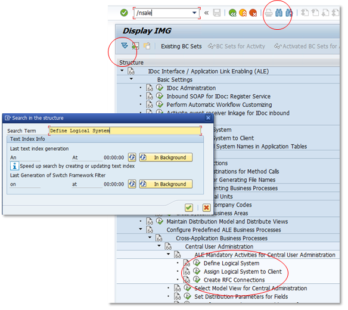

*   Double click on the entry – a warning about „Cross clientness“ will appear – OK
    Click the “**New entries**” button
    *   If the button is not there click the “**glasses**” symbol
    *   Enter a name and short description for your logical system (e.g. DSIDOCii)
    *   Click the Save button (**CTRL+S** or Disk symbol).
    *   An Enter change request dialog is displayed – OK!

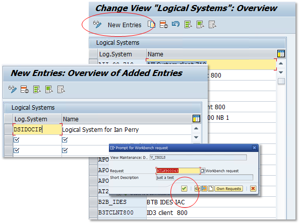

\[!\] The following step is considered optional if you are not using an IDES System (client 800)

*   In the „**sale**“ transaction find the entry „**Assign Logical System to client**“ and open it
    *   „**New Entries**“
    *   Provide city, currency code, client role
    *   Most importantly „Logical System“ (from previous step)
    *   Save and dismiss dialogs...

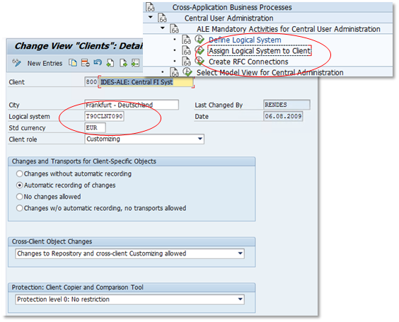

##### 2. Create RFC Connection (this will become the „channel“ which SAP will communicate with DataStage)

*   Open transaction „**sm59**“ - „**Define Target Systems for RFC Calls**“
        My system shows this as „**Create RFC Connections**“
        Create a new entry by clicking "**Create**" (F5)

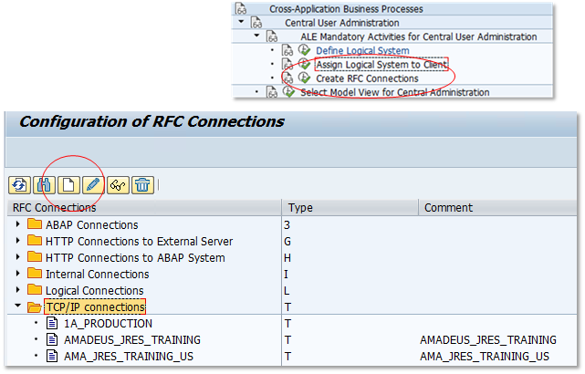

*   For ease of use make the connection name match logical system name (e.g. DSIDOCii)
    *   Connection type should be “T” (TCP/IP)
    *   Click Registered Server Program and set Program ID
        *   will be used by DSIDOC listener when doing IDOC Extract in DataStage (configured in DS SAP Administrator later on)

\[!\] For Delta Extract Stage, it is mandatory to select “Unicode” as Communication Type with target system in Unicode tab for RFC destination
\[!\] Clicking „Connection Test“ will result in an expected error at this stage as DataStage is not configured, yet... upcoming paragraph...

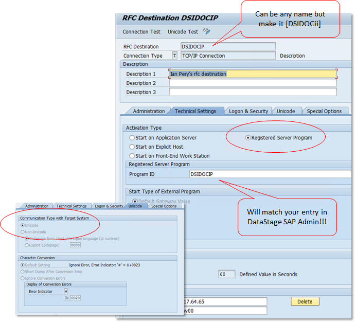

*   Open the DataStage SAP Administrator and add the SAP system to the configuration
    *   Provide the IP address and system number of SAP
    *   Provide Client Number and 2-digit language code

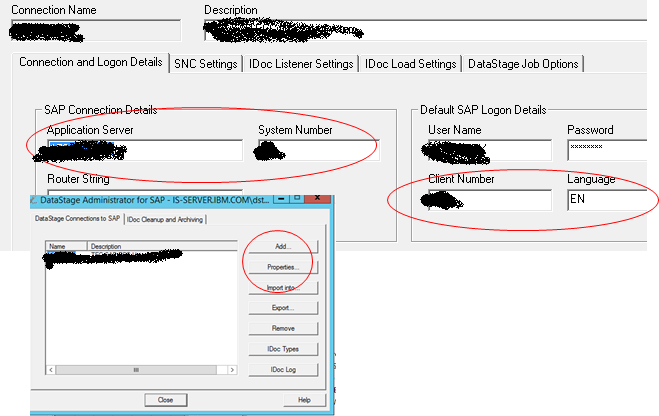

*   For receiving IDOCs: provide your SAP Program ID as configured in SAP (sm59) in „Idoc Listener Settings“

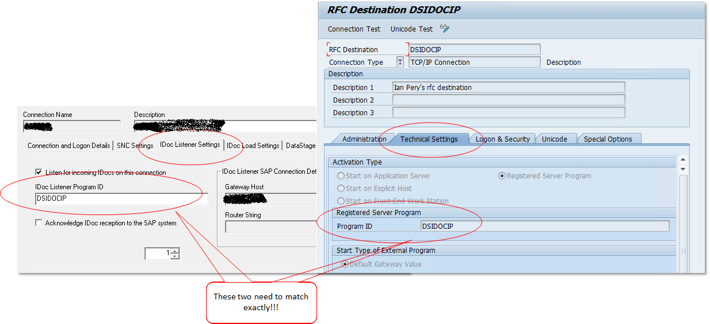

*   For sending IDOCs: Provide your SAP Program ID and Logical System ID as configured in SAP (sm59, sale) in „Idoc Load Settings“

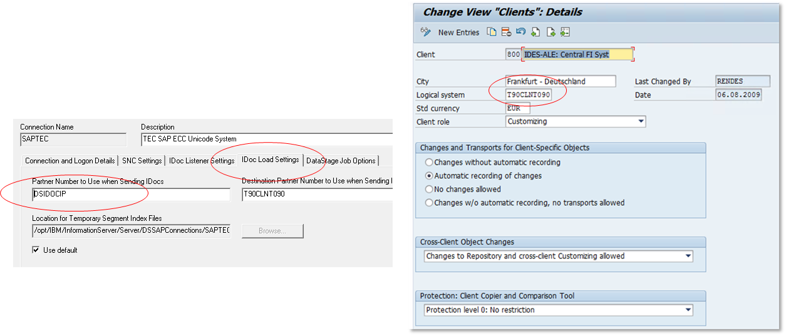

*   Uncheck the auto run option. We can control which jobs automatically will execute when IDOCs arrive on your DataStage server.

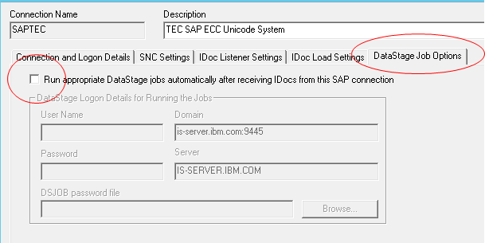

*   On the DataStage SAP Administrator open die Idoc log
    *   IDOC Listener Log shows IDOC Listener in active waiting status.
    *   If you do not see this message then you will not be able to send/receive IDOCs.

\[!\] Any time you make a change to the Idoc listener settings you need to restart the Idoc listener daemon “dsidocd.rc” \[stop | start | status\] at

“/opt/IBM/InformationServer/Server/DSSAPbin/”

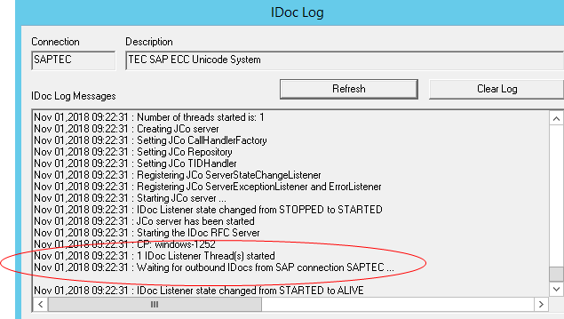

*   Going back to transaction “sm59” (RFC Configurations) you should now successfully test your SAP – DataStage communication

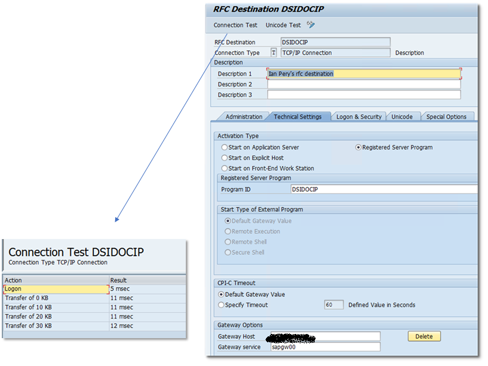

##### 3. Creating a Distribution Model

*   To transaction “sale” and open “Maintain Distribution Model…”
*   For creating a new model view, click the “Change” button
*   “Create model view”
*   Provide a description (Name and whatnot)
    *   Make the technical name be your program ID for ease of use (but it can be anything)

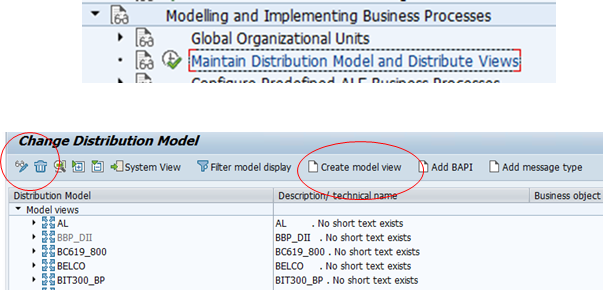

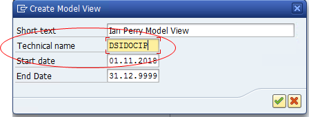

*   tell SAP which IDOCs will be sent to a partner and which the partner will send to SAP by saying “Add message type” (your model highlighted will populate the view name for you!)
*   Provide the logical name for your sender (created at the very beginning: DSIDOCIP), the logical system of our logical name of our IDES system (T90CLNT090) and the IDOC structure
    *   DEBMAS, Customer Master
    *   MATMAS, Material Master
    *   CREMAS, Vendor Master
*   Do this twice from the senders and from the receivers perspective (inbound and outbound messages)!
*   For using the Delta Extract stage two more fixed message types need to be added:
    RSINFO (outbound SAP > DS)
    RSRQST (inbound DS > SAP)

##### 4. Generate Partner Profile

*   The partner profile will contain / combine all of the information previously entered
    *   logical system of the partner system
    *   RFC destination of the partner system
    *   Model View for the Partner System
*   Transaction “sale”, entry “Generate Partner Profiles” (do a search for it)
*   Select your model and partner systems
*   Check the Output and Inbound parameters to “immediately”
*   Click the execute button

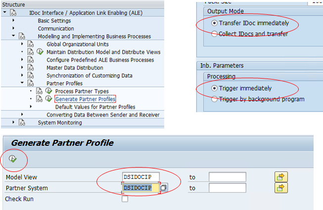

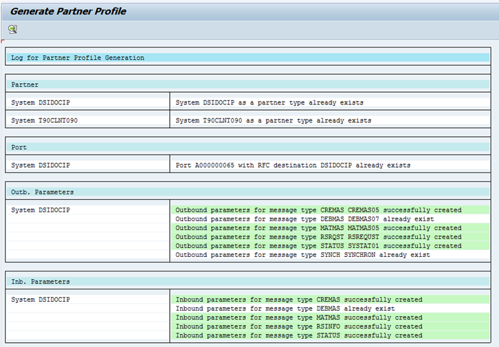

*   ... in case you receive an error…
    *   Although not obvious in the first place, the logical system name and the RFC Destination name need to exactly match for the Partner Profile to be saved successfully!!!

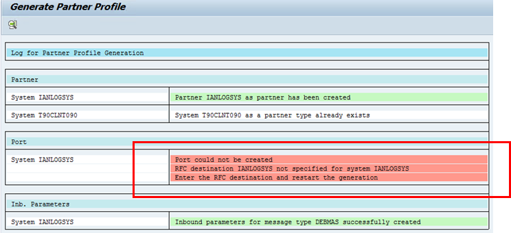

*   This is a wrong configuration when creating Partner Profiles!

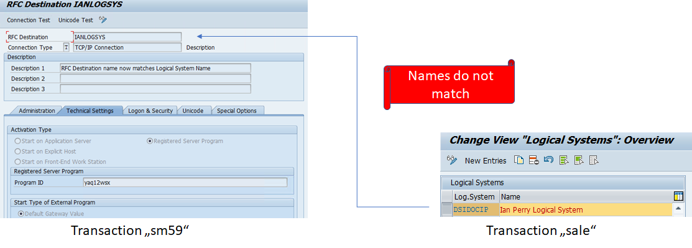

*   This is a good configuration when creating Partner Profiles!

##### 5. Test sending IDocs from SAP to DataStage

*   Open transaction "bd12"
*   Select customer 10 – 300
*   Select „DEBMAS“ (Customer Master Data) as type
*   Select your logical system
*   Click the execute button

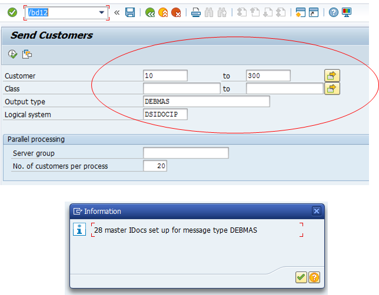

*   Check sent Idocs inside SAP (Transaction „we02“)
*   Provide the creation time and date
*   Set the „Direction“ to „1“ (outbound)
*   Provide the Basic Type „DEBMAS\*“ (\* als wildcard)
*   Set the Partner Number to your partner number
*   Click the execute button
*   \[Hint\] If you don‘t find any Idocs at all simply hit the execute button without providing values (to display any Idocs)

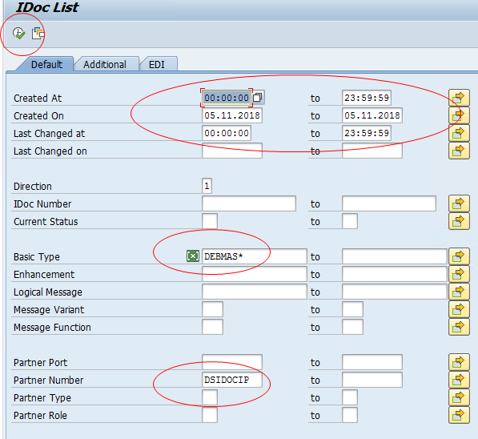

*   The Basic Types shows „DEBMAS07“
    *   This is why you provided the wildcard to DEBMAS\* while searching

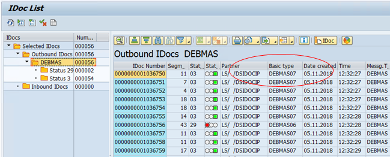

*   Check sent Idocs inside DataStage (Persistent Staging Area, PSA)
*   DataStage will show them in it‘s „PSA“ (Persistent Staging Area) area: /opt/IBM/InformationServer/Server/DSSAPConnections/SAPTEC/IDocTypes

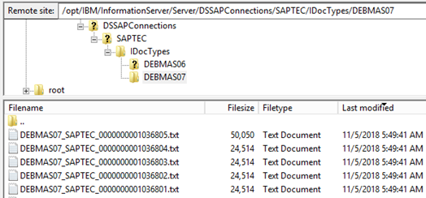

This concludes the setup of the SAP <-> DataStage communication.

#### 3. Delta Extract - additional configuration prerequisites required for specific extraction scenarios

For using the DeltaStage for extracting delta records from SAP "0FI\_GL\_4" there are some tasks to be done upfront as outlined next:

1.  Activate Change Pointers
1.  Configure prerequisites security settings in SAP before using Delta Extract Stage
1.  Configure the security settings for the SAP module in focus (e.g. Financial DataSources, FI)

##### 1. Activate Change Points

There is a need for activating change pointers generally to enable SAP to recognize changes.

*   Go to transaction "**bd61**"
*   Check the box "**Change Pointers activated - generally**"

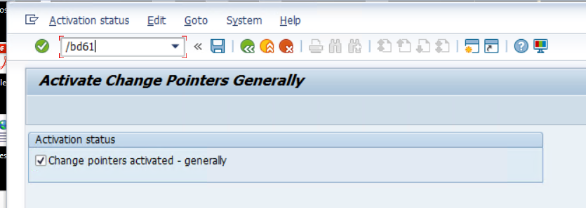

##### 2. Configure Security Settings for SAP

*   The Delta Extract Stage requires entry of the Logical System defined for the DataStage to be updated in RSBASIDOC. For a detailed description of the five steps, please refer to \[5\] for the topic "**Scenario 2: Prerequisites security settings to be done in SAP before using Delta Extract Stage**".
    *   The following screenshot is simply for your reference

##### 3. Configure the security settings for the SAP module in focus (e.g. Financial DataSources, FI)

For the usecase "**Extracting Delta Records from the General Ledger (0FI\_GL\_04)**" there is an additional configuration step on the SAP side. Again, please refer to [\[5\]](http://www-01.ibm.com/support/docview.wss?uid=swg22001268#s2) topic "**Scenario 3: Extracting from FI (Financial) DataSources**" on what and how to do this.

*   Note: This is only one time activity to be done in SAP Server and must be maintained by SAP admin team

The following screenshot is for your reference, only.

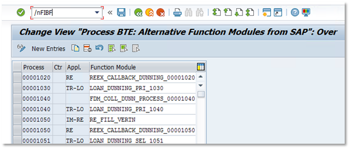

##### 4. The money sets: Creating and extracting delta records

After wrestling through all the necessary configurations (hopefully being successful) we are now at the point where we start caring about the foundational idea: Creating and receiving delta records with DataStage... yeahhhh ... party.... whohohoooo... now comes the fun part... hopefully...

When extracting delta records from a datasource it should be noted, that the datasource (queue?) is cleared from all data transferred - makes sense, or? That being said - once you did a full extract, you need to create new records which in turn will be recognized as being "the deltas" compared to your initial full run - check? Then - once you have extracted the delta records - guess what - these records are cleared from the - let's say delta queue - as well.

What do you think will happen, now, when you try re-running a delta extract job twice? Surprise - surprise ... nada ... no records! Why? Your first delta extract job cleared the datasource (or queue) - which asks for creating new records in SAP.... bdmmbdmmbdmm...

But there is help ahead: to prevent the DataStage developer from bouncing back and forth between DataStage and SAP there is a delta extract mode of "**repetitive**". By running a delta extract job in mode "R" (repetitive) the datasource is NOT cleared and you will receive the same records as in you first delta extract run... weird stuff - I know...

More weird stuff ahead: As for a security setting inside SAP ("**BWFISAFETY**") there is a minimal latency of 1 business day between creating delta records and the ability to see / extract them, I'm afraid... This means: You can only extract delta records **one day after** they have been created (I will outline this fact in the sections ahead).

On \[8\] I found the explanation for this:

"_BWFISAFETY: It is the parameter used for calculating upper limit of date for the extraction. Default value is 1. The new delta extraction uses the date + 1 of the selected entry as a lower limit for the data selection. You can control the upper limit for the data selection by changing the ' BWFISAFETY' parameter in the BWOM\_SETTINGS table. The upper limit is determined using the current date minus the value of the 'BWFISAFETY' parameter (default = 1)._"

For those of you already looking at the DeltaStage GUI you might have figured the two checkboxes where you can set the stage in "Full" or "Delta" mode, respectively. Would that mean that you have to create two different jobs for doing a full or delta extract? No! The GUI settings can be overwritten by introducing the parameter "**DS\_DELTA\_EXTRACT\_DATA\_FETCHMODE**" [\[5\]](http://www-01.ibm.com/support/docview.wss?uid=swg22001268#s2).

Let me outline the former statements about the sequence of extract modes in the following section.

##### The 3 Phases of Delta (!) record processing

Given the full run was successful (mode "**F**"), the way the delta extraction phases are as follows (outlined in [\[6\]](https://www-01.ibm.com/support/docview.wss?uid=swg22005807) and [\[7\]](https://www-01.ibm.com/support/docview.wss?uid=swg22015315):

*   Sequence of runs recommendation: “D”, “D”, “R”
    *   **First** run in delta mode (mode „**D**“) = „Initialization“ run
        \[!\] During this run, the DataSource (here “0FI\_GL\_4”) will be initialized in SAP, however data will not be extracted since initialization with data transfer is not supported in Delta Extract Stage.
    *   **Second** run in delta mode (mode “**D**”) = fetch the delta records as seen with “RSA3”
        Once you run your Delta job – the records are cleared from SAP; A second job run will not get you any records, unless …
    *   **Third** run in repetitive mode (mode “**R**”) will re-run the prior delta extract
        If you received 5 records with “D” you will receive 5 records, again! Perfect for development purposes!

As stated above: you will set your delta mode either by Delta Stage GUI or by parameter (**DS\_DELTA\_EXTRACT\_DATA\_FETCHMODE** , recommended)!

##### Extracting "Full" data from SAP

What we want to do, now is

*   do a full extract from the datasource (DS\_DELTA\_EXTRACT\_DATA\_FETCHMODE = "F")
*   apply filters to the full extract

To expose your datasource to the outside world (in our case DataStage) you got to find and **activate the datasource** for the General Ledger "0FI\_GL\_4" (for the record: a preceding "0" always indicates a default shipped-with-SAP component - whereas "Z" preceding names is always indication custom components).

*   Go to tcode „**RSA6**“
    *   Shows ootb DataSources as shipped with SAP
    *   Highlicht the top most element (SAP) and click the „Expand“ button
    *   Still highlighting the root element da a search (ctrl+F) for „**General Ledger**“
    *   Double Click „**0FI\_GL\_4**“ from the list which leads back to the initial sceen your DataSource highlighted
*   If you do not see your DataSource here it needs to be activated from the BI repository, first ... (tcode **RSA5**, next steps below)

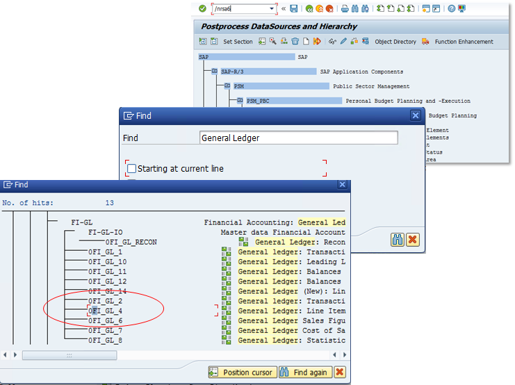

(Optional) Only if your DataSource does not show up in „**rsa6**“ above:

*   Go to tcode „**RSA5**“
*   Shows ootb DataSources as shipped with SAP
*   Search for your DataSource as described with previous slide (rsa6)
*   Activate your DataSource by highlighting it an clicking „**Activate DataSource**“
*   A change request window will open
    *   Say „**Own request**“ and click the excecute mark
    *   The bottom message line should then read „**Action successfully completed**“
*   Locate your activated DataSource in tcode „**rsa6**“, then

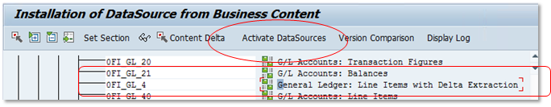

Once you activated the datasource you are ready to find your datasource in DataStage (Delta Extract Stage) and pull data from it.

*   Create a simple DS job holding a Delta Stage and a DataSet
*   Configure your DeltaStage with the Sap System set up in the DataStage Administrator for SAP and validate it
    *   Most of the time when validation fails it‘s because the Idoc listener is not started or the Idoc configuration is missing / has issues
        *   \[!\] Any time you make a change to the Idoc listener settings you need to restart the Idoc listener daemon “**dsidocd.rc**” \[stop | start | status\] at “**/opt/IBM/InformationServer/Server/DSSAPbin/**”

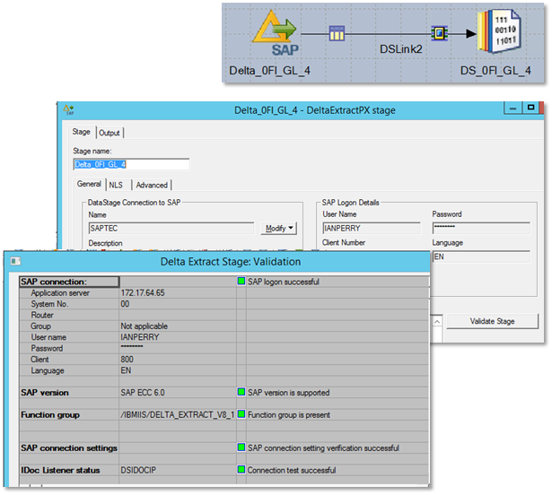

*   On the „**Output**“ tab hit „Select“ and find the DataSource „**0FI\_GL\_4**“
*   If you don‘t find „your“ DataSource got back to tcode **RSA5** and **RSA6** and check whether the DataSource has been activated.
*   „Data Fetch Mode“: ‚**Full**‘
    *   The settings (Full, Delta, Repetitive) can overwritten with a parameter „DS\_DELTA\_EXTRACT\_DATA\_FETCH\_MODE“ - we make use of this option, later.

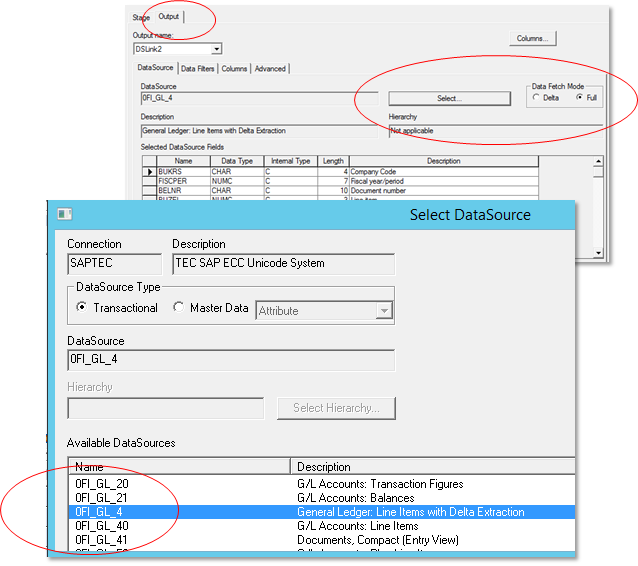

Compile and run your job - tataaa! One down - many to go...

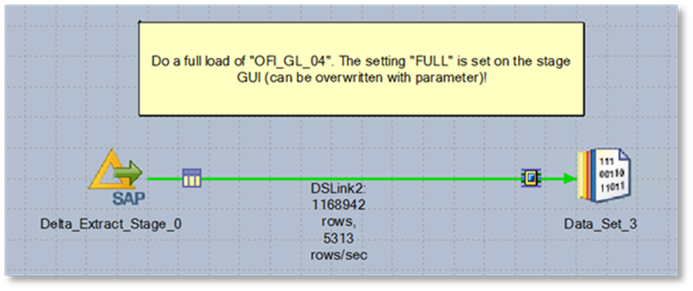

##### Full extract with filters applied

As the filter options you want to apply in your job need to exactly match the SAP guidelines (e.g. what filters exist, what values are allowed and what numbers to expect) we initially will look what is available on the SAP side; Then after getting an idea what to expect from SAP we implement the filtering in our Data Extract job. If the filtering does not adhere to the SAP values prescribed by SAP the job will not run / cancel; Please note that the filters are applied inside SAP - not inside DataStage!

*   Got to tcode „**RSA3**“ (Extractor Checker S-API)
*   Enter „**0FI\_GL\_4**“ as your DataSource
    *   Unfortunately searching for it did not work, here (for me?)
*   Apply „**Settings**“ values as seen on screenshot, esp. „**Update mode**“ = ‚**F**‘
*   No need to set „**Target sys**“, now
*   Look at the „Selections“ provided and have „**BURKS**“(Buchungskreis) ‚**0001**‘ (SAP Walldorf)
    *   we will filter on exact this value in DataSTage
*   Hit the „**Execute**“ button

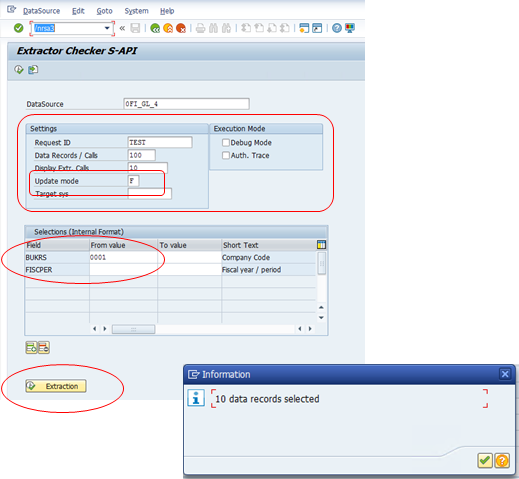

The screen changes and you can see the filtered records inside SAP by clicking „**ALV Grid**“

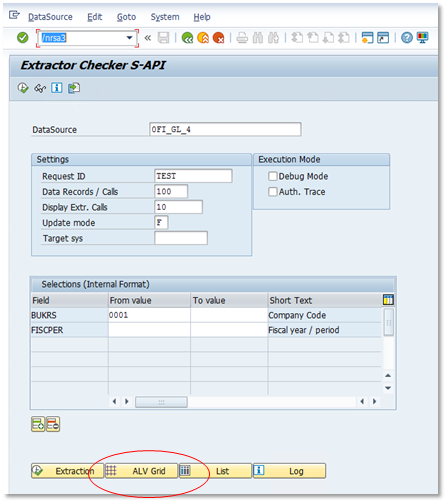

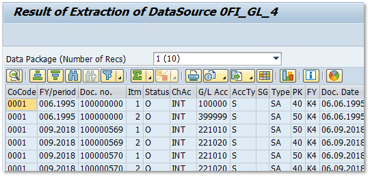

Now let‘s filter out the records in DataStage.

*   In the "**Data Filters**" tab select the columns you want to filter on (as provided by SAP)
*   Pick the **Operator**
    *   „**\=**“ (String) and „**\[\]**“ (in between, low value; high value) supported
    *   The Value needs to exactly match the value as seen inside SAP!
        *   Check inside SAP first what filters apply (see above)
*   You need to „**Activate Filters**“
*   Compile, run the job
    *   The job will not run / abort if you applied a wrong filter!

Now the results are much fewer due to the filtering!

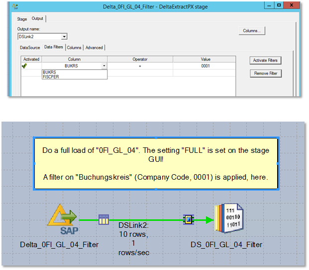

Oookeeyyy... we achieved something 'til now... let me recommend stretching out your legs and back, grab a coffee - because we are going to to the Delta Extract part!

##### Extracting "Delta" records from SAP

As before we will first check what we are doing and what to expect on the SAP side and then try to get the same results inside DataStage, agree?

##### Creating and checking new records for 0FI\_GL\_4 in SAP

*   Go to „**FB50**“ – the company code will default to „**0001**“
*   Select a Document and **Posting Date** (current day)
*   \[!\] Beware: it takes SAP 1 day for changes to be exposed as Deltas (security setting) – so you will capture „todays“ changes „tomorrow“ the earliest!
*   Select two accounts (Credit and Debit)
    *   „**221010**“ – Bank discount charge (Credit)
    *   „**221020**“ – Bank collection char (Debit)
*   Enter an „**Amount in doc.curr**“ ‚**Cred**.‘ which you will easily recognize, later (e.g. 9,98 or 12,12)
    *   In the „**Debit**“ field „**\***“ adds the same value automatically to the transaction
*   Save (not ‚Park‘) the transaction with „**CTRL+S**“ (or click the ‚Disc‘ Icon at the very top menu (again: NOT ‚Park‘)
    *   The document id is shown for reference

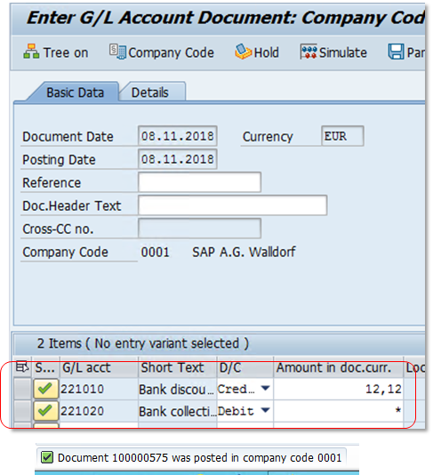

Check whether the records have been created using tcode „**se16**“, table „**BSEG**“ - this does NOT imply they are exposed / recognized as delta records!; all of my tests are listed here!

\[Note\] I tailored the display to have the doc #, Date and Amount next to another for recognizing them easier.

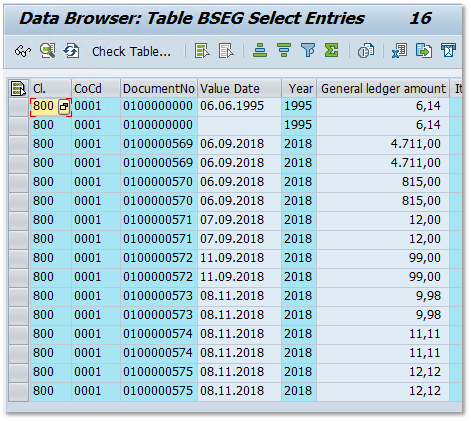

Now let‘s check how many records are exposed as „Delta Records“ inside SAP - drums please...

*   Open tcode „**RSA3**“, enter your DataSource “**0FI\_GL\_4**“
*   Enter „**Settings**“
    *   \[!\] This time set „**Update Mode**“ to ‚**D**‘
    *   This time you need to set „**Target sys**“ to your configured DataSource (which should reflect your DataStage connection)
*   Execute the transaction

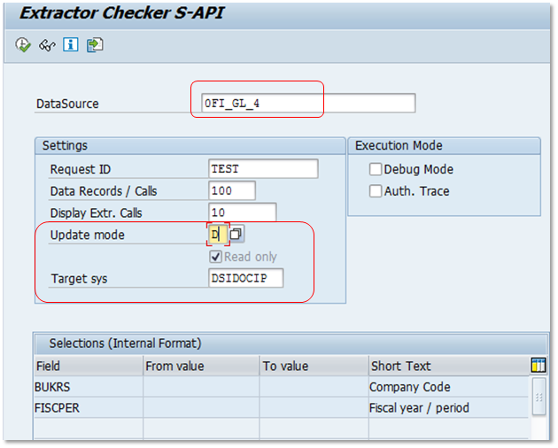

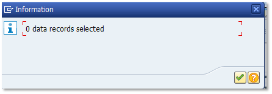

... uhhh... „0 data records selected“?

Remember the remark about deltas only shown the next day (because of a security setting of '**BWFISAFETY**')? "Today's delta records will show up in RSA (Delta mode) „tomorrow“ (even though you find them in your BSEG table!)?"

Now you have it! This would be a good time to wrap up for today and carry on tomorrow - you have been very brave until now - good night!

... one day later the things look different... Good morning everybody! A new day - a new chance for extracting delta records...

Please repeat the sequence above - and expect a different (reading "positive" result :-) )

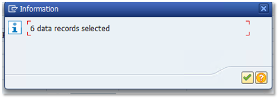

For displaying the records click on "**ALV Grid**" at the bottom of the SAP page (rsa3).

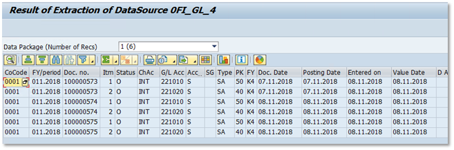

NOW its time to create and run a DataStage job, which extracts the delta records!

Remember the "3 Phases of delta record processing", above? Let re-iterate them for a better understanding what runtime behavour is about to be expected:

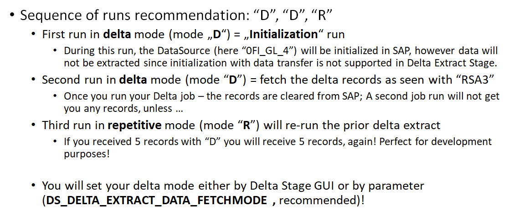

*   Create a simple DS job holding a Delta Stage and a DataSet or reuse the one from before
*   Introduce the parameter „**DS\_DELTA\_EXTRACT\_DATA\_FETCHMODE**“
*   Run the delta extract job in delta mode „**D**“ as you want new deltas being retrieved
    *   This first run in mode "**D**" is an **initialization** run - no records are being expected!

    _"\[!\] During this first run, the DataSource will be initialized in SAP, however data will not be extracted since initialization with data transfer is not supported in Delta Extract Stage. Subsequent runs of the job with Delta data fetch mode will extract the Delta data."_

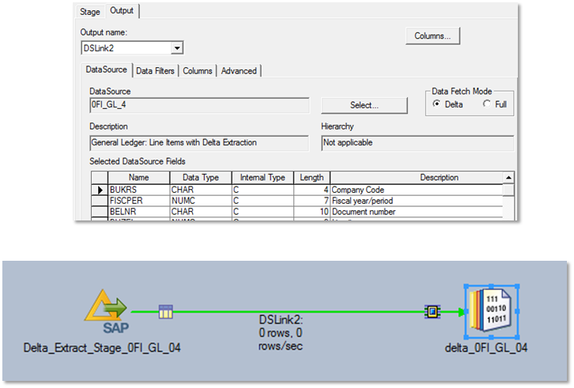

This **first run** is referred to as the "**initialization** run"!

Good to know: Once the initialization run is through the datasource will show up in transaction "**rsa7**" "**BW Delta Queue Maintenance**" (initialization sets a timestamp)

After this "initialization run" repeat the exact first run – but this time you will get your records!

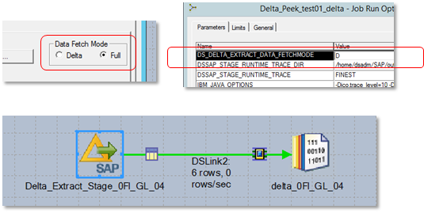

Success! We received "our" 6 delta records which we have seen while pre-checking in SAP, above!

This **second run** is referred to as a true "**delta** run" (which clears the extracted data from the queue).

Some remarks / reminder about what happens "in the back":

*   Extracting the delta records will clear the delta queue on SAP side (BW Delta Queue, RSA7) – so a subsequent run will NOT give you any records!
*   Clearing this BW queue does not impact other components as each queue is bound to a logical system
*   We will overcome this clearing of the queue in doing „R“ (repetitive) for subsequent runs (esp. useful when in development and testing things), next
*   Recognize the use of the job parameter „DS\_DELTA\_EXTRACT\_DATA\_FETCHMODE“ for overwriting the GUI settings!
*   By using the parameter you can have Data Extract Mode set to „Full“ but re-use the same job for delta runs (and repetitive runs), as well!

Now we want to re-run this job (for development purposes)

*   If you simply try re-running your delta job in „D“ mode you will not receive any data – the SAP delta queue has been cleared!
*   To overcome the need for recreating deltas over and over, again in SAP (which would only show up ‚the next day‘) let's introduce the value „**R**“ (repetitive) to the parameter „**DS\_DELTA\_EXTRACT\_DATA\_FETCHMODE**“
*   Run the job – and find your records „re-extracted!“ [\[7\]](https://www-01.ibm.com/support/docview.wss?uid=swg22015315)

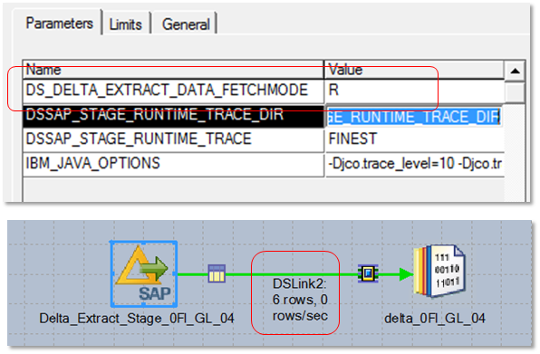

    This marks the end of the practical part of the tutorial!

#### 5. Final thoughts and Summary

First and foremost - thanks for standing by and having the nerve to walk through all of this - I hope the article served its purpose well. I tried to make it kind of entertaining but also to the point for you to get your task done.

Let me add a little disclaimer: It comes without saying that there will be issues in the descriptions, screenshots, grammar and orthography (and alike) throughout this article - please bear with me - and please provide feedback about what needs to be fixed / more clarifications.

Summary of what have we achieved?

1.  We configured the communication (RFC / IDoc) between SAP and DataStage
    This is not a trivial task if you are not "in" SAP - I would suggest to have an SAP admin / consultant support this task
1.  We ran initial test about IDoc communication between the two parties
    Running some "easy" ABAP extract and / or IDoc extract jobs are my way of testing whether \#1 worked (we have a working connection / interaction). Like before - if you can't get the two parties (communication partners) see each other some network- and / or SAP admins will do you good
1.  We introduced the "theory" behind delta extract processing (latencies, phased approach)
    The fact that new data records created in SAP will only show up "the next day" was something which we need to live with (until someone teaches me otherwise). Extracting those delta records with the Delta Stage can be run in mode "Full", "Delta" and "Repetitive"; these modes can be provided by parameter. The first "Delta" run is an initialization run an won't extract any data. Both, the full and delta run will clear its own queue (queues are bound to a logical system so other logical systems using the same datasource are not impacted!)
1.  We created and extracted delta records in both SAP and DataStage (full - with filter, repeatedly)
    As from the theory in \#3 we build a DataStage job to extract data in mode 'Full' (with filters applied), in mode 'Delta' and re-running the Delta job in mode 'Repetitive'.

Thanks to everybody supporting me throughout my journey towards SAP and the Delta Packs - you know who you are!

##### References

The list of the most important resources follows:

\[0\] [IBM InfoSphere Information Server Pack for SAP Applications (official documentation)](https://www.ibm.com/support/knowledgecenter/SSZJPZ_11.7.0/com.ibm.swg.im.iis.ds.entpak.sapr3.use.doc/topics/overview.html)

\[1\] [Installing IBM InfoSphere Information Server Pack for SAP Applications 8.1](https://www-01.ibm.com/support/docview.wss?uid=swg22016309#pack)

\[2\] [Prerequisite patches and libraries for IBM InfoSphere Information Server Pack for SAP Applications 8.1](https://www-01.ibm.com/support/docview.wss?uid=swg22016343)

\[3\] [Configuring the SAP dispatch/gateway service](https://www.ibm.com/support/knowledgecenter/SSZJPZ_11.7.0/com.ibm.swg.im.iis.ds.entpak.sapr3.use.doc/topics/t_pack_r3_Configuring_the_SAP_Dispatch_Gateway_service.html)

\[4\] [SAP security and deployment best practices for InfoSphere Information Server Pack for SAP Applications 8.1](http://www-01.ibm.com/support/docview.wss?uid=swg22016310)

\[5\] [Delta Extract - additional configuration prerequisites required for specific extraction scenarios](http://www-01.ibm.com/support/docview.wss?uid=swg22001268#s2)

\[6\] [Usage guidelines for Delta Extract Stage](https://www-01.ibm.com/support/docview.wss?uid=swg22005807)

\[7\] [Delta Extract stage data fetch mode R (Repetitive)](https://www-01.ibm.com/support/docview.wss?uid=swg22015315)

\[8\] [BWOM\_SETTINGS for FI loads in SAP BI](https://blogs.sap.com/2013/04/02/bwomsettings-for-fi-loads-in-sap-bi/)

\[9\] [Delta Extract Stage - tested SAP DataSources](https://www-01.ibm.com/support/docview.wss?uid=swg22005956)

\[10\] [Troubleshooting Delta Extract Stage issues](http://www-01.ibm.com/support/docview.wss?mhq=RSINFO&mhsrc=ibmsearch_a&uid=swg22005897)

\[11\] [General Ledger: Line Items](https://help.sap.com/saphelp_nw70/helpdata/en/c8/548853f65d3d58e10000000a174cb4/frameset.htm)
