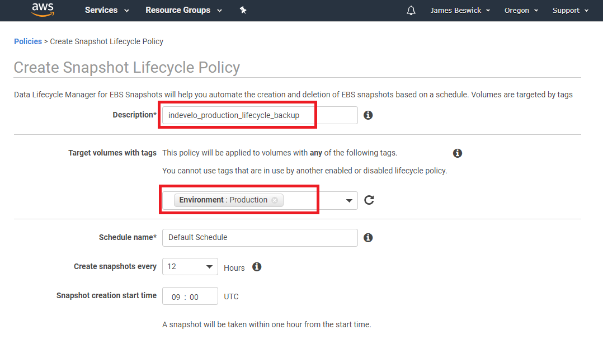
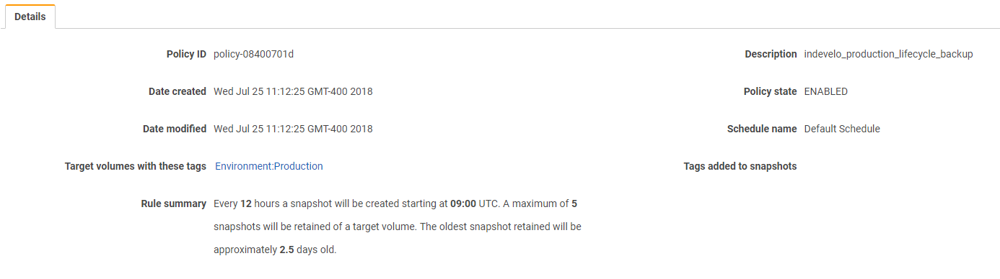

# A Simple Guide for Creating an AWS Snapshot Lifecycle Policy

GiladMaayan

Published on July 30, 2019 / Updated on November 10, 2020

### Overview

Skill level: Intermediate

### Ingredients

Snapshots can be helpful when safeguarding Amazon Elastic Compute Cloud (EC2) instances, however, managing snapshots can become more difficult with scale. It’s one task to develop snapshots for a handful of Amazon EC2 instances, but it’s a much more demanding task to develop snapshots for a thousand instances.

Furthermore, snapshot management involves more than simply developing snapshots, as at a certain stage you may want to start getting rid of old snapshots that are not relevant anymore. Amazon Web Services (AWS) lets you automate the process by letting you create snapshot lifecycle policies. Let’s look at AWS EBS snapshots, and how these policies function.

### Step-by-step

#### 1. What Are AWS EBS Snapshots?

Amazon Elastic Block Store (Amazon EBS) offers persistent block-level storage for Amazon Elastic Compute Cloud (Amazon EC2) instances. In essence, the service assigns dependable hard drive (aka volumes) to cloud services. A helpful feature of Amazon EBS is creating snapshots of EBS volumes. Amazon Knowledge Base, notes that AWS EBS snapshots are backups of EBS volumes. Let’s see more about how EBS snapshots function.

**What is an EBS Snapshot?**

An EBS snapshot is a point-in-time copy of an Amazon EBS volume, which is copied to Amazon Simple Storage Service (Amazon S3). Only unique blocks of EBS volume data that have altered since the last EBS snapshot are kept in the next EBS snapshot. In this way, the EBS snapshots are incremental copies of the data.

Each [AWS snapshot](https://cloud.netapp.com/blog/azure-aws-snapshots-explained "AWS snapshot") has all the information you require to restore your data from the point when you created the EBS snapshot. EBS snapshots are joined together like a chain. When you use then you can restore your EBS volumes, when you require.

To delete an EBS snapshot you need to remove only the data connected to that particular snapshot. In this way, you can delete any outdated snapshot without harm. If you delete an outdated snapshot, AWS will combine the snapshot data: all valid data will be used in the next snapshot and all irrelevant data will be done away with.

#### 2. How Snapshots Were Created Before the Native Automation Process

Before the native automation process, we need to rely on shell scripts or [API calls](https://apifriends.com/api-management/whats-api-call/ "API calls") to take snapshots. There was no native way to automate snapshots and if you used scrips you scripts could fail. You also had to monitor the scripts you were using. Afterwards, AWS created Lambda, a serverless service which solved some of these issues. However, you still needed to develop code for the snapshot lambda function or use code from the internet.

#### 3. What Is the Amazon Data Lifecycle Policy Manager?

**What is Amazon Data Lifecycle Manager?**

Amazon DLM is a tool that gives you an automated way to keep, back-up and delete your EBS volumes. For Amazon DLM to carry out a backup on an EBS volume, you need to tag it; and then, via the Amazon DLM policy, instruct it when to carry out the backup. Amazon DLM is permitted to add multiple tags on a single EBS volume, so you can run multiple policies on it if you require it.

An Amazon DLM lifecycle policy manages which resources you back-up and when they are backed up. It is made up of three central settings:

*   **Resource type**—describes the nature of the resource that will be backed up. Currently, the only supported value is “VOLUME”.
*   **Target tag**—key-value pair used to mark the volume you want to back-up.
*   **Schedule**—states the period of time in which the volume will be backed up.

#### 4. How to Automate AWS Snapshots with the Lifecycle Policy

**Why do you require lifecycle management for snapshots?**

As we have seen snapshots are incremental backups that only keep the difference between backup states—in this way you can create a snapshot faster than you can perform a full backup.

The limitation is that AWS limits you to 10,000 snapshots per account. It is possible to reach this limit if you are running daily snapshots over a fleet of instances. Also, according to your backup needs, you may not need to retain more than a few snapshots per instance, if this is the case it is logical to delete old snapshots.

**Prepping prior to the onset**

Using AWS you can create a policy that targets your whole inventory of volumes, using tagging. For example, you can establish a tag called “Environment’ with the value ‘Production’ and make sure that all of your production volumes are factored into the backup policy.

Then again, you can choose to tag by client, project or department, or any grouping that is logical for your business. Once you have added to the tags to your volumes you can move onto the next step.

**Creating the lifecycle policy**

In the [Lifecycle Manager](https://aws.amazon.com/about-aws/whats-new/2018/07/introducing-amazon-data-lifecycle-manager-for-ebs-snapshots/ "Lifecycle Manager") screen, you need to describe the policy, the name of the volume tags you are selecting, and scheduled time for backups. You may also wish to state how many snapshots are retained for each volume:

When you press the Create button your policy will go live. The policy does not run instantly, rather you will need to let the first window define your rules. You will see a summary of your policy in the main Lifecycle Manager window:

Note: Lifecycle Manager is a per-region service — if you set policies in one region they won’t back up volumes in a different region.

#### 5. Wrap Up

If you have EBS volumes in production, it is worthwhile looking to determine how many are factored into a backup schedule. In a lot of production environments, there are a handful of EBS volumes that are accidentally excluded, and this can be terrible when there is a failure or accidental instance termination.

You may also choose to enforce tagging rules by using AWS Config to help you identify any production volumes that are missing tags. This is a good way to control large numbers of EBS volumes or intricate AWS environments and to ensure that all of your production volumes are backed up.
