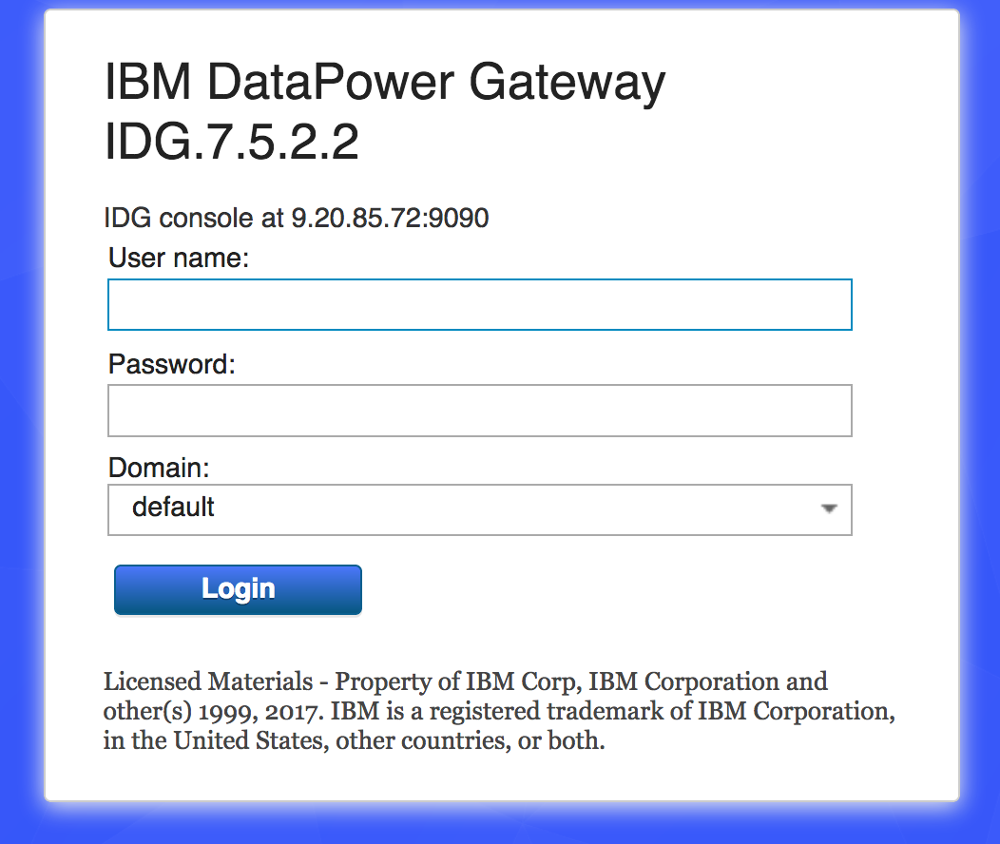
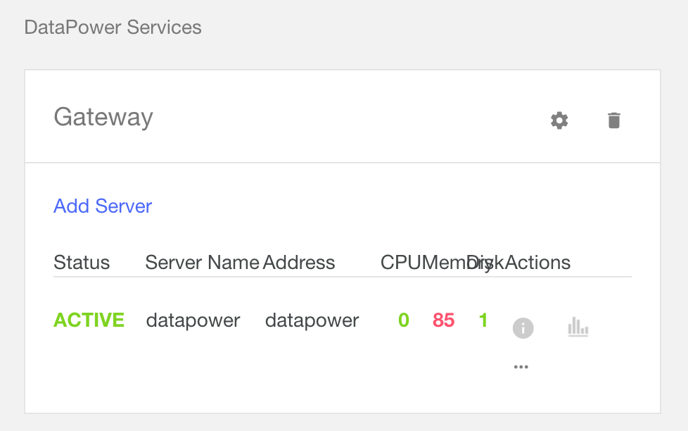

# API Connect : Customising HTTP Headers for Client ID and Secret
## Often we are asked by customers how they can modify the headers for the client id and client secret. Our standard response has been this is a trivial extension in IBM DataPower by adding an extra transform to the Multi Protocol Gateway. However not everyone understands what we mean!

Chris Phillips

Tags: Cognitive computing, Continuous engineering, Internet of Things (IoT), Mobile development

Published on March 30, 2017 / Updated on December 4, 2019

### Overview

Skill Level: Any Skill Level

Knowledge of DataPower will help

API Connect requires Client ID and Client Secret to be published with x-ibm-client-id & x-ibm-secret-id. This guide will tell you how to add a transform policy allowing you to set any header and map the values on to the x-ibm-client-id & x-ibm-secret-id.

### Ingredients

* API Cloud, Containing at least
  * API Manager (V5.0.X)
  * Datapower (V7.5.2.X)
* Text Editor

**Points to consider.**

* In this tutorial we explain how to save this configuration as a Gateway Extension. If the Gateway Extension is not configured API Connect will overwrite these changes during a future upgrade or any event that requires a resynchronisation.
* The example provided here does not stop the API Connect Out of the Box headers from working if the custom headers are not set.
* The Developer Portal will always show the Out of the Box Headers not the custom headers.
* This will not work in IBM BlueMix Public

### Step-by-step

#### 1. Name the headers

    Decide what values you want to use for the Client ID and Client Secret header. Though these can be changed later it can break your existing consumers if you need to change.

    The example in this recipie uses myClientIDHeader and mySecretIDHeader.

    A sample curl command would look like below, where clientidval is the ClientID value and secretidval is the SecretID value.

```
    curl -v -H “myClientIDHeader:clientidval” -H “mySecretIDHeader:secretidval” https://Datapower:443/
```

#### 2. GateWay Script

    Take the following GateWay Script code and replace myClientIDHeader and mySecretIDHeader with your desired values. Save this as an xslt file on your local system. It is recommended that you check this file into a source code management system.
```
    var hm = require('header-metadata');  

    var clientId = hm.current.headers.myClientIDHeader;  
    var clientSecret = hm.current.headers.mySecretIDHeader;  

    if (clientId) {   

    hm.current.set('x-ibm-client-id', clientId);   

    if (clientSecret){  

     hm.current.set('x-ibm-client-secret', clientSecret);  

     } }
     ```

#### 3. Log into a DataPower that contains an API Connect Domain

    

#### 4. Go to the API Connect Domain

    

#### 5. Go to the webapi Multi-Protocol Gateway

    

    Then click on webapi.

    

#### 6. Click on the pencil by the Multi-Protocol Gateway Policy

    

#### 7. Select the webapi-mpgw-resuqest-fw and Drag a GatewayScript icon from the tool bar to the start of the flow. This should end up after the first matching policy as shown in the diagram.

    

#### 8. Double click on the new transform

#### 9. Ensure Local:// is selected in the Transform File and click Upload

    

    **Make sure the output is set to NULL not auto as in the diagram above**

#### 10. Navigate to the xslt you saved in step 3.

    

#### 11. Press Done

#### 12. Press Apply Policy

#### 13.Press Close Window

#### 14. Time to Test

    Now we test the transform before we push this to all DataPowers.

    This can be tested with curl, please ensure you update the header name, and DataPower hostname. If you do not want to use valid client id and secrets you can look in the DataPower Log for the ClientID at the debug level.

```
    curl -v -H “myClientIDHeader:clientidval” -H “mySecretIDHeader:secretidval” https://Datapower:443/
```

#### 15. Applying this to an entire DataPower Service

    Assuming the Test in 14. passed we now need to export these changes as a Gateway Extension.

    Though it might be tempting to not create a Gateway Extension but instead to just make the changes in each DataPower Domain I recommend against this.

    API Connect will redeploy the DataPower domain overwriting any configuration it is not aware of.

#### 16. In IBM DataPower go to Export Configuration

    

#### 17. Press Next

#### 18. Select Processing Request from the available objects and webapi-mpgw-request-fw. Click “Include data for all objects that the selected objects require” and “Export only file for selected objects “

    

#### 19. Click Download

#### 20. Go to the CMC Console http://APIManager/cmc

#### 21. Click on Services

#### 22. For each DataPower service you wish to apply this to click on the Cog

    

#### 23. Click Choose File and browse to the file exported from data power.

    

#### 24. Each IBM DataPower Node in that service will now be refreshed and apply the gateway extension, this will take about ten minutes

#### 25. Thats It!
