# Big Data and Hadoop on IBM Cloud
## Explain how to work with Hadoop on IBM cloud

RafieTarabay

Tags: Big Data and analytics

Published on September 5, 2018 / Updated on November 9, 2020

### Overview

Skill Level: Any Skill Level

The speed and forms in which Data is generated makes it difficult to manage and process through traditional DataBases. Here comes Big Data technologies like Hadoop.
Big Data is important for predictions, analysis and to get better decision making.

### Step-by-step

#### 1. Big data presents big opportunities

Extract insight from a high volume, variety and velocity of data in a timely and cost-effective manner

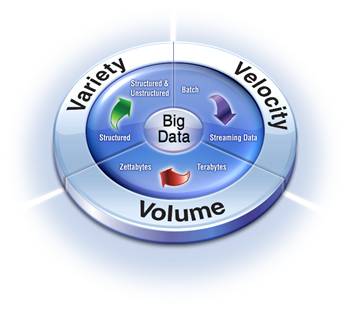

Variety: Manage and benefit from diverse data types and data structures

Velocity: Analyze streaming data and large volumes of persistent data

Volume: Scale from terabytes to zettabytes

**Traditional Approach (BI) vs Big Data Approach**

*   **Traditional Approach (BI):** \[Structured & Repeatable Analysis\] Business Users Determine what question to ask then IT Structures the data to answer that question
*   **Big Data Approach:** \[Iterative & Exploratory Analysis\] IT Delivers a platform to enable creative discovery then Business Explores what questions could be asked

**What is Hadoop?**

Hadoop is an open source distributed processing framework that manages data processing and storage for big data applications running in clustered systems. It is at the center of a growing ecosystem of big data technologies that are primarily used to support advanced analytics initiatives, including predictive analytics, data mining and machine learning applications. Hadoop can handle various forms of structured and unstructured data, giving users more flexibility for collecting, processing and analyzing data than relational databases and data warehouses provide.

Apache Hadoop is developed as part of an open source project.  
**Commercial distributions of Hadoop** are currently offered by four primary vendors of big data platforms:  
– Cloudera  
– Hortonworks  
– Amazon Web Services (AWS)  
– MapR Technologies.

In addition, IBM, Google, Microsoft and other vendors offer cloud-based managed services that are built on top of Hadoop

IBM, Microsoft’s Azure HDInsight, and Pivotal (a Dell Technologies subsidiary) are based on the Hortonworks platform.  
while Intel use Cloudera.

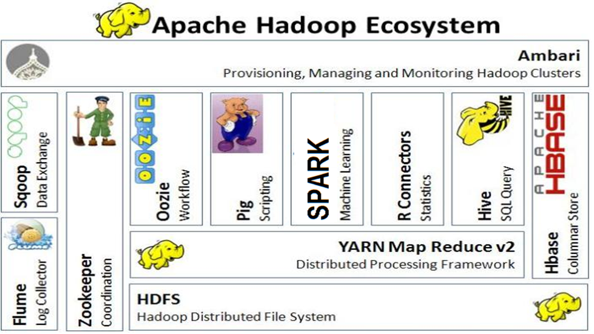

**The 4 Modules of Hadoop**

**1\. Distributed File-System HDFS:** allows data to be stored in an easily accessible format, across a large number of linked storage devices

**2\. MapReduce:** MapReduce do two basic operations – reading data from the database, putting it into a format suitable for analysis (map), and performing mathematical operations i.e counting the number of males aged 30+ in a customer database (reduce).

**3\. Hadoop Common:** provides the tools (in Java) needed for the user’s computer systems (Windows, Unix or whatever) to read data stored under the Hadoop file system.

**4\. YARN:** manages resources of the systems storing the data and running the analysis.

**Advantages and disadvantages of Hadoop**

**Hadoop is good for:**

*   processing massive amounts of data through parallelism
*   handling a variety of data (structured, unstructured, semi-structured)
*   using inexpensive commodity hardware

**Hadoop is not good for:**

*   processing transactions (random access)
*   when work cannot be parallelized
*   Fast access to data
*   processing lots of small files
*   intensive calculations with small amounts of data

**What hardware is not used for Hadoop?**

*   RAID
*   Linux Logical Volume Manager (LVM)
*   Solid-state disk (SSD)

**Big data tools associated with Hadoop**

**Apache Flume:** a tool used to collect, aggregate and move huge amounts of streaming data into HDFS  
**Apache HBase:** a distributed database that is often paired with Hadoop  
**Apache Hive:** an SQL-on-Hadoop tool that provides data summarization, query and analysis  
**Apache Oozie:** a server-based workflow scheduling system to manage Hadoop jobs  
**Apache Phoenix:** an SQL-based massively parallel processing (MPP) database engine that uses HBase as its data store  
**Apache Pig:** a high-level platform for creating programs that run on Hadoop clusters  
**Apache Sqoop:** a tool to help transfer bulk data between Hadoop and structured data stores, such as relational databases  
**Apache ZooKeeper:** a configuration, synchronization and naming registry service for large distributed systems.  
**apache Solr:** enterprise search engine  
**Apache Spark:** Spark is an alternative in-memory framework to MapReduce, Supports streaming, interactive queries and machine learning.  
**Kafka:** distributed publish-subscribe messaging system and a robust queue that can handle a high volume of data.

**GUI tools to manage Hadoop**

*   **Ambari:** developed by HortonWorks.
*   **HUE:** developed by Cloudera

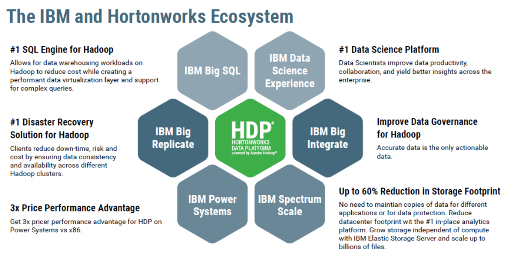

**What is IBM Big SQL?**

– Industry-standard SQL query interface for BigInsights data

– New Hadoop query engine derived from decades of IBM R&D investment in RDBMS technology, including database parallelism and query optimization

**Why Big SQL?**

– Easy on-ramp to Hadoop for SQL professionals

– Support familiar SQL tools / applications (via JDBC and ODBC drivers)

**What operations are supported**

– Create tables / views. Store data in DFS, HBase, or Hive warehouse

– Load data into tables (from local files, remote files, RDBMSs(

– Query data (project, restrict, join, union, wide range of sub-queries, and built-in functions, UDFs, etc.(

– GRANT / REVOKE privileges, create roles, create column masks and row permissions

– Transparently join / union data between Hadoop and RDBMSs in single query

– Collect statistics and inspect detailed data access plan

– Establish workload management controls

– Monitor Big SQL usage

**IBM Big SQL Main Features**

**1- Comprehensive, standard SQL**

– SELECT: joins, unions, aggregates, subqueries

– GRANT/REVOKE, INSERT … INTO

– PL/SQL

– Stored procs, user-defined functions

– IBM data server JDBC and ODBC drivers

**2- Optimization and performance**

– IBM MPP engine (C++) replaces Java MapReduce layer

– Continuous running daemons (no start up latency)

– Message passing allow data to flow between nodes without persisting intermediate results

– In-memory operations with ability to spill to disk (useful for aggregations that exceed available RAM)

– Cost-based query optimization with 140+ rewrite rules

**3- Various storage formats supported**

– Text (delimited), Sequence, RCFile, ORC, Avro, Parquet

– Data persisted in DFS, Hive, HBase

– No IBM proprietary format required

**4- Integration with RDBMSs via LOAD, query federation**

**Why choose Big SQL instead of Hive and other vendors?**

**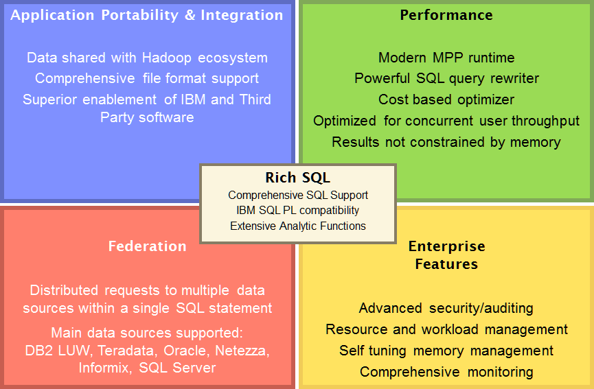**

**IBM Spectrum Scale (Also know as “GPFS FPO”)**

What is expected from IBM Spectrum Scale ?

• high scale, high performance, high availability, data integrity

• same data accessible from different computers

• logical isolation: filesets are separate filesystems inside a filesystem

• physical isolation: filesets can be put in separate storage pools

• enterprise features (quotas, security, ACLs, snapshots, etc.)

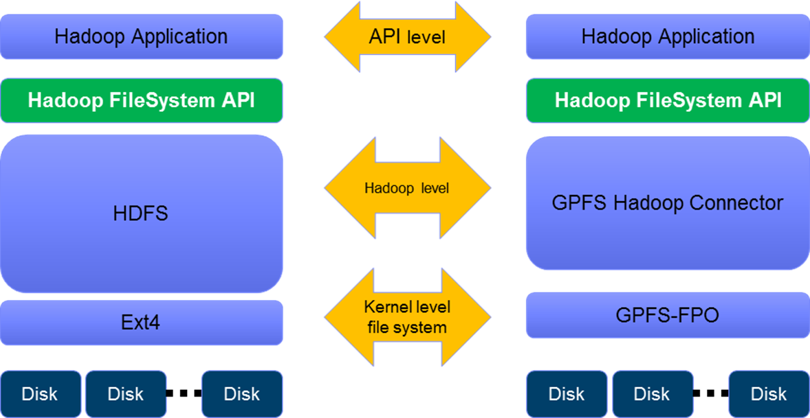

**HDFS vs GPFS Commands**

**1) Copy File**

**– HDFS:** hadoop fs -copyFromLocal /local/source/path /hdfs/target/path

**– GPFS:** cp /source/path /target/path

**2) Move File**

**– HDFS:** hadoop fs -mv path1/ path2/

**– GPFS:** mv path1/ path2/

**3) Compare Files**

**– HDFS:** diff < (hadoop fs -cat file1) < (hadoop fs -cat file2)

**– GPFS:** diff file1 file2

**HDFS vs IBM Spectrum Scale**

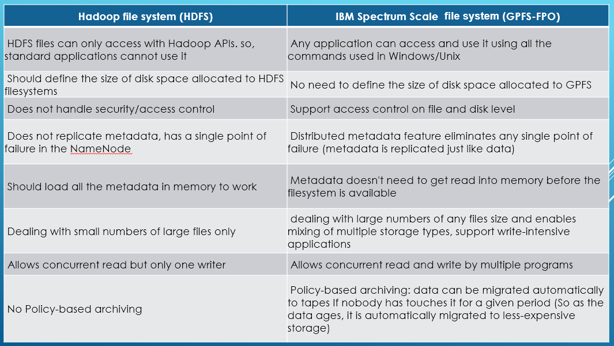

#### 2. How to work with Hadoop on IBM cloud?

Login to IBM Cloud (BlueMix) [https://console.bluemix.net/](https://console.bluemix.net/?cm_sp=dw-bluemix-_-recipes-_-devcenter) , and search for Hadoop

You will get two results (Lite = Free), and (Subscription=with Cost) –> choose “Analytics Engine”

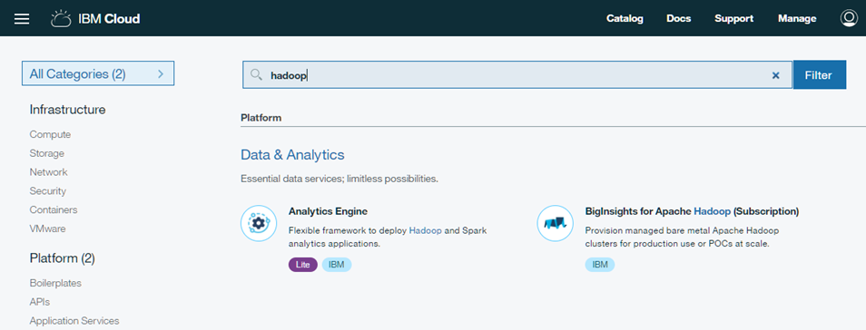

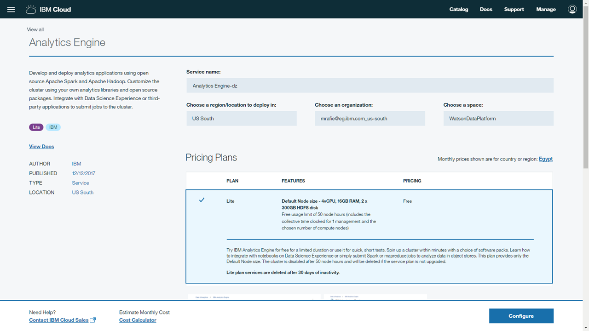

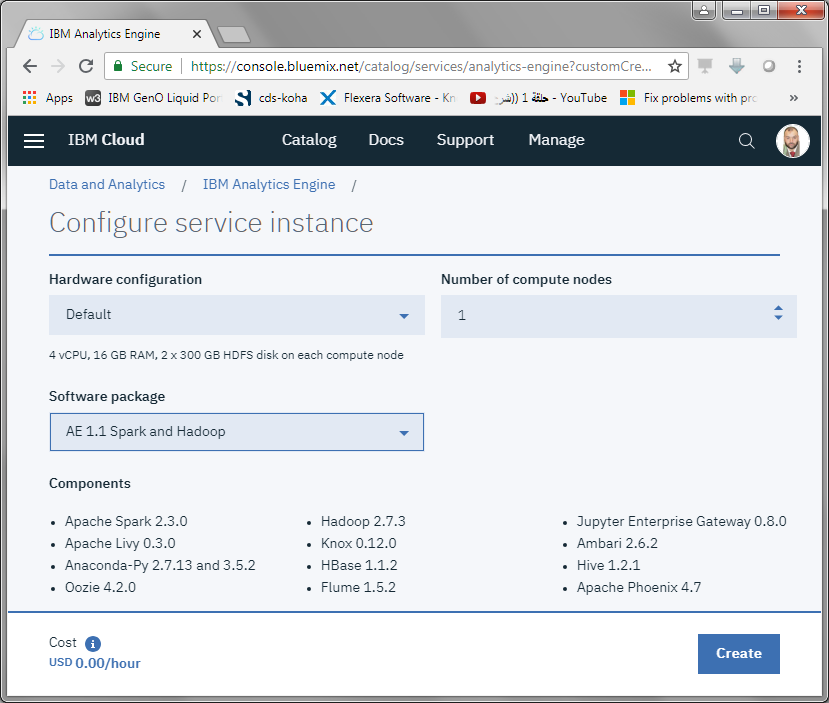

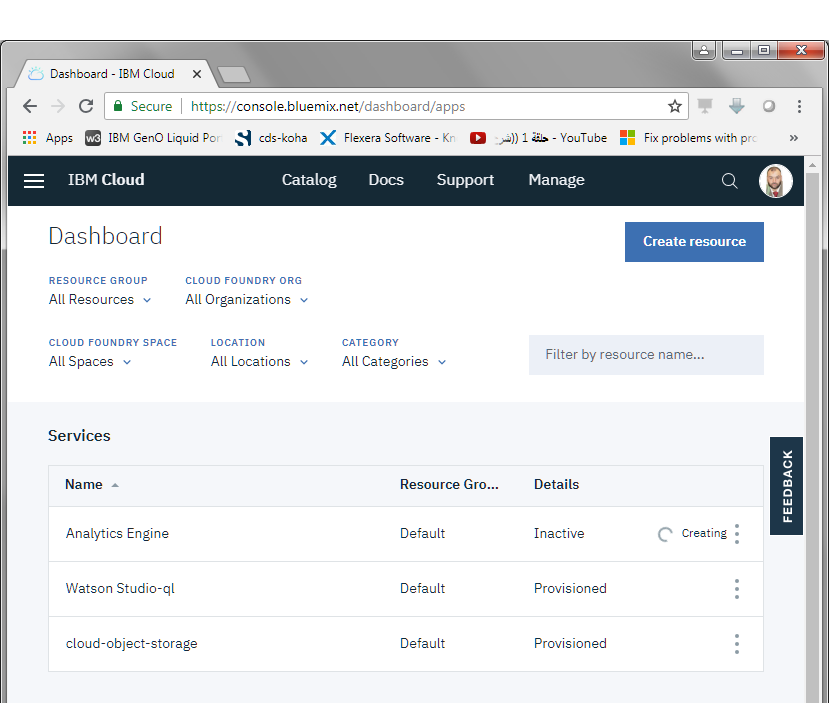

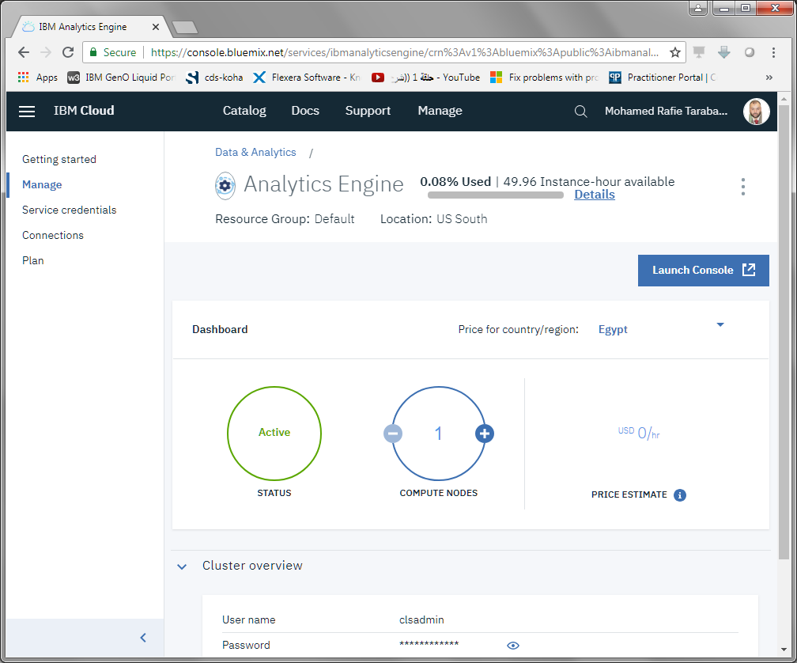

**Ambari (GUI tools to manage Hadoop)**

Ambari View is developed by HortonWorks.  
Ambari is a GUI tool you can use to create(install) manage the entire hadoop cluster. You can keep on expanding by adding nodes and monitor the health, space utilization etc through Ambari.  
Ambari views are more to help users to use the installed components/services like hive, pig, capacity scheduler to see the cluster-load and manage YARN workload management, provisioning cluster resources, manage files etc.

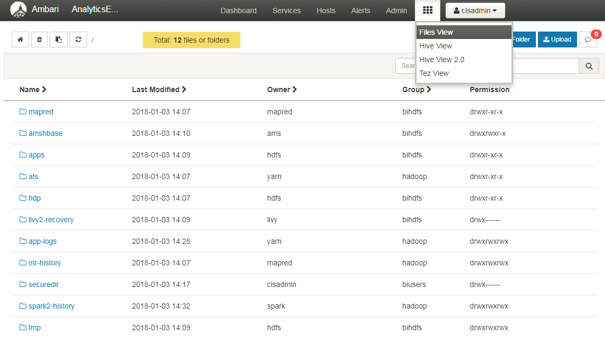

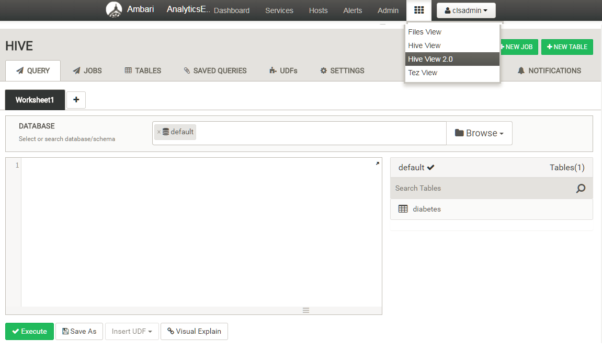

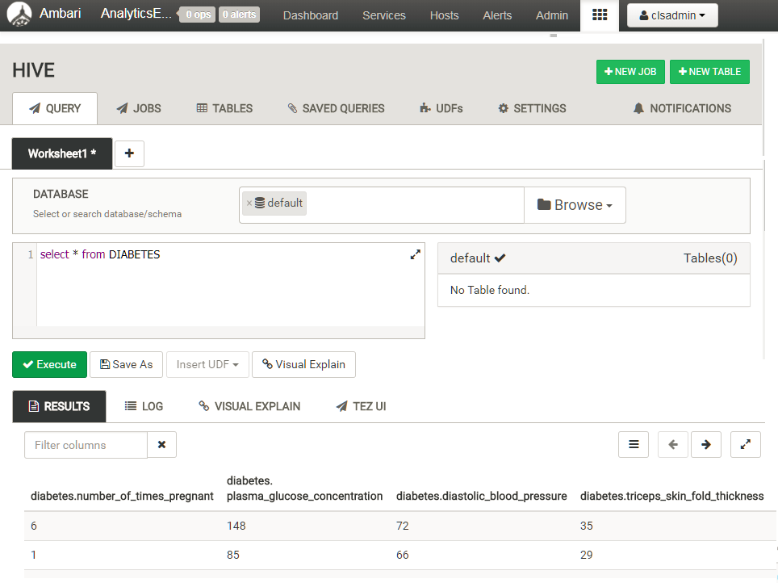

#### 3. How to work with Hadoop using Cloudera VM?

Download VM from [https://www.cloudera.com/downloads/quickstart\_vms/5-13.html](https://www.cloudera.com/downloads/quickstart_vms/5-13.html)

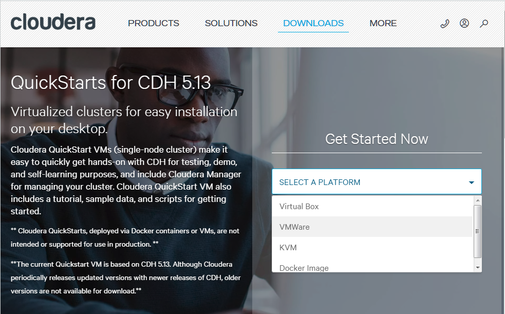

**How to use HUE**

**Example 1**

Copy file from HD to HDFS

**Using command line**  
hadoop fs -put /HD PATH/temperature.csv /Hadoop Path/temp

**Using HUE GUI**

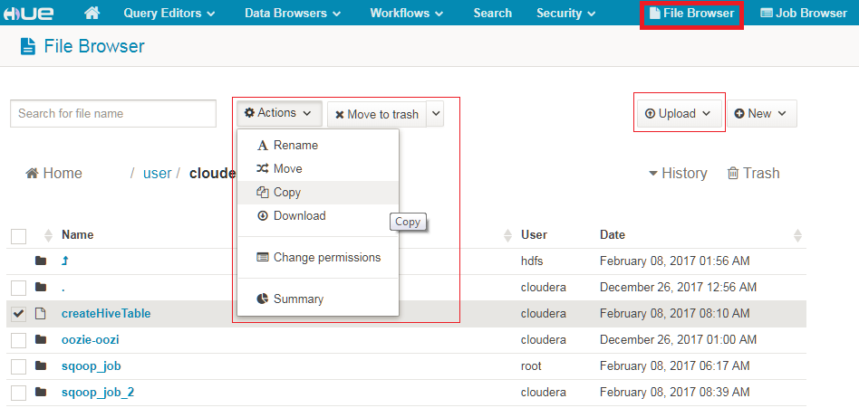

**Example 2**

Use Scoop to move mySql DB table to Hadoop file system inside hive directory

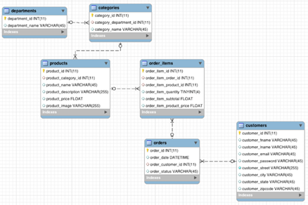

**\> sqoop import-all-tables \\**

**\-m 1\\**

**–connect jdbc:mysql://localhost:3306/retail\_db \\**

**–username=retail\_dba \\**

**–password=cloudera \\**

**–compression-codec=snappy \\**

**–as-parquetfile \\**

**–warehouse-dir=/user/hive/warehouse \\**

**–hive-import**

**Parameters description**

\-m parameter: number of .parquet files  
/usr/hive/warehouse is the default hive path  
To view tables after move to HDFS > hadoop fs -ls /user/hive/warehouse/  
To get the actual hive Tables path, use terminally type hive then run command set hive.metastore.warehouse.dir;

**Example 3**

Working with Hive tables

**Task 1:** To view current Hive tables

**show tables;**

**Task 2:** Run SQL command on Hive tables

**select c.category\_name, count(order\_item\_quantity) as count**

**from order\_items oi**

**inner join products p on oi.order\_item\_product\_id = p.product\_id**

**inner join categories c on c.category\_id = p.product\_category\_id**

**group by c.category\_name**

**order by count desc**

**limit 10;**

**Task 3:** Run SQL command on Hive tables

**select p.product\_id, p.product\_name, r.revenue from products p inner join**

**(**

**select oi.order\_item\_product\_id, sum(cast(oi.order\_item\_subtotal as float)) as revenue**

**from order\_items oi inner join orders o**

**on oi.order\_item\_order\_id = o.order\_id where o.order\_status <> ‘CANCELED’ and o.order\_status <> ‘SUSPECTED\_FRAUD’**

**group by order\_item\_product\_id**

**) r**

**on p.product\_id = r.order\_item\_product\_id**

**order by r.revenue desc**

**limit 10;**

**Example 4**

Copy temperature.csv file from HD to new HDFS directory “temp” then load this file inside new Hive table

hadoop fs -mkdir -p /user/cloudera/temp

hadoop fs -put /var/www/html/temperature.csv /user/cloudera/temp

Create Hive table based on CVS file

hive> Create database weather;

CREATE EXTERNAL TABLE IF NOT EXISTS weather.temperature (

place STRING COMMENT ‘place’,

year INT COMMENT ‘Year’,

month STRING COMMENT ‘Month’,

temp FLOAT COMMENT ‘temperature’)

ROW FORMAT DELIMITED

FIELDS TERMINATED BY ‘,’

LINES TERMINATED BY ‘\\n’

STORED AS TEXTFILE

LOCATION ‘/user/cloudera/temp/’;

**Example 5**

Using HUE create a workflow using Oozie to move data from mySQL/CSV files to Hive

Step 1: get the virtual machine IP using ifconfig

Step 2: navigate to the http://IP:8888 , to get HUE login screen (cloudera/cloudera)

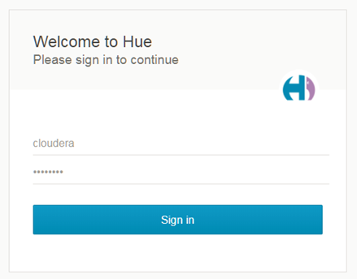

Step 3: Open Oozie: Workflows>Editors>Workflows> then click “create” button

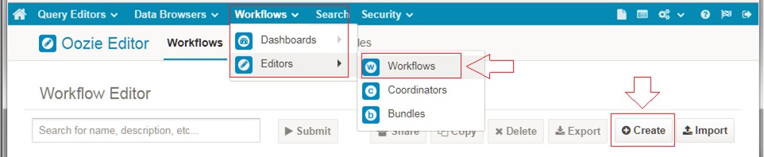

then

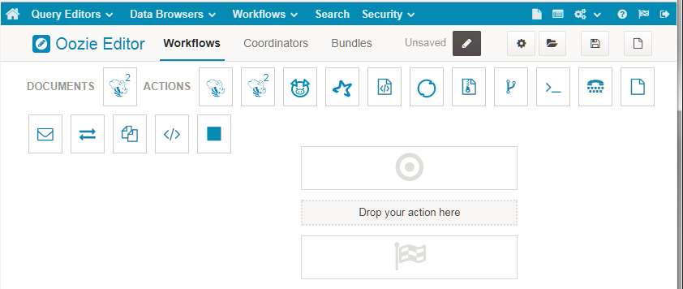

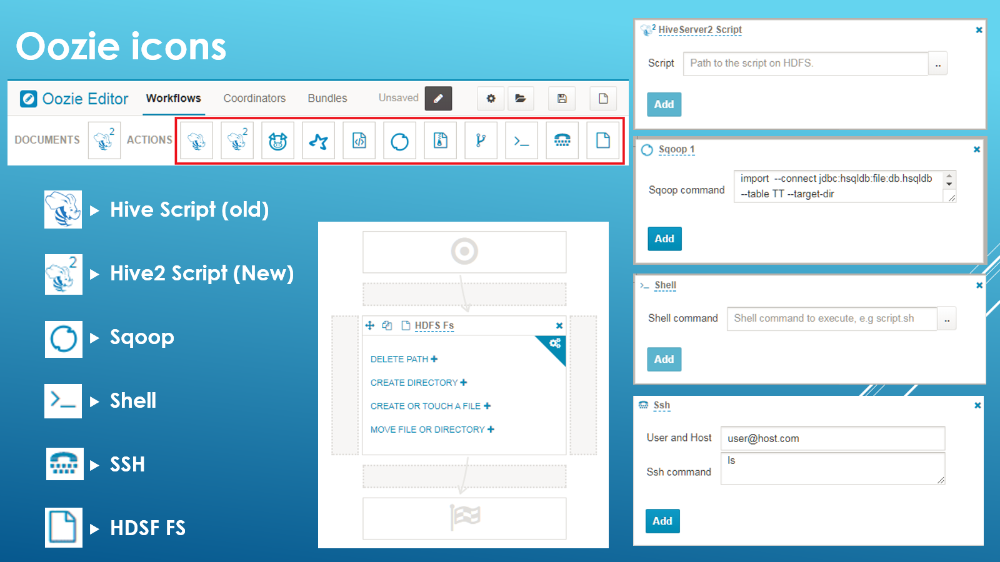

**Simple Oozie workflow**

1) delete HDFS folder

2) Copy mySql table as text file to HDFS

3) Create Hive table based on this text file

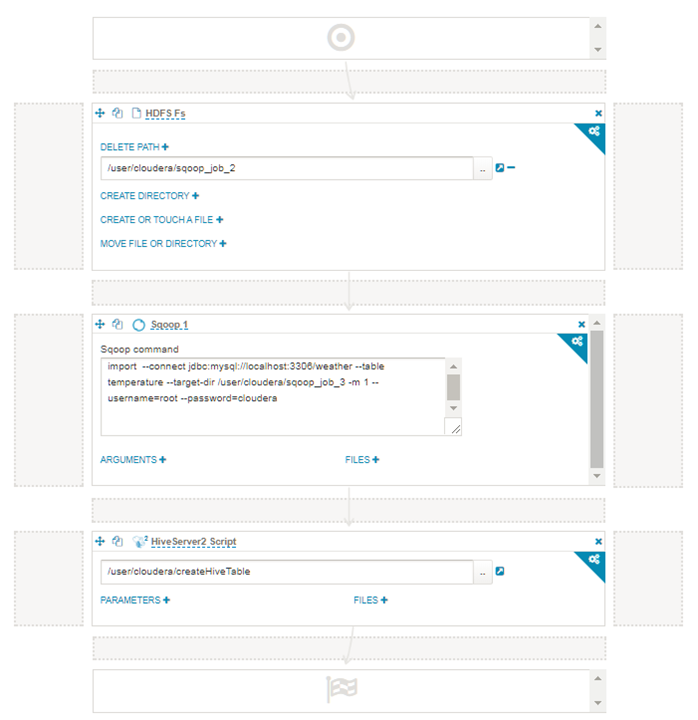

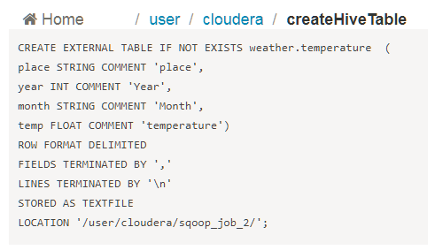

**Example 6**

**Create schedual to run workflow**

steps: Workflow > Editor > Coordinators

**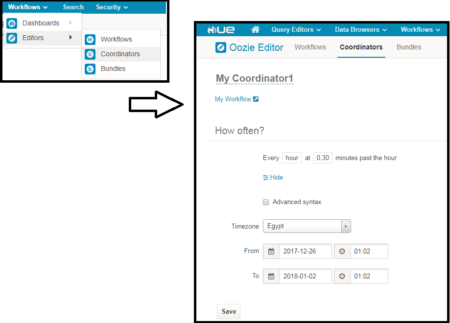**

**Notes:**

**Setup workflow settings**

Workflow can contains some variables  
To define new variable –> ${Variable}  
Sometimes you need to define hive libpath in HUE to work with hive

**ozzie.libpath : /user/oozie/share/lib/hive**

**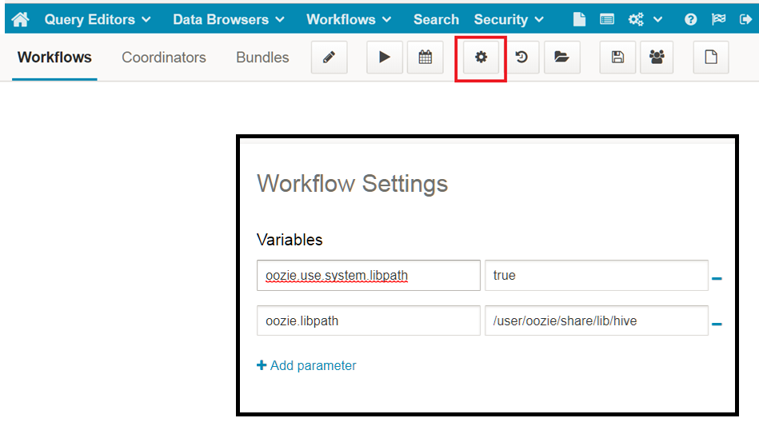**

#### 4. Data representation formats used for Big Data

**Data representation formats used for Big Data,** Common data representation formats used for big data include:

1) Row- or record-based encodings:

−Flat files / text files  
−CSV and delimited files  
−Avro / SequenceFile  
−JSON  
−Other formats: XML, YAML

2) Column-based storage formats:

−RC / ORC file  
−Parquet

3) NoSQL Database

**What is Parquet, RC/ORC file formats, and Avro?**

**1) Parquet**

Parquet is a columnar storage format,

Allows compression schemes to be specified on a per-column level

Offer better write performance by storing metadata at the end of the file

Provides the best results in benchmark performance tests

**2) RC/ORC file formats**

developed to support Hive and use a columnar storage format

Provides basic statistics such as min, max, sum, and count, on columns

**3) Avro**

Avro data files are a compact, efficient binary format

#### 5. What is NoSQL Databases?

**What is NoSQL Databases?**

NoSQL is a new way of handling variety of data. NoSQL DB can handle Millions of Queries per Sec while normal RDBMS can handle Thousands of Queries per Sec only, and both are follow CAP Theorem.

**Types of NoSQL datastores:**

• Key-value stores: MemCacheD, REDIS, and Riak

• Column stores: HBase and Cassandra

• Document stores: MongoDB, CouchDB, Cloudant, and MarkLogic

• Graph stores: Neo4j and Sesame

**CAP Theorem**

CAP Theorem states that in the presence of a network partition, one has to choose between consistency and availability.

*   Consistency means Every read receives the most recent write or an error
*   Availability means Every request receives a (non-error) response  
(without guarantee that it contains the most recent write)

**How Famous Databases align with CAP Theorem?**

*   HBase, and MongoDB —> CP \[give data Consistency but not Availability\]
*   Cassandra , CouchDB —> AP \[give data Availability but not Consistency\]
*   Traditional Relational DBMS are CA \[support Consistency and Availability but not network partition\]
