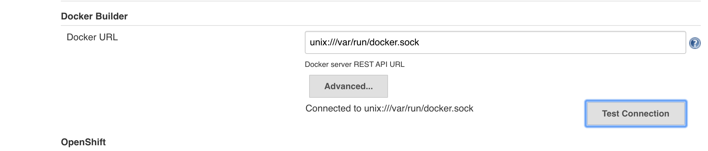
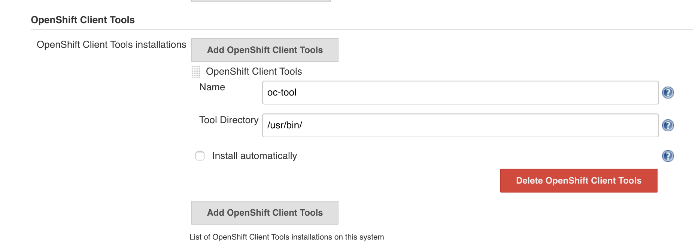
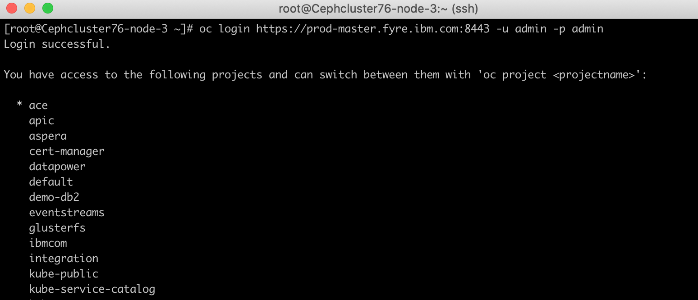
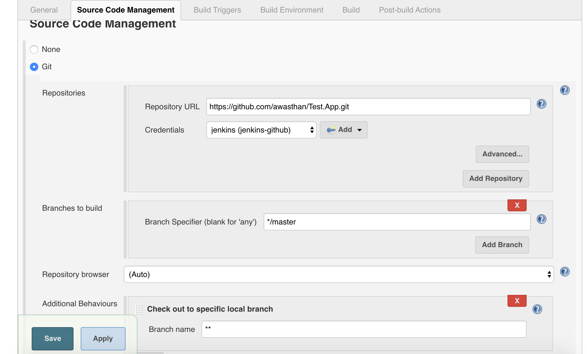
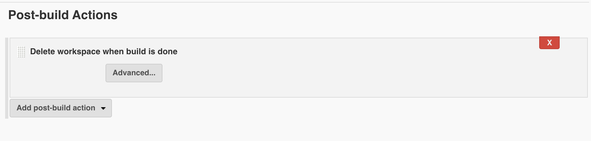
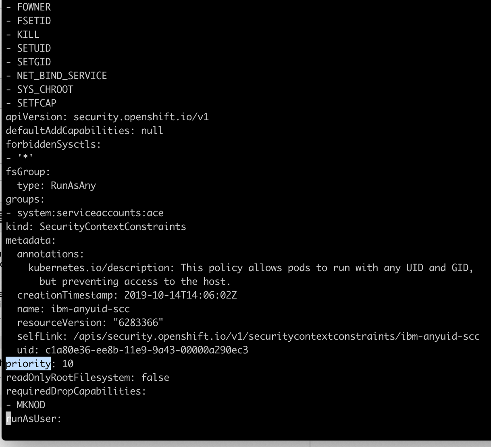

# Building CI-CD Pipeline for IBM App Connect Enterprise on Cloud Pak for Integration
## Building CI-CD Pipeline for IBM App Connect Enterprise on Cloud Pak for Integration using Jenkins

Anand.Awasthi

Published on November 4, 2019 / Updated on March 25, 2020


### Overview

Skill Level: Intermediate

This recipe would provide guidance to teams who are looking to building CI-CD pipeline for IBM AppConnectEnterprise on Cloud Pak for Integration. Organizations should be able to extend it for their needs to align with their release process.


### Ingredients

In this recipe we will use:-

1) Jenkins as CI-CD tool

2) Nexus repository to store ACE bar files.

3) Cloud Pak for Integration 2019.4.1 on OCP 4.2

4) Linux as Build Server (CentOS 7.6)

5) ACE 11.0.0.6 installed on Build server

6) Github as source control

We assume that ACE dashboard has been installed in 'ace' namespace. The ACE integration servers will be deployed in 'ace' namespace so that they can be viewed from the ACE dashboard.

Note that I have published a blog "An approach to build DevOps pipeline for ACE on Cloud Pak for Integration". Below is the link to it:

https://developer.ibm.com/integration/blog/2020/03/20/an-approach-to-build-devops-pipeline-for-ace-on-cloud-pak-for-integration/


### Step-by-step


#### 1. Overview

    In this recipe we will see:-

    1) Building a custom image of ACE with MQ client

    2) Creating BAR files from ACE application and overriding a UDP

    3) Creating the ACE application image using the built custom image, adding the BAR files on it and pushing to Openshift Docker registry

    4) Install Helm release in 'ace' namespace where ACE dashboard is installed

    5) Upgrade the Helm release when there is change in ACE image (for example new fix pacs) or ACE application (code/configuration changes in ACE artifacts)

    There are many other things can be done to customize the ACE image, for example setting configure KeyStores/TrustStores, DSN, WebUI users etc, however for simplicity here we will only consider adding BAR files on the base ACE image. Detailed instructions on creating custom ACE images can be found in [Github](https://github.com/ot4i/ace-docker "Github")

    Here I will show how Jenkins jobs can be configured to carry out all of the above tasks. You may exploit these to accomodate in your release process and create build pipelines.

    Note that I have used 'self-signed certificates' in my cluster set-up, however this is not recommended. In live environments, CA signed certificates should be used.


#### 2. Configure Build Server

    Start by updating your system packages and install the required dependencies:

```
    sudo yum update  
    sudo yum install yum-utils device-mapper-persistent-data lvm2
```

    **Configure Nexus:** In this recipe we have chosen Nexus repository to store ACE bar files. You may follow the instructions at below link to install and configure nexus:

    [https://devopscube.com/how-to-install-latest-sonatype-nexus-3-on-linux/](https://devopscube.com/how-to-install-latest-sonatype-nexus-3-on-linux/)

    Let us create a repository with the name 'releases' in nexus. We will upload the generated BAR files to this repository, which will be pulled while building the image for application.

    Login to nexus and go to 'Server administration and configuration'.

    

    Go to Repositories --> Create repository and enter the information. Create it as 'maven2 (hosted)' repository.

    

    Make note of the 'releases' repository url

    

    **Install Git:** Run below command to install Git:

```
    sudo yum install git
```

    **Install Docker:** Run below commands to install Docker community version:

```
    sudo yum-config-manager --add-repo [https://download.docker.com/linux/centos/docker-ce.repo](https://download.docker.com/linux/centos/docker-ce.repo)  
    sudo yum install docker-ce  
    sudo systemctl start docker  
    sudo systemctl enable docker

    Check the docker status and version:

    sudo systemctl status docker  
    docker -v
```

    **Install Xvfb:** Run below command to install Xvfb (X virtual frame buffer):

```
    yum install Xvfb
```

    **Install ACE:** Follow below steps to install IBM ACE. Install it for all users.

    [https://www.ibm.com/support/knowledgecenter/en/SSTTDS\_11.0.0/com.ibm.etools.mft.doc/bh25992\_.htm](https://www.ibm.com/support/knowledgecenter/en/SSTTDS_11.0.0/com.ibm.etools.mft.doc/bh25992_.htm)

    Install it inside /opt/IBM. Also keep the installer file also as we will use it while building ACE docker image for application. You can keep the installer file inside /opt/IBM itself.

    

    **Install OC Tool:** Follow the instructions at below link:

    [https://docs.openshift.com/enterprise/3.1/cli\_reference/get\_started\_cli.html](https://docs.openshift.com/enterprise/3.1/cli_reference/get_started_cli.html) or

    [https://docs.okd.io/latest/cli\_reference/get\_started\_cli.html](https://docs.okd.io/latest/cli_reference/get_started_cli.html)

    Note down the path of directory where you keep 'oc' file. Here we are keeping it a /usr/bin and will configure it in Jenkins.

    **Configure Jenkins:** You may follow the instructions from below link to install Jenkins

    [https://linuxize.com/post/how-to-install-jenkins-on-centos-7/](https://linuxize.com/post/how-to-install-jenkins-on-centos-7/)

    Other than default suggested plugins, install below plugins also:

    \- OpenShift Client Plugin

    \- Git plugin

    \- Xvfb plugin

    \- Docker build step plugin

    \- Repository Connector plugin

    \- Nexus Artifact uploader plugin

    \- SSH Agent plugin

    Login to Jenkins and go to Manage Jenkins --> Configure System.

    Go to 'Openshift Client Plugin' and click on 'Add Openshift Cluster'. Enter the name of cluster and Openshift API server url. Since I am using self-signed certificate for my Openshift API server, I have disabled TLS verify to keep the configuration simple.

    

    Go to 'Artifact Resolver' configuration and enter the values. Create a folder, say with name 'maven\_repo', under /var on build server to be used as local repository for nexus artifact resolver plugin. Enter the nexus repository url that you created above and specify credentials.

    

    Go to 'Docker builder' and enter docker url.

    unix:///var/run/docker.sock

    Give 777 permission to docker.sock file and click on 'Test connection'. It should be able to successfully connect.

    

    Now navigate to 'Manage Jenkins' --> Global Tool Configuration

    In 'Openshift Client Tools', click on 'Add Openshift Client Tool' and enter the name and tool directory path. As in the step of 'Install OC Tool', we have put it under /usr/bin, we will specify that path here.

    

    Configure Git installation

    

    Add Xvfb installation. Specify the path in which Xvfb executable has been put.

    

    Configure Jenkins workspace directory. Edit the file /var/config.xml to change the value of 'workspaceDir'. Change it to '${ITEM\_ROOTDIR}/workspace'.

    

    Restart Jenkins.

```
    service jenkins stop  
    service jenkins start  
    service jenkins status
```

    **Install Cloudctl, Kubectl and Helm:**

    Login to icp-console and go at the bottom of welcome page. Click on 'Install CLI Tools'. and follow the instructions to install the CLI tools.

    

    The installed CLI tools should be accessible to all users so that we can use them from Jenkins. In order to do that, you need to add them to /etc/profile. If you have installed these tools under /usr/local/bin, append below entry in /etc/profile:

```
    PATH=$PATH:$HOME/bin:/opt/IBM/ace-11.0.0.6/server/bin:/usr/local/bin  
    export PATH
```

    

    Also note that I have added ACE path as well so that ACE commands can be executed from Jenkins.

#### 3. Configure Jenkins-Github Integration using SSH keys

    Follow below instructions to configure Jenkins and Github integration using SSH.

    1) Create a 'jenkins' user on Build server where Jenkins is installed

```
    sudo -su jenkins  
    ssh-keygen  
    eval $(ssh-agent -s)  
    ssh-add ~/.ssh/id\_rsa
```

    2) cat /var/lib/jenkins/.ssh/id\_rsa.pub

    Go to github repository -> settings ->add SSH and GPG keys and click on 'New SSH Key'.

    

    Enter a name in 'Title' and past the content of id\_rsa.pub key.

    3) Now add SSH private key in Jenkins. Now go to Credentials from left pane inside Jenkins console and then click global:

    

    After this click on 'Add Credential' and select 'SSH username with private key'. Enter the value for fields and enter private key ie. the content of id\_rsa.

    

    4) We need to add GitHub to known hosts. Let’s do it by simply connecting to GitHub server.

```
    whoami # make sure it says 'jenkins'  
    ssh -T git@github.com
```

    Result should be a welcome message.


#### 4. Configure Access to Openshift Docker registry

    Since your Build server is outside of the Openshift cluster for various good reasons, you need to ensure that you can push and pull images from openshift docker registry. Follow below steps to configure access to the OCP docker registry from the build server:

    1) Get the name of the external url of the registry by using below command:

```
    oc get route default-route -n openshift-image-registry --template='{{ .spec.host }}'
```

    It is possible that your OCP docker registry is not exposed externally. If it is not exposed, expose it with SSL passthrough option. You may do it via command-line or by logging-into OCP console and create route for docker registry with SSL passthrough option.

    On Build server, navigate to /etc/docker/certs.d and create a folder with name as external url of registry. If 'certs.d' folder doesn't exist, then create it. For example here I created folder 'docker-registry-default.9.204.169.137.nip.io'.

    Navigate inside this directory and run the command below in a single line to pull the certificate.

```
    ex +'/BEGIN CERTIFICATE/,/END CERTIFICATE/p' <(echo | openssl s\_client -showcerts   
     -connect <external url for OCP registry>) -scq > client-ca.crt
```

    For example:

```
    ex +'/BEGIN CERTIFICATE/,/END CERTIFICATE/p' <(echo | openssl s\_client -showcerts   
     -connect docker-registry-default.9.204.169.137.nip.io:443) -scq > client-ca.crt
```

    

    In some scenarios, you may need to add this registry in the list of insecure registries. To do this, open the file /etc/docker/deamon.json

```
    vi /etc/docker/daemon.json
```

    and add entry for OCP registry as below:

```
    {  
      "insecure-registries" : \["<OCP external registry hostname:443>"\]  
    }
```

    for example:

```
    {  
     "insecure-registries" : \["docker-registry-default.9.204.169.137.nip.io:443"\]  
    }
```

    2) Restart the docker daemon

```
    service docker stop  
    service docker start  
    service docker status
```

    3) Now verify that you are able to login to Openshift docker registry.

    First login to openshit cluster using oc tool
```
    oc login <openshift api server url> -u <username> -p <password>
```

    For example: oc login https://prod-master.fyre.ibm.com:8443 -u admin -p admin

    

    Now login to docker registry using below command

```
    docker login <docker registry url> -u $(oc whoami) -p $(oc whoami -t)
```

    For example: docker login docker-registry-default.9.204.169.137.nip.io -u $(oc whoami) -p $(oc whoami -t)

    You should see 'Login succeeded' message.

    

    Ensure that you have given 777 permission on docker.sock.

    chmod 777 /var/run/docker.sock


#### 5. Add Helm repository

    You need to add the local-charts repository. Login to ICP console and navigate to Manage --> Helm Repositories. Copy the url for local-charts.

    

    Here the url is [https://icp-console.9.204.169.137.nip.io:443/helm-repo/charts](https://icp-console.9.204.169.137.nip.io:443/helm-repo/charts)

    Since I am using self-signed certifiate, I need to configure the server's certifcate so that this repository can be added.

    Run below command to download the certificate in pem format

```
    openssl s\_client -servername <name of server> -connect <servername:port> < /dev/null 2>/dev/null | openssl x509 -outform pem
```

    For example:

```
    openssl s\_client -servername icp-console.9.204.169.137.nip.io -connect icp-console.9.204.169.137.nip.io:443 < /dev/null 2>/dev/null | openssl x509 -outform pem
```

    Create a folder, say /opt/certs and copy the certificate with the name 'ca.pem', i.e. with '.pem' extension.

    

    Change directory to /opt/certs and run below commands. Replace the urls, crednetials and repo name as applicable. I have updated the repo 'stable' here, however you would prefereably give other name , like 'local-charts' etc. Note that you will need to use this repo name in helm command at step 11 below.

```
    source /etc/profile  
    cloudctl login -a https://icp-console.9.204.169.137.nip.io -n ace -u admin -p admin --skip-ssl-validation  
    cd /opt/certs/  
    helm init --client-only  
    helm repo add stable --ca-file ca.pem https://icp-console.9.204.169.137.nip.io:443/helm-repo/charts
```

    Now the command 'helm repo list' should show output similar to below.

    

#### 6. Create ACE application Jenkins Job

    I have created a sample project 'Test.App' and checked-it into github at below location:

    [https://github.com/awasthan/Test.App.git](https://github.com/awasthan/Test.App.git)

    This is a very simple project with one UDP. We will build a Jenkins job for this.

    Create a 'Freestyle project' with the name 'Test.App'. Keeping the job name same as that of the ACE project name in Github will keep our life easy.

    Under Source Code management, specify Repository url and credendital. In 'Additional Behaviours' add 'Checkout to specific local branch' and give it value '\*\*'.

    

    Under Build environment, configure Xvfb as shown in screenshot.

    

    Under 'Build' section, add the step 'Execute shell'. Here we will create BAR file and override the UDP value provided in DEV.properties file inside Test.App project. We are using here Build number as the version number for BAR file.

```
    source /opt/IBM/ace-11.0.0.6/server/bin/mqsiprofile  
    mqsicreatebar -data . -b Test\_App.bar -a Test.App  
    mqsiapplybaroverride -b Test\_App.bar -p Test.App/properties/DEV.properties -o DEV\_$BUILD\_NUMBER.bar -r  
    zip Test\_App.zip DEV\_$BUILD\_NUMBER.bar
```

    

    Now upload the BAR files to Nexus repository using 'Nexus repository uploader' build step. If you have not created already, create credentials for nexus repository. The value of 'Repository' is the name of the repository that you have already created.

    Specify the GroupId. Job name i.e. ACE project name will be used as ArtifactId

    

    Add a 'Post Build Action' to delete workspace when build is done.

    

    Click on 'Save'.

    Build the Job to generate a BAR file. Click on 'Build Now'.

    

    It will create the BAR file and push to nexus repository.

    

    You can login to nexus and verify that the zip file containing BAR files has been uploaded.

    


#### 7. Build ACE with MQ client custom image using Jenkins Job

    You can build custom ACE (with or without MQ/MQ-client) images with required configurations.

    _Note that you would follow this step only if you want to build your custom image, instead of using IBM certified container images. It is recommended to use IBM certified container images. There are three types of IBM certified ACE images supplied with CP4I:_

    _\- ACE only image_

    _\- ACE with MQ client image_

    _\- ACE with MQ server image_

    _Also, you can update ACE images in your OCP registry to apply latest released fix pacs. Follow the step 10 from below blog to do this:_

    [https://developer.ibm.com/integration/blog/2020/02/20/modernizing-integration-migration-from-iib-to-app-connect-running-on-ibm-cloud-pak-for-integrationcp4i/](/integration/blog/2020/02/20/modernizing-integration-migration-from-iib-to-app-connect-running-on-ibm-cloud-pak-for-integrationcp4i/)

    Use below Github repository for detailed instructions:

    [https://github.com/ot4i/ace-docker](https://github.com/ot4i/ace-docker)

    You can fork this repository and customize the image as per your need by following the instructions. I have forked this repository for my usage.

    Let us create another Jenkins job for this.

    Create a Freestyle project and give it a name, say 'ace-mq-client-image-build'.

    Enter the Github repository url and crednetials.

    

    Add a Build step to 'Execute shell' and add below script.

```
    cp /opt/IBM/11.0.0-ACE-LINUXX64-FP0006.tar.gz /var/lib/jenkins/jobs/${JOB\_NAME}/workspace/deps  
    docker build -t ace-only --build-arg ACE\_INSTALL=11.0.0-ACE-LINUXX64-FP0006.tar.gz --file ubi/Dockerfile.aceonly .  
    docker build -t ace-mqclient --build-arg BASE\_IMAGE=ace-only --file ubi/Dockerfile.mqclient .
```

    Note that we have ACE installable present at /opt/IBM as mentioned in previous step. Notice that we are building the ACE-MQ client image with the name 'ace-mqclient'.

    

    Add a Post build action to delete the workspace after build is done.

    

    Click Save. Now run the job and it should build the image.

    

#### 8. Create Dockerfile for ACE application

    If you created your own custom image as described in previous step, use it to create the Dockerfile of your ACE application. We will take the BAR file and add it on the ace-mqclient image. You can do further actions, but here we will not get into further details. Expose the ports. Below is the Dockerfile content.

```
    FROM ace-mqclient:latest  
    ADD \*.bar /home/aceuser/initial-config/bars/  
    EXPOSE 7600 7800 7843 9483  
    ENV LICENSE accept
```

    Let us create a project, say 'Test.App.CP4I.Deployment' in Github and add this Dockerfile there.

    To use IBM certified ACE image, specify to pull the image from the registry e.g. as below

```
    FROM docker-registry-default.9.204.169.137.nip.io/ace/ibm-ace-server-prod:11.0.0.5.1-amd64  
    ADD \*.bar /home/aceuser/initial-config/bars/  
    EXPOSE 7600 7800 7843 9483  
    ENV LICENSE accept
```

    I have created the sample project in Github

    [https://github.com/awasthan/Test.App.CP4I.Deployment.git](https://github.com/awasthan/Test.App.CP4I.Deployment.git)

#### 9. Configure Redhat SecurityContextConstraints

    The chart "ibm-ace-server-icp4i-prod" requires a SecurityContextConstraints to be bound to the target namespace prior to installation. To meet this requirement there may be cluster-scoped, as well as namespace-scoped, pre- and post-actions that need to occur.

    The predefined SecurityContextConstraints ibm-anyuid-scc has been verified for this chart. If your target namespace is not bound to this SecurityContextConstraints resource you can bind it with the following command:

```
    oc adm policy add-scc-to-group ibm-anyuid-scc system:serviceaccounts:ace
```

    Make sure that 'priority' is set to 10 in ibm-anyuid-scc. Edit the scc using below command

```
    oc edit scc ibm-anyuid-scc
```

    

#### 10. Configure Image pull secret and Docker credentials

    **1) Image Pull Secret:**

    If you are using a private Docker registry (including an ICP Docker registry), an image pull secret needs to be created before installing the chart. Here we will use OCP registry, so will create image pull secret. A default image pull secret gets created in each namespace with the name like '**default-dockercfg-<xxxxx>**' to pull the images from the same namespace. So if your ImageStreams are in same namespace, you should use this default secret.

    Configure image pull secret for 'ace' namespace. Say, the name of the secret is 'aceregistrysecret'. Run below command:

```
    oc -n ace create secret docker-registry aceregistrysecret --docker-server=docker-registry.default.svc:5000 --docker-username=$(oc whoami) --docker-password=$(oc whoami -t) --docker-email=ananaw16@in.ibm.com
```

    Here email address value can be anything. Note that there is drawback in using this custom secret. Since it uses OCP token, this secret becomes invalid after certain period of time. So in case the pod is killed and recreated after the token has got invalidated, pod creation will fail with imagepullbackoff error.

    Hence it is recommended to create ImageStream in same namespace where you are deploying and use the default secret.

    Now create below credential in Jenkins:

    **2) Docker Credential:** Create credential for docker with username and password. Username should be the output of 'oc whoami' and password should be the output of 'oc whoami -t'. Note that the docker credential is created using OCP login token, so will get invalidated after the OCP token is expired.

    It is recommened to get this token generated dynamically in script during docker login. The process has been explained in below article (see the jenkinsfile script under the head 'Configure Deployment Job'):

    [https://developer.ibm.com/integration/blog/2020/03/20/an-approach-to-build-devops-pipeline-for-ace-on-cloud-pak-for-integration/](/integration/blog/2020/03/20/an-approach-to-build-devops-pipeline-for-ace-on-cloud-pak-for-integration/)

    

    

#### 11. Create Helm install/upgrade Jenkins job

    Now let us create a Jenkins job to install or upgrade Helm release.

    Create a Freestyle project, say name 'Test.App.CP4I.Deployment'. Let us make this project parameterized to supply certain values. Its completely on you how you want to define your Jenkins job. This is just an example to show.

    Add below parameters as in screenshots.

    

    

    

    

    

    

    

    

    You can add more ACE applications if you want to deploy more than one BAR files in the Integration Server.

    Specify the github project containing Dockerfile.

    

    Configure Xvfb parameters.

    

    Add the Build step 'Artifact Resolver'. Using this, you can pull BAR files from repository.

    

    Add the Build step 'Execute Shell' to copy the BAR file. Create a directory 'icp-builds' under /var. This directory will temporarily be used while pulling the zip file from nexus and extracting BAR file.

```
    cd /var/icp-builds/${ACE\_APP1}  
    unzip Test.App-${ACE\_APP1\_VERSION}.zip  
    chmod 777 \*  
    cp DEV\_${ACE\_APP1\_VERSION}.bar /var/lib/jenkins/jobs/${JOB\_NAME}/workspace
```

    

    Add the Build steps for 'Execute Docker command' to build, tag and push the image to openshift docker registry.

    

    

    Now add the Build step 'Execute shell' and paste below script to install/upgrade helm release. Change the values of parameters respective to your envieonment. Note that we have put helm repo certificate under /etc/certs.

    Ensure to use compatible version of helm chart. Please see below the compatibility matrix.

    

```
    #!/bin/sh  
    source /etc/profile  
    cloudctl login -a https://icp-console.9.204.169.137.nip.io -n ${Namespace} -u admin -p admin --skip-ssl-validation  
    cd /opt/certs  
    helm init --client-only  
    helm repo add stable --ca-file ca.pem https://icp-console.9.204.169.137.nip.io:443/helm-repo/charts  
    if test ${DeploymentType} = 'install'; then  
    helm ${DeploymentType} --name $ReleaseName stable/ibm-ace-server-icp4i-prod --version v3.0.0 --namespace ${Namespace} --set imageType=ace --set image.aceonly=docker-registry.default.svc:5000/ace/${imagename}:${tag} --set image.acemqclient=docker-registry.default.svc:5000/ace/ibm-ace-mqclient-server-prod:11.0.0.6.1 --set image.acemq=docker-registry.default.svc:5000/ace/ibm-ace-mq-server-prod:11.0.0.6.1 --set image.configurator=docker-registry.default.svc:5000/ace/ibm-ace-icp-configurator-prod:11.0.0.6.1 --set image.designerflows=docker-registry.default.svc:5000/ace/ibm-ace-designer-flows-prod:11.0.0.6.1 --set image.pullSecret=aceregistrysecret --set persistence.enabled=false --set persistence.useDynamicProvisioning=false --set integrationServer.name=testace --set license=accept --tls  
    oc login https://prod-master.fyre.ibm.com:8443 -u admin -p admin  
    oc project ace  
    oc expose svc ${ReleaseName}-ibm-ace-server-icp4i-prod --port=7800  
    else  
    helm ${DeploymentType} $ReleaseName stable/ibm-ace-server-icp4i-prod --version v3.0.0 --namespace ${Namespace} --set imageType=ace --set image.aceonly=docker-registry.default.svc:5000/ace/${imagename}:${tag} --set image.acemqclient=docker-registry.default.svc:5000/ace/ibm-ace-mqclient-server-prod:11.0.0.6.1 --set image.acemq=docker-registry.default.svc:5000/ace/ibm-ace-mq-server-prod:11.0.0.6.1 --set image.configurator=docker-registry.default.svc:5000/ace/ibm-ace-icp-configurator-prod:11.0.0.6.1 --set image.designerflows=docker-registry.default.svc:5000/ace/ibm-ace-designer-flows-prod:11.0.0.6.1 --set image.pullSecret=aceregistrysecret --set persistence.enabled=false --set persistence.useDynamicProvisioning=false --set integrationServer.name=testace --set license=accept --tls  
    fi  
    cd /var/icp-builds  
    rm -rf ${ACE_APP1}  
```

    

    Ideally credentials should be encrypted or some credential manager can be used instead of supplying them as plain text. In this script, we are creating a route after helm install.

    Add a post build action to delete the workspace once build is done.

    

#### 12. Test - Install New Helm release

    Now let us test this by installing new Helm release. We will first deploy the current BAR file of Test.App project. In the current BAR file (DEV\_18.bar), the value of UDP is '**Hi There..it works again**'. We will test the app after deployment.

    

    Let us first look at ACE dashboard before we run the Jenkins job to install helm release.

    

    Now click on 'Build with Parameters' on 'Test.App.CP4I.Deployment' job.

    

    We have specified release name to 'demoace-rel' and ACE application version 18 for deployment. DeploymentType parameter has been selected to 'install'. Click on Build. View the logs of the Jenkins job. Below is the log from the build I ran.

```
Started by user Anand Awasthi
Running as SYSTEM
Building in workspace /var/lib/jenkins/jobs/Test.App.CP4I.Deployment/workspace
using credential jenkins-github
Cloning the remote Git repository
Cloning repository https://github.com/awasthan/Test.App.CP4I.Deployment.git
> git init /var/lib/jenkins/jobs/Test.App.CP4I.Deployment/workspace # timeout=10
Fetching upstream changes from https://github.com/awasthan/Test.App.CP4I.Deployment.git
> git --version # timeout=10
using GIT_SSH to set credentials jenkins-github
> git fetch --tags --progress https://github.com/awasthan/Test.App.CP4I.Deployment.git +refs/heads/*:refs/remotes/origin/*
> git config remote.origin.url https://github.com/awasthan/Test.App.CP4I.Deployment.git # timeout=10
> git config --add remote.origin.fetch +refs/heads/*:refs/remotes/origin/* # timeout=10
> git config remote.origin.url https://github.com/awasthan/Test.App.CP4I.Deployment.git # timeout=10
Fetching upstream changes from https://github.com/awasthan/Test.App.CP4I.Deployment.git
using GIT_SSH to set credentials jenkins-github
> git fetch --tags --progress https://github.com/awasthan/Test.App.CP4I.Deployment.git +refs/heads/*:refs/remotes/origin/*
> git rev-parse refs/remotes/origin/master^{commit} # timeout=10
> git rev-parse refs/remotes/origin/origin/master^{commit} # timeout=10
Checking out Revision 2435b9a505cd77df2b560a90f08c281e7159fb23 (refs/remotes/origin/master)
> git config core.sparsecheckout # timeout=10
> git checkout -f 2435b9a505cd77df2b560a90f08c281e7159fb23
Commit message: "Delete prod-ocpconfig.yaml"
> git rev-list --no-walk 2435b9a505cd77df2b560a90f08c281e7159fb23 # timeout=10
Xvfb starting$ /usr/bin/Xvfb :2 -fbdir /var/lib/jenkins/xvfb-22-..fbdir3946184138531427703
INFO: define repo: [Repository id=nexus-release, type=default, url=http://9.204.170.13:8081/repository/releases/, isRepositoryManager=false]INFO: set authentication for admin
deleted file:/var/icp-builds/Test.App/Test.App-18.zip
copy /var/maven_repo/com/ibm/esb/Test.App/18/Test.App-18.zip to file:/var/icp-builds/Test.App/Test.App-18.zip
[workspace] $ /bin/sh -xe /tmp/jenkins2419063048417105026.sh
+ cd /var/icp-builds/Test.App
+ unzip Test.App-18.zip
Archive: Test.App-18.zip
inflating: DEV_18.bar
+ chmod 777 DEV_18.bar Test.App-18.zip
+ cp DEV_18.bar /var/lib/jenkins/jobs/Test.App.CP4I.Deployment/workspace
[Docker] INFO: Step 1/4 : FROM ace-mqclient:latest
[Docker] INFO:

[Docker] INFO: ---> e8ad12e7e56f

[Docker] INFO: Step 2/4 : ADD *.bar /home/aceuser/initial-config/bars/
[Docker] INFO:

[Docker] INFO: ---> Using cache

[Docker] INFO: ---> 3f33aaecd8fd

[Docker] INFO: Step 3/4 : EXPOSE 7600 7800 7843 9483
[Docker] INFO:

[Docker] INFO: ---> Using cache

[Docker] INFO: ---> 223e440d4471

[Docker] INFO: Step 4/4 : ENV LICENSE accept
[Docker] INFO:

[Docker] INFO: ---> Using cache

[Docker] INFO: ---> 7dc896b07979

[Docker] INFO: Successfully built 7dc896b07979

[Docker] INFO: Successfully tagged pingapp:22

[Docker] INFO: Build image id:7dc896b07979
[Docker] INFO: start tagging image pingapp:22 in docker-registry-default.9.204.169.137.nip.io/ace/pingapp as 15-amd64
[Docker] INFO: Tagged image pingapp:22 in docker-registry-default.9.204.169.137.nip.io/ace/pingapp as 15-amd64
[Docker] INFO: Pushing image docker-registry-default.9.204.169.137.nip.io/ace/pingapp:15-amd64
[Docker] INFO: Done pushing image docker-registry-default.9.204.169.137.nip.io/ace/pingapp:15-amd64
[workspace] $ /bin/sh -xe /tmp/jenkins8969417627734885235.sh
+ source /etc/profile
++ '[' -x /usr/bin/id ']'
++ '[' -z 997 ']'
+++ /usr/bin/id -un
++ USER=jenkins
++ LOGNAME=jenkins
++ MAIL=/var/spool/mail/jenkins
++ '[' 997 = 0 ']'
++ pathmunge /usr/local/sbin after
++ case ":${PATH}:" in
++ '[' after = after ']'
++ PATH=/sbin:/usr/sbin:/bin:/usr/bin:/usr/local/sbin
++ pathmunge /usr/sbin after
++ case ":${PATH}:" in
+++ /usr/bin/hostname
++ HOSTNAME=Cephcluster76-node-3.fyre.ibm.com
++ HISTSIZE=1000
++ '[' '' = ignorespace ']'
++ export HISTCONTROL=ignoredups
++ HISTCONTROL=ignoredups
++ export PATH USER LOGNAME MAIL HOSTNAME HISTSIZE HISTCONTROL
++ '[' 997 -gt 199 ']'
+++ /usr/bin/id -gn
+++ /usr/bin/id -un
++ '[' jenkins = jenkins ']'
++ umask 002
++ for i in '/etc/profile.d/*.sh' /etc/profile.d/sh.local
++ '[' -r /etc/profile.d/256term.sh ']'
++ '[' ehxB '!=' ehxB ']'
++ . /etc/profile.d/256term.sh
+++ local256=
+++ '[' -n '' ']'
+++ '[' -n '' ']'
+++ unset local256
++ for i in '/etc/profile.d/*.sh' /etc/profile.d/sh.local
++ '[' -r /etc/profile.d/colorgrep.sh ']'
++ '[' ehxB '!=' ehxB ']'
++ . /etc/profile.d/colorgrep.sh
+++ /usr/libexec/grepconf.sh -c
+++ alias 'grep=grep --color=auto'
+++ alias 'egrep=egrep --color=auto'
+++ alias 'fgrep=fgrep --color=auto'
++ for i in '/etc/profile.d/*.sh' /etc/profile.d/sh.local
++ '[' -r /etc/profile.d/colorls.sh ']'
++ '[' ehxB '!=' ehxB ']'
++ . /etc/profile.d/colorls.sh
+++ '[' '!' -t 0 ']'
+++ return
++ for i in '/etc/profile.d/*.sh' /etc/profile.d/sh.local
++ '[' -r /etc/profile.d/lang.sh ']'
++ '[' ehxB '!=' ehxB ']'
++ . /etc/profile.d/lang.sh
+++ sourced=0
+++ '[' -n en_US.UTF-8 ']'
+++ saved_lang=en_US.UTF-8
+++ '[' -f /var/lib/jenkins/.i18n ']'
+++ LANG=en_US.UTF-8
+++ unset saved_lang
+++ '[' 0 = 1 ']'
+++ unset sourced
+++ unset langfile
++ for i in '/etc/profile.d/*.sh' /etc/profile.d/sh.local
++ '[' -r /etc/profile.d/less.sh ']'
++ '[' ehxB '!=' ehxB ']'
++ . /etc/profile.d/less.sh
+++ '[' -x /usr/bin/lesspipe.sh ']'
+++ export 'LESSOPEN=||/usr/bin/lesspipe.sh %s'
+++ LESSOPEN='||/usr/bin/lesspipe.sh %s'
++ for i in '/etc/profile.d/*.sh' /etc/profile.d/sh.local
++ '[' -r /etc/profile.d/maven.sh ']'
++ '[' ehxB '!=' ehxB ']'
++ . /etc/profile.d/maven.sh
+++ export M2_HOME=/opt/maven/apache-maven
+++ M2_HOME=/opt/maven/apache-maven
+++ export PATH=/opt/maven/apache-maven/bin:/sbin:/usr/sbin:/bin:/usr/bin:/usr/local/sbin
+++ PATH=/opt/maven/apache-maven/bin:/sbin:/usr/sbin:/bin:/usr/bin:/usr/local/sbin
++ for i in '/etc/profile.d/*.sh' /etc/profile.d/sh.local
++ '[' -r /etc/profile.d/which2.sh ']'
++ '[' ehxB '!=' ehxB ']'
++ . /etc/profile.d/which2.sh
+++ alias 'which=alias | /usr/bin/which --tty-only --read-alias --show-dot --show-tilde'
++ for i in '/etc/profile.d/*.sh' /etc/profile.d/sh.local
++ '[' -r /etc/profile.d/sh.local ']'
++ '[' ehxB '!=' ehxB ']'
++ . /etc/profile.d/sh.local
++ PATH=/opt/maven/apache-maven/bin:/sbin:/usr/sbin:/bin:/usr/bin:/usr/local/sbin:/var/lib/jenkins/bin:/opt/IBM/ace-11.0.0.6/server/bin:/usr/local/bin
++ export PATH
++ unset i
++ unset -f pathmunge
+ cloudctl login -a https://icp-console.9.204.169.137.nip.io -n ace -u admin -p admin --skip-ssl-validation
Authenticating...
OK

Targeted account mycluster Account (id-mycluster-account)

Targeted namespace ace

Configuring kubectl ...
Property "clusters.mycluster" unset.
Property "users.mycluster-user" unset.
Property "contexts.mycluster-context" unset.
Cluster "mycluster" set.
User "mycluster-user" set.
Context "mycluster-context" created.
Switched to context "mycluster-context".
OK

Configuring helm: /var/lib/jenkins/.helm
OK
+ cd /opt/certs/
+ helm init
$HELM_HOME has been configured at /var/lib/jenkins/.helm.
Warning: Tiller is already installed in the cluster.
(Use --client-only to suppress this message, or --upgrade to upgrade Tiller to the current version.)
Happy Helming!
+ helm repo add stable --ca-file ca.pem https://icp-console.9.204.169.137.nip.io:443/helm-repo/charts
"stable" has been added to your repositories
+ helm install --name demoace-rel stable/ibm-ace-server-icp4i-prod --namespace ace --set imageType=ace --set image.aceonly=docker-registry.default.svc:5000/ace/pingapp:15 --set image.acemqclient=docker-registry.default.svc:5000/ace/ibm-ace-mqclient-server-prod:11.0.0.5.1 --set image.acemq=docker-registry.default.svc:5000/ace/ibm-ace-mq-server-prod:11.0.0.5.1 --set image.configurator=docker-registry.default.svc:5000/ace/ibm-ace-icp-configurator-prod:11.0.0.5.1 --set image.designerflows=docker-registry.default.svc:5000/ace/ibm-ace-designer-flows-prod:11.0.0.5.1 --set image.pullSecret=aceregistrysecret --set persistence.enabled=false --set persistence.useDynamicProvisioning=false --set integrationServer.name=testace --set license=accept --tls
NAME: demoace-rel
LAST DEPLOYED: Sun Nov 3 16:45:32 2019
NAMESPACE: ace
STATUS: DEPLOYED

RESOURCES:
==> v1/ServiceAccount
NAME SECRETS AGE
demoace-rel-ibm-ace-server-icp4i-prod-serviceaccount 2 1s

==> v1/Role
NAME AGE
demoace-rel-ibm-ace-server-icp4i-prod-role 1s

==> v1/RoleBinding
NAME AGE
demoace-rel-ibm-ace-server-icp4i-prod-rolebinding 1s

==> v1/Service
NAME TYPE CLUSTER-IP EXTERNAL-IP PORT(S) AGE
demoace-rel-ibm-ace-server-icp4i-prod-ace-metrics ClusterIP 172.30.216.166 <none> 9483/TCP 1s
demoace-rel-ibm-ace-server-icp4i-prod NodePort 172.30.78.178 <none> 7600:32610/TCP,7800:32417/TCP,7843:31445/TCP 1s

==> v1/Deployment
NAME DESIRED CURRENT UP-TO-DATE AVAILABLE AGE
demoace-rel-ibm-ace-server-icp4i-prod 3 3 3 0 1s

==> v1/Pod(related)
NAME READY STATUS RESTARTS AGE
demoace-rel-ibm-ace-server-icp4i-prod-5cc9bf9649-fxwzr 0/1 ContainerCreating 0 1s
demoace-rel-ibm-ace-server-icp4i-prod-5cc9bf9649-qwrwj 0/1 ContainerCreating 0 1s
demoace-rel-ibm-ace-server-icp4i-prod-5cc9bf9649-s4xw5 0/1 ContainerCreating 0 1s

NOTES:

If you launched the deploy from the ACE Dashboard, then you can return to the ACE Dashboard to manage the server.

The HTTP and HTTPS endpoints for the ACE Integration Server are exposed with a NodePort by default.

export ACE_NODE_IP=$(kubectl get configmap -n kube-public ibmcloud-cluster-info -o jsonpath="{.data.proxy_address}")
export ACE_HTTP_PORT=$(kubectl get service demoace-rel-ibm-ace-server-icp4i-prod --namespace ace -o jsonpath="{.spec.ports[1].nodePort}")
export ACE_HTTPS_PORT=$(kubectl get service demoace-rel-ibm-ace-server-icp4i-prod --namespace ace -o jsonpath="{.spec.ports[2].nodePort}")

echo "HTTP workload can use: http://${ACE_NODE_IP}:${ACE_HTTP_PORT}"
echo "HTTPS workload can use: https://${ACE_NODE_IP}:${ACE_HTTPS_PORT}"

+ oc login https://prod-master.fyre.ibm.com:8443 -u admin -p admin
Login successful.

You have access to the following projects and can switch between them with 'oc project <projectname>':

 * ace
 apic
 aspera
 cert-manager
 datapower
 default
 demo-db2
 eventstreams
 glusterfs
 ibmcom
 integration
 kube-public
 kube-service-catalog
 kube-system
 management-infra
 mq
 mwallet-app
 openshift
 openshift-ansible-service-broker
 openshift-console
 openshift-infra
 openshift-logging
 openshift-monitoring
 openshift-node
 openshift-sdn
 openshift-template-service-broker
 openshift-web-console
 services

Using project "ace".
+ cd /var/icp-builds
+ rm -rf Test.App
+ oc project ace
Already on project "ace" on server "https://prod-master.fyre.ibm.com:8443".
+ oc expose svc demoace-rel-ibm-ace-server-icp4i-prod --port=7800
route.route.openshift.io/demoace-rel-ibm-ace-server-icp4i-prod exposed
Xvfb stopping
[WS-CLEANUP] Deleting project workspace...
[WS-CLEANUP] Deferred wipeout is used...
[WS-CLEANUP] done
Finished: SUCCESS
```

    Let us see the ACE dashboard now

    

    Now let us get the exposed route and test the service. It is a get service with uri 'ping'.

    

    


#### 13. Test - Upgrade Helm Release

    Now let us modify the UDP value and commit the change in 'Test.App'.

    

    Now go to 'Test.App' Jenkins job and build it so that new version of BAR file will be created. So new version of BAR file DEV_19.bar has been created and pushed to Nexus repository. Below is snippet of output of build.

    

    Check the new release in nexus.

    

    Now let us upgrade the helm release 'demoace-rel' with the new version of 'Test.App' application. Go to 'Test.App.CP4I.Deployment' and click on 'Build with Parameters'. Specify new tag for the image. Enter the ReleaseName as 'demoace-rel' and 'DeploymentType' as 'upgrade'. Also enter the ACE\_APP1\_VERSION as 19. Click on Build.

    

    Look at the build log.

```
Started by user Anand Awasthi
Running as SYSTEM
Building in workspace /var/lib/jenkins/jobs/Test.App.CP4I.Deployment/workspace
using credential jenkins-github
Cloning the remote Git repository
Cloning repository https://github.com/awasthan/Test.App.CP4I.Deployment.git
 > git init /var/lib/jenkins/jobs/Test.App.CP4I.Deployment/workspace # timeout=10
Fetching upstream changes from https://github.com/awasthan/Test.App.CP4I.Deployment.git
 > git --version # timeout=10
using GIT_SSH to set credentials jenkins-github
 > git fetch --tags --progress https://github.com/awasthan/Test.App.CP4I.Deployment.git +refs/heads/*:refs/remotes/origin/*
 > git config remote.origin.url https://github.com/awasthan/Test.App.CP4I.Deployment.git # timeout=10
 > git config --add remote.origin.fetch +refs/heads/*:refs/remotes/origin/* # timeout=10
 > git config remote.origin.url https://github.com/awasthan/Test.App.CP4I.Deployment.git # timeout=10
Fetching upstream changes from https://github.com/awasthan/Test.App.CP4I.Deployment.git
using GIT_SSH to set credentials jenkins-github
 > git fetch --tags --progress https://github.com/awasthan/Test.App.CP4I.Deployment.git +refs/heads/*:refs/remotes/origin/*
 > git rev-parse refs/remotes/origin/master^{commit} # timeout=10
 > git rev-parse refs/remotes/origin/origin/master^{commit} # timeout=10
Checking out Revision 2435b9a505cd77df2b560a90f08c281e7159fb23 (refs/remotes/origin/master)
 > git config core.sparsecheckout # timeout=10
 > git checkout -f 2435b9a505cd77df2b560a90f08c281e7159fb23
Commit message: "Delete prod-ocpconfig.yaml"
 > git rev-list --no-walk 2435b9a505cd77df2b560a90f08c281e7159fb23 # timeout=10
Xvfb starting$ /usr/bin/Xvfb :2 -fbdir /var/lib/jenkins/xvfb-23-..fbdir6393637273197312816
INFO: define repo: [Repository id=nexus-release, type=default, url=http://9.204.170.13:8081/repository/releases/, isRepositoryManager=false]INFO: set authentication for admin
deleted file:/var/icp-builds/Test.App/Test.App-19.zip
copy /var/maven_repo/com/ibm/esb/Test.App/19/Test.App-19.zip to file:/var/icp-builds/Test.App/Test.App-19.zip
[workspace] $ /bin/sh -xe /tmp/jenkins8293064921572529385.sh
+ cd /var/icp-builds/Test.App
+ unzip Test.App-19.zip
Archive: Test.App-19.zip
 inflating: DEV_19.bar
+ chmod 777 DEV_19.bar Test.App-19.zip
+ cp DEV_19.bar /var/lib/jenkins/jobs/Test.App.CP4I.Deployment/workspace
[Docker] INFO: Step 1/4 : FROM ace-mqclient:latest
[Docker] INFO:

[Docker] INFO: ---> e8ad12e7e56f

[Docker] INFO: Step 2/4 : ADD *.bar /home/aceuser/initial-config/bars/
[Docker] INFO:

[Docker] INFO: ---> 788267c89f57

[Docker] INFO: Step 3/4 : EXPOSE 7600 7800 7843 9483
[Docker] INFO:

[Docker] INFO: ---> Running in 3cbd1c04b78d

[Docker] INFO: ---> de806f87ffec

[Docker] INFO: Step 4/4 : ENV LICENSE accept
[Docker] INFO:

[Docker] INFO: ---> Running in ba1d26fa4793

[Docker] INFO: ---> 51355a39aab7

[Docker] INFO: Successfully built 51355a39aab7

[Docker] INFO: Successfully tagged pingapp:23

[Docker] INFO: Build image id:51355a39aab7
[Docker] INFO: start tagging image pingapp:23 in docker-registry-default.9.204.169.137.nip.io/ace/pingapp as 16-amd64
[Docker] INFO: Tagged image pingapp:23 in docker-registry-default.9.204.169.137.nip.io/ace/pingapp as 16-amd64
[Docker] INFO: Pushing image docker-registry-default.9.204.169.137.nip.io/ace/pingapp:16-amd64
[Docker] INFO: Done pushing image docker-registry-default.9.204.169.137.nip.io/ace/pingapp:16-amd64
[workspace] $ /bin/sh -xe /tmp/jenkins5261475515724561185.sh
+ source /etc/profile
++ '[' -x /usr/bin/id ']'
++ '[' -z 997 ']'
+++ /usr/bin/id -un
++ USER=jenkins
++ LOGNAME=jenkins
++ MAIL=/var/spool/mail/jenkins
++ '[' 997 = 0 ']'
++ pathmunge /usr/local/sbin after
++ case ":${PATH}:" in
++ '[' after = after ']'
++ PATH=/sbin:/usr/sbin:/bin:/usr/bin:/usr/local/sbin
++ pathmunge /usr/sbin after
++ case ":${PATH}:" in
+++ /usr/bin/hostname
++ HOSTNAME=Cephcluster76-node-3.fyre.ibm.com
++ HISTSIZE=1000
++ '[' '' = ignorespace ']'
++ export HISTCONTROL=ignoredups
++ HISTCONTROL=ignoredups
++ export PATH USER LOGNAME MAIL HOSTNAME HISTSIZE HISTCONTROL
++ '[' 997 -gt 199 ']'
+++ /usr/bin/id -gn
+++ /usr/bin/id -un
++ '[' jenkins = jenkins ']'
++ umask 002
++ for i in '/etc/profile.d/*.sh' /etc/profile.d/sh.local
++ '[' -r /etc/profile.d/256term.sh ']'
++ '[' ehxB '!=' ehxB ']'
++ . /etc/profile.d/256term.sh
+++ local256=
+++ '[' -n '' ']'
+++ '[' -n '' ']'
+++ unset local256
++ for i in '/etc/profile.d/*.sh' /etc/profile.d/sh.local
++ '[' -r /etc/profile.d/colorgrep.sh ']'
++ '[' ehxB '!=' ehxB ']'
++ . /etc/profile.d/colorgrep.sh
+++ /usr/libexec/grepconf.sh -c
+++ alias 'grep=grep --color=auto'
+++ alias 'egrep=egrep --color=auto'
+++ alias 'fgrep=fgrep --color=auto'
++ for i in '/etc/profile.d/*.sh' /etc/profile.d/sh.local
++ '[' -r /etc/profile.d/colorls.sh ']'
++ '[' ehxB '!=' ehxB ']'
++ . /etc/profile.d/colorls.sh
+++ '[' '!' -t 0 ']'
+++ return
++ for i in '/etc/profile.d/*.sh' /etc/profile.d/sh.local
++ '[' -r /etc/profile.d/lang.sh ']'
++ '[' ehxB '!=' ehxB ']'
++ . /etc/profile.d/lang.sh
+++ sourced=0
+++ '[' -n en_US.UTF-8 ']'
+++ saved_lang=en_US.UTF-8
+++ '[' -f /var/lib/jenkins/.i18n ']'
+++ LANG=en_US.UTF-8
+++ unset saved_lang
+++ '[' 0 = 1 ']'
+++ unset sourced
+++ unset langfile
++ for i in '/etc/profile.d/*.sh' /etc/profile.d/sh.local
++ '[' -r /etc/profile.d/less.sh ']'
++ '[' ehxB '!=' ehxB ']'
++ . /etc/profile.d/less.sh
+++ '[' -x /usr/bin/lesspipe.sh ']'
+++ export 'LESSOPEN=||/usr/bin/lesspipe.sh %s'
+++ LESSOPEN='||/usr/bin/lesspipe.sh %s'
++ for i in '/etc/profile.d/*.sh' /etc/profile.d/sh.local
++ '[' -r /etc/profile.d/maven.sh ']'
++ '[' ehxB '!=' ehxB ']'
++ . /etc/profile.d/maven.sh
+++ export M2_HOME=/opt/maven/apache-maven
+++ M2_HOME=/opt/maven/apache-maven
+++ export PATH=/opt/maven/apache-maven/bin:/sbin:/usr/sbin:/bin:/usr/bin:/usr/local/sbin
+++ PATH=/opt/maven/apache-maven/bin:/sbin:/usr/sbin:/bin:/usr/bin:/usr/local/sbin
++ for i in '/etc/profile.d/*.sh' /etc/profile.d/sh.local
++ '[' -r /etc/profile.d/which2.sh ']'
++ '[' ehxB '!=' ehxB ']'
++ . /etc/profile.d/which2.sh
+++ alias 'which=alias | /usr/bin/which --tty-only --read-alias --show-dot --show-tilde'
++ for i in '/etc/profile.d/*.sh' /etc/profile.d/sh.local
++ '[' -r /etc/profile.d/sh.local ']'
++ '[' ehxB '!=' ehxB ']'
++ . /etc/profile.d/sh.local
++ PATH=/opt/maven/apache-maven/bin:/sbin:/usr/sbin:/bin:/usr/bin:/usr/local/sbin:/var/lib/jenkins/bin:/opt/IBM/ace-11.0.0.6/server/bin:/usr/local/bin
++ export PATH
++ unset i
++ unset -f pathmunge
+ cloudctl login -a https://icp-console.9.204.169.137.nip.io -n ace -u admin -p admin --skip-ssl-validation
Authenticating...
OK

Targeted account mycluster Account (id-mycluster-account)

Targeted namespace ace

Configuring kubectl ...
Property "clusters.mycluster" unset.
Property "users.mycluster-user" unset.
Property "contexts.mycluster-context" unset.
Cluster "mycluster" set.
User "mycluster-user" set.
Context "mycluster-context" created.
Switched to context "mycluster-context".
OK

Configuring helm: /var/lib/jenkins/.helm
OK
+ cd /opt/certs/
+ helm init
$HELM_HOME has been configured at /var/lib/jenkins/.helm.
Warning: Tiller is already installed in the cluster.
(Use --client-only to suppress this message, or --upgrade to upgrade Tiller to the current version.)
Happy Helming!
+ helm repo add stable --ca-file ca.pem https://icp-console.9.204.169.137.nip.io:443/helm-repo/charts
"stable" has been added to your repositories
+ helm upgrade demoace-rel stable/ibm-ace-server-icp4i-prod --namespace ace --set imageType=ace --set image.aceonly=docker-registry.default.svc:5000/ace/pingapp:16 --set image.acemqclient=docker-registry.default.svc:5000/ace/ibm-ace-mqclient-server-prod:11.0.0.5.1 --set image.acemq=docker-registry.default.svc:5000/ace/ibm-ace-mq-server-prod:11.0.0.5.1 --set image.configurator=docker-registry.default.svc:5000/ace/ibm-ace-icp-configurator-prod:11.0.0.5.1 --set image.designerflows=docker-registry.default.svc:5000/ace/ibm-ace-designer-flows-prod:11.0.0.5.1 --set image.pullSecret=aceregistrysecret --set persistence.enabled=false --set persistence.useDynamicProvisioning=false --set integrationServer.name=testace --set license=accept --tls
Release "demoace-rel" has been upgraded. Happy Helming!
```

    Hit the applicaiton url again and it should return the update value that we returned.

    


#### 14. Conclusion

    In this recipe we took a basic scenario and demonstrated a way to build CI-CD pipeline for IBM ACE on Cloud Pak for Integration.

    **Note:**

    _If you want to customize the helm-charts, host your own repo and use them for deployment, you can do that as well._

    _You can host your own repo on Amazon S3 or GCP or IBM Cloud or Github pages etc. You can follow below steps to do the same._


    _1) Create a folder on machine where you have helm client installed._  
    _2) Go the that folder and download the helm chart there._  
    _Download Chart version 3.0.0 for CP4I 2019.4. For CP4I 2019.3 download chart version 2.2.0._

    _wget https://raw.githubusercontent.com/IBM/charts/master/repo/entitled/ibm-ace-server-icp4i-prod-3.0.0.tgz_  
    _wget https://raw.githubusercontent.com/IBM/charts/master/repo/entitled/ibm-ace-server-icp4i-prod-2.2.0.tgz_

    _3) Customize the charts and package them_

    _4) run below command to generate index.yaml file_  
    _helm repo index \[directory-containing-packaged-charts\]_

    _4) If you want to host the repo on Amazon S3, create a bucket with public access and upload index.yaml and chart_

    _5) Now use this repo in the script mentioned:_  
    _helm repo add \[repository-name\]_
