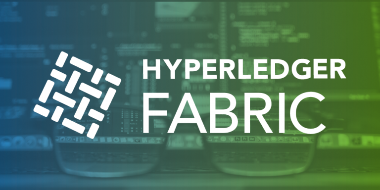

# Building Hyperledger Fabric Network for Blockchain Applications
## Learn how to develop blockchain applications with Hyperleder Fabric

mattumd

Tags: Cloud computing, Continuous engineering, Linux, Web development

Published on June 26, 2019 / Updated on March 23, 2020

### Overview

Skill Level: Any Skill Level

In this recipe, we show you how to set up your first Hyperledger Fabric network for creating blockchain applications.

### Ingredients

To follow and complete this recipe, you need to have good knowledge of blockchain, Hyperledger transactions, JavaScript as well as basic knowledge of Linux.

### Step-by-step

#### 1. Hyperledger Fabric Overview

Hyperledger Fabric is an open source enterprise-grade platform that leverages a highly-modular and configurable architecture. Hyperledger Fabric is optimized for a broad range of industry use cases, including the finance, banking, healthcare, insurance, and public sectors, as well as supply chains and digital asset management. [Here](https://learn.coding-bootcamps.com/blog/202224/why-build-blockchain-applications-with-hyperledger-fabric "Hyperledger Fabric Features") is a good article on why choosing Hyperledger Fabric over other blockchain development platforms.  

For those who are not familiar with Hyperledger project [Intro to Hyperledger Family and Hyperledger Blockchain Ecosystem](https://weg2g.com/application/touchstonewords/article-intro-to-hyperledger-family-and-hyperledger-blockchain-ecosystem.php), [Hyperledger Design Philosophy and Framework Architecture](https://weg2g.com/application/touchstonewords/article-overview-of-hyperledger-design-philosophy-and-framework-architecture.php), [The Survey of Hyperledger Fabric Architecture and Components for Blockchain Developers](https://weg2g.com/application/touchstonewords/article-the-survey-of-hyperledger-fabric-architecture-and-components-for-blockchain-developers.php) and [Overview of Building Blockchain Smart Contracts in Hyperledger](https://weg2g.com/application/touchstonewords/article-overview-of-building-blockchain-smart-contracts-in-hyperledger.php) articles are strongly recommended.  
Hyperledger Fabric supports Smart Contact development in general-purpose programming languages, such as JavaScript, Java, Go, and Node.js. Hyperledger Fabric is also operating under a governance model to build trust between participants on a shared network.  
In our previous recipe, we have successfully [installed Hyperledger Fabric on an AWS EC2 virtual machine](https://myhsts.org/tutorial-learn-how-to-install-blockchain-hyperledger-fabric-on-amazon-web-services.php), in this recipe, we will set up the first Hyperledger Fabric network. To run this recipe, you need to complete the installation of Hyperledger Fabric with samples and binaries on the AWS EC2 instance. In this recipe, we cover the following:

*   Generating the crypto/certificate using cryptogen
*   Generating the configuration transaction using configtxgen
*   Bring up the nodes based on what is defined in the docker-compose file

In our next recipe, we will work with [Hyperledger Fabric CLI to set up network and manage chaincode](https://myhsts.org/tutorial-learn-how-to-work-with-hyperledger-fabric-cli-to-setup-network-and-manage-chaincode.php). Specifically, we cover the following:

*   Using the CLI to set up the first network
*   Using the CLI to install and instantiate the chaincode
*   Using the CLI to invoke and query the chaincode

#### 2. Build Hyperledger Fabric Network

There is a **Build your first network** (**BYFN**) sample installed with Hyperledger Fabric. We will use that to provision a sample Hyperledger Fabric network that consists of two organizations, each maintaining two peer nodes, and a solo ordering service. To do this, follow these steps:

1\. Log in as a default user and execute the byfn.sh script to generate certificates and keys for the network:

$ cd ~

sudo chmod 777 -R fabric-samples

cd fabric-samples/first-network

sudo ./byfn.sh generate

2\. Bring up the Fabric network by executing the byfn.sh script using the up option:

$ cd ~

cd fabric-samples/first-network

sudo ./byfn.sh up

You should see the following output, which states that the network has started successfully:

3\. Bring down the Fabric network by executing the byfn.sh script using the down option to shut down and clean up the network. This kills the containers, removes the crypto material and artifacts, and deletes the chaincode images. The following code shows how to do this:

$ cd ~

cd fabric-samples/first-network

sudo ./byfn.sh down

Let's review the byfn.sh script, shown as follows. This script is well documented, and you should read about it in detail to understand each execution step during the network startup process:  

We will review and exam the Hyperledger Fabric byfn.sh script using the command-line interface.

4\. Use the tool for crypto and certificate generation, called cryptogen, which uses a YAML configuration file as the base to generate the certificates:

OrdererOrgs:

Name: Orderer

Domain: example.com Specs:

Hostname: orderer PeerOrgs:

Name: Org1

Domain: org1.example.com

EnableNodeOUs: true Template:

Count: 2 Users:

Count: 1

\- Name: Org2

Domain: org2.example.com

EnableNodeOUs: true

Template:

Count: 2

Users:

Count: 1

The following command will generate the YAML file:

$ cd ~

$ cd fabric-samples/first-network

$ sudo ../bin/cryptogen generate --config=./crypto-config.yaml

On execution of the previous command, you will find a new directory crypto-config is created, and inside there are directories that correspond to ordererOrganizations and peerOrganizations. We have two organizations,Org1.example.com and Org2.example.com ) network artifacts.

5\. Let's generate the configuration transaction. The tool to generate the configuration transaction is called configtxgen. The artifacts generated in this step are the orderer genesis block, the channel configuration transaction, and one anchor peer transaction for each peer organization. There will also be a configtx.yaml file that is broken into several sections: profiles (describe the organizational structure of the network), organizations (the details regarding individual organizations), orderer (the details regarding the orderer parameters), and application (application defaults—not needed for this recipe).

The profiles that are needed for this recipe are shown as follows:

Profiles:

TwoOrgsOrdererGenesis:

<<: \*ChannelDefaults

Orderer:

<<: \*OrdererDefaults

Organizations:

\*OrdererOrg

Capabilities:

<<: \*OrdererCapabilities

Consortiums:

SampleConsortium:

Organizations:

\*Org1

\*Org2

TwoOrgsChannel:

Consortium: SampleConsortium

Application:  
<<: \*ApplicationDefaults

Organizations:

\*Org1

\*Org2

Capabilities:

<<: \*ApplicationCapabilities

Let's go with the detailed command-line steps to understand what is happening:

$ export FABRIC\_CFG\_PATH=$PWD

sudo ../bin/configtxgen -profile TwoOrgsOrdererGenesis - outputBlock ./channel-artifacts/genesis.block

export CHANNEL\_NAME=mychannel

sudo ../bin/configtxgen -profile TwoOrgsChannel

\-outputCreateChannelTx ./channel-artifacts/channel.tx -channelID $CHANNEL\_NAME

sudo ../bin/configtxgen -profile TwoOrgsChannel

\-outputAnchorPeersUpdate ./channel-artifacts/Org1MSPanchors.tx -channelID $CHANNEL\_NAME -asOrg Org1MSP

sudo ../bin/configtxgen -profile TwoOrgsChannel

\-outputAnchorPeersUpdate ./channel-artifacts/Org2MSPanchors.tx -channelID $CHANNEL\_NAME -asOrg Org2MSP

Here, we write the blockchain genesis block, create the first channel transaction, and write anchor peer updates. You may not care how exactly it is done, but this is how Fabric is built from the bottom up. You can see that four new files are generated and stored in the channel-artifacts directory:

*   genesis.block
*   channel.tx
*   Org1MSPanchors.tx
*   Org2MSPanchors.tx

6\. The Docker Compose tool is used to bring up Docker containers. We use docker-compose-cli.yaml to keep track of all Docker containers that we bring up:

$ cd ~

$ cd fabric-samples/first-network

$ sudo docker-compose -f docker-compose-cli.yaml up -d

7\. We have brought up six nodes: cli, orderer.example.com, peer0.org1.example.com, peer0.org2.example.com, peer1.org1.example.com, and peer1.org2.example.com:  

To recap, in this recipe, we learned the following:

*   Generating the crypto/certificate using cryptogen
*   Generating the configuration transaction using configtxgen
*   Bring up the nodes based on what is defined in the docker-compose file

In our next recipe, we will work with Hyperledger Fabric CLI to set up network and manage chaincode. Specifically, we cover the following:

*   Using the CLI to set up the first network
*   Using the CLI to install and instantiate the chaincode
*   Using the CLI to invoke and query the chaincode

It is good to know that after we set up our first network on Hyperledger Fabric, we move on to the following 3 steps or recipes:

*   [Adding Organization to Channel in Hyperledger Fabric](https://myhsts.org/tutorial-learn-how-to-add-organization-to-channel-in-hyperledger-fabric.php)
*   [Use CouchDB as a State Database for Hyperledger Fabric](/recipes/tutorials/use-couchdb-as-a-state-database-for-hyperledger-fabric/)
*   [Writing First Blockchain Application in Hyperledger Fabric](https://myhsts.org/tutorial-learn-how-to-write-first-blockchain-application-in-hyperledger-fabric.php)

This recipe is written in collaboration with Brian Wu who is a senior Hyperledger instructor at [Coding Bootcamps](https://coding-bootcamps.com/) school in Washington DC.
