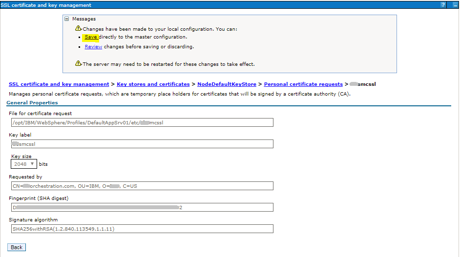

# SSL Certificate Signing Request (CSR) creation in WebSphere Application Server (WAS)
## Creation of Certificate Signing Request (CSR) in WAS, which can then be sent to a Certifying Authority (CA) to obtain a signed certificate

PramodSapare

Tags: Java development, Security, Web development

Published on March 25, 2019 / Updated on April 29, 2021

### Overview

Skill Level: Intermediate

Exercise caution when working on the WebSphere Admin Console

Step-by-step instructions to create a Certificate Signing Request (CSR) in WebSphere Application Server (WAS). The screenshots included are from WAS 9.0.

### Ingredients

WebSphere Application Server (the screenshots are from WAS v9.0)

### Step-by-step

#### 1. Login into WAS Admin Console

Login into WAS Admin Console: https://<WAS\_ADMIN\_HOST>:<WAS\_ADMIN\_PORT>/ibm/console

#### 2. Navigate to certificate configuration section

Go to **Security** (Left Nav) -> **SSL certificate and key management** and click on **Key stores and certificates** link

#### 3. Select the KeyStore

Click on **NodeDefaultKeyStore**

#### 4. Navigate to certificate request section

Under **Additional Properties**, click on **Personal certificate requests**

#### 5. Start with new certificate request creation

Click on **New**

#### 6. Enter the certificate request details

Provide all the necessary details and click on **Apply**.

#### 7. Confirm the entered details

The CSR details can be seen as below. Click on **Save**.

####8.  CSR creation successful

#### 9. Get the CSR file

The CSR file can be obtained from the WAS machine from the highlighted location, **File for certificate request**.

#### 10. Send to CA

This CSR file can be sent to any of the Certifying Authority (CA) to receive a signed certificate.

Based on this CSR, CA will provide a signed certificate. To receive this certificate in WAS, please refer to my recipe [SSL Certificate Receipt in WebSphere Application Server (WAS)](https://github.com/IBM/IBMDeveloper-recipes/blob/main/ssl-certificate-import-in-websphere-application-server-was/index.md)
