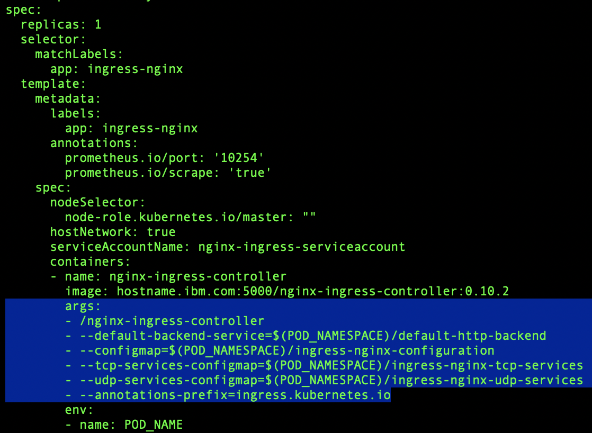
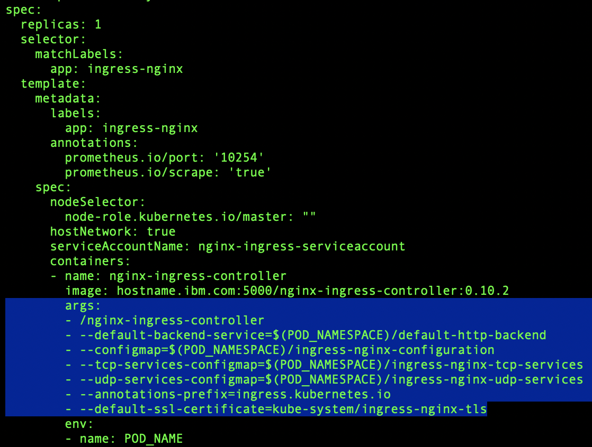

# Changing the TLS certificate in Ingress in Information Server Kubernetes Deployments
## How to change the TLS certificate served by Ingress in Information Server Kubernetes Deployments

Scott Brokaw

Published on February 20, 2019 / Updated on November 9, 2020

### Overview

Skill Level: Intermediate

This recipe will provide steps to change the TLS certificate that is used with the Ingress deployment in Kubernetes in Information Server. These steps were verified on versions 11.7.0.1, 11.7.0.2, and 11.7.1.x

### Step-by-step

#### 1. Obtain the new TLS certificate

The certificate and server key need to be available as two files in PEM format. These two files are usually provided by a certificate authority if the certificate is to display as trusted in a web browser or truststore.

If you wish to create your own self-signed certificate, you can execute the following command:

`openssl req -new -x509 -nodes -out ingress.crt -keyout ingress.key -days 9999 -subj /CN=hostname.fqdn.com`

_Note: Self-Signed Certificates will not be automatically trusted by most browsers or truststores._

To create a CSR (Certificate Signing Request) to send to your certificate authority, you can run a command such as:

`openssl req -new -newkey rsa:2048 -nodes -keyout ingress.key -out ingress.csr`

Fill out the prompts and you will be generated a CSR file that you can provide to your certificate authority  

If you receive a certificate in p7b (PCKS \#7) format, you'll need to convert it to a x.509 certificate. You can do this by executing the following command:

`openssl pkcs7 -print_certs -in certificate.p7b -out ingress.pem`

If you receive a certificate in p12 (PCKS \#12) format, you'll need to convert it to a x.509 certificate and exclude the inclusion of the private key. You can do this by executing the following command:

`openssl pkcs12 -nokeys -in certificate.p12 -out ingress.pem`

In either case, verify you can view/load the certificate by running:

`openssl x509 -in ingress.pem -text -noout`

If the command correctly displays the details of the certificate, you may continue, otherwise, if you see a message such as "unable to load certificate" you may have a different formatted certifcate that needs to be converted. Work with your certificate authority for assistance.

#### 2. Create a TLS Secret in Kubernetes

Using the certificate and key file obtained from the prior step, create a [Kubernetes Secret object](https://kubernetes.io/docs/concepts/configuration/secret/ "Kubernetes Secret object"). The secret will be referenced within the declarative deployment manifest file for the Ingress Controller.

**11.7.0.1 and 11.7.0.2:**

To create the secret object, run the following command:

`kubectl -n kube-system create secret tls --cert ingress.pem --key ingress.key ingress-nginx-tls`

**11.7.1.x:**

The ingress-ngnix-tls secret will already exist, so use the following command to update it with your new certificate:

`kubectl -n kube-system create secret tls --cert ingress.pem --key ingress.key ingress-nginx-tls --dry-run -o yaml | kubectl apply -f -`

At this point, if you're running 11.7.1.x you are done and can skip the rest of the steps below! Refresh the web application such as a the launchpad and you should see the new certificate being used.

#### 3. Modify the Ingress Controller (11.7.0.1 and 11.7.0.2 only)

There are several ways to update the manifest file, but it is advised to directly modify the `ingress-nginx-controller.yaml` in your respective deployment.

For hybrid Information Server environments where there is a seperate Unified Governance or Enterprise Search tier, this file is usually located in:

`/opt/IBM/UGinstall/manifests/ingress-nginx-controller.yaml`

For InfoSphere Information Server Enterprise Edition with Docker containers [offering](https://www.ibm.com/support/knowledgecenter/SSZJPZ_11.7.0/com.ibm.swg.im.iis.productization.iisinfsv.install.doc/topics/t_install_is_ug_docker_in_kube_cluster.html) (i.e. the entire suite of products in containers managed by Kubernetes), the file is usually located in:

`SingleInstaller/manifests/ingress-nginx-controller.yaml`

or

`/home/mykubeadm1/manifests/ingress-nginx-controller.yaml`

A find command can be leveraged if you are unable to find the file:

`find / -name ingress-nginx-controller.yaml -print`

In the manifest file, locate the args section, matching the highlighted content:

Add an additional line to include the secret created from step 2:

`- --default-ssl-certificate=kube-system/ingress-nginx-tls`

It is **_incredibly important_** to ensure **_spaces_** are used for indentation and that the **_indentation level is in line_** with the other args. Your updated file should now match this example:

Save the file.

#### 4. Apply the changes to the Kubernetes Cluster (11.7.0.1 and 11.7.0.2 only)

Finally, apply the modified manfiest file to the Kubnetes Cluster by executing the following command:

`kubectl apply -f ingress-nginx-controller.yaml`

You will see the Ingress pod be removed and a new one launched.

`kubectl get pods -n kube-system -l app=ingress-nginx`

Once the new pod is marked ready, the TLS certificate change should be complete. Re-Launch the Information Server Launchpad and verify the certificate details.
