# Connect Watson Assistant with Wikipedia API via Cloud Functions & Webhooks
## Ever wanted your personal encyclopedia?

sophierm

Tags: Cognitive computing

Published on May 6, 2019 / Updated on August 7, 2020

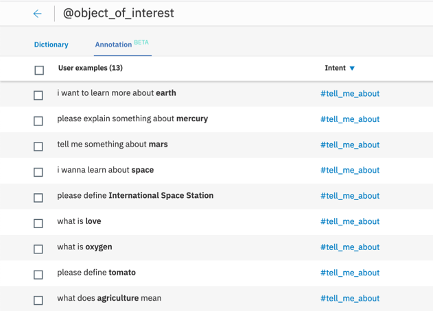

### Overview

Skill Level: Intermediate

You’ll build a chatbot that gives definitions of not only a given set of entities, but the whole world of Wikipedia. We will make external API callouts from Watson Assistant using Webhooks to get definitions for contextual entities from Wikipedia.

### Ingredients

IBM Cloud Account

Watson Assistant

Cloud Functions

### Step-by-step

#### 1. Setup Watson Assistant

Let’s start with Watson Assistant. It’s going to be a very basic dialog tree like this:

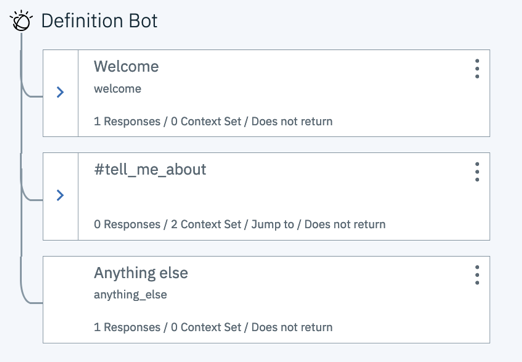

Let’s do this step by step:

1\. Go to IBM Cloud Catalog https://cloud.ibm.com/catalog and search for “Watson Assistant”

2\. Make sure your Assistant is in the same Region as your Cloud Function

3\. Click on “Create”

4\. Start by clicking on “Launch tool”

5\. Set up a new Skill by clicking on "Skills" --> "Dialog Skill" --> "Create new"

#### 2. Train Intent

Now that we have set up the chatbot, we want to teach it to understand our intention.

1\. Click on “Create intent” and define a name for it (e.g. #tell\_me\_about). Click on “Create intent”

2\. Add multiple different user examples to this intent:

3\. Add user examples:

*   Please define gravity
*   Can you explain something about the International Space Station
*   Tell me something about Star Wars
*   what is love
*   give me the definition of literature
*   etc.

#### 3. Annotate Entities

Now, we want to teach the chatbot to extract the correct object of interest. Therefore, we’ll use contextual entities.

With contextual entities, you can define entities based on their context in the utterance. You do this by annotating the entities in your intent examples. Watson will use these annotations to learn how to identify the entity values and can match new values that have not been explicitly annotated.

You simply highlight the part of the utterance, enter an entity name (let’s take @object\_of\_interest) and save.

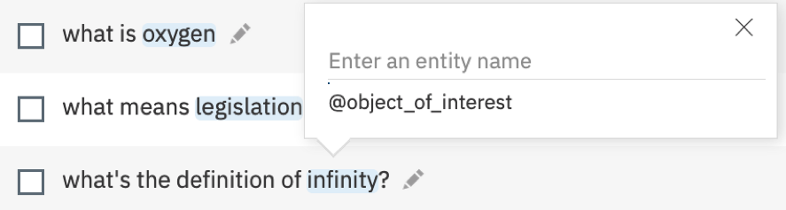

Make sure your examples also include entities consisting of several words. Otherwise, the model will learn that the @objects\_of\_interest are one-word-objects only.

If you look at the entities page, you can see the annotations, and the intents they were annotated in:


#### 4. Set Up an IBM Cloud Function

1\. Go to IBM Cloud Catalog https://cloud.ibm.com/catalog  
2\. Search “Functions”  
3\. Click on Functions service  
4\. Click on “Start Creating”  
5\. Click on “Create Action”

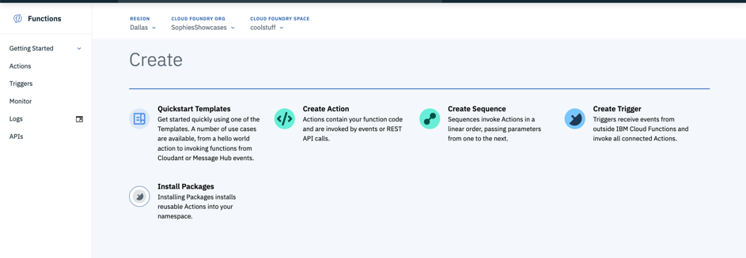

6\. Type your Action name \[action\_name\], e.g. Wikipedia-Connection  
7\. Create a package with any \[package\_name\], e.g. Assistant-Functions  
8\. Select your language. In that recipe, we will use Node.js  
9\. Create your function  
10\. We can now start editing the function!

_Hint:_

_\--> make sure to work on a Cloud Foundry-based namespace_

_\--> the Cloud Function and Watson Assistant instance need to be in the same region_

#### 5. Edit Function

Now, we can start setting up the Wikipedia Connection!

We will send an API request to https://en.wikipedia.org/w/api.php and will hand over the parameter ‘object\_of\_interest’, which is going to be defined in our Watson Assistant Workspace later. As a result, we receive a JSON file with the extract of our desired object.

```
let rp = require('request-promise')
function main(params) {
const options = {
    uri: "https://en.wikipedia.org/api/rest_v1/page/summary/"+ encodeURIComponent(params.object_of_interest)+ "?redirect=true",
    json: true
}
return rp(options)
.then(res => {
    return { extract : res }
})
}
```

1\. Don’t forget to save your action  
2\. By clicking on “Invoke”, you can test your function and see the output in the console. However, if you invoke this action, you will get a result with “undefined” extract. That’s correct, as we haven’t handed over anything yet!

#### 6. Enable as Web Action

Now, select Endpoints from the left hand side of the page and check **Enable as Web Action** and Save your changes.

Copy down the URL that’s created under Web Actions, you’ll need this later.

#### 7. Configure Webhook in Watson Assistant

Now that you’ve created your webhook it’s time to start connecting it to Watson Assistant. Note you’ll need the URL you copied the step before.

Go to your Watson Assistant, choose Options>Webhooks on the left hand side and paste the URL into the input box.

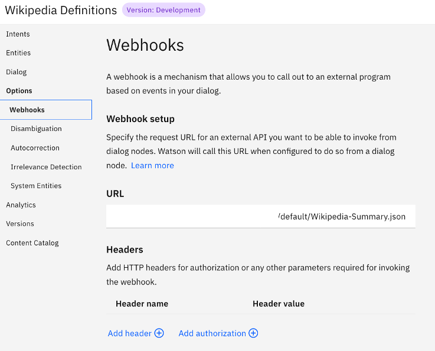

Note that you need to add a “.json” to the URL so that Watson knows you’re returning a json snippet.

#### 8. Build Dialog

Now, let’s create the conversational part. Navigate yourself to the Dialog section and click on Create Dialog. You will see how a basic dialog tree builds up.

Create a new dialog node by clicking on **Add Node.**

Fill in the condition:

If assistant recognizes #tell\_me\_about && @object\_of\_interest

To make use of the WebHook, activate WebHooks (via Customize button) and click Apply.

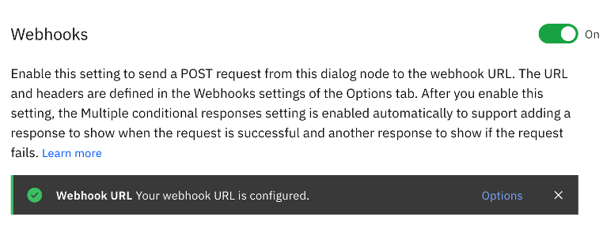

Next, we need to define the parameter for the WebHook to make the callout:

Key: object\_of\_interest

Value: “@object\_of\_interest”

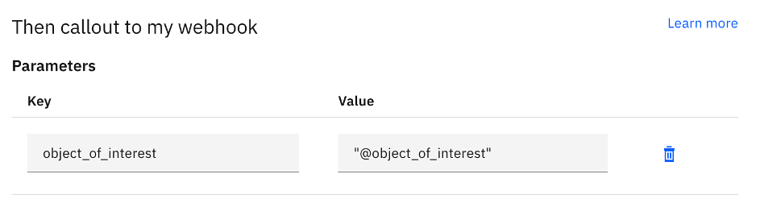

As a return variable, we get $webhook\_result\_1 (as shown in the dialog node).

#### 9. Define Responses - I

Below “Assistant responds”, let’s define several answer variations, from specific to general.

**Why?** The Wikipedia API sometimes includes images as thumbnails which would be cool to include, but sometimes there’s text only. Moreover, some requests return “standard” responses, some “disambiguation” (when the question term refers to several topics) and some “not found”. In order to handle those, you can define different answer conditions.

To return both an image and text in the first response alternative, click on the blue gear to customize the response:

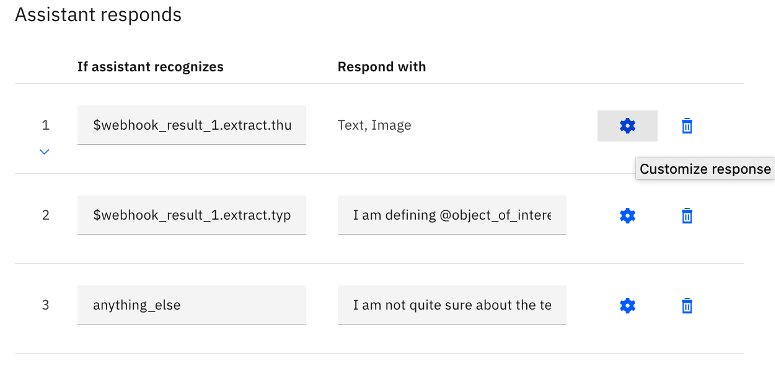

#### 10. Define Responses - II

**First Answer – With picture**

Condition: $webhook\_result\_1.extract.thumbnail

Answer (Text): I am defining @object\_of\_interest : <? $webhook\_result\_1.extract.extract ?>

Answer (Image):

Title: $webhook\_result\_1.extract.title

Description: $webhook\_result\_1.extract.description

Image source: $webhook\_result\_1.extract.thumbnail.source

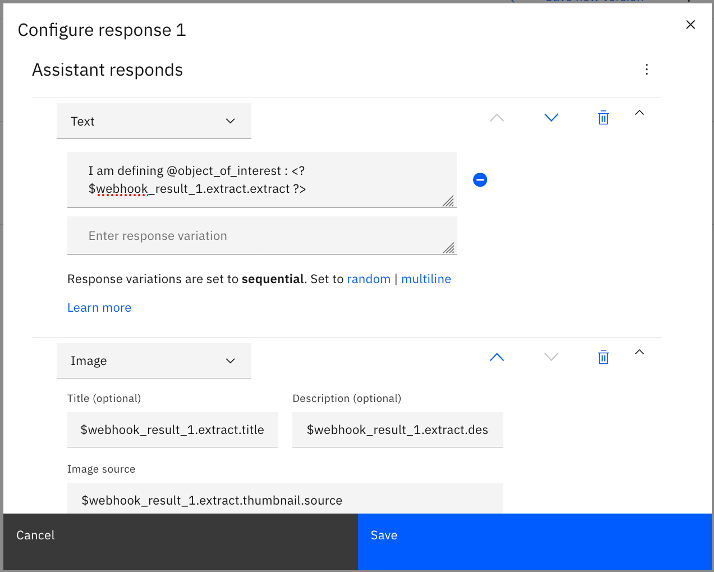

_Hint: You can add the image by clicking on “Add response type” and choosing “Image” instead of “Text”. Define the parameters and don’t forget to hit “save”!_

**Second Answer – Text only**

Condition: $webhook\_result\_1.extract.type=='standard'

Answer: I am defining @object\_of\_interest : <? $webhook\_result\_1.extract.extract ?>

_Hint: Add more responses by clicking on “Add response” and move them up and down by using the arrows, sorting form specific to general._

**Third answer – Anything else**

Condition: anything\_else

Answer: I am not quite sure about the term @object\_of\_interest . Please try another topic.

Great, let’s check our result!

#### 11. Check Result

You can easily try out your assistant by clicking on “Try it” on the right side. Pose different questions and notice the result! Have a look at the structure $webhook\_result\_1 by clicking on “Manage Context” in the Try Out Pane.

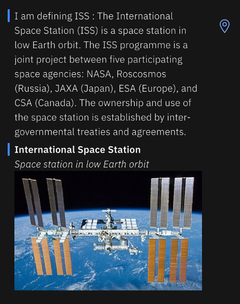

Note the different answer types as you ask for different definition terms – when asking for the ISS, you’ll get a pretty cool response!

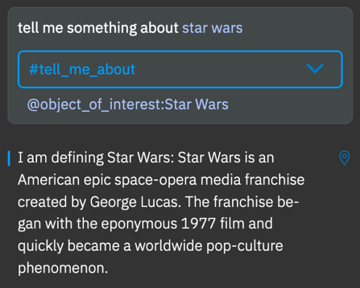

_Hint: You might need to add more training data to your intent and contextual entities in order to improve understanding._

#### 12. That's it - congrats!

Awesome! You can now extend on this basic functionality or integrate the capability into your existing chatbots and voice bots. Check out further tutorials to learn how to create a voice-enabled bot and let your personal digital assistant give definitions whenever you need them :-)

I’d be interested in more code patterns of Wikipedia API integrations, feel free to share your developments in the comments!
