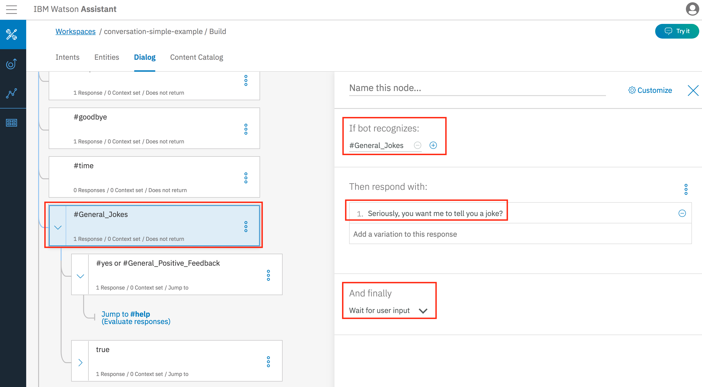
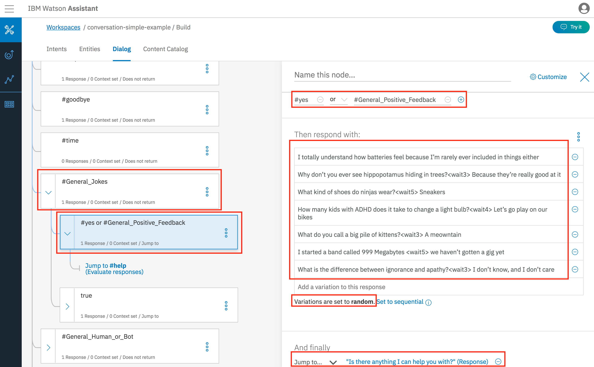
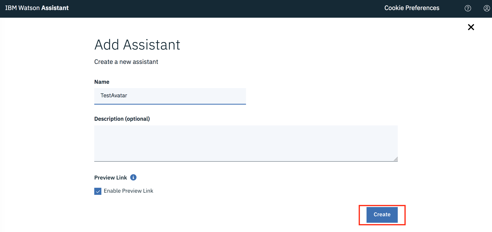
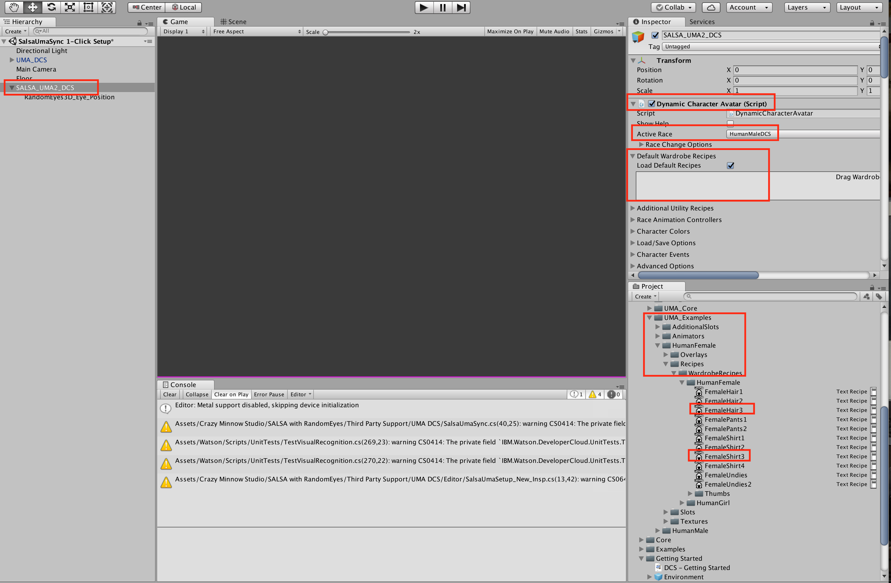
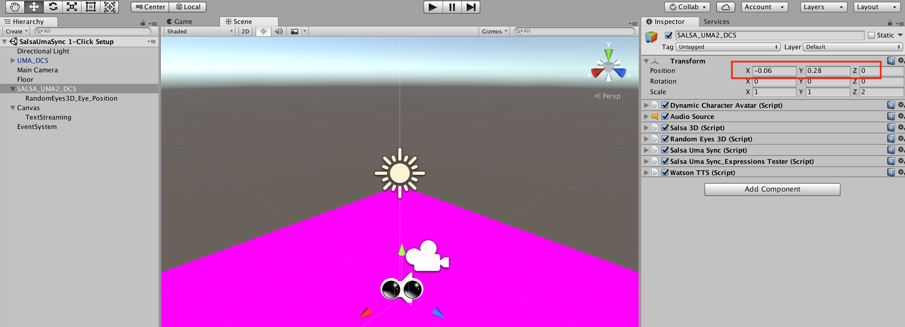

# Create a 3D Digital Human with IBM Watson Assistant and Unity3D
## Use Unity3D, UMA2, SALSA and the IBM Watson SDK to create a 3D Virtual Assistant that can be a friendly front-end to your chat-bot service.

Tony_Pigram

Tags: Cloud computing, Cognitive computing

Published on April 27, 2018 / Updated on February 22, 2021

### Overview

Skill Level: Intermediate

A basic knowledge of Unity3D and C# is assumed

Using the tools described, you can use the Unity3D front-end to speak and listen to your questions and be responded to in the exact same manner as if you were using a text-based chat bot, except this is way cooler!

Disclaimer: This code is provided as-is

### Ingredients

IBM Cloud account - [sign up for one](\"https://console.bluemix.net/registration/?target=%2Fdashboard%2Fapps\"), if you don't already have one.

Unity3D development environment - [Downloads](\"https://unity3d.com/get-unity/download\") (_as per the [EULA guidelines](\"https://unity3d.com/legal/terms-of-service\"), determine the [correct version](\"https://unity3d.com/legal/terms-of-service/software\") for you_)

Sign up for a [unity developer account](\"https://assetstore.unity.com/auth/signup?redirect_to=%2F\") (so you can access the [unity asset store](\"https://assetstore.unity.com\"))

(free) UMA2 plug-in - available from [unity asset store](\"https://assetstore.unity.com/packages/3d/characters/uma-2-unity-multipurpose-avatar-35611\")

(not-free) SALSA plug-in (RandomEyes and LipSync)\* - available from [unity asset store](\"https://assetstore.unity.com/packages/tools/animation/salsa-with-randomeyes-16944\")

(free) IBM Watson SDK - available from unity assets store ([available directly from here](\"https://github.com/watson-developer-cloud/unity-sdk\"))

IBM Watson APIs - [Watson Assistant](\"https://console.bluemix.net/catalog/services/watson-assistant-formerly-conversation\") / [Speech to Text](\"https://console.bluemix.net/catalog/services/speech-to-text\") / [Text to Speech](\"https://console.bluemix.net/catalog/services/text-to-speech\") - available from IBM Cloud

\*other products are available, I just happened to choose this one due to it's simplicity, ease-of-use and very helpful website

[https://developer.ibm.com/code/open/projects/watson-developer-cloud-unity-sdk/](\"/code/open/projects/watson-developer-cloud-unity-sdk/\")

I apologise up-front that this article is very screenshot heavy, but I do feel that they add value as a walk-through guideline - and you can always see what setting values I have in my environment (_that works_) and compare it to yours that might not.

I'm afraid that due to having to purchase the license/software for SALSA I will not be supplying a github repo. for this project - but, as you will see below, all of the components are available for you to install, configure and setup. The only code is the .cs file and I've screenshot the contents of that file enough for you to recreate yourself.

UPDATE: Okay, for ease of reading, I've [uploaded the .cs file to a github repo. as-is](\"https://github.com/YnotZer0/unity3d_watsonSdk/blob/master/WatsonTTS.cs\")

**UPDATE/UPDATE**: As mentioned by a few people during November 2018, the Watson Services and SDK was migrated to use the new AIM Token Authentication mechanism, which broke the previous code that connected to the Watson services. I have now created a [NEW Watson\_newServices.cs file that can downloaded from the github repo](\"https://github.com/YnotZer0/unity3d_watsonSdk/blob/master/Watson_newServices.cs\"). This still allows you to use the username/password if you have old services, but if you create new one's you will need to use the aimkey value. I've tested this in a newer version of Unity (2018.2.16f1) also.

UPDATE 2021: A very kind fellow developer has extended the .CS file to utilise the latest Watson SDK 4.30 - you can [DOWNLOAD his CS file from GITHUB](\"https://github.com/Qusai-Azzam/Unity3d-IBM-WatsonAPI\") if you require it

Here's a sneak peek of the end result:

https://youtu.be/Ff04RHfgvHg

[This ARTICLE](\"https://medium.com/@soulmachines/that-may-sound-like-a-line-from-a-sci-fi-movie-and-feel-very-much-like-tomorrows-world-but-it-is-fa29c188abf1\") does a really good job (from [SOULMACHINES](\"https://www.soulmachines.com/\")) of explaining why using a human interface is going to change the way we interact with computers....

UPDATE: Okay, following on from a few comments being posted about errors with the latest Watson SDK (2.4.0) that was breaking the code, I tested this myself to replicate the issue. I downloaded the latest version of Watson SDK 2.4.0 .zip file, extracted it and overwrote the Assets/Watson folder with the contents.

When starting up Unity and opening the Project I see the following message (and this matches the error raied in the comments below):

(_oddly, even though I downloaded v2.4.0 the changelog file still only showed 2.3.0 - but I assure you it was the 2.4.0 release I tested with_)

Modify the following 2 lines of code in the WatsonTTS.cs file and everything will then work fine for you - I tested it after the code change and all works as expected.

(Thanks to Crazy Minnow for the info. in the comments)

Due to a change with the Watson Assistant service in November 2018, this article has had to be updated to use the latest Watson SDK (v2.11.0) and the creation of a new Watson Assistant service. (Thanks to Adam Chapman, for raising the issue that the IAM authentication required a code migration to the latest SDK and to change the WatsonTTS.cs code to connect to the Watson Assistant service).

[Get the latest .cs file from the Github repo here.](\"https://github.com/YnotZer0/unity3d_watsonSdk/blob/master/Watson_newServices.cs\")

....

UPDATE 2021: A very kind fellow developer has extended the .CS file to utilise the latest Watson SDK 4.30 - you can [DOWNLOAD his CS file from GITHUB if you require it](\"https://github.com/Qusai-Azzam/Unity3d-IBM-WatsonAPI\")

### Step-by-step

#### 1. Create and setup your IBM Watson API services

    As defined in the ingredients section, it is assumed that you have an [IBM Cloud account](https://console.bluemix.net/?cm_sp=dw-bluemix-_-recipes-_-devcenter). Sign in to your account and select \[Catalog\] \[Watson\]. The services that we are interested in are highlighted below:

    

    (_As you can see, there are many more Watson API services that you can investigate and integrate for version 2.0_)

    Select the \[Speech to Text\] service and select \[Create\]:

    

    Once created, we need to take a copy of the \[Service Credentials\] as we'll need them within the Unity3D app:

    

    Now, repeat the same thing for the \[Text to Speech\] service:

    

    

    (The following was valid in April/June 2018 for the creation of a Watson Assistant service - if you create a NEW service today, it will not provide you with a username/password, but an API Key and will require you to setup the service a little differently. I shall leave the original screenshots/documentation below for historic reasons, but if you are creating a new service post-November 2018, then you should see the following section for how to setup a sample Watson Assistant service to be used by your Virtual Assistant)

    Finally, we need to create a \[Watson Assistant\] service:

    

    

    Now, we have all the \[Service Credentials\] that we shall need to include from the Unity3D Watson SDK.

    For the sake of this article, we shall create some quick and simple conversation Intent/Entity and Dialog flows within the \[Watson Assistant\] service.

    To perform this, we need to click on \[Manage\] and then click on \[Open tool\]:

    

    Then select the \[Workspaces\] tab from the Intoduction screen.

    This will show the tiles of Workspaces. Create a new Workspace (or re-use an existing one). I am using a pre-existing Workspace:

    

    We need to click on \[View Details\] in order to get the Workspace Id (that we need in order to connect to this Workspace Id):

    

    Once we have that value, we can click on the Workspace to see the Intents/Entities/Dialogs:

    

    As you can see, I have some pre-setup Intents (some copied from the \[Content Catalog\]), but for this recipe, I just setup the \[#General\_Jokes\] Intent

    

    I setup 17 examples, which is a reasonable amount of examples for an Intent.

    I also setup some Entities, I'll include them here just to show the \[@startConversation\], as you'll see that in the \[Dialog\] tab shortly:

    

    Switch to the \[Dialog\] tab and by default you should have a \[Welcome\] node. This is the initial node that is executed when you first call the \[Watson Assistant\] API. As you can see below, this is the first node that gets executed on an initial connection \[conversation\_start\] and will respond with the text "HAL 9000 initiated and awaiting your command" and shall wait at this point for the users input:

    

    We shall create a new top-level node and link it to the \[#General\_Jokes\] intent, therefore, if the #General\_Jokes intent is identified and triggered it shall follow this node and into it's child nodes, but first, it shall return back the response to the user "Seriously, you want me to tell you a joke?" and wait for a response from the user:

    

    If the user responds with "Yes" (or something positive) then we shall respond with a "random" response, that happens to be a joke (I didn't say they were quality jokes....but you can change that). (_Take note the <waitX> tags within the responses, we'll come back to that later on_)

    

    We create a child node response for a non-Yes response, here we're just taking any non-Yes response and catering for it rather than an exact "no" response (but you can modify that if you like). As you can see, if you respond with a non-Tes response, we just respond with "Okay, not a problem, no funny time for you then"

    

    That's enough and pretty much all we really need to setup within the \[Watson Assistant\] service for now - you can extend it much more as you see fit.

    **POST-NOVEMBER 2018 Watson Assistant service creation/setup example:**

    You will notice now that if you create a new Watson Assistant service there are new ways to connect and configure the service.

    Tutorials are available HERE to show you the new features and how to use them, for this articale, we shall just do the minimum that is required.

    

    

    

    

    

    

    

    

    

    

    

    

    You do not need to, but if you wanted to add further integrations you can:

    

    You can still test the conversation with the \[Try it out\] button, this should be the same conversation you will have with your Virtual Assistant:

    

    Remember, for this to work, you will need to upgrade to the v2.11.0 SDK release, as this supports the new connection code:

    

    The changes you need to make to the WatsonTTS.cs file can be lifted directly from the sample code provided with the SDK, we're going to pretty much copy the code as-is and use it ourselves to connect. If the username/password is present, we'll use those values if not, we'll use the API key value to connect to the Watson Assistant service.

    [CHECK OUT THE NEW CODE IN THIS FILE IN THE GITHUB REPO.](https://github.com/YnotZer0/unity3d_watsonSdk/blob/master/Watson_newServices.cs)

    _\>I must confess that I am on a very limited wi-fi signal in a hotel at this point in time and have not tested this fully, it should work, based on the code within >ExampleConversation.cs (from the v2.11.0 SDK code). when I get the opportunity, I shall confirm that it is correct. It should gve you enough to work with >though._

    **UPDATE**: I have tested this code and it works fine, everything connects as it should, it behaves as it did previously and all is good again.

#### 2. Setup Unity3D

    After you've downloaded and installed Unity, when you start you'll be given the option to create \[New\] or \[Open\] an existing project. Select \[New\].

    

    Select \[Add Asset Package\], you need to add \[IBM Watson Unity SDK\], \[SALSA With RandomEyes (assuming you have purchased it via the unity asset store)\] and \[UMA 2 - Unity Multipurpose Avatar\]:

    If the \[IBM Watson Unity SDK\] is not available, please follow the instructions [HERE](https://github.com/watson-developer-cloud/unity-sdk#installing-the-sdk-source-into-your-unity-project) to obtaining the SDK and adding it manually to your Unity project.

    

    You will then be presented with an "empty" Unity3D project, like so:

    

    Follow the instructions [as defined on the SALSA website here](http://www.crazyminnowstudio.com/posts/salsa-add-on-for-uma-dcs/)

    You need to go to the SALSA website and download the UMA\_DCS asset, select \[Assets\], \[Import Package\], \[Custom Package\] and select the .unitypackage file that you downloaded:

    

    **UPDATE:** For some reason I have to import this twice for it to import the \[x\]Examples folder - that we need for the Scene.

    This will then give you access to the Example/Scenes \[SalsaUmaSync 1-Click Setup\] - this has the GameObjects pre-selected and setup for us to use out-of-the-box:

    

    Double-click this scene to open it in the Unity IDE.

    

    Click on the \[Main Camera\] and make sure that the \[Audio Listener\] is selected (this is the Microphone input):

    

    Just make sure that this has a tick so that it is active.

    In relation to the \[Audio Source\] ensure that you have the "Play On Awake" **UNCHECKED** (by default it might be set to play - we do NOT want this to be active. You'll know if it is as when you press \[>\]Run you will hear "Ethan" talking, so just uncheck here)

    

    All that we shall add extra is a Canvas/Text GameObject, like so:

    

    This is purely so that we can output to the screen what has been detected by the \[Audio Listener\] and then converted via the \[Speech to Text\] service.

    **UPDATE**: Make sure that you add the "Watson" Script component to the SALSA\_UMA2\_DCS GameObject - if you do not you will not hear any audio as the code is setup to link to the AudioSrc of this GameObject. Basically, if everything runs okay, but you hear nothing, you've attached the "Watson" Script to the "Main Camera" or some other GameObject. You can easily copy over the information and remove the component from wherever you had it previously.

    Ensure that you have all of the Components added to your GameObject like so:

    

    Make sure that you have "Play" **UNCHECKED,** if you do not then you will see an error output like so:

    

    As we'll be enhancing the default setup, we will add a new folder called \[Scripts\] and we shall add a new file called \[WatsonTTS.cs\] (or Watson\_newServices.cs for the latest update)

    As you can see, in the Inspector view we can add the \[Service Credentials\] from the IBM Watson API services that we captured earlier.

    

    We see a \[Preview\] of the file is you single-click the file, if you double-click then it will then open in the editor you have defined. I have defined to use the Mono-Develop IDE, as we shall see in the next step.

    The one modification that I have made is to add extra Wardrobe items to the UMA character, to do this you do the following:

    

    I changed the \[Active Race\] to Female and added the \[Wardrobe Recipes\]:

    

    One last modification is to change where the UMA avatar is viewed from the Camera perspective, so that we can zoom into just the head of the avatar:

    

    By default, the UMA character will have the "Locomotion" animation assigned to it, which makes it look about randomly, which is a little distracting - if I had more time, I would customise this to be a smaller range, we'll do that for version 2.0. For now, we'll just remove the animation:

    

    We have not covered the content of the \[WatsonTTS.cs\] file yet, but once you've created the content and you press the \[>\] run button you will see your 3d Digital Human, like so:

    

    Due to using the SALSA plug-in, the Avatar will automatically move it's eyes, blink and when it speaks it will perform Lip-syncing to the words that are spoken.

    Not bad for spending less than 30 minutes getting this far! Imagine what you could do in "hours" or "days", refining and getting to know more about the UMA modelling etc... as I say, I've used the out-the-box most basic example here, so I could focus on the integration to the IBM Watson API services, but I will return to refining and enhancing the UMA and SALSA setup and configuration.

    YES! it was commented that the above female avatar looked a bit scary! so I switched her for the male avatar - very simple to do. I repeated the same exercise of adding Pants / T-Shirt / Haircut and eyebrows and in minutes we now have this avatar:

    

    Okay, still not 100% perfect, but pretty good for something this quick and easy - we can iron out the finer details once we get it all working together.

#### 3. Explanation of the WatsonTTS.cs C# file used to control everything

    [UPDATE 2021: A very kind fellow developer has extended the .CS file to utilise the latest Watson SDK 4.30 - you can DOWNLOAD his CS file from GITHUB if you require it](https://github.com/Qusai-Azzam/Unity3d-IBM-WatsonAPI)

    The code that was used as a baseline is already included within the Watson/Examples/ServiceExamples/Scripts folder .cs scripts.

    

    As mentioned in the previous step, we shall create a new C# script file with the following contents.

    To start with, we need to include all the libraries that we shall be using. Then you'll notice that we have field declarations for the Watson APIs that we recorded earlier, we'll set them like this so we don't have to hard-code them into the .cs file.

    You'll also notice that we have private variables declared that we'll use within the script.

    **UPDATE**: [this code is slightly different, but not too much in the latest .cs file](https://github.com/YnotZer0/unity3d_watsonSdk/blob/master/Watson_newServices.cs)

    

    As we do not hardcode the Watson API values in the .cs script, you have to insert the values within the Unity IDE itself, like so:

    

    Now,back to the C# coding. The structure of a .cs file for Unity is to have a Start() method that is executed as an initialiser and an Update() method that is executed every frame (if you've ever coded for an Arduino, then it's a very similar setup).

    

    The Start() method uses the credentials defined in the IDE and the Watson SDK to prepare the objects for later usage.

    In the second part, we execute the code to make an initial connection to the Watson Assistant service, just passing the text "first hello" and the results will be returned to the OnCONVMessage callback method.

    As you can see the object "response" is passed to this method and this will contain the JSON response from the Watson Assistant service.

    

    In the response, we are passed the "context" variable, we shall copy this to the local \_context variable so that we can pass this as an input each time we make a call to the Watson Assistant service to keep track of the "context" values of the conversation.

    You can also see above, that we extract the output:text JSON value as this contains the text that is returned by the Watson Assistant Dialog node.

    Just as an example, I have left in some custom action tags that are contained within the Dialog node response. As you can see above, we can detect these action tags within the conversation text itself and replace these with the values that the Text to Speech API service requires. The reason for these break pauses will become clearer later on. We store the text to be converted into the global variable TTS\_content.

    As you can then see, we set the play variable to true. This will then get picked up on the next cycle of the Update() method.

    

    As you can see the first check we make in the Update() method is to check the value of the play variable. Why do we do this? Well....if we are going to call the Text to Speech service and play the speech to the user, we need to stop the Microphone from listening otherwise we'll get into a self-talking avatar this is speaking and listening to itself. Not what we want. We want to play the message and when finished, we want to start listening for the users input via the microphone.

    There's probably a better way to do it from within Unity, but I found that the above code worked for me. We perform a check (we set the variable value in another method as you'll see shortly) and we countdown the length of time of the clip that is being played. This way, we can then determine when the Avatar has finished speaking / playing the clip and then start listening via the microphone again.

    Going back to the check on the play variable - if we look previously, at the end of the onCONVMessage() callback method we set play to true, so this will call the GetTTS() method.

    

    The GetTTS() method calls the Watson Text to Speech API, the only thing we're setting here is the voice to use and we pass the TTS\_Content variable that contains the text to convert. The callback will go to the HandleToSpeechCalback() method.

    As you can see the clip object is returned and we assign this to the Audio Source and Play() the clip. Here, we set the wait variable to the length of the clip and set the check variable to true - again we use these values within the Update() method.

    Going back up the file, we have the OOTB content from the sample files for the Speech to Text. As you can see

    

    As you can see above, when the method StartRecording() is executed is will call the RecordHandling() method as shown below:

    

    This starts the microhpone listening and takes the captured speech and streams the content to the Speech to Text service.

    

    As you are speaking, the Speech to Text service will attempt to convert the text "live" and show the output to the Canvas text variable on the screen.

    Once the speech has finished (the result is determined to be .final rather than .interim), we take that text and call the Watson Assistant API via the Watson SDK, passing the Input text and the Context variable (as this is the 2nd+ conversation call, we need to keep passing the growing Context variable value)

    That does seem like quite a lot, but it is actually pretty simple and does exactly what it is required to do. Next we'll see what it actually does.

#### 4. Preview and Debug within Unity

    This is what your Unity IDE screen should now look like if you are viewing the "Scene" tab and have the "SALSA\_UMA2\_DCS" GameObject selected:

    

    As you can see, I have the Active Race now set to \[HumanMaleDCS\] and I have added some Wardrobe Recipes from the examples folder.

    When you press the \[>\] Run button, the Avatar will be displayed in the "scene" window within the IDE and you will see the Debug.Log() output values displayed underneath. This is where you can keep track of what is going on within the .cs code:

    

    As you can see I have output when the "play" variable is set to true, this will trigger the action in the Update() method. This is actually where the Speech for the welcome/greeting message is happening. The output with "Server state is listening" is where the Speech has finished and the Microphone is now active and listening. The "\[DEBUG\] tell me a joke" output is showing me what the Text-to-Speech service recognised and will then be passing to the Watson Assistant service. As I say, this is a good way to see the output of each step and to analyse the information in more detail. If you select a line in the DEBUG output, you will see there is a small window at the bottom of the panel that shows you more indepth information - this is really useful for reviewing the contents of the JSON messages passed back and forth.

    If you wish to "see" your avatar outside of the Unity IDE environment, then from the File menu, select Build Settings:

    

    Here you will need to press the \[Add Open Scenes\] if your scene is not in the list initially. You then select \[PC, Mac & Linux Standalone\] and select the Target Platform you wish to output for. You can then press \[Build\] and it will output, in this case for Mac, to a .app application that you can run by double-clicking on it and it will start up the Unity player and your avatar will initiate and you can start talking and communicating as much or as little as you like!

    If you select \[Player Settings...\] you will see in the IDE Inspector on the right, there are more specific details that you can set about the output of the .app itself, you can change the Splash Image, the amount of RAM allocated to the app, your specific details etc...etc...

#### 5. Running the app from a Mac

    I made a few minor settings changes that I want to raise here - as I'm sure if you are following through this, you would have got this far and thought, "But, when I view my UMA human avatar, I don't have it zoomed in on the head? how do I do that?"

    First of all, select the "Main Camera" GameObject and look in the Inspector to see where I've set the main camera to be \[X, Y, Z\] values:

    

    Now, click on the "SALSA\_UMA2\_DCS" GameObject - this is the actual human avatar:

    

    You can see that I have modified the "Position" values. You might ask, "how did I know to set it to these values?". Well, good question!

    If you press the \[>\]Run button in the Unity IDE and then you see the UMA human on the screen, you can directly modify the values in the Inspector and the changes happen in real-time. This way, you can play around with values of the "Main Camera" and th "SALSA\_UMA2\_DCS" GameObjects and get the view that you want. Be aware though! Write down the values you changed to, once you press the \[>\]Run button to stop, those values you changed will revert back to the previous values. You will then have to modify them manually again.

    One last change I made was to replace a default animation value that is set - you may not want to do this, but I found it a bit distracting and I will attempt to write my own animation model in the future. If you do not change this value, then when you see your UMA human avatar it'll be moving about, rocking it's head and body, swinging around a bit like it's been in the bar for a few hours. I didn't want this so I set the animation to 'none', that is why my UMA human avatar is fixed and focused looking forward and just it's eyes and mouth move:

    

    As you can see, there are some default UMA animations that you can use.

    This is all great, but the ultimate goal is to see it actually running and working!

    For that I've captured a couple of video's that you can view below:

    https://youtu.be/nYa0yrEnwYM

    _(if you're really interested, yes that is my custom car: [https://www.lilmerc.co.uk/](https://www.lilmerc.co.uk/) )_

    https://youtu.be/Ff04RHfgvHg

    As you see hear/see it did not always behave as I expected. I need to work on adding more content to my Watson Assistant Intents / Entities and change my Dialog flow to include a reference to the Intents\[0\].confidence % level, so that when I get mis-heard saying "no" and it thinks I said "note", it handles it more gracefully. Now I have the baseline working though, I can spend more time refining these areas.

    I'm going to give this tutorial a little look too, as I think I might be neededing to do this: [https://developer.ibm.com/recipes/tutorials/improve-your-speech-to-text-accuracy-by-using-ibm-watson-speech-to-text-acoustic-model-customization-service/](/recipes/tutorials/improve-your-speech-to-text-accuracy-by-using-ibm-watson-speech-to-text-acoustic-model-customization-service/)

    As you can see above, I've spent more time writing this up than it actually took me to make. My goal now will be to enhance things further (when I get some time), such as looking more into what the SALSA components can do for me; making the LipSync more realistic; perhaps adding more visual feature movements to the UMA human avatar; having key trigger words that perform certain reactions, such as having the head tilt to one side when listening or having the UMA digital avatar squint and wrinkle it's forehead slightly when responding to questions...

    ....and then there is the other-side, I can look into tapping into the IBM Watson Tone Analyzer service to detect the tone of the user and change the UMA digital avatar responses.... oh, and then there is the ability to Build&Deploy to WebGL....and to iOS and Android phones.....oooooo and then there is the Virtual Reality output from Unity too......

    Anyway, there is always scope for doing more, this is genuinely just the start... I hope you find it a useful starting point for you own projects. Good Luck!

    [https://developer.ibm.com/code/open/projects/watson-developer-cloud-unity-sdk/](/code/open/projects/watson-developer-cloud-unity-sdk/)

    

    [https://developer.ibm.com/code/open/projects/watson-developer-cloud-unity-sdk/](/code/open/projects/watson-developer-cloud-unity-sdk/)
