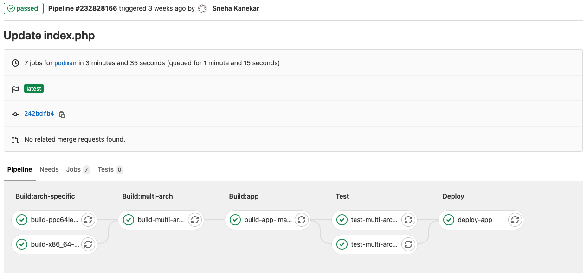

# Deploying a multi-arch OpenShift Application from GitLab
## End to end appraoch to create a deployment pipeline using GitLab as your source code management tool

rpsene

Tags: Cloud computing, DevOps, Linux

Published on January 16, 2021 / Updated on January 16, 2021


### Overview

Skill Level: Advanced

This recipe describes the basic steps to deploy and end-to-end multi-arch OpenShift solution combining GitLab, Quay.io, RedHat OpenShift and IBM Power. It was created by Sonia Garudi (Sonia.Garudi1@ibm.com) and Sneha Kanekar (Sneha.Kanekar1@ibm.com).

### Ingredients

[GitLab](\"https://gitlab.com/\") is a complete DevOps platform offereing an end-to-end approach to manage the whole workflow of project which includes managing the sharing of code between different team members, bug tracking, wiki space and continuous integration and deployment pipeline features. As GitLab still does not provides official support for the POWER architecture, this recipe is going to demonstrate how you can easily integrate POWER as part of a GitLab multi-arch application lifecycle which is deployed in a RedHat OpenShift cluster.

To sucessfuly complete this recipe, you will need the following:

*   A [GitLab](\"https://gitlab.com/\") account where you can create a project and configure a CICD pipeline.
*   An [RedHat OpenShift](\"https://www.openshift.com/\") cluster up and running.
*   An IBM Power and a x86\_64 resource to be used as nodes for running the [GitLab Runner](\"https://docs.gitlab.com/runner/\"). You can use the [PowerVS service at IBM Cloud](\"https://cloud.ibm.com/docs/power-iaas?topic=power-iaas-getting-started\") or [Minicloud](\"https://openpower.ic.unicamp.br/minicloud/\") to get your ppc64le virtual machine. For x86\_64 you can use your notebook or any a resouce from GitLab's public pool.
*   The app of this recipe is [based on this source code](\"https://gitlab.com/skanekar/sample-web-app\").

### Step-by-step

#### 1. About GitLab Runner

[GitLab Runner](https://docs.gitlab.com/runner/) is an application that works with GitLab CI/CD to run jobs in a pipeline.You can choose to use GitLab's pool of resources or install the GitLab Runner application on the infrastructure that you own or manage (which is the case of POWER). **Runners communicate with GitLab over HTTPS, entirely through connections initiated from the Runner to GitLab and never in reverse.**

When you register a runner, you must choose an executor. An [executor](https://docs.gitlab.com/runner/executors/README.html) determines the environment each job runs in. GitLab Runner implements a number of executors that can be used to run your builds in different scenarios :

*   SSH
*   Shell
*   Parallels
*   VirtualBox
*   Docker
*   Docker Machine (auto-scaling)
*   Kubernetes
*   Custom

For POWER, we have tested and validated the follwing executors:

*   **SSH**: allows you to execute builds on a remote target by executing commands over SSH.
*   **Shell**: allows you to execute builds locally to the machine that the GitLab Runner is installed. It supports all systems on which the Runner can be installed.
*   **Docker**: when used with GitLab CI, connects to Docker Engine and runs each build in a separate and isolated container using the predefined image that is set up in .gitlab-ci.yml and in accordance in [config.toml](https://docs.gitlab.com/runner/configuration/advanced-configuration.html).
*   **Kubernetes**: when used with GitLab CI, connects to the Kubernetes API in the cluster creating a Pod for each GitLab CI Job. This Pod is made up of, at the very least, a build container, a helper container, and an additional container for each service defined in the .gitlab-ci.yml or config.toml files.

#### 2. Building, Installing and Configuring GitLab Runner

As the GitLab Runner source code currently doesn’t have support for POWER (yet) you will need to buil dyour own version to get started. The code changes are available [here](https://gitlab.com/rpsene/gitlab-runner/-/tree/rpsene-ppc64le). To build your own GitLab Runner for POWER, use the following steps (which were executed in a x86\_64 virtual machine with Ubuntu 20.04):  

```
apt-get update; apt-get upgrade -y;

apt-get install -y mercurial git-core wget make build-essential binfmt-support qemu-user-static qemu-user ruby-full rpm


# install docker
git clone https://github.com/Unicamp-OpenPower/docker.git

./install_docker.sh

vi /etc/docker/daemon.json and add

{
"experimental": true
}

service docker restart

# prepar a GO dev env
git clone https://github.com/rpsene/goconfig.git

cd ./goconfig

source ./go.sh install

cd go-workspace/src/

# clone the runner source code
git clone https://gitlab.com/rpsene/gitlab-runner.git

cd ./gitlab-runner/

git checkout -t origin/rpsene-ppc64le

# build the runner  
make deps

ou

make package

ls ./out/
```

Once you have built GitLab Runner, you can copy it to the ppc64le target where it is going to be installed. For your convenience, you can download it from [here](https://oplab9.parqtec.unicamp.br/pub/ppc64el/gitlab-runner-ppc64le/). To learn about how to registry a new GitLab Runner, [click here](https://docs.gitlab.com/runner/register/index.html). Once you are the GitLab Runner configuration page, you can start the registration process, which will be similar to the following:

```
# gitlab-runner-linux-ppc64le register
Runtime platform arch=ppc64le os=linux pid=35086 revision=7f7f3727 version=13.7.0~beta.342.g7f7f3727
Running in system-mode.

Enter the GitLab instance URL (for example, https://gitlab.com/):
https://gitlab.com/

Enter the registration token:
6brN1FUqKijp4UE_gGMX

Enter a description for the runner:
[flattish1.fyre.ibm.com]:

Enter tags for the runner (comma-separated):
ppc64le-runner

Registering runner... succeeded runner=6brN1FUq
Enter an executor: docker-ssh, shell, ssh, virtualbox, docker+machine, custom, docker, kubernetes, parallels, docker-ssh+machine:
shell

# gitlab-runner-linux-ppc64le run
Runtime platform arch=ppc64le os=linux pid=35102 revision=7f7f3727 version=13.7.0~beta.342.g7f7f3727
Starting multi-runner from /etc/gitlab-runner/config.toml... builds=0
Running in system-mode.
```

At GitLab user interface, this is what the configuration will look like:


Once configured, you are able to start using it to build your project.

#### 3. Building and Deploying a Multiarch Application on OpenShift from GitLab

A key part of this recipe is to achive the following pipeline:



To do so, the first step is to have your project created at GitLab, the GitLab Runners correctelly registered and a RedHat OpenShift cluster up and running. Example:  

```
# add .gitlab-ci.yml file to configure Gitlab CICD pipeline.

example at https://gitlab.com/skanekar/sample-web-app/-/blob/master/.gitlab-ci.yml

# add the application source code to your repository.

example at https://gitlab.com/skanekar/sample-web-app/-/tree/master
```

Once completed, configure the build pipeline at GitLab. Go to **Settings -> General -> Visibility, project features, permissions** and make sure that **Pipelines** option is enabled.  


Go to **Settings -> CICD -> Variables** and add all the required environment variables. These variables will be accessible for all the jobs in your pipeline.


As we are build a multi-arch container image for the application (which means that we can run it from either x86\_64 or ppc64le clusters), we are going to host all the images at [quay.io](https://quay.io). To configure your container repositories, follow the steps below:  

1\. Login at [quay.io](https://quay.io/) and create the repositories you are going to use to host your containers. We have created two for this recipe: **multi-arch-image** and **sample-php-app** (ensure you do the same steps for both):


2\. Go to settings of the **multi-arch-image** repository. Under **User and Robot Permissions** section, click on the dropdown and select **Create robot account**.


3\. Grant **write** permission to the robot account.


With the quay.io repositories properly configured we can now create the multi-arch images and deploy the application using RedHat Openshift. The [.gitlab-ci.yml](https://gitlab.com/skanekar/sample-web-app/-/blob/master/.gitlab-ci.yml) has the following stages to carry out the process of building images and deploying the image on Openshift cluster:

```
stages:  
 - build:arch-specific  
 - build:multi-arch  
 - build:app  
 - test  
 - deploy
```

**1\. Stages 1 and 2: building the images for each architecture**

```# a. building ppc64le image: the build.sh script builds the specified
#    arch image using the Dockerfile present in <arch>/Dockerfile location in repo.
#    In this case, it will build image for arch ppc64le.

build-ppc64le-image:
stage: build:arch-specific
tags:
- shell-ppc
script:
- chmod +x ./build.sh; ./build.sh

# b. building x86_64 image: same as previous step, it builds image for arch x86_64.

build-x86_64-image:
stage: build:arch-specific
tags:
- shell-x86
script:
- chmod +x ./build.sh; ./build.sh

# c. building multi-arch image: the create-multi-arch.sh script builds a multi-arch
#    image using docker manifest command. It adds images from step 1a and 1b to the manifest list.

build-multi-arch-image:
stage: build:multi-arch
tags:
- shell-ppc
script:
- chmod +x ./create-multi-arch.sh; ./create-multi-arch.sh
```

**2\. Stage 3: building the application image from the multi-arch image at quay.io**

```
# a. create a Docker file with the app deployment steps. Use the multi-arch image from
#    quay repository (created in step 1b) as base image for this, as done in this example.

# b. Use the build_app.sh script to build the application image.
#    The docker build -f <path to Dockerfile> -t <image>:<tag> command is used to build
#    the application image. The Gitlab CI is configured to build the image every time any
#    change is made to the application source code.

# c. Pushing the application image to quay.io: the script pushes the created application
#    image to the quay repository.

build-app-image:
stage: build:app
tags:
- shell-ppc
script:
- chmod +x ./build_app.sh; ./build_app.sh
```

**3\. Stage 4: test the multi-arch image**

```test-multi-arch-image-on-x86_64:
stage: test
tags:
- shell-x86
script:
- docker pull quay.io/snehakpersistent/multi-arch-image:latest
- docker run --rm quay.io/snehakpersistent/multi-arch-image:latest

test-multi-arch-image-on-ppc64le:
stage: test
tags:
- shell-ppc
script:
- docker pull quay.io/snehakpersistent/multi-arch-image:latest
- docker run --rm quay.io/snehakpersistent/multi-arch-image:latest
```

**4\. Stage 5: connecting to the RedHat OpenShift cluster using a GitLab SSH executor running in the bastion node and deploying the application  
**

It is important to make clear that for this specific step we have added the RedHat OpenShift Bastion as a GitLab Runner (using the executor with the Shell option enabled) so we can safely run the oc commands without setting the secrets as part of GitLab.

```
deploy-app:
stage: deploy
tags:
- ssh-ppc
script:
- oc login -u=$username -p=$password
- ocprojectcheck=0
- oc project $project_name || ocprojectcheck=$?
- echo $ocprojectcheck
- if [[ $ocprojectcheck == 1 ]];
then
oc new-project $project_name ;
oc new-app --name $app_name $image:$ppc_tag ;
fi
- if [[ $ocprojectcheck == 0 ]]; then oc import-image $image:$ppc_tag ; fi
- if [[ $ocprojectcheck == 1 ]]; then oc expose svc/$app_name ; fi
```

In the next recipe we are going explore more options on integrating CICD tools to deploy OpenShift applications.
