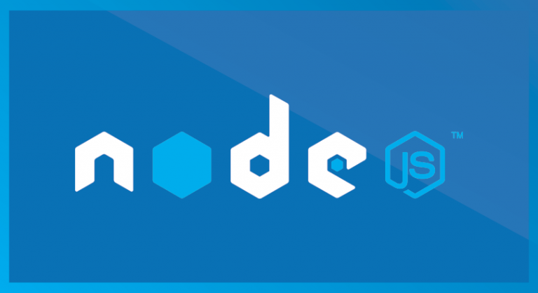

# Developing Back-end Application with Hyperledger Fabric through SDK
## Create a new blockchain front-end and back-end application by Node.JS and Hyperledger Fabric SDK

mattumd

Tags: Cloud computing, Continuous engineering, Linux, Web development

Published on June 30, 2019 / Updated on March 23, 2020



### Overview

Skill Level: Beginner

This recipe shows you how to develop a blockchain application using Hyperledger Fabric and Node.JS programming.

### Ingredients

To follow and complete this recipe, you need to have good knowledge of blockchain, Hyperledger transactions, Node.JS as well as basic knowledge of Linux.

### Step-by-step

#### 1. Hyperleder Fabric Overview and Recipe Outline

Hyperledger Fabric is an open source enterprise-grade platform that leverages a highly-modular and configurable architecture. Hyperledger Fabric is optimized for a broad range of industry use cases, including the finance, banking, healthcare, insurance, and public sectors, as well as supply chains and digital asset management. [Here](https://learn.coding-bootcamps.com/blog/202224/why-build-blockchain-applications-with-hyperledger-fabric "Hyperledger Fabric features") is a good article on why choosing Hyperledger Fabric over other blockchain development platforms.  

For those who are not familiar with Hyperledger project [Intro to Hyperledger Family and Hyperledger Blockchain Ecosystem](//weg2g.com/application/touchstonewords/article-intro-to-hyperledger-family-and-hyperledger-blockchain-ecosystem.php), [Hyperledger Design Philosophy and Framework Architecture](//weg2g.com/application/touchstonewords/article-overview-of-hyperledger-design-philosophy-and-framework-architecture.php), [The Survey of Hyperledger Fabric Architecture and Components for Blockchain Developers](//weg2g.com/application/touchstonewords/article-the-survey-of-hyperledger-fabric-architecture-and-components-for-blockchain-developers.php) and [Overview of Building Blockchain Smart Contracts in Hyperledger](//weg2g.com/application/touchstonewords/article-overview-of-building-blockchain-smart-contracts-in-hyperledger.php) articles are strongly recommended.  

Hyperledger Fabric supports Smart Contact development in general-purpose programming languages, such as JavaScript, Java, Go, and Node.js. Hyperledger Fabric is also operating under a governance model to build trust between participants on a shared network.  

We have written two sets of tutorials to explore Hyperledger Fabric in depth. First set covered the following six recipes:  

It started with [installing Hyperledger Fabric on an AWS EC2 virtual machine](//myhsts.org/tutorial-learn-how-to-install-blockchain-hyperledger-fabric-on-amazon-web-services.php), [setting up the first Hyperledger Fabric network](https://github.com/IBM/IBMDeveloper-recipes/blob/main/building-hyperledger-fabric-network-for-blockchain-applications/index.md) and [working with Hyperledger Fabric Command Line Interface or CLI](//myhsts.org/tutorial-learn-how-to-work-with-hyperledger-fabric-cli-to-setup-network-and-manage-chaincode.php). We learned the following:

*   Generating the crypto/certificate using cryptogen
*   Generating the configuration transaction using configtxgen
*   Bring up the nodes based on what is defined in the docker-compose file
*   Using the CLI to set up the first network
*   Using the CLI to install and instantiate the chaincode
*   Using the CLI to invoke and query the chaincode

We moved on to show you how to [Add New Network to a Channel](//myhsts.org/tutorial-learn-how-to-add-organization-to-channel-in-hyperledger-fabric.php), Use CouchDB as a State Database for Hyperledger Fabric, and [Create a Smart Contract and then Deploy it into the Blockchain](//myhsts.org/tutorial-learn-how-to-write-first-blockchain-application-in-hyperledger-fabric.php).  

In short, in the previous recipes, we learned about how to set up and configure Hyperledger Fabric. We explored its key components, including channels, **Membership Service Providers** (**MSPs**), the ordering service, and Fabric **Certificate Authority** (**CA**).  

The second set, we will show you how to build a simple device asset management DApp. It consists of 6 recipes as follows:

*   [Reviewing of inventory asset management and chaincode](//myhsts.org/tutorial-learn-how-to-implement-hyperledger-fabric-via-inventory-asset-management-application.php)
*   [Writing chaincode as a smart contract using Go](https://github.com/IBM/IBMDeveloper-recipes/blob/main/writing-hyperledger-fabric-chaincode-using-go-programming-language/index.md)
*   [Compiling and deploying Fabric chaincode](//myhsts.org/tutorial-learn-how-to-compile-and-deploy-hyperledger-fabric-chaincode-and-smart-contracts.php)
*   Running and testing the smart contract
*   [Designing front-end of an application with Hyperledger Fabric through the SDK](//myhsts.org/tutorial-learn-how-to-design-front-end-application-with-hyperledger-fabric-through-sdk.php)
*   Developing back-end of an application with Hyperledger Fabric through the SDK

In summary, in the second set of recipes, we are going to build a simple device asset management DApp. We will exploit this example by writing chaincode implemented by various programming languages and we'll also build, test, and deploy our DApp.  

**_IMPORTANT: Understanding and completing the first set of recipes are required prior to working on second set of recipes._**

In our previous recipe, we created a client project. Now, we move on making its web UI with Node.JS.

#### 2. Writing Node.js Sever-side Code

We have now set up the client environment. We should be able to connect to the remote Fabric network and trigger the chaincode API. In our Node.js app, create the app.js file. This file will act as a connector to create a new gateway to connect to our peer node. It also creates a new filesystem-based wallet for managing identities. Once we have connected to the peer node, the function in app.js can find a contract through the channel and then submit the specified transaction. To do this, follow these steps:

1\. Create the wallet file:

```
async function ship() {

try {

//Create a new file system based wallet for managing identities.

const walletPath = path.join(process.cwd(), 'wallet'); const wallet = new FileSystemWallet(walletPath);

..

}
```

2\. The wallet file needs to make sure the user exists by using the wallet.exist API:

```
const userExists = await wallet.exists('user1'); if (!userExists) {

console.log('An identity for the user "user1" does not exist in the wallet');

console.log('Run the registerUser.js application before retrying'); return;

}
```

3\. Connect to blockchain through gateway, bypassing the wallet and identity information. Once connected to the network successfully, get the assetmgr contract from the network:

```
//Create a new gateway for connecting to our peer node. const gateway = new Gateway();


await gateway.connect(ccp, { wallet, identity: 'user1', discovery:

{ enabled: false } });

      //Get the network (channel) our contract is deployed to.

const network = await gateway.getNetwork('mychannel'); // //Get the contract from the network.

const contract = network.getContract('assetmgr');
```

4\. Submit a transaction to invoke the chaincode function:

```// Submit the specified transaction.
await contract.submitTransaction(“Ship”, “100”, “OEM deliver ipad to school”, “New Jersey”);
```

5. Disconnect from gateway and return to the client caller. To do this, follow the code:

```
//Disconnect from the gateway. await gateway.disconnect();
```

With node.js, you need set up your node.js server listen, of course.

```
app.listen(3000, function () { console.log('Example app listening on port 3000!'); });
```

#### 3. Writing Node.js Client-Side Code

We still need to work on one more file before we complete the end-to-end development. The Node.js client-side code provides a user interface, lets the user see the blockchain result in the browser, and invokes a method from a web page. Our Node.js client-side code can be found in index.ejs under the views folder. We can open this file and start to add some code in it.  
For the Ship function, we use the jQuery post method to call the Node.js server-side Ship function. This will invoke the blockchain Ship method in the assetmgr chaincode, as follows:

```<script>

$(document).ready(function(){

$("#ship").click(function(){

  $.post("http://52.15.203.98:3000/ship", function(data){

  var parsedJson = $.parseJSON($.parseJSON(data));

  console.log(parsedJson);

  });

});

});

</script>
```

The query function is similar to the Ship code; we use the jQuery get method to call the Node.js server-side query function, which will invoke the blockchain query method in the assetmgr chaincode.

Once the results return, it populates the data to the related fields on the UI:

```
/*Code Goes Here*/

$("#chainCodeQuery").click(function(){
$.get("http://52.15.203.98:3000/query",function(data){
var parsedJson =
$.parseJSON($.parseJSON(data));
$("#assetType").val(parsedJson.assetType);
...
});
});
```

We have now completed our end-to-end code. It is time to start our node server and do some quick experiments.

#### 4. Running the Web Application

Following the steps get the web application running:

1\. Run node app.js. This will bring up the node server:  
Hyperledger Fabric and Node JS

2\. Once the node server is up, click on the **Query Chaincode** button. This will return the current orgAsset result in the blockchain. Here is the result:
Hyperledger Fabric and Node JS

3\. Click on the **Ship** button, which will call the Ship method in the blockchain. Once it is called successfully, click on the **Query Chaincode** button again and you will see the updatedorgAsset result, with the **status** updated to SHIP. When it has updated, the page should look like this:

Node JS and Blockchain development

Remember, since there is a delay of a few seconds, you may need to click the button a couple of times for the update to occur.

#### 5. Put Things Together

A wallet can hold multiple identities. These identities are issued by the CA. As we have seen before, each user identity contains a certificate, X.509, which contains a private key and a public key, and some Fabric-specific metadata. The certificate file is issued from the Fabric CA service:

Hyperledger Fabric and NodeJS

The blockchain admin creates a wallet to grant user access, then calls a couple of key class methods, (including X509WalletMixin.createIdentity) to manage the wallets and identities (including Org1MSP). This is shown in the following code:

const caURL = ccp.certificateAuthorities\['ca.example.com'\].url; const ca = new FabricCAServices(caURL);

Create a new file system based wallet for managing identities. const walletPath = path.join(process.cwd(), 'wallet');

const wallet = new FileSystemWallet(walletPath);

..

Enroll the admin user, and import the new identity into the wallet. const enrollment = await ca.enroll({ enrollmentID: 'admin', enrollmentSecret: 'adminpw' });

const identity = X509WalletMixin.createIdentity('Org1MSP', enrollment.certificate,

enrollment.key.toBytes()); wallet.import('admin', identity);

X509WalletMixin.createIdentity is used to create an Org1MSP identity using X.509 credentials. The function needs three input: mspid, the certificate, and the private key.  

From the connection.json file, we can see that the Org1MSP identity is associated with peer0.org1.example.com:

```
"organizations": {


"Org1": {


   "mspid": "Org1MSP",


   "peers": [


   "peer0.org1.example.com"


],


"certificateAuthorities": [


   "ca.example.com"


   ]

}


}
```

The gateway reads the connected profile, and the SDK will connect with the profile to manage the transaction submission and notification processes. In a basic-networkdocker-compose.yml file, the ca.example.com CA container starts fabric-ca-server to manage the Fabric CA key files:

ca.example.com:

image: hyperledger/fabric-ca

environment:

FABRIC\_CA\_HOME=/etc/hyperledger/fabric-ca-server

FABRIC\_CA\_SERVER\_CA\_NAME=ca.example.com

FABRIC\_CA\_SERVER\_CA\_CERTFILE=/etc/hyperledger/fabric-ca-server-config/ca.org1.example.com-

cert.pem

FABRIC\_CA\_SERVER\_CA\_KEYFILE=/etc/hyperledger/fabric-ca-server-config /4239aa0dcd76daeeb8ba0cda701851d14504d31aad1b2ddddbac6a57365e497c\_sk ports:

"7054:7054"

command: sh -c 'fabric-ca-server start -b admin:adminpw' volumes:

\- ./crypto-

config/peerOrganizations/org1.example.com/ca/:/etc/hyperledger/fabric-ca-

server-

config

container\_name: ca.example.com

networks:

\- basic

Our peer1.org1.com with MSPID Org1MSP is associated with the crypto-config file to verify each transaction:

peer0.org1.example.com:

container\_name: peer0.org1.example.com

image: hyperledger/fabric-peer

environment:

CORE\_PEER\_ID=peer0.org1.example.com

CORE\_PEER\_LOCALMSPID=Org1MSP

CORE\_PEER\_ADDRESS=peer0.org1.example.com:7051 volumes:

./crypto-config/peerOrganizations/org1.example.com/peers/peer0.org1.example.com/msp: /etc/hyperledger/msp/peer

./crypto-config/peerOrganizations/org1.example.com/users:/etc/hyperledger/msp/users

This will load the chaincode library and compile the Go code.

This recipe is written in collaboration with Brian Wu who is a senior Hyperledger instructor at [Coding Bootcamps](https://coding-bootcamps.com/) school in Washington DC.
