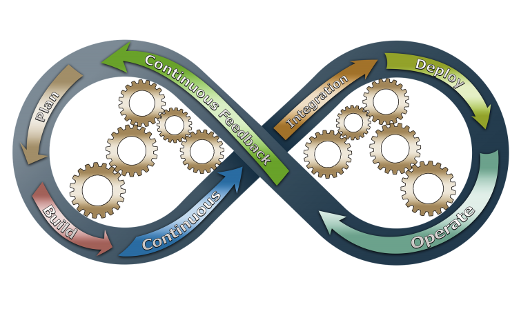

# DevOps Pipeline Automation: What You Need to Know

Ilai Bavati

Published on May 3, 2020 / Updated on November 10, 2020

### Overview

Skill Level: Any Skill Level

In combination with automation tools, DevOps pipelines enable teams to meet growing customer demand for frequent releases and updates.

### Ingredients

DevOps has gained popularity over the last decade as the primary methodology for developing and releasing software. It enables developers and operations teams to collaborate on building high-quality software and frequent releases. One of the most important tools for accomplishing these goals is a DevOps pipeline. In combination with automation tools, DevOps pipelines enable teams to meet growing customer demand for frequent releases and updates.

In this article, you will learn what is a DevOps pipeline, what tools you can use for [DevOps automation](https://resources.whitesourcesoftware.com/blog-whitesource/3-key-considerations-for-devops-automation), and tips for optimizing your automation processes.

### Step-by-step

#### 1. What Is a DevOps Pipeline?

A pipeline is a collection of processes and tools that enable you to build, test, and deploy code. Pipelines enable DevOps teams to use Continuous Integration / Continuous Delivery (CI/CD) to improve the efficiency and effectiveness of software development. CI/CD is a strategy for efficiently and consistently developing and releasing applications.

The general flow of a pipeline is:

1.  Code is committed which triggers the CI/CD framework
2.  Unit tests are run by testing and build tools
3.  Passing code is compiled and built by the CI/CD framework
4.  Environments are is created and configured
5.  Integration and end-to-end tests are performed
6.  Code is delivered and deployed

Ideally, pipelines enable development teams to automate all or most steps from code integration to deployment. Pipeline automation tools generally include functionality for source control, compiling and building code, containerization, configuration management, and monitoring.

#### 2. Automating Your DevOps Pipeline

To begin automating your processes, you first need to identify what manual steps you are currently taking. Any steps that follow the same process again and again can be automated.

Even if steps differ slightly, automation can typically be accomplished using [scripting and logic](https://www.geeksforgeeks.org/whats-the-difference-between-scripting-and-programming-languages/).

Once you’ve identified repetitive or predictable steps you can begin automating your processes. When deciding where to start with automation, consider the following:

*   **Process frequency**—prioritize more frequent processes.
*   **Process length**—prioritize processes that are time-consuming, particularly if processes require you to wait between manual steps.
*   **Who or what is reliant on the process**—prioritize processes with more dependents or those that bottleneck key stages.
*   **If a process is prone to manual errors**—prioritize more error-prone processes as long as errors are due to lack of standardization.
*   **Impacts of automation**—prioritize processes with the greatest impact and value.

Eventually, the idea is to automate as much of your CI/CD process as possible. However, successful automation takes time and refinement. If you start with the highest value tasks you can more quickly reap the rewards of automation. An alternative strategy is to start with those tasks which are easiest to automate. This strategy won’t provide significant rewards at first but it can help you get started with less upfront time commitment.

#### 3. 6 Open-Source Tools for Automation

There is a wide variety of paid and open-source tools you can use to accomplish automation. Many cloud providers also offer CI/CD automation services. Although these services typically cost extra, services can enable easier integration with host environments. This is particularly useful if you are developing software specifically for use with the provider you are hosted on.

Here’s an overview of some popular open-source automation tools:

**1\. Jenkins**

Jenkins is an automation server that you can use as a standalone CI server or for both CI and CD. Jenkins integrates with a wide variety of tools and includes thousands of plugins. It supports a variety of languages, including C/C++, Java, Python, Ruby, and PHP.

      **2\. GoCD**

GoCD is a CI/CD server. GoCD includes features for monitoring, custom triggers, test reporting, build comparison, and configuration templates. It supports integration with a variety of services, including Kubernetes, GitHub, AWS, and Maven.

      **3\. Chef**

Chef is a configuration management platform. Chef includes features for transferring applications to the cloud, on-premise and cloud server management, and API hosting. It supports a range of integrations, including AWS, Google Cloud, Azure, OpenStack, and Oracle Cloud.

**4\. Buildbot**

Buildbot is a CI testing framework. Buildbot includes features for custom status notifications, real-time monitoring, and custom logging. It can be customized for use with mixed-language applications.

**5\. Spinnaker**

Spinnaker is a continuous delivery platform for cloud-native applications. Spinnaker integrates with a variety of cloud providers as well as other CI/CD tools, including Jenkins and Docker. It includes features for messaging support, monitoring, and role-based access control.

**6\. Ansible**

Ansible is an IT automation platform. Ansible includes features for configuration management, resource provisioning, network automation, cluster orchestration, and application deployment. It operates via human-readable playbooks which dictate action steps.

#### 4. 6 Tips for Effective Automation

Similar to other processes, pipeline automation takes fine-tuning to get right. You may need to swap out tools or even create new pipelines to meet the needs of individual projects. When creating your pipelines, keep the following tips in mind.

**1\. Source Control**

With source control, you can automate monitoring for changes and trigger events in your CI/CD framework based on those changes. For example, merge requests can trigger processes for unit testing and compilation, or build processes. It is also helpful to automate notifications for successful or failed merges. These notifications can help keep your team informed on the current state of the codebase and help them prevent merge conflicts later on.

One aspect you should not automate away, however, is the peer review process prior to merging. Leaving this step as a manual process, helps ensure that new features meet quality standards and expectations. It also supports collaboration and learning between developers.

**2\. Builds**

Builds should be automatically stored in an artifact repository, which is a place to store builds, build information, and binaries. An artifact repository provides version control for builds. Using a repository enables you to easily revert to previous builds if one fails during testing.

Automating the use of an artifact repository enables you to ensure that the same build can be used throughout the testing and delivery process. Using the same build reduces the chance of errors created by rebuilding between tests. It also ensures that all developers on your team have consistent access to the latest build.

**3\. Environments**

You should make sure to consistently use clean, standardized environments for each phase. This includes environments for testing, QA, and deployment. Environments should be generated from a master image for each use to prevent data from previous tests or deployments creating an impact. Additionally, environments should be properly isolated upon creation.

When automating the creation of environments, you need to account for infrastructure, configuration, and dependencies. You should be automatically provisioning resources for your environments and securing access channels to and from environments. Finally, when an environment is no longer needed, it should be automatically deleted.

**4\. Testing**

Test automation can provide faster feedback to developers on code compatibility and quality. You can optimize this benefit by running fast and critical tests first. If code doesn't pass these tests it can be rejected and time is not wasted running additional tests.

During automation, try to eliminate redundancies and maximize test coverage with the minimum amount of tests. Using testing suites with machine learning capabilities can help you evaluate your test coverage and perform only relevant tests. You should also run tests in parallel whenever possible to further speed testing processes.

**5\. Delivery and Deployment**

Automation can help you ensure that your deployments are uniform and that configuration is consistent. Areas to focus on include infrastructure provisioning, configuration management, and containerization, and orchestration.

The steps between delivery and deployment are one of the few areas you might want to pause your automation. Creating a gap in automation at this point can enable you to run manual tests, manually space releases, or to get a customer or team approval before deployment.

**6\. Visibility**

However, you automate your pipeline, make sure to include tools that provide visibility into your processes. You need to be able to confirm that all of your automation is running as prescribed. You also need to confirm that test results are being accurately reported and that processes aren’t being manually skipped.

If possible, choose monitoring tools that include analytics and [visualization](https://hbr.org/2016/06/visualizations-that-really-work) dashboards. These features can help your team quickly and accurately evaluate the effectiveness of your pipelines. Analytics features, in particular, can help you benchmark the performance of specific configurations and tools. With this comparison, you can then make modifications to optimize performance.

#### 5. Conclusion

DevOps pipeline automation can relieve teams of tedious and repetitive tasks. These tools can also ensure that your products are released reliably and consistently. However, pipelines are not perfect. These tools can be misconfigured or misconstructed.

A pipeline, like most programmed technology, will only follow the instructions it’s given. To ensure that your pipeline is set up correctly, make sure to monitor its processes and verify results when changes are made.
