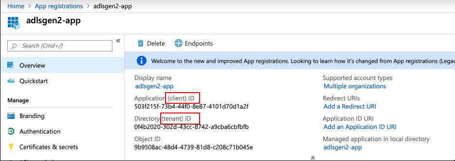

# How to procure Tenant ID, Client ID and Client Secret key to connect to Microsoft Azure Data Lake Storage Gen2
## Obtain credentials required for ADLS connector to connect to Gen2

sheasuri

Tags: Information management

Published on September 26, 2019 / Updated on December 24, 2020

### Overview

Skill Level: Beginner

This recipe details the procedure to obtain connection credentials which ADLS Connector requires for connecting to Microsoft Azure Data lake Storage Gen2.

### Ingredients

Microsoft Azure account.

### Step-by-step

#### 1. Overview

    In order to connect to Microsoft Azure Data lake Storage Gen2 using the Information Server ADLS Connector, we'll need to first create a storage account (Gen2 compatible) and the following credentails : Client ID, Tenant ID and Client Secret.

#### 2. Step-By-Step procedure

    The connection to Storage account is through Microsoft Active directory, so we need to create an active directory give the required API permissions to it and then allow the storage account to be accessible through the active directory. The detailed steps are -

    1\. Log into portal.azure.com.

    2\. Create a storage account by referring - [https://docs.microsoft.com/en-us/azure/storage/blobs/data-lake-storage-quickstart-create-account#create-an-account-using-the-azure-portal  
    ](https://docs.microsoft.com/en-us/azure/storage/blobs/data-lake-storage-quickstart-create-account#create-an-account-using-the-azure-portal)Here, **conngen2** is the name of the storage account.

    

    3\. Create a new App registration, that is from the 'App Registrations' select 'New Registration'. Give a name to the App and click on 'Register' button.

    

    4\. On the created app, click on 'API persmissions' and in the API permissions page click on 'Add a permission' and add 'Azure Storage' and 'Azure Data Lake' API permissions. In the below image 'adlsgen2-app' is the created app name.

    

    5\. The Client ID and Tenant ID can be found from the Overview page.

    

    6\. Obtain the Client secret key as below -  
    a. Click on 'Certificates & secrets' on the left hand menu  
    b. Click on 'New Client secret' button  
    c. Give a description and select a time period and click on Add radio button

    d. Copy the value that is generated and save it because there is no away to retrieve it later.

    

    At this point we have the Tenant ID , Client ID and Client Secret Key.

    7\. Go the created Storage account (conngen2), click on 'Access control (IAM)' , click on '+Add' and select 'Add role assignment'. In the Role box select 'Storage Blob Data Contributor' and write the created app name (adlsgen2-app) and click on 'Save' button.

    

    Repeat this step with Role set to 'Storage Blob Data Owner' too.
