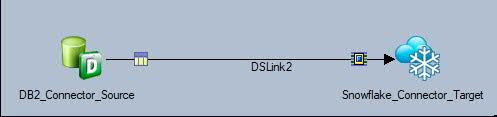
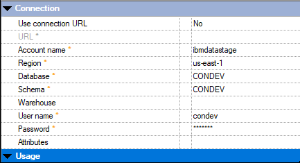
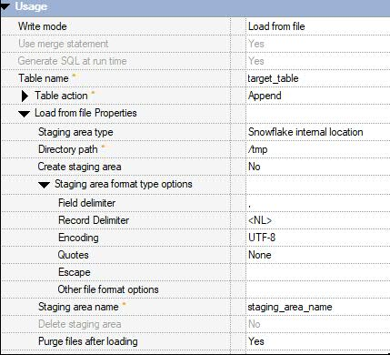

# How to use IBM Infosphere Datastage Snowflake Connector to LOAD data into Snowflake Datawarehouse
## Steps to configure Snowflake connector to LOAD data into Snowflake Datawarehouse

sheasuri

Tags: Information management

Published on August 28, 2019 / Updated on December 24, 2020

### Overview

Skill Level: Beginner

This recipe helps you create, compile, and execute a DataStage job that can LOAD data into Snowflake Datawarehouse tables.

### Ingredients

1. IBM Infosphere Information Server Datastage 11.7fp1 and above

2. Snowflake datawarehouse  account

3. Snowflake Connector latest patch(JR61390).

3. Should be able to configure DB2 connector in source context.

### Step-by-step

#### 1. Description

IBM Information Server provides a native Snowflake Connector to write, read and load data into Snowflake datawarehouse and integrate the same into the ETL job design.

This recipe demonstrates a simple use case of LOAD ing enterprise data (DB2 database as source) into Snowflake tables using Snowflake Connector.

LOAD functionality in Snowflake is similar to Bulk load feature which other databases offer. LOAD functionality is best suited for writing huge data into the database.

In Snowflake connector LOAD functionality is a two step process. Firstly using the PUT command input data is written into files in the staging area and the second step is to use the COPY statement to load data into table from the staging area.

#### 2. Designing the datastage job

To create a job that loads data into Snowflake datawarehouse the Snowflake connector should be on the target side , as we are reading data from DB2 using DB2 connector , DB2 Connector should be on the source side. The job design should look as below-

#### 3. Configure Snowflake connector properties and running the job

1\. Put in the values for Account name, Region, Username and Password that correspond to your Snowflake datawarehouse account details.

2\. Provide values for Database and Schema where the table, into which data is to be written is present.

3\. Alternatively by selecting the property '**Use connection URL'** to '**Yes'** , the **'URL'** property would be enabled and other connection properties would be disabled and in the URL property the snowflake jdbc URL can be specified. The Snowflake jdbc URL should be like –

jdbc:snowflake://<Account>.snowflakecomputing.com/?db=<databasename>&warehouse=<warehousename>&schema=<schemaname>

for example -

jdbc:snowflake://mysnowflakeaccount.us-east-1.snowflakecomputing.com/?db=DEV&warehouse=DEV&schema=DEV

Note: Please refer snowflake driver documentation for any additional information on the Connection properties.

4\. Select **'Write mode'** = 'Load from file' , specify the table name in **'Table name'** property.

5\. Under the '**Load from file properties'** property –

  a. Provide the path where the staging files should be created in the **'Directory path'** property. This path should be an accessible location for datastage user on the engine tier.

  b. Select '**Yes'** to create a new staging area for this job or select **'No'** to use an existing staging area.

  c. Under the **'Staging area format type options'** property specify the format options of the staging area. These format options will be used when running the COPY statement. If an existing staging area is being used then these format options will over write the format options used when the stage was created.  

For example , if the staging area was created with comma(,) as the field delimiter and if the user intends to use pipe(|) as the field delimiter and specifies the same in **'Field delimiter'** property then during execution of COPY statement the data from the staging area is read using pipe(|) as the field delimiter. Similar is the case with other format options.

    d. Specify the staging area name in the 'Staging area name' property , which can either be an existing staging area name or a new one which would be created during job run.

    e. Specify 'Yes' or 'No' for 'Purge files after loading' property based on whether the files in the staging area should be purged or retained at the end of job run.

    f. Run the job.

#### 4. References

https://www.ibm.com/support/knowledgecenter/en/SSZJPZ\_11.7.0/com.ibm.swg.im.iis.conn.snow.usage.doc/topics/specifying\_load\_mode\_snow.html
