# IBM DataPower: Encryption and Decryption Multi-Protocol Gateway Service
## Tokenize an input value with this service (e.g. PCI data, password, ssn, etc).

wkliao

Tags: Cloud computing

Published on June 12, 2020 / Updated on November 12, 2020

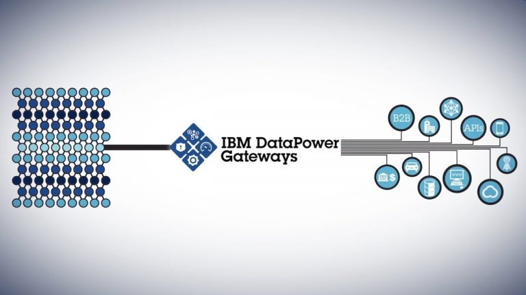

### Overview

Skill Level: Beginner

Basic knowledge DataPower, Multi-Protocol Gateway service, and xslt is a plus.

This tutorial goes over creating a DataPower Multi-Protocol Gateway (MPGW) Service, which will take an input value and encrypt/decrypt it with a symmetric AES-256 cryptographic key.

### Ingredients

*   OpenSSL available to geenerate the secret key.
*   Postman to test.
*   Developer privileges to DataPower should suffice. Access required to create a MPGW, create a crypto shared key object, assign a front side handler, and upload files.

### Step-by-step

#### 1. Create the EncryptDecrypt MPGW Processing Policy and Rules

This section will create the Processing Policy, and Processing Rules with the required Actions to be used in the MPGW later.

1.  Log into IBM DataPower under the domain that the EncryptDecrypt service will reside.  

2.  Once logged in, remove the "**/dp/login.xml**" from the url and press enter to get into the old interface which screenshots from this tutorial will use.  

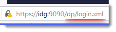  

3.  Navigate into the File Management section  and create a sub-directory titled **EncryptDecrypt** and upload the [Encrypt.xsl](https://github.com/ibmArtifacts/encryptdecypt/blob/master/Encrypt.xsl) and [Decrypt.xsl](https://github.com/ibmArtifacts/encryptdecypt/blob/master/Decrypt.xsl) found in the github repo.  

Note: If the repo does not work, the code is located in the appendix.  

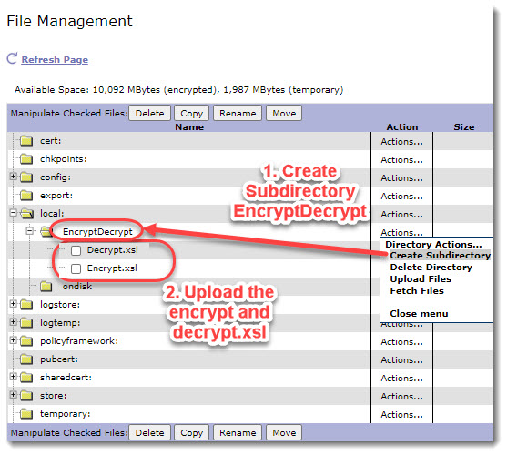

**Create the EncryptDecrypt MPGW Processing Policy and Rules**

1.  Once on the main page of DataPower, type policy into the search field to locate and select the **Multi-Protocol Gateway Policy**.  

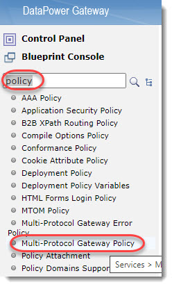  

2.  Click on **Add** **New Policy** to create the new service policy.  

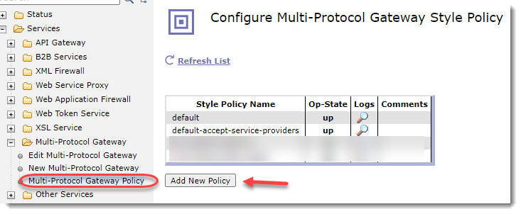  

3.  Name the policy **EncryptDecryptPolicy** and click **Apply Policy**.  

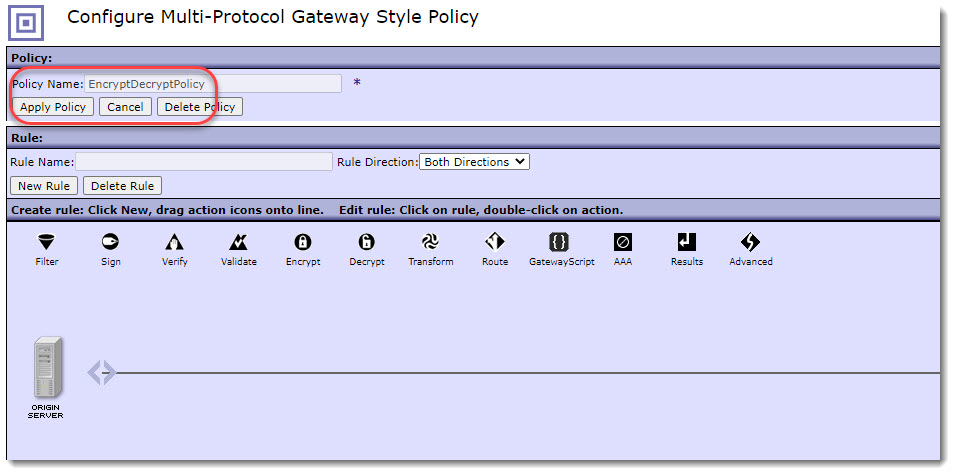  

4.  Click on New Rule, name it **Encrypt\_ProcessingRule**, drop down the Rule Direction to select **Client to Server**.  

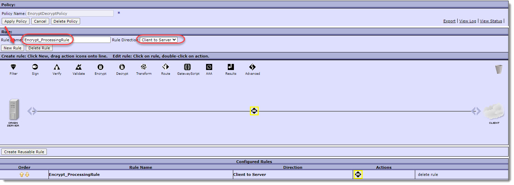  

5.  Double click the **Match Action icon**, then in the _Configure a Match Action_ pop up, click on the **Add icon.**  
    In the _Configure Matching Rule_ pop up, use the name **encrypt** and click the **Add** button.  
    In the _Edit Rules_ pop up, enter **\*/encrypt\*** input the _URL match field_.  
    Continue to **Apply** the pop up windows and click **Done** at the last pop up _Configure a Match Action_.  

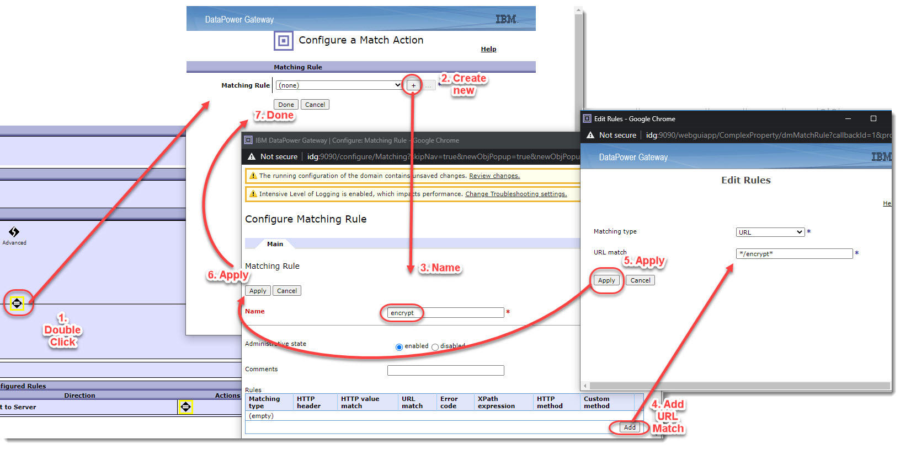  

6.  Back in the _Configure Multi-Protocol Gateway Style Policy_, click on **Apply** **Policy**.  

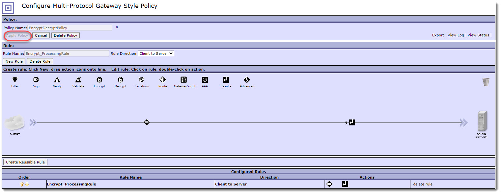  

7.  Drag the **Transform Action** in between the _Match_ and _Results_ _Action_. Double click on the **Transform Action** and when the _Configure Transform with XSLT style sheet Action_ pop ups, drop down the _Transform File_ items and select the **local://EncryptDecrypt** and **Encrypt.xsl**. Click **Done**.  

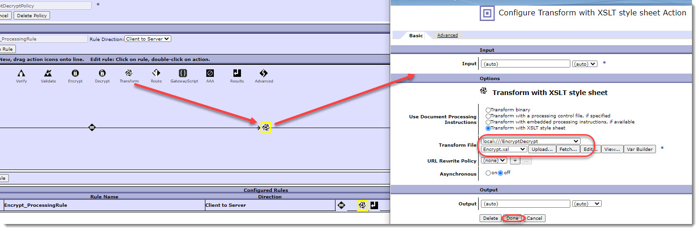  

8.  Back in the _Configure Multi-Protocol Gateway Style Policy_, drag and drop the **Advanced** Action icon ( 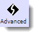) after the Transform Action. Double click the **Advanced** Action and when the _Configure Action_ pop ups, locate and select the **Set Variable** and click **Next**.  

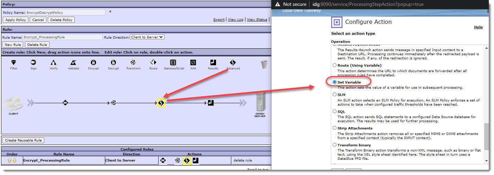  

9.  In the _Configure Set Variable Action_ pop up, click on the **Var Builder** button on the _Variable Name_ and uncollapse the _Service Variables_ and select **var://service/mpgw/skip-backside**. The skip-backside variable loops back the rules proceeding action, so we will see the output of the Encrypt.xsl transformation responsed back to the caller.  

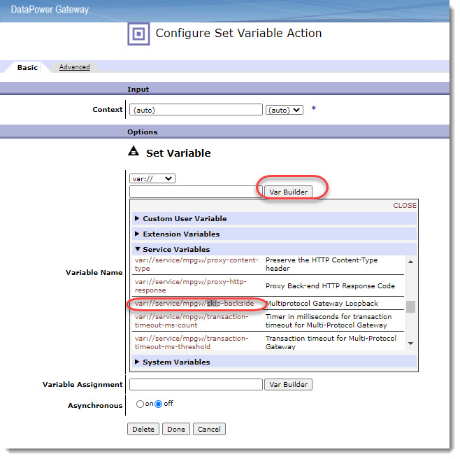  

10.  Assign the _Variable Assignment_ to **1** and click **Done**.  

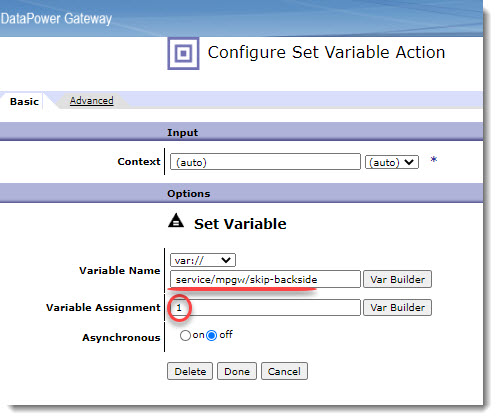  

11.  Click on **Apply Policy** back in the _Configure Multi-Protocol Gateway Style Policy_ and your policy should look like the following.  

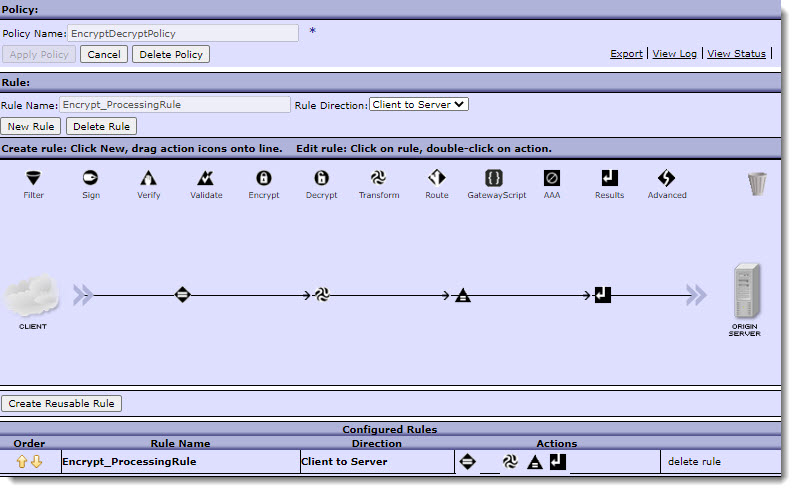  

12.  Create another rule for the Decrypt similary done for the Encrypt\_ProcessingRule.  
Click on the **New Rule** button, name the new rule **Decrypt\_ProcessingRule**, and drop down the _Rule Direction_ selecting **Client to Server**.  
Double click the **Match** Action.  
In the _Configure a Match Action_ pop up, click on the **Add** icon.  
In the M_atching Rule_ pop up, name the rule decrypt, and click **Add**.  
In the _Edit Rules_ pop up, input **\*/decrypt\*** in the _URL match_ field.  
Continue to click **Apply**, then **Done** to accept and get back to the Policy screen.

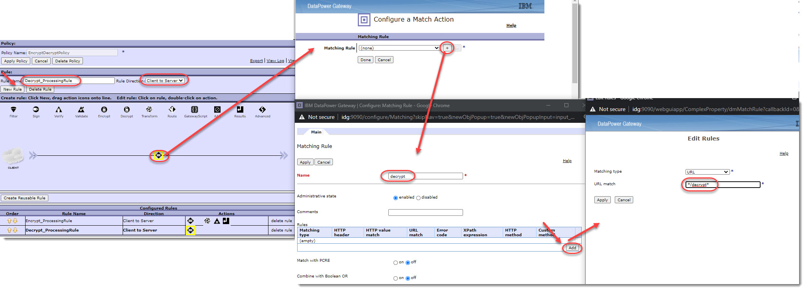  

13.  Back in the _Confirgure Multi-Protocol Gateway Style Policy_ panel, drag and drop a **Transform** action after the Match action and double click on the Transform action. When the _Configure Transform with XSLT style sheet Action_ pops up, drop down the _Transform_ _file_ to choose **local:///EncryptDecrypt** and **Decrypt.xsl**. Click **Done** and **Apply** **Policy** when complete.

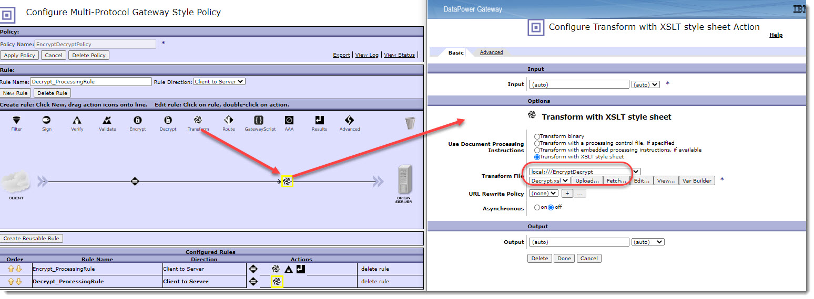  

14.  Back in the _Confirgure Multi-Protocol Gateway Style Policy_ panel, drag and drop an **Advanced** action after the _Transform_ action. Double click the **Advance** action, locate, and select the **Set Variable**. Click **Next**.  

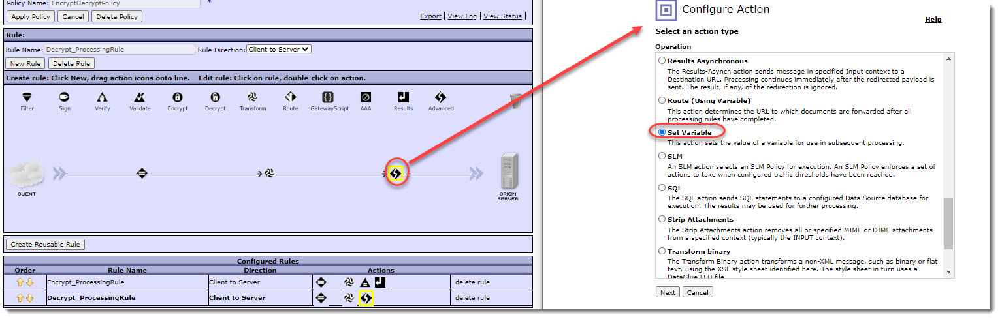  

15.  In the _Configure Set Variable Action_ pop up, click on the **Var Builder** for the Variable Name, collapse the _Service_ _Variables_, to locate and select **var://service/mpgw/skip-backside**.  
    Input **1** for the _Variable_ _Assignment_ and click **Done**.  
    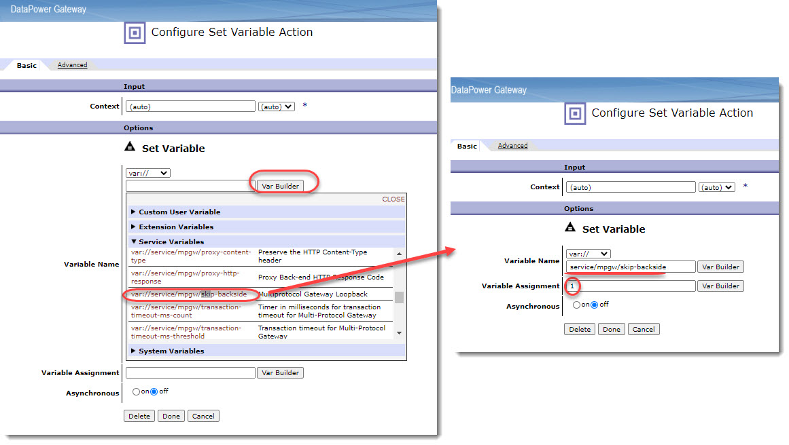  

16.  Then back in the main _Configure Multi-Protocol Gateway Style Policy_ panel, click on **Apply Policy** and your policy should look like the following.  
    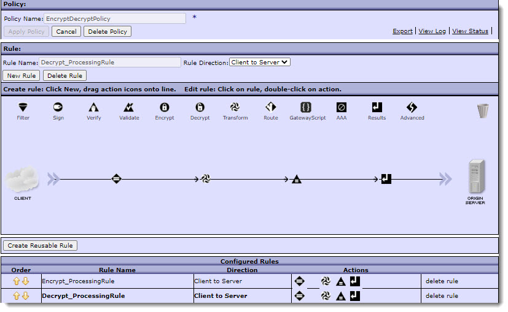  

#### 2. Create the HTTP Front Side Handler

This section will create the HTTP Front Side Handler which will be used in the overall MPGW later.

1.  Navigte to the HTTP Handler section and add a new HTTP handler.  

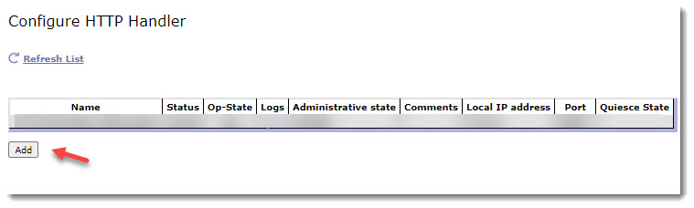  

2.  Name the HTTP Front Side Handler as **HTTPFSH\_EncryptDecrypt** or a desired name, set the local IP address to **0.0.0.0** or specific interface you would like to use, set the port to **8888** or to the port you would like to use, and check the **GET method** under the Allowed methods and versions section.  

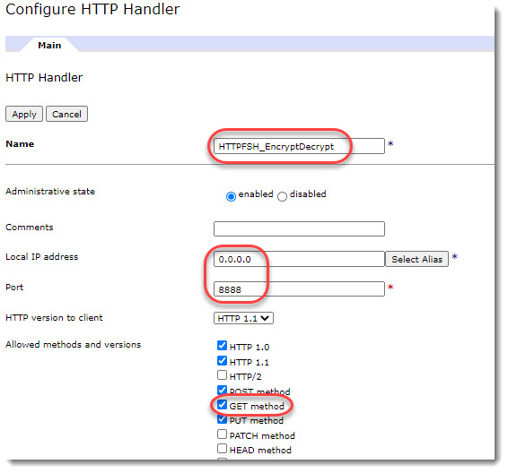

#### 3. Create the Shared Secret Key and Share Secret Object

The EncryptDecrypt MPGW contains stylesheets which will use the Crypto Shared Secret Key object to encrypt and decrypt the input.

1.  Generate the secret key via OpenSSL with the following command: _**openssl enc -aes-256-cbc -k secret -P -md sha256  
    **_Yielding the output which looks like the following:  

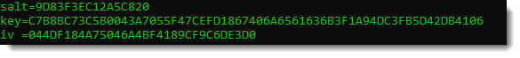  

2.  Take the key value and append a 0x in front which will turn it into a hex-encoded string: "0xC7B8BC73C5B0043A7055F47CEFD1867406A6561636B3F1A94DC3FB5D42DB4106"  
Then save that to a file e.g. **EncryptDecrypt\_OpenSSL\_Key.key**.  

3.  Search and navigate over to the Crypto Shared Secret Key object and click **Add**.  

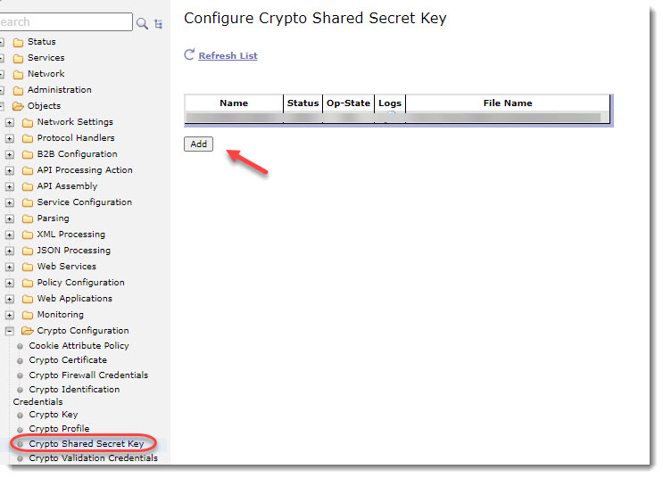  

4.  Enter **EncryptDecryptKey** for the name, and upload the EncryptDecrypt\_OpenSSL\_Key.key and **Apply**.  

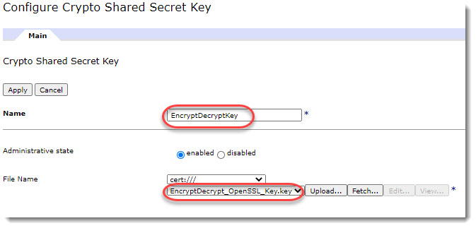

#### 4. Create the EncryptDecrypt MPGW Service and put it altogether

This step will walk through creating the EncryptDecrypt MPGW Service and put together the previous objects created.

1.  Navigate to the main DataPower screen.  

2.  Click on the **Multi-Protocol Gateway** icon.  

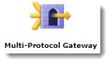  

3.  Create a new MPGW.  

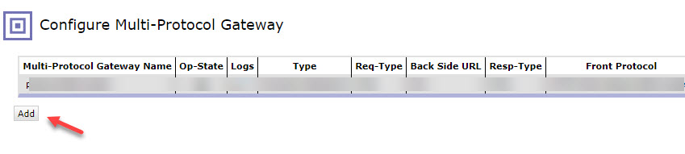  

4.  Name the MPGW (e.g. **EncryptDecryptMPGW**), set the Type to **dynamic-backends**, set the _Request Type_ and _Response Type_ to **XML**.  
Drop down the _Multi-Protocol Gateway Policy_ and select the created **EncryptDecryptPolicy**.  
In the _Front Side Protocol_ section, drop down, select, and **Add** the **HTTPFSH\_EncryptDecrypt** **(HTTP Handler)**.  

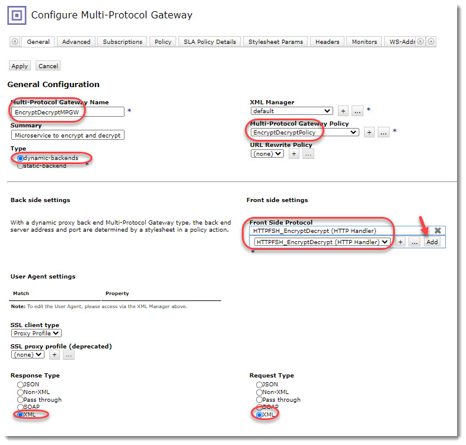

#### 5. Testing

You may download the Postman exports linked below or build out the request yourself, but here are the encryption and decryption tests against the service.

**[Postman EncryptDecrypt Service Export](https://github.com/ibmArtifacts/encryptdecypt/blob/master/Encryption-Decryption%20Service.postman_collection.json)**

Ensure you change the URL and Port (if changed in the service).

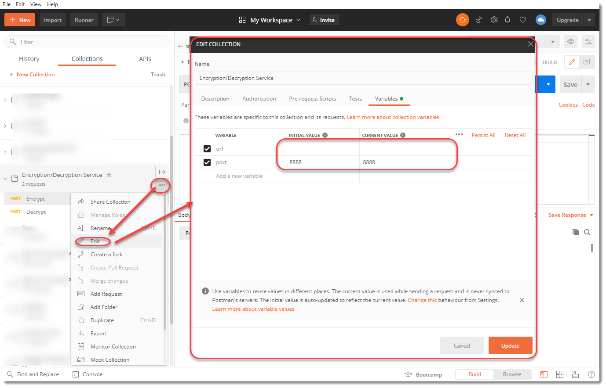

### Encryption Test:

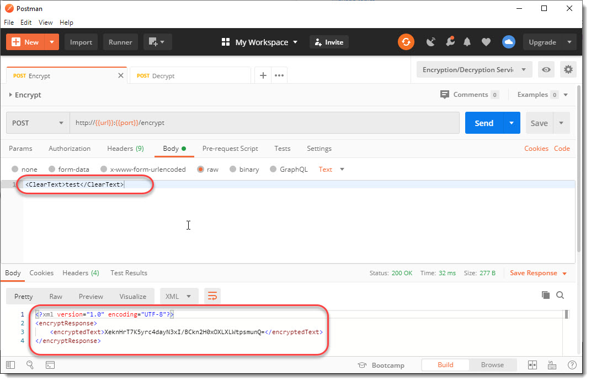

### Decrypt Test:

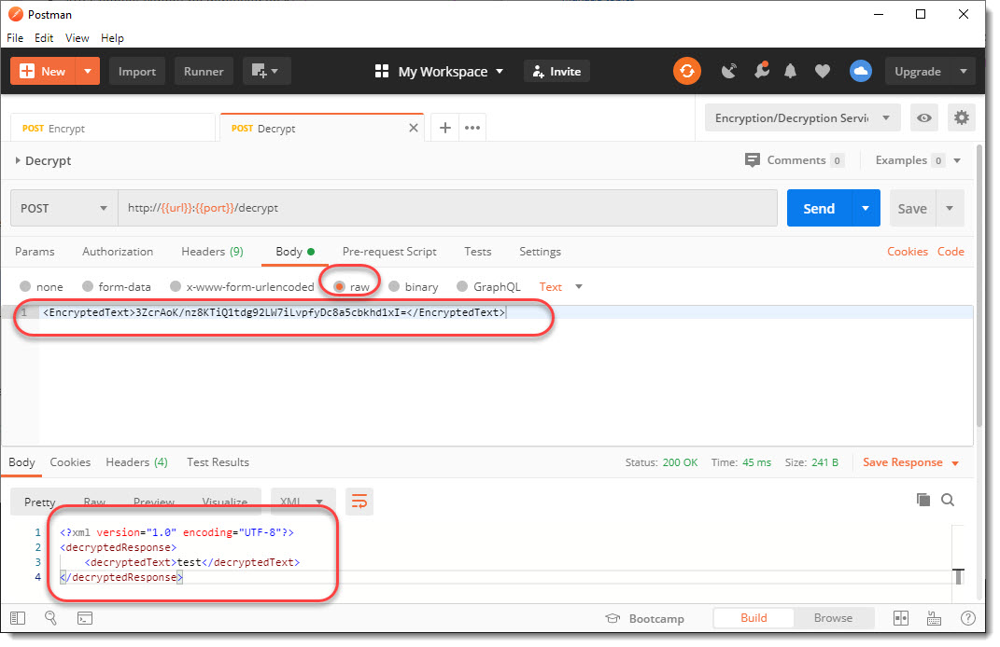

#### 6. Appendix

Encrypt.xsl
-----------

```
<xsl:stylesheet
 version="1.0"
 xmlns:xsl="http://www.w3.org/1999/XSL/Transform"
 xmlns:dp="http://www.datapower.com/extensions"
 xmlns:dpconfig="http://www.datapower.com/param/config"
 xmlns:apim="http://www.ibm.com/apimanagement"
 xmlns:webapi="http://www.ibm.com/apimanagement"
 xmlns:func="http://exslt.org/functions"
 xmlns:wxsl="http://www.w3.org/1999/XSL/TransformAlias"
 xmlns:exsl="http://exslt.org/common"
 extension-element-prefixes="dp dpconfig exsl apim"
 exclude-result-prefixes="wxsl func dp">

 <xsl:template match="/">
 <xsl:variable name="vAlgorithm" select="'http://www.w3.org/2001/04/xmlenc#aes256-cbc'"/>
 <xsl:variable name="vPlainText" select="//*[local-name()='ClearText']"/>
 <xsl:variable name="vKey" select="'name:EncryptDecryptKey'"/>

 <!-- The console log for the text and key are commented out to ensure the logs will not capture the plain text or key, but you may uncomment for debugging. -->
 <!-- <xsl:message>****PlainText: <xsl:value-of select="$vPlainText"/>
 </xsl:message>
 <xsl:message>****Key: <xsl:value-of select="$vKey"/>
 </xsl:message> -->
 <xsl:message>****Algorithm: <xsl:value-of select="$vAlgorithm"/>
 </xsl:message>

 <xsl:variable name="vCipherString">
 <xsl:value-of select="dp:encrypt-string($vAlgorithm,$vKey,$vPlainText)"/>
 </xsl:variable>

 <encryptResponse>
 <encryptedText>
 <xsl:value-of select="$vCipherString"/>
 </encryptedText>
 </encryptResponse>

 </xsl:template>
</xsl:stylesheet>
```

Decrypt.xsl
-----------

```
<?xml version="1.0" encoding="utf-8"?>
<xsl:stylesheet
 version="1.0"
 xmlns:xsl="http://www.w3.org/1999/XSL/Transform"
 xmlns:dp="http://www.datapower.com/extensions"
 xmlns:dpconfig="http://www.datapower.com/param/config"
 xmlns:apim="http://www.ibm.com/apimanagement"
 xmlns:webapi="http://www.ibm.com/apimanagement"
 xmlns:func="http://exslt.org/functions"
 xmlns:wxsl="http://www.w3.org/1999/XSL/TransformAlias"
 xmlns:exsl="http://exslt.org/common"
 extension-element-prefixes="dp dpconfig exsl apim"
 exclude-result-prefixes="wxsl func dp">

 <xsl:template match="/">
 <xsl:variable name="vAlgorithm" select="'http://www.w3.org/2001/04/xmlenc#aes256-cbc'"/>
 <xsl:variable name="vKey" select="'name:EncryptDecryptKey'"/>
 <xsl:variable name="vEncryptedText" select="//*[local-name()='EncryptedText']"/>

 <xsl:message>****Encrypted Text: <xsl:value-of select="$vEncryptedText"/>
 </xsl:message>
 <xsl:message>****Algorithm: <xsl:value-of select="$vAlgorithm"/>
 </xsl:message>
 <!-- The console log for the text and key are commented out to ensure the logs will not capture the plain text or key, but you may uncomment for debugging. -->
 <!--<xsl:message>****Key: <xsl:value-of select="$vKey"/>
 </xsl:message>-->

 <xsl:variable name="vDecrypt">
 <xsl:value-of select="dp:decrypt-data($vAlgorithm,$vKey,$vEncryptedText)"/>
 </xsl:variable>

 <decryptedResponse>
 <decryptedText>
 <xsl:value-of select="$vDecrypt"/>
 </decryptedText>
 </decryptedResponse>
 </xsl:template>
</xsl:stylesheet>
```

Complete DataPower Export of the EncryptDecrypt service with Shared Secret
--------------------------------------------------------------------------

The export contains the DataPower export of the service creation described in this article. The Crypto Shared Secret is also included in the export, therefore, you'll just have to import and test with postman.

**NOTICE**: the port assigned to this service is 8888, therefore if there is anything assigned to port 8888, then you will have to update the HTTP FSH, and make sure you update the Postman testing port also.

[https://github.com/ibmArtifacts/encryptdecypt/blob/master/EncryptDecrypt\_MPGW.zip](https://github.com/ibmArtifacts/encryptdecypt/blob/master/EncryptDecrypt_MPGW.zip)
