# IBM DataPower: Multi-protocol Gateway (MPGW) Sample
## Get Statistics Multi-protocol Gateway (MPGW) Service

wkliao

Tags: Cloud computing, Continuous engineering

Published on June 26, 2019 / Updated on November 26, 2020


### Overview

Skill Level: Intermediate

Basic knowledge of DataPower, services, and objects are a plus.

Build a Multi-protocol Gateway (MPGW) to invoke the appliance's REST API interface in order to log certain statistics the appliance does not support out-of-box through the Log Target.

### Ingredients

* A privileged user account on DataPower, which may access all domains (used for REST calls).
* Ensure the REST management interface is enabled: https://www.ibm.com/support/knowledgecenter/en/SS9H2Y_7.6.0/com.ibm.dp.doc/webgui_restinterface.html
* (Optional) Ensure the DataPower Logging Category used in the code is set in the Logging Category. This is used if you want to isolate the statistics logs to a certain logging category, which will isolate the log events to the log category


*  Assign the **MGMT** host alias to the IP that is being used for the REST Management Interface because the service will invoke the REST API with host alias MGMT

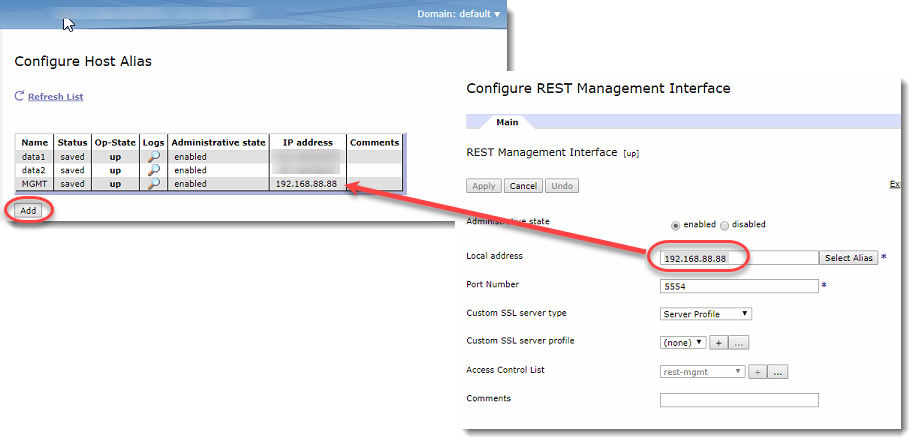

### Step-by-step

#### 1. MPGW Service Creation

This section walks through the build out of the GetStat service and its dependencies.

1\. Create a new MPGW with the following

*   Dynamic-backend type
*   Non-xml Request Type
*   Non-xml Response Type

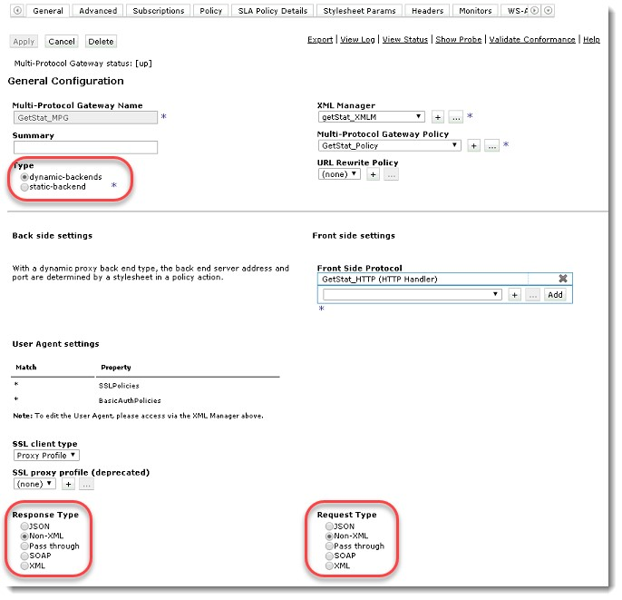

2\. Add a new XML Manager by clicking the **add (+)** icon under the XML Manager section, and when the _Configure XML_ Manager pops up, enter a name for the XMLM (e.g. getStat\_XMLM), then locate the User Agent Configuration section and click on the **add (+)** icon to create a new User Agent.

Information: The User Agent is where you specify the SSL Profile and Basic Auth to be used.

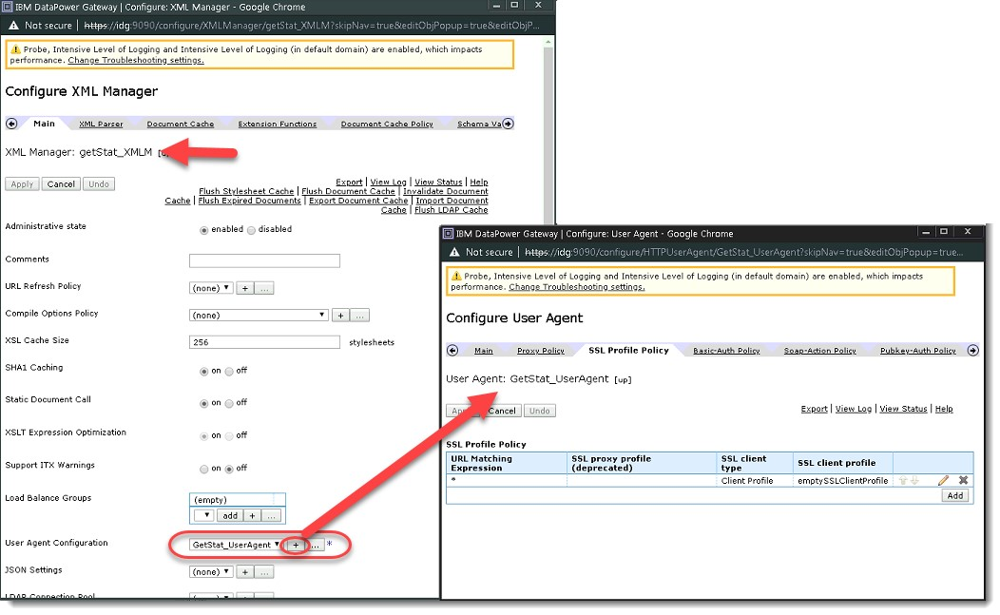

3\. In the _User Agent_ section, name the User Agent (e.g. GetStat\_UserAgent), click on the **SSL Profile Policy** tab, and inside the _SSL Profile Policy_ section click on the **Add** button to create a new _Client Profile_.

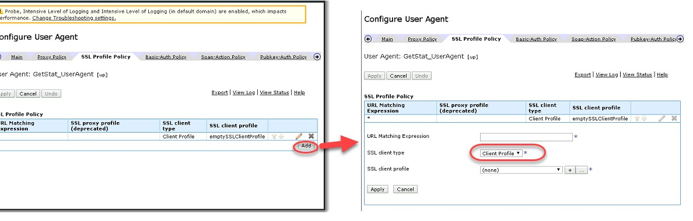

4\. In the _Configure User Agent_ pop out, ensure that you choose Client Profile for the SSL client type. Then in the SSL client profile section, click on the **add (+)** icon, and when the _Configure SSL Client Profile_ pops up, name the object (e.g. **emptySSLClientProfile**), and configure the following for the SSL Client Profile:

**NOTICE**: The name of this SSL Client Profile will be used in the code later, please ensure you note this down to be used in the code.

* Ensure the _Identification credentials_ remain as **(none)**
* Select **off** for the _Validation server certificate_.

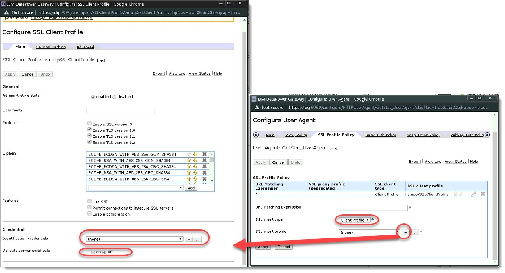

5\. Continue to Apply all the panels until you reach the Configure User Agent pop up again. In the User Agent pop up, select the **Basic-Auth Policy** tab and enter in the privileged user and password for the basic authentication.

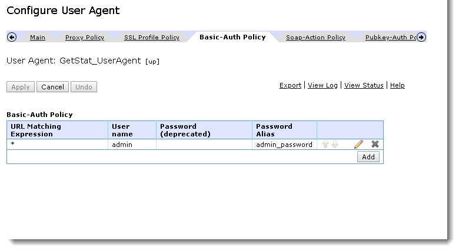

6.**Apply** the changes to the _User Agent_ and the _XML Manager._ **Apply** and click **Save Config** for the MPGW. Create a HTTP Front Side Protocol and ensure the GET method is enabled.

For the sake of the example, port 8888 will be used.

**Apply** the changes to the HTTP Front side Handler and **Save Config**.

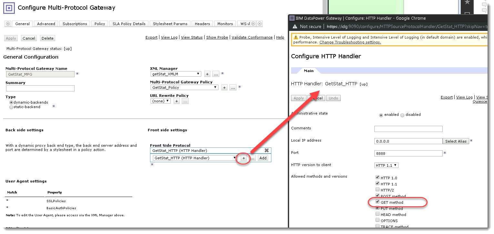

#### 2. Processing Policy: GatewayScript Actions to invoke REST APIs

This section will configure the Processing Policy that will contain the code to invoke the statistics REST APIs.

7\. First configure the Processing Policy. In the MPGW, click on the **add (+)** icon from the Multi-Protocol Gateway Policy

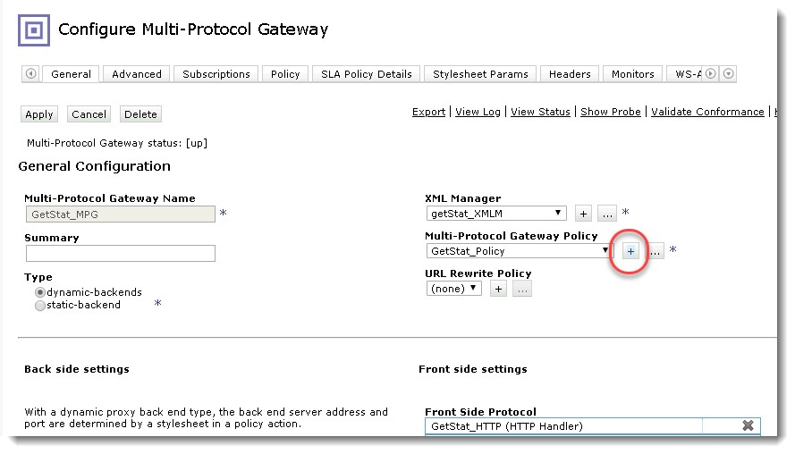

8\. Name the Policy once the _Configure Multi-Protocol Gateway Style Policy_ pops up (e.g. GetStat\_Policy), and name the first rule (e.g. GetStat\_Policy\_rule). Drop down the _Rule Direction_ and select **Client to Server.**

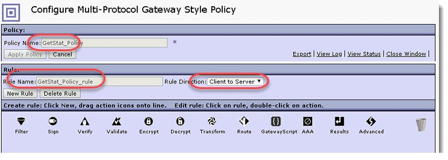

9\. Double click on the Match Action icon, click on the **add (+)** icon the create a new Matching Rule, and add a new URL match rule for **\*/getstat**. Once added, **Apply** the changes for each screen until you get back to the _Configure Multi-Protocol Gateway Style_ Policy panel.

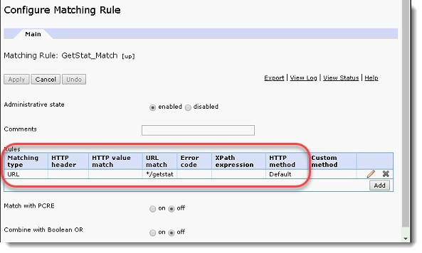

10\. **setDeviceName.xsl**: The setDeviceName stylesheet extracts the appliance name that is set in the System Settings section (Appliance name), and will set it to a context variable to be used down stream.

Locate the Transform Action icon, drag, and drop the Transform Action after the Match Action.

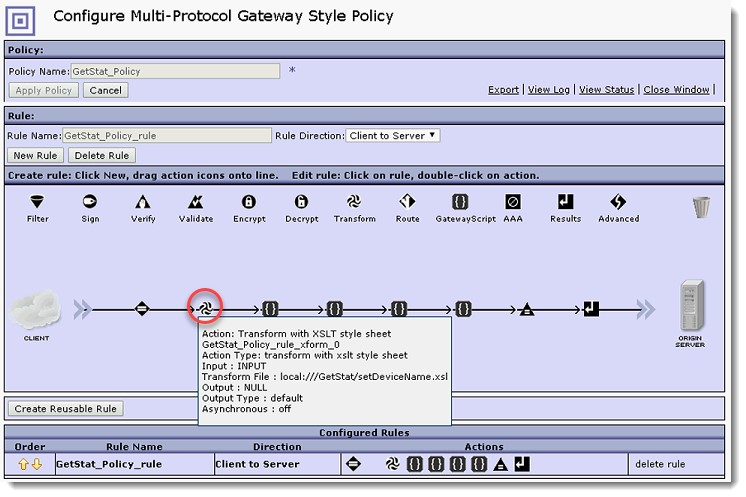

11\. In the Transform Action, use the following:

* Drop down and select **INPUT** for the _Input_.
* Select **Transform with XSLT style sheet** for the _Use Document Processing Instructions_.
* In the _Transform File_ section drop down the first drop down section to select local:///GetStat (if the GetStat folder if not available, open the File Management section in another browser window to add the GetStat subfolder under local:///).
* Upload the **setDeviceName.xsl** to the local:///GetStat folder. The code could be found in the appendix section titled **setDeviceName.xsl** at the bottom of this doc.
* Drop down and select **NULL** for the _Output_.

Click **Done** when completed.

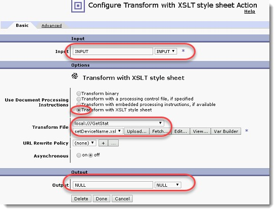

12\. **getMem.js**: The getMem script is a gatewayscript which will invoke the current appliances REST interface to pull the memory usage statistics. The code could be found in the appendix under **getMem.js**.

Locate the **GatewayScript Action**, drag, and drop it after the Transform Action (the right side of the Transform Action):

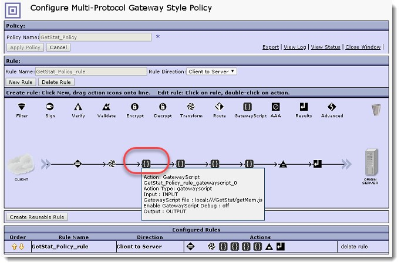

13\. In the GatewayScript Action (double-click to open), use the following:

* Drop down and select **INPUT** for _Input_.
* In the _GatewayScript_ _file_ section, drop down the first drop down to select **local:///Getstat** folder, and upload the **getMem.js** script.
* Drop down and select **OUTPUT** for _Output_.

Click **Done** when complete.

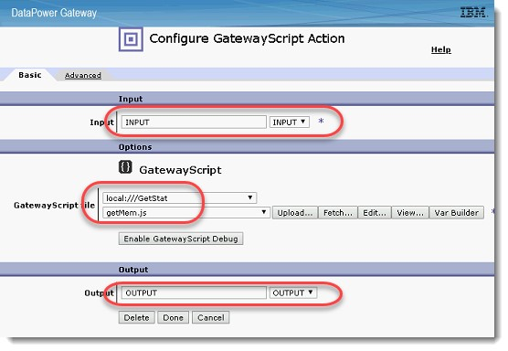

14\. Continue the same steps to add the other scripts to run the other REST APIs.

NOTE: Be mindful of the REST API uri, some will require different domains, such as the **getServicesMemStatus.js** in the appendix.

15\. After adding all the GatewayScript Actions, drag and drop the **Advanced Action** icon over to the right of the last GatewayScript Action to set a loopback variable to the Processing Rule.

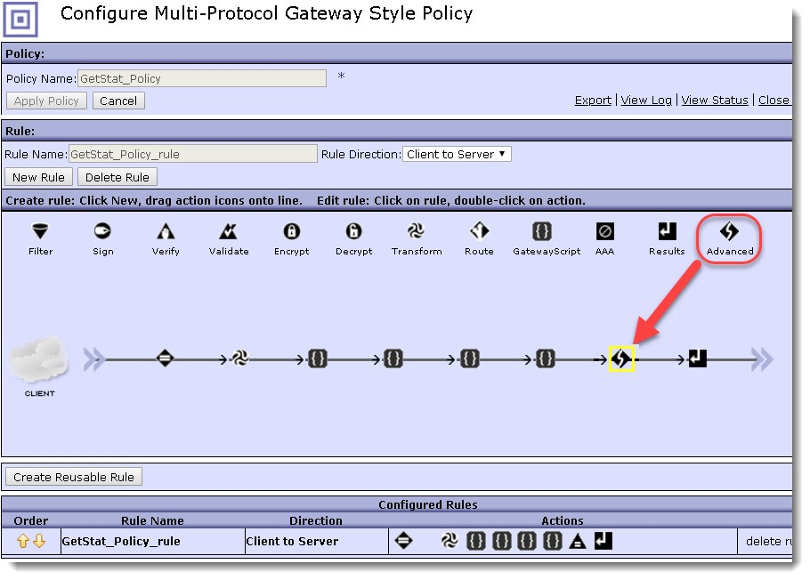

16\. Double click on the Advanced Action, select the **Set Variable** action type and click **Next**.

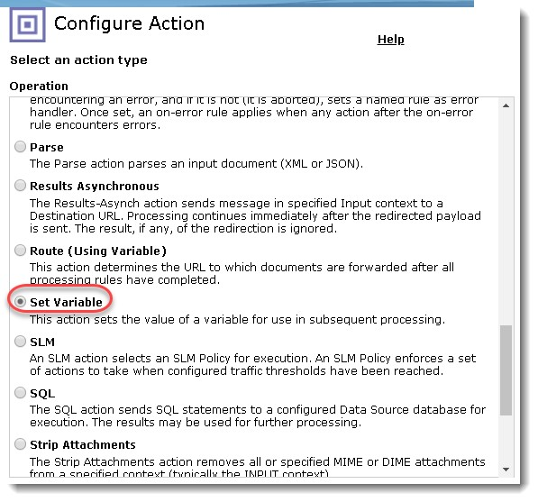

17\. Enter **service/mpgw/skip-backside** for the _Variable Name_ and **1** for the _Variable Assignment_. Once complete, click on **Done** and **Apply Changes** in the _Processing Policy_.

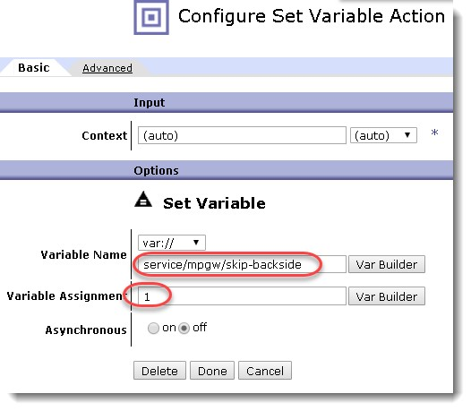

18\. After all the changes, you should be back in the main MPGW, **Apply** the changes, and **Save Config**.

#### 3. XML Manager Scheduled Processing Policy Rule: CallGetStat Processing Rule

You may create a Scheduled Processing Policy Rule to call the GetStat service if you like to self invoke the service at a given time.

1\. In the GetStat\_MPG service, open the **GetStat\_XMLMgr** and navigate to the **Schdeuled Processing Policy** tab:

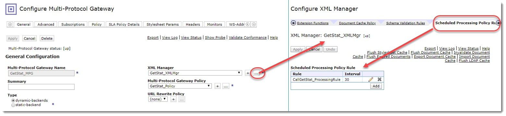

2\. You will need to add 2 rule actions:

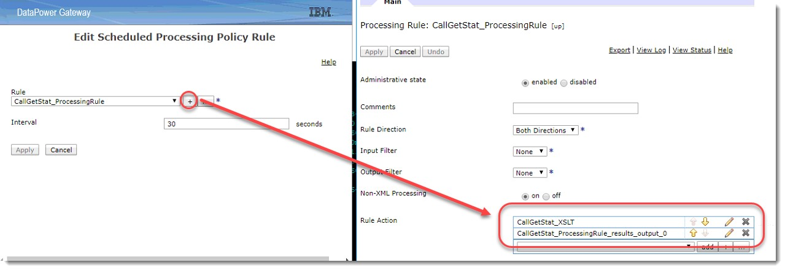

(a) the **transform action** which will execute the stylesheet.

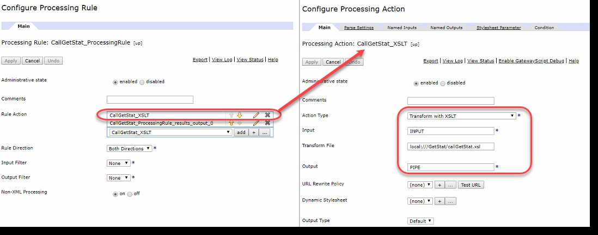

(b) the **results** will end the processing rule.

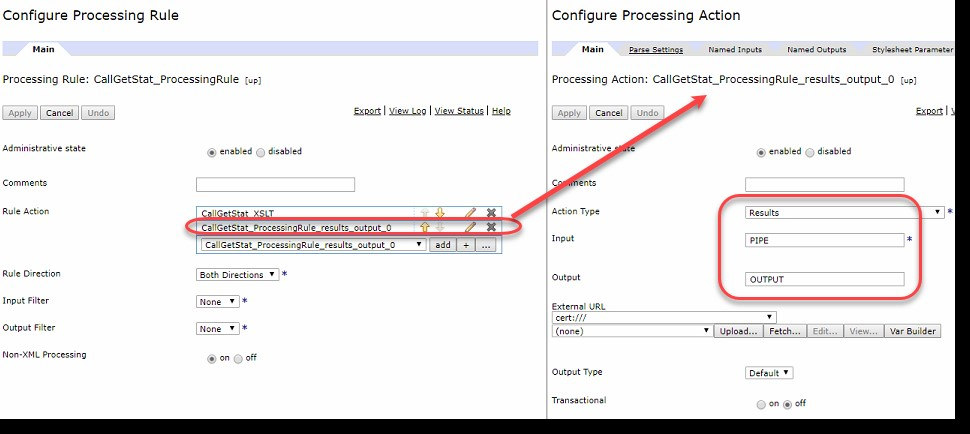

#### 4. Appendix

setDeviceName.xsl
=================

```
<xsl:stylesheet version="1.0" xmlns:xsl="http://www.w3.org/1999/XSL/Transform" xmlns:tns="http://www.example.org/tns" xmlns:dp="http://www.datapower.com/extensions" extension-element-prefixes="dp" exclude-result-prefixes="dp">  
 <xsl:output omit-xml-declaration="yes" />  
 <xsl:template match="/">  
 <!-- Getting the appliance device name which is set by DataPower on var://service/system/ident -->  
 <xsl:variable name="vDeviceName">  
 <xsl:value-of select="dp:variable('var://service/system/ident')//\*\[local-name()='device-name'\]" />  
 </xsl:variable>  
 <!-- Set the device name to var://context/getstat/devicename to be used in a GatewayScript -->  
 <dp:set-variable name="'var://context/getstat/devicename'" value="$vDeviceName" />  
 </xsl:template>  
</xsl:stylesheet>
```

getMem.js
=========

```
/\*  
Script Name: getMem.js  

Purpose: Get Statistics that cannot be produced by the log target on DataPower. The getMem.js is to obtain the system memory usage.  
\*\*Dependencies:  
1\. Ensure the logging category is set on the appliances Log Category section of the appliance, otherwise the log category will not exist for this event to be logged.  
2\. Ensure the setDeviceName.xsl is used in the service otherwise the context variable will not be found, and the script will fail.  
3\. Ensure the XML Manager > User Agent contains the SSL Client Profile and Basic-Auth which is used because the REST call requires https connection, and DataPower username/pass authentication. The call will fail without it.  
\*/  

//Properties:  
var vHost = "https://MGMT:5554/mgmt/status/default/MemoryStatus";  
var vLogCategory = {'category':'GetStatCategory'};  
var sm = require('service-metadata');  
var hm = require('header-metadata');  
var urlopen = require('urlopen');  
var ct = hm.current.get('Content-Type');  
var ctx = session.name('getstat') || session.createContext('getstat');  
var vAppliance = ctx.getVar('devicename').replace('<?xml version="1.0" encoding="UTF-8"?>','') || 0;  
var vDomainName = sm.getVar("var://service/domain-name");  
var vXMLContentType = "application/json";  
            // define the urlopen options  
            var options = {  
            target : vHost,  
            method : 'GET',  
            contentType : vXMLContentType,  
            timeout : 2  
};  

// open connection to target and send data over  
urlopen.open(options, function (error, response) {  
            if (error) {  
                        // an error occurred during request sending or response header parsing  
                        console.log('urlopen error: ' + error);  
                        session.output.write("urlopen connect error: " + error);  
            } else {  
                        // read response data  
                        // get the response status code  
                        var responseStatusCode = response.statusCode;  
                        if (responseStatusCode == 200) {  
                                    response.readAsJSON(function(err, readAsJSONResponse) {  
                                                if (err) {  
                                                            session.reject("readAsJSON error: " + JSON.stringify(err));  
                                                } else {  
                                                            session.output.write(" Success ");  
                                                            console.options(vLogCategory).log("Appliance: " + vAppliance + ", MemoryUsage: " + JSON.stringify(readAsJSONResponse.MemoryStatus.Usage));  
                                                }  
                                    });  
                                    };  
                        }  
            });
```

getCPU.js
=========

```
/\*  
Script Name: getCPU.js  
Purpose: Get Statistics that cannot be produced by the log target on DataPower.  
\*\*Dependencies:  
1\. Ensure the logging category is set on the appliances Log Category section of the appliance, otherwise the log category will not exist for this event to be logged.  
2\. Ensure the setDeviceName.xsl is used in the service otherwise the context variable will not be found, and the script will fail.  
3\. Ensure the XML Manager > User Agent contains the SSL Client Profile and Basic-Auth which is used because the REST call requires https connection, and DataPower username/pass authentication. The call will fail without it.  
\*/  
//Properties:  
var vHost = "https://MGMT:5554/mgmt/status/default/CPUUsage";  
var vLogCategory = {  
            'category': 'GetStatCategory'  
};  

var sm = require('service-metadata');  
var hm = require('header-metadata');  
var urlopen = require('urlopen');  
var ct = hm.current.get('Content-Type');  
var ctx = session.name('getstat') || session.createContext('getstat');  
var vAppliance = ctx.getVar('devicename').replace('<?xml version="1.0" encoding="UTF-8"?>','') || 0;  
var vDomainName = sm.getVar("var://service/domain-name");  
var vXMLContentType = "application/json";  
            // define the urlopen options  
            var options = {  
            target : vHost,  
            method : 'GET',  
            contentType : vXMLContentType,  
            timeout : 2  
};  
// open connection to target and send data over  
urlopen.open(options, function (error, response) {  
            if (error) {  
                        // an error occurred during request sending or response header parsing  
                        console.log('urlopen error: ' + error);  
                        session.output.write("urlopen connect error: " + error);  
            } else {  
                        // read response data  
                        // get the response status code  
                        var responseStatusCode = response.statusCode;  
                        if (responseStatusCode == 200) {  
                                    response.readAsJSON(function(err, readAsJSONResponse) {  
                                                if (err) {  
                                                            session.reject("readAsJSON error: " + JSON.stringify(err));  
                                                } else {  
                                                            session.output.write(" Success ");  
                                                            console.options(vLogCategory).log("Appliance: " + vAppliance + ", CPUUsage: " + JSON.stringify(readAsJSONResponse.CPUUsage.tenSeconds));  
                                                }  
                                    });  
                                    };  
                        }  
            });
```

getServiceMemStatus.js
======================

```
/\*  
Script Name: getServicesMemStatus.js  
Purpose: Get Statistics that cannot be produced by the log target on DataPower.  
\*\*Dependencies:  
1\. Ensure the logging category is set on the appliances Log Category section of the appliance, otherwise the log category will not exist for this event to be logged.  
2\. Ensure the setDeviceName.xsl is used in the service otherwise the context variable will not be found, and the script will fail.  
3\. Ensure the XML Manager > User Agent contains the SSL Client Profile and Basic-Auth which is used because the REST call requires https connection, and DataPower username/pass authentication. The call will fail without it.  
4\. Ensure the REST API url is update to reflect the proper domain. For example, in this script there is a domain in the URL which will need updating when migrating to staging and production.  
 \*/  
 //Properties:  
var vHost = "https://MGMT:5554/mgmt/status/<domain\_here>/ServicesMemoryStatus2";  
var vLogCategory = {  
            'category': 'GetStatCategory'  
};  
var sm = require('service-metadata');  
var hm = require('header-metadata');  
var urlopen = require('urlopen');  
var ct = hm.current.get('Content-Type');  
var ctx = session.name('getstat') || session.createContext('getstat');  
var vAppliance = ctx.getVar('devicename').replace('<?xml version="1.0" encoding="UTF-8"?>', '') || 0;  
var vDomainName = sm.getVar("var://service/domain-name");  
var vXMLContentType = "application/json";  
// define the urlopen options  
var options = {  
            target: vHost,  
            method: 'GET',  
            contentType: vXMLContentType,  
            timeout: 2  
};  
// open connection to target and send data over  
urlopen.open(options, function (error, response) {  
            if (error) {  
                        // an error occurred during request sending or response header parsing  
                        console.log('urlopen error: ' + error);  
                        session.output.write("urlopen connect error: " + error);  
            } else {  
                        // read response data  
                        // get the response status code  
                        var responseStatusCode = response.statusCode;  
                        if (responseStatusCode == 200) {  
                                    response.readAsJSON(function (err, readAsJSONResponse) {  
                                                if (err) {  
                                                            session.reject("readAsJSON error: " + JSON.stringify(err));  
                                                } else {  
                                                            session.output.write(" Success ");  
                                                            var vServiceMemoryStatus = readAsJSONResponse.ServicesMemoryStatus2;  
                                                            for (var i = 0; i < vServiceMemoryStatus.length; i++) {  
                                                                        console.options(vLogCategory).log('Appliance: ' + vAppliance + ', Services Memory Status: ' + '\[{"serviceName": "' + vServiceMemoryStatus\[i\].serviceName + '", "currentMemory": "' + vServiceMemoryStatus\[i\].current + '"}\]');  
                                                            };  
                                                }  
                                    });  
                        };  
            }  
});
```

getDomainMemStatus.js
=====================

```
/\*  
Script Name: getDomainMemStatus.js  
Purpose: Get Statistics that cannot be produced by the log target on DataPower.  
\*\*Dependencies:  
1\. Ensure the logging category is set on the appliances Log Category section of the appliance, otherwise the log category will not exist for this event to be logged.  
2\. Ensure the setDeviceName.xsl is used in the service otherwise the context variable will not be found, and the script will fail.  
3\. Ensure the XML Manager > User Agent contains the SSL Client Profile and Basic-Auth which is used because the REST call requires https connection, and DataPower username/pass authentication. The call will fail without it.  
\*/  
 //Properties:  
var vHost = "https://MGMT:5554/mgmt/status/default/DomainsMemoryStatus2";  
var vLogCategory = {'category':'GetStatCategory'};  
var sm = require('service-metadata');  
var hm = require('header-metadata');  
var urlopen = require('urlopen');  
var ct = hm.current.get('Content-Type');  
var ctx = session.name('getstat') || session.createContext('getstat');  
var vAppliance = ctx.getVar('devicename').replace('<?xml version="1.0" encoding="UTF-8"?>','') || 0;  
var vDomainName = sm.getVar("var://service/domain-name");  
var vXMLContentType = "application/json";  
            // define the urlopen options  
            var options = {  
            target : vHost,  
            method : 'GET',  
            contentType : vXMLContentType,  
            timeout : 2  
};  
// open connection to target and send data over  
urlopen.open(options, function (error, response) {  
            if (error) {  
                        // an error occurred during request sending or response header parsing  
                        console.log('urlopen error: ' + error);  
                        session.output.write("urlopen connect error: " + error);  
            } else {  
                        // read response data  
                        // get the response status code  
                        var responseStatusCode = response.statusCode;  
                        if (responseStatusCode == 200) {  
                                    response.readAsJSON(function(err, readAsJSONResponse) {  
                                                if (err) {  
                                                            session.reject("readAsJSON error: " + JSON.stringify(err));  
                                                } else {  
                                                            session.output.write(" Success ");  
                                                            var vDomainMemoryStatus = readAsJSONResponse.DomainsMemoryStatus2;  
                                                            for (var i = 0; i < vDomainMemoryStatus.length; i++) {  
                                                                        console.options(vLogCategory).log("Appliance: " + vAppliance   
                                                                        + ", Domain Memory Status: "   
                                                                        + "\[{Domain: "   
                                                                        + vDomainMemoryStatus\[i\].Domain   
                                                                        + ", ServicesCurrent: "   
                                                                        + vDomainMemoryStatus\[i\].ServicesCurrent   
                                                                        + "}\]");  
                                                            }  
                                                }  
                                    });  
                                    };  
                        }  
            });
```

callGetStat.xsl
===============

```
<!--   
Script Name: callGetStat.xsl  
Purpose: Get statistics which are not available from logging to output in syslogs. Stylesheet can be placed in XML Manager   
\-->  
<xsl:stylesheet  
    version="1.0"  
    xmlns:xsl="http://www.w3.org/1999/XSL/Transform"  
    xmlns:dp="http://www.datapower.com/extensions"  
    xmlns:dpconfig="http://www.datapower.com/param/config"  
    xmlns:webapi="http://www.ibm.com/apimanagement"  
    xmlns:func="http://exslt.org/functions"  
    xmlns:wxsl="http://www.w3.org/1999/XSL/TransformAlias"  
    xmlns:exsl="http://exslt.org/common" xmlns:client="http://datapower.com/sslClientProfile"  
    extension-element-prefixes="dp dpconfig exsl">  

            <xsl:output omit-xml-declaration="yes"/>  

            <xsl:template match="/">  
                        <dp:url-open  
                                    target="http://127.0.0.1:8888/getstat"  
                                    response="ignore"  
                                    http-method="get"  
                                    >  
                        </dp:url-open>  
            </xsl:template>  
</xsl:stylesheet>
```

#### 5. Artifact Export

[GetStat\_MPG\_and\_LogCategory.zip](https://github.com/ibmArtifacts/GetStat_MPG_and_LogCategory/raw/main/GetStat_MPG_and_LogCategory.zip)
