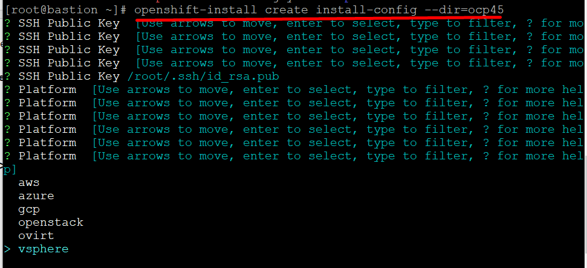
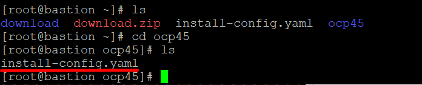
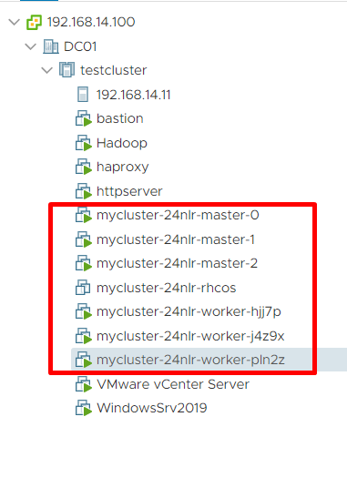

# Installing Open-Shift 4.5 Self Provisioning using IPI Installation
## Open-Shift 4.5 - Installer Provisioned Installation

SharadChandra

Published on August 12, 2020 / Updated on September 3, 2021

### Overview

Skill Level: Intermediate

One should have proper understanding of Infrastructure components to meet pre-requisites of Installation

Redhat OpenShift 4.5 has Introduced Installation process with VMWare 6.7 onwards referred to as IPI in which maximum of the Installation responsibility is taken over by Installer itself. This article walkthrough the IPI Process on VMWare 7.0

### Ingredients

This Installation is tested on VMWare vCenter 7.0 Infrastructure with necessary details mentioned in below reference:

[https://docs.openshift.com/container-platform/4.5/installing/installing\_vsphere/installing-vsphere-installer-provisioned-customizations.html](\"https://docs.openshift.com/container-platform/4.5/installing/installing_vsphere/installing-vsphere-installer-provisioned-customizations.html\")

The installation is tested with OpenShift 4.5.x. Though this Installation is tested on On-Premise VMWare Infrastrucure, I don't see much difference in doing it on any of the Cloud Provider's VMWare Infrastructure except for the Networking.

One needs to have host as part of VMWare cluster to perform OCP 4.5 IPI Installation:

HAProxy responsibility is taken over by **Keepalived** daemon in case of IPI Installation.

For Manual Installation Process One can refer below article:

[https://developer.ibm.com/recipes/tutorials/installing-openshift-4-5-leveraging-upi-installation/](\"/recipes/tutorials/installing-openshift-4-5-leveraging-upi-installation/\")

### Step-by-step

#### 1. Prepare Pre-requisites

OpenShift 4.5 IPI Installation requires VMWare vCenter 7.0 cluster setup along with properly configured DNS and DHCP Server.In this article I will be using Windows Server 2019 services to meet the necessary pre-requisites before to begin with the Installation. As per of my Infrastructre I have designated one of my machine as Bastion node from where I will be trigging the Installation.

#### 2. Configure Bastion to Interact with vCenter

While configuring cluster one might get below mentioned exception which will not allow to proceed further with Installation.

To overcome this error one need to create a trust relation-ship between the host (in my case Bastion) and vCenter server as Installer will upload and create Virtual machines automatically which might not be allowed by vCenter server in absense of such relationship. One would need to download the vCenter certificates and run below command to create trust between the two.

In the above screen shot "**192.168.14.100**" is IP address of my vCenter server. On cloud hostings this could be FQDN. Unzip download.zip

This directory contains trust certificates for three standard OS flavours i.e - Windows, Linux and MacOS. Lets see the content of this directory. Since my bastion is running RHEL, I will focus on linux certificates.

Do the operations as mentioned below:

TThe trust is now established between vCenter server and bastion host.

#### 3. Configuring DHCP

The OpenShift4.5 installation has a services ecosystem around it on which it is dependent during and post Installation. The key components of it is DHCP and DNS. During Installation IPI requires its Virtual Machines to be assigned IP addresses, since the creation of Virtual machines is not in out control we can't assign static IP's to them. Hence DHCP plays a critical role during Installation. Lets walk through my DHCP configurations in [DHCP Configuration For Dynamic Allocation of IP](https://thecloudinternals.com/?p=1948 "DHCP Allocation")

#### 4. Configuring DNS

Configure DNS entries as mentioned in Redhat documentation link :

**Forward DNS:**

**Reverse DNS:**

Detailed configuration steps could be seen in [Configuring DNS for OpenShift 4.x](https://thecloudinternals.com/?p=1553 "Configuring DNS")

#### 5. Create Install-Config.yaml

This is one of the crucial step for the configuration of OpenShift. One can create an empty folder say ocp45 in current directory and run the below mentioned command

**openshift-install create install-config --dir=<installation\_directory>**

This will open up questionnaire

Answer all the questions, specifically related to **baseDomain** and **vCenter**.

Another Important step is configuring Virtual IP which in my case are two routable private IP's - **192.168.14.75** and **192.168.14.76**

Copy pull secret from below link:

**[https://cloud.redhat.com/openshift/install/vsphere/user-provisioned](https://cloud.redhat.com/openshift/install/vsphere/user-provisioned)**

One must have appropriate Redhat subscription and credentials to login.

This will create **install-config.yaml** file in **ocp45** directory.

This will generate **install-config.yaml** file as shown below which we will use for Installation:

Refer [understanding install-config.yaml](https://thecloudinternals.com/?p=2311 "understanding install-config.yaml ") for more details.

**Note**: The **pull-secret** key is rotated every **24 hrs** hence it is important to replace pull-secret if one is repeating Installation another day due to any reason.

We are now ready to initate Installation. One would need to run the below command to start the Installation. Below command can be run from one level above ocp45 where I have kept **install-config.yaml** file

**openshift-install create cluster --dir=<installation\_directory> --log-level=info**

If we run the command from within ocp45 directory one can run below command:

**openshift-install create cluster --log-level=info**

This will start Installation as show below and create Virtual machines in vCenter server:

The boot node will get deleted automatically and workers created once Installation will be successfully done.

This will create cluster folder to keep cluster resources seperate as show below. If you create multiple cluster instances each of these will be stored in seperate folders.

Configuring **kubeconfig** on bastion:

kubeconfig gets generated during Installation process of OpenShift and gets generated in **auth** folder :

As a best practice one should configure kubeconfig at global level through **.bashrc** as shown below:

Run **source .bashrc** command to enable this environment variable and test whether you are logged in as sys admin role:

Check for registry installation :

In **Redhat Cluster Manager** link one should see his instantiated cluster:

[https://cloud.redhat.com/openshift](https://cloud.redhat.com/openshift)

When one clicks on ClusterID (**51900db3-cffd-4a6a-a711-e8643301c981**) hyperlink above one can view details of configured cluster:

One can refer below article to configure user Identities post completing the Installation

[https://developer.ibm.com/recipes/tutorials/openshift-4-5-administration-creating-identities/](/recipes/tutorials/openshift-4-5-administration-creating-identities/)

#### 6. Conclusion

With the help of OpenShift IPI Self Provisioning Installation end users can ease deployment of OpenShift 4.5.x on VMWare Infrastructure.

#### 7. References:

https://docs.openshift.com/container-platform/4.5/installing/installing\_vsphere/installing-vsphere.html

https://docs.openshift.com/container-platform/4.5/installing/installing\_bare\_metal/installing-bare-metal.html

https://www.youtube.com/watch?v=Be0dRq0wjWE

https://mirror.openshift.com/pub/openshift-v4/dependencies/rhcos/4.5/4.5.2/

https://cloud.redhat.com/openshift/install/vsphere/user-provisioned
