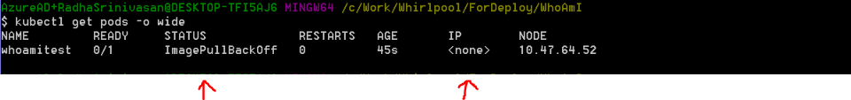
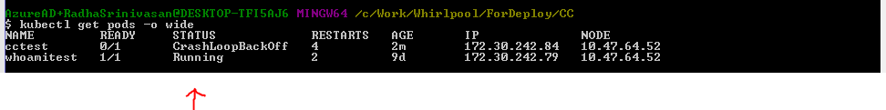
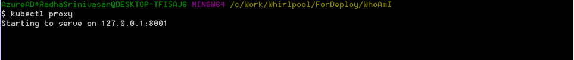
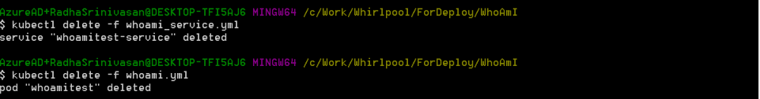
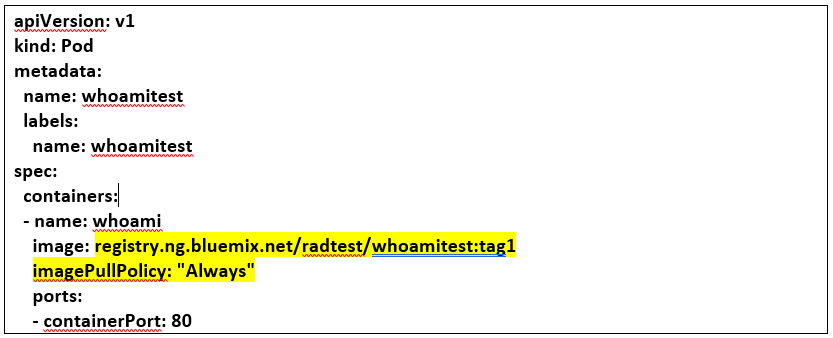
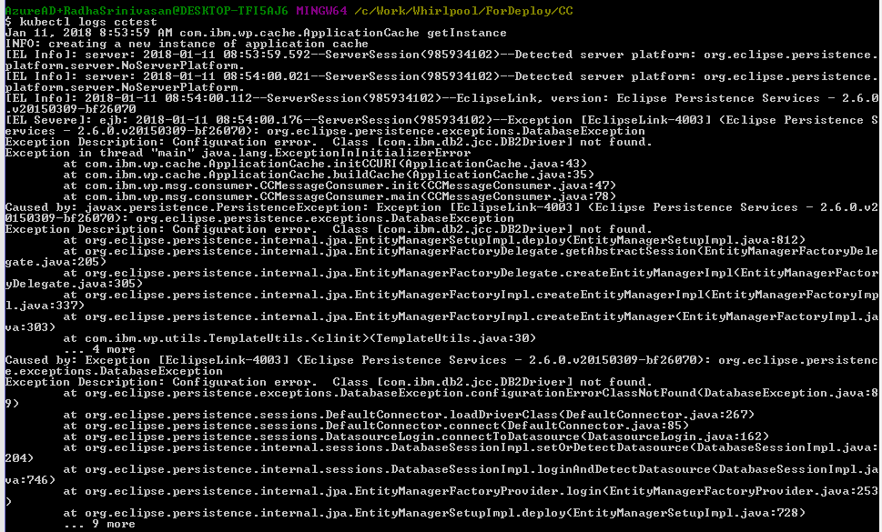
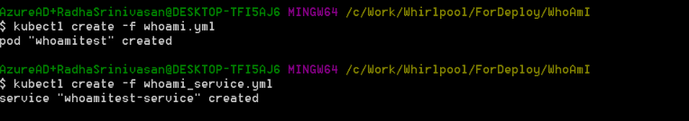
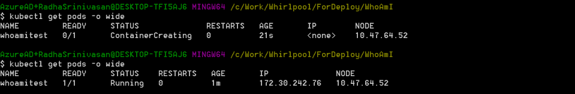

# Kubectl unable to deploy the pod in the cluster
## Deployment issue

Radha Srinivasan

Tags: Cloud computing, Cognitive computing, DevOps, Internet of Things (IoT), Java development

Published on February 9, 2018 / Updated on November 10, 2020

### Overview

Skill Level: Any Skill Level

This article will help people who are trying to deploy their code on Kubernetes but are facing challenges.

### Ingredients

Have good understanding on IBM Bluemix, docker and Kubernetes concepts. Followed the steps given in https://developer.ibm.com/recipes/tutorials/deploying-ibm-containers-in-kebernetes-on-ibm-bluemix/#r_overview.

### Step-by-step

#### 1. Pod status in Kubectl is 'ImagePullBackOff’ or 'CrashLoopBackOff’ in place of running

\>kubectl get pods -o wide

Status is 'ImagePullBackOff' and there is no IP.

or

Status is 'CrashLoopBackOff' for application cctest.

#### 2. Stop the Kubectl proxy and delete the pod

If the Kubectl proxy is running stop it (Ctrl + C)

Delete the pod and its service

\> kubectl delete -f whoami.xml

\> kubectl delete -f whoami\_service.xml

#### 3. For 'ImagePullBackOff' issue fix the yml

For ‘ImagePullBackOff’ error, fix whoami.yml file with correct tag information and mark imagePullPolicy as “Always”

#### 4. For 'CrashLoopBackOff' fix the application code

Check the logs of the application deployment

\> kubectl logs cctest

#### 5. Redeploy the pod and check the pod status

After build and deploy of the application docker image.

\> kubectl create -f whoami.xml

\> kubectl create -f whoami\_service.xml

Check the status of the pods

\> kubectl get pods -o wide

#### 6. Restart the kubectl proxy

Start the proxy

Check the pod deployment using the url [http://localhost:8001/ui](http://localhost:8001/ui)
