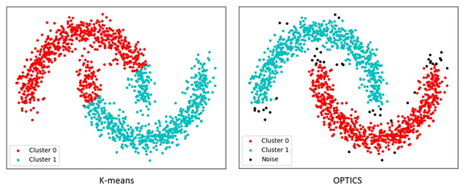

# Machine Learning and IBM Watson Studio

RafieTarabay

Tags: Big Data and analytics, Cognitive computing

Published on September 5, 2018 / Updated on March 21, 2020

### Overview

Skill Level: Any Skill Level

Machine Learning is a subset of AI which enables the computer to act and make data-driven decisions to carry out a certain task. These programs or algorithms are designed in a way that they can learn and improve over time when exposed to new data.

### Step-by-step

#### 1. Machine Learning overview

\- a machine learning-based system is not explicitly programmed but learnt from data.

\- a machine learning algorithm infers patterns and relationships between different variables in a dataset then uses that knowledge to generalize beyond the training dataset.

**Machine learning mainly has three types of learning techniques:**

*   Supervised learning
*   Unsupervised learning
*   Reinforcement learning


**Common modeling techniques**

**1- Supervised Learning (Classification & Regression)**

describe and distinguishes classes for future prediction (on new data) based on training data  
Common Methods: Decision Trees, Regression, Nearest Neighbours, Neural Networks

**2- Unsupervised Learning (Cluster)**

Analyses data where labels are unknown to create groups/classes for objects that are similar to each other within the group but dissimilar to objects in other clusters  
Common Methods: K-means, Hierarchical, Two-Step

**Modeling techniques in details**

**a) Classification \[supervised learning\]**

Classification is concerned with building models that separate data into distinct classes. These models are built by inputting a set of training data for which the classes are pre-labelled in order for the algorithm to learn from. The model is then used by inputting a different dataset for which the classes are withheld, allowing the model to predict their class membership based on what it has learned from the training set.  

**Binary classification examples** (divide data to two options only)

spam filtering is a classification task  
Tumor diagnosis can be treated as a classification problem.  
determining credit risk using personal information such as income, outstanding debt  
use ROC Curves (Receiver operator characteristics) to summarize & present performance, models distinguish between false & true positives

**Multi-class classification examples**

handwritten recognition each character is a multi-class classification problem  
image recognition is a multi-class classification task  
Xbox Kinect360, which infers body parts and position

**b) Regression \[ supervised learning\]**

The goal is to predict a numerical label for an unlabeled observation

Regression algorithms: Linear regression, Decision trees

**Examples**

– Home valuation  
– Asset trading, and forecasting  
– Sales or inventory forecasting

**c) Anomaly Detection \[ supervised learning\]**

the goal is to find outliers, noise, deviations in a dataset

**Anomaly detection applications**

– In manufacturing, it is used for automatically finding defective products.  
– In data centers, it is used for detecting bad systems.  
– Websites use it for fraud detection.  
– Detecting security attacks. Network traffic associated with a security attack is unlike normal network traffic. Similarly, hacker activity on a machine will be different from a normal user activity.

**d) Clustering \[unsupervised learning\]**

The aim is to split a dataset into a specified number of clusters or segments.  
– Elements in the same cluster are more similar to each other than to those in other clusters.  
– Elbow diagram we use to find the best no of clusters

**Clustering algorithms**

1) k-means

– The number of clusters (k) must be given explicitly.  
– Identify the best k cluster centers in an iterative manner  
– Clusters are assumed to be spherical.

2) OPTICS /DBSCAN

– it is a density-based clustering algorithm. represents clusters by its nature

**Example**

– creating customer segments, which can be targeted with different marketing programs



**e) Association \[unsupervised learning\]**

Association is most easily explained by introducing market basket analysis, a typical task for which it is well-known.  
attempts to identify associations between the various items that have been chosen by a particular shopper and placed in their market basket and assigns support and confidence measures for comparison.  
The value of this lies in cross-marketing and customer behavior analysis.

****

**f) Dimensionality Reduction \[unsupervised learning\]**

The goal in dimensionality reduction is to reduce the number of features in a dataset without significantly impacting the predictive performance of a model and this will reduce the computational complexity and cost of machine learning.


**g) Recommendation \[Reinforcement\]**

The goal of a recommendation system is to recommend a product to a user based on past behavior to determine user preferences.  
Unlike Association, Recommendation focus on user behavior and suggest according to this user behavior.  
It is reinforcement because we not sure of result until user choose one of our recommendation, if not, then our recommendation was not correct.

**Machine Learning Algorithms**

**a) Supervised machine learning algorithms**

**Classification**

**Two Class Classification**  
– Logistic Regression (Fast)

– Decision Tree (Fast)

– Decision jungle(Accurate)

– SVM (Accurate) (>100 features)

– Boosted Decision Tree (Fast – Large memory)

– Bayes point machine (Fast)

**Multi Class Classification**  
– Decision Tree (Fast)

– Logistic Regression (Fast)

– Random Forest (Accurate)

– Gradient Boosting Tree (Accurate)

– Naive Bayes (Big Data)

– Decision jungle(Accurate)

**Text Analytics**

– Named Entity Recognition

– Sentimental Analysis

**Regression**

– Linear Regression (Fast)

– Decision Tree (Fast)

– Random Forest (Accurate)

– Gradient Boosting Tree (Accurate)

– Ordinal regression

– Bayesian linear regression

– Boosted Decision Tree (Fast – Large memory)

– SGD Regressor (<100K rows)

– Lasso/ ElasticNet (Few Features)

– RidgeRegression

– SVR(kernel=linear/ rbf)

– EnsembleRegressors

**Anomaly Detection**

– One Class SVM (support vector machine)

– PCA based Anomaly Detection

– Time Series Anomaly Detection

**b) Unsupervised machine learning algorithms**

**Clustering**  
– K-means Clustering  
– K-modes (Categorical variables)  
– DBScan (predict the number of clusters automatically)  
– OPTICS (predict the number of clusters automatically)

**Association**  
Apriori

**Dimension Reduction**  
– PCA  
– Singular value decomposition

**c) Reinforcement machine learning algorithms**

**Recommendation**  
– Matchbox Recommender

**Terms used in the context of machine learning**

1.  Data mining
2.  Features
3.  Labels
4.  Models
5.  Accuracy, and Precision

**Data Mining**

Process of discovering insights, patterns and relationships from large amount of data

data mining process use machine learning algorithms as tools to extract potentially-valuable patterns held within datasets.


**Features**

– a feature represents an independent variable  
– In a tabular dataset, a row represents an observation and column represents a feature.  
– Features are also collectively referred to as dimensions.

**Categorical Features**

– It can take on one of a fixed number of discrete values with name or a label.  
– The values of a categorical feature have no ordering.  
– gender is a categorical feature. It can take on only one of two values.

**Numerical Features**

– It can take on any numerical value  
– numerical feature have mathematical ordering  
– discrete numerical feature : number of persons, number of rooms  
– continuous numerical feature: temperature value

**Labels**

– label is a variable that a machine learning learns to predict  
– categorical label: ex, category of a news article is a categorical label  
– numerical label: ex, price is a numerical label


**Models**

– a mathematical construct for capturing patterns within a dataset and estimates the relationship between the dependent and independent variables and has predictive capability. and can calculate or predict the value for the dependent variable when get the values of the independent variables.  
– Training a model is a compute intensive task, while using it is not as compute intensive.  
– A model is generally saved to disk, so that it can be used without go to training step again.

**Training Data** (80% of data): The data used by a machine learning algorithm to train a model  
**Test Data** (20% of data): The data used for evaluating the predictive performance of a model

**Accuracy vs Precision**

Accuracy is how close a measured value is to the actual (true) value.  
Precision is how close the measured values are to each other.


**Overfitting vs Underfitting**

**Over fitting:** high variance and low bias, Example algorithms: Decision Trees, k-Nearest Neighbors and Support Vector Machines.  
**Under fitting:** high bias and low variance, Example algorithms: Linear Regression, Linear Discriminant Analysis and Logistic Regression.


#### 2. Machine Learning Algorithms

**0) Principal Component Analysis (PCA)**

What happens when a data set has too many variables ? remove correlated variables using PCA

What is PCA ?  
is a method of extracting important variables from a large set of variables available in a data set.  
the variables shoud be numeric and have standardized data.  
categorical variables must be converted to numerical. Also, make sure you have done the basic data cleaning.  
PCA will extract variable with high variance and has zero correlation to each others.

We aim to find the components which explain the maximum variance. This is because, we want to retain as much information as possible using these components. So, higher is the explained variance, higher will be the information contained in those components.

**PCA key points**

PCA is used to overcome features redundancy in a data set.  
These features are low dimensional in nature.  
These features a.k.a components are a resultant of normalized linear combination of original predictor variables.  
These components aim to capture as much information as possible with high explained variance.  
The first selected component by PCA is the component that has the highest variance followed by second, third and so on.  
The selected components must be uncorrelated.  
Normalizing data becomes extremely important when the predictors are measured in different units.  
PCA works best on data set having 3 or higher dimensions. Because, with higher dimensions, it becomes increasingly difficult to make interpretations from the resultant cloud of data.  
PCA is applied on a data set with numeric variables.  
PCA is a tool which helps to produce better visualizations of high dimensional data.

**Notes:**

To know the importance of each component, simply divide each component variance by sum of total variance. and select the components that represents 95% of variance.  
Do not combine train and test dataset set to obtain PCA components, just use train dataset only


**a) Linear regression**

Linear Regression is used in problems where the label is of continuous nature e.g. Sales of a retail chain. It consists of ordinary least squares method fitting the best line that minimizes the sum of squared errors between the predicted and actual data points. Such algorithms are mostly used to for decision-making process to solve problems like – What should be my best marketing mix to optimize sales given the investment in various marketing channels or maximizing sales based on store layouts or pricing and promotional offers.

**Assumptions of Linear Regression**

The regression has five key assumptions:

1- Linear relationship  
2- Multivariate normality (Normality of residuals):  
• Data has a normal distribution,  
\[ When the data is not normally distributed a non-linear transformation (e.g., log-transformation) might fix this issue \]  
• Normality can be checked with a goodness of fit test, e.g., the Kolmogorov-Smirnov test.  
3- No or little multicollinearity:  
• Multicollinearity occurs when independent variables are too highly correlated with each other.  
• Fix by remove columns that correlated to each others  
4- No auto-correlation: auto-correlation occurs when the value of y(x+1) is not independent from the value of y(x).  
5- Homoscedasticity: residuals has equal variance, ie, residuals are equal across the regression line.  
Goldfeld-Quandt Test can be used to test for heteroscedasticity (non-constant variance).


**b) Logistic regression**

Logistic Regression: When the label is that of categorical or discrete nature, we use log odds ratio to optimize business problems such as – scoring customers and then predict those that are most likely to default on the loan payment, or predict higher response rates to a certain marketing strategy.


**c) Ridge, Lasso, and Elasticnet**

Ridge, Lasso, and Elasticnet are Best Linear Unbiased Estimator (BLUE)

– To find a BLUE estimator just need mean and variance  
– BLUE restricts the estimator to be linear  
– BLUE use norms, norms play a vital role in reducing the Mean Squared Error (MSE)  

**Ridge vs Lasso vs Elasticnet**

– Ridge uses L2 Norm penalty term which limits the size of the coefficient vector.  
– Lasso uses L1 Norm penalty which imposes sparsity among the coefficients and thus, makes the fitted model more interpretable.  
– Elasticnet has a penalty which is a mix of L1 and L2 norms.


**d) Decision Trees, forests, and jungles**

Decision Trees methods construct a tree of predictive decisions made based on actual values of attributes in the data. It used for classification and regression problems.  
Decision Trees, forests, and jungles: all do the same thing – subdivide the feature space into regions with mostly the same label. These can be regions of consistent category or of constant value, depending on whether you are doing classification or regression.


**e) Ensemble Learning Algorithms (Gradient-Boosted/ Random Forests )**

Decision trees do not have the same level of predictive accuracy.

This problem is addressed by using a collection of decision trees instead of just one decision tree.

this algorithm called ensemble learning algorithms and it is one of top performers for classification and regression tasks.

The commonly used ensemble algorithms are Random Forests and Gradient-Boosted Trees


**f) Random Forests**

Random Forest algorithm trains each decision tree in an ensemble independently using a random sample of data. In addition, each decision tree is trained using a subset of the features. The number of trees in an ensemble is of the order of hundreds.

Random Forest creates an ensemble model that has a better predictive performance than that of a single decision tree model.

For a regression task, a Random Forest model takes an input feature vector and gets a prediction from each decision tree in the ensemble. It averages the numeric labels return by all the trees and returns the average as its prediction.

**g) Gradient-Boosted Trees**

Gradient-Boosted Trees (GBTs) algorithm also trains an ensemble of decision trees. However, it sequentially trains each decision tree.

It optimizes each new tree using information from previously trained trees. Thus, the model becomes better with each new tree.

GBT can take longer to train a model since it trains one tree at a time. In addition, it is prone to overfitting if a large number of trees are used in an ensemble.

However, each tree in a GBT ensemble can be shallow, which are faster to train.

**Random Forests vs Gradient-Boosted Trees (GBTs)**

– Random Forests can train multiple trees in parallel, but GBTs train one tree at a time  
– Random Forest reduces the likelihood of overfitting  
– Random Forests reduce variance by using more trees, whereas GBTs reduce bias by using more trees  

To make a prediction on a new instance, a random forest must aggregate the predictions from its set of decision trees. This aggregation is done differently for classification and regression.

– Classification: Majority vote. Each tree’s prediction is counted as a vote for one class. The label is predicted to be the class which receives the most votes.  
– Regression: Averaging. Each tree predicts a real value. The label is predicted to be the average of the tree predictions.

**h) SVM**

Support Vector Machines (SVM) are most popularly used in ML to deal with problems related to image segmentation, the stock market, text categorization and biological sciences, it try to find the line that give largest margin between two classes of observations.


**i) DBScan / Optics**

It is a Clustering algorithm that detect the continues patterns  
The distance between points in DBScan are fixed. So, it is fast but not work well with Clusters with different densities.  
Optics slower than DB Scan, identify clusters with different densities

****

**j) K-means**

Clustering/ K-Means: This is a undirected or unsupervised data mining activity typically seen to be used in problems that involve market segmentation, fraud detection, recommendation engines, clustering web pages by similarity.


**k) Naïve Bayes**

– Naïve Bayes mostly used in Real time Prediction , Multi class Prediction , Text classification, sentiment analysis, document categorization, spam filtering, disease prediction, Recommendation System.  
– Naïve Bayes Classifier is based on the Bayes Theorem of Probability and assumes independence of attributes.  
– Independence of attributes example:  
a fruit may be considered to be an apple if it is red, round, and about 3 inches in diameter. all of these properties independently contribute to the probability that this fruit is an apple and that is why it is known as ‘Naive’ =(child like/inexperienced).

**Naive Bayes Pros:**

– It is easy and fast to predict class/multi class prediction  
– Performs better compare to other models, need less training data.  
– It perform well in case of categorical input variables compared to numerical variable(s). For numerical variable, normal distribution is assumed  

**Naive Bayes Cons:**

– If categorical variable has a category (in test data set), which was not observed in training data set, then model will assign a 0 (zero) probability and will be unable to make a prediction.  
– Naive Bayes is also known as a bad estimator, so the probability outputs from predict\_proba are not to be taken too seriously.  
– In real life, it is almost impossible to get a set of predictors which are completely independent.  

**There are three types of Naive Bayes model**

– Gaussian: It is used in classification and it assumes that features follow a normal distribution.

– Multinomial: It is used for discrete counts. For example, in text classification problem. “count how often negative word occurs in the document”

– Bernoulli: The binomial model is useful if your feature vectors are binary (i.e. zeros and ones).

**l) Neural Network**

The feedforward neural network algorithm uses a technique known as backpropagation to train a model. During the training phase, prediction errors are fed back to the network. The algorithm uses this information for adjusting the weights of the edges connecting the nodes to minimize prediction errors. This process is repeated until the prediction errors converge to value less than a predefined threshold.Generally, a neural network with one layer is sufficient in most cases. If more than one hidden layers are used, it is recommended to have the same number of nodes in each hidden layer.Neural networks are better suited for classifying data that is not linearly separable.


**m) Deep learning**

It is consists of many layers/nodes of neural networks.  
Deep learning automatically finds out the features which are important for classification, but in Machine Learning we had to manually give the features  
deep learning algorithms need a large amount of data to work perfect.


**Traditional ML Algorithms**

– Can work on low-end machines  
– Break the problem down into different parts, solve them individually and combine them to get the result.  
– Takes much less time to train, ranging from a few seconds to a few hours.  
– Gives us the selection rules, so it is easy to interpret, safe to use in industry for interpretability.

**Deep learning algorithms**

– Need a large amount of data to work perfect  
– Heavily depend on GPUs  
– Solve the problem end-to-end.

– Takes a long time to train. (like two weeks)

– It is excellent and is near human performance, but no guarantee to be always like this!, because most of operations are hidden and we can’t review selection logic!


#### 3. Machine Learning advanced concepts

**How to solve Underfitting problem?**

• Complexify model  
• Add more features  
• Train longer

**How to solve Overfitting problem?**

What is overfitting? when model saw 99% accuracy on the training set but only 55% accuracy on the test set.

**solution**

1.  Cross-validation
2.  Train with more data: It won’t work everytime, but training with more data can help algorithms detect the signal better.
3.  Remove features
4.  Regularization
5.  Ensembling

**What is Cross-validation?**

In standard k-fold cross-validation, we partition the data into k subsets, called folds. Then, we iteratively train the algorithm on k-1 folds while using the remaining fold as the test set (called the “holdout fold”).

Cross-validation allows you to tune hyperparameters with only your original training set. This allows you to keep your test set as a truly unseen dataset for selecting your final model.


**Data Sampling Strategies**

**Why Data Sampling?** because it is often impractical to collect all the data for analysis.

**Famous sampling strategies:**

**1) Random sampling**

**2) Stratified random sampling:** used when the population has different groups (strata) and the analyst needs to ensure that those groups are fairly represented in the sample.

**3) Systematic sampling:** used in process sampling situations when data is collected in real time during process operation.

**4) Rational sub-grouping:** used in process sampling situations when data is collected in real time during process operations, it putting measurements into meaningful groups to better understand the important sources of variation. The goal should be to minimize the chance of special causes in variation in the subgroup and maximize the chance for special causes between subgroups.

**5) Bootstrapping:** If you don’t have enough data to train your algorithm you can increase the size of your training set by (uniformly) randomly selecting items and duplicating them (with replacement).

**Ensemble methods**

– Ensemble methods is a machine learning technique that **combines several base models in order to produce one optimal predictive model.**  
– Ensemble Methods allow us to take a sample of Decision Trees into account, calculate which features to use or questions to ask at each split, and make a final predictor based on the aggregated results of the sampled Decision Trees.

**Types of Ensemble Methods**

**1.BAGGing, or Bootstrap Aggregating:** BAGGed Decision Trees have the full disposal of features to choose from.  
**2.Random Forest Models:** decide split based on a random selection of features (each tree will split based on different features).


**How to deal with Skewed Dataset in Machine Learning?**

If you encounter that your predictive (response) variable is skewed, it is recommended to fix the skewness to make good decisions by the model.

**How to reduce skewness?**

1) Log transformation can reduce skewness  
2) Box-Cox Transformation can reduce skewness


**Chi-Squared test for Feature Selection** (for categorical variables)

– The Chi-Square test of independence is a statistical test to determine if there is a significant relationship between 2 categorical variables.  
– Use to identify the relevant features (to identify the important features in the dataset).

**Rules to use the Chi-Square Test:**

1\. Variables are Categorical  
2\. Frequency is at least 5  
3\. Variables are sampled independently

**Which technique should used to Analysis relation between two variables?**


for **Feature selection**  
features are selected on the basis of their scores in various statistical tests for their correlation with the outcome variable.


**Pearson’s Correlation:** It is used as a measure for quantifying linear dependence between two continuous variables  
**LDA:** Linear discriminant analysis is used to find a linear combination of features that characterizes or separates two or more classes (or levels) of a categorical variable.  
**ANOVA:** ANOVA stands for Analysis of variance. It is similar to LDA but focus on categorical vs continuous dependent feature. It provides a statistical test of whether the means of several groups are equal or not.  
**Chi-Square:** It is a is a statistical test applied to the groups of categorical features to evaluate the likelihood of correlation or association between them using their frequency distribution.

**Normalization (Feature Scaling)**

– PCA , SVM, K-nearest neighbors, and logistic regression require features to be normalized.  
– Do NOT do feature scaling for Tree based models, Linear Discriminant Analysis(LDA), Naive Bayes. Performing a features scaling in these algorithms may not have much effect.

**How to Scale Features:** (There are four common methods to perform Feature Scaling)

**1\. Standardization (Z-score normalization):** Standardisation replaces the values by their Z scores (values between -1 and 1 ).  
**2\. Mean Normalization:** This distribution will have values between -1 and 1 with μ=0.  
**3\. Min-Max Scaling:** Scaling the value between 0 and 1.  
**4\. Unit Vector:** Scaling is done considering the whole feature vecture to be of unit length, Scaling the value between 0 and 1.

– Standardisation and Mean Normalization can be used for algorithms that assumes zero centric data like (PCA).  
– Min-Max Scaling and Unit Vector techniques produces values of range \[0,1\]. When dealing with features with hard boundaries this is quite useful. For example, when dealing with image data, the colors can range from only 0 to 255.


**Regularization**

it is a technique to avoid overfitting when training machine learning algorithms. If you have an algorithm with enough free parameters you can interpolate with great detail your sample, but examples coming outside the sample might not follow this detail interpolation as it just captured noise or random irregularities in the sample instead of the true trend.

Overfitting is avoided by limiting the absolute value of the parameters in the model. This can be done by adding a term to the cost function that imposes a penalty based on the magnitude of the model parameters.

If the magnitude is measured in L1 norm this is called "L1 regularization" (and usually results in sparse models),

if it is measured in L2 norm this is called "L2 regularization"

**Lasso Regression:** Performs L1 regularization, i.e. adds penalty equivalent to absolute value of the magnitude of coefficients  
**Lasso Regression objective is to minimize sum of absolute value of coefficients**

**Ridge Regression:** Performs L2 regularization, i.e. adds penalty equivalent to square of the magnitude of coefficients,  
**Ridge Regression objective is to minimize sum of square of coefficients**


**What is Data wranging / Data Munging \[“Mash Until No Good”\]?**  
.  
Preparing your ‘raw’ data for a dedicated purpose - taking the data from its raw state and transforming and mapping into another format.

Activities to achieve this might include:  
\- Standardising  
\- Cleansing  
\- Joining/Matching  
\- Filtering  
\- Consolidating

**Dimensionality reduction algorithms**

There are two principal algorithms for dimensionality reduction:

Linear Discriminant Analysis ( LDA ) and Principal Component Analysis ( PCA ).

The basic difference between these two is that LDA uses information of classes to find new features in order to maximize its separability

while PCA uses the variance of each feature to do the same.

In this context, LDA can be consider a supervised algorithm and PCA an unsupervised algorithm.

#### 4. Evaluation of Classification

**Confusion matrix:** This is the matrix of the actual versus the predicted.


**True positives (TPs):** True positives are cases when we predict the disease as yes when the patient actually does have the disease.

**True negatives (TNs):** Cases when we predict the disease as no when the patient actually does not have the disease.

**False positives (FPs):** When we predict the disease as yes when the patient actually does not have the disease. FPs are also named type I errors.

**False negatives (FNs):** When we predict the disease as no when the patient actually does have the disease. FNs are also considered to be type II errors.

**Accuracy:** Overall effectivness of a classifier (TP + TN)/(TP + TN + FP + FN)

**precision (P) or positive predictive value (PPV):** correct positive labels? (TP)/(TP + FP)

**Recall (R) /sensitivity/true positive rate:** effectiveness to identify positive labels? (TP/TP+FN)

**F1 score (F1):** This is the harmonic mean of the precision and recall. F1 = 2PR/(P + R)

**specificity, selectivity or true negative rate (TNR):** Effectiveness to identify negative labels (TN)/(FP + TN)

**Accuracy vs Cost sensitivity measures**

Accuracy = Correct answer percentage

**Why accuracy is not enough?**

If we have 990 case positive and 10 cases negative and our model always return results as positive!!!

The problem is the accuracy is 99%.

**Cost sensitivity measures**

Precision = Percentage of Positive in correct prediction  
Recall or Sensitivity = Percentage of detecting Positive  
Specificity = Percentage of detecting Negative

**Accuracy confidence boundaries (Margin of Error Percentage)**

****

**Zn =** z-score that goes with the given confidence interval.

**e** = error is the classification error

**n** = number of samples

**Example**

When perform a supervised classification on a dataset containing 100 test set instances. Eighty of the test set instances were correctly classified.

what is the 95% test set accuracy confidence boundaries?

**Solution**

Margin of Error Percentage= ± 1.96 \* sqrt( (20 \* (1 - 20)) / 100) = ±7.84

So, The 95% test set accuracy confidence boundaries are 72 and 88

#### 5. Other Evaluation of Classification methods

**Area under Curve (AUC):** Ability to avoid false classification

**Receiver operating characteristic (ROC):** Receiver operating characteristic curve is used to plot between true positive rate (TPR) and false positive rate (FPR), also known as a sensitivity and 1- specificity graph

**The Matthews correlation coefficient (MCC):** is used as a measure of the quality of binary (two-class) classifications. It takes into account true and false positives and negatives and is generally regarded as a balanced measure which can be used even if the classes are of very different sizes.

**Cohen Kappa:** a score that expresses the level of agreement between Observed Accuracy with an Expected Accuracy (random chance)

**Log loss, aka logistic loss or cross-entropy loss:** This is the loss function used in (multinomial) logistic regression and extensions of it such as neural networks, defined as the negative log-likelihood of the true labels given a probabilistic classifier’s predictions.

**Zero-One Loss:** return the fraction of misclassifications (float), else it returns the number of misclassifications (int). The best performance is 0.

**Hamming Loss:** The Hamming loss is the fraction of labels that are incorrectly predicted.

**Hinge Loss:** The cumulated hinge loss is an upper bound of the number of mistakes made by the classifier.

**Brier Loss:** measures the mean squared difference between the predicted probability assigned to the possible outcomes and (2) the actual outcome.

#### 6. Evaluation of Regression

**R-squared Coefficient of determination**

****

R-squared is a statistical measure of how close the data are to the fitted regression line. It is also known as the coefficient of determination, or the coefficient of multiple determination for multiple regression.

The definition of R-squared is fairly straight-forward; it is the percentage of the response variable variation that is explained by a linear model.

Or: **R-squared = Explained variation / Total variation**

R-squared is always between 0 and 100%  
0% indicates that the model explains none of the variability of the response data around its mean.  
100% indicates that the model explains all the variability of the response data around its mean.

In general, the **higher the R-squared, the better the model fits your data**.

**Tolerance of linear regression (T)**

tolerance measures the influence of one independent variable on all other independent variables;  
the tolerance is calculated with an initial linear regression analysis.  
Tolerance is defined as **T = 1 – R²** for these first step regression analysis.  
With T < 10% there might be multicollinearity in the data  
With T < 1% there certainly a multicollinearity in the data.

**Very small Tolerance is a problem in linear regression** and the simplest way to address the problem is to remove independent variables with small T values.

**Variance Inflation Factor of linear regression (VIF)**

\- Variance inflation factor of the linear regression is defined as **VIF = 1/T.**  
\- **Lower VIF (<2) is the better.**  
\- With VIF > 10 there is an indication that multicollinearity may be present;  
\- With VIF > 100 there is certainly multicollinearity among the variables.  
\- High VIF is a problem in linear regression and the simplest way to address the problem is to remove independent variables with high VIF values.

**Durbin-Watson auto-correlation test (d test)**

\- Durbin-Watson’s d tests the null hypothesis that the residuals are not linearly auto-correlated.  
\- auto-correlation occurs when the value of y(x+1) is not independent from the value of y(x).  
\- While d can assume values between 0 and 4, values around 2 indicate no autocorrelation.  
\- As a rule of thumb **values of 1.5 < d < 2.5 show that there is no auto-correlation in the data.**  
\- However, the Durbin-Watson test only analyses linear autocorrelation and only between direct neighbors, which are first order effects.

#### 7. Watson Studio (formerly Data Science Experience)

**IBM one of the TOP data science platform leaders**

****

\- IBM DSX is a powerful computational engine based on Apache Spark Executors.

\- Using IBM DSX, you can create a Python, R, or Scala, notebook-based project and create a data connection to your data source. You have options to load all types of Machine Learning algorithms that are supported by runtime from KNN and RandomForest to TensorFlow.

Use Watson studio notebook to :

\- Loaded your data  
\- Created data sets  
\- Modeled, trained, and validated your data  

Register for IBM Cloud here : http://ibm.biz/MLChallenge

Log in to IBM DataScience Experience with your IBM Cloud credientials - [https://datascience.ibm.com](https://datascience.ibm.com)


**New Project**


**Choose "Assets"**


From the left upper corner upload the dataset


New Create new "New notebook" from the scrren middle


We can also create Machine learning script files using R Studio or Modeler (SPSS) by click on Tools menu


**How to install new package, ie, fbprophet package ?**

run the next command on the notebook

**!pip install --user fbprophet**

****

#### 8. Machine learning in Python

**Why Python?**

\- A large community  
\- Tons of machine learning specific libraries  
\- Easy to learn  
\- TensorFlow make Python the leading language in the data science community.  


**About Python**

\- It is case sensitive  
\- Text indentation is important in logic flow!  
\- Use # symbol to add a code comment  
\- Use """ """ to comment a block of code

**Python Data Science Libraries**

**a- NumPy:** NumPy facilitates easy and efficient numeric computation for arrays.  

**b- Pandas:** Built on top of NumPy. It comes in handy with data structures and exploratory analysis. Also, it offers DataFrame, a 2-dimensional data structure with columns of potentially different types.  

**c- SciPy:** SciPy will give you all the tools you need for scientific and technical computing. It has modules for optimization, linear algebra, integration, interpolation, special functions, FFT, signal and image processing, ODE solvers, and other tasks.  

**d. Matplotlib:** A flexible plotting and visualization library, Matplotlib is powerful. However, it is cumbersome, so, you may go for Seaborn instead.  

**e- scikit-learn:** scikit-learn is the primary library for machine learning. It has algorithms and modules for pre-processing, cross-validation, and other such purposes. Some of the algorithms deal with regression, decision trees, ensemble modeling, and non-supervised learning algorithms like clustering.  

**f- Seaborn:** With Seaborn, it is easier than ever to plot common data visualizations. It is built on top of Matplotlib

#### 9. Sample PCA source code in Python

```
import numpy as np
from sklearn.decomposition import PCA
import pandas as pd
import matplotlib.pyplot as plt
from sklearn.preprocessing import scale
%matplotlib inline

#Load data set
data = pd.read_csv('Data.csv')

#convert it to numpy arrays
X=data.values

#Scaling the values
X = scale(X)
pca = PCA(n_components=100) #assume Data.csv has 100 columns
pca.fit(X)

#The amount of variance that each PC explains
var= pca.explained_variance_ratio_

#Cumulative Variance explains
var1=np.cumsum(np.round(pca.explained_variance_ratio_, decimals=4)*100)
print var1
plt.plot(var1)
```

  

```
#Looking at above plot, 30 variables has the most effec
pca = PCA(n_components=30)
pca.fit(X) #Fit the model with X
X1=pca.fit_transform(X) #Fit the model with X and apply the dimensionality reduction on X.
print X1
```

#### 10. References

Python Code samples  
[https://chrisalbon.com](https://chrisalbon.com)

[http://tools.google.com/seedbank/seeds](http://tools.google.com/seedbank/seeds)

#### 11. How to solve Machine Learning problems?

**CRISP-DM:** Data mining methodology to investigate (Big) Data

CRoss-Industry Standard Process for Data Mining

**Flow CRISP-DM to solve ML problems**

1.  Business Understanding
2.  Data Understanding
3.  Data preparation
4.  Modeling
5.  Evaluation
6.  Deployment
7.  Start again in Iterative process

**Steps in Details**


