# Multiple Jumphosts in Ansible Tower - Part 1

## Connecting to Linux hosts using ssh with nested ProxyCommand

[Alexei.Karve](https://developer.ibm.com/recipes/author/karve/)

Tags: Cloud computing, DevOps, Linux

Published on July 3, 2020 / Updated on August 10, 2021

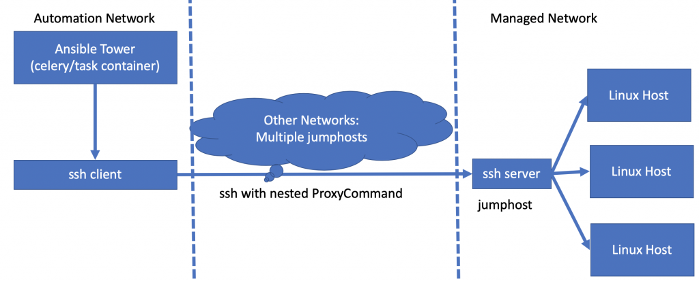

### Overview

Skill Level: Beginner

Ansible Tower usage, Linux, ssh

Part 1 covers connecting to Linux hosts with multiple jumphost hops. This is a 11-part series to show how to connect to endpoint hosts with cascading (multilevel/multihop/chaining/layered/stacking/intermediate) proxy/bastion/jumphosts using Ansible Tower.

### Ingredients

Ansible Tower/AWX

### Step-by-step

#### 1. Introduction

Often customer installations do not have direct connectivity to the endpoints in the customer premises. A jumphost serves as an entry point to systems behind a firewall or other restricted location. The ssh command has an easy way to make use of jumphosts to connect to a remote-host with a single command. Instead of first SSHing to the jumphost and then using ssh on the proxy to connect to the remote host, ssh can create the initial and next connection itself by using ProxyCommand. The ProxyJump, or the -J flag that was introduced in ssh version 7.3 provides a simplified way to use the ProxyCommand feature. This article will use the ProxyCommand to initially show the ssh command and then illustrate its use in Ansible and Ansible Tower starting with single jumphost followed by multiple jumphosts. This article will not take advantage of Isolated Nodes in Ansible Tower. Container Groups is covered in [Part 10](../multiple-jumphosts-in-ansible-tower-part-10/index.md "Multiple Jumphosts in Ansible Tower - Part 10").

ProxyCommand works by forwarding standard input (stdin) and standard output (stdout) from the remote host though the jumphosts. The ProxyCommand itself is a specific command used to connect to a jumphost. The %h:%p arguments to the -W flag specify to forward standard in and out to the remote host (%h) and the remote host's port (%p). Multiple ProxyCommands can be nested to allows multiple jumphosts. Each jumphost only requires outbound connectivity to the next jumphost (ssh port default 22) that it needs to hop to and the final jumphost needs connectivity to the target host endpoint (ssh port default 22).

Each jumphost layer adds extra overhead, since it ends up carrying SSH in SSH and so on. Note that each jump host, except for the outermost one, lists a ProxyCommand through the server immediately before it. Theoretically, there is no limit to the number of tunnels that can be chained together. However, every hop increases latency. The encrypted traffic is a bundle of all traffic. Decryption must take place between tunnel legs before the data can be rerouted for the next leg. This method is only applicable to TCP network traffic (not UDP).

#### 2. Single jumphost

We will start with a single jumphost (ec2-52-201-237-93.compute-1.amazonaws.com) and execute the command **echo Hello `hostname`** on the endpoint host (aakrhel001). The aakrhel001 is resolvable from the jumphost. We will advance with the following three steps to finally achieve the goal of configuring Ansible Tower to use jumphosts.

1.  ssh command
2.  Ansible playbook
3.  Ansible Tower/AWX job template and host variable configuration

**1\. Using the ssh command**

``ssh -v -i ~/amazontestkey.pem root@aakrhel001 -o StrictHostKeyChecking=no -o UserKnownHostsFile=/dev/null -o ProxyCommand="ssh -v -W %h:%p ec2-user@ec2-52-201-237-93.compute-1.amazonaws.com -i ~/amazontestkey.pem -o StrictHostKeyChecking=no -o UserKnownHostsFile=/dev/null" echo Hello \`hostname\` ``

**Output of ssh command:**

``Warning: Permanently added 'ec2-52-201-237-93.compute-1.amazonaws.com,52.201.237.93' (ECDSA) to the list of known hosts.``

``Warning: Permanently added 'aakrhel001' (ECDSA) to the list of known hosts.``

``Hello aakrhel001``

Note that you can replace %h:%p with aakrhel001:22. We use this %h:%p only once because it provides the information of the final endpoint host. In the command string, any occurrence of '%h' will be substituted by the host name to connect, '%p' by the port, and '%r' by the remote username.

**2\. Using Ansible**

We can test with ansible or ansible-playbook. The ansible_ssh_common_args parameter in Ansible provides the common extra args for all ssh CLI tools. This parameter is used to pass the nested ProxyCommand to connect via the jumphosts to the host endpoints. Since this is a common argument for sftp, scp and ssh, avoid using parameters specific to ssh. For example, do not set the -A parameter. The scp and sftp commands that Ansible tries when copying commands to execute to the host endpoint will fail with WARNING messages if this -A parameter is set.

`[WARNING]: sftp transfer mechanism failed on [aakrhel005.yellowykt.com]. Use ANSIBLE_DEBUG=1 to see detailed information`

`[WARNING]: scp transfer mechanism failed on [aakrhel005.yellowykt.com]. Use ANSIBLE_DEBUG=1 to see detailed information`

We can run a playbook that defines "hosts: all" on a single host by specifying "-i aakrhel001,". This works even if the target host endpoint is not defined in your inventory. In 2a, we will test with ansible command by directly calling the shell module. We will run the hello.yaml playbook in 2b and 2c on the endpoint host aakrhel001 via the jumphost ec2-52-201-237-93.compute-1.amazonaws.com with the following [hello.yaml](https://github.com/thinkahead/DeveloperRecipes/blob/master/Jumphosts/hello.yaml "hello.yaml") playbook:

``` yaml
---
- hosts: all
  gather_facts: no
  tasks:
    - shell: echo Hello `hostname`
      register: result
```

**2a. Running a command with ansible using extra-vars to pass the jumphost information**

**ansible** -u ec2-user -i "aakrhel001," aakrhel001 -m shell -a "echo Hello \\\`hostname\\\`" --private-key ~/amazontestkey.pem **-e** '{"ansible_ssh_common_args":"-o StrictHostKeyChecking=no -o UserKnownHostsFile=/dev/null -o ProxyCommand=\\"ssh -W %h:%p ec2-user\@ec2-52-201-237-93.compute-1.amazonaws.com -i ~/amazontestkey.pem -o StrictHostKeyChecking=no -o UserKnownHostsFile=/dev/null\\""}' -v

**Output:**

aakrhel001 | CHANGED | rc=0 >>

Hello aakrhel001

**2b. Ansible playbook using extra-vars to send ansible_ssh_common_args with ProxyCommand**

**ansible-playbook** -u root -i "aakrhel001," --private-key ~/amazontestkey.pem hello.yaml **-e** '{"ansible_ssh_common_args":"-o StrictHostKeyChecking=no -o UserKnownHostsFile=/dev/null -o ProxyCommand=\\"ssh -W %h:%p ec2-user\@ec2-52-201-237-93.compute-1.amazonaws.com -i ~/amazontestkey.pem -o StrictHostKeyChecking=no -o UserKnownHostsFile=/dev/null\\""}' -v

**2c. Ansible playbook using ssh-common-args to send ProxyCommand**

**ansible-playbook** -u root -i "aakrhel001," --private-key ~/amazontestkey.pem helloworld.yaml **--ssh-common-args**  "-o StrictHostKeyChecking=no -o UserKnownHostsFile=/dev/null -o ProxyCommand=\\"ssh -W %h:%p ec2-user\@ec2-52-201-237-93.compute-1.amazonaws.com -i ~/amazontestkey.pem -o StrictHostKeyChecking=no -o UserKnownHostsFile=/dev/null\\"" -v

Output of 2b and 2c from the above commands using ansible-playbook with ProxyCommand:

``TASK [shell]``

``******************************************************************************************************************************************``

``changed: [aakrhel001] => {"ansible_facts": {"discovered_interpreter_python": "/usr/bin/python"}, "changed": true, "cmd": "echo Hello `hostname`", "delta": "0:00:00.007759", "end": "2020-06-28 16:19:30.583210", "rc": 0, "start": "2020-06-28 16:19:30.575451", "stderr": "", "stderr_lines": [], "stdout": "Hello aakrhel001", "stdout_lines": ["Hello aakrhel001"]}``

``PLAY RECAP``

``********************************************************************************************************************************************``

``aakrhel001                 : ok=1    changed=1    unreachable=0    failed=0    skipped=0    rescued=0    ignored=0``

**3\. Ansible Tower**

Define the following ansible_ssh_common_args host variable or alternatively add the variable to a group that the host belongs to or add it as an inventory variable.

`ansible_ssh_common_args: '-o StrictHostKeyChecking=no -o UserKnownHostsFile=/dev/null -o ProxyCommand="ssh -W %h:%p -p {{ jh_ssh_port }} {{ jh_ssh_user }}@{{ jh_ip }} -i $JH_SSH_PRIVATE_KEY -o StrictHostKeyChecking=no -o UserKnownHostsFile=/dev/null"'`

This is shown below for the host aakrhel001.yellowykt.com

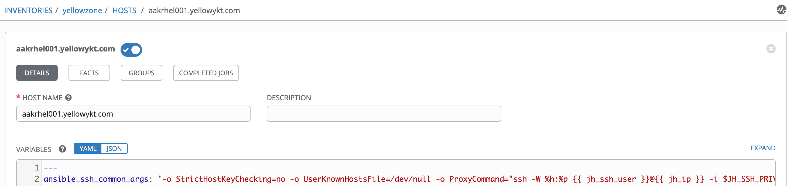

The {{ jh_ssh_user }} and {{ jh_ip }} will also be provided from a custom jumphost credential type passed to the job template. Note the JH_SSH_PRIVATE_KEY env variable. This will be a temporary file created from the private key contents entered into the jumphost credential type.

Under Administration -> Credential Types create a new **jumphost_credential_type** with:

**INPUT CONFIGURATION**
``` yaml
fields:
  - id: jh_ip
    type: string
    label: Jumphost IP Address
  - id: jh_ssh_user
    type: string
    label: Username to login with ssh in jumphost
  - id: jh_ssh_private_key
    type: string
    label: SSH Private Key for Jumphost
    format: ssh_private_key
    secret: true
    multiline: true
  - id: jh_ssh_private_key_passphrase
    type: string
    label: Optional Passphrase for SSH Private Key for Jumphost
    secret: true
  - id: jh_ssh_port
    type: string
    label: SSH port for Jumphost
  - id: jh_socks_port
    type: string
    label: Port on localhost to map with Jumphost port for socks5 proxy
required:
  - jh_ip
  - jh_ssh_user
  - jh_ssh_private_key
  - jh_ssh_port
  - jh_socks_port
```

**INJECTOR CONFIGURATION**
``` yaml
env:
  JH_SSH_PRIVATE_KEY: '{{tower.filename.jh_ssh_private_key}}'
  JH_SSH_PRIVATE_KEY_PASSPHRASE: '{{ jh_ssh_private_key_passphrase }}'
extra_vars:
  jh_ip: '{{ jh_ip }}'
  jh_socks_port: '{{ jh_socks_port }}'
  jh_ssh_port: '{{ jh_ssh_port }}'
  jh_ssh_user: '{{ jh_ssh_user }}'
file:
  template.jh_ssh_private_key: '{{ jh_ssh_private_key }}'
```

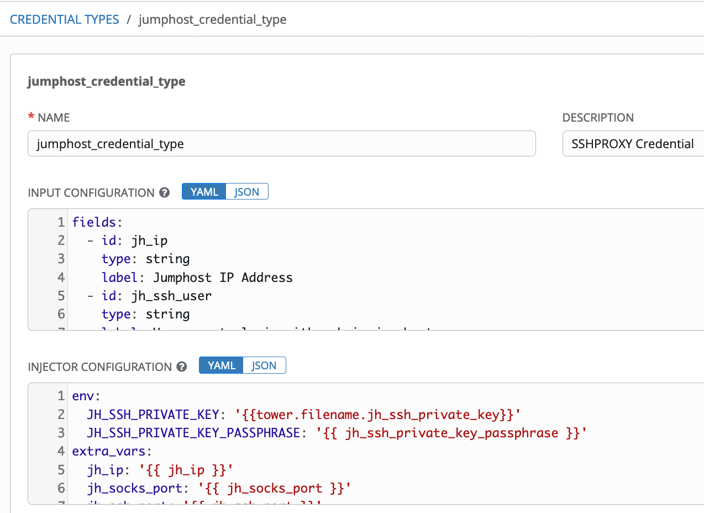

This input configuration specifies that this credential will have six fields: jh_ip, jh_ssh_user, jh_ssh_private_key, jh_ssh_private_key_passphrase, jh_ssh_port and jh_socks_port. Even though we define the jh_socks_port above, this will be not be used to connect to Linux host endpoints in Part 1 of this article. We will take advantage of it in the [Part 2](../multiple-jumphosts-in-ansible-tower-part-2/index.md "Multiple Jumphosts in Ansible Tower - Part 2") and [Part 3](../multiple-jumphosts-in-ansible-tower-part-3/index.md "Multiple Jumphosts in Ansible Tower - Part 3") of this series when we connect to Windows endpoints by creating a ssh tunnel on jh_socks_port between the ansible-tower-celery/task container (in podified install of Tower) and the first jumphost machine. Part 2 and Part 3 will also show how to use the tunnel for Linux endpoints. The ssh keys for jumphosts in this Part 1 do not have a passphrase, therefore the jh_ssh_private_key_passphrase was empty. [Part 3](../multiple-jumphosts-in-ansible-tower-part-3/index.md "Multiple Jumphosts in Ansible Tower - Part 3") (with tunnel to Windows and Linux hosts) and [Part 4](../multiple-jumphosts-in-ansible-tower-part-4/index.md "Multiple Jumphosts in Ansible Tower - Part 4") (without tunnel to Linux hosts) of this series will enable the passphrase for jumphosts.

The injector configuration specifies how the fields of this credential will be made available to the playbooks at runtime. The above configuration specifies that the four fields jh_ip, jh_socks_port, jh_ssh_port, jh_ssh_user will be available as extra variables. The fields JH_SSH_PRIVATE_KEY and JH_SSH_PRIVATE_KEY_PASSPHRASE will be exposed as environment variables at runtime.

Create a new credential with name "jumphost_credential" of credential type "jumphost_credential_type". Fill the fields with relevant values for the jumphost. Set the socks5 proxy port to 1235 (this is not used in Part 1).

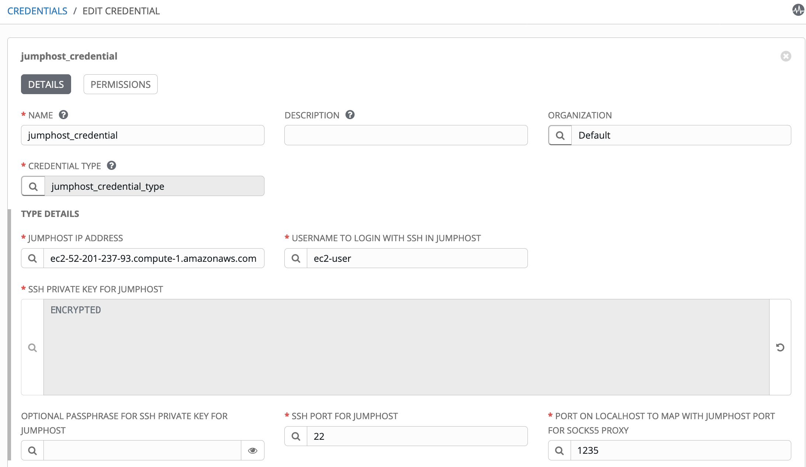

Create a machine credential for host endpoint called "yellowzone_linux_endpoint_credential" with USERNAME and PASSWORD or SSH PRIVATE KEY with optional PASSPHRASE.

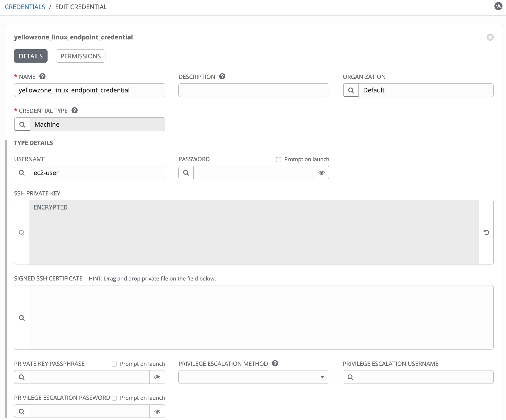

Create a project pointing to the github containing the [hello.yaml](https://github.com/thinkahead/DeveloperRecipes/blob/master/Jumphosts/hello.yaml "hello.yaml") playbook. You might need to create and attach an SCM credential.

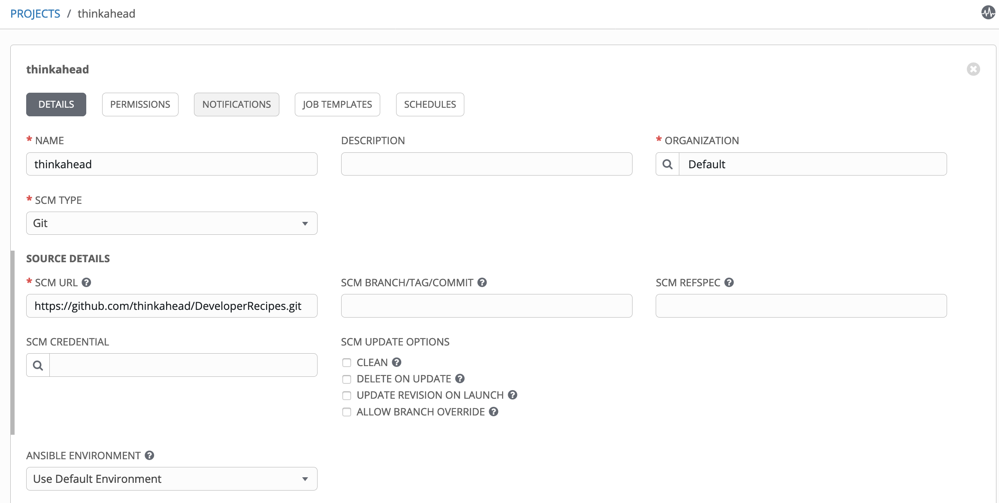

Create a job template with both the credentials: the machine credential yellowzone_linux_endpoint_credential and the jumphost_credential of the custom [jumphost_credential_type](https://github.com/thinkahead/DeveloperRecipes/blob/master/Jumphosts/Credentials.md "jumphost_credential_type") created previously.

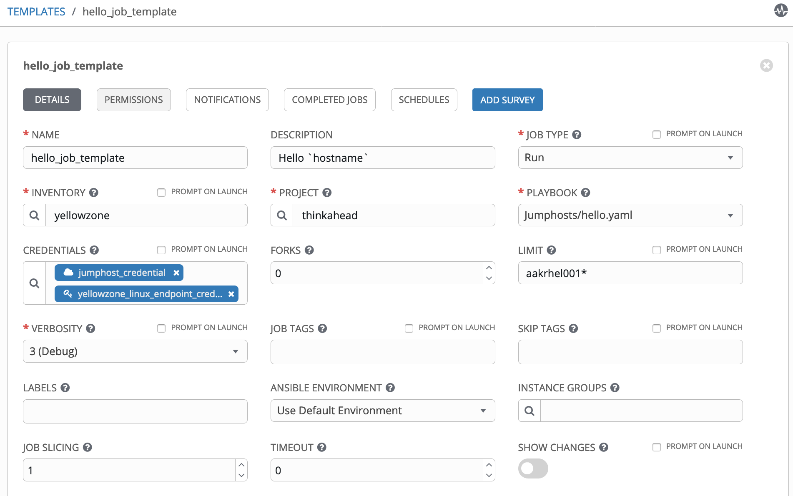

When you run the job, you see the echo Hello `hostname` command being invoked via the jumphost in the log output on Tower with Verbosity 3. The output shows a single ProxyCommand with the jumphost credential ec2-user\@ec2-52-201-237-93.compute-1.amazonaws.com and connecting to the host aakrhel001.yellowykt.com

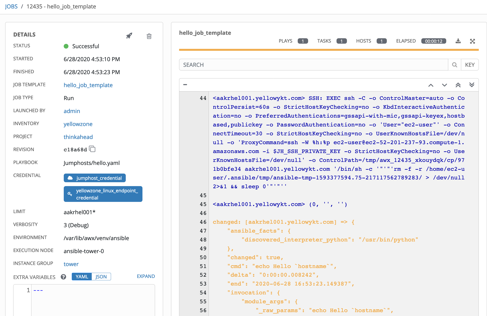

This section showed how to configure and use Tower to connect to target hosts using a single jumphost.

#### 3. Ssh commands for Multiple Jumphosts

As illustrated for single jumphost, we start with the ssh commands for multiple jumphosts. Shown below is the use of upto five jumphosts. Why five? That should be sufficient for most needs. It should be easy to extend this to additional jumphosts if desired. It shows how much bash escapes we need to add.

The following ssh commands use the same key ~/amazontestkey.pem for all hosts and jumphosts for illustration. You can easily replace with different ssh keys in commands below. If you use different keys, all keys must be on the original machine (called Laptop below) from which you are establishing the connection, the keys are not on the jumphosts/bastion hosts/intermediate hosts.

In this setup the ssh keys do not have a passphrase. If you create keys with passphrase, the ssh commands will prompt you for passphrase. You can create machine credentials in Ansible Tower with passphrase. The jumphost ssh keys in the jumphost credential types with passphrase will however not work with Ansible Tower in this introductory Part 1. Create ssh keys without passphrase. We will create roles to enable use of passphrase in [Part 3](../multiple-jumphosts-in-ansible-tower-part-3/index.md "Multiple Jumphosts in Ansible Tower - Part 3") and [Part 4](../multiple-jumphosts-in-ansible-tower-part-4/index.md "Multiple Jumphosts in Ansible Tower - Part 4").

**ssh command to jump across 2 jumphosts (in bold)**

Laptop-> **ec2-52-201-237-93.compute-1.amazonaws.com ->aakrhel001**->aakrhel002 -- You can replace %h:%p with aakrhel002.yellowykt.com:22

The Linux host endpoint is aakrhel002

``ssh -v -i ~/amazontestkey.pem -o ProxyCommand="ssh -v -i ~/amazontestkey.pem -W %h:%p ec2-user@aakrhel001.yellowykt.com -o ProxyCommand='ssh -v -i ~/amazontestkey.pem -W aakrhel001.yellowykt.com:22 ec2-user@ec2-52-201-237-93.compute-1.amazonaws.com'" ec2-user@aakrhel002.yellowykt.com echo Hello \`hostname\` ``

Output:

`Hello aakrhel002`

**ssh command to jump across 3 jumphosts (in bold)**

Laptop-> **ec2-52-201-237-93.compute-1.amazonaws.com ->aakrhel001->aakrhel002**->aakrhel003 -- You can replace %h:%p with aakrhel003.yellowykt.com:22

The endpoint this time is aakrhel003

``ssh -v -i ~/amazontestkey.pem -o ProxyCommand="ssh -v -i ~/amazontestkey.pem -W %h:%p ec2-user@aakrhel002.yellowykt.com -o ProxyCommand=\"ssh -v -i ~/amazontestkey.pem -W aakrhel002.yellowykt.com:22 ec2-user@aakrhel001.yellowykt.com -o ProxyCommand=\\\"ssh -v -i ~/amazontestkey.pem -W aakrhel001.yellowykt.com:22 ec2-user@ec2-52-201-237-93.compute-1.amazonaws.com\\\"\"" ec2-user@aakrhel003.yellowykt.com echo Hello \`hostname\` ``

Output:

`Hello aakrhel003`

**ssh command to jump across 4 jumphosts (in bold)**

Laptop-> **ec2-52-201-237-93.compute-1.amazonaws.com ->aakrhel001->aakrhel002->aakrhel003**->aakrhel005:2222 -- You can replace %h:%p with aakrhel005.yellowykt.com:2222

Note that the aakrhel005 host endpoint uses port 2222 (not the default port 22)

``ssh -v -i ~/amazontestkey.pem -oStrictHostKeyChecking=no -oUserKnownHostsFile=/dev/null -oProxyCommand="ssh -v -i ~/amazontestkey.pem -W %h:%p -oStrictHostKeyChecking=no -oUserKnownHostsFile=/dev/null -oProxyCommand=\"ssh -v -i ~/amazontestkey.pem -W aakrhel003.yellowykt.com:22 -oStrictHostKeyChecking=no -oUserKnownHostsFile=/dev/null -oProxyCommand=\\\"ssh -v -i ~/amazontestkey.pem -W aakrhel002.yellowykt.com:22 -oStrictHostKeyChecking=no -oUserKnownHostsFile=/dev/null -oProxyCommand=\\\\\\\"ssh -v -i ~/amazontestkey.pem -W aakrhel001.yellowykt.com:22 -oStrictHostKeyChecking=no -oUserKnownHostsFile=/dev/null ec2-user@ec2-52-201-237-93.compute-1.amazonaws.com\\\\\\\" ec2-user@aakrhel001.yellowykt.com\\\" ec2-user@aakrhel002.yellowykt.com\" ec2-user@aakrhel003.yellowykt.com" ec2-user@aakrhel005.yellowykt.com -p 2222 echo Hello \`hostname\` ``

Output:

`Hello aakrhel005`

**ssh command to jump across 5 jumphosts**

Laptop-> **ec2-52-201-237-93.compute-1.amazonaws.com ->aakrhel001->aakrhel002->aakrhel003->aakrhel005:2222**->aakrhel006

``ssh -v -i ~/amazontestkey.pem -oStrictHostKeyChecking=no -oUserKnownHostsFile=/dev/null -oProxyCommand="ssh -v -i ~/amazontestkey.pem -W %h:%p -oStrictHostKeyChecking=no -oUserKnownHostsFile=/dev/null -oProxyCommand=\"ssh -v -i ~/amazontestkey.pem -W aakrhel005.yellowykt.com:2222 -oStrictHostKeyChecking=no -oUserKnownHostsFile=/dev/null -oProxyCommand=\\\"ssh -v -i ~/amazontestkey.pem -W aakrhel003.yellowykt.com:22 -oStrictHostKeyChecking=no -oUserKnownHostsFile=/dev/null -oProxyCommand=\\\\\\\"ssh -v -i ~/amazontestkey.pem -W aakrhel002.yellowykt.com:22 -oStrictHostKeyChecking=no -oUserKnownHostsFile=/dev/null -oProxyCommand=\\\\\\\\\\\\\\\"ssh -v -i ~/amazontestkey.pem -W aakrhel001.yellowykt.com:22 -oStrictHostKeyChecking=no -oUserKnownHostsFile=/dev/null ec2-user@ec2-52-201-237-93.compute-1.amazonaws.com\\\\\\\\\\\\\\\" ec2-user@aakrhel001.yellowykt.com\\\\\\\" ec2-user@aakrhel002.yellowykt.com\\\" ec2-user@aakrhel003.yellowykt.com\" ec2-user@aakrhel005.yellowykt.com -p 2222" root@aakrhel006.yellowykt.com echo Hello \`hostname\` ``

Output:

`Hello aakrhel006`

#### 4. Configuring host variables

We start with the host variable "ansible_ssh_common_args" that is necessary to be added as variable. Alternatively, this variable could be added to group or inventory. Use this section as reference. We will use it later in Section 6. You should only add one of the ansible_ssh_common_args depending on how many jumphosts you have.

**Double Jumphost**

`ansible_ssh_common_args: '-oStrictHostKeyChecking=no -oUserKnownHostsFile=/dev/null -oProxyCommand="ssh -i $JH2_SSH_PRIVATE_KEY -W %h:%p -oStrictHostKeyChecking=no -oUserKnownHostsFile=/dev/null -oProxyCommand=\"ssh -i $JH1_SSH_PRIVATE_KEY -W {{ jh2_ip }}:{{ jh2_ssh_port }} -oStrictHostKeyChecking=no -oUserKnownHostsFile=/dev/null {{ jh1_ssh_user }}@{{ jh1_ip }}\" {{ jh2_ssh_user }}@{{ jh2_ip }}"'`

**Triple Jumphost**

`ansible_ssh_common_args: '-oStrictHostKeyChecking=no -oUserKnownHostsFile=/dev/null -oProxyCommand="ssh -i $JH3_SSH_PRIVATE_KEY -W %h:%p -oStrictHostKeyChecking=no -oUserKnownHostsFile=/dev/null -oProxyCommand=\"ssh -i $JH2_SSH_PRIVATE_KEY -W {{ jh3_ip }}:{{ jh3_ssh_port }} -oStrictHostKeyChecking=no -oUserKnownHostsFile=/dev/null -oProxyCommand=\\\"ssh -i $JH1_SSH_PRIVATE_KEY -W {{ jh2_ip }}:{{ jh2_ssh_port }} -oStrictHostKeyChecking=no -oUserKnownHostsFile=/dev/null {{ jh1_ssh_user }}@{{ jh1_ip }}\\\" {{ jh2_ssh_user }}@{{ jh2_ip }}\" {{ jh3_ssh_user }}@{{ jh3_ip }}"'`

**Quad Jumphost**

`ansible_ssh_common_args: '-oStrictHostKeyChecking=no -oUserKnownHostsFile=/dev/null -oProxyCommand="ssh -i $JH4_SSH_PRIVATE_KEY -W %h:%p -oStrictHostKeyChecking=no -oUserKnownHostsFile=/dev/null -oProxyCommand=\"ssh -i $JH3_SSH_PRIVATE_KEY -W {{ jh4_ip }}:{{ jh4_ssh_port }} -oStrictHostKeyChecking=no -oUserKnownHostsFile=/dev/null -oProxyCommand=\\\"ssh -i $JH2_SSH_PRIVATE_KEY -W {{ jh3_ip }}:{{ jh3_ssh_port }} -oStrictHostKeyChecking=no -oUserKnownHostsFile=/dev/null -oProxyCommand=\\\\\\\"ssh -i $JH1_SSH_PRIVATE_KEY -W {{ jh2_ip }}:{{ jh2_ssh_port }} -oStrictHostKeyChecking=no -oUserKnownHostsFile=/dev/null {{ jh1_ssh_user }}@{{ jh1_ip }}\\\\\\\" {{ jh2_ssh_user }}@{{ jh2_ip }}\\\" {{ jh3_ssh_user }}@{{ jh3_ip }}\" {{ jh4_ssh_user }}@{{ jh4_ip }}"'`

**Penta Jumphost**

`ansible_ssh_common_args: '-oStrictHostKeyChecking=no -oUserKnownHostsFile=/dev/null -oProxyCommand="ssh -i $JH5_SSH_PRIVATE_KEY -W %h:%p -oStrictHostKeyChecking=no -oUserKnownHostsFile=/dev/null -oProxyCommand=\"ssh -i $JH4_SSH_PRIVATE_KEY -W {{ jh5_ip }}:{{ jh5_ssh_port }} -oStrictHostKeyChecking=no -oUserKnownHostsFile=/dev/null -oProxyCommand=\\\"ssh -i $JH3_SSH_PRIVATE_KEY -W {{ jh4_ip }}:{{ jh4_ssh_port }} -oStrictHostKeyChecking=no -oUserKnownHostsFile=/dev/null -oProxyCommand=\\\\\\\"ssh -i $JH2_SSH_PRIVATE_KEY -W {{ jh3_ip }}:{{ jh3_ssh_port }} -oStrictHostKeyChecking=no -oUserKnownHostsFile=/dev/null -oProxyCommand=\\\\\\\\\\\\\\\"ssh -i $JH1_SSH_PRIVATE_KEY -W {{ jh2_ip }}:{{ jh2_ssh_port }} -oStrictHostKeyChecking=no -oUserKnownHostsFile=/dev/null {{ jh1_ssh_user }}@{{ jh1_ip }}\\\\\\\\\\\\\\\" {{ jh2_ssh_user }}@{{ jh2_ip }}\\\\\\\" {{ jh3_ssh_user }}@{{ jh3_ip }}\\\" {{ jh4_ssh_user }}@{{ jh4_ip }}\" {{ jh5_ssh_user }}@{{ jh5_ip }}"'`

#### 5. Custom Credential Types

Based on the number of jumphosts, you need to create corresponding credential types. You do not need to create all these credential types, only create the types required for your setup. The single jumphost credential type was already shown. All these definitions for jumphost2_credential_type, jumphost3_credential_type, jumphost4_credential_type, and jumphost5_credential_type are available at [Credentials](https://github.com/thinkahead/DeveloperRecipes/blob/master/Jumphosts/Credentials.md).

#### 6. Running a job with five jumphosts

The job "template hello_job_template_5" shows the same project and playbook as before. But this time we pass a new credential yellowzone_5jumphost_credential created from the above definition for 5 hops and the machine credential aakrhel005_ec2-user_machine_credential_passphrase (this machine credential has a passphrase). Ansible Tower handles this passphrase for machine credentials with pexpect and it works fine. The ssh process that ansible spawns may prompt for a password. Ansible Tower/AWX does not expose your passphrase/ssh decrypt password, instead will look for that prompt string and fill it in with the ssh passphrase using pexpect.

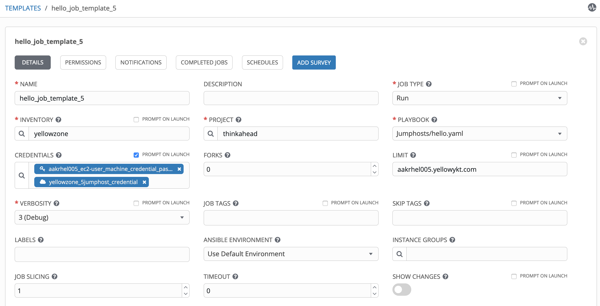

The hops are as follows with the jumphosts indicated in **bold**:

Ansible Tower -> **ec2-52-201-237-93.compute-1.amazonaws.com -> aakrhel001 -> aakrhel002 -> aakrhel003 -> aakrhel006** -> aakrhel005:2222

The host variables show the ansible_port is set to 2222 and the ansible_ssh_common_args set to use the nested ProxyCommands for 5 hops.

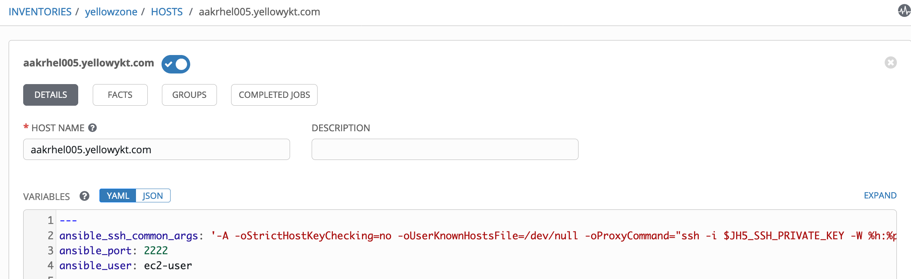

**Output in Ansible Tower for 5 jumphosts**

During the job run Tower copies the python file, changes the permission, executes it and finally deletes the temporary directory on the host endpoint aakrhel005. The debug verbose output also shows the ssh with the ProxyCommand expanded with the multiple hops.

``<aakrhel005.yellowykt.com> SSH: EXEC ssh -vvv -C -o ControlMaster=auto -o ControlPersist=60s -o StrictHostKeyChecking=no -o Port=2222 -o KbdInteractiveAuthentication=no -o PreferredAuthentications=gssapi-with-mic,gssapi-keyex,hostbased,publickey -o PasswordAuthentication=no -o 'User="ec2-user"' -o ConnectTimeout=30 -A -oStrictHostKeyChecking=no -oUserKnownHostsFile=/dev/null '-oProxyCommand=ssh -i $JH5_SSH_PRIVATE_KEY -W %h:%p -oStrictHostKeyChecking=no -oUserKnownHostsFile=/dev/null -oProxyCommand="ssh -i $JH4_SSH_PRIVATE_KEY -W aakrhel006.yellowykt.com:22 -oStrictHostKeyChecking=no -oUserKnownHostsFile=/dev/null -oProxyCommand=\"ssh -i $JH3_SSH_PRIVATE_KEY -W aakrhel003.yellowykt.com:22 -oStrictHostKeyChecking=no -oUserKnownHostsFile=/dev/null -oProxyCommand=\\\"ssh -i $JH2_SSH_PRIVATE_KEY -W aakrhel002.yellowykt.com:22 -oStrictHostKeyChecking=no -oUserKnownHostsFile=/dev/null -oProxyCommand=\\\\\\\"ssh -i $JH1_SSH_PRIVATE_KEY -W aakrhel001.yellowykt.com:22 -oStrictHostKeyChecking=no -oUserKnownHostsFile=/dev/null ec2-user@ec2-52-201-237-93.compute-1.amazonaws.com\\\\\\\" ec2-user@aakrhel001.yellowykt.com\\\" ec2-user@aakrhel002.yellowykt.com\" ec2-user@aakrhel003.yellowykt.com" ec2-user@aakrhel006.yellowykt.com' -o ControlPath=/tmp/awx_12440_my41o5b3/cp/d827065ef7 -tt aakrhel005.yellowykt.com '/bin/sh -c '"'"'/usr/bin/python /home/ec2-user/.ansible/tmp/ansible-tmp-1593386690.57-252807690922400/AnsiballZ_command.py && sleep 0'"'"''``

``<aakrhel005.yellowykt.com> (0, '\r\n{"changed": true, "end": "2020-06-28 19:25:03.064774", "stdout": "Hello aakrhel005", "cmd": "echo Hello `hostname`", "rc": 0, "start": "2020-06-28 19:25:03.061034", "stderr": "", "delta": "0:00:00.003740", "invocation": {"module_args": {"creates": null, "executable": null, "_uses_shell": true, "strip_empty_ends": true, "_raw_params": "echo Hello `hostname`", "removes": null, "argv": null, "warn": true, "chdir": null, "stdin_add_newline": true, "stdin": null}}}\r\n', 'OpenSSH_7.4p1, OpenSSL 1.0.2k-fips 26 Jan 2017\r\ndebug1: auto-mux: Trying existing master\r\ndebug2: fd 3 setting O_NONBLOCK\r\ndebug2: mux_client_hello_exchange: master version 4\r\ndebug3: mux_client_forwards: request forwardings: 0 local, 0 remote\r\ndebug3: mux_client_request_session: entering\r\ndebug3: mux_client_request_alive: entering\r\ndebug3: mux_client_request_alive: done pid = 28\r\ndebug3: mux_client_request_session: session request sent\r\ndebug1: mux_client_request_session: master session id: 2\r\ndebug3: mux_client_read_packet: read header failed: Broken pipe\r\ndebug2: Received exit status from master 0\r\nShared connection to aakrhel005.yellowykt.com closed.\r\n')``

`` <aakrhel005.yellowykt.com> ESTABLISH SSH CONNECTION FOR USER: ec2-user``

`` <aakrhel005.yellowykt.com> SSH: EXEC ssh -vvv -C -o ControlMaster=auto -o ControlPersist=60s -o StrictHostKeyChecking=no -o Port=2222 -o KbdInteractiveAuthentication=no -o PreferredAuthentications=gssapi-with-mic,gssapi-keyex,hostbased,publickey -o PasswordAuthentication=no -o 'User="ec2-user"' -o ConnectTimeout=30 -A -oStrictHostKeyChecking=no -oUserKnownHostsFile=/dev/null '-oProxyCommand=ssh -i $JH5_SSH_PRIVATE_KEY -W %h:%p -oStrictHostKeyChecking=no -oUserKnownHostsFile=/dev/null -oProxyCommand="ssh -i $JH4_SSH_PRIVATE_KEY -W aakrhel006.yellowykt.com:22 -oStrictHostKeyChecking=no -oUserKnownHostsFile=/dev/null -oProxyCommand=\"ssh -i $JH3_SSH_PRIVATE_KEY -W aakrhel003.yellowykt.com:22 -oStrictHostKeyChecking=no -oUserKnownHostsFile=/dev/null -oProxyCommand=\\\"ssh -i $JH2_SSH_PRIVATE_KEY -W aakrhel002.yellowykt.com:22 -oStrictHostKeyChecking=no -oUserKnownHostsFile=/dev/null -oProxyCommand=\\\\\\\"ssh -i $JH1_SSH_PRIVATE_KEY -W aakrhel001.yellowykt.com:22 -oStrictHostKeyChecking=no -oUserKnownHostsFile=/dev/null ec2-user@ec2-52-201-237-93.compute-1.amazonaws.com\\\\\\\" ec2-user@aakrhel001.yellowykt.com\\\" ec2-user@aakrhel002.yellowykt.com\" ec2-user@aakrhel003.yellowykt.com" ec2-user@aakrhel006.yellowykt.com' -o ControlPath=/tmp/awx_12440_my41o5b3/cp/d827065ef7 aakrhel005.yellowykt.com '/bin/sh -c '"'"'rm -f -r /home/ec2-user/.ansible/tmp/ansible-tmp-1593386690.57-252807690922400/ > /dev/null 2>&1 && sleep 0'"'"''``

The screenshot from the job run shows the "stdout": "Hello aakrhel005"

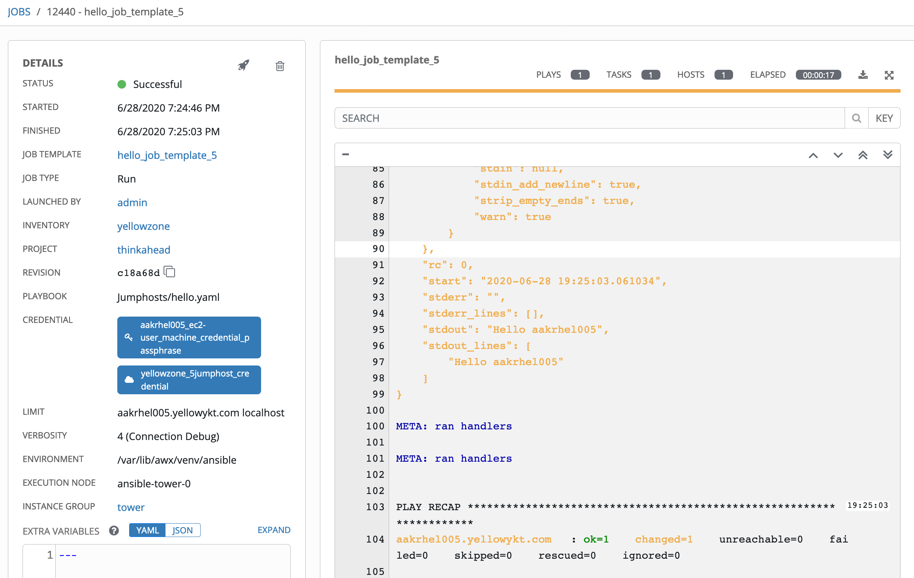

The credential types we have used till now created a "path" or a "chain" consisting of ssh credentials for all jumphost hops that are required to reach the host endpoint from Ansible Tower. With this approach, only one custom credential with required number of hops in the path needs to be passed to the job. We will use this approach for the rest of the parts in this series.

Another approach for creating credential types is to separate the individual ssh credentials in the path and pass each credential separately to the job. This approach requires passing as many credentials as there are hops to the job template. This is shown in [Separate Credential Types](https://github.com/thinkahead/DeveloperRecipes/blob/master/Jumphosts/SeparateCredentials.md "Separate Credential Types"). This latter approach that will be used in [Part 4](../multiple-jumphosts-in-ansible-tower-part-4/index.md "Multiple Jumphosts in Ansible Tower - Part 4") has the advantage that different users can create their separate jumphost ssh credentials for each hop. The disadvantage is that there are a lot of credentials to be attached to the template. Managing a lot of credentials can get difficult. Proper naming conventions should be followed.

#### 7. Executing commands on jumphosts instead of host endpoints

On multiple occasions, we need to execute commands on the jumphost. This [run_on_jumphost.yaml](https://github.com/thinkahead/DeveloperRecipes/blob/master/Jumphosts/run_on_jumphost.yaml "run_on_jumphost.yaml") shows how to use the jumphost credentials to run commands (For example, hostname) on jumphost using the jumphost credentials in two ways:

1.  login to the jumphost using the shell command from localhost
2.  delegate_to jumphost when running a play on target host

**run_on_jumphost.yaml**

``` yaml
---
- hosts: localhost
  gather_facts: no
  tasks:
    # Check the jumphost credentials
    - set_fact:
        jh_ssh_private_key: "{{ lookup('env','JH_SSH_PRIVATE_KEY') }}"
    - debug:
        msg: "{{ jh_ssh_user }} {{ jh_ssh_private_key }}"
    - debug:
        msg: "{{ hostvars['127.0.0.1']['jh_ssh_user'] }} {{ hostvars['127.0.0.1']['jh_ssh_private_key'] }}"
    - name: Run the hostname command on Jumphost
      shell:
        ssh -o StrictHostKeyChecking=no -o UserKnownHostsFile=/dev/null -i {{ hostvars['127.0.0.1']['jh_ssh_private_key'] }} {{ jh_ssh_user }}@{{ jh_ip }} hostname

- hosts: all
  gather_facts: no
  tasks:
    # Run the hostname command on endpoint
    - name: Check hostname of endpoint - This will use the endpoint credential
      command: hostname
    # Run the hostname command on delegated host
    - name: Check hostname of delegated host - This will use the jumphost_endpoint defined in same inventory as the endpoint
      command: hostname
      delegate_to: "{{  hostvars['127.0.0.1']['jh_ip'] }}"
      #delegate_to: jumphost_endpoint
      vars:
        ansible_user: "{{ hostvars['127.0.0.1']['jh_ssh_user'] }}"
        ansible_ssh_private_key_file: "{{ hostvars['127.0.0.1']['jh_ssh_private_key'] }}"
        ansible_ssh_extra_args: "-o StrictHostKeyChecking=no -o UserKnownHostsFile=/dev/null"
        ansible_ssh_host_key_checking: no
```

The jumphost credential and the machine endpoint credential passed can be seen in the job template. The job template shows the LIMIT with the target host endpoint aakrhel001* and the localhost. We need to explicitly pass localhost since this playbook has a play that runs on localhost. [Multiple patterns](https://docs.ansible.com/ansible/latest/user_guide/intro_patterns.html "Multiple patterns") can be separated by colons (":"). The comma and space characters also work as separator. When we use the "delegate_to" to delegate to the jh_ip, we need to explicitly set the ansible_user and the ansible_ssh_private_key_file values to that of the jumphost.

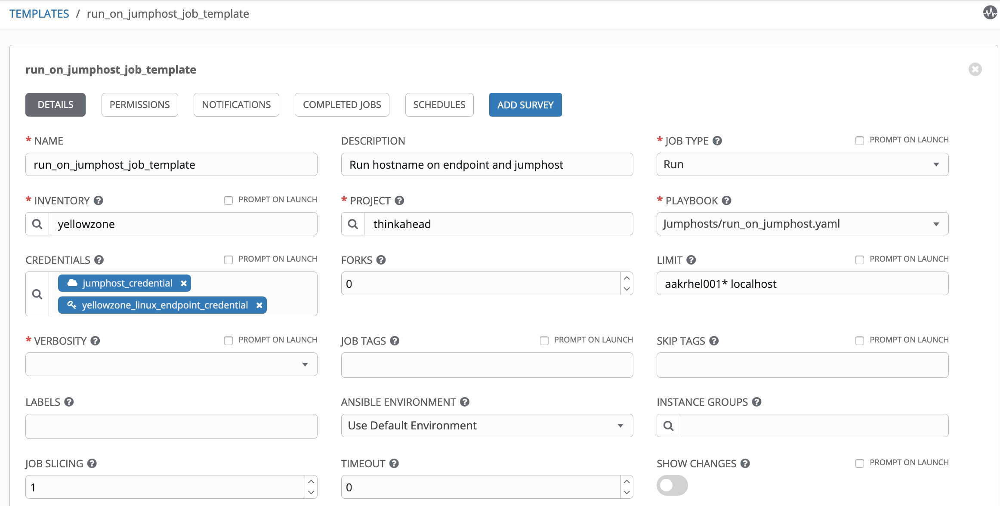

The output from the job run shows the hostname of the jumphost.

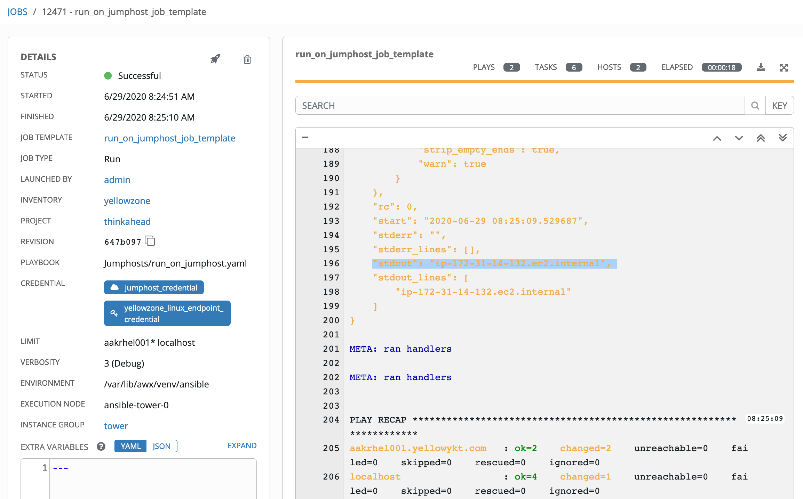

**Note about delegate_to** -- You may need to use the "become: no" on plays where you use the "delegate_to: localhost" or "delegate_to: jumphost_endpoint" because the user may not necessarily have sudo access.

#### 8. Tips for securing your setup

-   The ENABLE JOB ISOLATION (bubblewrap feature) should be enabled in the Tower Job Settings to prevent other processes from using temporary files created when running the jobs.
-   Do not expose any directories where you may store temporary files when running jobs in PATHS TO EXPOSE TO ISOLATED JOBS.
-   The nolog: true should be set on tasks to prevent exposure of jumphost credentials.
-   The from option should be used in the authorized_keys/authorized_keys2 on jumphosts. It specifies a source restriction restricting the set of IP addresses or host names from which the reverse-mapped DNS names from which the key can be used. The patterns may use * as wildcard, and may specify IP addresses using * or in CIDR address/masklen notation. Only hosts whose IP address or DNS name matches one of the patterns are allowed to use the key. More than one pattern may be specified by separating them by commas. An exclamation mark ! can be used in front of a pattern to negate it.
-   StrictHostKeyChecking -- The ssh_config keyword StrictHostKeyChecking can be used to control logins to machines whose host key is not known or has changed. The default value is "ask". In host key checking, ssh automatically maintains and checks a database containing identification for all hosts it has ever been used with. Host keys are stored in ~/.ssh/known_hosts in the user's home directory. We set it to "no" with UserKnownHostsFile=/dev/null to avoid writing the new host keys to the user known hosts file. Setting to "yes", ssh will never automatically add host keys to the ~/.ssh/known_hosts file and will refuse to connect to a host whose host key has changed. This forces the manual addition of all new hosts. The "yes" setting provides maximum protection against trojan horse attacks, but can be troublesome when the /etc/ssh/ssh_known_hosts file is poorly maintained or connections to new hosts are frequently made. If a host's identification changes, ssh warns about this and disables password authentication to prevent server spoofing or man-in-the-middle attacks, which could otherwise be used to circumvent the encryption.
-   You may need to add the EXTRA ENVIRONMENT VARIABLES in the Job Settings: "ANSIBLE_TIMEOUT": "30" if the hops to the jumphost/target take more than 10 seconds. Also define the "http_proxy", "https_proxy" and "no_proxy" for your setup. Add the "ANSIBLE_TRANSFORM_INVALID_GROUP_CHARS": "ignore" if you use ":", "-" or other non-alphanumeric characters to group names to prevent warning messages from showing up in the logs.
-   You may need to open the jumphost firewall to allow inbound access from Ansible Tower. This address is often a proxy address. If you have ssh/exec access to Tower, you can find this address by running curl "ifconfig.me". Alternatively, you can use the RUN COMMAND on the host -- [ad-hock command](https://docs.ansible.com/ansible/latest/user_guide/intro_adhoc.html "ad-hock command")  to run the shell module from Ansible Tower with "curl ifconfig.me" on Demo Inventory with limit localhost and Demo Credential to find the ip address.
-   Ansible Tower does not require direct connectivity to the endpoints or jumphosts down the chain. Ansible Tower only requires direct connectivity to the first jumphost. Each jumphost only requires connectivity to next jumphost and the final jumphost has connectivity to the target host endpoints. In your test setup, if you have such connectivity, you can simply add the hostnames of the hosts you want to block connectivity to in /etc/hosts with non-exiting ip address on your network. Alternatively, you can block ip addresses using iptables, for example: "iptables -A INPUT -s IP_ADDRESS -p tcp --destination-port 22 -j DROP" where IP-ADDRESS with the actual IP address you want to block.
-   If you get the error "open failed: administratively prohibited" when using ProxyCommand, it could mean that your target endpoint is down or you pasted the text with bad "-" character (when pasting from HTML — \&ndash;). BOM, Zero Width No-Break Space can cause problems when you cut and paste text from HTML pages. For example when creating credential types in Tower, you may need to remove those characters from the yaml with ":nobomb in vim" or other mechanisms before pasting into Ansible Tower.

#### 9. Login to endpoint twice to reach it

Another requirement came up with an environment which uses 1 hop jumphost from Ansible Tower to connect to the endpoint hostname. However, the environment requires login to the endpoint twice to reach it. The first ssh to endpoint hostname (through dns resolution) lands us on to a temporary landing server (instead of hostname) and then we need do another ssh to the hostname. Both the landing server and endpoint use the same hostname, user name, and public key to actually reach the target host. We do not want to repeat the credentails of hostname by adding them to the jumphost credential (or creating a 2 hop jumphost credential). This was fixed using the following ansible_ssh_common_args.

`ansible_ssh_common_args: '-o StrictHostKeyChecking=no -o UserKnownHostsFile=/dev/null -o ProxyCommand="ssh -v -W %h:%p %r@%h -o Port=%p -o StrictHostKeyChecking=no -o UserKnownHostsFile=/dev/null -o ProxyCommand=\"ssh -i $JH_SSH_PRIVATE_KEY -oStrictHostKeyChecking=no -oUserKnownHostsFile=/dev/null -o Port={{ jh_ssh_port }} -W %h:%p {{ jh_ssh_user }}@{{ jh_ip }}\""'`

The innermost ProxyCommand is for the jumphost. It uses the jumphost credentials from the custom credential type. The outer ProxyCommand is the jump from the landing server. In the outer ProxyCommand, any occurrence of '%h' will be substituted by the endpoint hostname to connect, '%p' by the endpoint port, and '%r' by the endpoint user name that reaches the landing server. The endpoint hostname and the landing server both use the same hostname and use the Machine credential that gets added using ssh-add by Ansible Tower to the ssh-agent.

#### 10. Conclusion

Part 1 of this article showed how to run commands on target host linux endpoints via multiple jumphost hops in Ansible Tower with the use of new credential types. This also showed how to run commands on the jumphost using the credentials defined using custom credential types.

[Part 2](../multiple-jumphosts-in-ansible-tower-part-2/index.md "Multiple Jumphosts in Ansible Tower - Part 2") will illustrate a role to create a SOCKS5 tunnel over multiple jumphost hops and further a playbook that will using the role to connect to the Linux and Windows endpoint hosts. Part 2 will still use jumphost ssh keys without passphrase.

#### 11. References

- Multiple Jumphosts in Ansible Tower GitHub link <https://github.com/thinkahead/DeveloperRecipes/tree/master/Jumphosts>
- HTML Character Usage Byte-order mark (U+FEFF) <https://www.w3.org/html/wg/wiki/HTMLCharacterUsage>
- Multiple Jumphosts in Ansible Tower -- Part 2: Connecting to Windows/Linux hosts with ssh tunnel SOCKS5 proxy <https://developer.ibm.com/recipes/tutorials/multiple-jumphosts-in-ansible-tower-part-2>
- Multiple Jumphosts in Ansible Tower -- Part 3: Ssh tunnel SOCKS5 proxy with passphrase enabled for ssh keys <https://developer.ibm.com/recipes/tutorials/multiple-jumphosts-in-ansible-tower-part-3>
- Multiple Jumphosts in Ansible Tower -- Part 4: Multi jumphost connections to Linux hosts using ssh-add to add keys to ssh-agent <https://developer.ibm.com/recipes/tutorials/multiple-jumphosts-in-ansible-tower-part-4/>
- Multiple Jumphosts in Ansible Tower -- Part 5: Unix domain socket file instead of socks port <https://developer.ibm.com/recipes/tutorials/multiple-jumphosts-in-ansible-tower-part-5/>
- Multiple Jumphosts in Ansible Tower -- Part 6: Primary and Secondary/Backup Jumphosts and Reverse ssh Tunnel <https://developer.ibm.com/recipes/tutorials/multiple-jumphosts-in-ansible-tower-part-6/>
- Multiple Jumphosts in Ansible Tower -- Part 7: Failover using redundant jumphosts, tweaking ssh parameters and memory requirements for jumphosts <https://developer.ibm.com/recipes/tutorials/multiple-jumphosts-in-ansible-tower-part-7/>
- Multiple Jumphosts in Ansible Tower -- Part 8: Transferring files using ansible synchronize module and rsync <https://developer.ibm.com/recipes/tutorials/multiple-jumphosts-in-ansible-tower-part-8/>
- Multiple Jumphosts in Ansible Tower -- Part 9: Pull secrets from remote 3rd-party vaults over multiple jumphost hops <https://developer.ibm.com/recipes/tutorials/multiple-jumphosts-in-ansible-tower-part-9/>
- Multiple Jumphosts in Ansible Tower -- Part 10: Using Container Groups instead of bubblewrap for isolation of jobs <https://developer.ibm.com/recipes/tutorials/multiple-jumphosts-in-ansible-tower-part-10/>
- Multiple Jumphosts in Ansible Tower -- Part 11: Using Container Groups with sshuttle proxy <https://developer.ibm.com/recipes/tutorials/multiple-jumphosts-in-ansible-tower-part-11/>
