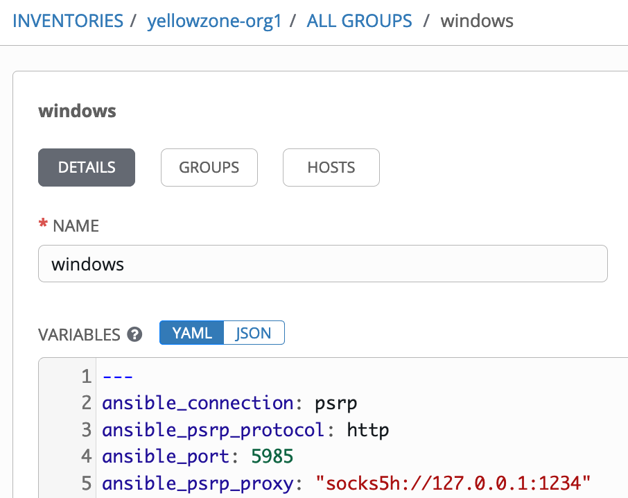
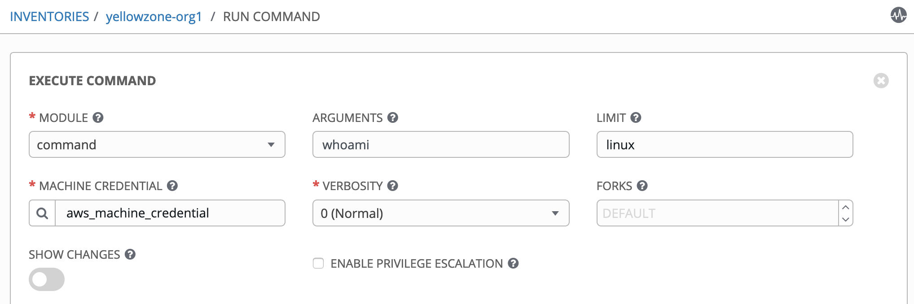

# Multiple Jumphosts in Ansible Tower - Part 10
## Using Container Groups instead of bubblewrap for isolation of jobs

[Alexei.Karve](https://developer.ibm.com/recipes/author/karve/)

Tags: Cloud computing, DevOps, Linux

Published on August 19, 2020 / Updated on September 1, 2020

### Overview

Skill Level: Advanced

Hands on experience with Ansible Tower/AWX

In previous parts we modified the playbooks to establish a tunnel or add the ssh keys to the ssh-agent. In this part, we will use customized ansible-runner images with Container Groups. Playbooks do not need to be modified to reach host endpoints.

### Ingredients

Ansible Tower/AWX, ansible runner

### Step-by-step

#### 1. Introduction

The previous parts -- Part 1 through Part 9 all required including a wrapper role/task/pre_task to either establish a tunnel or add ssh keys to an ssh-agent. The plays that came later in the playbook, were able to use the configuration with the ansible_ssh_common_args customized with nested ProxyCommand and custom credential types. This was all good when there were few playbooks and we had control to modify the playbooks executed by the jobs. However, this modification of playbooks to include this extra wrapper step can get tedious. We previously used Unix Socket files and took advantage of bubblewrap for job isolation.

We need another wrapper mechanism that can provide job isolation and also that can be reused across playbooks to add the ssh keys to the ssh-agent and/or create the tunnel. We can take advantage of [Execution Environments](https://docs.ansible.com/ansible-tower/latest/html/administration/external_execution_envs.html#execution-environments "Execution Environments"), specifically the [Container Groups](https://docs.ansible.com/ansible-tower/latest/html/administration/external_execution_envs.html#ag-container-groups "Container Groups") that were introduced in Ansible Tower 3.6. Container groups act as a pool of resources within a virtual environment that are provisioned on-demand as a pod that exists only for the duration of the playbook run. A Container Group has an associated credential that allows for connecting to an OpenShift or Kubernetes cluster.

Although the mechanisms we have used previously with custom credential types and wrapper roles still work fine when you run the jobs with the Container Groups, in this Part 10, we will use customized images for the [ansible-runner](https://github.com/ansible/ansible-runner "ansible-runner") that preestablish the tunnel across multiple jumphost hops. We will not need to use the modified playbooks with additional play with roles for establishing the tunnel or adding the ssh keys to ssh-agent. The original playbook can be used directly with the Machine credential, we will not pass any custom jumphost credentials. The customized image for each organization or job template contains all the information required to retrieve credentials and establish the tunnel. Tower provides a simple default pod specification. We use a a custom YAML document that overrides the default Pod spec. To use the tunnel, the host/group/inventory variables need to be set to use the correct ansible_ssh_common_args as was done in previous parts. The customized images can be used with Openshift RBAC and service tokens to ensure that users of one organization are unable to use the images in another organization.

We start by looking at how to test using the ansible runner as a container from your Laptop and then move on to configuring and using Container Groups in Ansible Tower.

#### 2. Using the ansible-runner

[Ansible Runner](https://ansible-runner.readthedocs.io/en/latest/ "Ansible Runner") represents the modularization of the part of Ansible Tower/AWX that is responsible for running ansible and ansible-playbook tasks and gathers the output from it.  It has a system for storing the output (stdout) and artifacts (host-level event data, fact data, etc) of the playbook run. There are 3 primary ways of interacting with Runner

1.  A standalone command line tool (ansible-runner) that can be started in the foreground or run in the background asynchronously from the shell
2.  A reference container image that can be used as a base for your own images and will work as a standalone container or running in Openshift or Kubernetes
3.  A python module -- library interface

We will be using the reference container image to build our own image. Most of the parameterization of the Ansible command line is also available on the Runner command line but Runner also can rely on an input interface that is mapped onto a [directory structure](https://ansible-runner.readthedocs.io/en/latest/intro.html#runner-input-directory-hierarchy "directory structure") where you put your environment variables, your ssh_keys and information of that kind in the env folder, inside the project you put the playbook, etc.

We illustrate this with an [example](https://github.com/thinkahead/DeveloperRecipes/tree/master/Jumphosts/ansible-runner-test "ansible-runner-test"). There is an ansible-runner-test directory in github with the files required to use the ansible-runner. We create a new image oc_tower_cg:1.4.4 using the following [build.sh](https://github.com/thinkahead/DeveloperRecipes/blob/master/Jumphosts/ansible-runner-test/build.sh "build.sh") and the [Dockerfile](https://github.com/thinkahead/DeveloperRecipes/blob/master/Jumphosts/ansible-runner-test/Dockerfile "Dockerfile"):

**build.sh**

`docker build -t registry.me:5000/default/oc_tower_cg:1.4.4`

**Dockerfile**

``` yaml
FROM quay.io/ansible-tower/ansible-runner:1.4.4

RUN yum -y update

# Add Centos repo for doing yum install
RUN printf '[base]\nname=CentOS-\$releasever - Base\nbaseurl=http://mirror.centos.org/centos/7.8.2003/os/\$basearch/\nenabled=1\ngpgcheck=0\npriority=1\n' > /etc/yum.repos.d/centos.repo

# Run yum install commands
RUN yum -y install https://dl.fedoraproject.org/pub/epel/epel-release-latest-7.noarch.rpm
RUN yum -y install expect connect-proxy nc autossh net-tools curl iputils socat hostname
RUN yum -y install gcc python36 python36-devel git python-pip

RUN rm -rf /var/lib/awx/venv/ansible;mkdir -p /var/lib/awx/venv/ansible
RUN virtualenv -p python3 /var/lib/awx/venv/ansible

# Configure the ansible_test venv
RUN umask 0022
RUN . /var/lib/awx/venv/ansible/bin/activate; pip install --upgrade pip;pip install --upgrade setuptools;pip install python-memcached psutil ansible pypsrp pywinrm pywinrm[credssp] requests-credssp;pip install git+https://github.com/nitzmahone/PySocks.git@hack_unix_domain_socket_file_support git+https://github.com/nitzmahone/urllib3.git@hack_unix_domain_socket_file_support requests==2.22.0 idna==2.8; deactivate
```

Although we no longer need to use the Unix Domain Socket file for isolation of jobs, we install the same python modules as when we customized the Tower image for consistency. We will show the connection being established first with the Socks Port and next with the Socket file.

**Socket Port**

The [keys directory](https://github.com/thinkahead/DeveloperRecipes/tree/master/Jumphosts/ansible-runner-test/keys "keys directory") contains the following files: runme.sh, login_with_expect.sh, jumphostlogin.sh and the ssh private keys required to connect to jumphosts. We have explained these scripts in previous parts and will reuse them here. The [runme.sh](https://github.com/thinkahead/DeveloperRecipes/blob/master/Jumphosts/ansible-runner-test/keys/runme.sh "runme.sh") will be used to establish the tunnel across multiple jumphost hops from the container using the socks port setting socks5h://127.0.0.1:1234. The current setting for runme.sh is set to [use single jumphost jh1](https://github.com/thinkahead/DeveloperRecipes/blob/master/Jumphosts/ansible-runner-test/keys/runme.sh#L36-L40 "use single jumphost jh1") (ec2-52-201-237-93.compute-1.amazonaws.com). Remember to save the private keys elsewhere in another directory, they will get deleted when we execute the runme.sh with docker volume mount.

`export jh1_ssh_private_key=/root/keys/alexei-key-ecdsa-jumphost`\
`export jh1_ssh_private_key_passphrase=Passphrase4ec2`\
`export jh1_ip=ec2-52-201-237-93.compute-1.amazonaws.com`\
`export jh1_ssh_port=22`\
`export jh1_ssh_user=ec2-user`

The rest of the jumphosts are [set to empty](https://github.com/thinkahead/DeveloperRecipes/blob/master/Jumphosts/ansible-runner-test/keys/runme.sh#L6-L34 "set to empty") with the ssh_private_key having "uninitialized_" to have unique values for the expect script. You can update the values to use additional jumphosts and set the correct passphrase for the keys.

The inventory/hosts file contains the two VMs that we will connect to. Change the ansible_password below to the correct value.

`[windows]`\
`aakwin2016-1.yellowykt.com`\
`aakwin2012-1.yellowykt.com`

`[windows:vars]`\
`ansible_connection=psrp`\
`ansible_psrp_protocol=http`\
`ansible_port=5985`\
`ansible_psrp_proxy="socks5h://127.0.0.1:1234"`\
`ansible_user=Administrator`\
`ansible_password=ReplaceThePassword`

The playbook that we will run on the target hosts is the [windowstest.yaml](https://github.com/thinkahead/DeveloperRecipes/blob/master/Jumphosts/ansible-runner-test/windowstest.yaml "windowstest.yaml")

**windowstest.yaml**

``` yaml
- hosts: all
  gather_facts: no
  tasks:
    - name: Do Ping
      win_ping:
      register: ping_output
      ignore_unreachable: true

    - debug:
        var: ping_output

    - win_shell: set
      args:
        executable: cmd
      register: homedir_out

    # Works on Windows 2016 and 2008 only if someone is logged in using that Userid
    #- win_shell: echo '%HOMEDRIVE%%HOMEPATH%'
    - win_shell: echo %SystemRoot% %USERPROFILE%
      args:
        executable: cmd
      register: homedir_out
    - debug:
        var: homedir_out

    - name: get powershell version
      raw: $PSVersionTable

    - name: Copying files to all Windows Endpoints
      win_copy:
        content: abc123
        #src : "windowstest.yaml"
        dest: C:\Temp\foo.txt
```

The [run.sh](https://github.com/thinkahead/DeveloperRecipes/blob/master/Jumphosts/ansible-runner-test/run.sh "run.sh") contains the docker command to run the ansible runner.

**run.sh**

`docker run --rm -v ${PWD}:/runner -v ${PWD}/keys:/root/keys -e RUNNER_PLAYBOOK=windowstest.yaml -it registry.me:5000/default/oc_tower_cg:1.4.4 bash -c "/root/keys/runme.sh;. /var/lib/awx/venv/ansible/bin/activate;ansible-runner run /runner"`

The first volume mounted is ansible-runner-test directory on /runner within the container that contains the playbook [windowstest.yaml](https://github.com/thinkahead/DeveloperRecipes/blob/master/Jumphosts/ansible-runner-test/windowstest.yaml "windowstest.yaml"). It also contains the directory inventory with a hosts file. The second volume is the keys directory mounted to /root/keys. The /root/keys/runme.sh within the container establishes the tunnel. The /var/lib/awx/venv/ansible/bin/activate is used to enable the python3 venv and the "ansible-runner run /runner" runs the playbook. The output of ./run.sh is shown below:

    Agent pid 18
    spawn -ignore HUP /root/keys/jumphostlogin.sh
    SSH_AUTH_SOCK=/tmp/ssh-18nQUIoELLOM/agent.16
    SSH_AGENT_PID=18
    endpoint=uninitialized_endpoint
    jh1=alexei-key-ecdsa-jumphost
    Enter passphrase for /root/keys/alexei-key-ecdsa-jumphost:
    Identity added: /root/keys/alexei-key-ecdsa-jumphost
    Removed /root/keys/alexei-key-ecdsa-jumphost
    jh2=uninitialized_jh2
    jh4=uninitialized_jh4
    jh5=uninitialized_jh5
    DONEDONEDONE
    spawned process backgrounding successful

    ssh -oPubkeyAuthentication=yes -oUserKnownHostsFile=/dev/null -oStrictHostKeyChecking=no -fN -D 127.0.0.1:1234 -p 22 ec2-user@ec2-52-201-237-93.compute-1.amazonaws.com
    Warning: Permanently added 'ec2-52-201-237-93.compute-1.amazonaws.com,52.201.237.93' (ECDSA) to the list of known hosts.
    PLAY [all] *********************************************************************

    TASK [Do Ping] *****************************************************************
    ok: [aakwin2012-1.yellowykt.com]
    ok: [aakwin2016-1.yellowykt.com]

    TASK [debug] *******************************************************************
    ok: [aakwin2016-1.yellowykt.com] => {
        "ping_output": {
            "changed": false,
            "failed": false,
            "ping": "pong"
        }
    }
    ok: [aakwin2012-1.yellowykt.com] => {
        "ping_output": {
            "changed": false,
            "failed": false,
            "ping": "pong"
        }
    }

    TASK [win_shell] ***************************************************************
    changed: [aakwin2012-1.yellowykt.com]
    changed: [aakwin2016-1.yellowykt.com]

    TASK [win_shell] ***************************************************************
    changed: [aakwin2012-1.yellowykt.com]
    changed: [aakwin2016-1.yellowykt.com]

    TASK [debug] *******************************************************************
    ok: [aakwin2016-1.yellowykt.com] => {
        "homedir_out": {
            "changed": true,
            "cmd": "echo %SystemRoot% %USERPROFILE%",
            "delta": "0:00:00.125001",
            "end": "2020-08-18 01:45:38.615225",
            "failed": false,
            "rc": 0,
            "start": "2020-08-18 01:45:38.490223",
            "stderr": "",
            "stderr_lines": [],
            "stdout": "C:\\Windows C:\\Users\\Administrator\r\n",
            "stdout_lines": [
                "C:\\Windows C:\\Users\\Administrator"
            ]
        }
    }
    ok: [aakwin2012-1.yellowykt.com] => {
        "homedir_out": {
            "changed": true,
            "cmd": "echo %SystemRoot% %USERPROFILE%",
            "delta": "0:00:00.062498",
            "end": "2020-08-18 01:45:37.821273",
            "failed": false,
            "rc": 0,
            "start": "2020-08-18 01:45:37.758774",
            "stderr": "",
            "stderr_lines": [],
            "stdout": "C:\\Windows C:\\Users\\Administrator\r\n",
            "stdout_lines": [
                "C:\\Windows C:\\Users\\Administrator"
            ]
        }
    }

    TASK [get powershell version] **************************************************
    changed: [aakwin2016-1.yellowykt.com]
    changed: [aakwin2012-1.yellowykt.com]

    TASK [Copying files to all Windows Endpoints] **********************************
    ok: [aakwin2012-1.yellowykt.com]
    ok: [aakwin2016-1.yellowykt.com]

    PLAY RECAP *********************************************************************
    aakwin2012-1.yellowykt.com : ok=7    changed=3    unreachable=0    failed=0    skipped=0    rescued=0    ignored=0
    aakwin2016-1.yellowykt.com : ok=7    changed=3    unreachable=0    failed=0    skipped=0    rescued=0    ignored=0

The output shows the ssh-agent being started. Next, the ssh-add adds the ssh private keys with optional passphrase using the expect script and deletes the keys. It starts the socks5 tunnel on 127.0.0.1:1234 within the container. Then the playbook runs the ping and executes commands, and finally creates a file on both the Windows VMs.

The artifacts directory contains the command, status, stdout results from the execution.

`ls artifacts/26f6fd02-ab1a-4345-a172-d0701ff7c412/`

`command     fact_cache/ job_events/ rc          status      stdout`

**Unix Domain Socket File**

We can switch the image to use the following in the runme.sh and rebuild the image.

`export jh1_socks_port=socks5h://unixsocket/tmp/mysock.sock`

Then, make a corresponding change windows group variables switch the inventory/hosts to the following and execute run.sh again.

`ansible_psrp_proxy="socks5h://unixsocket/tmp/mysock.sock"`

This allows the tunnel to use the unix domain socket file as seen in the output below and connect to the Windows hosts as before.

`...`\
`spawned process backgrounding successful`\
`ssh -oPubkeyAuthentication=yes -oUserKnownHostsFile=/dev/null -oStrictHostKeyChecking=no -fN -D /tmp/mysock.sock -p 22 ec2-user@ec2-52-201-237-93.compute-1.amazonaws.com`\
`Warning: Permanently added 'ec2-52-201-237-93.compute-1.amazonaws.com,52.201.237.93' (ECDSA) to the list of known hosts.`\
`...`

Now that we have seen how to create a custom ansible runner image and tested it for Windows hosts using both the socks port and the unix domain socket file, we can use it in Ansible Tower with some minor changes.

#### 3. Scenario with Ansible Tower

We create two organizations org1 and org2. We want to use different tunnels for each organization. Each organization uses different jumphost hops to reach the endpoints in the inventory for the respective organization. For org1, we will use 5 jumphost hops (ec2-52-201-237-93.compute-1.amazonaws.com -> aakrhel001.yellowykt.com -> aakrhel002.yellowykt.com -> aakrhel003.yellowykt.com -> aakrhel006.yellowykt.com) and for org2 we will use one jumphost hop (ec2-54-152-89-108.compute-1.amazonaws.com). This is done with separate customized images. For org1, we locally build the image registry.me:5000/default/oc_tower_cg_**org1** and for org2 we build the registry.me:5000/default/oc_tower_cg_**org2**. We will push the images into the Openshift image registry default namespace. You may use the Docker Hub or Quay.io public registry.

**Creating the custom ansible-runner image**

Two folders are provided as samples in github, one for [ContainerGroupOrg1](https://github.com/thinkahead/DeveloperRecipes/tree/master/Jumphosts/ContainerGroupOrg1 "ContainerGroupOrg1") and the other for [ContainerGroupOrg2](https://github.com/thinkahead/DeveloperRecipes/tree/master/Jumphosts/ContainerGroupOrg2 "ContainerGroupOrg2").

[Part 5](../multiple-jumphosts-in-ansible-tower-part-5/index.md "Multiple Jumphosts in Ansible Tower - Part 5") showed one way to push an image to the Openshift image registry (specifically we pushed the custom Tower Image). Another way using port-forward is shown here with the sample script to build and push the customized ansible-runner image (replace the username and token for docker login below):

`# Add the following to /etc/hosts on your Laptop`\
127.0.0.1 registry.me

``` bash
docker build -t registry.me:5000/default/oc_tower_cg:1.4.4 .
registry_namespace=openshift-image-registry
registry_svc=image-registry
LOCAL_PORT=5000
registry_port=$(oc get svc $registry_svc -n $registry_namespace -o jsonpath='{.spec.ports[0].port}')
port_fwd_obj=$(oc get pods -n $registry_namespace | awk '/^image-registry-/ {print $1}' )
oc --loglevel=9 port-forward "$port_fwd_obj" -n "$registry_namespace" "$LOCAL_PORT:$registry_port" > pf.log 2>&1 &
port_foward_proc=$!
echo "The process spawned is $port_foward_proc"
sleep 3
docker login -u "$username" -p "$token" registry.me:5000
docker push registry.me:5000/default/oc_tower_cg:1.4.4
```

The [Dockerfile](https://github.com/thinkahead/DeveloperRecipes/blob/master/Jumphosts/ContainerGroupOrg1/Dockerfile "Dockerfile") used to create the custom ansible-runner image that was pushed above is:

    FROM quay.io/ansible-tower/ansible-runner:latest
    #FROM quay.io/ansible-tower/ansible-runner:1.4.4

    RUN yum -y update

    # Add Centos repo for doing yum install
    RUN printf '[base]\nname=CentOS-\$releasever - Base\nbaseurl=http://mirror.centos.org/centos/7.8.2003/os/\$basearch/\nenabled=1\ngpgcheck=0\npriority=1\n' > /etc/yum.repos.d/centos.repo

    # Run yum install commands
    RUN yum -y install https://dl.fedoraproject.org/pub/epel/epel-release-latest-7.noarch.rpm
    RUN yum -y install expect connect-proxy nc autossh net-tools curl iputils socat hostname
    RUN yum -y install gcc python36 python36-devel git python-pip

    RUN rm -rf /var/lib/awx/venv/ansible;mkdir -p /var/lib/awx/venv/ansible
    RUN virtualenv -p python3 /var/lib/awx/venv/ansible

    # Configure the ansible_test venv
    RUN umask 0022
    RUN . /var/lib/awx/venv/ansible/bin/activate; pip install --upgrade pip;pip install --upgrade setuptools;pip install python-memcached psutil ansible pypsrp pywinrm pywinrm[credssp] requests-credssp;pip install git+https://github.com/nitzmahone/PySocks.git@hack_unix_domain_socket_file_support git+https://github.com/nitzmahone/urllib3.git@hack_unix_domain_socket_file_support requests==2.22.0 idna==2.8; deactivate
    COPY keys /root/keys/

In Section 2, when we tested ansible runner, we mounted the keys as a volume when running the container. For Ansible Tower, for simplicity the keys folder is copied into the custom image in the [final line](https://github.com/thinkahead/DeveloperRecipes/blob/master/Jumphosts/ContainerGroupOrg1/Dockerfile#L20 "COPY keys /root/keys/") in Dockerfile above "COPY keys /root/keys/".

The runme.sh for each of the folders is different. The [runme.sh for org1](https://github.com/thinkahead/DeveloperRecipes/blob/master/Jumphosts/ContainerGroupOrg1/keys/runme.sh "runme.sh for org1") creates the tunnel with 5 jumphosts and the [runme.sh for org2](https://github.com/thinkahead/DeveloperRecipes/blob/master/Jumphosts/ContainerGroupOrg2/keys/runme.sh "runme.sh for org2") create the tunnel with single jumphost. The keys for the jumphosts are not copied to github; you will need to generate your own keys.

For the 5 jumphost hops tunnel for org1, the runme.sh executes the first "if" with jh5_ip. For the 1 jumphost hop for org2, it executes the last "if" with jh1_ip:

`if [ ! -z "$jh5_ip" ]; then`\
&nbsp;&nbsp;`  ssh -oPubkeyAuthentication=yes -oStrictHostKeyChecking=no -oUserKnownHostsFile=/dev/null -oProxyCommand="ssh -W $jh5_ip:$jh5_ssh_port -oPubkeyAuthentication=yes -oStrictHostKeyChecking=no -oUserKnownHostsFile=/dev/null -oProxyCommand=\"ssh -W $jh4_ip:$jh4_ssh_port -oPubkeyAuthentication=yes -oStrictHostKeyChecking=no -oUserKnownHostsFile=/dev/null -oProxyCommand=\\\"ssh -W $jh3_ip:$jh3_ssh_port -oPubkeyAuthentication=yes -oStrictHostKeyChecking=no -oUserKnownHostsFile=/dev/null -oProxyCommand=\\\\\\\"ssh -W $jh2_ip:$jh2_ssh_port -oStrictHostKeyChecking=no -oUserKnownHostsFile=/dev/null -p $jh1_ssh_port $jh1_ssh_user@$jh1_ip\\\\\\\" -p $jh2_ssh_port $jh2_ssh_user@$jh2_ip\\\" -p $jh3_ssh_port $jh3_ssh_user@$jh3_ip\" -p $jh4_ssh_port $jh4_ssh_user@$jh4_ip" -p $jh5_ssh_port $jh5_ssh_user@$jh5_ip -fN -D $dparam`\
`elif [ ! -z "$jh4_ip" ]; then`\
&nbsp;&nbsp;`  ssh -oPubkeyAuthentication=yes -oStrictHostKeyChecking=no -oUserKnownHostsFile=/dev/null -oProxyCommand="ssh -W $jh4_ip:$jh4_ssh_port -oPubkeyAuthentication=yes -oStrictHostKeyChecking=no -oUserKnownHostsFile=/dev/null -oProxyCommand=\"ssh -W $jh3_ip:$jh3_ssh_port -oPubkeyAuthentication=yes -oStrictHostKeyChecking=no -oUserKnownHostsFile=/dev/null -oProxyCommand=\\\"ssh -W $jh2_ip:$jh2_ssh_port -oPubkeyAuthentication=yes -oStrictHostKeyChecking=no -oUserKnownHostsFile=/dev/null -p $jh1_ssh_port $jh1_ssh_user@$jh1_ip\\\" -p $jh2_ssh_port $jh2_ssh_user@$jh2_ip\" -p $jh3_ssh_port $jh3_ssh_user@$jh3_ip" -fN -D $dparam -p $jh4_ssh_port $jh4_ssh_user@$jh4_ip`\
`elif [ ! -z "$jh3_ip" ]; then`\
&nbsp;&nbsp;`  ssh -oPubkeyAuthentication=yes -oStrictHostKeyChecking=no -oUserKnownHostsFile=/dev/null -oProxyCommand="ssh -W $jh3_ip:$jh3_ssh_port -oPubkeyAuthentication=yes -oStrictHostKeyChecking=no -oUserKnownHostsFile=/dev/null -oProxyCommand=\"ssh -W $jh2_ip:$jh2_ssh_port -oPubkeyAuthentication=yes -oStrictHostKeyChecking=no -oUserKnownHostsFile=/dev/null -p $jh1_ssh_port $jh1_ssh_user@$jh1_ip\" -p $jh2_ssh_port $jh2_ssh_user@$jh2_ip" -fN -D $dparam -p $jh3_ssh_port $jh3_ssh_user@$jh3_ip`\
`elif [ ! -z "$jh2_ip" ]; then`\
&nbsp;&nbsp;`  ssh -oPubkeyAuthentication=yes -oUserKnownHostsFile=/dev/null -oStrictHostKeyChecking=no -oProxyCommand="ssh -W $jh2_ip:$jh2_ssh_port -oPubkeyAuthentication=yes -oStrictHostKeyChecking=no -oUserKnownHostsFile=/dev/null -p $jh1_ssh_port $jh1_ssh_user@$jh1_ip" -fN -D $dparam -p $jh2_ssh_port $jh2_ssh_user@$jh2_ip`\
`elif [ ! -z "$jh1_ip" ]; then`\
&nbsp;&nbsp;`  ssh -oPubkeyAuthentication=yes -oUserKnownHostsFile=/dev/null -oStrictHostKeyChecking=no -fN -D $dparam -p $jh1_ssh_port $jh1_ssh_user@$jh1_ip`\
`fi`

#### 4. Container Groups

Login as admin. An openshift_cred credential is created of type "OpenShift or Kubernetes API Bearer Token" that can access the "default" namespace in OpenShift. Tower will use this credential to create pods from the images pushed to the registry.


We create two Container Groups by selecting Instance Groups -> "CREATE CONTAINER GROUP".


The default Pod Spec uses the image: registry.redhat.io/ansible-tower-37/ansible-runner-rhel7 with args: ["sleep", "infinity"]. We do not use this default pod spec, but the yaml is shown below for reference.

``` yaml
apiVersion: v1
kind: Pod
metadata:
  namespace: default
spec:
  containers:
    - image: registry.redhat.io/ansible-tower-37/ansible-runner-rhel7
      tty: true
      stdin: true
      imagePullPolicy: Always
      args:
        - sleep
        - infinity
```

The container_group_1 that uses oc_tower_cg_org1 is as follows:


The customized spec we use refers to the image that we pushed in the default namespace in the OpenShift image registry. You could push it to an external repo and use that instead. The args is changed to run the file runme.sh that was copied to the /root/keys directory when we created the new image using the Dockerfile.

``` yaml
apiVersion: v1
kind: Pod
metadata:
  namespace: default
spec:
  containers:
    - image: 'image-registry.openshift-image-registry.svc:5000/default/oc_tower_cg_org1:1.4.4'
      tty: true
      stdin: true
      imagePullPolicy: Always
      args:
        - /root/keys/runme.sh
```

The container_group_2 uses the second image oc_tower_cg_org2:


It uses the same spec except that in the image the org1 is replaced with org2. The two container groups: container_group_1 for org1 and container_group_2 for org2 look as follows in INSTANCE GROUPS:


Still logged in as admin, we associate the container_group1 to org1 through "INSTANCE GROUPS"


Also associate container_group_2 to org2 through "INSTANCE GROUPS" as in screenshot below:


For creating the tunnel when the container is started, the args for the spec: containers: when we customized the pod spec was set to run the /root/keys/runme.sh. This script finally runs a [sleep infinity](https://github.com/thinkahead/DeveloperRecipes/blob/master/Jumphosts/ContainerGroupOrg1/keys/runme.sh#L61 "sleep infinity") as was present in the default spec. For this scenario, we have created the images with the private keys within the image in the /root/keys directory. The tunnel is established when the runme.sh calls the expect script [/root/keys/login_with_expect.sh](https://github.com/thinkahead/DeveloperRecipes/blob/master/Jumphosts/ContainerGroupOrg1/keys/login_with_expect.sh "login_with_expect.sh"). The [/root/keys/jumphostlogin.sh](https://github.com/thinkahead/DeveloperRecipes/blob/master/Jumphosts/ContainerGroupOrg1/keys/jumphostlogin.sh "jumphostlogin.sh") adds the keys to the ssh-agent and then deletes the keys. We have seen these scripts used in included roles in previous parts.

You should change the imagePullPolicy: IfNotPresent so that the image is pulled only if it is not already present locally. The behavior with imagePullPolicy: Always is to query the container image registry to resolve the name to an image digest and download an image only if the digest is changed.

#### 5. Inventory - Instance Group and Group Variables

We can set the Instance Group on the Job Template or on the Inventory. For our scenario, we will set it on the Inventory. Thus, the Instance Group will be kept empty when we create the job template. The yellowzone-org1 inventory is accessible to org1 and is set to use the container-group1.


The yellowzone-org2 is accessible to org2 and is set to use the container-group2.


The variables for the windows group inventories are set as follows with the ansible_psrp_proxy set to use the tunnel on 127.0.0.1:1234



The ansible_psrp_proxy allows to reach the windows hosts using the socks5 tunnel.

There are three possible values for ansible_ssh_common_args on linux as mentioned in [Part 2](../multiple-jumphosts-in-ansible-tower-part-2/index.md "Multiple Jumphosts in Ansible Tower - Part 2"):

-   ansible_ssh_common_args: '-o StrictHostKeyChecking=no -o UserKnownHostsFile=/dev/null -o ProxyCommand="connect-proxy -S 127.0.0.1:1234 %h %p"'
-   ansible_ssh_common_args: '-o StrictHostKeyChecking=no -o UserKnownHostsFile=/dev/null -o ProxyCommand="ncat --proxy-type socks5 --proxy 127.0.0.1:1234 %h %p"'
-   ansible_ssh_common_args: '-o StrictHostKeyChecking=no -o UserKnownHostsFile=/dev/null -o ProxyCommand="socat -- socks4a:127.0.0.1:%h:%p,socksport=1234"'

We have set the variables for the linux group as follows to use the tunnel 127.0.0.1:1234 with ncat.


This ansible_ssh_common_args allows the container to reach the linux endpoints over the socks5 tunnel. In both cases above, we set it to use the 127.0.0.1:1234. You can change it to another desired port by making equivalent change in image or customize the script to pass the socks port as argument to the pod spec.

#### 6. Job Templates

Two job templates are created: one for Windows and another for Linux using the admin Tower user. Both these templates now use the simplest playbooks without any wrapper roles to create the tunnel. The PROMPT ON LAUNCH is checked for the INVENTORY and the CREDENTIALS so that these can be selected by a user when the jobs are executed. The "INSTANCE GROUPS" is set to empty. The default INVENTORY is set to Demo Inventory, but the correct inventory will be selected when the job is run with the inventory accessible to the user running the job. The same goes for the Machine credential too. Note that there are no jumphost credentials passed in the job template.

**windows_with_passphrase_assume_tunnel for Windows hosts**

This uses the [windowstest.yaml](https://github.com/thinkahead/DeveloperRecipes/blob/master/Jumphosts/windowstest.yaml "windowstest.yaml") playbook from Section 2 that does a [win_ping](https://github.com/thinkahead/DeveloperRecipes/blob/master/Jumphosts/windowstest.yaml#L4-L7 "win_ping"), runs a [win_shell](https://github.com/thinkahead/DeveloperRecipes/blob/master/Jumphosts/windowstest.yaml#L12-L24 "win_shell"), [raw](https://github.com/thinkahead/DeveloperRecipes/blob/master/Jumphosts/windowstest.yaml#L26-L27 "raw") and finally a [win_copy](https://github.com/thinkahead/DeveloperRecipes/blob/master/Jumphosts/windowstest.yaml#L29-L33 "win_copy").


**linux_with_passphrase_assume_tunnel for Linux hosts**

This uses the hello.yaml playbook that prints the hostname of the target host endpoint

``` yaml
---
- hosts: all
  gather_facts: no
  tasks:
    - setup:
        gather_subset: '!all'
      async: 60
      poll: 5
    - shell: echo Hello `hostname`
      register: result
```


Both organizations org1 and org2 have users user1org1 and user1org2 created respectively as Member.

Both users have been given execute permission on both the job templates.


The TEMPLATES view when logged in as user1org1 shows that the user only has execute access on the templates.


We create two more users user2org1 and user2org2 and give them Admin Permissions on the org1 and org2 organizations respectively. When we login as user2org1, we can click on the ORGANIZATIONS to see the INSTANCE GROUPS containing container_group1 because the user2org1 belongs to org1.


The following screenshot shows the user2org1 as ADMIN (Not a SYSTEM ADMINISTRATOR)


The user1org1 as a Member cannot see the Instance Groups menu, but when logged in as the user2org1 with ADMIN ROLE, we can see it as in screenshot below:


#### 7. Job Runs

The four job runs are shown below for both organizations org1 and org2 for windows and linux groups for each.

**org1 -- windows**

The job runs for the user1org1 for Windows hosts that runs on the LIMIT="windows localhost" where the windows group contains the aakwin2012-1.yellowykt.com and the aakwin2016-1.yellowykt.com using the CONTAINER GROUP: container-group-1. It shows the playbook run the $PSVersionTable using the PSRP to connect to the aakwin2012-1.yellowykt.com and the aakwin2016-1.yellowykt.com windows hosts.


**org1 -- linux**

The job runs for the user1org1 for Linux that runs on the aakrhel005.yellowykt.com:2222 looks as follows:


The above run shows that it used the container_group_1 and used the ProxyCommand with ncat to connect to socks5 proxy 127.0.0.1:1234.

**org2 -- windows**

The job runs for the user1org2 for Windows runs on the yellowone-org2 inventory.


**org2 -- linux**

The job runs for the user1org2 for Linux looks as follows where it connects to the aakrhel006 in the yellowzone-org2 inventory.


The Linux job run above shows the ProxyCommand with ncat using the socks5h://127.0.0.1:1234.

Since we started two jobs simultaneously for org2 above, one for windows (239 -- windows_with_passphrase_assume_tunnel) and another for Linux (238 -- linux_with_passphrase_assume_tunnel), when we watch the states of the pods with the parameter "-w", we can see that a new pod is started in OpenShift default namespace for each job. Each job will process the multiple hosts in the inventory (specified with the LIMIT in the job template) together within the pod. The tunnel is established only once per pod and therefore once per job since one pod runs one job. The windows group selected for the LIMIT above shows that one job aws-job-239 ran on both the aakwin2012-1.yellowykt.com and the aakwin2016-1.yellowykt.com.

    oc get pods -n default -w

    awx-job-238   0/1     Pending             0          0s
    awx-job-238   0/1     Pending             0          1s
    awx-job-238   0/1     ContainerCreating   0          1s
    awx-job-239   0/1     Pending             0          0s
    awx-job-239   0/1     Pending             0          0s
    awx-job-239   0/1     ContainerCreating   0          0s
    awx-job-238   0/1     ContainerCreating   0          2s
    awx-job-238   0/1     ContainerCreating   0          2s
    awx-job-239   0/1     ContainerCreating   0          1s
    awx-job-239   0/1     ContainerCreating   0          1s
    awx-job-238   1/1     Running             0          2s
    awx-job-239   1/1     Running             0          2s
    awx-job-239   1/1     Terminating         0          58s
    awx-job-239   1/1     Terminating         0          58s
    awx-job-239   0/1     Terminating         0          60s
    awx-job-238   1/1     Terminating         0          64s
    awx-job-238   1/1     Terminating         0          64s
    awx-job-238   0/1     Terminating         0          66s
    awx-job-239   0/1     Terminating         0          65s
    awx-job-239   0/1     Terminating         0          65s
    awx-job-238   0/1     Terminating         0          67s
    awx-job-238   0/1     Terminating         0          67s

We can see pods appear and disappear as they deploy and terminate.

#### 8. Getting more details from the container

We can run the windows_with_passphrase_assume_tunnel with the test playbook [windowstest2.yaml](https://github.com/thinkahead/DeveloperRecipes/blob/master/Jumphosts/windowstest2.yaml "windowstest2.yaml"). This is the same as windowstest.yaml with a [play at the beginning](https://github.com/thinkahead/DeveloperRecipes/blob/master/Jumphosts/windowstest2.yaml#L1-L26 "play at the beginning") that prints information from the container.

``` yaml
- name: Check what is running on the container
  hosts: localhost
  connection: local
  gather_facts: false
  tasks:
    - shell: |
        whoami
        curl ifconfig.me
        echo ""
        pwd
        ps -ef
        source /root/ssh-agent.env
        echo SSH_AGENT_PID=$SSH_AGENT_PID
        echo SSH_AUTH_SOCK=$SSH_AUTH_SOCK
        ssh-add -l
    - shell: |
        source /root/ssh-agent.env > /dev/null
        echo '{"SSH_AUTH_SOCK":"'$SSH_AUTH_SOCK'","SSH_AGENT_PID":"'$SSH_AGENT_PID'"}'
      register: env_vars_stdout
    - set_fact:
        env_vars: "{{ env_vars_stdout.stdout }}"
```

For the image that establishes the 5 jumphost hops tunnel, the normal output from the job run shows that it successfully executed on the aakwin2012-1.yellowykt.com and the aakwin2016-1.yellowykt.com


The informative output though is the processes running on localhost i.e. the container/pod on which the playbook executes as in screenshot below:


This output shows all the 5 ssh processes for creating the tunnel with 5 hops. It shows the "sleep infinity" that is started at the end of the runme.sh. This also shows that we retrieved the SSH_AGENT_PID and the SSH_AUTH_SOCK from the /root/ssh-agent.env created by the [runme.sh](https://github.com/thinkahead/DeveloperRecipes/blob/master/Jumphosts/ContainerGroupOrg1/keys/runme.sh#L2 "eval $(ssh-agent -s | tee /root/ssh-agent.env)").

`eval $(ssh-agent -s | tee /root/ssh-agent.env)`

The playbook can therefore use the ansible_ssh_common_args by setting the IdentityAgent to connect to Linux hosts over the jumphosts instead of using the tunnel in later plays in the playbook by using the env_vars.

#### 9. Running Ad Hoc commands

Since we do not need to pass in any jumphost credentials, now we can run [Ad Hoc commands](https://docs.ansible.com/ansible-tower/latest/html/userguide/inventories.html#running-ad-hoc-commands "Ad Hoc commands"). This was not possible with previous approaches with multiple jumphosts. These commands result in starting a pod for the job exactly the same as in the case of a job template. Since the inventory is set to use the container_group_1, it will use the 5 jumphosts to connect to the endpoints. The screenshot below shows selecting the windows group and running the ansible module win_command with argument whoami.


The output shows that it ran successfully on the container group set in the inventory.


The output for the pods shows the pod awx-job-248 go from Pending to ContainerCreating to Running and Terminating.

    oc get pods -n default -w

    awx-job-248   0/1     Pending             0          1s
    awx-job-248   0/1     Pending             0          1s
    awx-job-248   0/1     ContainerCreating   0          1s
    awx-job-248   0/1     ContainerCreating   0          2s
    awx-job-248   0/1     ContainerCreating   0          2s
    awx-job-248   1/1     Running             0          3s
    awx-job-248   1/1     Terminating         0          57s
    awx-job-248   1/1     Terminating         0          58s
    awx-job-248   0/1     Terminating         0          59s
    awx-job-248   0/1     Terminating         0          60s
    awx-job-248   0/1     Terminating         0          63s
    awx-job-248   0/1     Terminating         0          63s

The screenshot below shows an adhoc command module being executed against the linux group.



The output shows that the command module with argument whoami was successfully executed on both the VMs aakrhel005 and aakrhel006.


 In both these cases, the Ad Hoc commands connected to the endpoints over the 5 jumphosts for org1.

#### 10. Conclusion

This Part 10 showed how to run playbooks and ad hoc commands on target hosts across multiple hops. Playbooks do not need to be modified to reach host endpoints. This relied on the ability of Ansible Tower/AWX to run custom ansible-runner images using Container Groups. The ephemeral execution model ensures a clean environment for every job run. This was tested on Ansible Tower 3.7.1. In [Part 11](../multiple-jumphosts-in-ansible-tower-part-11/index.md "Multiple Jumphosts in Ansible Tower - Part 11"), we will use the sshuttle proxy on the Container Group pod in order to avoid setting psrp_proxy and ssh_common_args inventory variables.

Hope you have enjoyed this article. Share your thoughts in the comments or engage in the conversation with me on Twitter @aakarve. I look forward to hearing about how you use Container Groups in Ansible Tower and if you would like to see something covered in more detail.

#### 11. References
- Using Runner as a standalone command line tool <https://ansible-runner.readthedocs.io/en/stable/standalone.html#using-runner-as-a-standalone-command-line-tool>
- Go beyond with automation: ansible-runner <https://swapps.com/blog/go-beyond-with-automation-ansible-runner/>
- Multiple Jumphosts in Ansible Tower -- Part 1: Connecting to Linux hosts using ssh with nested ProxyCommand <https://developer.ibm.com/recipes/tutorials/multiple-jumphosts-in-ansible-tower-part-1>
- Multiple Jumphosts in Ansible Tower -- Part 2: Connecting to Windows/Linux hosts with ssh tunnel SOCKS5 proxy <https://developer.ibm.com/recipes/tutorials/multiple-jumphosts-in-ansible-tower-part-2>
- Multiple Jumphosts in Ansible Tower -- Part 3: Ssh tunnel SOCKS5 proxy with passphrase enabled for ssh keys <https://developer.ibm.com/recipes/tutorials/multiple-jumphosts-in-ansible-tower-part-3>
- Multiple Jumphosts in Ansible Tower -- Part 4: Multi jumphost connections to Linux hosts using ssh-add to add keys to ssh-agent <https://developer.ibm.com/recipes/tutorials/multiple-jumphosts-in-ansible-tower-part-4/>
- Multiple Jumphosts in Ansible Tower -- Part 5: Unix domain socket file instead of socks port <https://developer.ibm.com/recipes/tutorials/multiple-jumphosts-in-ansible-tower-part-5/>
- Multiple Jumphosts in Ansible Tower -- Part 6: Primary and Secondary/Backup Jumphosts and Reverse ssh Tunnel <https://developer.ibm.com/recipes/tutorials/multiple-jumphosts-in-ansible-tower-part-6/>
- Multiple Jumphosts in Ansible Tower -- Part 7: Failover using redundant jumphosts, tweaking ssh parameters and memory requirements for jumphosts <https://developer.ibm.com/recipes/tutorials/multiple-jumphosts-in-ansible-tower-part-7/>
- Multiple Jumphosts in Ansible Tower -- Part 8: Transferring files using ansible synchronize module and rsync <https://developer.ibm.com/recipes/tutorials/multiple-jumphosts-in-ansible-tower-part-8/>
- Multiple Jumphosts in Ansible Tower -- Part 9: Pull secrets from remote 3rd-party vaults over multiple jumphost hops and use the credentials to connect to target hosts <https://developer.ibm.com/recipes/tutorials/multiple-jumphosts-in-ansible-tower-part-9/>
- Multiple Jumphosts in Ansible Tower -- Part 11: Using Container Groups with sshuttle proxy <https://developer.ibm.com/recipes/tutorials/multiple-jumphosts-in-ansible-tower-part-11/>
