# Multiple Jumphosts in Ansible Tower - Part 11

## Using Container Groups with sshuttle proxy

[Alexei.Karve](https://developer.ibm.com/recipes/author/karve/)

Tags: Cloud computing, DevOps, Linux

Published on August 23, 2020 / Updated on August 26, 2020

### Overview

Skill Level: Advanced

Hands on experience with Ansible Tower/AWX, Kubernetes/OpenShift

Part 10 showed how to use Container Groups for multiple jumphost hops to avoid wrapper roles. This part shows how to use the sshuttle proxy on the pod with custom spec in order to avoid setting psrp_proxy and ssh_common_args inventory variables.

### Ingredients

Ansible Tower/AWX, Kubernetes/OpenShift, ansible runner, sshuttle

### Step-by-step

#### 1. Introduction

In the previous [Part 10](../multiple-jumphosts-in-ansible-tower-part-10/index.md "Multiple Jumphosts in Ansible Tower -- Part 10"), we saw how to use Container Groups in Ansible Tower to setup a ssh tunnel so that we can avoid adding wrapper role changes to the playbook for establishing the tunnel. However, we still had to configure the inventory/group/host variable ansible_psrp_proxy for Windows and the variable ansible_ssh_common_args for Linux to use the connect-proxy, ncat or socat because we used ssh tunnel as a SOCKS5 proxy. We would like to avoid setting these variables. There is a nice tool sshuttle that makes this possible. This Part 11 shows how to take advantage of sshuttle proxy that acts as a lightweight SSH-encrypted VPN without Ipsec.

#### 2. What is sshuttle?

Sshuttle assembles the TCP stream locally, multiplexes it stateful manner over a ssh session, and disassembles it back into packets at the other end. Conveniently, sshuttle lets you use the "real" IP addresses of each target host endpoint accessible from the jumphost from localhost rather than faking port numbers on localhost and requiring a proxy. The local machine can access the remote network over the jumphosts directly because sshuttle changes the iptables rules. The --dns argument to sshuttle tunnels the DNS traffic as well. The application that wants to connect to endpoints from local machine directly (that previously could not do so) can now connect. The application doesn't need to be changed or configured or know about what's going on in the background. The remote jumphost server just needs to have python3.5 or higher (for sshuttle version 1.0.3) available. Sshuttle uploads and runs its source code to the remote python interpreter. This creates a transparent proxy server on the local machine for all IP addresses that match 0.0.0.0/0 (shortcut 0/0) for proxying everything. We can use [more specific IP addresses](https://sshuttle.readthedocs.io/en/latest/manpage.html#examples "examples for using sshuttle") or subnets that get proxied. The TCP session initiated to one of the proxied IP addresses is captured by sshuttle and sent over a ssh session to the remote copy of sshuttle, that then regenerates the connection on the remote, and funnels the data back and forth through ssh. Sshuttle client needs sudo/root access to modify the firewall on client only, not on the jumphost. It is valid to run sshuttle more than once simultaneously on a single client machine, connecting to a different server every time, so you can be on more than one VPN at once.

This Part 11 assumes that you are familiar with the previous Part 10 that explained the ansible runner and use of Container groups. We will jump right into creating the docker image with sshuttle pre-installed and then use the pod in Ansible Tower.

#### 3. Using a Container Group pod with sshuttle

In our case, the client is the pod created by Container Groups through Ansible Tower for each job and the pod/container has root access. [Part 10](../multiple-jumphosts-in-ansible-tower-part-10/index.md "Multiple Jumphosts in Ansible Tower - Part 10") showed how to customize the pod spec. The pod requires [granting privileges](https://kubernetes.io/docs/tasks/configure-pod-container/security-context/#set-capabilities-for-a-container "granting privileges") with Linux Capabilities to avoid the error "iptables-save v1.4.21: Cannot initialize: Permission denied (you must be root)" from sshuttle.

``` yaml
      securityContext:
        capabilities:
          add: ["NET_ADMIN"]
```

We create a new Container group sshuttle_cg. The new **pod spec** with the capabilities looks as follows for the sshuttle_cg.

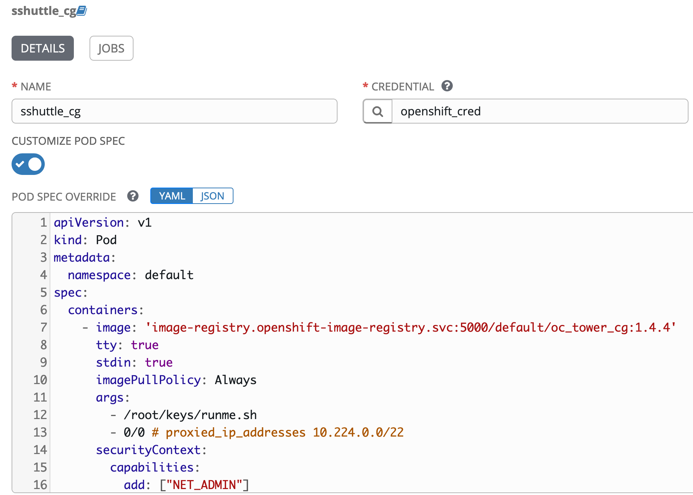

You should change the proxied_ip_addresses below for your network. It is required by the runme.sh.

``` yaml
apiVersion: v1
kind: Pod
metadata:
  namespace: default
spec:
  containers:
    - image: 'image-registry.openshift-image-registry.svc:5000/default/oc_tower_cg:1.4.4'
      tty: true
      stdin: true
      imagePullPolicy: Always
      args:
        - /root/keys/runme.sh
        - 10.224.0.0/22 # proxied_ip_addresses 0/0 or 0.0.0.0/0
      securityContext:
        capabilities:
          add: ["NET_ADMIN"]
```

The oc_tower_cg image referred above in the custom pod spec is created with the following [Dockerfile](https://github.com/thinkahead/DeveloperRecipes/blob/master/Jumphosts/ansible-runner-sshuttle/Dockerfile "Dockerfile to use sshuttle"):

``` yaml
FROM quay.io/ansible-tower/ansible-runner:1.4.4

RUN yum -y update

# Add Centos repo for doing yum install
RUN printf '[base]\nname=CentOS-\$releasever - Base\nbaseurl=http://mirror.centos.org/centos/7.8.2003/os/\$basearch/\nenabled=1\ngpgcheck=0\npriority=1\n' > /etc/yum.repos.d/centos.repo

# Run yum install commands
RUN yum -y install https://dl.fedoraproject.org/pub/epel/epel-release-latest-7.noarch.rpm
RUN yum -y install expect connect-proxy nc autossh net-tools curl iputils socat hostname
RUN yum -y install gcc python36 python36-devel git python-pip
RUN yum -y install iptables

RUN rm -rf /var/lib/awx/venv/ansible;mkdir -p /var/lib/awx/venv/ansible
RUN virtualenv -p python3 /var/lib/awx/venv/ansible

# Configure the ansible_test venv
RUN umask 0022
RUN . /var/lib/awx/venv/ansible/bin/activate; pip install --upgrade pip;pip install --upgrade setuptools;pip install sshuttle;pip install python-memcached psutil ansible pypsrp pywinrm pywinrm[credssp] requests-credssp;pip install git+https://github.com/nitzmahone/PySocks.git@hack_unix_domain_socket_file_support git+https://github.com/nitzmahone/urllib3.git@hack_unix_domain_socket_file_support requests==2.22.0 idna==2.8; deactivate
COPY keys /root/keys/
```

The additional step from the previous [Part 10](../multiple-jumphosts-in-ansible-tower-part-10/index.md "Multiple Jumphosts in Ansible Tower - Part 10") is the "pip install sshuttle" that installs sshuttle into the /var/lib/awx/venv/ansible/bin directory. As of this writing, it installs the 1.0.3 version of sshuttle that requires python3.5 or higher on both the container/pod and the target jumphost.

We build the docker image as follows:

`docker build -t registry.me:5000/default/oc_tower_cg:1.4.4 .`

Then do a port-forward as in previous Part 10 and push the image to the Openshift image registry in the cluster to make it accessible to Tower as image-registry.openshift-image-registry.svc:5000/default/oc_tower_cg:1.4.4. You could alternatively push the image to an external registry and use that in the pod spec.

`docker push registry.me:5000/default/oc_tower_cg:1.4.4`

The args is set to to run the file [runme.sh](https://github.com/thinkahead/DeveloperRecipes/blob/master/Jumphosts/ansible-runner-sshuttle/keys/runme.sh "runme.sh") that was [copied](https://github.com/thinkahead/DeveloperRecipes/blob/master/Jumphosts/ansible-runner-sshuttle/Dockerfile#L20 "COPY keys /root/keys/") to the /root/keys when we created the new image using the Dockerfile. Remember to create/copy the ssh private keys for the jumphosts into the keys directory. We have added the proxied_ip_addresses as a parameter to the runme.sh. It is set to 10.224.0.0/22 in the pod spec as an argument and passed on to the sshuttle process. We could have set it to 0.0 or 0.0.0.0/0 or other required addresses for the final jumphost hop endpoints. The runme.sh [starts the ssh-agent](https://github.com/thinkahead/DeveloperRecipes/blob/master/Jumphosts/ansible-runner-sshuttle/keys/runme.sh#L1 "eval $(ssh-agent -s | tee /root/ssh-agent.env)") and exports the following for jumphost 1 through 5. For jumphost 1: jh1_ssh_private_key, jh1_ssh_private_key_passphrase, jh1_ip, jh1_ssh_port, jh1_ssh_user and similar for jh2 and so on. The runme.sh is coded to allow 5 jumphosts. You can add additional if required. The ssh-agent environment variables are saved in /root/ssh-agent.env if required in later plays. The expect script [login_with_expect.sh](https://github.com/thinkahead/DeveloperRecipes/blob/master/Jumphosts/ansible-runner-sshuttle/keys/login_with_expect.sh "login_with_expect.sh") that we are now intimately familiar with is invoked. It calls the [jumphostlogin.sh](https://github.com/thinkahead/DeveloperRecipes/blob/master/Jumphosts/ansible-runner-sshuttle/keys/jumphostlogin.sh "add ssh keys to ssh-agent") that adds the private keys (assumed to be in the keys directory) with optional passphrase to the ssh-agent. Finally, the runme.sh [starts the sshuttle](https://github.com/thinkahead/DeveloperRecipes/blob/master/Jumphosts/ansible-runner-sshuttle/keys/runme.sh#L67-L80 "starts sshuttle with required number of jumphjost hops") with required number of jumphost hops. The last hop is where the sshuttle connects to with the -r parameter specifying the remote server. This is shown in the following snippet from runme.sh:

`if [ ! -z "$jh5_ip" ]; then`\
&nbsp;&nbsp;`    /var/lib/awx/venv/ansible/bin/sshuttle --python=/usr/bin/python3 -D --dns --no-latency-control -vvv -r $jh5_ssh_user@$jh5_ip --ssh-cmd "ssh -p $jh5_ssh_port -oPubkeyAuthentication=yes -oUserKnownHostsFile=/dev/null -oStrictHostKeyChecking=no -o ProxyCommand=\"ssh -W %h:%p -oPubkeyAuthentication=yes -oStrictHostKeyChecking=no -oUserKnownHostsFile=/dev/null -p $jh4_ssh_port $jh4_ssh_user@$jh4_ip -o ProxyCommand=\\\"ssh -W $jh4_ip:$jh4_ssh_port -oPubkeyAuthentication=yes -oStrictHostKeyChecking=no -oUserKnownHostsFile=/dev/null -p $jh3_ssh_port $jh3_ssh_user@$jh3_ip -oProxyCommand=\\\\\\\"ssh -W $jh3_ip:$jh3_ssh_port -oStrictHostKeyChecking=no -oUserKnownHostsFile=/dev/null -p $jh2_ssh_port $jh2_ssh_user@$jh2_ipi -oProxyCommand=\\\\\\\\\\\\\\\"ssh -i $jh1_ssh_private_key -W $jh2_ip:$jh2_ssh_port -oStrictHostKeyChecking=no -oUserKnownHostsFile=/dev/null -p $jh1_ssh_port $jh1_ssh_user@$jh1_ip\\\\\\\\\\\\\\\"\\\\\\\"\\\"\"" $@`\
`elif [ ! -z "$jh4_ip" ]; then`\
&nbsp;&nbsp;`    /var/lib/awx/venv/ansible/bin/sshuttle --python=/usr/bin/python3 -D --dns --no-latency-control -vvv -r $jh4_ssh_user@$jh4_ip --ssh-cmd "ssh -p $jh4_ssh_port -oPubkeyAuthentication=yes -oUserKnownHostsFile=/dev/null -oStrictHostKeyChecking=no -o ProxyCommand=\"ssh -W %h:%p -oPubkeyAuthentication=yes -oStrictHostKeyChecking=no -oUserKnownHostsFile=/dev/null -p $jh3_ssh_port $jh3_ssh_user@$jh3_ip -o ProxyCommand=\\\"ssh -W $jh3_ip:$jh3_ssh_port -oPubkeyAuthentication=yes -oStrictHostKeyChecking=no -oUserKnownHostsFile=/dev/null -p $jh2_ssh_port $jh2_ssh_user@$jh2_ip -oProxyCommand=\\\\\\\"ssh -W $jh2_ip:$jh2_ssh_port -oStrictHostKeyChecking=no -oUserKnownHostsFile=/dev/null -p $jh1_ssh_port $jh1_ssh_user@$jh1_ip\\\\\\\"\\\"\"" $@`\
`elif [ ! -z "$jh3_ip" ]; then`\
&nbsp;&nbsp;`    /var/lib/awx/venv/ansible/bin/sshuttle --python=/usr/bin/python3 -D --dns --no-latency-control -vvv -r $jh3_ssh_user@$jh3_ip --ssh-cmd "ssh -p $jh3_ssh_port -oPubkeyAuthentication=yes -oUserKnownHostsFile=/dev/null -oStrictHostKeyChecking=no -o ProxyCommand=\"ssh -W %h:%p -oPubkeyAuthentication=yes -oStrictHostKeyChecking=no -oUserKnownHostsFile=/dev/null -p $jh2_ssh_port $jh2_ssh_user@$jh2_ip -o ProxyCommand=\\\"ssh -W $jh2_ip:$jh2_ssh_port -oPubkeyAuthentication=yes -oStrictHostKeyChecking=no -oUserKnownHostsFile=/dev/null -p $jh1_ssh_port $jh1_ssh_user@$jh1_ip\\\"\"" $@`\
`elif [ ! -z "$jh2_ip" ]; then`\
&nbsp;&nbsp;`    /var/lib/awx/venv/ansible/bin/sshuttle --python=/usr/bin/python3 -D --dns --no-latency-control -vvv -r $jh2_ssh_user@$jh2_ip --ssh-cmd "ssh -p $jh2_ssh_port -oPubkeyAuthentication=yes -oUserKnownHostsFile=/dev/null -oStrictHostKeyChecking=no -oProxyCommand=\"ssh -W %h:%p -oPubkeyAuthentication=yes -oStrictHostKeyChecking=no -oUserKnownHostsFile=/dev/null -p $jh1_ssh_port $jh1_ssh_user@$jh1_ip\"" $@`\
`elif [ ! -z "$jh1_ip" ]; then`\
&nbsp;&nbsp;`    /var/lib/awx/venv/ansible/bin/sshuttle --python=/usr/bin/python3 -D --dns --no-latency-control -vvv -r $jh1_ssh_user@$jh1_ip --ssh-cmd "ssh -p $jh1_ssh_port -oPubkeyAuthentication=yes -oUserKnownHostsFile=/dev/null -oStrictHostKeyChecking=no" $@`\
`fi`

We will simplify this further in Section 7 below.

#### 4. Inventory variables

We created a new yellowzone-org3 inventory that has a windows group and a linux group. The windows group contains 3 VMs: aakwin2008-2.yellowykt.com, aakwin2012-1.yellowykt.com and the aakwin2016-1.yellowykt.com. The linux group contains the 2 VMs: aakrhel005.yellowykt.com and aakrhel006.yellowykt.com.

In Part 10 we saw that windows hosts required the variable ansible_psrp_proxy set to one of the following:
-   ansible_psrp_proxy: "socks5h://unixsocket/tmp/mysock.sock"
-   ansible_psrp_proxy: "socks5h://127.0.0.1:1234"

We used one of the following variables to use the socks5 proxy for Linux hosts:
-   ansible_ssh_common_args: '-o StrictHostKeyChecking=no -o UserKnownHostsFile=/dev/null -o ProxyCommand="connect-proxy -S 127.0.0.1:1234 %h %p"'
-   ansible_ssh_common_args: '-o StrictHostKeyChecking=no -o UserKnownHostsFile=/dev/null -o ProxyCommand="ncat --proxy-type socks5 --proxy 127.0.0.1:1234 %h %p"'
-   ansible_ssh_common_args: '-o StrictHostKeyChecking=no -o UserKnownHostsFile=/dev/null -o ProxyCommand="socat - socks4a:127.0.0.1:%h:%p,socksport=1234"'

Now these are not required and are therefore removed. The windows group in the inventory yellowzone-org3 does not have the ansible_psrp_proxy as seen in screenshot below:

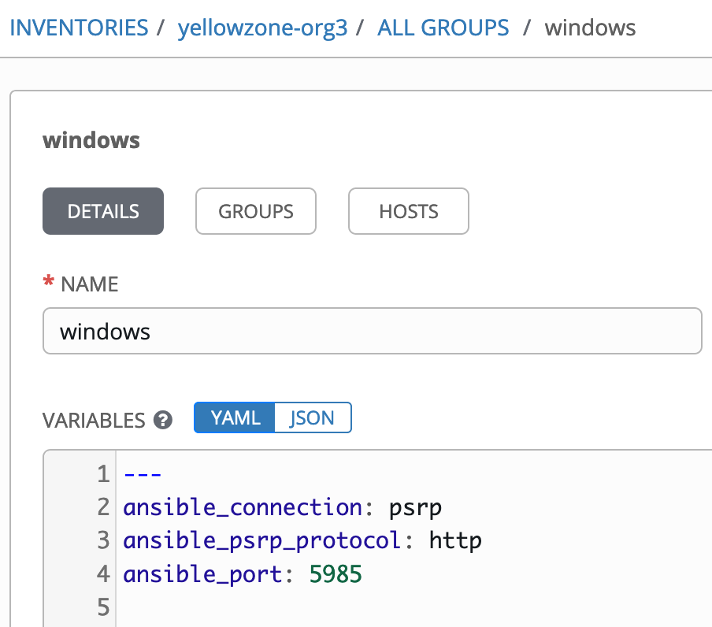

Also, in the inventory yellowzone-org3, the linux group has no variables. The ansible_ssh_common_args has been removed:

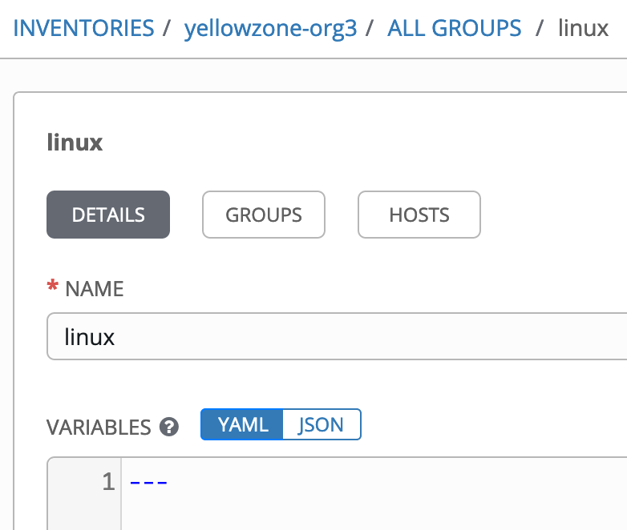

The only host variable that is set for Linux VM aakrhel005.yellowykt.com is the "ansible_port: 2222" because it has the ssh server on a non-default port 2222.

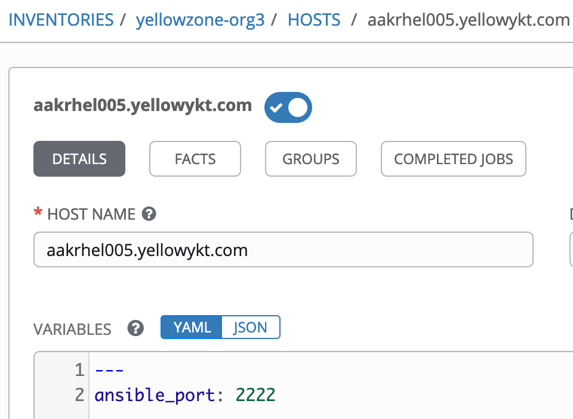

The aakrhel006.yellowykt.com uses the default ssh port 22.

#### 5. Windows Job Template

The Job template "windows_with_sshuttle" runs on three VMs: aakwin2008-2.yellowykt.com, aakwin2012-1.yellowykt.com and aakwin2016-1.yellowykt.com in the windows group in the yellowzone-org3 inventory as seen in the LIMIT aakwin2008*:aakwin2012*:aakwin2016*:localhost. It invokes the [windows_test3.yaml](https://github.com/thinkahead/DeveloperRecipes/blob/master/Jumphosts/windowstest3.yaml "windows_test3.yaml") playbook that shows additional information about the sshuttle in the [first play](https://github.com/thinkahead/DeveloperRecipes/blob/master/Jumphosts/windowstest3.yaml#L1-L20 "first play that runs on the pod") that runs on localhost (the pod).

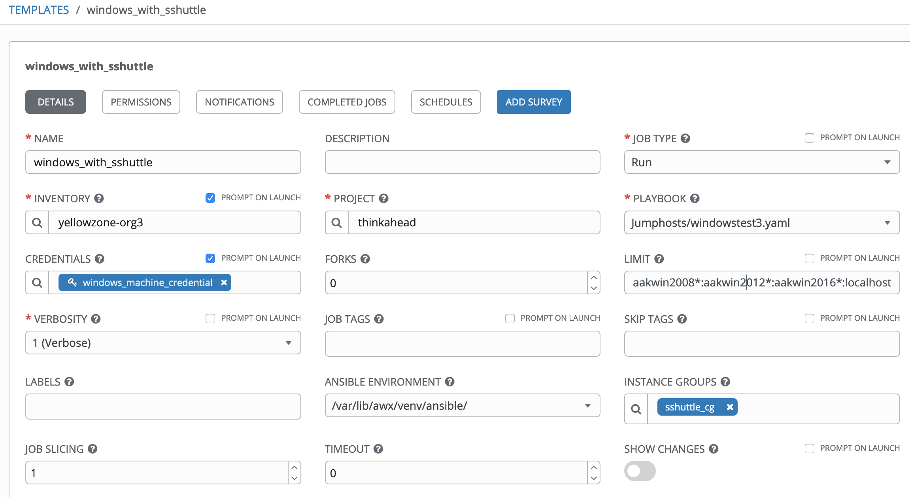

The output from the windows_with_shuttle job run shows the [last play for win_copy](https://github.com/thinkahead/DeveloperRecipes/blob/master/Jumphosts/windowstest3.yaml#L66-L70 "win_copy") being executed successfully on all three windows VMs.

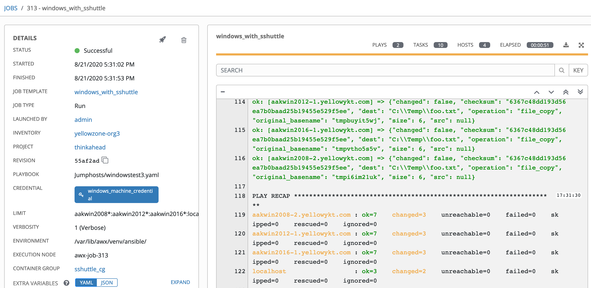

The interesting part is the output from the first play:

    /tmp/awx_313_lbe58slk/project/Jumphosts
    UID         PID   PPID  C STIME TTY          TIME CMD
    root          1      0  0 21:30 pts/0    00:00:00 tini -- /root/keys/runme.sh 10.224.0.0/22
    root         13      1  0 21:30 pts/0    00:00:00 /bin/sh /root/keys/runme.sh 10.224.0.0/22
    root         17      1  0 21:30 ?        00:00:00 ssh-agent -s
    root         30      1  0 21:30 pts/0    00:00:00 logger -p daemon.notice -t sshuttle
    root         33      1  0 21:30 ?        00:00:00 /var/lib/awx/venv/ansible/bin/python3 /var/lib/awx/venv/ansible/bin/sshuttle -v -v -v --method auto --firewall --syslog
    root         35     33  0 21:30 ?        00:00:00 logger -p daemon.notice -t sshuttle
    root         36      1  0 21:30 pts/0    00:00:00 ssh -p 22 -oPubkeyAuthentication=yes -oUserKnownHostsFile=/dev/null -oStrictHostKeyChecking=no -o ProxyCommand=ssh -W %h:%p -oPubkeyAuthentication=yes -oStrictHostKeyChecking=no -oUserKnownHostsFile=/dev/null -p 22 ec2-user@aakrhel002.yellowykt.com -o ProxyCommand="ssh -W aakrhel002.yellowykt.com:22 -oPubkeyAuthentication=yes -oStrictHostKeyChecking=no -oUserKnownHostsFile=/dev/null -p 22 ec2-user@aakrhel001.yellowykt.com -oProxyCommand=\"ssh -W aakrhel001.yellowykt.com:22 -oStrictHostKeyChecking=no -oUserKnownHostsFile=/dev/null -p 22 ec2-user@ec2-52-201-237-93.compute-1.amazonaws.com\"" ec2-user@aakrhel003.yellowykt.com -- '/usr/bin/python3' -c 'import sys, os; verbosity=3; sys.stdin = os.fdopen(0, "rb"); exec(compile(sys.stdin.read(1279), "assembler.py", "exec"))'
    root         37     36  0 21:30 pts/0    00:00:00 ssh -W aakrhel003.yellowykt.com:22 -oPubkeyAuthentication=yes -oStrictHostKeyChecking=no -oUserKnownHostsFile=/dev/null -p 22 ec2-user@aakrhel002.yellowykt.com -o ProxyCommand=ssh -W aakrhel002.yellowykt.com:22 -oPubkeyAuthentication=yes -oStrictHostKeyChecking=no -oUserKnownHostsFile=/dev/null -p 22 ec2-user@aakrhel001.yellowykt.com -oProxyCommand="ssh -W aakrhel001.yellowykt.com:22 -oStrictHostKeyChecking=no -oUserKnownHostsFile=/dev/null -p 22 ec2-user@ec2-52-201-237-93.compute-1.amazonaws.com"
    root         38     37  0 21:30 pts/0    00:00:00 ssh -W aakrhel002.yellowykt.com:22 -oPubkeyAuthentication=yes -oStrictHostKeyChecking=no -oUserKnownHostsFile=/dev/null -p 22 ec2-user@aakrhel001.yellowykt.com -oProxyCommand=ssh -W aakrhel001.yellowykt.com:22 -oStrictHostKeyChecking=no -oUserKnownHostsFile=/dev/null -p 22 ec2-user@ec2-52-201-237-93.compute-1.amazonaws.com
    root         39     38  0 21:30 pts/0    00:00:00 ssh -W aakrhel001.yellowykt.com:22 -oStrictHostKeyChecking=no -oUserKnownHostsFile=/dev/null -p 22 ec2-user@ec2-52-201-237-93.compute-1.amazonaws.com
    root         48     13  0 21:31 pts/0    00:00:00 sleep infinity
    root         49      1  0 21:31 ?        00:00:00 /var/lib/awx/venv/ansible/bin/python3 /var/lib/awx/venv/ansible/bin/sshuttle --python=/usr/bin/python3 -D --dns --no-latency-control -vvv -r ec2-user@aakrhel003.yellowykt.com --ssh-cmd ssh -p 22 -oPubkeyAuthentication=yes -oUserKnownHostsFile=/dev/null -oStrictHostKeyChecking=no -o ProxyCommand="ssh -W %h:%p -oPubkeyAuthentication=yes -oStrictHostKeyChecking=no -oUserKnownHostsFile=/dev/null -p 22 ec2-user@aakrhel002.yellowykt.com -o ProxyCommand=\"ssh -W aakrhel002.yellowykt.com:22 -oPubkeyAuthentication=yes -oStrictHostKeyChecking=no -oUserKnownHostsFile=/dev/null -p 22 ec2-user@aakrhel001.yellowykt.com -oProxyCommand=\\\"ssh -W aakrhel001.yellowykt.com:22 -oStrictHostKeyChecking=no -oUserKnownHostsFile=/dev/null -p 22 ec2-user@ec2-52-201-237-93.compute-1.amazonaws.com\\\"\"" 10.224.0.0/22
    root        121      1 41 21:31 ?        00:00:02 /usr/bin/python2 /usr/bin/ansible-runner start /tmp/awx_313_lbe58slk -p Jumphosts/windowstest3.yaml -i 313
    root        131    121 85 21:31 pts/1    00:00:03 /var/lib/awx/venv/ansible/bin/python3 /var/lib/awx/venv/ansible/bin/ansible-playbook -u Administrator --ask-pass -l aakwin2008*:aakwin2012*:aakwin2016*:localhost -v -i /tmp/awx_313_lbe58slk/inventory -e @/tmp/awx_313_lbe58slk/env/extravars Jumphosts/windowstest3.yaml
    root        138    131 19 21:31 pts/1    00:00:00 /var/lib/awx/venv/ansible/bin/python3 /var/lib/awx/venv/ansible/bin/ansible-playbook -u Administrator --ask-pass -l aakwin2008*:aakwin2012*:aakwin2016*:localhost -v -i /tmp/awx_313_lbe58slk/inventory -e @/tmp/awx_313_lbe58slk/env/extravars Jumphosts/windowstest3.yaml
    root        152    138  0 21:31 pts/1    00:00:00 /bin/sh -c /var/lib/awx/venv/ansible/bin/python3 /root/.ansible/tmp/ansible-tmp-1598045477.6693163-138-236928211248304/AnsiballZ_command.py && sleep 0
    root        153    152 17 21:31 pts/1    00:00:00 /var/lib/awx/venv/ansible/bin/python3 /root/.ansible/tmp/ansible-tmp-1598045477.6693163-138-236928211248304/AnsiballZ_command.py

    Agent pid 17
    SSH_AGENT_PID=17
    SSH_AUTH_SOCK=/tmp/ssh-lEogk7CA418V/agent.15
    # Generated by iptables-save v1.4.21 on Fri Aug 21 21:31:18 2020
    *raw
    :PREROUTING ACCEPT [174:45909]
    :OUTPUT ACCEPT [181:44677]
    COMMIT
    # Completed on Fri Aug 21 21:31:18 2020
    # Generated by iptables-save v1.4.21 on Fri Aug 21 21:31:18 2020
    *mangle
    :PREROUTING ACCEPT [174:45909]
    :INPUT ACCEPT [174:45909]
    :FORWARD ACCEPT [0:0]
    :OUTPUT ACCEPT [181:44677]
    :POSTROUTING ACCEPT [181:44677]
    COMMIT
    # Completed on Fri Aug 21 21:31:18 2020
    # Generated by iptables-save v1.4.21 on Fri Aug 21 21:31:18 2020
    *nat
    :PREROUTING ACCEPT [0:0]
    :INPUT ACCEPT [0:0]
    :OUTPUT ACCEPT [1:60]
    :POSTROUTING ACCEPT [5:346]
    :sshuttle-12300 - [0:0]
    -A PREROUTING -j sshuttle-12300
    -A OUTPUT -j sshuttle-12300
    -A sshuttle-12300 ! -p udp -m addrtype --dst-type LOCAL -j RETURN
    -A sshuttle-12300 -p udp -m addrtype --dst-type LOCAL -m udp ! --dport 53 -j RETURN
    -A sshuttle-12300 -d 10.224.0.0/22 -p tcp -m ttl ! --ttl-eq 42 -j REDIRECT --to-ports 12300
    -A sshuttle-12300 -d 172.21.0.10/32 -p udp -m udp --dport 53 -m ttl ! --ttl-eq 42 -j REDIRECT --to-ports 12299
    COMMIT
    # Completed on Fri Aug 21 21:31:18 2020
    # Generated by iptables-save v1.4.21 on Fri Aug 21 21:31:18 2020
    *filter
    :INPUT ACCEPT [174:45909]
    :FORWARD ACCEPT [0:0]
    :OUTPUT ACCEPT [181:44677]
    COMMIT
    # Completed on Fri Aug 21 21:31:18 2020

It shows the that sshuttle connected over the four jumphosts:

1.  The runme.sh invoked with the "10.224.0.0/22" that was set in the pod spec. We could pass additional information (keys, passphrase) currently copied into the image as parameters this way.
2.  The sshuttle process for the 4 jumphost hops (ec2-52-201-237-93.compute-1.amazonaws.com -> aakrhel001.yellowykt.com -> aakrhel002.yellowykt.com -> aakrhel003.yellowykt.com), the final hop that sshuttle points to is the aakrhel003.yellowykt.com:\
    `/var/lib/awx/venv/ansible/bin/python3 /var/lib/awx/venv/ansible/bin/sshuttle --python=/usr/bin/python3 -D --dns --no-latency-control -vvv -r ec2-user@aakrhel003.yellowykt.com --ssh-cmd ssh -p 22 -oPubkeyAuthentication=yes -oUserKnownHostsFile=/dev/null -oStrictHostKeyChecking=no -o ProxyCommand="ssh -W %h:%p -oPubkeyAuthentication=yes -oStrictHostKeyChecking=no -oUserKnownHostsFile=/dev/null -p 22 ec2-user@aakrhel002.yellowykt.com -o ProxyCommand=\"ssh -W aakrhel002.yellowykt.com:22 -oPubkeyAuthentication=yes -oStrictHostKeyChecking=no -oUserKnownHostsFile=/dev/null -p 22 ec2-user@aakrhel001.yellowykt.com -oProxyCommand=\\\"ssh -W aakrhel001.yellowykt.com:22 -oStrictHostKeyChecking=no -oUserKnownHostsFile=/dev/null -p 22 ec2-user@ec2-52-201-237-93.compute-1.amazonaws.com\\\"\"" 10.224.0.0/22`
3.  The 4 ssh processes for the hops
4.  The process for current playbook being executed:\
    /usr/bin/python2 /usr/bin/ansible-runner start /tmp/awx_313_lbe58slk -p Jumphosts/windowstest3.yaml -i 313
5.  The ssh-agent where the private keys for the jumphosts were added\
    Agent pid 17\
    SSH_AGENT_PID=17\
    SSH_AUTH_SOCK=/tmp/ssh-lEogk7CA418V/agent.15
6.  The debug output from the sshuttle shows the nat iptables rules for sshuttle-12300.

    `:sshuttle-12300 - [0:0]-A PREROUTING -j sshuttle-12300\
    -A OUTPUT -j sshuttle-12300\
    -A sshuttle-12300 ! -p udp -m addrtype --dst-type LOCAL -j RETURN\
    -A sshuttle-12300 -p udp -m addrtype --dst-type LOCAL -m udp ! --dport 53 -j RETURN\
    -A sshuttle-12300 -d 10.224.0.0/22 -p tcp -m ttl ! --ttl-eq 42 -j REDIRECT --to-ports 12300\
    -A sshuttle-12300 -d 172.21.0.10/32 -p udp -m udp --dport 53 -m ttl ! --ttl-eq 42 -j REDIRECT --to-ports 12299`

If Connecting to a Windows endpoint results in a "psrp connection error", you can try adding the following inventory/group/host variables:

`ansible_psrp_connection_timeout: 180`\
`ansible_psrp_operation_timeout: 120`\
`ansible_psrp_read_timeout: 180`\
`ansible_psrp_reconnection_retries: 10`

#### 6. Linux Job Templates and Ad Hoc commands

The linux_with_sshuttle job template runs the playbook [hello.yaml](https://github.com/thinkahead/DeveloperRecipes/blob/master/Jumphosts/hello.yaml "hello.yaml") on hosts aakrhel005.yellowykt.com:2222 and aakrhel006.yellowykt.com:22 with the Instance Group set to sshuttle_cg without the use of ncat, socket-proxy or socat variables.

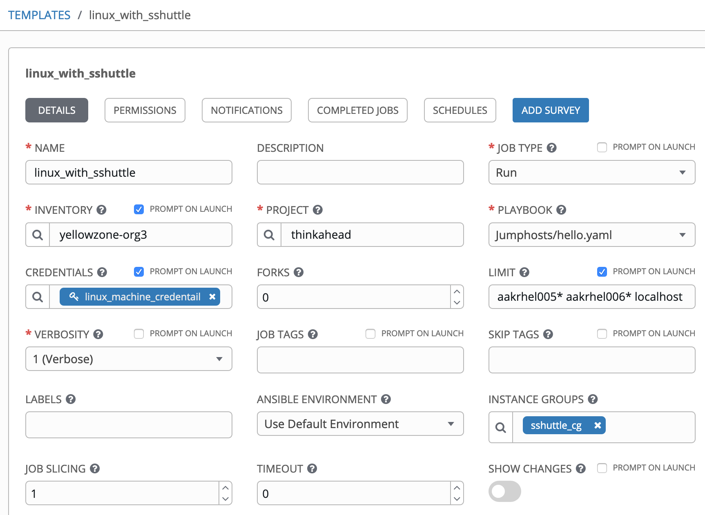

The output shows the echo hello `hostname` being executed on both the linux VMs.

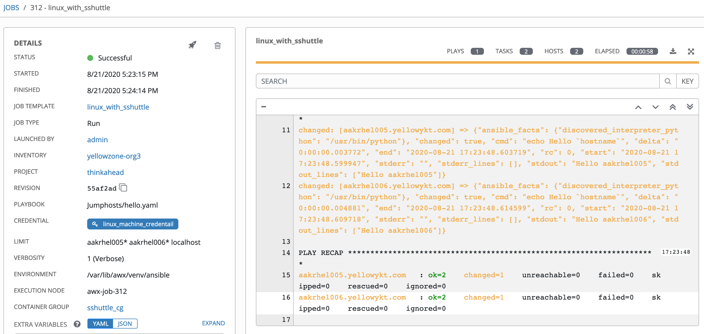

This establishes the same sshuttle connection over the 4 jumphost hops (ec2-52-201-237-93.compute-1.amazonaws.com -> aakrhel001.yellowykt.com -> aakrhel002.yellowykt.com -> aakrhel003.yellowykt.com) and Tower is directly able to connect to the Linux VMs accessible by the final jumphost aakrhel003.yellowykt.com.

For completeness, let's also look at the synchronize module that we covered in great depth in [Part 8](../multiple-jumphosts-in-ansible-tower-part-8/index.md "Multiple Jumphosts in Ansible Tower - Part 8"). It just works oblivious that traffic is being directed over the proxy. Remember that the endpoints need to have rsync installed otherwise you will get the following error:

`"msg": "bash: rsync: command not found\nrsync: connection unexpectedly closed (0 bytes received so far) [sender]\nrsync error: remote command not found (code 127) at io.c(226) [sender=3.1.2]\n"`

The job template "linux_rsync_shuttle" invokes the playbook [synchronize_sshuttle.yaml](https://github.com/thinkahead/DeveloperRecipes/blob/master/Jumphosts/synchronize_sshuttle.yaml "synchronize_sshuttle.yaml"). This playbook invokes the synchronize module.

``` yaml
---
- name: Use the synchronize module across multiple jumphosts using sshuttle
  hosts: all
  gather_facts: no
  tasks:
    - name: Show hello `hostname` using the new ansible_ssh_common_args
      shell: |
        echo Hello `hostname`
    - name: Synchronization using rsync protocol (push)
      synchronize:
        src: roles/
        dest: /tmp/roles/
        use_ssh_args: no
        dest_port: "{{ ansible_port if ansible_port is defined else 22 }}"
        delete: yes
```

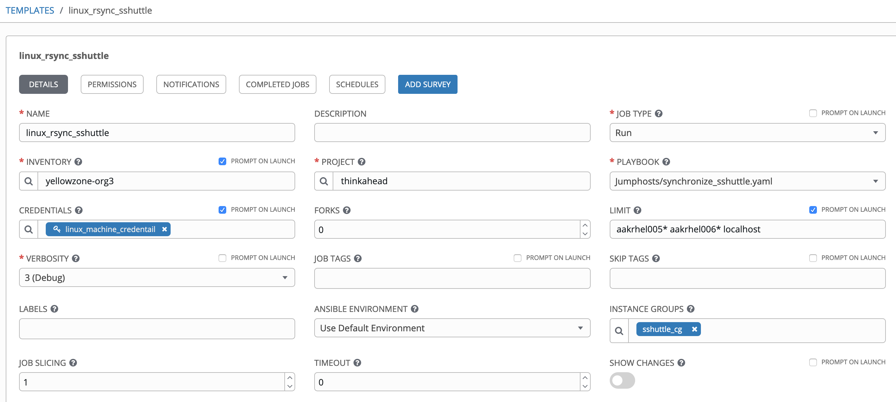

The output shows that the "roles" directory was synchronized to both linux VMs in the inventory. It also shows the rsync cmd that was executed by the synchronize module.

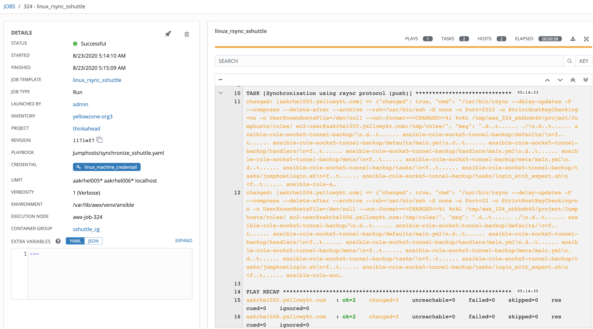

We can of course also run Ad Hoc commands on the VMs in the inventory:

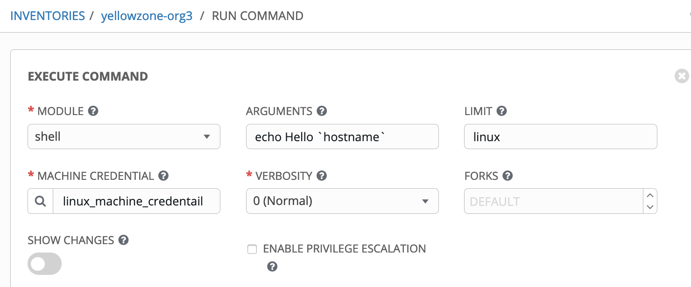

The output shows that the ``echo Hello \`hostname\` `` command executed successfully on both VMs in the linux group with the CONTAINER GROUP shuttle_cg.

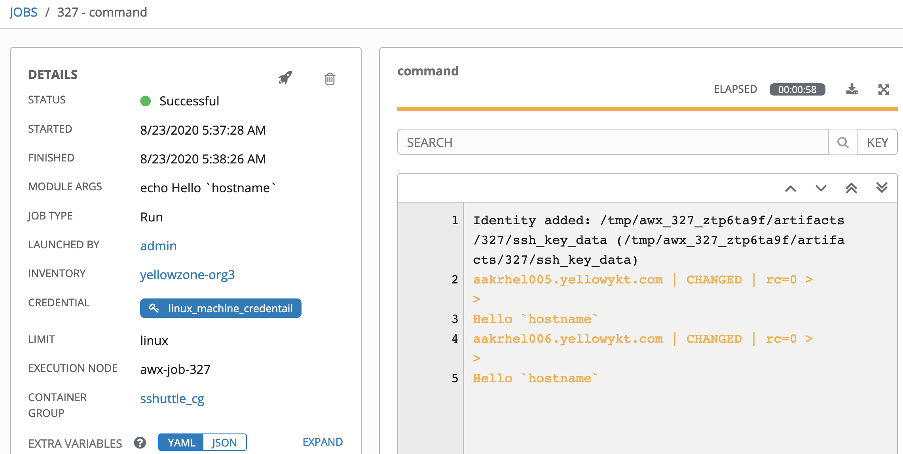

#### 7. Use /etc/ssh/ssh_config for the jumphost hops

Instead of using the complicated --ssh-cmd containing [nested ProxyCommand](https://github.com/thinkahead/DeveloperRecipes/blob/master/Jumphosts/ansible-runner-sshuttle/keys/runme.sh#L67-L80 "Nested ProxyCommand") for multiple jumphosts, we can instead update the /etc/ssh/ssh_config. If we wanted 5 jumphosts (ec2-user@ec2-52-201-237-93.compute-1.amazonaws.com -> aakrhel001 -> aakrhel002 -> aakrhel003 -> aakrhel006), we could set the following in /etc/ssh/ssh_config within the pod container. We will add these lines after we start the container below.

    Host aakrhel006.yellowykt.com
        ProxyCommand ssh -W %h:%p -oPubkeyAuthentication=yes -oStrictHostKeyChecking=no -oUserKnownHostsFile=/dev/null -p 22 ec2-user@aakrhel003.yellowykt.com
    Host aakrhel003.yellowykt.com
        ProxyCommand ssh -W %h:%p -oPubkeyAuthentication=yes -oStrictHostKeyChecking=no -oUserKnownHostsFile=/dev/null -p 22 ec2-user@aakrhel002.yellowykt.com
    Host aakrhel002.yellowykt.com
        ProxyCommand ssh -W %h:%p -oPubkeyAuthentication=yes -oStrictHostKeyChecking=no -oUserKnownHostsFile=/dev/null -p 22 ec2-user@aakrhel001.yellowykt.com
    Host aakrhel001.yellowykt.com
        ProxyCommand ssh -W %h:%p -oPubkeyAuthentication=yes -oStrictHostKeyChecking=no -oUserKnownHostsFile=/dev/null -p 22 ec2-user@ec2-52-201-237-93.compute-1.amazonaws.com

We can test this in Docker with the following Dockerfile:

``` yaml
FROM quay.io/ansible-tower/ansible-runner:1.4.4

RUN yum -y update

# Add Centos repo for doing yum install
RUN printf '[base]\nname=CentOS-\$releasever - Base\nbaseurl=http://mirror.centos.org/centos/7.8.2003/os/\$basearch/\nenabled=1\ngpgcheck=0\npriority=1\n' > /etc/yum.repos.d/centos.repo

# Run yum install commands
RUN yum -y install https://dl.fedoraproject.org/pub/epel/epel-release-latest-7.noarch.rpm
RUN yum -y install expect connect-proxy nc autossh net-tools curl iputils socat hostname
RUN yum -y install gcc python36 python36-devel git python-pip
RUN yum -y install iptables

RUN rm -rf /var/lib/awx/venv/ansible;mkdir -p /var/lib/awx/venv/ansible
RUN virtualenv -p python3 /var/lib/awx/venv/ansible

# Configure the ansible_test venv
RUN umask 0022
RUN . /var/lib/awx/venv/ansible/bin/activate; pip install --upgrade pip;pip install --upgrade setuptools;pip install sshuttle;pip install python-memcached psutil ansible pypsrp pywinrm pywinrm[credssp] requests-credssp;pip install git+https://github.com/nitzmahone/PySocks.git@hack_unix_domain_socket_file_support git+https://github.com/nitzmahone/urllib3.git@hack_unix_domain_socket_file_support requests==2.22.0 idna==2.8; deactivate
COPY keys /root/keys/
```

Build the image:

`docker build -t registry.me:5000/default/oc_tower_cg:1.4.4 .`

Then, start the container (using --privileged or --cap-add=NET_ADMIN)

`docker run --privileged --rm -it registry.me:5000/default/oc_tower_cg:1.4.4 bash`

Add the 4 Host ProxyCommands to the /etc/ssh/ssh_config

Add the private ssh keys to the ssh-agent using the expect script login_with_expect.sh by calling the "source runme.sh" (replace with you own keys and passphrases, you do not need to set the endpoint information, but should still set the endpoint_ssh_private_key to a unique value):

**runme.sh**

``` bash
eval $(ssh-agent -s | tee /root/ssh-agent.env)

export endpoint_ssh_private_key=/root/keys/alexei-key-ecdsa-aakrhel005
export endpoint_ssh_private_key_passphrase=Passphrase4aakrhel005
export endpoint_ip=aakrhel005.yellowykt.com
export endpoint_ssh_port=2222
export endpoint_ssh_user=ec2-user

export jh5_ssh_private_key=/root/keys/alexei-key-ecdsa-aakrhel006
export jh5_ssh_private_key_passphrase=Passphrase4aakrhel006
export jh5_ip=aakrhel006.yellowykt.com
export jh5_ssh_port=22
export jh5_ssh_user=ec2-user

export jh4_ssh_private_key=/root/keys/alexei-key-ecdsa-aakrhel003
export jh4_ssh_private_key_passphrase=Passphrase4aakrhel003
export jh4_ip=aakrhel003.yellowykt.com
export jh4_ssh_port=22
export jh4_ssh_user=ec2-user

export jh3_ssh_private_key=/root/keys/alexei-key-ecdsa-aakrhel002
export jh3_ssh_private_key_passphrase=Passphrase4aakrhel002
export jh3_ip=aakrhel002.yellowykt.com
export jh3_ssh_port=22
export jh3_ssh_user=ec2-user

export jh2_ssh_private_key=/root/keys/alexei-key-ecdsa-aakrhel001
export jh2_ssh_private_key_passphrase=Passphrase4aakrhel001
export jh2_ip=aakrhel001.yellowykt.com
export jh2_ssh_port=22
export jh2_ssh_user=ec2-user

export jh1_ssh_private_key=/root/keys/alexei-key-ecdsa-jumphost
export jh1_ssh_private_key_passphrase=Passphrase4ec2
export jh1_ip=ec2-52-201-237-93.compute-1.amazonaws.com
export jh1_ssh_port=22
export jh1_ssh_user=ec2-user

/root/keys/login_with_expect.sh
```

Finally, start sshuttle to connect to the aakrhel006.yellowykt.com. Notice that the following command does not have the nested ProxyCommands in the --ssh-cmd. The sshuttle uses the /etc/ssh/ssh_config to hop across the jumphosts.

`/var/lib/awx/venv/ansible/bin/sshuttle --python=/usr/bin/python3 -D --dns --no-latency-control -vvv -r ec2-user@aakrhel006.yellowykt.com --ssh-cmd "ssh -p 22 -oPubkeyAuthentication=yes -oUserKnownHostsFile=/dev/null -oStrictHostKeyChecking=no" 10.224.0.0/22`

This simplifies the sshuttle command. We only need to add the required jumphosts to the /etc/ssh/ssh_config. When the sshuttle is run, it will show the following output without the -D parameter showing that it connected over the 4 jumphosts with the "Permanently added" messages:

    Starting sshuttle proxy.
    firewall manager: Starting firewall with Python version 3.6.8
    firewall manager: ready method name nat.
    IPv6 enabled: None
    UDP enabled: False
    DNS enabled: True
    User enabled: False
    Binding redirector: 12300
    TCP redirector listening on ('127.0.0.1', 12300).
    TCP redirector listening with <socket.socket fd=5, family=AddressFamily.AF_INET, type=SocketKind.SOCK_STREAM, proto=0, laddr=('127.0.0.1', 12300)>.
    Binding DNS: 12300 12299
    DNS listening on ('127.0.0.1', 12299).
    DNS listening with <socket.socket fd=7, family=AddressFamily.AF_INET, type=SocketKind.SOCK_DGRAM, proto=0, laddr=('127.0.0.1', 12299)>.
    Starting client with Python version 3.6.8
    c : connecting to server...
    c : executing: ['ssh', '-p', '22', '-oPubkeyAuthentication=yes', '-oUserKnownHostsFile=/dev/null', '-oStrictHostKeyChecking=no', 'ec2-user@aakrhel006.yellowykt.com', '--', '\'/usr/bin/python3\' -c \'import sys, os; verbosity=3; sys.stdin = os.fdopen(0, "rb"); exec(compile(sys.stdin.read(1279), "assembler.py", "exec"))\'']
    c :  > channel=0 cmd=PING len=7 (fullness=0)
    Warning: Permanently added 'ec2-52-201-237-93.compute-1.amazonaws.com,52.201.237.93' (ECDSA) to the list of known hosts.
    Warning: Permanently added 'aakrhel001.yellowykt.com' (ECDSA) to the list of known hosts.
    Warning: Permanently added 'aakrhel002.yellowykt.com' (ECDSA) to the list of known hosts.
    Warning: Permanently added 'aakrhel003.yellowykt.com' (ECDSA) to the list of known hosts.
    Warning: Permanently added 'aakrhel006.yellowykt.com' (ECDSA) to the list of known hosts.
    server: assembling 'sshuttle' (88 bytes)
    server: assembling 'sshuttle.cmdline_options' (61 bytes)
    server: assembling 'sshuttle.helpers' (892 bytes)
    server: assembling 'sshuttle.ssnet' (5686 bytes)
    server: assembling 'sshuttle.hostwatch' (2462 bytes)
    server: assembling 'sshuttle.server' (3673 bytes)
    Starting server with Python version 3.6.8
    …

We can test by connecting to aakrhel005.yellowykt.com:2222 from the container after the sshuttle is started in background:

`ssh -oPubkeyAuthentication=yes -oUserKnownHostsFile=/dev/null -oStrictHostKeyChecking=no ec2-user@aakrhel005.yellowykt.com -p 2222 hostname`

The output shows that the ssh command successfully connects to the endpoint (by connecting over the multiple jumphosts and using the sshuttle as the proxy)

`Warning: Permanently added '[aakrhel005.yellowykt.com]:2222,[10.224.1.5]:2222' (ECDSA) to the list of known hosts.\
Authorized uses only. All activity may be monitored and reported.\
aakrhel005`

From within the container, we can also connect to windows VMs using python by running the following:

`. /var/lib/awx/venv/ansible/bin/activate`\
`python3`

The output shows that the command "ipconfig /all" was successfully executed on the aakwin2008-2.yellowykt.com without any Protocol proxy that was required in [Part 2](../multiple-jumphosts-in-ansible-tower-part-2/index.md "Multiple Jumphosts in Ansible Tower - Part 2"). We simply use the winrm.Session below.

    Python 3.6.8 (default, Apr  2 2020, 13:34:55)
    [GCC 4.8.5 20150623 (Red Hat 4.8.5-39)] on linux
    Type "help", "copyright", "credits" or "license" for more information.
    >>> import winrm
    >>> s = winrm.Session('aakwin2008-2.yellowykt.com', auth=('Administrator', '<MyPassword>'))
    >>> r = s.run_cmd('ipconfig', ['/all'])
    >>> r.std_out
    b'\r\nWindows IP Configuration\r\n\r\n   Host Name . . . . . . . . . . . . : aakwin2008-2\r\n   Primary Dns Suffix  . . . . . . . : yellowykt.com\r\n   Node Type . . . . . . . . . . . . : Hybrid\r\n   IP Routing Enabled. . . . . . . . : No\r\n   WINS Proxy Enabled. . . . . . . . : No\r\n   DNS Suffix Search List. . . . . . : yellowykt.com\r\n\r\nEthernet adapter Local Area Connection:\r\n\r\n   Connection-specific DNS Suffix  . : yellowykt.com\r\n   Description . . . . . . . . . . . : Intel(R) PRO/1000 MT Network Connection\r\n   Physical Address. . . . . . . . . : 00-50-56-83-29-34\r\n   DHCP Enabled. . . . . . . . . . . : Yes\r\n   Autoconfiguration Enabled . . . . : Yes\r\n   IPv4 Address. . . . . . . . . . . : 10.224.1.29(Preferred) \r\n   Subnet Mask . . . . . . . . . . . : 255.255.252.0\r\n   Lease Obtained. . . . . . . . . . : Thursday, August 20, 2020 6:09:59 PM\r\n   Lease Expires . . . . . . . . . . : Saturday, August 22, 2020 1:10:00 PM\r\n   Default Gateway . . . . . . . . . : 10.224.0.1\r\n   DHCP Server . . . . . . . . . . . : 10.224.0.10\r\n   DNS Servers . . . . . . . . . . . : 10.224.0.10\r\n   NetBIOS over Tcpip. . . . . . . . : Enabled\r\n'
    >>> r.status_code
    0

Instead of adding all the Jumphosts to the /etc/ssh/ssh_config, yet another option is to use the [ProxyJump](https://en.wikibooks.org/wiki/OpenSSH/Cookbook/Proxies_and_Jump_Hosts#Passing_Through_One_or_More_Gateways_Using_ProxyJump "ProxyJump") with the "sshuttle --ssh-cmd" as follows for the same 5 jumphosts that were exported in runme.sh:

`/var/lib/awx/venv/ansible/bin/sshuttle --python=/usr/bin/python3 -D --dns --no-latency-control -vvv -r $jh5_ssh_user@$jh5_ip:$jh5_ssh_port --ssh-cmd "ssh -J $jh1_ssh_user@$jh1_ip:$jh1_ssh_port,$jh2_ssh_user@$jh2_ip:$jh1_ssh_port,$jh3_ssh_user@$jh3_ip:$jh1_ssh_port,$jh4_ssh_user@$jh4_ip:$jh1_ssh_port" 10.224.0.0/22`

The -J is equivalent to "-o ProxyJump=". It allows connecting to the target host by first making a ssh connection to the jump host described by destination and then establishing a TCP forwarding to the ultimate destination from there. Multiple jump hops may be specified separated by comma characters. Nested ProxyCommand with escaping of double quote characters is not required. However, when you run the sshuttle, it may get foiled because it has yet to have its SSH key fingerprint added to the known_hosts file. The problem with that is the jumphosts connections will ignore the -o StrictHostKeyChecking=no -o UserKnownHostsFile=no if they are specified in the --ssh-cmd. This happens because the ProxyJump starts another ssh process, that does not inherit the command-line arguments that are specified on the command-line of the first ssh command. This problem can be solved either by adding the SSH key fingerprints for the jumphosts into the ~/.ssh/known_hosts (you can use the ssh-keyscan to get the fingerprint) or by adding the UserKnownHostsFile=/dev/null and StrictHostKeyChecking=no /etc/ssh/ssh_config for "Host *". The ProxyJump does not seem to allow any command line mechanism to set these for the multiple jumphosts.

    Host *
      GSSAPIAuthentication yes
      PubkeyAuthentication=yes
      StrictHostKeyChecking=no
      UserKnownHostsFile=/dev/null

This section showed the additional ways to specify the ssh-cmd for the sshuttle and the Host entries in /etc/ssh/ssh_config to allow multiple jumphost hops. Depending on the ssh version, we have multiple choices.

#### 8. Conclusion

This Part 11 showed how to simplify the multiple jumphost connections even further with the use of sshuttle in Container Groups. Now we do not require any special roles to be invoked by the playbook and we do not need to set any proxy in the inventory variables in Ansible Tower. We can run playbooks from Ansible Tower Jobs and Ad hoc commands on the target host endpoints over multiple jumphost hops as if they the endpoints are directly accessible from Tower. This was tested on Ansible Tower 3.7.1.

There are other alternatives that you can possibly use: [proxychains-ng](https://github.com/rofl0r/proxychains-ng "Redirect TCP connections through SOCKS4a/5 or HTTP proxies"), [redsocks](https://github.com/darkk/redsocks "Transparent TCP-to-proxy redirector"), [xiringuito](https://github.com/ivanilves/xiringuito "SSH-based VPN for poors"), [tun2socks](https://code.google.com/archive/p/badvpn/wikis/tun2socks.wiki "Socksify TCP (IPv4 and IPv6) connections at the network layer"), [teleport](https://github.com/gravitational/teleport "Gravitational Teleport security gateway"), etc. The use of pods to establish connectivity to host endpoints opens up a lot of possibilities. Hope you have enjoyed the article. Share your thoughts in the comments or engage in the conversation with me on Twitter @aakarve. I look forward to hearing about which proxy you prefer for Container Groups in Ansible Tower and if you would like to see something covered in more detail.

#### 9. References
- Python version issues for sshuttle <https://github.com/sshuttle/sshuttle/issues/481>
- Using Sshuttle as a service <https://medium.com/@mike.reider/using-sshuttle-as-a-service-bec2684a65fe>
- Escape proxy hell with Redsocks <https://jmkhael.io/escape-proxy-hell-with-redsocks/>
- Replace bubblewrap-based task execution in AWX with container-based execution <https://github.com/ansible/awx/issues/7060>
- Using Runner as a standalone command line tool <https://ansible-runner.readthedocs.io/en/stable/standalone.html#using-runner-as-a-standalone-command-line-tool>
- Go beyond with automation: ansible-runner <https://swapps.com/blog/go-beyond-with-automation-ansible-runner/>
- Multiple Jumphosts in Ansible Tower -- Part 1: Connecting to Linux hosts using ssh with nested ProxyCommand <https://developer.ibm.com/recipes/tutorials/multiple-jumphosts-in-ansible-tower-part-1/>
- Multiple Jumphosts in Ansible Tower -- Part 2: Connecting to Windows/Linux hosts with ssh tunnel SOCKS5 proxy <https://developer.ibm.com/recipes/tutorials/multiple-jumphosts-in-ansible-tower-part-2/>
- Multiple Jumphosts in Ansible Tower -- Part 3: Ssh tunnel SOCKS5 proxy with passphrase enabled for ssh keys <https://developer.ibm.com/recipes/tutorials/multiple-jumphosts-in-ansible-tower-part-3/>
- Multiple Jumphosts in Ansible Tower -- Part 4: Multi jumphost connections to Linux hosts using ssh-add to add keys to ssh-agent <https://developer.ibm.com/recipes/tutorials/multiple-jumphosts-in-ansible-tower-part-4/>
- Multiple Jumphosts in Ansible Tower -- Part 5: Unix domain socket file instead of socks port <https://developer.ibm.com/recipes/tutorials/multiple-jumphosts-in-ansible-tower-part-5/>
- Multiple Jumphosts in Ansible Tower -- Part 6: Primary and Secondary/Backup Jumphosts and Reverse ssh Tunnel <https://developer.ibm.com/recipes/tutorials/multiple-jumphosts-in-ansible-tower-part-6/>
- Multiple Jumphosts in Ansible Tower -- Part 7: Failover using redundant jumphosts, tweaking ssh parameters and memory requirements for jumphosts <https://developer.ibm.com/recipes/tutorials/multiple-jumphosts-in-ansible-tower-part-7/>
- Multiple Jumphosts in Ansible Tower -- Part 8: Transferring files using ansible synchronize module and rsync <https://developer.ibm.com/recipes/tutorials/multiple-jumphosts-in-ansible-tower-part-8/>
- Multiple Jumphosts in Ansible Tower -- Part 9: Pull secrets from remote 3rd-party vaults over multiple jumphost hops and use the credentials to connect to target hosts <https://developer.ibm.com/recipes/tutorials/multiple-jumphosts-in-ansible-tower-part-9/>
- Multiple Jumphosts in Ansible Tower -- Part 10: Using Container Groups instead of bubblewrap for isolation of jobs [https://developer.ibm.com/recipes/tutorials/multiple-jumphosts-in-ansible-tower-part-10/](https://developer.ibm.com/recipes/tutorials/multiple-jumphosts-in-ansible-tower-part-10/ "Multiple Jumphosts in Ansible Tower -- Part 10")
