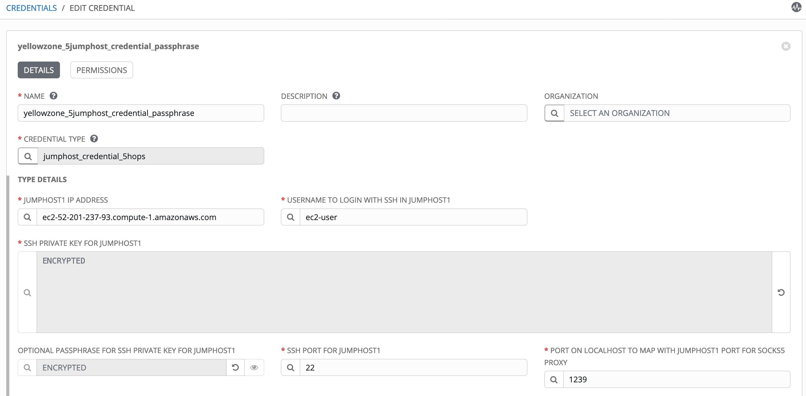

# Multiple Jumphosts in Ansible Tower - Part 3

##  Ssh tunnel SOCKS5 proxy with passphrase enabled for ssh keys

[Alexei.Karve](https://developer.ibm.com/recipes/author/karve/)

Tags: Cloud computing, DevOps, Linux

### Overview

Skill Level: Intermediate

Hands on expertise with Ansible Tower/AWX and Linux ssh

Part 1 used custom credential types and host variables in Ansible Tower. Part 2 showed how to run jobs on Windows/Linux hosts by creating a ssh tunnel with SOCKS5. Part 3 extends this capability to allow passphrase for the jumphost ssh keys.

### Ingredients

Ansible Tower/AWX

### Step-by-step

#### 1. Introduction

[Part 1](../multiple-jumphosts-in-ansible-tower-part-1/index.md "Multiple Jumphosts in Ansible Tower - Part 1") showed how to configure Ansible Tower to connect via multiple jumphosts to Linux host endpoints using the host variables and custom credential types where the jumphost ssh keys did not have a passphrase. In [Part 2](../multiple-jumphosts-in-ansible-tower-part-2/index.md "Multiple Jumphosts in Ansible Tower - Part 2"), we extended this capability to allow running jobs on Windows/Linux hosts by creating a ssh tunnel as a SOCKS5 proxy, again with ssh keys that did not have a passphrase.

Ssh command does not allow providing the passphrase as a parameter when using the ssh key with the -I parameter. Also, we do not want a human to type in the passphrase for keys used during automation. The passphrase would have to be hardcoded in a script or stored in some kind of vault, where it can be retrieved by a script and entered automatically when prompted.

Part 3 shows shows how to use the expect script in a playbook to work around the above restriction and provides a role to establish a tunnel via multiple hops of jumphost connections with ssh credentials that have an optional passphrase. This tunnel allows a connection to Linux and Windows hosts as in [Part 2](../multiple-jumphosts-in-ansible-tower-part-2/index.md "Multiple Jumphosts in Ansible Tower - Part 2").

#### 2. Creating the ssh tunnel

Two scripts are used for this automation: 1. The expect script [login_with_expect.sh](https://github.com/thinkahead/DeveloperRecipes/blob/master/Jumphosts/roles/ansible-role-socks5-tunnel/tasks/login_with_expect.sh) that provides the passphrases and 2. [jumphostlogin.sh](https://github.com/thinkahead/DeveloperRecipes/blob/master/Jumphosts/roles/ansible-role-socks5-tunnel/tasks/jumphostlogin.sh) that creates the tunnel. The latter script is invoked by the login_with_expect.sh so that the passphrase prompts of the form "Enter passphrase for key" can be supplied with the required values. The Private Key Passphrase (Key Password for the private key) is stored encrypted in the Tower database.

For this article, you may create the ssh keys with passphrase. You can use ssh-keygen to generate the private and public keys, for example: "ssh-keygen -f ./alexei-key-ecdsa-aakrhel001 -t ecdsa -b 521". This creates the alexei-key-ecdsa-aakrhel001 and the alexei-key-ecdsa-aakrhel001.pub in the current directory. It is assumed that the private keys have been copied to the respective jumphosts and each jumphost has connectivity to the next jumphost with the public key of the prior host added to the next host in the user's ~/.ssh/authorized_keys.

**Sample script to provide desired keys, passphrase, ip, port and user for the jumphosts**

Shown below is an example that provides the required values to establish the tunnel for initial testing. The hardcoded values are self-explanatory and can be replaced with real key names, passphrases, ports and hostname. Later, when using Ansible Tower, these values are added in Ansible Tower as [custom credential types](https://github.com/thinkahead/DeveloperRecipes/blob/master/Jumphosts/Credentials.md "custom credential types") and provided during runtime to the jobs as extra vars and environment variables.

The directory where you run this should have a short path to prevent the prompt label name from getting truncated.

`mkdir ~/test;cd ~/test`

`# Create the keys and copy to the jumphosts and endpoints here.`

`# Next export the values.`

``export endpoint_ssh_private_key=`pwd`/alexei-key-ecdsa-aakrhel005``\
`export endpoint_ssh_private_key_passphrase=Passphrase4aakrhel005`

``export jh5_ssh_private_key=`pwd`/alexei-key-ecdsa-aakrhel006``\
`export jh5_ssh_private_key_passphrase=Passphrase4aakrhel006`\
`export jh5_ip=aakrhel006.yellowykt.com`\
`export jh5_ssh_port=22`\
`export jh5_ssh_user=ec2-user`

``export jh4_ssh_private_key=`pwd`/alexei-key-ecdsa-aakrhel003``\
`export jh4_ssh_private_key_passphrase=Passphrase4aakrhel003`\
`export jh4_ip=aakrhel003.yellowykt.com`\
`export jh4_ssh_port=22`\
`export jh4_ssh_user=ec2-user`

``export jh3_ssh_private_key=`pwd`/alexei-key-ecdsa-aakrhel002``\
`export jh3_ssh_private_key_passphrase=Passphrase4aakrhel002`\
`export jh3_ip=aakrhel002.yellowykt.com`\
`export jh3_ssh_port=22`\
`export jh3_ssh_user=ec2-user`

``export jh2_ssh_private_key=`pwd`/alexei-key-ecdsa-aakrhel001``\
`export jh2_ssh_private_key_passphrase=Passphrase4aakrhel001`\
`export jh2_ip=aakrhel001.yellowykt.com`\
`export jh2_ssh_port=22`\
`export jh2_ssh_user=ec2-user`

``export jh1_ssh_private_key=`pwd`/alexei-key-ecdsa-jumphost``\
`export jh1_ssh_private_key_passphrase=Passphrase4ec2`\
`export jh1_ip="ec2-52-201-237-93.compute-1.amazonaws.com"`\
`export jh1_ssh_port=22`\
`export jh1_ssh_user=ec2-user`\
`export jh1_socks_port=socks5h://127.0.0.1:1234`

`./login_with_expect.sh # Create the tunnel with ssh passphrase`

The last line invokes the [login_with_expect.sh](https://github.com/thinkahead/DeveloperRecipes/blob/master/Jumphosts/roles/ansible-role-socks5-tunnel/tasks/login_with_expect.sh) that creates the tunnel by spawning the [jumphostlogin.sh](https://github.com/thinkahead/DeveloperRecipes/blob/master/Jumphosts/roles/ansible-role-socks5-tunnel/tasks/jumphostlogin.sh) script using the exported parameters for the jumphosts and leaves it running in background. The output shows the "Enter passphrase for key" prompts that are provided with the password allowing the script to complete the creation of the tunnel without any additional human intervention.

```
spawn -ignore HUP ./jumphostlogin.sh
Warning: Permanently added 'ec2-52-201-237-93.compute-1.amazonaws.com,52.201.237.93' (ECDSA) to the list of known hosts.
Enter passphrase for key '/Users/karve/Downloads/expecttest/alexei-key-ecdsa-jumphost':
Warning: Permanently added 'aakrhel001.yellowykt.com' (ECDSA) to the list of known hosts.
Enter passphrase for key '/Users/karve/Downloads/expecttest/alexei-key-ecdsa-aakrhel001':
Warning: Permanently added 'aakrhel002.yellowykt.com' (ECDSA) to the list of known hosts.
Enter passphrase for key '/Users/karve/Downloads/expecttest/alexei-key-ecdsa-aakrhel002':
Warning: Permanently added 'aakrhel003.yellowykt.com' (ECDSA) to the list of known hosts.
Enter passphrase for key '/Users/karve/Downloads/expecttest/alexei-key-ecdsa-aakrhel003':
Warning: Permanently added 'aakrhel006.yellowykt.com' (ECDSA) to the list of known hosts.
Enter passphrase for key '/Users/karve/Downloads/expecttest/alexei-key-ecdsa-aakrhel006':
DONEDONEDONE
spawned process backgrounding successful`
```

We are not prompted to enter any of the passphrases for the jumphosts. The expect script will look for the prompt strings and fill the passwords when the tunnel is being established. Note that passphrases for the ssh keys are optional when using the above script. If some (or all) ssh keys do not have a passphrase, then there won't be any prompts for those ssh keys.

**Source code for login_with_expect.sh**

``` bash
#!/usr/bin/expect -f
# When expect exits, it sends a SIGHUP (hangup signal) to the spawned subprocess. By default, this SIGHUP causes termination of the spawned process.
# We do not want the ssh tunnel to die from SIGHUP. So, we ask "expect" to make the process ignore SIGHUP in the spawn line
set timeout 120
spawn -ignore HUP ./jumphostlogin.sh
expect {
      "Are you sure you want to continue connecting*" {
            send "yes\r"\
            exp_continue
      }
      "*Enter passphrase for key*$env(jh1_ssh_private_key)'*" {
            #puts $env(jh1_ssh_private_key_passphrase)
            send -- "$env(jh1_ssh_private_key_passphrase)\r"
            exp_continue
      }
      "*Enter passphrase for key*$env(jh2_ssh_private_key)'*" {
            #puts $env(jh2_ssh_private_key_passphrase)
            send -- "$env(jh2_ssh_private_key_passphrase)\r"
            exp_continue
      }
      "*Enter passphrase for key*$env(jh3_ssh_private_key)'*" {
            #puts $env(jh3_ssh_private_key_passphrase)
            send -- "$env(jh3_ssh_private_key_passphrase)\r"
            exp_continue
      }
      "*Enter passphrase for key*$env(jh4_ssh_private_key)'*" {
            #puts $env(jh4_ssh_private_key_passphrase)
            send -- "$env(jh4_ssh_private_key_passphrase)\r"
            exp_continue
      }
      "*Enter passphrase for key*$env(jh5_ssh_private_key)'*" {
            #puts $env(jh5_ssh_private_key_passphrase)
            send -- "$env(jh5_ssh_private_key_passphrase)\r"
            exp_continue
      }
      "*Enter passphrase for key*$env(endpoint_ssh_private_key)'*" {
            #puts $env(endpoint_ssh_private_key_passphrase)
            send -- "$env(endpoint_ssh_private_key_passphrase)\r"
            exp_continue
      }
      "*DONEDONEDONE*" {
        send_user "spawned process backgrounding successful\n"
        #expect_background
        interact
      }
}
exit 0
```

**Source code for jumphostlogin.sh**
``` bash
#!/bin/bash

re='^[0-9]+$'
if ! [[ $jh1_socks_port =~ $re ]] ; then
    #echo "Socks port is not a number" >&2
    dparam=`echo $jh1_socks_port | sed "s|^socks.*://||" | sed "s|^unixsocket||"`
else
    #dparam=/tmp/mysocks$jh1_socks_port
    dparam=127.0.0.1:$jh1_socks_port
fi

if [ ! -z "$jh5_ip" ]; then
    ssh -i $jh5_ssh_private_key -oPubkeyAuthentication=yes -oStrictHostKeyChecking=no -oUserKnownHostsFile=/dev/null -oProxyCommand="ssh -i $jh4_ssh_private_key -W $jh5_ip:$jh5_ssh_port -oPubkeyAuthentication=yes -oStrictHostKeyChecking=no -oUserKnownHostsFile=/dev/null -oProxyCommand=\"ssh -i $jh3_ssh_private_key -W $jh4_ip:$jh4_ssh_port -oPubkeyAuthentication=yes -oStrictHostKeyChecking=no -oUserKnownHostsFile=/dev/null -oProxyCommand=\\\"ssh -i $jh2_ssh_private_key -W $jh3_ip:$jh3_ssh_port -oPubkeyAuthentication=yes -oStrictHostKeyChecking=no -oUserKnownHostsFile=/dev/null -oProxyCommand=\\\\\\\"ssh -i $jh1_ssh_private_key -W $jh2_ip:$jh2_ssh_port -oStrictHostKeyChecking=no -oUserKnownHostsFile=/dev/null -p $jh1_ssh_port $jh1_ssh_user@$jh1_ip\\\\\\\" -p $jh2_ssh_port $jh2_ssh_user@$jh2_ip\\\" -p $jh3_ssh_port $jh3_ssh_user@$jh3_ip\" -p $jh4_ssh_port $jh4_ssh_user@$jh4_ip" -p $jh5_ssh_port $jh5_ssh_user@$jh5_ip -fN -D $dparam
elif [ ! -z "$jh4_ip" ]; then
    ssh -i $jh4_ssh_private_key -oPubkeyAuthentication=yes -oStrictHostKeyChecking=no -oUserKnownHostsFile=/dev/null -oProxyCommand="ssh -i $jh3_ssh_private_key -W $jh4_ip:$jh4_ssh_port -oPubkeyAuthentication=yes -oStrictHostKeyChecking=no -oUserKnownHostsFile=/dev/null -oProxyCommand=\"ssh -i $jh2_ssh_private_key -W $jh3_ip:$jh3_ssh_port -oPubkeyAuthentication=yes -oStrictHostKeyChecking=no -oUserKnownHostsFile=/dev/null -oProxyCommand=\\\"ssh -i $jh1_ssh_private_key -W $jh2_ip:$jh2_ssh_port -oPubkeyAuthentication=yes -oStrictHostKeyChecking=no -oUserKnownHostsFile=/dev/null -p $jh1_ssh_port $jh1_ssh_user@$jh1_ip\\\" -p $jh2_ssh_port $jh2_ssh_user@$jh2_ip\" -p $jh3_ssh_port $jh3_ssh_user@$jh3_ip" -fN -D $dparam -p $jh4_ssh_port $jh4_ssh_user@$jh4_ip
elif [ ! -z "$jh3_ip" ]; then
    ssh -i $jh3_ssh_private_key -oPubkeyAuthentication=yes -oStrictHostKeyChecking=no -oUserKnownHostsFile=/dev/null -oProxyCommand="ssh -i $jh2_ssh_private_key -W $jh3_ip:$jh3_ssh_port -oPubkeyAuthentication=yes -oStrictHostKeyChecking=no -oUserKnownHostsFile=/dev/null -oProxyCommand=\"ssh -i $jh1_ssh_private_key -W $jh2_ip:$jh2_ssh_port -oPubkeyAuthentication=yes -oStrictHostKeyChecking=no -oUserKnownHostsFile=/dev/null -p $jh1_ssh_port $jh1_ssh_user@$jh1_ip\" -p $jh2_ssh_port $jh2_ssh_user@$jh2_ip" -fN -D $dparam -p $jh3_ssh_port $jh3_ssh_user@$jh3_ip
elif [ ! -z "$jh2_ip" ]; then
    echo ssh -i $jh2_ssh_private_key -oPubkeyAuthentication=yes -oUserKnownHostsFile=/dev/null -oStrictHostKeyChecking=no -oProxyCommand=\"ssh -i $jh1_ssh_private_key -W $jh2_ip:$jh2_ssh_port -oPubkeyAuthentication=yes -oStrictHostKeyChecking=no -oUserKnownHostsFile=/dev/null -p $jh1_ssh_port $jh1_ssh_user@$jh1_ip\" -fN -D $dparam -p $jh2_ssh_port $jh2_ssh_user@$jh2_ip
    ssh -i $jh2_ssh_private_key -oPubkeyAuthentication=yes -oUserKnownHostsFile=/dev/null -oStrictHostKeyChecking=no -oProxyCommand="ssh -i $jh1_ssh_private_key -W $jh2_ip:$jh2_ssh_port -oPubkeyAuthentication=yes -oStrictHostKeyChecking=no -oUserKnownHostsFile=/dev/null -p $jh1_ssh_port $jh1_ssh_user@$jh1_ip" -fN -D $dparam -p $jh2_ssh_port $jh2_ssh_user@$jh2_ip
elif [ ! -z "$jh1_ip" ]; then
    echo ssh -i $jh1_ssh_private_key -oPubkeyAuthentication=yes -oUserKnownHostsFile=/dev/null -oStrictHostKeyChecking=no -fN -D $dparam -p $jh1_ssh_port $jh1_ssh_user@$jh1_ip
    ssh -i $jh1_ssh_private_key -oPubkeyAuthentication=yes -oUserKnownHostsFile=/dev/null -oStrictHostKeyChecking=no -fN -D $dparam -p $jh1_ssh_port $jh1_ssh_user@$jh1_ip
fi

sleep 2
echo DONEDONEDONE
```

#### 3. Explanation of the sample scripts

For this Part 3, we will continue to use the socks port (for example 1234 as we used in [Part 2](../multiple-jumphosts-in-ansible-tower-part-2/index.md "Multiple Jumphosts in Ansible Tower - Part 2")) in the jumphost credential. For this, we use the ansible_psrp_proxy shown below in the host variables:

``ansible_psrp_proxy: socks5h://localhost:{{ jh1_socks_port if jh1_socks_port is defined else jh_socks_port }}``\
``ansible_connection: psrp``\
``ansible_psrp_protocol: http``


We only need to specify the first socks port from jumphost jh1 (or the only single jumphost jh). The tunnel across all the rest of the jumphosts is already expected to be established with the role included in the playbook. The rest of the socks ports (from jh2_socks_port to jh5_socks_port) in the custom credential type are ignored.

The [login_with_expect.sh](https://github.com/thinkahead/DeveloperRecipes/blob/master/Jumphosts/roles/ansible-role-socks5-tunnel/tasks/login_with_expect.sh "login_with_expect.sh") script matches the labels and provides the passphrase in interactive mode. When all passphrases are completed and the tunnel is established, the expect script receives the string "DONEDONEDONE". The expect script runs "interact" and exits. The trick is to identify the label for the key when providing the correct corresponding password. This means we need to use a short directory path where keys are saved. If the path is long, the searchable label name gets truncated and expect will not be able to match the password to the label. This is not a problem with Ansible Tower because the paths are short in the bubblewrap (when Tower Settings for Job with ENBLE JOB ISOLATION is checked) environment.

When expect exits, it sends a SIGHUP (hangup signal) to the spawned subprocess. By default, this SIGHUP causes termination of the spawned process. We do not want the ssh tunnel to die from SIGHUP until the job completes. So, we ask "expect" to make the process ignore SIGHUP in the spawn line with the "-ignore HUP".

We have two options for socks: "socks port" or "unix socket file". The [jumphostlogin.sh](https://github.com/thinkahead/DeveloperRecipes/blob/master/Jumphosts/roles/ansible-role-socks5-tunnel/tasks/jumphostlogin.sh "jumphostlogin.sh") script first checks if the jh1_socks_port is numeric. If it is numeric, it will default to socks port for creating the tunnel. This is the option we are using in this Part 3. You can be specific and provide the full socks5h://unixsocket/tmp/mysocks1234 or /tmp/mysocks1234 for socket file. You can also provide socks5h://127.0.0.1:1234 for socks port. This parameter called dparam below is provided to the -D during creation of ssh tunnel, for example /tmp/mysocks1234 or 127.0.0.1:1234 that the ssh will listen on.

```
re='^[0-9]+$'
if ! [[ $jh1_socks_port =~ $re ]] ; then
 #echo "Socks port is not a number" >&2
 dparam=`echo $jh1_socks_port | sed "s|^socks.*://||" | sed "s|^unixsocket||"`
else
 #echo "Socks port is a number" >&2
 #dparam=/tmp/mysocks$jh1_socks_port
 dparam=127.0.0.1:$jh1_socks_port
fi
```

Changes required for using unix socket file along with the advantages and limitations over socket port will be covered in [Part 5](../multiple-jumphosts-in-ansible-tower-part-5/index.md "Multiple Jumphosts in Ansible Tower - Part 5").

If we add the full or partial path for the socks in the credential (instead of just the port number), then you need to change the host variable to use it accordingly. Three additional possibilities are shown below for "ansible_psrp_proxy" based how you specified the socks port in the custom credential. If you specified the full path starting with socks5h://, then use the first commented line below.

``#ansible_psrp_proxy: "{{ jh1_socks_port if jh1_socks_port is defined else jh_socks_port }}"``\
``#ansible_psrp_proxy: socks5h://unixsocket{{ jh1_socks_port if jh1_socks_port is defined else jh_socks_port }}``\
``#ansible_psrp_proxy: socks5h://unixsocket/tmp/mysocks{{ jh1_socks_port if jh1_socks_port is defined else jh_socks_port }}``

#### 4. Connecting to Linux hosts over the tunnel (with ssh passphrase for jumphosts)

Once the tunnel is established, the rest of the commands to connect to host endpoint look the same as in [Part 2](../multiple-jumphosts-in-ansible-tower-part-2/index.md "Multiple Jumphosts in Ansible Tower - Part 2") when using the ssh and ansible commands. The commands and output are shown below for completeness:

**4a. Connecting to the Linux host endpoint from Mac**

The output below shows connecting to aakrhel005.yellowykt.com on port 2222. **Note:** Do not use aakrhel005.yellowykt.com:2222, instead use the -p 2222. This -p is require for %h %p to work correctly. If the endpoint_ssh_private_key used to connect to this host requires a passphrase, you will be prompted for the passphrase when you run the ssh command. When using Ansible Tower with machine credential later, Tower will look for that prompt string and fill it in with the ssh passphrase using pexpect. As was shown in Part 2, this command requires using the separately installed /usr/bin/nc with the -X parameter.

`ssh ec2-user@aakrhel005.yellowykt.com -p 2222 -i $endpoint_ssh_private_key -o StrictHostKeyChecking=no -o UserKnownHostsFile=/dev/null -vvv -o ProxyCommand="/usr/bin/nc -X 5 -x 127.0.0.1:1234 %h %p" hostname`

Output:

`aakrhel005`

**4b. Connecting to Linux host endpoint from Linux machine using ssh\
**

This may use ProxyCommand="ncat --proxy-type socks5 --proxy 127.0.0.1:1234 %h %p" or ProxyCommand="connect-proxy -S 127.0.0.1:1234 %h %p" or ProxyCommand="socat...". The first option with ncat is shown below.

`ssh ec2-user@aakrhel005.yellowykt.com -p 2222 -i ~/amazontestkey.pem -o StrictHostKeyChecking=no -o UserKnownHostsFile=/dev/null -o ProxyCommand="ncat --proxy-type socks5 --proxy 127.0.0.1:1234 %h %p" hostname`

Output:

`aakrhel005`

**4c. Connecting to Linux host using ansible (from Mac)**

This shows the ansible command to connect to one host aakrhel006 over the tunnel using the ProxyCommand with /usr/bin/nc.

`ansible-playbook -u root -i "aakrhel006," --private-key ~/amazontestkey.pem hello.yaml --ssh-common-args "-o StrictHostKeyChecking=no -o UserKnownHostsFile=/dev/null -o ProxyCommand=\"/usr/bin/nc -X 5 -x 127.0.0.1:1234 %h %p\"" -v`

`TASK [shell] ******************************************************************************************************************************************`\
`changed: [aakrhel006] => {"ansible_facts": {"discovered_interpreter_python": "/usr/bin/python"}, "changed": true, "cmd": "echo Hello `hostname`", "delta": "0:00:00.004201", "end": "2020-07-01 07:13:51.863032", "rc": 0, "start": "2020-07-01 07:13:51.858831", "stderr": "", "stderr_lines": [], "stdout": "Hello aakrhel006", "stdout_lines": ["Hello aakrhel006"]}`

`PLAY RECAP`\ `********************************************************************************************************************************************`\
`aakrhel006                 : ok=1    changed=1    unreachable=0    failed=0    skipped=0    rescued=0    ignored=0`

Connecting to Linux host using Ansible from Linux Machine requires using the ncat or the connect-proxy or socat as in 4b. These ansible commands are same as was covered in [Part 2](../multiple-jumphosts-in-ansible-tower-part-2/index.md "Multiple Jumphosts in Ansible Tower - Part 2").

We can kill the tunnel by finding the parent ssh pid from "ps -ef | grep ssh" as shown in Part 2 and killing the ssh pid when the tunnel is no longer required.

#### 5. Connecting to Windows (using python)

Connecting to Windows endpoints via localhost:1234 will be essentially the same as in [Part 2](../multiple-jumphosts-in-ansible-tower-part-2/index.md "Multiple Jumphosts in Ansible Tower - Part 2") since the tunnel (with ssh keys having optional passphrase) is already established. For completeness, some of the commands are repeated below.

**5a. Running cmd on Windows using python code**

`python windowstest_with_tunnel.py --host aakwin2012-1.yellowykt.com --port 5985 --username=Administrator --password <password> --transport ntlm`

Output:

```
0

Windows IP Configuration

   Host Name . . . . . . . . . . . . : aakwin2012-1
   Primary Dns Suffix  . . . . . . . : yellowykt.com
   Node Type . . . . . . . . . . . . : Hybrid
   IP Routing Enabled. . . . . . . . : No
   WINS Proxy Enabled. . . . . . . . : No
   DNS Suffix Search List. . . . . . : yellowykt.com

Ethernet adapter Ethernet0:
...
```

**5b. Running Powershell on Windows using python code**

`python windowstest_with_tunnel2.py --host aakwin2012-1.yellowykt.com --port 5985 --username=Administrator --password <password> --transport ntlm`

Output:

```
('status_code:', 0)
std_out:
Installed Memory: 4095 MB

std_err:
#< CLIXML
<Objs Version="1.1.0.1" xmlns="http://schemas.microsoft.com/powershell/2004/04"><Obj S="progress" RefId="0"><TN RefId="0"><T>System.Management.Automation.PSCustomObject</T><T>System.Object</T></TN><MS><I64 N="SourceId">1</I64><PR N="Record"><AV>Preparing modules for first use.</AV><AI>0</AI><Nil /><PI>-1</PI><PC>-1</PC><T>Completed</T><SR>-1</SR><SD> </SD></PR></MS></Obj></Objs>
```

**5c. Connect to Windows from Mac using ansible to run a module win_ping**

`env no_proxy='*' ansible -vvv -i "aakwin2012-1.yellowykt.com," aakwin2012-1.yellowykt.com -m win_ping -e "ansible_user=Administrator" -e "ansible_password=$password" -e "ansible_connection=psrp" -e "ansible_psrp_protocol=http" -e "ansible_psrp_proxy=socks5h://localhost:1234" -e "ansible_port=5985"`

Output:

```
aakwin2012-1.yellowykt.com | SUCCESS => {
    "changed": false,
    "invocation": {
        "module_args": {
            "data": "pong"
        }
    },
    "ping": "pong"
}
```

**5d. Using a playbook [windowstest.yaml](https://github.com/thinkahead/DeveloperRecipes/blob/master/Jumphosts/windowstest.yaml) to connect to Windows from Mac**

`env no_proxy='*' ansible-playbook -vvv -i "aakwin2012-1.yellowykt.com," windowstest.yaml -e "ansible_user=Administrator" -e "ansible_password=$password" -e "ansible_connection=psrp" -e "ansible_psrp_protocol=http" -e "ansible_psrp_proxy=socks5h://localhost:1234" -e "ansible_port=5985"`

Output:

```
...
changed: [aakwin2012-1.yellowykt.com] => {
    "changed": true,
    "rc": 0,
    "stderr": "",
    "stderr_lines": [],
    "stdout": "{u'PSCompatibleVersions': ['1.0', '2.0', '3.0', '4.0', '5.0', '5.1.14409.1005'], u'BuildVersion': '10.0.14409.1005', u'PSRemotingProtocolVersion': '2.3', u'PSEdition': u'Desktop', u'SerializationVersion': '1.1.0.1', u'WSManStackVersion': '3.0', u'PSVersion': '5.1.14409.1005', u'CLRVersion': '4.0.30319.42000'}",
    "stdout_lines": [
        "{u'PSCompatibleVersions': ['1.0', '2.0', '3.0', '4.0', '5.0', '5.1.14409.1005'], u'BuildVersion': '10.0.14409.1005', u'PSRemotingProtocolVersion': '2.3', u'PSEdition': u'Desktop', u'SerializationVersion': '1.1.0.1', u'WSManStackVersion': '3.0', u'PSVersion': '5.1.14409.1005', u'CLRVersion': '4.0.30319.42000'}"
    ]}
META: ran handlers
META: ran handlers

PLAY RECAP ********************************************************************************************************************************************
aakwin2012-1.yellowykt.com : ok=6    changed=3    unreachable=0    failed=0    skipped=0    rescued=0    ignored=0`
```

**Source code for playbook windowstest.yaml**

``` yaml
- hosts: all
  gather_facts: no
  tasks:
    - name: Do Ping
      win_ping:
      register: ping_output
      ignore_unreachable: true

    - debug:
        var: ping_output

    - win_shell: set
      args:
        executable: cmd
      register: homedir_out

    # Works on Windows 2016 and 2008 only if someone is logged in using that Userid
    #- win_shell: echo '%HOMEDRIVE%%HOMEPATH%'
    - win_shell: echo %SystemRoot% %USERPROFILE%
      args:
        executable: cmd
      register: homedir_out
    - debug:
        var: homedir_out

    - name: get powershell version
      raw: $PSVersionTable
```

#### 6. Using Ansible Tower with role to create tunnel for jumphosts with optional ssh passphrase

**6a. Connecting to Windows host**

The figure shows custom credential with 5 jumphosts where the passphrase has been entered (in OPTIONAL PASSPHRASE FOR SSH PRIVATE KEY FOR JUMPHOST1 as ENCRYPTED). Actually, a passphrase has been entered for all 5 of the ssh private keys (screenshot only shows the first private key). This credential is created from the custom credential type jumphost_credential_5hops (as was shown in Part 1). The socks port is set to 1239 below for testing (instead of the 1234 we used previously).



The playbook [windowstest_with_tunnel_passphrase.yaml](https://github.com/thinkahead/DeveloperRecipes/blob/master/Jumphosts/windowstest_with_tunnel_passphrase.yaml) includes the role [ansible-role-socks5-tunnel](https://github.com/thinkahead/DeveloperRecipes/tree/master/Jumphosts/roles/ansible-role-socks5-tunnel). This is the new role that allows use of optional passphrase. This role sets the parameters keys, passphrase, ip, port and user for the jumphosts from the jumphost credential and then calls the [login_with_expect.sh](https://github.com/thinkahead/DeveloperRecipes/blob/master/Jumphosts/roles/ansible-role-socks5-tunnel/tasks/login_with_expect.sh "login_with_expect.sh") as was shown the sample script previously. This supports the old credentials with empty passphrase (as in Part 2) as well as any new credentials you create with passphrase.

**windowstest_with_tunnel_passphrase.yaml**

``` yaml
---
- name: Role ensures that the socks tunnel is setup, the ssh keys may have a passphrase
  hosts: localhost
  connection: local
  gather_facts: false
  roles:
    - ansible-role-socks5-tunnel

- hosts: all
  gather_facts: no
  tasks:
    - name: Do Ping
      win_ping:
      register: ping_output
      ignore_unreachable: true

    - debug:
        var: ping_output

    - win_shell: set
      args:
        executable: cmd
      register: homedir_out

    # Works on Windows 2016 and 2008 only if someone is logged in using that Userid
    #- win_shell: echo '%HOMEDRIVE%%HOMEPATH%'
    - win_shell: echo %SystemRoot% %USERPROFILE%
      args:
        executable: cmd
      register: homedir_out
    - debug:
        var: homedir_out

    - name: get powershell version
      raw: $PSVersionTable

# Tunnel will be killed at end of job because of ENABLE ISOLATED JOBS setting
```

The job template "windows_test_job_template_passphrase" shows the "yellowzone_5jumphost_credential_passphrase" credential being passed along with a machine credential "yellowzone_windows_machine_credential".


The LIMIT with "aakwin2012-1* localhost" allows the role to run the localhost creating the tunnel and the "hosts: all" getting the next play to run on the aakwin2012-1.yellowykt.com (not the localhost). A job run shows the playbook running successfully on the host endpoint.


**6b. Connecting to Linux host**

The inventory shows the host aakrhel005 below with the ansible_ssh_common_args using the "ncat --proxy-type socks5". The same three ansible_ssh_common_args (shown below) as were defined in Part 2 may be used to connect via the SOCKS5 listener port to connect to Linux hosts via multiple jumphost hops.

`ansible_ssh_common_args: '-o StrictHostKeyChecking=no -o UserKnownHostsFile=/dev/null -o ProxyCommand="connect-proxy -S 127.0.0.1:{{ jh_socks_port if jh_socks_port is defined else jh1_socks_port }} %h %p"'`

`ansible_ssh_common_args: '-o StrictHostKeyChecking=no -o UserKnownHostsFile=/dev/null -o ProxyCommand="ncat --proxy-type socks5 --proxy 127.0.0.1:{{ jh_socks_port  if jh_socks_port is defined else jh1_socks_port }} %h %p"'`

`ansible_ssh_common_args: '-o StrictHostKeyChecking=no -o UserKnownHostsFile=/dev/null -o ProxyCommand="socat - socks4a:127.0.0.1:%h:%p,socksport={{ jh_socks_port if jh_socks_port is defined else jh1_socks_port }}"'`

Also shown below is how to use ansible string functions to replace the proxy in the variable if you specify the full string for the socks_port for first jumphost starting with "socks5h://". For example socks5h://127.0.0.1:1234

`ansible_ssh_common_args: -o StrictHostKeyChecking=no -o UserKnownHostsFile=/dev/null -o ProxyCommand="ncat --proxy-type socks5 --proxy {{ (jh1_socks_port if jh1_socks_port is defined else jh_socks_port) | regex_replace('^socks.*://', '') }} %h %p"`


We run the playbook [hello_with_tunnel_passphrase.yaml](https://github.com/thinkahead/DeveloperRecipes/blob/master/Jumphosts/hello_with_tunnel_passphrase.yaml "hello_with_tunnel_passphrase.yaml") that starts the tunnel from localhost by including the role [ansible-role-socks5-tunnel](https://github.com/thinkahead/DeveloperRecipes/tree/master/Jumphosts/roles/ansible-role-socks5-tunnel "ansible-role-socks5-tunnel") as mentioned in 5a above.

**hello_with_tunnel_passphrase.yaml**

``` yaml
---
- name: Role ensures that the socks tunnel is setup with optional passphrase
  hosts: localhost
  connection: local
  gather_facts: false
  roles:
    - ansible-role-socks5-tunnel

- hosts: all
  gather_facts: no
  tasks:
    - setup:
        gather_subset: '!all'
      async: 60
      poll: 5
    - shell: echo Hello `hostname`
      register: result
```

The job template shows the two credentials. First, the 5 jumphost credential with passphrase as was used for the Windows. Second, the machine credential with passphrase. Ansible Tower handles this machine credential (with passphrase) using pexpect. The jumphost credential is handled by the role when establishing the tunnel.


The job run output shows the ProxyCommand using the ncat over the tunnel. It also shows connecting to the endpoint aakrhel005.yellowykt.com on port 2222 and running the shell command "echo Hello \`hostname\`".


#### 7. Conclusion

Part 3 explained how to create a ssh tunnel with SOCKS5 across multiple jumphosts where the ssh keys may have a passphrase. You only provide passphrase for the keys that require the passphrase. The expect script will match the label when a passphrase is prompted and provide it only if required. You can pass in a credential that has only few passphrases or none at all, and the script will still work. Ansible Tower jobs were shown that provided the custom credentials to create the tunnel and invoke the plays over the tunnel to connect to the endpoint. Each time a new job is created, it creates the tunnel that persists only for the duration of that job. Any plays in the playbook that execute against endpoints can connect to the endpoints over the tunnel. The tunnel is killed by Ansible Tower at the end of the job because of the "ENABLE ISOLATED JOBS" setting.

In [Part 4](../multiple-jumphosts-in-ansible-tower-part-4/index.md "Multiple Jumphosts in Ansible Tower - Part 4"), we will revisit Linux hosts to show how to generate the required variables required to connect across the multiple hops for jumphosts that use ssh keys with passphrase (without the SOCKS5 ssh tunnel).

#### 8. References
- Multiple Jumphosts in Ansible Tower -- Part 1: Connecting to Linux hosts using ssh with nested ProxyCommand <https://developer.ibm.com/recipes/tutorials/multiple-jumphosts-in-ansible-tower-part-1>
- Multiple Jumphosts in Ansible Tower -- Part 2: Connecting to Windows/Linux hosts with ssh tunnel SOCKS5 proxy <https://developer.ibm.com/recipes/tutorials/multiple-jumphosts-in-ansible-tower-part-2>
- Multiple Jumphosts in Ansible Tower -- Part 4: Multi jumphost connections to Linux hosts using ssh-add to add keys to ssh-agent <https://developer.ibm.com/recipes/tutorials/multiple-jumphosts-in-ansible-tower-part-4/>
- Multiple Jumphosts in Ansible Tower -- Part 5: Unix domain socket file instead of socks port <https://developer.ibm.com/recipes/tutorials/multiple-jumphosts-in-ansible-tower-part-5/>
- Multiple Jumphosts in Ansible Tower -- Part 6: Primary and Secondary/Backup Jumphosts and Reverse ssh Tunnel <https://developer.ibm.com/recipes/tutorials/multiple-jumphosts-in-ansible-tower-part-6/>
- Multiple Jumphosts in Ansible Tower -- Part 7: Failover using redundant jumphosts, tweaking ssh parameters and memory requirements for jumphosts <https://developer.ibm.com/recipes/tutorials/multiple-jumphosts-in-ansible-tower-part-7/>
- Multiple Jumphosts in Ansible Tower -- Part 8: Transferring files using ansible synchronize module and rsync <https://developer.ibm.com/recipes/tutorials/multiple-jumphosts-in-ansible-tower-part-8/>
- Multiple Jumphosts in Ansible Tower -- Part 9: Pull secrets from remote 3rd-party vaults over multiple jumphost hops <https://developer.ibm.com/recipes/tutorials/multiple-jumphosts-in-ansible-tower-part-9/>
- Multiple Jumphosts in Ansible Tower -- Part 10: Using Container Groups instead of bubblewrap for isolation of jobs <https://developer.ibm.com/recipes/tutorials/multiple-jumphosts-in-ansible-tower-part-10/>
- Multiple Jumphosts in Ansible Tower -- Part 11: Using Container Groups with sshuttle proxy <https://developer.ibm.com/recipes/tutorials/multiple-jumphosts-in-ansible-tower-part-11/>
