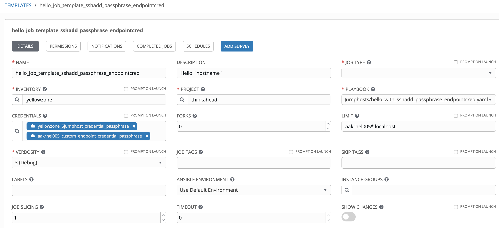

# Multiple Jumphosts in Ansible Tower - Part 4

## Multi jumphost connection hops to Linux hosts using ssh-add to add keys to ssh-agent

[Alexei.Karve](https://developer.ibm.com/recipes/author/karve/)

Tags: Cloud computing, DevOps, Linux

Published on July 5, 2020 / Updated on July 26, 2020


### Overview

Skill Level: Intermediate

Hands on expertise with Ansible Tower/AWX, bash, expect

The ssh-add is used to add ssh keys with optional passphrase to ssh-agent with expect providing passphrases when prompted. We also show the use of separate ssh credentials for each jumphost hop in the path and also a custom endpoint credential type.

### Ingredients

Ansible Tower/AWX

### Step-by-step

#### 1. Introduction

[Part 1](../multiple-jumphosts-in-ansible-tower-part-1/index.md "Multiple Jumphosts in Ansible Tower - Part 1") showed how to configure Ansible Tower to connect via multiple jumphosts to Linux host endpoints using the host variables and custom credential types where the jumphost ssh keys did not have a passphrase. [Part 2](../multiple-jumphosts-in-ansible-tower-part-2/index.md "Multiple Jumphosts in Ansible Tower - Part 2") extended the functionality to allow running jobs on Windows/Linux hosts by creating a ssh tunnel with SOCKS5. [Part 3](../multiple-jumphosts-in-ansible-tower-part-3/index.md "Multiple Jumphosts in Ansible Tower - Part 3") extended this approach further to allow passphrases for the jumphost ssh keys when creating the ssh tunnel as a SOCKS5 proxy. Creating tunnels requires you to create a [Custom Credential Type](https://github.com/thinkahead/DeveloperRecipes/blob/master/Jumphosts/Credentials.md "Custom Credential Type") and a corresponding "Custom Credential" containing the ssh keys for the jumphosts and the corresponding passphrases. Examples were shown with connectivity through upto 5 jumphost hops.

Although we can use tunnels for Linux host endpoints with ProxyCommand using nc (from Mac), ncat, connect-proxy or socat (from Linux), most often Linux host endpoints are configured to use ProxyCommand with ssh as was shown in [Part 1](../multiple-jumphosts-in-ansible-tower-part-1/index.md "Multiple Jumphosts in Ansible Tower - Part 1"). A SOCKS5 tunnel is not really required to connect to Linux host endpoints. We however need to support private ssh key passphrase for the jumphosts for Ansible Tower Automation. In this Part 4, we look at another way where the tunnel does not need to be created for Linux hosts. The nc, ncat, connect-proxy and socat are not required. Instead, we use the ssh-add to add keys to ssh-agent. We will take advantage of the ssh-agent to create a tunnel for use with Windows and conclude with a playbook that can run plays on Linux and Windows hosts in same job with the use of a custom endpoint credential.

#### 2. Add the ssh keys with passphrase to ssh-agent

Typically, for ssh onto a server with a key other than the default user key, the path to the ssh key must be specified with the -i option. Instead of having to specify the -i /path/to/ssh/key option repeatedly, the ssh-agent can be used to load keys into memory with its ssh-add command. The ssh-agent is a helper program that keeps track of identity keys and their passphrases. The agent can then use the keys to log into other servers without having the user type in a password or passphrase again. Ssh will automatically use the keys in memory by trying them consecutively until you get into the target host endpoint. The ssh-agent program outputs commands to set certain environment variables in the shell. The commands output by default are compatible with /bin/sh and /bin/bash. To start the ssh-agent and set the environment variables, we run the ssh-agent with eval because the agent itself doesn't update the current shell with the required environment variables automatically.

eval $(ssh-agent)

The ssh-agent "-A" option forwards keys in memory to the remote server you are accessing. The "-t" option specifies the maximum number of seconds that identities are kept in the agent. The "-s" generates bourne shell commands on stdout. The "-k" kills the agent whose PID is set in the SSH_AGENT_PID environment variable. An expect script can provide the passphrases for the ssh keys during the prompt when the ssh key is added. The SSH_AUTH_SOCK environment variable contains the path of the unix file socket that the agent uses for communication with other processes. This is essential for ssh-add. If we try to run ssh-add without this environment variable set, or with an incorrect one, we will get the following error: "Could not open a connection to your authentication agent.". We need to keep track of our agent's file socket to be able to remember the passphrases for the ssh keys we add.

We will use the following scripts that can add the ssh keys with passphrase for upto 5 jumphosts to an ssh-agent that is already started. This [jumphostlogin.sh](https://github.com/thinkahead/DeveloperRecipes/blob/master/Jumphosts/roles/ansible-role-ssh-add-jumphosts/tasks/jumphostlogin.sh) script is spawned from the [login_with_expect.sh](https://github.com/thinkahead/DeveloperRecipes/blob/master/Jumphosts/roles/ansible-role-ssh-add-jumphosts/tasks/login_with_expect.sh) script that supplies required values to the passphrase prompts of the form "Enter passphrase for key". This jumphostlogin.sh script is different from the previous one with same name in Part 3 that created the tunnel. In this Part 4, it runs ssh-add as shown below:

**jumphostlogin.sh** -- Different from Part 3

``` bash
#!/bin/bash

echo SSH_AUTH_SOCK=$SSH_AUTH_SOCK
echo SSH_AGENT_PID=$SSH_AGENT_PID
if [ ! -z "$endpoint_ssh_private_key_passphrase" ]; then
  echo endpoint=${endpoint_ssh_private_key##*/}
  ssh-add ${endpoint_ssh_private_key}
fi
if [ ! -z "$jh1_ssh_private_key_passphrase" ]; then
  echo jh1=${jh1_ssh_private_key##*/}
  ssh-add ${jh1_ssh_private_key}
fi
if [ ! -z "$jh2_ssh_private_key_passphrase" ]; then
  echo jh2=${jh2_ssh_private_key##*/}
  ssh-add ${jh2_ssh_private_key}
fi
if [ ! -z "$jh3_ssh_private_key_passphrase" ]; then
  echo jh3=${jh3_ssh_private_key##*/}
  ssh-add ${jh3_ssh_private_key}
fi
if [ ! -z "$jh4_ssh_private_key_passphrase" ]; then
  echo jh4=${jh4_ssh_private_key##*/}
  ssh-add ${jh4_ssh_private_key}
fi
if [ ! -z "$jh5_ssh_private_key_passphrase" ]; then
  echo jh5=${jh5_ssh_private_key##*/}
  ssh-add ${jh5_ssh_private_key}
fi
#ps -ef | grep ssh-agent | grep -v grep
echo DONEDONEDONE
echo "ssh-add registered with agent:"
ssh-add -l
```

**login_with_expect.sh** -- Same as in Part 3

``` bash
#!/usr/bin/expect -f
# When expect exits, it sends a SIGHUP (hangup signal) to the spawned subprocess. By default, this SIGHUP causes termination of the spawned process.
# We do not want the ssh tunnel to die from SIGHUP. So, we ask expect to make the process ignore SIGHUP in the spawn line
set timeout 120
spawn -ignore HUP ./jumphostlogin.sh
expect {
      "Are you sure you want to continue connecting*" {
            send "yes\r"
            exp_continue
      }
      "*Enter passphrase for *$env(endpoint_ssh_private_key):*" {
            #puts $env(endpoint_ssh_private_key_passphrase)
            send -- "$env(endpoint_ssh_private_key_passphrase)\r"
            exp_continue
      }
      "*Enter passphrase for *$env(jh1_ssh_private_key):*" {
            #puts $env(jh1_ssh_private_key_passphrase)
            send -- "$env(jh1_ssh_private_key_passphrase)\r"
            exp_continue
      }
      "*Enter passphrase for *$env(jh2_ssh_private_key):*" {
            #puts $env(jh2_ssh_private_key_passphrase)
            send -- "$env(jh2_ssh_private_key_passphrase)\r"
            exp_continue
      }
      "*Enter passphrase for *$env(jh3_ssh_private_key):*" {
            #puts $env(jh3_ssh_private_key_passphrase)
            send -- "$env(jh3_ssh_private_key_passphrase)\r"
            exp_continue
      }
      "*Enter passphrase for *$env(jh4_ssh_private_key):*" {
            #puts $env(jh4_ssh_private_key_passphrase)
            send -- "$env(jh4_ssh_private_key_passphrase)\r"
            exp_continue
      }
      "*Enter passphrase for *$env(jh5_ssh_private_key):*" {
            #puts $env(jh5_ssh_private_key_passphrase)
            send -- "$env(jh5_ssh_private_key_passphrase)\r"
            exp_continue
      }
      "*DONEDONEDONE*" {
        send_user "spawned process backgrounding successful\n"
        #expect_background
        interact
      }
}
exit 0
```

**Example with 5 jumphosts to use the above script**

We will be adding the keys for the jumphosts (in bold) and the endpoint in the following list of hosts:

Laptop -> **ec2-52-201-237-93.compute-1.amazonaws.com -> aakrhel001 -> aakrhel002 -> aakrhel003 -> aakrhel006** -> aakrhel005:2222 (endpoint host)

Kill any old ssh-agents and start a new ssh-agent process

`killall ssh-agent`

Start the ssh-agent. Use the backquote (`), located under the tilde (~), rather than the single quote (').

``eval `ssh-agent -s` ``

Export all the parameters for the jumphosts and endpoint. These parameters will be used in the next section for testing connectivity to the endpoint. When we use Ansible Tower, these values are supplied by the Ansible Tower [custom jumphost credential](https://github.com/thinkahead/DeveloperRecipes/blob/master/Jumphosts/Credentials.md "custom jumphost credential type").

`export endpoint_ssh_private_key=/Users/karve/Downloads/expecttest/alexei-key-ecdsa-aakrhel005`\
`export endpoint_ssh_private_key_passphrase=Passphrase4aakrhel005`\
`export jh5_ssh_private_key=/Users/karve/Downloads/expecttest/alexei-key-ecdsa-aakrhel006`\
`export jh5_ssh_private_key_passphrase=Passphrase4aakrhel006`\
`export jh5_ip=aakrhel006.yellowykt.com`\
`export jh5_ssh_port=22`\
`export jh5_ssh_user=ec2-user`\
`export jh4_ssh_private_key=/Users/karve/Downloads/expecttest/alexei-key-ecdsa-aakrhel003`\
`export jh4_ssh_private_key_passphrase=Passphrase4aakrhel003`\
`export jh4_ip=aakrhel003.yellowykt.com`\
`export jh4_ssh_port=22`\
`export jh4_ssh_user=ec2-user`\
`export jh3_ssh_private_key=/Users/karve/Downloads/expecttest/alexei-key-ecdsa-aakrhel002`\
`export jh3_ssh_private_key_passphrase=Passphrase4aakrhel002`\
`export jh3_ip=aakrhel002.yellowykt.com`\
`export jh3_ssh_port=22`\
`export jh3_ssh_user=ec2-user`\
`export jh2_ssh_private_key=/Users/karve/Downloads/expecttest/alexei-key-ecdsa-aakrhel001`\
`export jh2_ssh_private_key_passphrase=Passphrase4aakrhel001`\
`export jh2_ip=aakrhel001.yellowykt.com`\
`export jh2_ssh_port=22`\
`export jh2_ssh_user=ec2-user`\
`export jh1_ssh_private_key=/Users/karve/Downloads/expecttest/alexei-key-ecdsa-jumphost`\
`export jh1_ssh_private_key_passphrase=Passphrase4ec2`\
`export jh1_ip=ec2-52-201-237-93.compute-1.amazonaws.com`\
`export jh1_ssh_port=22`\
`export jh1_ssh_user=ec2-user`

Run the login_with_expect to store the ssh passphrase in ssh-agent and list the added keys

`./login_with_expect.sh`\
`ssh-add -l`

#### 3. Connect to Linux hosts with keys added to ssh-agent

**1\. Using ssh**

Let's use the following command that will login via the 5 jumphosts as an example (you can replace with a command that may use a fewer number of jumphost hops):

`cmd="ssh ec2-user@aakrhel005.yellowykt.com -p 2222 -i $endpoint_ssh_private_key -o StrictHostKeyChecking=no -o UserKnownHostsFile=/dev/null -A -oStrictHostKeyChecking=no -oUserKnownHostsFile=/dev/null -oProxyCommand=\"ssh -i $jh5_ssh_private_key -W %h:%p -oStrictHostKeyChecking=no -oUserKnownHostsFile=/dev/null -oProxyCommand=\\\"ssh -i $jh4_ssh_private_key -W aakrhel006.yellowykt.com:22 -oStrictHostKeyChecking=no -oUserKnownHostsFile=/dev/null -oProxyCommand=\\\\\\\"ssh -i $jh3_ssh_private_key -W aakrhel003.yellowykt.com:22 -oStrictHostKeyChecking=no -oUserKnownHostsFile=/dev/null -oProxyCommand=\\\\\\\\\\\\\\\"ssh -i $jh2_ssh_private_key -W aakrhel002.yellowykt.com:22 -oStrictHostKeyChecking=no -oUserKnownHostsFile=/dev/null -oProxyCommand=\\\\\\\\\\\\\\\\\\\\\\\\\\\\\\\"ssh -i $jh1_ssh_private_key -W aakrhel001.yellowykt.com:22 -oStrictHostKeyChecking=no -oUserKnownHostsFile=/dev/null ec2-user@ec2-52-201-237-93.compute-1.amazonaws.com\\\\\\\\\\\\\\\\\\\\\\\\\\\\\\\" ec2-user@aakrhel001.yellowykt.com\\\\\\\\\\\\\\\" ec2-user@aakrhel002.yellowykt.com\\\\\\\" ec2-user@aakrhel003.yellowykt.com\\\" ec2-user@aakrhel006.yellowykt.com\" hostname;true"`

`eval $cmd`

Output:

`Warning: Permanently added 'ec2-52-201-237-93.compute-1.amazonaws.com,52.201.237.93' (ECDSA) to the list of known hosts.`\
`Warning: Permanently added 'aakrhel001.yellowykt.com' (ECDSA) to the list of known hosts.`\
`Warning: Permanently added 'aakrhel002.yellowykt.com' (ECDSA) to the list of known hosts.`\
`Warning: Permanently added 'aakrhel003.yellowykt.com' (ECDSA) to the list of known hosts.`\
`Warning: Permanently added 'aakrhel006.yellowykt.com' (ECDSA) to the list of known hosts.`\
`Warning: Permanently added '[aakrhel005.yellowykt.com]:2222' (ECDSA) to the list of known hosts.`\
`Authorized uses only. All activity may be monitored and reported.`

`aakrhel005`

**2\. Using Ansible**

Create the ansible_ssh_common_args that is passed to ansible:

`ansible_ssh_common_args='-A -oStrictHostKeyChecking=no -oUserKnownHostsFile=/dev/null -oProxyCommand="ssh -i '$jh5_ssh_private_key' -W %h:%p -oStrictHostKeyChecking=no -oUserKnownHostsFile=/dev/null -oProxyCommand=\"ssh -i '$jh4_ssh_private_key' -W '$jh5_ip':'$jh5_ssh_port' -oStrictHostKeyChecking=no -oUserKnownHostsFile=/dev/null -oProxyCommand=\\\"ssh -i '$jh3_ssh_private_key' -W '$jh4_ip':'$jh4_ssh_port' -oStrictHostKeyChecking=no -oUserKnownHostsFile=/dev/null -oProxyCommand=\\\\\\\"ssh -i '$jh2_ssh_private_key' -W '$jh3_ip':'$jh3_ssh_port' -oStrictHostKeyChecking=no -oUserKnownHostsFile=/dev/null -oProxyCommand=\\\\\\\\\\\\\\\"ssh -i '$jh1_ssh_private_key' -W '$jh2_ip':'$jh2_ssh_port' -oStrictHostKeyChecking=no -oUserKnownHostsFile=/dev/null '$jh1_ssh_user'@'$jh1_ip'\\\\\\\\\\\\\\\" '$jh2_ssh_user'@'$jh2_ip'\\\\\\\" '$jh3_ssh_user'@'$jh3_ip'\\\" '$jh4_ssh_user'@'$jh4_ip'\" '$jh5_ssh_user'@'$jh5_ip'"'`

**2a. Using ansible with the ssh-common-args argument**

ansible -vvv -i "aakrhel005.yellowykt.com," aakrhel005.yellowykt.com -m ping -e "ansible_user=ec2-user" -e "ansible_ssh_private_key_file=~/amazontestkey.pem" -e "ansible_port=2222" **--ssh-common-args**="$ansible_ssh_common_args"

This expands to:

`ansible -vvv -i "aakrhel005.yellowykt.com," aakrhel005.yellowykt.com -m ping -e "ansible_user=ec2-user" -e "ansible_ssh_private_key_file=~/amazontestkey.pem" -e "ansible_port=2222" --ssh-common-args="-A -oStrictHostKeyChecking=no -oUserKnownHostsFile=/dev/null -oProxyCommand=\"ssh -i $jh5_ssh_private_key -W %h:%p -oStrictHostKeyChecking=no -oUserKnownHostsFile=/dev/null -oProxyCommand=\\\"ssh -i $jh4_ssh_private_key -W aakrhel006.yellowykt.com:22 -oStrictHostKeyChecking=no -oUserKnownHostsFile=/dev/null -oProxyCommand=\\\\\\\"ssh -i $jh3_ssh_private_key -W aakrhel003.yellowykt.com:22 -oStrictHostKeyChecking=no -oUserKnownHostsFile=/dev/null -oProxyCommand=\\\\\\\\\\\\\\\"ssh -i $jh2_ssh_private_key -W aakrhel002.yellowykt.com:22 -oStrictHostKeyChecking=no -oUserKnownHostsFile=/dev/null -oProxyCommand=\\\\\\\\\\\\\\\\\\\\\\\\\\\\\\\"ssh -i $jh1_ssh_private_key -W aakrhel001.yellowykt.com:22 -oStrictHostKeyChecking=no -oUserKnownHostsFile=/dev/null ec2-user@ec2-52-201-237-93.compute-1.amazonaws.com\\\\\\\\\\\\\\\\\\\\\\\\\\\\\\\" ec2-user@aakrhel001.yellowykt.com\\\\\\\\\\\\\\\" ec2-user@aakrhel002.yellowykt.com\\\\\\\" ec2-user@aakrhel003.yellowykt.com\\\" ec2-user@aakrhel006.yellowykt.com\""`

Output:

```
aakrhel005.yellowykt.com | SUCCESS => {
    "ansible_facts": {
        "discovered_interpreter_python": "/usr/bin/python"
    },
    "changed": false,
    "invocation": {
        "module_args": {
            "data": "pong"
        }
    },
    "ping": "pong"
}
```

**2b. Using ansible with the extra-vars to pass the ansible_ssh_common_args**

ansible -vvv -i "aakrhel005.yellowykt.com," aakrhel005.yellowykt.com -m command -a "uname -a" -e "ansible_user=ec2-user" -e "ansible_ssh_private_key_file=~/amazontestkey.pem" -e "ansible_port=2222" -e '{**"ansible_ssh_common_args"**:'"$ansible_ssh_common_args"'}'

This expands to:

`ansible -vvv -i "aakrhel005.yellowykt.com," aakrhel005.yellowykt.com -m command -a "uname -a" -e "ansible_user=ec2-user" -e "ansible_ssh_private_key_file=~/amazontestkey.pem" -e "ansible_port=2222" -e '{"ansible_ssh_common_args": "-A -oStrictHostKeyChecking=no -oUserKnownHostsFile=/dev/null -oProxyCommand=\"ssh -i $jh5_ssh_private_key -W %h:%p -oStrictHostKeyChecking=no -oUserKnownHostsFile=/dev/null -oProxyCommand=\\\"ssh -i $jh4_ssh_private_key -W aakrhel006.yellowykt.com:22 -oStrictHostKeyChecking=no -oUserKnownHostsFile=/dev/null -oProxyCommand=\\\\\\\"ssh -i $jh3_ssh_private_key -W aakrhel003.yellowykt.com:22 -oStrictHostKeyChecking=no -oUserKnownHostsFile=/dev/null -oProxyCommand=\\\\\\\\\\\\\\\"ssh -i $jh2_ssh_private_key -W aakrhel002.yellowykt.com:22 -oStrictHostKeyChecking=no -oUserKnownHostsFile=/dev/null -oProxyCommand=\\\\\\\\\\\\\\\\\\\\\\\\\\\\\\\"ssh -i $jh1_ssh_private_key -W aakrhel001.yellowykt.com:22 -oStrictHostKeyChecking=no -oUserKnownHostsFile=/dev/null ec2-user@ec2-52-201-237-93.compute-1.amazonaws.com\\\\\\\\\\\\\\\\\\\\\\\\\\\\\\\" ec2-user@aakrhel001.yellowykt.com\\\\\\\\\\\\\\\" ec2-user@aakrhel002.yellowykt.com\\\\\\\" ec2-user@aakrhel003.yellowykt.com\\\" ec2-user@aakrhel006.yellowykt.com\""}'`

Output:

`aakrhel005.yellowykt.com | CHANGED | rc=0 >>`\
`Linux aakrhel005 3.10.0-514.el7.x86_64 #1 SMP Wed Oct 19 11:24:13 EDT 2016 x86_64 x86_64 x86_64 GNU/Linux`

If you see the error "Received disconnect from x.x.x.x port 22:2: Too many authentication failures" with ssh command when ssh-agent is running, it means you may need to add the "-o IdentitiesOnly=yes" to the ssh command and provide the IdentityFile directly. This error results from existence of many ssh identity keys, and each time the ssh client is run, it will try all the ssh keys known by the ssh-agent and the other keys in the ssh_config and command line when attempting to connect to the remote server. Since ssh server (sshd) on the remote server expects a particular identity key, the server rejects the connection and ssh client aborts with the above error. Too many rejects cause this error. The "-o IdentitiesOnly=yes" instructs ssh to only use the authentication identity files specified on the command line or those configured in the ssh_config file(s), even if ssh-agent offers additional identities. The ssh parameters of the forms "-i" and "-o IdentityFile=" are interchangeable. With the "-i" parameter, the ssh will automatically use the corresponding ssh key with passphrase that was added to ssh-agent.

#### 4. Using ssh-agent in Ansible Tower

A role [ansible-role-ssh-add-jumphosts](https://github.com/thinkahead/DeveloperRecipes/tree/master/Jumphosts/roles/ansible-role-ssh-add-jumphosts) calls the expect script with the jumphost credentials. Similar to the example with 5 jumphosts above in Section 2, the [tasks/main.yaml](https://github.com/thinkahead/DeveloperRecipes/blob/master/Jumphosts/roles/ansible-role-ssh-add-jumphosts/tasks/main.yml) exports the required ssh parameters for the jumphosts. Similar to the Section 3, it also sets the ansible_ssh_common_args with the multiple ProxyCommand required across the multiple jumphosts. It allows credential types that supply upto 5 jumphosts. In previous parts, we had to set the ansible_ssh_common_args in the host variables in the inventory. Now the role sets it based on the jumphost credential type passed to the job using set_fact.

Typically the following steps are used from Ansible Tower:

1.  Ansible Tower runs the ssh-agent with arguments to start a new shell, which then inherits the environment variables from the ssh-agent processand runs the playbook. Subsequent processes inherit the SSH_AUTH_SOCK environment variable.
2.  Another ssh-agent daemon is started with eval to store the ssh-agent socket in the environment variable SSH_AUTH_SOCK of the starting process.
3.  Running ssh-add prompts you for your passphrase, uses your passphrase to decrypt the private key and loads its into the ssh-agent. This is done by the expect script.
4.  Run ssh so that it uses the correct SSH_AUTH_SOCK; the new ssh process uses the socket in SSH_AUTH_SOCK to ask ssh-agent for private keys.
5.  The ssh process along with ssh-agent allow login to the remote system without needing to input the passphrase again.  

The complete "tasks/main.yml" is shown below:
```
---
- shell: |
    echo '{"SSH_AUTH_SOCK":"'$SSH_AUTH_SOCK'","SSH_AGENT_PID":"'$SSH_AGENT_PID'"}'
  register: env_vars_stdout_temp
  when: env_vars is not defined
- set_fact:
    env_vars: "{{ env_vars | default(env_vars_stdout_temp.stdout) }}"
- name: Adding ssh keys optionally with passphrase to ssh-agent
  #no_log: true
  shell: |
    export endpoint_ssh_private_key="{{ endpoint_ssh_private_key if (endpoint_ssh_private_key is defined and endpoint_ssh_private_key!='') else 'undefined-endpoint_ssh_private_key' }}"
    export endpoint_ssh_private_key_passphrase="{{ endpoint_ssh_private_key_passphrase }}"

    export jh5_ssh_private_key="{{ jh5_ssh_private_key if (jh5_ssh_private_key is defined and jh5_ssh_private_key!='') else 'undefined-jh5_ssh_private_key' }}"
    export jh5_ssh_private_key_passphrase="{{ jh5_ssh_private_key_passphrase }}"
    export jh5_ip="{{ jh5_ip if jh5_ip is defined else '' }}"
    export jh5_ssh_port="{{ jh5_ssh_port if jh5_ssh_port is defined else '' }}"
    export jh5_ssh_user="{{ jh5_ssh_user if jh5_ssh_user is defined else '' }}"

    export jh4_ssh_private_key="{{ jh4_ssh_private_key if (jh4_ssh_private_key is defined and jh4_ssh_private_key!='') else 'undefined-jh4_ssh_private_key' }}"
    export jh4_ssh_private_key_passphrase="{{ jh4_ssh_private_key_passphrase }}"
    export jh4_ip="{{ jh4_ip if jh4_ip is defined else '' }}"
    export jh4_ssh_port="{{ jh4_ssh_port if jh4_ssh_port is defined else '' }}"
    export jh4_ssh_user="{{ jh4_ssh_user if jh4_ssh_user is defined else '' }}"

    export jh3_ssh_private_key="{{ jh3_ssh_private_key if (jh3_ssh_private_key is defined and jh3_ssh_private_key!='') else 'undefined-jh3_ssh_private_key' }}"
    export jh3_ssh_private_key_passphrase="{{ jh3_ssh_private_key_passphrase }}"
    export jh3_ip="{{ jh3_ip if jh3_ip is defined else '' }}"
    export jh3_ssh_port="{{ jh3_ssh_port if jh3_ssh_port is defined else '' }}"
    export jh3_ssh_user="{{ jh3_ssh_user if jh3_ssh_user is defined else '' }}"

    export jh2_ssh_private_key="{{ jh2_ssh_private_key if (jh2_ssh_private_key is defined and jh2_ssh_private_key!='') else 'undefined-jh2_ssh_private_key' }}"
    export jh2_ssh_private_key_passphrase="{{ jh2_ssh_private_key_passphrase }}"
    export jh2_ip="{{ jh2_ip if jh2_ip is defined else '' }}"
    export jh2_ssh_port="{{ jh2_ssh_port if jh2_ssh_port is defined else '' }}"
    export jh2_ssh_user="{{ jh2_ssh_user if jh2_ssh_user is defined else '' }}"

    # The jh1_ssh_private_key and jh1_ssh_private_key_passphrase are environment variables, so must check they are not empty
    export jh1_ssh_private_key="{{ jh1_ssh_private_key if (jh1_ssh_private_key is defined and jh1_ssh_private_key!='') else (jh_ssh_private_key if (jh_ssh_private_key is defined and jh_ssh_private_key!='') else 'undefined-jh1_ssh_private_key') }}"
    export jh1_ssh_private_key_passphrase="{{ jh1_ssh_private_key_passphrase if (jh1_ssh_private_key_passphrase!='') else jh_ssh_private_key_passphrase }}"
    export jh1_ip="{{ jh1_ip if jh1_ip is defined else (jh_ip if jh_ip is defined else '') }}"
    export jh1_ssh_port="{{ jh1_ssh_port if jh1_ssh_port is defined else (jh_ssh_port if jh_ssh_port is defined else '') }}"
    export jh1_ssh_user="{{ jh1_ssh_user if jh1_ssh_user is defined else (jh_ssh_user if jh_ssh_user is defined else '') }}"

    export jh1_socks_port="{{ jh1_socks_port if jh1_socks_port is defined else (jh_socks_port if jh_socks_port is defined else '') }}"
    #olddir=`pwd`
    #echo "{{ role_path if role_path is defined else 'roles' }}"
    #ls "{{ role_path if role_path is defined else 'roles' }}"
    cd "{{ role_path if role_path is defined else 'roles' }}/tasks"
    #ls -las ssh-find-agent.sh
    #eval `ssh-agent -s -t 20` # Don't start new agent
    #eval `ssh-agent -s` # Don't start new agent
    echo $SSH_AUTH_SOCK
    echo $SSH_AGENT_PID
    #. ./ssh-find-agent.sh
    #ssh_find_agent -a || eval $(ssh-agent -s)
    #echo $SSH_AUTH_SOCK
    ./login_with_expect.sh # provides passphrase where required by spawning ./jumphostlogin.sh to establish the tunnel
    #cd "${olddir}"
    ssh-add -l
    ps -ef | grep ssh-agent
    true

- name: 0 jumphosts
  set_fact:
    ansible_ssh_common_args: '-oStrictHostKeyChecking=no -oUserKnownHostsFile=/dev/null'
  when: jh_ip is not defined and jh1_ip is not defined and jh2_ip is not defined and jh3_ip is not defined and jh4_ip is not defined and jh5_ip is not defined

- name: 1 jumphost jh
  set_fact:
    ansible_ssh_common_args: '{{ "-oIdentityAgent="+env_vars.SSH_AUTH_SOCK if (endpoint_ssh_private_key is defined and endpoint_ssh_private_key!="") else "" }} -oStrictHostKeyChecking=no -oUserKnownHostsFile=/dev/null -oProxyCommand="ssh -i {{ jh_ssh_private_key }} -W %h:%p -oIdentityAgent={{ env_vars.SSH_AUTH_SOCK }} -oStrictHostKeyChecking=no -oUserKnownHostsFile=/dev/null {{ jh_ssh_user }}@{{ jh_ip }}"'
  when: jh_ip is defined and jh1_ip is not defined and jh2_ip is not defined and jh3_ip is not defined and jh4_ip is not defined and jh5_ip is not defined

- name: 1 jumphost jh1
  set_fact:
    ansible_ssh_common_args: '{{ "-oIdentityAgent="+env_vars.SSH_AUTH_SOCK if (endpoint_ssh_private_key is defined and endpoint_ssh_private_key!="") else "" }} -oStrictHostKeyChecking=no -oUserKnownHostsFile=/dev/null -oProxyCommand="ssh -i {{ jh1_ssh_private_key }} -W %h:%p -oIdentityAgent={{ env_vars.SSH_AUTH_SOCK }} -oStrictHostKeyChecking=no -oUserKnownHostsFile=/dev/null {{ jh1_ssh_user }}@{{ jh1_ip }}"'
  when: jh_ip is not defined and jh1_ip is defined and jh2_ip is not defined and jh3_ip is not defined and jh4_ip is not defined and jh5_ip is not defined

- name: 2 jumphosts
  set_fact:
    ansible_ssh_common_args: '{{ "-oIdentityAgent="+env_vars.SSH_AUTH_SOCK if (endpoint_ssh_private_key is defined and endpoint_ssh_private_key!="") else "" }} -oStrictHostKeyChecking=no -oUserKnownHostsFile=/dev/null -oProxyCommand="ssh -i {{ jh2_ssh_private_key }} -W %h:%p -oIdentityAgent={{ env_vars.SSH_AUTH_SOCK }} -oStrictHostKeyChecking=no -oUserKnownHostsFile=/dev/null -oProxyCommand=\"ssh -i {{ jh1_ssh_private_key }} -W {{ jh2_ip }}:{{ jh2_ssh_port }} -oIdentityAgent={{ env_vars.SSH_AUTH_SOCK }} -oStrictHostKeyChecking=no -oUserKnownHostsFile=/dev/null {{ jh1_ssh_user }}@{{ jh1_ip }}\" {{ jh2_ssh_user }}@{{ jh2_ip }}"'
  when: jh1_ip is defined and jh2_ip is defined and jh3_ip is not defined and jh4_ip is not defined and jh5_ip is not defined

- name: 3 jumphosts
  set_fact:
    ansible_ssh_common_args: '{{ "-oIdentityAgent="+env_vars.SSH_AUTH_SOCK if (endpoint_ssh_private_key is defined and endpoint_ssh_private_key!="") else "" }} -oStrictHostKeyChecking=no -oUserKnownHostsFile=/dev/null -oProxyCommand="ssh -i {{ jh3_ssh_private_key }} -W %h:%p -oIdentityAgent={{ env_vars.SSH_AUTH_SOCK }} -oStrictHostKeyChecking=no -oUserKnownHostsFile=/dev/null -oProxyCommand=\"ssh -i {{ jh2_ssh_private_key }} -W {{ jh3_ip }}:{{ jh3_ssh_port }} -oIdentityAgent={{ env_vars.SSH_AUTH_SOCK }} -oStrictHostKeyChecking=no -oUserKnownHostsFile=/dev/null -oProxyCommand=\\\"ssh -i {{ jh1_ssh_private_key }} -W {{ jh2_ip }}:{{ jh2_ssh_port }} -oIdentityAgent={{ env_vars.SSH_AUTH_SOCK }} -oStrictHostKeyChecking=no -oUserKnownHostsFile=/dev/null {{ jh1_ssh_user }}@{{ jh1_ip }}\\\" {{ jh2_ssh_user }}@{{ jh2_ip }}\" {{ jh3_ssh_user }}@{{ jh3_ip }}"'
  when: jh1_ip is defined and jh2_ip is defined and jh3_ip is defined and jh4_ip is not defined and jh5_ip is not defined

- name: 4 jumphosts
  set_fact:
    ansible_ssh_common_args: '{{ "-oIdentityAgent="+env_vars.SSH_AUTH_SOCK if (endpoint_ssh_private_key is defined and endpoint_ssh_private_key!="") else "" }} -oStrictHostKeyChecking=no -oUserKnownHostsFile=/dev/null -oProxyCommand="ssh -i {{ jh4_ssh_private_key }} -W %h:%p -oIdentityAgent={{ env_vars.SSH_AUTH_SOCK }} -oStrictHostKeyChecking=no -oUserKnownHostsFile=/dev/null -oProxyCommand=\"ssh -i {{ jh3_ssh_private_key }} -W {{ jh4_ip }}:{{ jh4_ssh_port }} -oIdentityAgent={{ env_vars.SSH_AUTH_SOCK }} -oStrictHostKeyChecking=no -oUserKnownHostsFile=/dev/null -oProxyCommand=\\\"ssh -i {{ jh2_ssh_private_key }} -W {{ jh3_ip }}:{{ jh3_ssh_port }} -oIdentityAgent={{ env_vars.SSH_AUTH_SOCK }} -oStrictHostKeyChecking=no -oUserKnownHostsFile=/dev/null -oProxyCommand=\\\\\\\"ssh -i {{ jh1_ssh_private_key }} -W {{ jh2_ip }}:{{ jh2_ssh_port }} -oIdentityAgent={{ env_vars.SSH_AUTH_SOCK }} -oStrictHostKeyChecking=no -oUserKnownHostsFile=/dev/null {{ jh1_ssh_user }}@{{ jh1_ip }}\\\\\\\" {{ jh2_ssh_user }}@{{ jh2_ip }}\\\" {{ jh3_ssh_user }}@{{ jh3_ip }}\" {{ jh4_ssh_user }}@{{ jh4_ip }}"'
  when: jh1_ip is defined and jh2_ip is defined and jh3_ip is defined and jh4_ip is defined and jh5_ip is not defined

- name: 5 jumphosts
  set_fact:
    ansible_ssh_common_args: '{{ "-oIdentityAgent="+env_vars.SSH_AUTH_SOCK if (endpoint_ssh_private_key is defined and endpoint_ssh_private_key!="") else "" }} -oStrictHostKeyChecking=no -oUserKnownHostsFile=/dev/null -oProxyCommand="ssh -i {{ jh5_ssh_private_key }} -W %h:%p -oIdentityAgent={{ env_vars.SSH_AUTH_SOCK }} -oStrictHostKeyChecking=no -oUserKnownHostsFile=/dev/null -oProxyCommand=\"ssh -i {{ jh4_ssh_private_key }} -W {{ jh5_ip }}:{{ jh5_ssh_port }} -oIdentityAgent={{ env_vars.SSH_AUTH_SOCK }} -oStrictHostKeyChecking=no -oUserKnownHostsFile=/dev/null -oProxyCommand=\\\"ssh -i {{ jh3_ssh_private_key }} -W {{ jh4_ip }}:{{ jh4_ssh_port }} -oIdentityAgent={{ env_vars.SSH_AUTH_SOCK }} -oStrictHostKeyChecking=no -oUserKnownHostsFile=/dev/null -oProxyCommand=\\\\\\\"ssh -i {{ jh2_ssh_private_key }} -W {{ jh3_ip }}:{{ jh3_ssh_port }} -oIdentityAgent={{ env_vars.SSH_AUTH_SOCK }} -oStrictHostKeyChecking=no -oUserKnownHostsFile=/dev/null -oProxyCommand=\\\\\\\\\\\\\\\"ssh -i {{ jh1_ssh_private_key }} -W {{ jh2_ip }}:{{ jh2_ssh_port }} -oIdentityAgent={{ env_vars.SSH_AUTH_SOCK }} -oStrictHostKeyChecking=no -oUserKnownHostsFile=/dev/null {{ jh1_ssh_user }}@{{ jh1_ip }}\\\\\\\\\\\\\\\" {{ jh2_ssh_user }}@{{ jh2_ip }}\\\\\\\" {{ jh3_ssh_user }}@{{ jh3_ip }}\\\" {{ jh4_ssh_user }}@{{ jh4_ip }}\" {{ jh5_ssh_user }}@{{ jh5_ip }}"'
  when: jh1_ip is defined and jh2_ip is defined and jh3_ip is defined and jh4_ip is defined and jh5_ip is defined
```

A sample template "hello_job_template_sshadd_passphrase" in Ansible Tower is shown below that uses the hello_with_sshadd_passphrase.yaml playbook. The two credentials are: the custom jumphost credential yellowzone_5jumphost_credential_passphrase and the machine credential aakrhel005_ec2-user_machine_credential_passphrase.


The playbook [hello_with_sshadd_passphrase.yaml](https://github.com/thinkahead/DeveloperRecipes/blob/master/Jumphosts/hello_with_sshadd_passphrase.yaml) is as follows:

``` yaml
---
- hosts: localhost
  connection: local
  gather_facts: no
  tasks:
    - name: Start ssh-agent and Retrieve the SSH_AUTH_SOCK and SSH_AGENT_PID environment variables
      shell: |
        eval $(ssh-agent -s) > /dev/null
        echo '{"SSH_AUTH_SOCK":"'$SSH_AUTH_SOCK'","SSH_AGENT_PID":"'$SSH_AGENT_PID'"}'
      register: env_vars_stdout
    - set_fact:
        env_vars: "{{ env_vars_stdout.stdout }}"
    - name: Print the environment variables
      debug:
        msg: "{{ env_vars }}"

- name: Role ensures that ssh key passphrases are added to ssh-agent
  hosts: localhost
  connection: local
  gather_facts: no
  environment: "{{ env_vars }}"
  roles:
    - ansible-role-ssh-add-jumphosts

- hosts: all
  gather_facts: no
  vars:
     ansible_ssh_common_args: "{{ hostvars['127.0.0.1']['ansible_ssh_common_args'] }}"
  tasks:
    - shell: echo Hello `hostname`
      register: result
    - debug:
        msg: "{{ result }}"

- hosts: localhost
  connection: local
  gather_facts: no
  tasks:
    - name: Kill the ssh-agent
      shell: |
        echo $SSH_AUTH_SOCK
        echo $SSH_AGENT_PID
        ssh-agent -k
      environment: "{{ env_vars }}"
```

The output from the job run shows the ssh_add in the image below:


This [hello_with_sshadd_passphrase.yaml](https://github.com/thinkahead/DeveloperRecipes/blob/master/Jumphosts/hello_with_sshadd_passphrase.yaml "hello_with_sshadd_passphrase.yaml") has the [first play](https://github.com/thinkahead/DeveloperRecipes/blob/master/Jumphosts/hello_with_sshadd_passphrase.yaml#L2,L15 "Start ssh-agent and Retrieve the SSH_AUTH_SOCK and SSH_AGENT_PID environment variables") running on localhost that [starts the ssh-agent](https://github.com/thinkahead/DeveloperRecipes/blob/master/Jumphosts/hello_with_sshadd_passphrase.yaml#L8 "starts the ssh-agent") and retrieves the two environment variables (env_vars) for the ssh-agent: SSH_AUTH_SOCK and SSH_AGENT_PID. These env_vars are used in the [second play](https://github.com/thinkahead/DeveloperRecipes/blob/master/Jumphosts/hello_with_sshadd_passphrase.yaml#L17,L23 "Role ensures that the socks tunnel is setup") that runs on localhost to include the role [ansible-role-ssh-add-jumphosts](https://github.com/thinkahead/DeveloperRecipes/tree/master/Jumphosts/roles/ansible-role-ssh-add-jumphosts). In this role, the expect script provides the passphrase at the prompts for the ssh_add for the jumphost ssh keys. The [main.yml](https://github.com/thinkahead/DeveloperRecipes/blob/master/Jumphosts/roles/ansible-role-ssh-add-jumphosts/tasks/main.yml "main.yml") also computes the ansible_ssh_common_args containing the multiple ProxyCommand. In the [third play](https://github.com/thinkahead/DeveloperRecipes/blob/master/Jumphosts/hello_with_sshadd_passphrase.yaml#L25,L33 "echo Hello `hostname`"), the task to "echo Hello" runs on the host endpoints. This task sets the vars ansible_ssh_common_args: "{{ hostvars['127.0.0.1']['ansible_ssh_common_args'] }}". **You should remove any ansible_ssh_common_args set in host/group/inventory variables in Ansible Tower because we want to use this variable from the playbook.** In previous Part 1, Part 2, and Part 3 we used variables that were set at either the inventory, group, or host level. In this Part 4, we used variables in the playbook at the play level by generating them in a previous play. Since the set_fact 'ansible_ssh_common_args' was done on a play running on localhost, the next play retrieves it as hostvars['127.0.0.1']['ansible_ssh_common_args']. The [final play](https://github.com/thinkahead/DeveloperRecipes/blob/master/Jumphosts/hello_with_sshadd_passphrase.yaml#L35,L44 "Kill the ssh-agent SSH_AGENT_PID") runs again on localhost and kills the ssh-agent process using the env_vars by calling the "ssh-agent -k".

There is a problem with using multiple ssh-agent through Tower. When Tower creates a job with JOB ISOLATION, it starts a new ssh-agent as follows:

`ssh-agent sh -c ssh-add /tmp/awx_10604_4_9q6pim/artifacts/10604/ssh_key_data && rm -f /tmp/awx_10604_4_9q6pim/artifacts/10604/ssh_key_data && ansible-playbook -v -i /tmp/awx_10604_4_9q6pim/inventory/hosts -e @/tmp/awx_10604_4_9q6pim/env/extravars project_update.yml`

We do not use the variables SSH_AUTH_SOCK and SSH_AGENT_PID for this ssh-agent, instead we start a new ssh-agent in our playbook and collect the environment variables SSH_AUTH_SOCK and SSH_AGENT_PID for this new ssh-agent process. We add the ssh keys with passphrase to this new ssh-agent process that we started. Now we want to run the shell module on other hosts with "hosts: all". However, the ssh command that establishes the connection to the host endpoints that runs on localhost does not see these environment variables SSH_AUTH_SOCK and SSH_AGENT_PID that we would like to set. For each play, the environment variables set using "environment:" only affect the tasks that are run on the hosts for that play. If it is on "hosts: localhost", then the environment variables are visible on localhost. If "hosts: all" (this is our situation), then the environment variable will be visible only on the host endpoints targeted by "all" (but not available to ssh command on localhost). Thus, in essence, the problem is that ssh-agent that we started is running on localhost (on Tower celery/task container) but the keys we added with the passphrase to this ssh-agent process do not get used when Ansible Tower establishes a ssh connection to the host endpoints.

**How do we inform local ssh command about this new ssh-agent?** We cannot do that through environment variables. Is there a parameter that can tell the ssh command about this new ssh-agent? Yes, the [IdentityAgent](https://man.openbsd.org/ssh_config.5#IdentityAgent). We can set the ansible_ssh_common_args: "-o IdentityAgent={{ env_vars.SSH_AUTH_SOCK }}" to run tasks that use our ssh-agent to authenticate to hosts. Also note that the -oIdentityAgent needs to be added to each ssh in the ProxyCommand that requires a passphrase. It should not be added to top level (outside the ProxyCommand) because at that level, ssh needs to use the ssh-agent started by Ansible Tower job. Ansible Tower uses the ssh-agent that it starts to provides the passphrase for the machine credential for the host endpoint as seen in the "ssh-agent sh -c ssh-add $keypath" before invoking the ansible-playbook command.

**Can we use this ssh-agent started by the Tower for our ssh-keys?** Of course we can. This is shown in [hello_with_sshadd_passphrase_no_new_sshagent.yaml](https://github.com/thinkahead/DeveloperRecipes/blob/master/Jumphosts/hello_with_sshadd_passphrase_no_new_sshagent.yaml#L8 "hello_with_sshadd_passphrase_no_new_sshagent.yaml"). Since we do not start a new agent, we do not need to kill the agent either so the [last play can be removed](https://github.com/thinkahead/DeveloperRecipes/blob/master/Jumphosts/hello_with_sshadd_passphrase_no_new_sshagent.yaml#L42-L51 "last play can be removed"). The ssh-agent -k is commented out in this new playbook. The playbook shows the machine credential that was added by Ansible Tower [before](https://github.com/thinkahead/DeveloperRecipes/blob/master/Jumphosts/hello_with_sshadd_passphrase_no_new_sshagent.yaml#L16-L18 "before") and [after](https://github.com/thinkahead/DeveloperRecipes/blob/master/Jumphosts/hello_with_sshadd_passphrase_no_new_sshagent.yaml#L28-L30 "after") the jumphost keys are added. Why did we go through the process of starting our own ssh-agent earlier? To prevent the "Too many authentication failures" caused by reasons mentioned in Section 3 earlier. We may have host endpoints or jumphosts that have a low setting for MaxAuthTries in /etc/ssh/sshd_config. For example:

MaxAuthTries 3

If your automation does not have control over the settings on the jumphost ssh server and cannot be increased to allow retries upto the total number of jumphosts, this low value for MaxAuthTries needs to be handled in Ansible Tower (from the ssh client side). We need some way to avoid one ssh-agent providing all the ssh keys. This section showed how to start our own ssh-agent, add keys to it and use that agent with the IdentyAgent parameter to ssh. You can start as many ssh-agents as required. The extreme could be to use a new ssh-agent per key and thus avoid the "Too many authentication failures" completely.

#### 5. Custom Host Endpoint Credential

We have two options to pass host endpoint credential to our job template:

   1. Create a Tower Machine Credential (with or without ssh key passphrase) -- This option was shown in section 4 above.

   2. Create our own Custom Endpoint Credential Type and Credential from this type (with or without ssh key passphrase) -- This will require a new playbook to handle the endpoint credential. The [hello_with_sshadd_passphrase_endpointcred.yaml](https://github.com/thinkahead/DeveloperRecipes/blob/master/Jumphosts/hello_with_sshadd_passphrase_endpointcred.yaml) playbook handles both the Machine Credential and the Endpoint Credential (only one of these is passed along with a Jumphost Credential). With the Custom Endpoint credential (instead of using the Machine credential), the IdentityAgent that stores the passphrase will have to be added at the top level outside the ProxyCommand. This is what is done by the following expression in the [ansible-role-ssh-add-jumphosts/tasks/main.yml](https://github.com/thinkahead/DeveloperRecipes/blob/master/Jumphosts/roles/ansible-role-ssh-add-jumphosts/tasks/main.yml#L63 "IdentityAgent at top level")

  `"-oIdentityAgent="+env_vars.SSH_AUTH_SOCK if (endpoint_ssh_private_key is defined and endpoint_ssh_private_key!="") else ""`

**endpoint_credential_type**

This [endpoint_credential_type](https://github.com/thinkahead/DeveloperRecipes/blob/master/Jumphosts/EndpointCredential.md "Custom Endpoint Credential") is essentially a clone of the single jumphost credential type. We do not need to use the endpoint_ip, endpoint_ssh_port, endpoint_ssh_user because we get them from the Inventory. We can use the ansible_host, ansible_port and ansible_user host variables.

INPUT CONFIGURATION:

``` yaml
fields:
  - id: endpoint_ip
    type: string
    label: Endpoint IP Address
  - id: endpoint_ssh_user
    type: string
    label: Username to login with ssh in endpoint
  - id: endpoint_ssh_private_key
    type: string
    label: SSH Private Key for endpoint
    format: ssh_private_key
    secret: true
    multiline: true
  - id: endpoint_ssh_private_key_passphrase
    type: string
    label: Optional Passphrase for SSH Private Key for endpoint
    secret: true
  - id: endpoint_ssh_port
    type: string
    label: SSH port for endpoint
required:
  - endpoint_ip
  - endpoint_ssh_user
  - endpoint_ssh_private_key
  - endpoint_ssh_port
```

INJECTOR CONFIGURATION:
``` yaml
env:
  EP_SSH_PRIVATE_KEY: '{{tower.filename.endpoint_ssh_private_key}}'
  EP_SSH_PRIVATE_KEY_PASSPHRASE: '{{ endpoint_ssh_private_key_passphrase }}'
extra_vars:
  endpoint_ip: '{{ endpoint_ip }}'
  endpoint_ssh_port: '{{ endpoint_ssh_port }}'
  endpoint_ssh_user: '{{ endpoint_ssh_user }}'
file:
  template.endpoint_ssh_private_key: '{{ endpoint_ssh_private_key }}'
```


To handle the "Custom Endpoint Credential Type", the [hello_with_sshadd_passphrase_endpointcred.yaml](https://github.com/thinkahead/DeveloperRecipes/blob/master/Jumphosts/hello_with_sshadd_passphrase_endpointcred.yaml#L37 "file: include_endpointcred.yaml") playbook includes the [include_endpointcred.yaml](https://github.com/thinkahead/DeveloperRecipes/blob/master/Jumphosts/include_endpointcred.yaml#L2-L4 "include_endpointcred.yaml") to set the ansible parameters to connect to the host:

ansible_ssh_private_key_file: "{{ endpoint_ssh_private_key }}"\
ansible_user: "{{ endpoint_ssh_user }}"\
ansible_port: "{{ endpoint_ssh_port }}"

The mechanism with [include_vars](https://github.com/thinkahead/DeveloperRecipes/blob/master/Jumphosts/hello_with_sshadd_passphrase_endpointcred.yaml#L36-L41 "include_vars") is required because we only want to set those variables if the endpoint credential type was used. We not not want to set the variables if Machine Credential type was used.
``` yaml
    - include_vars:
        file: include_endpointcred.yaml
      when:
        - endpoint_ssh_private_key is defined and endpoint_ssh_private_key!=''
        - endpoint_ssh_user is defined and endpoint_ssh_user!=''
        - endpoint_ssh_port is defined and endpoint_ssh_port!=''
```

The task with the [include_vars](https://github.com/thinkahead/DeveloperRecipes/blob/master/Jumphosts/hello_with_sshadd_passphrase_endpointcred.yaml#L32-L34 "endpoint_ssh_private_key") requires the following endpoint credentials as parameters that were created on localhost.
``` yaml
  vars:
    endpoint_ssh_private_key: "{{ hostvars['127.0.0.1']['endpoint_ssh_private_key'] }}"
    endpoint_ssh_user: "{{ hostvars['127.0.0.1']['endpoint_ssh_user'] }}"
    endpoint_ssh_port: "{{ hostvars['127.0.0.1']['endpoint_ssh_port'] }}"
```

To test this, we create a separate credential from our custom credential type "endpoint_credential_type" (with a passphrase) as shown below.


We create a new template "hello_job_template_sshadd_passphrase_endpointcred" that can be run with either a Machine Credential or a [Custom Endpoint Credential.](https://github.com/thinkahead/DeveloperRecipes/blob/master/Jumphosts/EndpointCredential.md "Custom Endpoint Credential") The template shows the [playbook hello_with_sshadd_passphrase_endpointcred.yaml](https://github.com/thinkahead/DeveloperRecipes/blob/master/Jumphosts/hello_with_sshadd_passphrase_endpointcred.yaml) and the two credentials: yellowzone_5jumphost_credential_passphrase (Custom Jumphost Credential) and the aakrhel005_custom_endpoint_credential_passphrase (Custom Endpoint credential with passphrase).



Two outputs are shown below: 5a. Custom Endpoint Credential and 5b. Machine Credential.

**5a. Custom Endpoint Credential** -- The output with the endpoint credential "aakrhel005_custom_endpoint_credential_passphrase" shows the passphrase for this endpoint credential is now added to ssh-agent when prompted by ssh-add by the expect script shown previously. Notice the -oIdentityAgent being passed at the top level so that it can use the ssh-agent we started in the first play.


**5b. Machine Credential** -- The output with the Machine Credential "aakrhel005_ec2-user_machine_credential_passphrase" passed in instead of the endpoint credential for same job template does not use the -oIdentityAgent in the ssh command at the top level. Instead, Ansible Tower uses the default ssh-agent that was started by Tower for this Job and Tower pexpect provides the passphrase when prompted. The output below only has the -oIdentityAgent inside the ProxyCommand.


#### 6. Separate credentials for each jumphost hop in the path/chain

In Part 1, we mentioned that we can separate the credentials for each jumphost hop. In this Part 4, we see it in use. Separate credentials have been created for each jumphost hop from new [hop based credential types](https://github.com/thinkahead/DeveloperRecipes/blob/master/Jumphosts/SeparateCredentials.md "Separate hop based credentials"): jumphost-1_credential_type, jumphost-2_credential_type, jumphost-3_credential_type, jumphost-4_credential_type and jumphost-5_credential_type.


From each of these types two credentials are created. One without passphrase and another with passphrase called Hop**x**-yellowzone and Hop**x**-yellowzone-passphrase (for **x** from 1 to 5) as shown below.


The credentails use the following jumphosts: ec2-52-201-237-93.compute-1.amazonaws.com (Hop1) -> aakrhel001 (Hop2) -> aakrhel002 (Hop3) -> aakrhel003 (Hop4) -> aakrhel006 (Hop 5). For the Hop 1, the SOCKS PORT is set to 1234. For the rest of the hops, it is set to "ignored". The Hop 1 Socks port is used by the role [ansible-role-ssh-add-jumphosts](https://github.com/thinkahead/DeveloperRecipes/tree/master/Jumphosts/roles/ansible-role-ssh-add-jumphosts "ansible-role-ssh-add-jumphosts") to set the [ansible_ssh_common_args](https://github.com/thinkahead/DeveloperRecipes/blob/master/Jumphosts/roles/ansible-role-ssh-add-jumphosts/tasks/main.yml#L88 "ansible_ssh_common_args") used by the [playbook](https://github.com/thinkahead/DeveloperRecipes/blob/master/Jumphosts/hello_with_sshadd_passphrase.yaml#L28 "Setting the ansible_ssh_common_args").

A Job template called LinuxTest is created for the playbook [hello_with_sshadd_passphrase.yaml](https://github.com/thinkahead/DeveloperRecipes/blob/master/Jumphosts/hello_with_sshadd_passphrase.yaml "hello_with_sshadd_passphrase.yaml") to which we pass 5 jumphosts. In the first job run, all the 5 credentails, one for each hop are without passphrase and in the second job run all are with passphrase. We could have also passed a combination of credentials with and without passphrase, one distinct one per hop number. The two screenshots below for the **first job run (without passphrase for the ssh keys)** shows that all the 5 jumphost hops are used by the role. The ssh keys are not prompted for the passphrase by the expect script in the included role [ansible-role-ssh-add-jumphosts](https://github.com/thinkahead/DeveloperRecipes/blob/master/Jumphosts/hello_with_sshadd_passphrase.yaml#L23 "include role ansible-role-ssh-add-jumphosts")


The output below shows that the ssh agent was started but the DONEDONEDONE completed without any passphrase prompts.


The screenshot below shows the **second job run (with passphrase for ssh keys)** for the separate credentials for each jumphost hop. This shows the Enter passphrase of each of the 5 ssh keys for the respective jumphost hops when the keys are added to the ssh-agent (shows "Identity added").


This Section 6 showed how to use [separate credentials for each hop](https://github.com/thinkahead/DeveloperRecipes/blob/master/Jumphosts/SeparateCredentials.md "separate credentials for each hop"). Each hop credential can be created by a separate user. This separate per hop credential approach makes it easy to mix and match the credentials and avoids repetition of the hop credentials in the path if the hops are reused (in the approach that combines [all hops in a single credential](https://github.com/thinkahead/DeveloperRecipes/blob/master/Jumphosts/Credentials.md "all hops in a single credential")).

#### 7. Connecting to Windows and Linux endpoints in same job using ssh-agent and SOCKS5 tunnel

In previous sections, we looked at the role [ansible-role-ssh-add-jumphosts](https://github.com/thinkahead/DeveloperRecipes/tree/master/Jumphosts/roles/ansible-role-ssh-add-jumphosts "ansible-role-ssh-add-jumphosts") that uses an expect script to run ssh-add to add the keys to the ssh-agent. After this role is executed, we can now create the tunnel without prompts for the passphrase. We therefore do not need a separate role [ansible-role-socks5-tunnel](https://github.com/thinkahead/DeveloperRecipes/tree/master/Jumphosts/roles/ansible-role-socks5-tunnel "ansible-role-socks5-tunnel role") to create a tunnel by using [expect script](https://github.com/thinkahead/DeveloperRecipes/blob/master/Jumphosts/roles/ansible-role-socks5-tunnel/tasks/login_with_expect.sh "expect script") to provide the passphrase as we did in [Part 3](../multiple-jumphosts-in-ansible-tower-part-3/index.md "Multiple Jumphosts in Ansible Tower - Part 3"). Now we can simply run the same commands that we ran in the role in [Part 2](../multiple-jumphosts-in-ansible-tower-part-2/index.md "Multiple Jumphosts in Ansible Tower - Part 2") because those commands will pick up the keys from the ssh-agent. The ssh command that creates the tunnel uses the [env_vars](https://github.com/thinkahead/DeveloperRecipes/blob/master/Jumphosts/windowslinuxtest_sshadd_tunnel_passphrase.yaml#L20 "Uses the env_vars"). It does not require setting the "-o IdentityAgent". This is shown in [windowslinuxtest_sshadd_tunnel_passphrase.yaml](https://github.com/thinkahead/DeveloperRecipes/blob/master/Jumphosts/windowslinuxtest_sshadd_tunnel_passphrase.yaml#L33-L66 "windowslinuxtest_sshadd_tunnel_passphrase.yaml"). This script also shows how to run plays on two separate groups of hosts in the inventory: the ["linux" group](https://github.com/thinkahead/DeveloperRecipes/blob/master/Jumphosts/windowslinuxtest_sshadd_tunnel_passphrase.yaml#L106-L125 "linux group") that contains the Linux VMs (aakrhel005.yellowykt.com) and the ["windows" group](https://github.com/thinkahead/DeveloperRecipes/blob/master/Jumphosts/windowslinuxtest_sshadd_tunnel_passphrase.yaml#L68-L104 "windows group") contains the Windows VMs (aakwin2012-1.yellowykt.com and aakwin2016-1.yellowykt.com). This is possible because we use the Machine Credential to connect to Windows host endpoints and the Custom Endpoint Credential to connect to Linux host endpoints. The Jumphost credential is used for both groups when the role [ansible-role-ssh-add-jumphosts is included](https://github.com/thinkahead/DeveloperRecipes/blob/master/Jumphosts/windowslinuxtest_sshadd_tunnel_passphrase.yaml#L21-L31 "ansible-role-ssh-add-jumphosts is included") and required facts are set.

The three credentials that are passed are shown in the job template screensot below:


The aakrhel005_custom_endpoint_credential_passphrase is the Custom Endpoint credential for the Linux host aakrhel005. The yellowzone_windows_endpoint_credential is the Machine Credential used for the Windows hosts aakwin2012-1 and aakwin2016-1. The yellowzone_5jumphost_credential_passphrase is the credential for the custom jumphost credential type "jumphost_credential_5hops". The LIMIT shows that we will be running this on the two Windows hosts, the Linux host as well as localhost. It uses the playbook [windowslinuxtest_sshadd_tunnel_passphrase.yaml](https://github.com/thinkahead/DeveloperRecipes/blob/master/Jumphosts/windowslinuxtest_sshadd_tunnel_passphrase.yaml "windowslinuxtest_sshadd_tunnel_passphrase.yaml").

The screenshot below shows that the output of the job run that created the tunnel for the 5 jumphosts (skipping the previous 4 socks tunnel creation commands for the lower number of jumphost hops) and it did not prompt for the passphrase for any of the ssh keys in the jumphost credential.


The next screenshot below shows the output of the same job run that shows that it successfully executed on the three hosts:


This section showed how to use the ssh keys added to ssh-agent in the tunnel to connect to Windows hosts. It also showed how to run plays on Windows and Linux hosts in same job by using the [Machine Credential](https://docs.ansible.com/ansible-tower/latest/html/userguide/credentials.html#machine "Ansible Tower Machine Credential") and a [Custom Endpoint Credential](https://github.com/thinkahead/DeveloperRecipes/blob/master/Jumphosts/EndpointCredential.md "Custom Endpoint Credential Type").

#### 8. Conclusion

Part 4, showed how to get Ansible Tower jobs to connect to Linux hosts over multiple jumphosts using the ssh-common-args with ProxyCommand and an expect script to provide passphrase for ssh keys and ssh-add to add the keys to ssh-agent. The expect script will match the label when a passphrase is prompted and provide it only if required. We can pass in a credential of custom jumphost credential type that has only few passphrases or none at all for any of the hops, and the script will still work.

Two options: pass a [Machine Credential](https://docs.ansible.com/ansible-tower/latest/html/userguide/credentials.html#machine "Machine Credential") or a [Custom Endpoint Credential](https://github.com/thinkahead/DeveloperRecipes/blob/master/Jumphosts/EndpointCredential.md "Custom Endpoint Credential  Type") were shown, both with optional passphrase for maximum flexibility. This was achieved by adding the "-oIdentityAgent" to the ansible_ssh_common_args for the Jumphosts. The "-oIdentityAgent" is also added to the top level of the same ansible_ssh_common_args when the Endpoint Credential from the Custom Endpoint Credential Type is used and omitted from the top level when Ansible Tower's default Machine Credential Type is used. Section 6 above showed how to pass separate Custom Jumphost credentials for each hop and Section 7 showed how to use the Custom Endpoint Credential to allow running plays in a single job on Windows and Linux hosts.

[Part 5](../multiple-jumphosts-in-ansible-tower-part-5/index.md "Multiple Jumphosts in Ansible Tower - Part 5") will cover the creation and use of a custom Tower Image with UNIX domain socket file support (instead of using socket port as we have done in [Part 2](../multiple-jumphosts-in-ansible-tower-part-2/index.md "Multiple Jumphosts in Ansible Tower - Part 2") and [Part 3](../multiple-jumphosts-in-ansible-tower-part-3/index.md "Multiple Jumphosts in Ansible Tower - Part 3")).

#### 9. References
- Understanding ssh-agent and ssh-add <http://blog.joncairns.com/2013/12/understanding-ssh-agent-and-ssh-add/>
- IdentityAgent <https://man.openbsd.org/ssh_config.5#IdentityAgent>
- Discussion on export environment variables (SSH_AUTH_SOCK to affect ssh-agent) on localhost (AnsibleTower celery/task container) instead of target hosts (endpoints) <https://groups.google.com/forum/#!msg/ansible-project/W0z5aMfhqDM/SXGslSTFBwAJ>
- How to Fix "SSH Too Many Authentication Failures" Error <https://www.tecmint.com/fix-ssh-too-many-authentication-failures-error/>
- Multiple Jumphosts in Ansible Tower -- Part 1: Connecting to Linux hosts using ssh with nested ProxyCommand <https://developer.ibm.com/recipes/tutorials/multiple-jumphosts-in-ansible-tower-part-1>
- Multiple Jumphosts in Ansible Tower -- Part 2: Connecting to Windows/Linux hosts with ssh tunnel SOCKS5 proxy <https://developer.ibm.com/recipes/tutorials/multiple-jumphosts-in-ansible-tower-part-2>
- Multiple Jumphosts in Ansible Tower -- Part 3: Ssh tunnel SOCKS5 proxy with passphrase enabled for ssh keys <https://developer.ibm.com/recipes/tutorials/multiple-jumphosts-in-ansible-tower-part-3>
- Multiple Jumphosts in Ansible Tower -- Part 5: Unix domain socket file instead of socks port <https://developer.ibm.com/recipes/tutorials/multiple-jumphosts-in-ansible-tower-part-5/>
- Multiple Jumphosts in Ansible Tower -- Part 6: Primary and Secondary/Backup Jumphosts and Reverse ssh Tunnel <https://developer.ibm.com/recipes/tutorials/multiple-jumphosts-in-ansible-tower-part-6/>
- Multiple Jumphosts in Ansible Tower -- Part 7: Failover using redundant jumphosts, tweaking ssh parameters and memory requirements for jumphosts <https://developer.ibm.com/recipes/tutorials/multiple-jumphosts-in-ansible-tower-part-7/>
- Multiple Jumphosts in Ansible Tower -- Part 8: Transferring files using ansible synchronize module and rsync <https://developer.ibm.com/recipes/tutorials/multiple-jumphosts-in-ansible-tower-part-8/>
- Multiple Jumphosts in Ansible Tower -- Part 9: Pull secrets from remote 3rd-party vaults over multiple jumphost hops <https://developer.ibm.com/recipes/tutorials/multiple-jumphosts-in-ansible-tower-part-9/>
- Multiple Jumphosts in Ansible Tower -- Part 10: Using Container Groups instead of bubblewrap for isolation of jobs <https://developer.ibm.com/recipes/tutorials/multiple-jumphosts-in-ansible-tower-part-10/>
- Multiple Jumphosts in Ansible Tower -- Part 11: Using Container Groups with sshuttle proxy <https://developer.ibm.com/recipes/tutorials/multiple-jumphosts-in-ansible-tower-part-11/>
