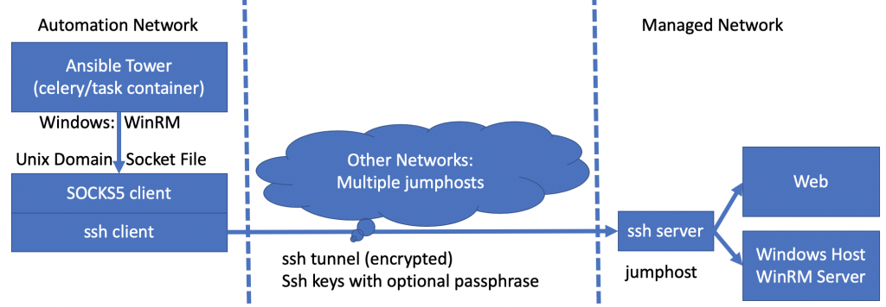
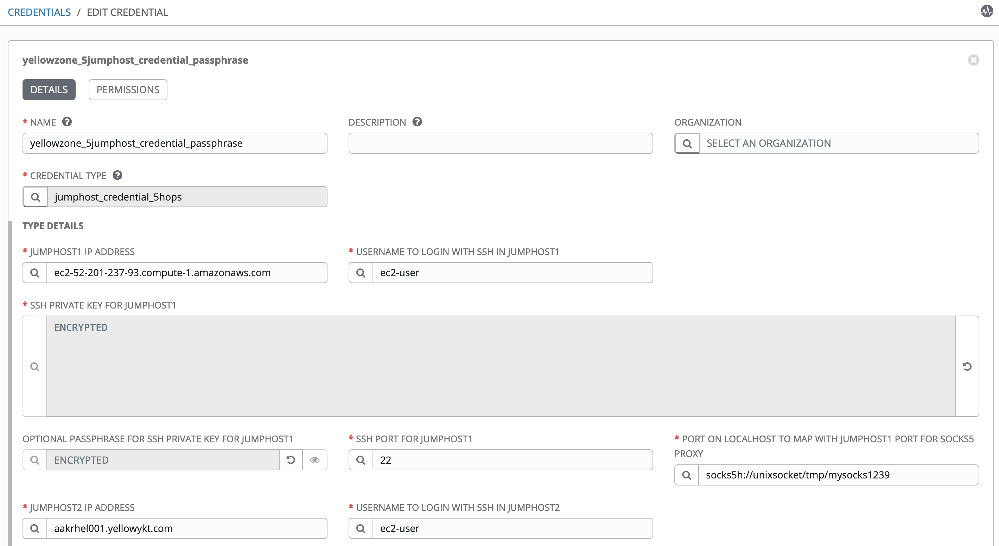
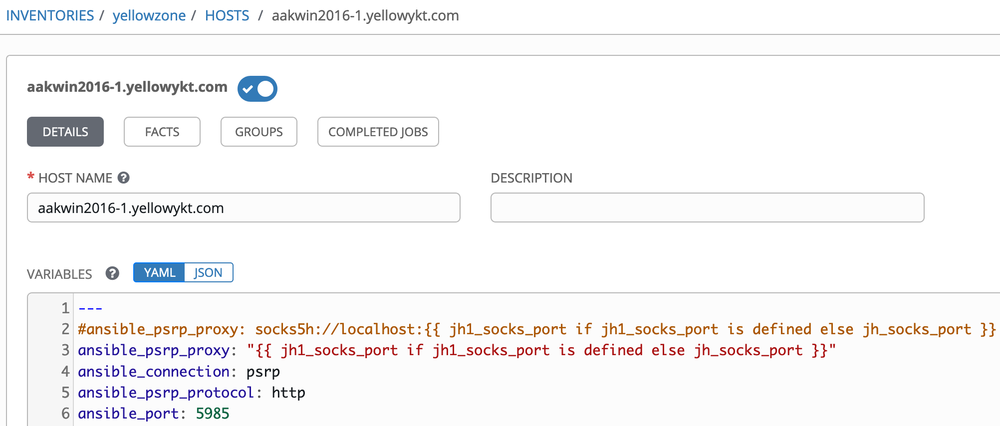
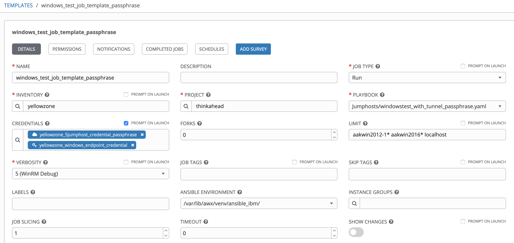
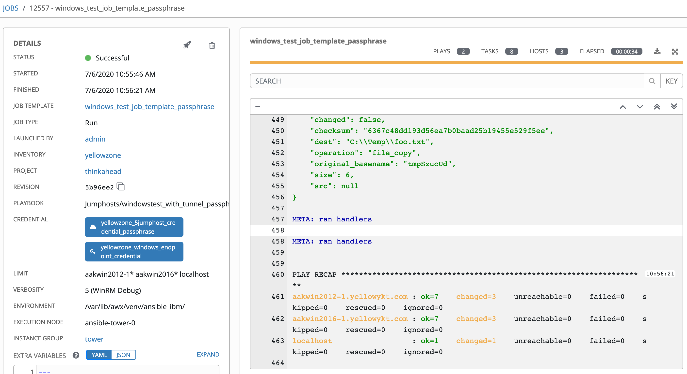

# Multiple Jumphosts in Ansible Tower - Part 5

## Unix domain socket file instead of socks port

[Alexei.Karve](https://developer.ibm.com/recipes/author/karve/)

Tags: Cloud computing, DevOps, Linux

Published on July 8, 2020 / Updated on July 23, 2020



### Overview

Skill Level: Intermediate

Hands on expertise with Ansible Tower/AWX

Unix domain socket files are especially useful to isolate job runs in bubblewrap. Part 5 shows how to connect via multiple hops of jumphosts using the socket file to connect to Windows hosts with modified pysocks and urllib3 with a customized Tower Image

### Ingredients

Ansible Tower/AWX, Docker, OpenShift

### Step-by-step

#### 1. Introduction

IP sockets are a mechanism allowing communication between processes over the network. In some cases, you can use TCP/IP sockets to talk with processes running on the same computer (by using the loopback interface).

A UNIX socket is an inter-process communication mechanism that allows bidirectional data exchange between processes running on the same machine. UNIX domain sockets are used on the same system, so they can avoid some checks and operations (like routing) making them faster and lighter.

Instead of identifying a server by an IP address and port, a UNIX domain socket is known by a pathname. The client and server have to use the same pathname for them to find each other. The server binds the pathname to the socket. File and directory permissions restrict which processes on the host can open the file, and thus communicate with the server. Therefore, UNIX domain sockets provide an advantage over Internet sockets (to which anyone can connect, unless extra authentication logic is implemented).

Recap that ssh parameter -D specifies a local "dynamic" application-level port forwarding. This works by allocating a socket to listen to port on the local side, optionally bound to the specified bind_address. Whenever a connection is made to this port, the connection is forwarded over the secure channel, and the application protocol is then used to determine where to connect to from the remote machine. Currently the SOCKS4 and SOCKS5 protocols are supported, and ssh will act as a SOCKS server.

#### 2. Establishing the tunnel

Unix domain socket files are especially useful with Ansible Tower to isolate job runs when used with Setting->Jobs->ENABLE JOB ISOLATION (bubblewrap) functionality enabled. The bubblewrap functionality in Ansible Tower limits which directories on the Tower file system are available for playbooks to see and use during playbook runs. On Ansible Tower 3.5.x, your role/playbook is responsible for starting and killing the tunnel. So, we could create a tunnel and leave it open to be shared by multiple job runs. On Ansible Tower 3.6.x and 3.7.x, the tunnel is established by the playbook inside a bubblewrap "/usr/bin/bwrap --die-with-parent" process started by Ansible Tower; this tunnel is automatically killed when the job ends. The job is only responsible for creating the tunnel. Each job reestablishes the tunnel using its own socket file path that is not accessible by other organizations. Any job that needs the tunnel must create it by including a role/task that establishes the tunnel before any modules are invoked to access the host endpoint. This also works on multiple Tower pods because each job establishes its own tunnel.

As an example consider using ec2-52-201-237-93.compute-1.amazonaws.com as the single jumphost.

Previous mechanism in Part2 and Part3 for creating single jumphost tunnel listening on socks port 1234

ssh -CfNq **-D 127.0.0.1:1234** -p 22 -i ~/amazontestkey.pem ec2-user@ec2-52-201-237-93.compute-1.amazonaws.com -vvvvvv

New mechanism for creating single jumphost tunnel using domain socket file /tmp/mysock.sock. We can select any other accessible file path and name.

ssh -CfNq **-D /tmp/mysock.sock** -p 22 -i ~/amazontestkey.pem ec2-user@ec2-52-201-237-93.compute-1.amazonaws.com -vvvvvv

Notice how the 127.0.0.1:1234 is replaced by /tmp/mysock. Here is how the unix socket file looks like:

`ls /tmp/mysock.sock -las`

`0 srw-------. 1 awx root 0 Jul  6 12:49 /tmp/mysock.sock`

To reestablish the tunnel using domain socket file, kill the old process and delete the socket file, then recreate the tunnel. The node created in the filesystem to represent the socket persists after the socket is closed, and needs to be removed each time the ssh process starts up.

`ps -ef | grep ssh`\
`kill $pid # kill old tunnel`

`rm -f /tmp/mysock.sock`

`ssh -CfNq -D /tmp/mysock.sock -p 22 -i ~/amazontestkey.pem ec2-user@ec2-52-201-237-93.compute-1.amazonaws.com -vvvvvv`

With Job isolation enabled in Ansible Tower, each job gets its own /tmp directory (if the /tmp is not shared)

#### 3. Using the domain socket file to connect to Linux hosts

The ncat and the connect-proxy do not allow us to use the domain socket file directly as a proxy. We can however use the socat to listen on TCP port and redirect all incoming connections to the UNIX domain socket. The socat will also forward the response back. After the tunnel is created with the domain socket file, you can run the following to get the ssh commands to work over port and the domain socket file to connect to the host endpoint over the multiple jumphosts:

`socat TCP-LISTEN:1234,reuseaddr,fork UNIX-CLIENT:/tmp/mysock.sock&`

``ssh ec2-user@aakrhel005.yellowykt.com -p 2222 -i ~/amazontestkey.pem -o StrictHostKeyChecking=no -o UserKnownHostsFile=/dev/null -o ProxyCommand="ncat --proxy-type socks5 --proxy 127.0.0.1:1234 %h %p" echo Hello \`hostname\` ``

The socat will need to be killed, it is running in background. We will not pursue this mechanism for Linux hosts further in this article. We will only work with Windows host endpoints.

#### 4. Changes to urllib3 and PySocks

The urllib3 and PySocks that adds support for UNIX domain socket files for testing purposes are shown below:

<https://github.com/nitzmahone/PySocks/tree/hack_unix_domain_socket_file_support>\
<https://github.com/nitzmahone/urllib3/tree/hack_unix_domain_socket_file_support>

We need to pip install the branch for urllib3 + pysocks. This checks for parsed.host == 'unixsocket'. The address of the socket is a path on the filesystem, rather than a tuple containing servername and port. The socket is created with address family AF_UNIX if proxy_addr.startswith('/'). Binding the socket and managing the incoming connections works the same as with TCP/IP sockets.

`pip install git+https://github.com/nitzmahone/PySocks.git@hack_unix_domain_socket_file_support git+https://github.com/nitzmahone/urllib3.git@hack_unix_domain_socket_file_support`

We can install this in the Ansible virtualenv that's being tested. This will enable WinRM/PSRP to use the file-based socket proxy tunnel to contact the target host. If you already have pywinrm and pysocks without the domain socket file support, those modules will need be uninstalled before installing the above.

`pip uninstall pysocks -y`\
`pip uninstall urllib3 -y`

#### 5. Using python for testing with socks5h://unixsocket/tmp/mysock.sock

This section assumes that you ave established the tunnel over the single jumphost using the domain socket file /tmp/mysock.sock as shown in Section 2 above. Multiple ways to use the unix domain socket fle are shown.

**5a. Http request to ifconfig.me**:  Use the following python code with the socks5h://unixsocket/tmp/mysock.sock. The first requests.get call will use the tunnel (with the proxies parameter) and return the outbound public ip address returned by the ifconfig.me from the jumphost. The second requests.get call will show the outbound public ip address from the localhost (or Ansible Tower celery/task container where the command is invoked).

`import requests`\
`r=requests.get("http://ifconfig.me", proxies={"http": "socks5h://unixsocket/tmp/mysock.sock", "https": "socks5h://unixsocket/tmp/mysock.sock"})`\
`r.content`

`r=requests.get("http://ifconfig.me")`\
`r.content`

**5b. wsman request to Windows VM**

The following code will connect to Windows host aakwin2012-1.yellowykt.com. You will need to change the $password in requests.post below.


`import requests`\
`from requests.auth import HTTPBasicAuth`\
`r=requests.post("http://aakwin2012-1.yellowykt.com:5985/wsman", data='<s:Envelope xmlns:s="http://www.w3.org/2003/05/soap-envelope" xmlns:wsmid="http://schemas.dmtf.org/wbem/wsman/identity/1/wsmanidentity.xsd"><s:Header/><s:Body><wsmid:Identify/></s:Body></s:Envelope>', auth=HTTPBasicAuth('Administrator','$password'), proxies={"http": "socks5h://unixsocket/tmp/mysock.sock", "https": "socks5h://unixsocket/tmp/mysock.sock"},headers={'Content-Type': 'application/soap+xml;charset=UTF-8'})`\
`r.content`

Output:

`'<s:Envelope xml:lang="en-US" xmlns:s="http://www.w3.org/2003/05/soap-envelope"><s:Header></s:Header><s:Body><wsmid:IdentifyResponse xmlns:wsmid="http://schemas.dmtf.org/wbem/wsman/identity/1/wsmanidentity.xsd"><wsmid:ProtocolVersion>http://schemas.dmtf.org/wbem/wsman/1/wsman.xsd</wsmid:ProtocolVersion><wsmid:ProductVendor>Microsoft Corporation</wsmid:ProductVendor><wsmid:ProductVersion>OS: 6.3.9600 SP: 0.0 Stack: 3.0</wsmid:ProductVersion><wsmid:SecurityProfiles><wsmid:SecurityProfileName>http://schemas.dmtf.org/wbem/wsman/1/wsman/secprofile/http/basic</wsmid:SecurityProfileName><wsmid:SecurityProfileName>http://schemas.dmtf.org/wbem/wsman/1/wsman/secprofile/http/spnego-kerberos</wsmid:SecurityProfileName></wsmid:SecurityProfiles></wsmid:IdentifyResponse></s:Body></s:Envelope>'`

Creating tunnels with different number of jumphosts was already covered in [Part 2](../multiple-jumphosts-in-ansible-tower-part-2/index.md "Multiple Jumphosts in Ansible Tower - Part 2") and [Part 3](../multiple-jumphosts-in-ansible-tower-part-3/index.md "Multiple Jumphosts in Ansible Tower - Part 3"). The only change you need is to replace the socket host:port with the domain socket file for the -D parameter. As an example, creating another tunnel with 5 jumphosts is shown below. You will need to kill the old tunnel and delete the socket file before creating the new tunnel if you use the same socket file.

**Example ssh command for creating a 5 jumphost hop tunnel using domain socket file /tmp/mysock.sock**

Laptop -> **ec2-52-201-237-93.compute-1.amazonaws.com -> aakrhel001.yellowykt.com -> aakrhel002.yellowykt.com -> aakrhel003.yellowykt.com -> aakrhel006.yellowykt.com** -> aakwin2012-1.yellowykt.com (host endpoint)

`ssh -i ~/amazontestkey.pem -oPubkeyAuthentication=yes -oStrictHostKeyChecking=no -oUserKnownHostsFile=/dev/null -oProxyCommand="ssh -i ~/amazontestkey.pem -W aakrhel006.yellowykt.com:22 -oPubkeyAuthentication=yes -oStrictHostKeyChecking=no -oUserKnownHostsFile=/dev/null -oProxyCommand=\"ssh -i ~/amazontestkey.pem -W aakrhel003.yellowykt.com:22 -oPubkeyAuthentication=yes -oStrictHostKeyChecking=no -oUserKnownHostsFile=/dev/null -oProxyCommand=\\\"ssh -i ~/amazontestkey.pem -W aakrhel002.yellowykt.com:22 -oPubkeyAuthentication=yes -oStrictHostKeyChecking=no -oUserKnownHostsFile=/dev/null -oProxyCommand=\\\\\\\"ssh -i ~/amazontestkey.pem -W aakrhel001.yellowykt.com:22 -oPubkeyAuthentication=yes -oStrictHostKeyChecking=no -oUserKnownHostsFile=/dev/null -p 22 ec2-user@ec2-52-201-237-93.compute-1.amazonaws.com\\\\\\\" -p 22 ec2-user@aakrhel001.yellowykt.com\\\" -p 22 ec2-user@aakrhel002.yellowykt.com\" -p 22 ec2-user@aakrhel003.yellowykt.com" -fN -D /tmp/mysock.sock -p 22 ec2-user@aakrhel006.yellowykt.com;sleep 2`

The output shows the tunnel being established. We can also check the ssh processes with "ps -ef | grep ssh".

`Warning: Permanently added 'ec2-52-201-237-93.compute-1.amazonaws.com,52.201.237.93 (ECDSA) to the list of known hosts.`\
`Warning: Permanently added 'aakrhel001.yellowykt.com' (ECDSA) to the list of known hosts.`\
`Warning: Permanently added 'aakrhel002.yellowykt.com' (ECDSA) to the list of known hosts.`\
`Warning: Permanently added 'aakrhel003.yellowykt.com' (ECDSA) to the list of known hosts.`\
`Warning: Permanently added 'aakrhel006.yellowykt.com' (ECDSA) to the list of known hosts.`

**5c. Windows cmd request**

The following python command invokes [windowstest_with_tunnel_unixfile.py](https://github.com/thinkahead/DeveloperRecipes/blob/master/Jumphosts/windowstest_with_tunnel_unixfile.py "windowstest_with_tunnel_unixfile.py") to run the ipconfig/all on the aakwin2012-1.yellowykt.com. Replace the $password with correct password for local Administrator user.

`python3 windowstest_with_tunnel_unixfile.py --host aakwin2012-1.yellowykt.com --username Administrator --password $password`

The output is shown below:

```
status_code: 0
std_out:

Windows IP Configuration

   Host Name . . . . . . . . . . . . : aakwin2012-1
   Primary Dns Suffix  . . . . . . . : yellowykt.com
   Node Type . . . . . . . . . . . . : Hybrid
   IP Routing Enabled. . . . . . . . : No
   WINS Proxy Enabled. . . . . . . . : No
   DNS Suffix Search List. . . . . . : yellowykt.com
...

std_err:
```

**Source code for windowstest_with_tunnel_unixfile.py**

``` python
from winrm.protocol import Protocol
import argparse

parser = argparse.ArgumentParser(description='Run command on Windows host')
parser.add_argument("--host", required=True)
parser.add_argument("--port", default=5985)
parser.add_argument("--socksport", default='socks5h://unixsocket/tmp/mysock.sock')
parser.add_argument("--username", required=True)
parser.add_argument("--password", required=True)
parser.add_argument("--protocol", default="http")
parser.add_argument("--transport", default="basic")

args = parser.parse_args()

# Run process with low-level API\
p = Protocol(\
    endpoint=args.protocol+'://'+args.host+':'+str(args.port)+'/wsman',
    transport=args.transport,
    username=args.username,
    password=args.password,
    server_cert_validation='ignore',
    proxy=args.socksport)
shell_id = p.open_shell()

command_id = p.run_command(shell_id, 'ipconfig', ['/all'])
std_out, std_err, status_code = p.get_command_output(shell_id, command_id)
p.cleanup_command(shell_id, command_id)
p.close_shell(shell_id)
print("status_code:",status_code)
print("std_out:")
print(str(std_out, 'ascii')) # python3 only
print("std_err:")
print(str(std_err, 'ascii')) # python3 only`
```

**5d. Windows powershell request**

The command to  run a powershell script to get the Physical Memory of Windows VM via the jumphost uses the [windowstest_with_tunnel_unixfile2.py](https://github.com/thinkahead/DeveloperRecipes/blob/master/Jumphosts/windowstest_with_tunnel_unixfile2.py "windowstest_with_tunnel_unixfile2.py")

`python3 windowstest_with_tunnel_unixfile2.py --host aakwin2012-1.yellowykt.com --username Administrator --password $password`

The output is shown below:

`status_code: 0`\
`std_out:`\
`Installed Memory: 4095 MB`

`std_err:`\
`#< CLIXML\
<Objs Version="1.1.0.1" xmlns="http://schemas.microsoft.com/powershell/2004/04"><Obj S="progress" RefId="0"><TN RefId="0"><T>System.Management.Automation.PSCustomObject</T><T>System.Object</T></TN><MS><I64 N="SourceId">1</I64><PR N="Record"><AV>Preparing modules for first use.</AV><AI>0</AI><Nil /><PI>-1</PI><PC>-1</PC><T>Completed</T><SR>-1</SR><SD> </SD></PR></MS></Obj></Objs>`

**Source code for windowstest_with_tunnel_unixfile2.py**

``` python
from winrm.protocol import Protocol
import winrm
import argparse
from base64 import b64encode

script = """$strComputer = $Host
Clear
$RAM = WmiObject Win32_ComputerSystem
$MB = 1048576

"Installed Memory: " + [int]($RAM.TotalPhysicalMemory /$MB) + " MB" """

cmd = """

# Load script from env-vars
. ([ScriptBlock]::Create($Env:WINRM_SCRIPT))
"""
encoded_cmd = b64encode(cmd.encode('utf_16_le')).decode('ascii')

parser = argparse.ArgumentParser(description='Run command on Windows host')
parser.add_argument("--host", required=True)
parser.add_argument("--port", default=5985)
parser.add_argument("--socksport", default='socks5h://unixsocket/tmp/mysock.sock')
parser.add_argument("--username", required=True)
parser.add_argument("--password", required=True)
parser.add_argument("--protocol", default="http")
parser.add_argument("--transport", default="basic")

args = parser.parse_args()

p = Protocol(
    endpoint=args.protocol+'://'+args.host+':'+str(args.port)+'/wsman',
    transport=args.transport,
    username=args.username,
    password=args.password,
    server_cert_validation='ignore',
    proxy=args.socksport)

# Load script to env vars.\
shell_id = p.open_shell(env_vars=dict(WINRM_SCRIPT=script))
command_id = p.run_command(shell_id, "powershell -EncodedCommand {}".format(encoded_cmd))

#rs = winrm.Response(p.get_command_output(shell, command)
#print(str(rs.std_out, 'ascii'))
std_out, std_err, status_code = p.get_command_output(shell_id, command_id)
p.cleanup_command(shell_id, command_id)
p.close_shell(shell_id)
print("status_code:",status_code)
print("std_out:")
print(str(std_out, 'ascii')) # python3 only
print("std_err:")
print(str(std_err, 'ascii')) # python3 only`
```

#### 6. Using UNIX domain socket file from Ansible Tower/AWX

A sample jumphost credential for 5 jumphosts is shown in screenshot below (it shows the first jumphost hop). Set the first credential with "PORT ... FOR SOCKS5 PROXY" to "socks5h://unixsocket/tmp/mysocks1239". This value is set for the UNIX domain socket file for the first jumphost. The Socks Port values for the rest of the jumphosts in the custom credential type are ignored.



As mentioned in Part 3, there are two options: use a socks port or a unix domain socket file. The [jumphostlogin.sh](https://github.com/thinkahead/DeveloperRecipes/blob/master/Jumphosts/roles/ansible-role-socks5-tunnel/tasks/jumphostlogin.sh "jumphostlogin.sh") script first checks if the jh1_socks_port is numeric. If it is numeric, it will default to socks port for creating the tunnel. For this Part 5, we want to use the latter. So, we provide the full socks5h://unixsocket/tmp/mysocks1239 or /tmp/mysocks1239 for socket file.  This parameter is provided to the -D during creation of ssh tunnel. The code that parses the dparam is shown below:

``` bash
re='^[0-9]+$'
if ! [[ $jh1_socks_port =~ $re ]] ; then
    #echo "Socks port is not a number" >&2\
    dparam=`echo $jh1_socks_port | sed "s|^socks.*://||" | sed "s|^unixsocket||"`
else
    #dparam=/tmp/mysocks$jh1_socks_port
    dparam=127.0.0.1:$jh1_socks_port
fi
```

If the full socks5h://unixsocket/tmp/mysocks1239 is specified in the credential, then the host variables need to look like:

`ansible_psrp_proxy: "{{ jh1_socks_port if jh1_socks_port is defined else jh_socks_port }}"`

If specified as /tmp/mysocks1239, then the host variables should look like:

`ansible_psrp_proxy: socks5h://unixsocket"{{ jh1_socks_port if jh1_socks_port is defined else jh_socks_port }}"`

If you want to change the default to use the unix domain socket file when a port number is specified, you should switch to use the dparam to use the file path. In that case, the port number is just a dummy value.

`dparam=/tmp/mysocks$jh1_socks_port`\
`#dparam=127.0.0.1:$jh1_socks_port`

The jh_socks_port from the jumphost credential type created in [Part 1](../multiple-jumphosts-in-ansible-tower-part-1/index.md "Multiple Jumphosts in Ansible Tower - Part 1") is thus reused to provide a socket file name. The number 1239 in the socket filename (port number that was used previously) is really not required for a job because the bwrap will keep separate files for each job, just use a filename that is accessible by the job. For multiple jumphosts, only the the jh_socks_port or jh1_socks_port from the credential is used (the rest of the jh2_socks_port, jh3_socks_port, etc are ignored).

The host variables for host aakwin2016-1.yellowykt.com are shown in screenshot below:



The job template "windows_test_job_template_passphrase" looks as follows:



It uses the playbook [windowstest_with_tunnel_passphrase.yaml](https://github.com/thinkahead/DeveloperRecipes/blob/master/Jumphosts/windowstest_with_tunnel_passphrase.yaml "windowstest_with_tunnel_passphrase.yaml") and the LIMIT tag that has "aakwin2012-1* aakwin2016* localhost". This LIMIT value allows the job to run on two Windows hosts: aakwin2012-1.yellowykt.com and the aakwin2016-1.yellowykt.com. Additionally, the localhost is required to create the SOCKS5 ssh tunnel as was described in Part 3. The role ansible-role-socks5-tunnel allows the tunnel to be created for ssh keys with optional passphrase. The only difference this time being that it uses the Domain socket file instead of the socket port -- a change made in the credential, not the job template.

``` yaml
- name: Role ensures that the socks tunnel is setup, the ssh keys may have a passphrase
  hosts: localhost
  connection: local
  gather_facts: false
  roles:
    - ansible-role-socks5-tunnel
```

In Part 4, we used the custom endpoint credential type (or Tower Machine Credential Type). For this Part 5, the endpoint credentials are not used. Instead, only the machine credential type is used. That is why you see the message "Debug in main.yml undefined-endpoint_ssh_private_key" at the beginning in the debug output from the Tower log. The log also shows the connection being made via 5 jumphost hops from Tower -> ***ec2-52-201-237-93.compute-1.amazonaws.com -> aakrhel001.yellowykt.com -> aakrhel002.yellowykt.com -> aakrhel003.yellowykt.com -> aakrhel006.yellowykt.com***. It also shows the domain socket file "/tmp/mysocks1239" followed by the messages showing the expect script providing the passphrases to the prompts at the "Enter passphrase for key" messages. If you pass in a different jumphost credential, it will use either different number of jumphost hops or passphrases as per the jumphost credential types created in [Part 1](../multiple-jumphosts-in-ansible-tower-part-1/index.md "Multiple Jumphosts in Ansible Tower - Part 1"). The ssh key path and passphrase for each of the keys is retrieved from the env variables in the role "ansible-role-socks5-tunnel" vars/main.yml.

``` yaml
jh_ssh_private_key: "{{ lookup('env','JH_SSH_PRIVATE_KEY') }}"
jh_ssh_private_key_passphrase: "{{ lookup('env', 'JH_SSH_PRIVATE_KEY_PASSPHRASE') or '' }}"
jh1_ssh_private_key: "{{ lookup('env','JH1_SSH_PRIVATE_KEY') }}"
jh1_ssh_private_key_passphrase: "{{ lookup('env', 'JH1_SSH_PRIVATE_KEY_PASSPHRASE') or '' }}"
jh2_ssh_private_key: "{{ lookup('env','JH2_SSH_PRIVATE_KEY') }}"
jh2_ssh_private_key_passphrase: "{{ lookup('env', 'JH2_SSH_PRIVATE_KEY_PASSPHRASE') or '' }}"
jh3_ssh_private_key: "{{ lookup('env','JH3_SSH_PRIVATE_KEY') }}"
jh3_ssh_private_key_passphrase: "{{ lookup('env', 'JH3_SSH_PRIVATE_KEY_PASSPHRASE') or '' }}"
jh4_ssh_private_key: "{{ lookup('env','JH4_SSH_PRIVATE_KEY') }}"
jh4_ssh_private_key_passphrase: "{{ lookup('env', 'JH4_SSH_PRIVATE_KEY_PASSPHRASE') or '' }}"
jh5_ssh_private_key: "{{ lookup('env','JH5_SSH_PRIVATE_KEY') }}"
jh5_ssh_private_key_passphrase: "{{ lookup('env', 'JH5_SSH_PRIVATE_KEY_PASSPHRASE') or '' }}"
jh6_ssh_private_key: "{{ lookup('env','JH6_SSH_PRIVATE_KEY') }}"
jh6_ssh_private_key_passphrase: "{{ lookup('env', 'JH6_SSH_PRIVATE_KEY_PASSPHRASE') or '' }}"
```

**Debug output from job run:** It also shows the echo output from the ssh command so we can see the 5 jumphosts.

`Debug in main.yml undefined-endpoint_ssh_private_key`

`spawn -ignore HUP ./jumphostlogin.sh`

`ssh -i /tmp/awx_12557_n3yo3h62/tmp28hwa__e -oPubkeyAuthentication=yes -oStrictHostKeyChecking=no -oUserKnownHostsFile=/dev/null -oProxyCommand=ssh -i /tmp/awx_12557_n3yo3h62/tmp6o3b99ry -W aakrhel006.yellowykt.com:22 -oPubkeyAuthentication=yes -oStrictHostKeyChecking=no -oUserKnownHostsFile=/dev/null -oProxyCommand="ssh -i /tmp/awx_12557_n3yo3h62/tmpdm_ix99s -W aakrhel003.yellowykt.com:22 -oPubkeyAuthentication=yes -oStrictHostKeyChecking=no -oUserKnownHostsFile=/dev/null -oProxyCommand=\"ssh -i /tmp/awx_12557_n3yo3h62/tmpruw_k7z2 -W aakrhel002.yellowykt.com:22 -oPubkeyAuthentication=yes -oStrictHostKeyChecking=no -oUserKnownHostsFile=/dev/null -oProxyCommand=\\\"ssh -i /tmp/awx_12557_n3yo3h62/tmpjwdcadp3 -W aakrhel001.yellowykt.com:22 -oStrictHostKeyChecking=no -oUserKnownHostsFile=/dev/null -p 22 ec2-user@ec2-52-201-237-93.compute-1.amazonaws.com\\\" -p 22 ec2-user@aakrhel001.yellowykt.com\" -p 22 ec2-user@aakrhel002.yellowykt.com" -p 22 ec2-user@aakrhel003.yellowykt.com -p 22 ec2-user@aakrhel006.yellowykt.com -fN -D`

`/tmp/mysocks1239`

`Warning: Permanently added 'ec2-52-201-237-93.compute-1.amazonaws.com,52.201.237.93' (ECDSA) to the list of known hosts.`

`Enter passphrase for key '/tmp/awx_12557_n3yo3h62/tmpjwdcadp3':`\
`Warning: Permanently added 'aakrhel001.yellowykt.com' (ECDSA) to the list of known hosts.`

`Enter passphrase for key '/tmp/awx_12557_n3yo3h62/tmpruw_k7z2':`\
`Warning: Permanently added 'aakrhel002.yellowykt.com' (ECDSA) to the list of known hosts.`

`Enter passphrase for key '/tmp/awx_12557_n3yo3h62/tmpdm_ix99s':`\
`Warning: Permanently added 'aakrhel003.yellowykt.com' (ECDSA) to the list of known hosts.``

`Enter passphrase for key '/tmp/awx_12557_n3yo3h62/tmp6o3b99ry':`\
`Warning: Permanently added 'aakrhel006.yellowykt.com' (ECDSA) to the list of known hosts.`

`Enter passphrase for key '/tmp/awx_12557_n3yo3h62/tmp28hwa__e':`\
`DONEDONEDONE`\
`spawned process backgrounding successful`

The screenshot below shows that the playbook was successfully executed on both the Windows hosts aakwin2012-1.yellowykt.com and aakwin2016-1.yellowykt.com. The last module executed by the win_copy generates the file C:\Temp\foo.txt as seen in the screenshot.



Instead of defining the host variables (or variables in the group or inventory), we can also set the variables within the playbook (we did this in [Part 4](../multiple-jumphosts-in-ansible-tower-part-4/index.md "Multiple Jumphosts in Ansible Tower - Part 4")). For the full socks5h://unixsocket/tmp/mysocks1239 used in the credential, we can use the playbook [windowstest_with_tunnel_passphrase2.yaml](https://github.com/thinkahead/DeveloperRecipes/blob/master/Jumphosts/windowstest_with_tunnel_passphrase2.yaml "windowstest_with_tunnel_passphrase2.yaml") that sets the  ansible_psrp_proxy variable at the play level that runs on "hosts: all".

``` yaml
  vars:
    ansible_psrp_proxy: "{{ jh1_socks_port if jh1_socks_port is defined else jh_socks_port }}"
```

#### 7. Custom Tower Image with unix domain socket file support

To use the unixsocket domain socket file for ssh, we need to create a Custom Ansible Tower Image. This can be done with the following sample Dockerfile shown below. You may want to change the repo (Redhat Subscription) for yum and add other utilities and python dependencies if required. This Dockerfile installs the urllib3 and PySocks with unix_domain_socket_file_support. It also installs the dependencies for connecting to Windows hosts. You may want to change the CentOS base URL to use http://mirror.centos.org/centos/7/ to use the latest instead of a specific version.

**Dockerfile**

```
FROM registry.redhat.io/ansible-tower-37/ansible-tower-rhel7:latest
RUN whoami
RUN cat /etc/redhat-release
USER root
# Add Centos repo for doing yum install
RUN printf '[base]\nname=CentOS-\$releasever - Base\nbaseurl=http://mirror.centos.org/centos/7.8.2003/os/\$basearch/\nenabled=1\ngpgcheck=0\npriority=1\n' > /etc/yum.repos.d/centos.repo
# Run yum install commands
RUN yum -y install https://dl.fedoraproject.org/pub/epel/epel-release-latest-7.noarch.rpm
RUN yum -y update
RUN yum -y install expect connect-proxy nc autossh net-tools curl iputils
RUN yum -y install gcc python36 python36-devel
# Creating Python Virtual Environment ansible_test
RUN mkdir -p /var/lib/awx/venv/ansible_test
RUN virtualenv -p python3 /var/lib/awx/venv/ansible_test
# Configure the ansible_test venv
RUN umask 0022
RUN . /var/lib/awx/venv/ansible_test/bin/activate; pip install --upgrade pip;pip install --user --upgrade setuptools;pip install python-memcached psutil ansible pypsrp pywinrm pywinrm[credssp] requests-credssp;pip install git+https://github.com/nitzmahone/PySocks.git@hack_unix_domain_socket_file_support git+https://github.com/nitzmahone/urllib3.git@hack_unix_domain_socket_file_support requests==2.22.0 idna==2.8; deactivate
# Switch to non-root user
USER awx
```

**Installing Tower with customizations for Domain Socket file**

If you have OpenShift 4.3 installed in AWS EC2, you can use the following instructions for installing Ansible Tower as a pod on OpenShift. In other environments the Persistent Volume (PV) and Persistent Volume Claim (PVC) for Postgres pod will change based on available Storage Classes. You will need to export your openshifturl (the path after the api) for the commands below.

**postgres-nfs-pvc.yaml**

``` yaml
apiVersion: v1
kind: PersistentVolumeClaim
metadata:
  name: postgresql
spec:
  accessModes:
    - ReadWriteOnce
  resources:
    requests:
      storage: 15Gi
```

**Install Instructions**

Find the latest Ansible Tower Images by searching at <https://catalog.redhat.com/software/containers/search?q=tower>

`wget https://releases.ansible.com/ansible-tower/setup_openshift/ansible-tower-openshift-setup-3.7.0.tar.gz`\
`tar -zxvf ../ansible-tower-openshift-setup-3.7.0.tar.gz`\
`cd ansible-tower-openshift-setup-3.7.0`\
`oc login --token=$token --server=https://api.${openshifturl}:6443`

`oc new-project tower # We install Ansible Tower in tower namespace`

`oc create -f postgres-nfs-pvc.yaml # Create the PVC on Amazon EBS`

`# Build a custom docker image from above Dockerfile and push it to OpenShift`\
`docker login https://registry.redhat.io`\
`docker pull registry.redhat.io/ansible-tower-37/ansible-tower-rhel7`\
`docker build -t image-registry.openshift-image-registry.svc:5000/tower/oc_tower:3.7.0 .`

Edit the roles/kubernetes/tasks/openshift.yml and append the " or pg_pvc_status.stdout == "Pending"

``` yaml
    - name: Ensure PostgreSQL PVC is available
      assert:
        that:
          - pg_pvc_status.stdout == "Bound" or pg_pvc_status.stdout == "Pending"
        msg: "Ensure a PVC named '{{ openshift_pg_pvc_name }}' is created and bound in the '{{ openshift_project }}' namespace."
```

Refer to [Trust a CA in your client platform](https://docs.openshift.com/container-platform/4.3/cli_reference/openshift_developer_cli/using_odo_in_a_restricted_environment/pushing-the-odo-init-image-to-the-restricted-cluster-registry.html#pushing-the-odo-init-image-to-an-internal-registry-directly_pushing-the-odo-init-image-to-the-restricted-cluster-registry "Trust a CA in your client platform") for your client platform Mac or Linux.

`oc patch configs.imageregistry.operator.openshift.io cluster -p '{"spec":{"defaultRoute":true}}' --type='merge' -n openshift-image-registry`

`oc get secret router-certs-default -n openshift-ingress -o yaml`

`echo <tls.crt> | base64 -d > ca.crt`


**# For Linux**

`cp ca.crt /etc/pki/ca-trust/source/anchors/externalroute.crt && update-ca-trust enable && systemctl daemon-reload && systemctl restart docker`

**# For Mac**

`sudo security add-trusted-cert -d -r trustRoot -k /Library/Keychains/System.keychain ca.crt`\
`# Open Keychain Access.app and in Certificates, change Trust to "Always Trust"`

`docker tag image-registry.openshift-image-registry.svc:5000/tower/oc_tower:3.7.0 default-route-openshift-image-registry.apps.${openshifturl}/tower/oc_tower:3.7.0`\
`docker login default-route-openshift-image-registry.apps.${openshifturl} -u kubeadmin -p $(oc whoami -t)`\
`docker push default-route-openshift-image-registry.apps.${openshifturl}/tower/oc_tower:3.7.0`\
`oc get is -n tower # List the image`

`# In groups_vars/all, change image from registry.redhat.io/ansible-tower-37/ansible-tower-rhel7:3.7.0 to image-registry.openshift-image-registry.svc:5000/tower/oc_tower`\
`cat group_vars/all`

`# You will need to use your openshift_user with the openshift_token (instead of the openshift_password) in command below`\
`./setup_openshift.sh -e openshift_host=https://api.${openshifturl}:6443 -e openshift_skip_tls_verify=true -e openshift_project=tower -e openshift_user=kubeadmin -e openshift_password=$kubeadminpassword -e admin_password=$password -e secret_key=mysecret -e pg_username=root -e pg_password=$password -e rabbitmq_password=$password -e rabbitmq_erlang_cookie=rabbiterlangpwd`

`# if image was not updated in groups_vars/all, edit the deployment and update the images`\
`oc edit deployment.apps/ansible-tower`

`watch oc get pods -n tower # Wait for pods to get to Running state`\
`oc get routes -n tower`

Open the URL to acces Ansible Tower and add the license at https://ansible-tower-web-svc-tower.apps.${openshifturl} on your browser.

#### 8. Conclusion

Part 5 mentioned the advantages of using the Unix domain socket file over the socks port. We saw the changes required to use the Unix domain socket file. Next we saw how to create a custom Tower image with a Dockerfile that installed the required dependencies to get the Unix Socket file to work with Windows. We concluded with instructions for installing Ansible Tower on Openshift using the custom image for the web (kubernetes_web_image) and celery/task (kubernetes_task_image) containers in the pod.

We have seen how to create a tunnel and listen with a socks port and domain socket file. But what happens if one of the jumphosts in the hops in the chain goes down? Can we switch to a backup jumphost? This will be the topic of the final [Part 6](../multiple-jumphosts-in-ansible-tower-part-6/index.md "Multiple Jumphosts in Ansible Tower - Part 6") in this series.

#### 9. References
- Build custom virtual environments <https://docs.ansible.com/ansible-tower/latest/html/administration/openshift_configuration.html#build-custom-virtual-environments>
- Unix Domain Sockets <https://pymotw.com/2/socket/uds.html>
- Ansible Tower Images <https://catalog.redhat.com/software/containers/search?q=tower>
- Getting started with Ansible Tower <https://cloud.ibm.com/docs/cloud-pak-multicloud-management?topic=cloud-pak-multicloud-management-ansible-getting-started>
- Trust a CA in your client platform <https://docs.openshift.com/container-platform/4.3/cli_reference/openshift_developer_cli/using_odo_in_a_restricted_environment/pushing-the-odo-init-image-to-the-restricted-cluster-registry.html#pushing-the-odo-init-image-to-an-internal-registry-directly_pushing-the-odo-init-image-to-the-restricted-cluster-registry>
- Multiple Jumphosts in Ansible Tower -- Part 1: Connecting to Linux hosts using ssh with nested ProxyCommand <https://developer.ibm.com/recipes/tutorials/multiple-jumphosts-in-ansible-tower-part-1>
- Multiple Jumphosts in Ansible Tower -- Part 2: Connecting to Windows/Linux hosts with ssh tunnel SOCKS5 proxy <https://developer.ibm.com/recipes/tutorials/multiple-jumphosts-in-ansible-tower-part-2>
- Multiple Jumphosts in Ansible Tower -- Part 3: Ssh tunnel SOCKS5 proxy with passphrase enabled for ssh keys <https://developer.ibm.com/recipes/tutorials/multiple-jumphosts-in-ansible-tower-part-3>
- Multiple Jumphosts in Ansible Tower -- Part 4: Multi jumphost connections to Linux hosts using ssh-add to add keys to ssh-agent <https://developer.ibm.com/recipes/tutorials/multiple-jumphosts-in-ansible-tower-part-4/>
- Multiple Jumphosts in Ansible Tower -- Part 6: Primary and Secondary/Backup Jumphosts and Reverse ssh Tunnel <https://developer.ibm.com/recipes/tutorials/multiple-jumphosts-in-ansible-tower-part-6/>
- Multiple Jumphosts in Ansible Tower -- Part 7: Failover using redundant jumphosts, tweaking ssh parameters and memory requirements for jumphosts <https://developer.ibm.com/recipes/tutorials/multiple-jumphosts-in-ansible-tower-part-7/>
- Multiple Jumphosts in Ansible Tower -- Part 8: Transferring files using ansible synchronize module and rsync <https://developer.ibm.com/recipes/tutorials/multiple-jumphosts-in-ansible-tower-part-8/>
- Multiple Jumphosts in Ansible Tower -- Part 9: Pull secrets from remote 3rd-party vaults over multiple jumphost hops <https://developer.ibm.com/recipes/tutorials/multiple-jumphosts-in-ansible-tower-part-9/>
- Multiple Jumphosts in Ansible Tower -- Part 10: Using Container Groups instead of bubblewrap for isolation of jobs <https://developer.ibm.com/recipes/tutorials/multiple-jumphosts-in-ansible-tower-part-10/>
- Multiple Jumphosts in Ansible Tower -- Part 11: Using Container Groups with sshuttle proxy <https://developer.ibm.com/recipes/tutorials/multiple-jumphosts-in-ansible-tower-part-11/>
