# Multiple Jumphosts in Ansible Tower - Part 6

##  Primary and Secondary/Backup Jumphosts and Reverse ssh Tunnel

[Alexei.Karve](https://developer.ibm.com/recipes/author/karve/)

Tags: Cloud computing, DevOps, Linux

Published on July 10, 2020 / Updated on July 13, 2020

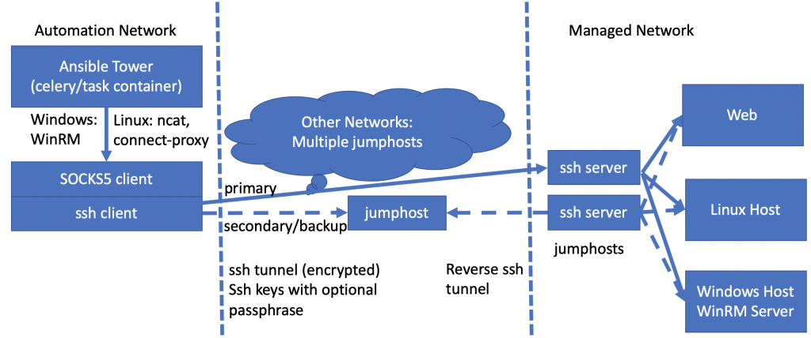

### Overview

Skill Level: Intermediate

Hands on expertise with Ansible/AWX and knowledge of ssh options

If the primary path is unable to connect to the host either because one or more jumphosts in the primary path is dead or unreachable, then we try the backup path. Also shown is the use of reverse ssh tunnels from Ansible Tower.

### Ingredients

Ansible Tower/AWX

### Step-by-step

#### 1. Introduction

A jump host (also called jump server or jump box) is a system on a network used to access and manage devices in a separate security zone. A jump host is a hardened and monitored device that spans two dissimilar security zones and provides a controlled means of access between them. A bastion host is also treated with special security considerations and connects to a secure zone, but it sits outside of your network security zone. A proxy server acts as a gateway between you and the internet. It's an intermediary server separating end users from the websites they browse. In this article, these hosts are used interchangeably and referred to as "jumphost". These jumphosts may also serve to cache content/files that may need to be used downstream.

Previous Parts 1-5 covered techniques to use a credential with multiple hops of jumphosts in one single path, i.e. all the jumphosts defined in the credential were used in establishing the connection/tunnel to the host endpoint. In this final Part 6 in this series, we look at primary and secondary/backup paths for the jumphosts. If the primary path is unable to connect to the host endpoint, either because one or more jumphosts in the primary path is dead or unreachable, then we try the backup jumphosts path to connect to the host endpoint. This backup path may share one or more jumphosts from primary path or may consist of an entirely different set of jumphosts with a different number of hops or share the same jumphost with different username or sshkey and passphrase.

The other alternative if you want to use multiple ssh jumphosts for load balancing, high availability or failovers is to create a credential type that has multiple jumphosts at each hop. These could be defined in a single credential type as (jh1_1, jh1_2, jh1_3...) for jh1 first hop, (jh2_1,jh2_2) for jh2 second hop, ... where each hop may have a different number of usable jumphosts and may even have weights associated with them. When creating the tunnel, it can select one of the jumphosts at each hop level based on the weights at each hop and try the partial path connection. If any jumphost is down, it can retry with different hosts and so on adding the next hop until one of the full paths is successful.

In the next section we will explore the use of the first alternative.

#### 2. Establishing the primary or backup tunnel

Consider the following two paths:

1.  Primary Path 2 hops: Laptop -> ec2-52-201-237-93.compute-1.amazonaws.com:22 -> aakrhel005.yellowykt.com:2222 -> endpoint
2.  Backup Path 3 hops: Laptop -> ec2-54-152-89-108.compute-1.amazonaws.com:22 -> aakrhel001.yellowykt.com:22 -> aakrhel002.yellowykt.com:22 -> endpoint

We want to try the Primary Path to create the tunnel. If this fails, we want to try the Backup Path. If the Backup path also fails, then the job will result in failure because the host endpoint is unreachable.

The tunnel is created and verified at the beginning of the job. Therefore, if a jumphost fails while the job is in progress running on the host endpoint over the tunnel, the job may fail and will have to be restarted in order to use the backup path.

An example script is shown below to export the parameters required to create the tunnel. Any keys that are not used are initialized as undefined.

`# 2 hops jh1 and jh2`

`export jh1_socks_port=socks5h://127.0.0.1:1234`\
`export jh1_ssh_private_key=/Users/karve/Downloads/expecttest/alexei-key-ecdsa-jumphost`\
`export jh1_ssh_private_key_passphrase=Password4ec2`\
`export jh1_ip=ec2-52-201-237-93.compute-1.amazonaws.com`\
`export jh1_ssh_port=22`\
`export jh1_ssh_user=ec2-user`\
`export jh2_ssh_private_key=/Users/karve/Downloads/expecttest/alexei-key-ecdsa-aakrhel005`\
`export jh2_ssh_private_key_passphrase=Password4aakrhel005`\
`export jh2_ip=aakrhel005.yellowykt.com`\
`export jh2_ssh_port=2222`\
`export jh2_ssh_user=ec2-user`\
`export jh3_ssh_private_key=undefined-jh3_ssh_private_key`\
`export jh4_ssh_private_key=undefined-jh4_ssh_private_key`\
`export jh5_ssh_private_key=undefined-jh5_ssh_private_key`

`# 3 backup hops bjh1, bjh2 and bjh3`

`export bjh1_ssh_private_key=/Users/karve/Downloads/expecttest/alexei-key-ecdsa-jumphost`\
`export bjh1_ssh_private_key_passphrase=Password4ec2`\
`export bjh1_ip=ec2-54-152-89-108.compute-1.amazonaws.com`\
`export bjh1_ssh_port=22`\
`export bjh1_ssh_user=ec2-user`\
`export bjh2_ssh_private_key=/Users/karve/Downloads/expecttest/alexei-key-ecdsa-aakrhel001`\
`export bjh2_ssh_private_key_passphrase=Password4aakrhel001`\
`export bjh2_ip=aakrhel001.yellowykt.com`\
`export bjh2_ssh_port=22`\
`export bjh2_ssh_user=ec2-user`\
`export bjh3_ssh_private_key=/Users/karve/Downloads/expecttest/alexei-key-ecdsa-aakrhel002`\
`export bjh3_ssh_private_key_passphrase=Password4aakrhel002`\
`export bjh3_ip=aakrhel002.yellowykt.com`\
`export bjh3_ssh_port=22`\
`export bjh3_ssh_user=ec2-user`\
`export bjh4_ssh_private_key=undefined-bjh4_ssh_private_key`\
`export bjh5_ssh_private_key=undefined-bjh5_ssh_private_key`\
`export endpoint_ssh_private_key=undefined-endpoint_ssh_private_key`

We will use the script [login_with_expect.sh](https://github.com/thinkahead/DeveloperRecipes/blob/master/Jumphosts/roles/ansible-role-socks5-tunnel-backup/tasks/login_with_expect.sh "login_with_expect.sh") from [ansible-role-socks5-tunnel-backup](https://github.com/thinkahead/DeveloperRecipes/tree/master/Jumphosts/roles/ansible-role-socks5-tunnel-backup "ansible-role-socks5-tunnel-backup"). The original script from [ansible-role-socks5-tunnel](https://github.com/thinkahead/DeveloperRecipes/tree/master/Jumphosts/roles/ansible-role-socks5-tunnel "ansible-role-socks5-tunnel") has been modified to try connectivity using backup jumphosts path if primary jumphosts path fails.

`./login_with_expect.sh`

The first run shows that the primary path with two jumphosts (jh2) is successful. The backup path was not required.

`spawn -ignore HUP ./jumphostlogin.sh`

**jh1 and jh2**

`Warning: Permanently added 'ec2-52-201-237-93.compute-1.amazonaws.com,52.201.237.93' (ECDSA) to the list of known hosts.`\
`Enter passphrase for key '/Users/karve/Downloads/expecttest/alexei-key-ecdsa-jumphost':`\
`Warning: Permanently added '[aakrhel005.yellowykt.com]:2222' (ECDSA) to the list of known hosts.`\
`Authorized uses only. All activity may be monitored and reported.`\
`Enter passphrase for key '/Users/karve/Downloads/expecttest/alexei-key-ecdsa-aakrhel005':`\
`DONEDONEDONE`\
`spawned process backgrounding successful`

Now let's kill the ssh tunnel and try again but this time change the port for jumphost2 jh2_ssh_port=22.

`export jh2_ssh_port=22 # Bad port`

`./login_with_expect.sh`

This primary path will not work because the aakrhel005.yellowykt.com listens on ssh port 2222. In the logs below, it shows that it first tries jh2. That fails with Connection refused. So, it tries the backup path and is successful. This is seen with the bjh3 message.

`spawn -ignore HUP ./jumphostlogin.sh`


**jh1 and jh2**

`Warning: Permanently added 'ec2-52-201-237-93.compute-1.amazonaws.com,52.201.237.93' (ECDSA) to the list of known hosts.`\
`Enter passphrase for key '/Users/karve/Downloads/expecttest/alexei-key-ecdsa-jumphost':`\
`channel 0: open failed: connect failed: Connection refused`\
`stdio forwarding failed`\
`kex_exchange_identification: Connection closed by remote host`

**bjh1 and bjh2 and bjh3**

`Warning: Permanently added 'ec2-54-152-89-108.compute-1.amazonaws.com,54.152.89.108' (ECDSA) to the list of known hosts.`\
`Enter passphrase for key '/Users/karve/Downloads/expecttest/alexei-key-ecdsa-jumphost':`\
`Warning: Permanently added 'aakrhel001.yellowykt.com' (ECDSA) to the list of known hosts.`\
`Enter passphrase for key '/Users/karve/Downloads/expecttest/alexei-key-ecdsa-aakrhel001':`\
`Warning: Permanently added 'aakrhel002.yellowykt.com' (ECDSA) to the list of known hosts.`\
`Enter passphrase for key '/Users/karve/Downloads/expecttest/alexei-key-ecdsa-aakrhel002':`\
`DONEDONEDONE`\
`spawned process backgrounding successful`

You may need to adjust the Connection Timeout period for ssh with the "-o ConnectTimeout" parameter if the failed connection does not terminate quickly during the creation of the connection.

We now have the script that can be used in Ansible Tower to switch from primary path to secondary path. This could be extended further to try more than 2 paths by having additional information in the jumphost credentials.

#### 3. Using backup jumphosts from Ansible Tower

We create new [credential types for the backup jumphosts](https://github.com/thinkahead/DeveloperRecipes/blob/master/Jumphosts/CredentialsBackup.md "credential types for the backup jumphosts"). The names in the credential type are prepended with "b" for simplicity and to keep the names unique.

**backup_jumphost_credential_type**

**INPUT CONFIGURATION**
```
fields:
  - id: bjh_ip
    type: string
    label: Backup Jumphost IP Addres
  - id: bjh_ssh_user
    type: string
    label: Backup Username to login with ssh in jumphost
  - id: bjh_ssh_private_key
    type: string
    label: Backup SSH Private Key for Jumphost
    format: ssh_private_key
    secret: true
    multiline: true
  - id: bjh_ssh_private_key_passphrase
    type: string
    label: Backup Optional Passphrase for SSH Private Key for Jumphost
    secret: true
  - id: bjh_ssh_port
    type: string
    label: Backup SSH port for Jumphost
  - id: bjh_socks_port
    type: string
    label: Backup Port on localhost to map with Jumphost port for socks5 proxy
required:
  - bjh_ip
  - bjh_ssh_user
  - bjh_ssh_private_key
  - bjh_ssh_port
  - bjh_socks_port
```

**INJECTOR CONFIGURATION**
```
env:
  BJH_SSH_PRIVATE_KEY: '{{tower.filename.bjh_ssh_private_key}}'
  BJH_SSH_PRIVATE_KEY_PASSPHRASE: '{{ bjh_ssh_private_key_passphrase }}'
extra_vars:
  bjh_ip: '{{ bjh_ip }}'
  bjh_socks_port: '{{ bjh_socks_port }}'
  bjh_ssh_port: '{{ bjh_ssh_port }}'
  bjh_ssh_user: '{{ bjh_ssh_user }}'
file:
  template.bjh_ssh_private_key: '{{ bjh_ssh_private_key }}'
```

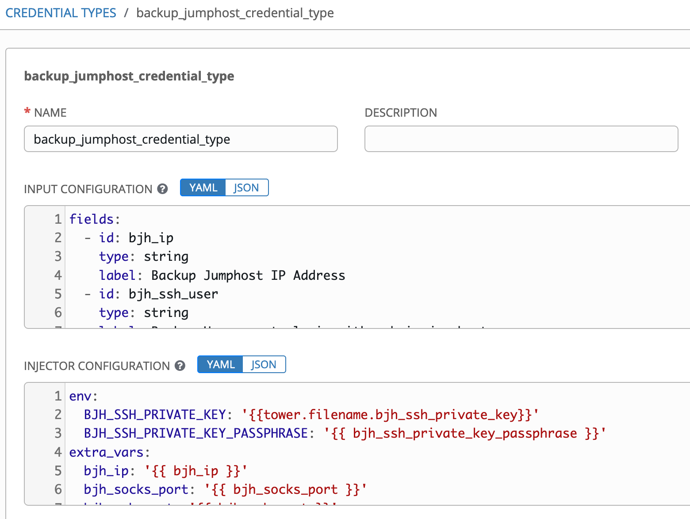

Although this test will be performed with a credential created from the above credential type for a single hop backup jumphost, we can just as easily create multiple hop backup jumphost credential types. The two jumphost credentials we will be passing to the template are shown below. The first is the primary credential that will connect to the jumphost ec2-52-201-237-93.compute-1.amazonaws.com on port 22.

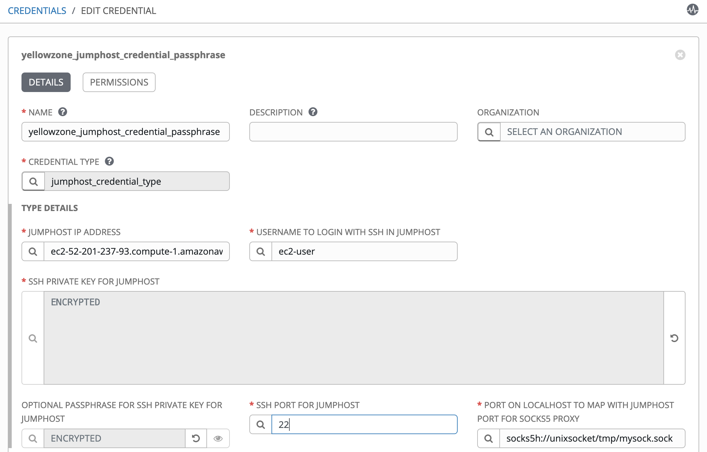

The backup credential will use the jumphost ec2-54-152-89-108.compute-1.amazonaws.com on port 22.

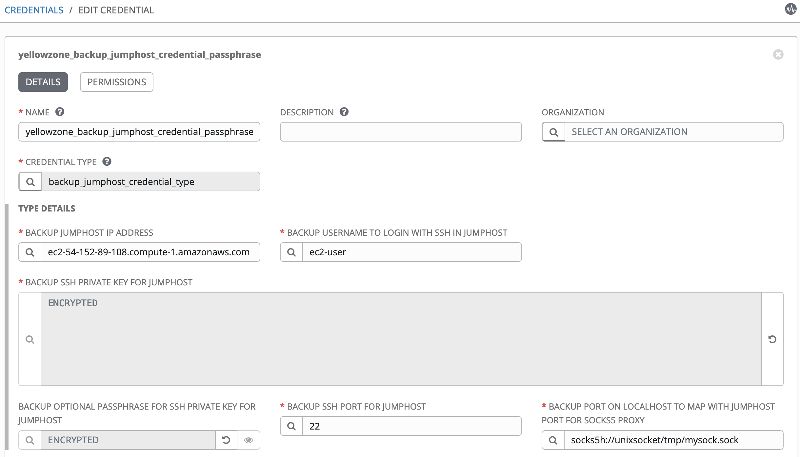

The job template with the 3 credentials (includes the above 2 and the host credential) passed to it looks as follows:

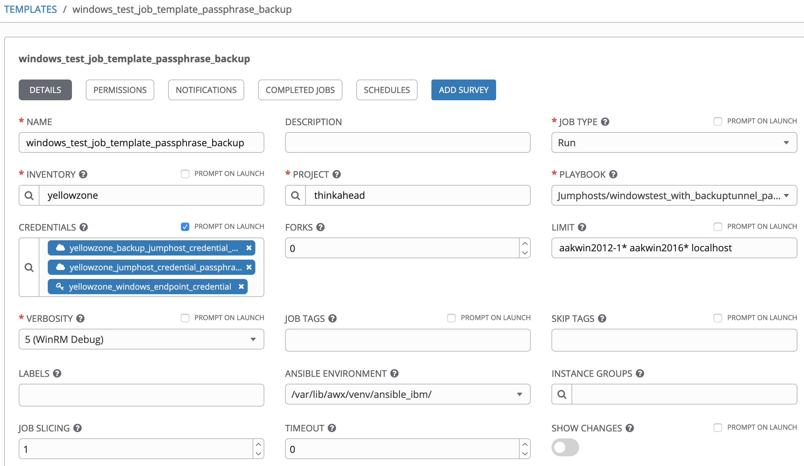

Note the backup jumphost credential, the primary jumphost credential, and the endpoint windows host endpoint credential. We can pass the 3 credentials because they are all of different types. We can pass one credential of each unique type. As before, the two Windows hosts are targeted with the LIMIT set to aakwin2012-1* aakwin2016* and the localhost in the LIMIT is to create the tunnel.

The output of the job run shows that the primary tunnel was successfully created. The jh1 means that the primary credential with single jumphost was used to create the tunnel and the passphrase for this jumphost key was also successfully provided at the prompt by the expect script in the role.

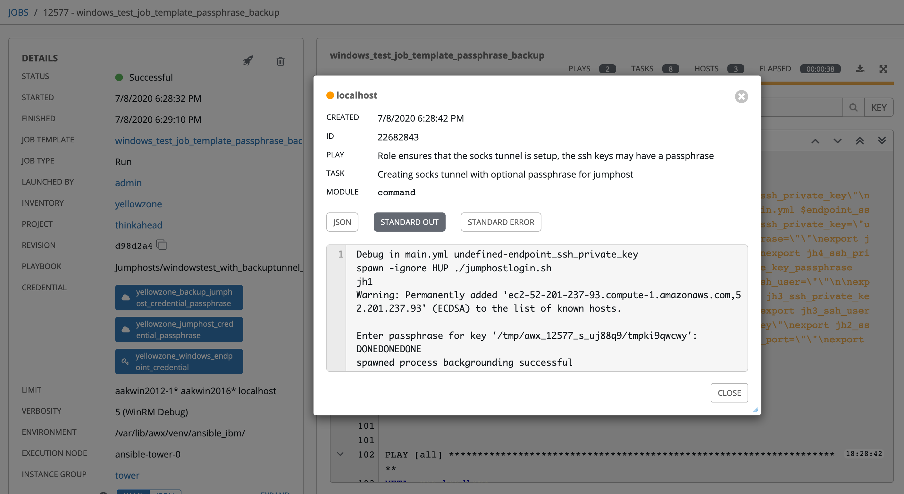

We will run this again, but this time we will change the port of the primary credential to 2222 a non existing port on the jumphost (or turn the primary jumphost VM off).

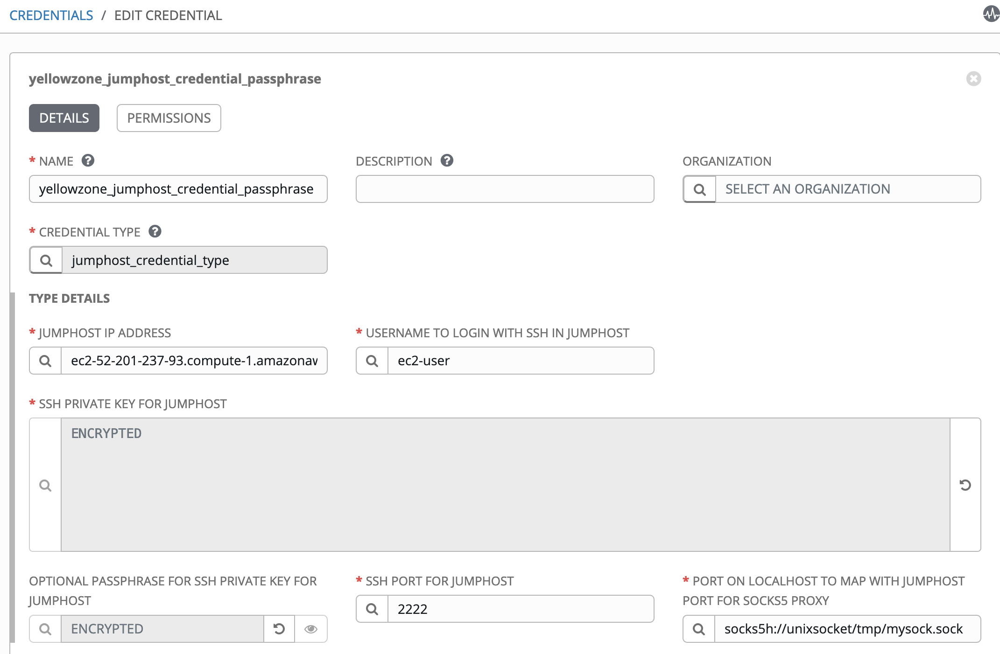

This time the job run shows jh1 with Connection timed out, thus the primary connection fails. Next the bjh1 shows that the connection using the backup jumphost ec2-54-152-89-108.compute-1.amazonaws.com was successful and the expect script in the role also successfully provided the passphrase at the prompt.

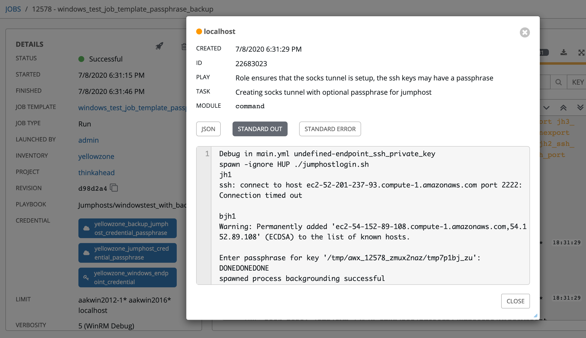

This demonstrated the use of backup jumphosts in Ansible Tower. In the final section we explore the use of reverse ssh tunnels.

#### 4. Reverse ssh Tunnel

Till now we have been using local port forwarding that works by opening a port on the local/source host (Ansible Tower), that is automatically forwarded to through SSH to a port on a remote host. But what if you can't SSH straight to a remote computer? Instead, the remote computer can connect to the source host. With reverse port forwarding, the roles are reversed. Reverse SSH tunneling allows you to use that established connection from remote host to source host to set up a new connection from your local/source host back to the remote host. Because the original connection is from the remote host, using it to go in the other direction from source is using it "in reverse". You're essentially putting a secure reverse connection inside an existing forward secure connection. This means that source-to-remote connection to the remote host acts as a private tunnel inside the original remote-to-source connection.

As an example, let's look at the forward connections we have been establishing from aakrhel001 to aakrhel002. Now let's assume that this connection cannot be made. But we can connect in the opposite direction from aakrhel002 to aakrhel001. We establish a reverse tunnel by establishing the original connection from aakrhel002 to aakrhel001 by running the following command on aakrhel002.yellowykt.com.

`[ec2-user@aakrhel002 ~]$ ssh -i ~/amazontestkey.pem -f -N -T -R 2223:localhost:22 root@aakrhel001.yellowykt.com`

This command is run on the source/local host aakrhel002. The -R (reverse) option tells ssh that new SSH sessions must be created on the remote host (aakrhel001). We will use this reverse tunnel for the rest of the commands in this and the next section.

The image below shows the creation of the Reverse Tunnel and the ssh commands to use the tunnel from other hosts:

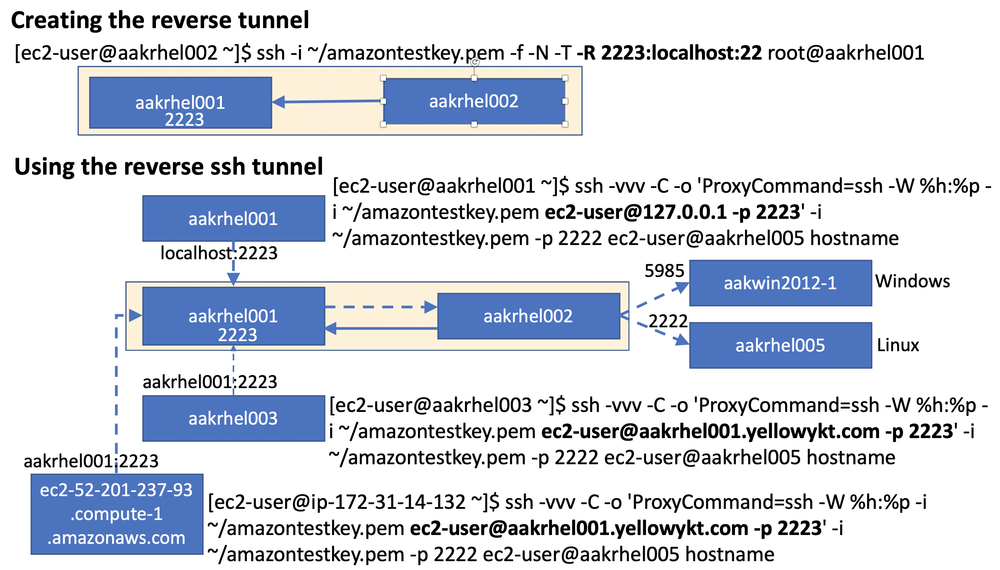

If you check the ports on aakrhel001 after the reverse tunnel is established, you will see it listening on 2223 that was provided in the ssh command with the -R parameter. There is nothing special about the port 2223, you can select another unused port.

`[ec2-user@aakrhel001 ~]$ netstat -an | grep 2223`\
`tcp        0      0 127.0.0.1:2223          0.0.0.0:*               LISTEN`\
`tcp6       0      0 ::1:2223                :::*                    LISTEN`

Now when we ssh to localhost:2223 from aakrhel001, the command goes to aakrhel002. See the output of the command that shows aakrhel002.

`[ec2-user@aakrhel001 ~]$ ssh -i ~/amazontestkey.pem ec2-user@127.0.0.1 -p 2223 -o StrictHostKeyChecking=no -o UserKnownHostsFile=/dev/null hostname`

`Warning: Permanently added '[127.0.0.1]:2223' (ECDSA) to the list of known hosts.`\
`aakrhel002`

If we use the localhost:2223 as a tunnel from aakrhel001, the command to connect to aakrhel005:2222 via the jumphost aakrhel002 (reverse tunnel) looks as follows:

`[ec2-user@aakrhel001 ~]$ ssh -vvv -C -o ControlMaster=auto -o ControlPersist=60s -o StrictHostKeyChecking=no -o KbdInteractiveAuthentication=no -o PreferredAuthentications=gssapi-with-mic,gssapi-keyex,hostbased,publickey -o PasswordAuthentication=no -o 'ProxyCommand=ssh -W %h:%p -i ~/amazontestkey.pem ec2-user@localhost -p 2223 -o StrictHostKeyChecking=no -o UserKnownHostsFile=/dev/null' -i ~/amazontestkey.pem -p 2222 ec2-user@aakrhel005 hostname`

`Output:`\
`aakrhel005`

If we want to connect from another VM, for example aakrhel003.yellowykt.com and use the reverse tunnel that allows us to jump from aakrhel001 to aakrhel002, we can use the following command.

`[ec2-user@aakrhel003 ~]$ ssh -vvv -C -o ControlMaster=auto -o ControlPersist=60s -o StrictHostKeyChecking=no -o KbdInteractiveAuthentication=no -o PreferredAuthentications=gssapi-with-mic,gssapi-keyex,hostbased,publickey -o PasswordAuthentication=no -o 'ProxyCommand=ssh -W %h:%p -i ~/amazontestkey.pem ec2-user@aakrhel001.yellowykt.com -p 2223 -o StrictHostKeyChecking=no -o UserKnownHostsFile=/dev/null' -i ~/amazontestkey.pem -p 2222 ec2-user@aakrhel005 hostname`

This command however will not work because the port 2223 is listening on 127.0.0.1. To make it work, the GatewayPorts setting needs to be changed on aakrhel001.yellowykt.com. Set GatewayPorts to yes in /etc/ssh/sshd_config. Then restart sshd, kill the previous tunnel from aakrhel002 and rerun the ssh command on aakrhel002 with the -R to establish the tunnel. Now you will see the tunnel listening on 0.0.0.0:2223 (instead of 127.0.0.1:2223)

`[ec2-user@aakrhel001 ~]$ netstat -an | grep 2223`\
`tcp        0      0 0.0.0.0:2223            0.0.0.0:*               LISTEN`\
`tcp6       0      0 :::2223                 :::*                    LISTEN`

Now the command run on aakrhel003 will work and output

`aakrhel005`

**What is the GatewayPorts parameter?**

    Specifies whether remote hosts are allowed to connect to ports forwarded
    for the client. By default, sshd(8) binds remote port forwardings to the
    loopback address.This prevents other remote hosts from connecting to
    forwarded ports. GatewayPorts can be used to specify that sshd should
    allow remote port forwardings to bind to non-loopback addresses, thus
    allowing other hosts to connect.  The argument may be "no" to force remote
    port forwardings to be available to the local host only, "yes" to force
    remote port forwardings to bind to the wildcard address, or
    "clientspecified" to allow the client to select the address to which the
    forwarding is bound. The default is "no".

Allowing foreign traffic to pass through your firewall is a huge security risk. You should take all the necessary precautions and enable this with GatewayPorts only if absolutely needed and restrict using "GatewayPorts clientspecified".

**Tunnel that uses the reverse tunnel in the path**

The following command creates a tunnel that listens locally on port 1234 (-D 127.0.0.1:1234) and connects to aakrhel001.yellowykt.com:2223 in order to use the reverse tunnel back to aakrhel002. Thus, even though there is only one ProxyCommand, the previous reverse ssh tunnel takes it all the way through 3 jumphosts.

Laptop -> **ec2-52-201-237-93.compute-1.amazonaws.com -> aakrhel001.yellowykt.com:2223( -> aakrhel002)** -> host endpoints

`ssh -CfNq -D 127.0.0.1:1234 -v -i ~/amazontestkey.pem -o ProxyCommand='ssh -v -i ~/amazontestkey.pem -W aakrhel001.yellowykt.com:22 ec2-user@ec2-52-201-237-93.compute-1.amazonaws.com' -p 2223 ec2-user@aakrhel001.yellowykt.com`

The "ps -ef" output will show the tunnel established:

`501 34018 1 0 11:05AM ?? 0:00.01 ssh -CfNq -D 127.0.0.1:1234 -v -i /Users/karve/amazontestkey.pem -o ProxyCommand=ssh -v -i ~/amazontestkey.pem -W aakrhel001.yellowykt.com:22 ec2-user@ec2-52-201-237-93.compute-1.amazonaws.com -p 2223 ec2-user@aakrhel001.yellowykt.com`\
`501 34017 1 0 11:05AM ttys005 0:00.12 ssh -v -i /Users/karve/amazontestkey.pem -W aakrhel001.yellowykt.com:22 ec2-user@ec2-52-201-237-93.compute-1.amazonaws.com`

Both the commands below use this tunnel and work by connecting to the host endpoints via aakrhel002 (over the reverse tunnel).

**4a. Connecting to Windows VM aakwin2012-1.yellowykt.com**

`curl -vvv --proxy socks5h://127.0.0.1:1234 --header "Content-Type: application/soap+xml;charset=UTF-8" http://aakwin2012-1.yellowykt.com:5985/wsman --basic -u Administrator:$password --data '<s:Envelope xmlns:s="http://www.w3.org/2003/05/soap-envelope" xmlns:wsmid="http://schemas.dmtf.org/wbem/wsman/identity/1/wsmanidentity.xsd"><s:Header/><s:Body><wsmid:Identify/></s:Body></s:Envelope>'`

**Output**

`debug1: Connection to port 1234 forwarding to socks port 0 requested.`\
`debug1: channel 1: new [dynamic-tcpip]<s:Envelope xml:lang="en-US" xmlns:s="http://www.w3.org/2003/05/soap-envelope"><s:Header></s:Header><s:Body><wsmid:IdentifyResponse xmlns:wsmid="http://schemas.dmtf.org/wbem/wsman/identity/1/wsmanidentity.xsd"><wsmid:ProtocolVersion>http://schemas.dmtf.org/wbem/wsman/1/wsman.xsd</wsmid:ProtocolVersion><wsmid:ProductVendor>Microsoft Corporation</wsmid:ProductVendor><wsmid:ProductVersion>OS: 6.3.9600 SP: 0.0 Stack: 3.0</wsmid:ProductVersion><wsmid:SecurityProfiles><wsmid:SecurityProfileName>http://schemas.dmtf.org/wbem/wsman/1/wsman/secprofile/http/basic</wsmid:SecurityProfileName><wsmid:SecurityProfileName>http://schemas.dmtf.org/wbem/wsman/1/wsman/secprofile/http/spnego-kerberos</wsmid:SecurityProfileName></wsmid:SecurityProfiles></wsmid:IdentifyResponse></s:Body></s:Envelope>debug1: channel 1: free: direct-tcpip: listening port 1234 for aakwin2012-1.yellowykt.com port 5985, connect from 127.0.0.1 port 55999 to 127.0.0.1 port 1234, nchannels 2`

**4b. Connecting to Linux VM aakrhel005.yellowykt.com:2222**

``ssh ec2-user@aakrhel005.yellowykt.com -p 2222 -i ~/amazontestkey.pem -o StrictHostKeyChecking=no -o UserKnownHostsFile=/dev/null -vvv -o ProxyCommand="/usr/bin/nc -X 5 -x 127.0.0.1:1234 %h %p" echo Hello \`hostname\` ``

**Output**

`Hello aakrhel005`

**4c. Connecting to Linux VM using python with modified socks** <https://github.com/nitzmahone/PySocks/blob/hack_unix_domain_socket_file_support/socks.py#L179,L180>

Both the following tunnels use the reverse tunnel to connect from aakrhel001 to aakrhel002. This was tested on the Ansible Tower container with the custom image by running the source /var/lib/awx/venv/ansible_test/bin/activate. Two ways to establish the tunnel are:

**Establish tunnel using Unix domain socket file**
Using this tunnel using python/Ansible/Tower container requires the modified pysocks.

`ssh -CfNq -D /tmp/mysock.sock -v -i ~/amazontestkey.pem -o ProxyCommand='ssh -v -i ~/amazontestkey.pem -W aakrhel001.yellowykt.com:22 ec2-user@ec2-52-201-237-93.compute-1.amazonaws.com' -p 2223 ec2-user@aakrhel001.yellowykt.com`

**Establish tunnel using Socket port**

`ssh -CfNq -D 127.0.0.1:1234 -v -i ~/amazontestkey.pem -o ProxyCommand='ssh -v -i ~/amazontestkey.pem -W aakrhel001.yellowykt.com:22 ec2-user@ec2-52-201-237-93.compute-1.amazonaws.com' -p 2223 ec2-user@aakrhel001.yellowykt.com`

The test code [linuxtest_with_tunnel.py](https://github.com/thinkahead/DeveloperRecipes/blob/master/Jumphosts/linuxtest_with_tunnel.py "linuxtest_with_tunnel.py") has three options: Option 1 is used with the first tunnel (socket file). Option 2 and 3 are to be used with the second tunnel (socket port). Options 1 and 2 in the python code are commented out, so it will work by default using the socket port tunnel (on reverse tunnel) established earlier.

**Source code for linuxtest_with_tunnel.py** -- You will need to modify the code to use your ssh key (/var/lib/awx/amazontestkey.pem), correct socket file (/tmp/mysock.sock) or socks port (1234) and the ssh target host/port (aakrhel005.yellowykt.com:2222).

``` python
import paramiko
import socks

try:
    #socks.set_default_proxy(proxy_type=socks.SOCKS5,addr="/tmp/mysock.sock") # This default will not work with the changes to pysocks

    # Option 1: Use Unix Socket File
    #s=socks.create_connection(("aakrhel005.yellowykt.com",2222), timeout=5, proxy_type=socks.SOCKS5, proxy_addr="/tmp/mysock.sock")

    # Option 2: Use Socks Port
    #s=socks.create_connection(("aakrhel005.yellowykt.com",2222), timeout=5, proxy_type=socks.SOCKS5, proxy_addr="127.0.0.1", proxy_port=1234)

    # Option 3: Use Socks Port
    s = socks.socksocket()
    s.set_proxy(proxy_type=socks.SOCKS5, addr="127.0.0.1", port=1234)
    s.connect(("aakrhel005.yellowykt.com",2222))

    k = paramiko.RSAKey.from_private_key_file('/var/lib/awx/amazontestkey.pem')
    transport = paramiko.Transport(s)
    transport.connect(username="ec2-user", pkey=k)
    ssh = paramiko.SSHClient()
    ssh.set_missing_host_key_policy(paramiko.AutoAddPolicy())
    ssh._transport = transport
    commands = [ "hostname", "pwd" ]`

`    for command in commands:
        print "Executing {}:".format( command )
        stdin, stdout, stderr = ssh.exec_command(command)
        print stdout.read()
        print( "Errors:")
        print stderr.read()
    ssh.close()
    transport.close()
except Exception, err:
    print(err)
    print('Error connecting to Host')
```

**Output of hostname and pwd run on target host aakrhel005.yellowykt.com (with all the three options)**

`Executing hostname:`\
`aakrhel005`

`Errors:`

`Executing pwd:`\
`/home/ec2-user`

`Errors:`

#### 5. Using reverse ssh tunnel in Ansible Tower

If you have reverse ssh tunnels preestablished to Ansible Tower directly on some port, you can use the ProxyCommand that connects to this port. If instead there are intermediate hops with such preestablished reverse ssh, Ansible Tower can take advantage of those too.

Let's check this with a real example in Tower. The 2 jumphost credential is yellowzone_2jumphost_credential. This has the first jumphost hop ec2-52-201-237-93.compute-1.amazonaws.com and the second aakrhel001.yellowykt.com to previously established reverse tunnel on port 2223 (that takes it to aakrhel002.yellowykt.com the final hop). The socks port that the playbook will use is socks5h://localhost:1235. We could also use the unixsocket instead of the socks port, the role handles both automatically as seen in [Part 5](../multiple-jumphosts-in-ansible-tower-part-5/ "Multiple Jumphosts in Ansible Tower -- Part 5").

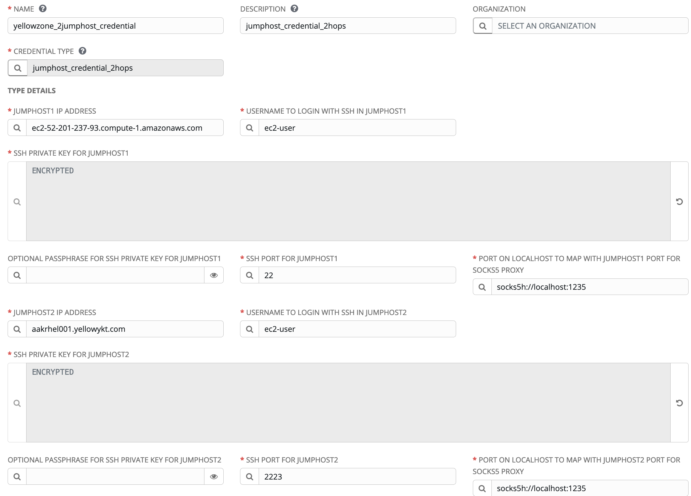

The job template windows_test_job_template_passphrase uses the above yellowzone_2jumphost_credential credential as shown in screenshot below:

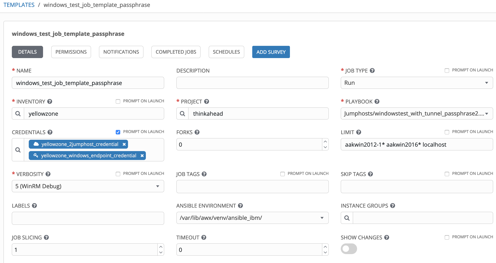

When this job executes, you will see the job output log with role creating the tunnel on -D localhost:1235 and connecting to port 2223 on aakrhel001.yellowykt.com. The rest of the job successfully executes the connection (via aakrhel002.yellowykt.com) to both the Windows VMs, the aakwin2012-1.yellowykt.com and the aakrhel2016-1.yellowykt.com. The win_ping output is also seen in the background output in screenshot below.

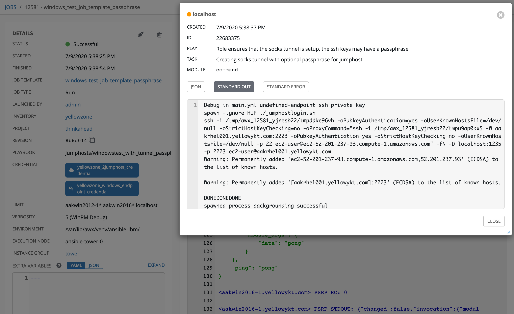

This section showed how to take advantage of the preestablished reverse ssh tunnel from Ansible Tower and create a new tunnel.

#### 6. Conclusion

Part 6 described multiple mechanisms to use backup jumphosts. It also demonstrated the mechanism to use the backup path if the main path for the jumphosts fails. We also covered the use of reverse ssh tunnels from Ansible Tower. This concludes the 6 part series on "Multiple Jumphosts in Ansible Tower". Hope you have enjoyed the article. Share your thoughts in the comments or engage in the conversation with me on Twitter @aakarve. I look forward to hearing about how you take advantage of multiple jumphosts and if you would like to see something covered in more detail.

#### 7. References
- Selecting Interface for SSH Port Forwarding <https://serverfault.com/questions/379344/selecting-interface-for-ssh-port-forwarding>
- Multiple Jumphosts in Ansible Tower -- Part 1: Connecting to Linux hosts using ssh with nested ProxyCommand <https://developer.ibm.com/recipes/tutorials/multiple-jumphosts-in-ansible-tower-part-1>
- Multiple Jumphosts in Ansible Tower -- Part 2: Connecting to Windows/Linux hosts with ssh tunnel SOCKS5 proxy <https://developer.ibm.com/recipes/tutorials/multiple-jumphosts-in-ansible-tower-part-2>
- Multiple Jumphosts in Ansible Tower -- Part 3: Ssh tunnel SOCKS5 proxy with passphrase enabled for ssh keys <https://developer.ibm.com/recipes/tutorials/multiple-jumphosts-in-ansible-tower-part-3>
- Multiple Jumphosts in Ansible Tower -- Part 4: Multi jumphost connections to Linux hosts using ssh-add to add keys to ssh-agent <https://developer.ibm.com/recipes/tutorials/multiple-jumphosts-in-ansible-tower-part-4/>
- Multiple Jumphosts in Ansible Tower -- Part 5: Unix domain socket file instead of socks port <https://developer.ibm.com/recipes/tutorials/multiple-jumphosts-in-ansible-tower-part-5/>
- Multiple Jumphosts in Ansible Tower -- Part 7: Failover using redundant jumphosts, tweaking ssh parameters and memory requirements for jumphosts <https://developer.ibm.com/recipes/tutorials/multiple-jumphosts-in-ansible-tower-part-7/>
- Multiple Jumphosts in Ansible Tower -- Part 8: Transferring files using ansible synchronize module and rsync <https://developer.ibm.com/recipes/tutorials/multiple-jumphosts-in-ansible-tower-part-8/>
- Multiple Jumphosts in Ansible Tower -- Part 9: Pull secrets from remote 3rd-party vaults over multiple jumphost hops <https://developer.ibm.com/recipes/tutorials/multiple-jumphosts-in-ansible-tower-part-9/>
- Multiple Jumphosts in Ansible Tower -- Part 10: Using Container Groups instead of bubblewrap for isolation of jobs <https://developer.ibm.com/recipes/tutorials/multiple-jumphosts-in-ansible-tower-part-10/>
- Multiple Jumphosts in Ansible Tower -- Part 11: Using Container Groups with sshuttle proxy <https://developer.ibm.com/recipes/tutorials/multiple-jumphosts-in-ansible-tower-part-11/>
