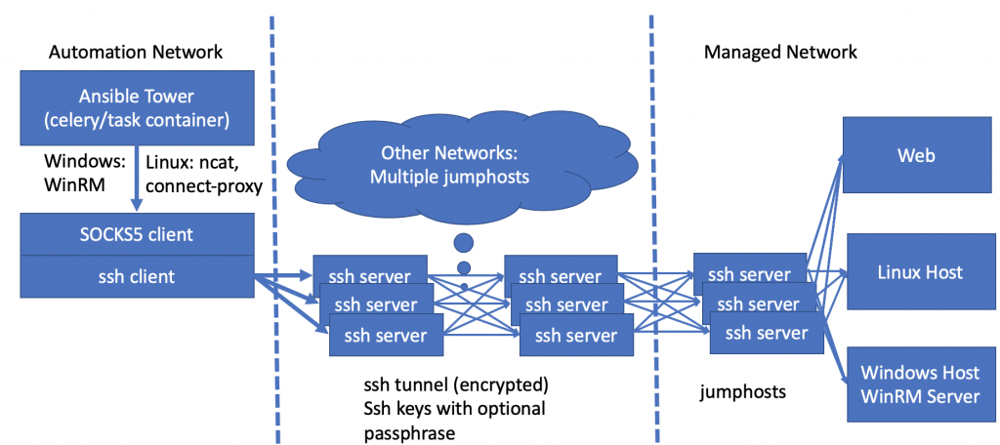
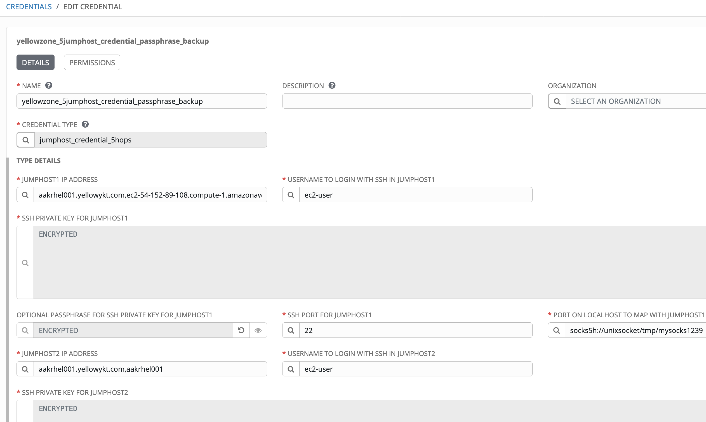
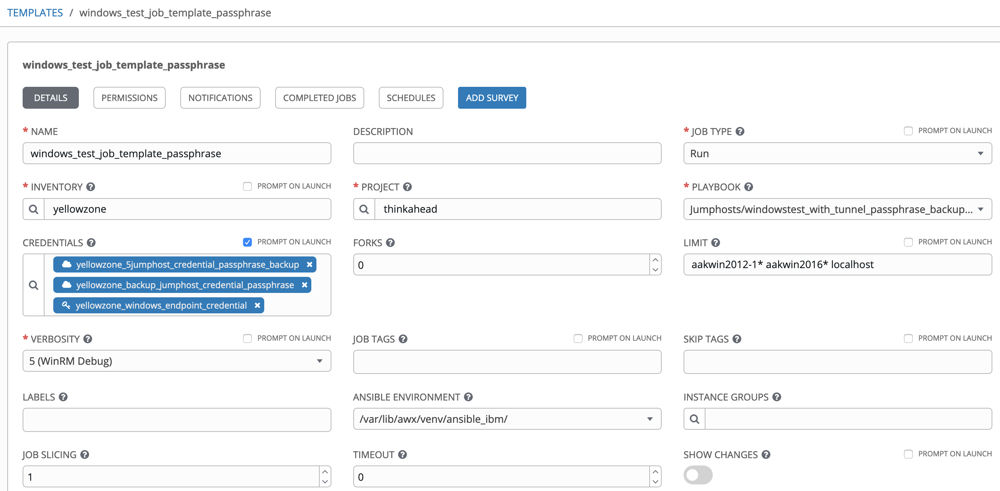
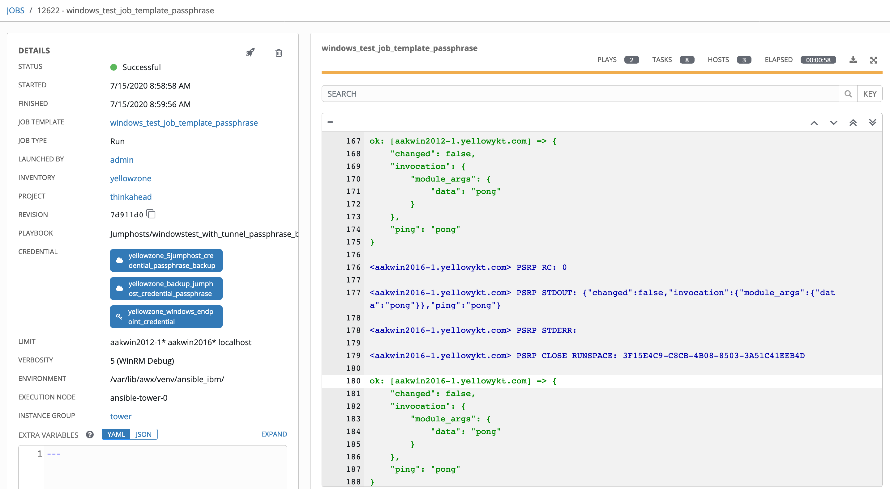

# Multiple Jumphosts in Ansible Tower - Part 7

## Failover using redundant jumphosts, tweaking ssh parameters and memory requirements for jumphosts

Alexei.Karve

Tags: Cloud computing, DevOps, Linux

Published on July 26, 2020 / Updated on September 23, 2020



### Overview

Skill Level: Intermediate

Hands on expertise with Ansible/AWX and knowledge of ssh options

Part 7 covers the use of multiple jumphosts to distribute load or act as redundant jumphosts to provide failover capability, system parameters and ssh settings to support large number of simultaneous ssh connections and the memory usage requirements.

### Ingredients

Ansible Tower/AWX

### Step-by-step

#### 1. Introduction

[Part 6](../multiple-jumphosts-in-ansible-tower-part-6/index.md "Multiple Jumphosts in Ansible Tower -- Part 6") covered the use of the primary path and the secondary/backup path to establish connectivity to the host endpoints. If the primary path is unable to connect to the host endpoint, either because one or more jumphosts in the primary path is dead or unreachable, then we tried the backup jumphosts path to connect to the host endpoint. The number of hops in primary and secondary paths could be different. In many circumstances however, we don't want to try an entirely new path.

Instead, we want multiple jumphosts at each hop level to allow for high availability. The multiple jumphosts at each hop may be used distribute load or act as redundant jumphosts to provide failover capability. An alternative mechanism to entirely different paths is to define multiple hosts at each hop level in a single credential type as (jh1_1, jh1_2, jh1_3...) for jh1 first hop, (jh2_1,jh2_2,...) for jh2 second hop, ... where each hop may have a different number of usable jumphosts indicated after the underscore character. If any jumphost is down, it can retry with different hosts at same hop level and so on adding the next hop until one of the full paths is successful. In this Part 7, we explore this latter mechanism and demonstrate its use in Ansible Tower by extending the use of the same credential types we created previously.

The multiple jumphosts at each hop allow the following functions:
1.  Distribute client requests or network load efficiently across multiple jumphosts
2.  Ensure high availability and reliability by sending requests only to jumphosts that are online
3.  Provide the flexibility to add or remove jumphosts as demand dictates

#### 2. Enumerations of paths containing hops with multiple jumphosts

In order to try all the possible jumphost paths, we need to loop through all the possible combinations of the jumphosts at each hop. Source code [enumerations.sh](https://github.com/thinkahead/DeveloperRecipes/blob/master/Jumphosts/roles/ansible-role-socks5-tunnel-backup2/tasks/enumerations.sh "enumerations.sh") shows a way to compute all paths by enumerating the possibilities at each hop level. The jumphost ip field that originally contained a single host name or ip address at each hop level is now extended to contain a comma separated list of multiple hosts. The a,b,c in the hostnames below indicate the hosts and the 1,2,3,4,5 indicates the hop level. Thus, jh5a indicates the jumphost "a" at level 5. The code below shows 5 hops from jh1_ip to jh5_ip.

**enumerations.sh**
``` bash
jh5_ip=jh5a,jh5b,jh5c
jh4_ip=jh4a,jh4b
jh3_ip=jh3a
jh2_ip=jh2a
jh1_ip=jh1a,jh1b

function enumerate {
  #echo $(for var in `echo $1 | tr , " "`; do echo $var; done | sort -R)
  echo $1 | tr , " "
}

echo "$jh1_ip -> $jh2_ip -> $jh3_ip -> $jh4_ip -> $jh5_ip"
for jh1ip in $(enumerate $jh1_ip); do
  if [ -z "$jh2_ip" ]; then
    echo "Trying $jh1ip"
  else
    for jh2ip in $(enumerate $jh2_ip); do
      if [ -z "$jh3_ip" ]; then
        echo "Trying $jh1ip -> $jh2ip"
      else
        for jh3ip in $(enumerate $jh3_ip); do
          if [ -z "$jh4_ip" ]; then
            echo "Trying $jh1ip -> $jh2ip -> $jh3ip"
          else
            for jh4ip in $(enumerate $jh4_ip); do
              if [ -z "$jh5_ip" ]; then
                echo "Trying $jh1ip -> $jh2ip -> $jh3ip -> $jh4ip"
              else
                for jh5ip in $(enumerate $jh5_ip); do
                  echo "Trying $jh1ip -> $jh2ip -> $jh3ip -> $jh4ip -> $jh5ip"
                done
              fi
            done
          fi
        done
      fi
    done
  fi
done
```

The output from enumerations.sh shows all the paths (enumerations of the hosts one hop at a time from first hop till the last hop). The goal is to try each of these until one of them is successful. Any one of these may be successful at which point we establish the tunnel and exit all the for loops.

`jh1a,jh1b -> jh2a -> jh3a -> jh4a,jh4b -> jh5a,jh5b,jh5c`

`Trying jh1a -> jh2a -> jh3a -> jh4a -> jh5a`\
`Trying jh1a -> jh2a -> jh3a -> jh4a -> jh5b`\
`Trying jh1a -> jh2a -> jh3a -> jh4a -> jh5c`\
`Trying jh1a -> jh2a -> jh3a -> jh4b -> jh5a`\
`Trying jh1a -> jh2a -> jh3a -> jh4b -> jh5b`\
`Trying jh1a -> jh2a -> jh3a -> jh4b -> jh5c`\
`Trying jh1b -> jh2a -> jh3a -> jh4a -> jh5a`\
`Trying jh1b -> jh2a -> jh3a -> jh4a -> jh5b`\
`Trying jh1b -> jh2a -> jh3a -> jh4a -> jh5c`\
`Trying jh1b -> jh2a -> jh3a -> jh4b -> jh5a`\
`Trying jh1b -> jh2a -> jh3a -> jh4b -> jh5b`\
`Trying jh1b -> jh2a -> jh3a -> jh4b -> jh5c`

The enumerate function in the enumerations.sh is set to use the following that allows the exact same sequence of paths to be repeated from left to right.

`echo $1 | tr , " "`

If we instead change it to the following, the enumerate function will randomly choose a host from the comma separated list of jumphosts. This will generate a randomly selected path every time the enumerate.sh script is called. This function is helpful with load balancing to the multiple hosts at each hop.

``echo $(for var in `echo $1 | tr , " "`; do echo $var; done | sort -R)``

#### 3. Establishing connection with multiple hosts at same jumphost hop level

The [jumphostlogin.sh](https://github.com/thinkahead/DeveloperRecipes/blob/master/Jumphosts/roles/ansible-role-socks5-tunnel-backup2/tasks/jumphostlogin.sh "jumphostlogin.sh") is modified to essentially follow the same pattern from enumerations.sh from previous section. It tries the multiple hosts one after another at each hop level using the hosts that were successful at previous hop levels. At each hop level, it checks if it can connect to the first host. If not, it tries next host and so on until a host at this hop level is successful. As soon as it is successful, it uses all the selected hosts upto this hop level and moves on to the next hop level. If there are no more hop levels, then it establishes the tunnel using the selected hosts, one at each hop level.

We can run the script below to test the scripts in the "tasks" directory. It exports the multiple jumphost ip addresses at each hop, ssh keys, ports and calls the [./login_with_expect.sh](https://github.com/thinkahead/DeveloperRecipes/blob/master/Jumphosts/roles/ansible-role-socks5-tunnel-backup2/tasks/login_with_expect.sh "login_with_expect.sh"). This results in establishing the tunnel if a successful path can be found.

``` bash
#export jh1_socks_port=socks5h://unixsocket/tmp/mysock.sock
export jh1_socks_port=socks5h://127.0.0.1:1234
export endpoint_ssh_private_key=/Users/karve/Downloads/expecttest/alexei-key-ecdsa-aakrhel005
export endpoint_ssh_private_key_passphrase=Password4aakrhel005
export jh5_ssh_private_key=/Users/karve/Downloads/expecttest/alexei-key-ecdsa-aakrhel006
export jh5_ssh_private_key_passphrase=Password4aakrhel006
export jh5_ip=aakrhel007.yellowykt.com,aakrhel005.yellowykt.com,aakrhel006.yellowykt.com,aakrhel006.yellowykt.com
export jh5_ip=aakrhel006.yellowykt.com
export jh5_ssh_port=22
export jh5_ssh_user=ec2-user
export jh4_ssh_private_key=/Users/karve/Downloads/expecttest/alexei-key-ecdsa-aakrhel003
export jh4_ssh_private_key_passphrase=Password4aakrhel003
export jh4_ip=aakrhel003.yellowykt.com,aakrhel003.yellowykt.com
export jh4_ssh_port=22
export jh4_ssh_user=ec2-user
export jh3_ssh_private_key=/Users/karve/Downloads/expecttest/alexei-key-ecdsa-aakrhel002
export jh3_ssh_private_key_passphrase=Password4aakrhel002
export jh3_ip=aakrhel002,aakrhel002.yellowykt.com
export jh3_ssh_port=22
export jh3_ssh_user=ec2-user
export jh2_ssh_private_key=/Users/karve/Downloads/expecttest/alexei-key-ecdsa-aakrhel001
export jh2_ssh_private_key_passphrase=Password4aakrhel001
export jh2_ip=aakrhel005.yellowykt.com,aakrhel001.yellowykt.com
export jh2_ssh_port=22
export jh2_ssh_user=ec2-user
export jh1_ssh_private_key=/Users/karve/Downloads/expecttest/alexei-key-ecdsa-jumphost
export jh1_ssh_private_key_passphrase=Password4ec2
export jh1_ip=aakrhel001.yellowykt.com,ec2-52-201-237-94.compute-1.amazonaws.com,ec2-52-201-237-93.compute-1.amazonaws.com,google.com
export jh1_ssh_port=22
export jh1_ssh_user=ec2-user

./login_with_expect.sh
```

After the tunnel is established, it runs an ansible command on target host aakrhel005.yellowykt.com:2222 using the tunnel by connecting to socks5h://127.0.0.1:1234. Finally, the tunnel ssh process is killed to complete the sample run.

`ansible -i "aakrhel005.yellowykt.com," aakrhel005.yellowykt.com -m ping -e "ansible_port=2222" -e "ansible_user=ec2-user" -e "ansible_ssh_private_key_file=~/amazontestkey.pem" -e "ansible_ssh_common_args='-o StrictHostKeyChecking=no -o UserKnownHostsFile=/dev/null -o ProxyCommand=\"/usr/bin/nc -X 5 -x 127.0.0.1:1234 %h %p\"'"`

``#pid=`ps -ef | grep ssh | grep "/tmp/mysock.sock" | grep -v grep | awk '{print $2}'` ``\
``pid=`ps -ef | grep ssh | grep "127.0.0.1:1234" | grep -v grep | awk '{print $2}'` ``\
``echo kill $pid``\
``kill $pid``

The login_with_expect.sh is same as in previous parts. The modified [jumphostlogin.sh](https://github.com/thinkahead/DeveloperRecipes/blob/master/Jumphosts/roles/ansible-role-socks5-tunnel-backup2/tasks/jumphostlogin.sh "jumphostlogin.sh") is shown below. It starts by setting different timeouts at each hop level. You may need to adjust them for your environment if your ssh banner exchange time is higher. You don't want it to be too high otherwise it will need to wait too long to check each of the possible connections to the failed jumphosts, but it should not be too small either and prevent connecting to a valid jumphost.

``` bash
#!/bin/bash

function enumerate {
  echo $(for var in `echo $1 | tr , " "`; do echo $var; done | sort -R)
  #echo $1 | tr , " "
}

TimeOutjh1=5
TimeOutjh2=10
TimeOutjh3=15
TimeOutjh4=20
TimeOutjh5=25

re='^[0-9]+$'
if ! [[ $jh1_socks_port =~ $re ]] ; then
    #echo "Socks port is not a number" >&2
    dparam=`echo $jh1_socks_port | sed "s|^socks.*://||" | sed "s|^unixsocket||"`
else
    #dparam=/tmp/mysocks$jh1_socks_port
    dparam=127.0.0.1:$jh1_socks_port
fi

echo "$jh1_ip -> $jh2_ip -> $jh3_ip -> $jh4_ip -> $jh5_ip"
for jh1ip in $(enumerate $jh1_ip); do
  echo "Hop Testing $jh1ip"
  ssh -o ConnectTimeout=$TimeOutjh1 -i $jh1_ssh_private_key -oPubkeyAuthentication=yes -oUserKnownHostsFile=/dev/null -oStrictHostKeyChecking=no -p $jh1_ssh_port $jh1_ssh_user@$jh1ip -q exit
  retcode=$?
  echo "Hop Tested $jh1ip $retcode"
  if [ $retcode -ne 0 ]; then continue; fi

  if [ -z "$jh2_ip" ]; then
    echo "Using $jh1ip"
    ssh -o ConnectTimeout=$TimeOutjh1 -i $jh1_ssh_private_key -oPubkeyAuthentication=yes -oUserKnownHostsFile=/dev/null -oStrictHostKeyChecking=no -fN -D $dparam -p $jh1_ssh_port $jh1_ssh_user@$jh1ip
    if [ $? -ne 0 ]; then pid=`ps -ef | grep ssh | grep "$dparam" | grep -v grep | awk '{print $2}'`; if [ ! -z "$pid" ]; then echo kill $pid; kill $pid; fi; else echo "Hops1 BREAK";break; fi
  else
    for jh2ip in $(enumerate $jh2_ip); do
      echo "Hop Testing $jh1ip -> $jh2ip"
      ssh -o ConnectTimeout=$TimeOutjh2 -i $jh2_ssh_private_key -oPubkeyAuthentication=yes -oUserKnownHostsFile=/dev/null -oStrictHostKeyChecking=no -oProxyCommand="ssh -i $jh1_ssh_private_key -W $jh2ip:$jh2_ssh_port -oPubkeyAuthentication=yes -oStrictHostKeyChecking=no -oUserKnownHostsFile=/dev/null -p $jh1_ssh_port $jh1_ssh_user@$jh1ip" -p $jh2_ssh_port $jh2_ssh_user@$jh2ip -q exit
      retcode=$?
      echo "Hop Tested $jh1ip -> $jh2ip $retcode"
      if [ $retcode -ne 0 ]; then continue; fi

      if [ -z "$jh3_ip" ]; then
        echo "Using $jh1ip -> $jh2ip"
        ssh -o ConnectTimeout=$TimeOutjh2 -i $jh2_ssh_private_key -oPubkeyAuthentication=yes -oUserKnownHostsFile=/dev/null -oStrictHostKeyChecking=no -oProxyCommand="ssh -i $jh1_ssh_private_key -W $jh2ip:$jh2_ssh_port -oPubkeyAuthentication=yes -oStrictHostKeyChecking=no -oUserKnownHostsFile=/dev/null -p $jh1_ssh_port $jh1_ssh_user@$jh1ip" -fN -D $dparam -p $jh2_ssh_port $jh2_ssh_user@$jh2ip
        if [ $? -ne 0 ]; then pid=`ps -ef | grep ssh | grep "$dparam" | grep -v grep | awk '{print $2}'`; if [ ! -z "$pid" ]; then echo kill $pid; kill $pid; fi; else echo "Hops2 BREAK";break 2; fi
      else
        for jh3ip in $(enumerate $jh3_ip); do
          echo "Hop Testing $jh1ip -> $jh2ip -> $jh3ip"
          ssh -o ConnectTimeout=$TimeOutjh3 -i $jh3_ssh_private_key -oPubkeyAuthentication=yes -oStrictHostKeyChecking=no -oUserKnownHostsFile=/dev/null -oProxyCommand="ssh -i $jh2_ssh_private_key -W $jh3ip:$jh3_ssh_port -oPubkeyAuthentication=yes -oStrictHostKeyChecking=no -oUserKnownHostsFile=/dev/null -oProxyCommand=\"ssh -i $jh1_ssh_private_key -W $jh2ip:$jh2_ssh_port -oPubkeyAuthentication=yes -oStrictHostKeyChecking=no -oUserKnownHostsFile=/dev/null -p $jh1_ssh_port $jh1_ssh_user@$jh1ip\" -p $jh2_ssh_port $jh2_ssh_user@$jh2ip" -p $jh3_ssh_port $jh3_ssh_user@$jh3ip -q exit
          retcode=$?
          echo "Hop Tested $jh1ip -> $jh2ip -> $jh3ip $retcode"
          if [ $retcode -ne 0 ]; then continue; fi

          if [ -z "$jh4_ip" ]; then
            echo "Using $jh1ip -> $jh2ip -> $jh3ip"
            ssh -o ConnectTimeout=$TimeOutjh3 -i $jh3_ssh_private_key -oPubkeyAuthentication=yes -oStrictHostKeyChecking=no -oUserKnownHostsFile=/dev/null -oProxyCommand="ssh -i $jh2_ssh_private_key -W $jh3ip:$jh3_ssh_port -oPubkeyAuthentication=yes -oStrictHostKeyChecking=no -oUserKnownHostsFile=/dev/null -oProxyCommand=\"ssh -i $jh1_ssh_private_key -W $jh2ip:$jh2_ssh_port -oPubkeyAuthentication=yes -oStrictHostKeyChecking=no -oUserKnownHostsFile=/dev/null -p $jh1_ssh_port $jh1_ssh_user@$jh1ip\" -p $jh2_ssh_port $jh2_ssh_user@$jh2ip" -fN -D $dparam -p $jh3_ssh_port $jh3_ssh_user@$jh3ip
            if [ $? -ne 0 ]; then pid=`ps -ef | grep ssh | grep "$dparam" | grep -v grep | awk '{print $2}'`; if [ ! -z "$pid" ]; then echo kill $pid; kill $pid; fi; else echo "Hops3 BREAK";break 3; fi
          else
            for jh4ip in $(enumerate $jh4_ip); do
              echo "Hop Testing $jh1ip -> $jh2ip -> $jh3ip -> $jh4ip"
              ssh -o ConnectTimeout=$TimeOutjh4 -i $jh4_ssh_private_key -oPubkeyAuthentication=yes -oStrictHostKeyChecking=no -oUserKnownHostsFile=/dev/null -oProxyCommand="ssh -i $jh3_ssh_private_key -W $jh4ip:$jh4_ssh_port -oPubkeyAuthentication=yes -oStrictHostKeyChecking=no -oUserKnownHostsFile=/dev/null -oProxyCommand=\"ssh -i $jh2_ssh_private_key -W $jh3ip:$jh3_ssh_port -oPubkeyAuthentication=yes -oStrictHostKeyChecking=no -oUserKnownHostsFile=/dev/null -oProxyCommand=\\\"ssh -i $jh1_ssh_private_key -W $jh2ip:$jh2_ssh_port -oPubkeyAuthentication=yes -oStrictHostKeyChecking=no -oUserKnownHostsFile=/dev/null -p $jh1_ssh_port $jh1_ssh_user@$jh1ip\\\" -p $jh2_ssh_port $jh2_ssh_user@$jh2ip\" -p $jh3_ssh_port $jh3_ssh_user@$jh3ip" -p $jh4_ssh_port $jh4_ssh_user@$jh4ip -q exit
              retcode=$?
              echo "Hop Tested $jh1ip -> $jh2ip -> $jh3ip -> $jh4ip $retcode"
              if [ $retcode -ne 0 ]; then continue; fi

              if [ -z "$jh5_ip" ]; then
                echo "Using $jh1ip -> $jh2ip -> $jh3ip -> $jh4ip"
                ssh -o ConnectTimeout=$TimeOutjh4 -i $jh4_ssh_private_key -oPubkeyAuthentication=yes -oStrictHostKeyChecking=no -oUserKnownHostsFile=/dev/null -oProxyCommand="ssh -i $jh3_ssh_private_key -W $jh4ip:$jh4_ssh_port -oPubkeyAuthentication=yes -oStrictHostKeyChecking=no -oUserKnownHostsFile=/dev/null -oProxyCommand=\"ssh -i $jh2_ssh_private_key -W $jh3ip:$jh3_ssh_port -oPubkeyAuthentication=yes -oStrictHostKeyChecking=no -oUserKnownHostsFile=/dev/null -oProxyCommand=\\\"ssh -i $jh1_ssh_private_key -W $jh2ip:$jh2_ssh_port -oPubkeyAuthentication=yes -oStrictHostKeyChecking=no -oUserKnownHostsFile=/dev/null -p $jh1_ssh_port $jh1_ssh_user@$jh1ip\\\" -p $jh2_ssh_port $jh2_ssh_user@$jh2ip\" -p $jh3_ssh_port $jh3_ssh_user@$jh3ip" -fN -D $dparam -p $jh4_ssh_port $jh4_ssh_user@$jh4ip
                if [ $? -ne 0 ]; then pid=`ps -ef | grep ssh | grep "$dparam" | grep -v grep | awk '{print $2}'`; if [ ! -z "$pid" ]; then echo kill $pid; kill $pid; fi; else echo "Hops4 BREAK";break 4; fi
              else
                for jh5ip in $(enumerate $jh5_ip); do
                  echo "Using $jh1ip -> $jh2ip -> $jh3ip -> $jh4ip -> $jh5ip"
                  ssh -o ConnectTimeout=$TimeOutjh5 -i $jh5_ssh_private_key -oPubkeyAuthentication=yes -oStrictHostKeyChecking=no -oUserKnownHostsFile=/dev/null -oProxyCommand="ssh -i $jh4_ssh_private_key -W $jh5ip:$jh5_ssh_port -oPubkeyAuthentication=yes -oStrictHostKeyChecking=no -oUserKnownHostsFile=/dev/null -oProxyCommand=\"ssh -i $jh3_ssh_private_key -W $jh4ip:$jh4_ssh_port -oPubkeyAuthentication=yes -oStrictHostKeyChecking=no -oUserKnownHostsFile=/dev/null -oProxyCommand=\\\"ssh -i $jh2_ssh_private_key -W $jh3ip:$jh3_ssh_port -oPubkeyAuthentication=yes -oStrictHostKeyChecking=no -oUserKnownHostsFile=/dev/null -oProxyCommand=\\\\\\\"ssh -i $jh1_ssh_private_key -W $jh2ip:$jh2_ssh_port -oStrictHostKeyChecking=no -oUserKnownHostsFile=/dev/null -p $jh1_ssh_port $jh1_ssh_user@$jh1ip\\\\\\\" -p $jh2_ssh_port $jh2_ssh_user@$jh2ip\\\" -p $jh3_ssh_port $jh3_ssh_user@$jh3ip\" -p $jh4_ssh_port $jh4_ssh_user@$jh4ip" -p $jh5_ssh_port $jh5_ssh_user@$jh5ip -fN -D $dparam
                  if [ $? -ne 0 ]; then pid=`ps -ef | grep ssh | grep "$dparam" | grep -v grep | awk '{print $2}'`; if [ ! -z "$pid" ]; then echo kill $pid; kill $pid; fi; else echo "Hops5 BREAK";break 5; fi
                done
              fi
            done
          fi
        done
      fi
    done
  fi
done

sleep 2
echo DONEDONEDONE
```

The output from the above script shows that at hop level 1, the aakrhel001.yellowykt.com and ec2-52-201-237-94.compute-1.amazonaws.com are not successful but the ec2-52-201-237-93.compute-1.amazonaws.com is successful. The jh5ip has two hosts that will be unsuccessful: aakrhel007.yellowykt.com and aakrhel005.yellowykt.com. The aakrhel006.yellowykt.com will be successful at hop level 5. The aakrhel006.yellowykt.com is repeated just to show that it does not cause any problems once a tunnel is successfully established. It shows "Hops5 BREAK" after successfully establishing the tunnel (with the ssh passphrases).

**Output:**

`spawn -ignore HUP ./jumphostlogin.sh`\
`aakrhel001.yellowykt.com,ec2-52-201-237-94.compute-1.amazonaws.com,ec2-52-201-237-93.compute-1.amazonaws.com,google.com -> aakrhel005.yellowykt.com,aakrhel001.yellowykt.com -> aakrhel002,aakrhel002.yellowykt.com -> aakrhel003.yellowykt.com,aakrhel003.yellowykt.com -> aakrhel007.yellowykt.com,aakrhel005.yellowykt.com,aakrhel006.yellowykt.com,aakrhel006.yellowykt.com`\
`Hop Testing aakrhel001.yellowykt.com`\
`Hop Tested aakrhel001.yellowykt.com 255`\
`Hop Testing ec2-52-201-237-94.compute-1.amazonaws.com`\
`Hop Tested ec2-52-201-237-94.compute-1.amazonaws.com 255`\
`Hop Testing ec2-52-201-237-93.compute-1.amazonaws.com`\
`Enter passphrase for key '/Users/karve/Downloads/expecttest/alexei-key-ecdsa-jumphost':`\
`Hop Tested ec2-52-201-237-93.compute-1.amazonaws.com 0`\
`Hop Testing ec2-52-201-237-93.compute-1.amazonaws.com -> aakrhel005.yellowykt.com`\
`Warning: Permanently added 'ec2-52-201-237-93.compute-1.amazonaws.com,52.201.237.93' (ECDSA) to the list of known hosts.`\
`Enter passphrase for key '/Users/karve/Downloads/expecttest/alexei-key-ecdsa-jumphost':`\
`channel 0: open failed: connect failed: Connection refused`\
`stdio forwarding failed`\
`Hop Tested ec2-52-201-237-93.compute-1.amazonaws.com -> aakrhel005.yellowykt.com 255`\
`Hop Testing ec2-52-201-237-93.compute-1.amazonaws.com -> aakrhel001.yellowykt.com\
Warning: Permanently added 'ec2-52-201-237-93.compute-1.amazonaws.com,52.201.237.93' (ECDSA) to the list of known hosts.`\
`Enter passphrase for key '/Users/karve/Downloads/expecttest/alexei-key-ecdsa-jumphost':`\
`Enter passphrase for key '/Users/karve/Downloads/expecttest/alexei-key-ecdsa-aakrhel001':`\
`Hop Tested ec2-52-201-237-93.compute-1.amazonaws.com -> aakrhel001.yellowykt.com 0`\
`Hop Testing ec2-52-201-237-93.compute-1.amazonaws.com -> aakrhel001.yellowykt.com -> aakrhel002`\
`Warning: Permanently added 'ec2-52-201-237-93.compute-1.amazonaws.com,52.201.237.93' (ECDSA) to the list of known hosts.`\
`Enter passphrase for key '/Users/karve/Downloads/expecttest/alexei-key-ecdsa-jumphost':`\
`Warning: Permanently added 'aakrhel001.yellowykt.com' (ECDSA) to the list of known hosts.`\
`Enter passphrase for key '/Users/karve/Downloads/expecttest/alexei-key-ecdsa-aakrhel001':`\
`Enter passphrase for key '/Users/karve/Downloads/expecttest/alexei-key-ecdsa-aakrhel002':`\
`Hop Tested ec2-52-201-237-93.compute-1.amazonaws.com -> aakrhel001.yellowykt.com -> aakrhel002 0`\
`Hop Testing ec2-52-201-237-93.compute-1.amazonaws.com -> aakrhel001.yellowykt.com -> aakrhel002 -> aakrhel003.yellowykt.com`\
`Warning: Permanently added 'ec2-52-201-237-93.compute-1.amazonaws.com,52.201.237.93' (ECDSA) to the list of known hosts.`\
`Enter passphrase for key '/Users/karve/Downloads/expecttest/alexei-key-ecdsa-jumphost':`\
`Warning: Permanently added 'aakrhel001.yellowykt.com' (ECDSA) to the list of known hosts.`\
`Enter passphrase for key '/Users/karve/Downloads/expecttest/alexei-key-ecdsa-aakrhel001':`\
`Warning: Permanently added 'aakrhel002' (ECDSA) to the list of known hosts.\
Enter passphrase for key '/Users/karve/Downloads/expecttest/alexei-key-ecdsa-aakrhel002':`\
`Enter passphrase for key '/Users/karve/Downloads/expecttest/alexei-key-ecdsa-aakrhel003':`\
`Hop Tested ec2-52-201-237-93.compute-1.amazonaws.com -> aakrhel001.yellowykt.com -> aakrhel002 -> aakrhel003.yellowykt.com 0`\
`Using ec2-52-201-237-93.compute-1.amazonaws.com -> aakrhel001.yellowykt.com -> aakrhel002 -> aakrhel003.yellowykt.com -> aakrhel007.yellowykt.com`\
`Warning: Permanently added 'ec2-52-201-237-93.compute-1.amazonaws.com,52.201.237.93' (ECDSA) to the list of known hosts.\
Enter passphrase for key '/Users/karve/Downloads/expecttest/alexei-key-ecdsa-jumphost':`\
`Warning: Permanently added 'aakrhel001.yellowykt.com' (ECDSA) to the list of known hosts.`\
`Enter passphrase for key '/Users/karve/Downloads/expecttest/alexei-key-ecdsa-aakrhel001':`\
`Warning: Permanently added 'aakrhel002' (ECDSA) to the list of known hosts.\
Enter passphrase for key '/Users/karve/Downloads/expecttest/alexei-key-ecdsa-aakrhel002':`\
`Warning: Permanently added 'aakrhel003.yellowykt.com' (ECDSA) to the list of known hosts.`\
`Enter passphrase for key '/Users/karve/Downloads/expecttest/alexei-key-ecdsa-aakrhel003':`\
`channel 0: open failed: administratively prohibited: open failed`\
`stdio forwarding failed`\
`kex_exchange_identification: Connection closed by remote host`\
`Using ec2-52-201-237-93.compute-1.amazonaws.com -> aakrhel001.yellowykt.com -> aakrhel002 -> aakrhel003.yellowykt.com -> aakrhel005.yellowykt.com`\
`Warning: Permanently added 'ec2-52-201-237-93.compute-1.amazonaws.com,52.201.237.93' (ECDSA) to the list of known hosts.`\
`Enter passphrase for key '/Users/karve/Downloads/expecttest/alexei-key-ecdsa-jumphost':`\
`Warning: Permanently added 'aakrhel001.yellowykt.com' (ECDSA) to the list of known hosts.`\
`Enter passphrase for key '/Users/karve/Downloads/expecttest/alexei-key-ecdsa-aakrhel001':`\
`Warning: Permanently added 'aakrhel002' (ECDSA) to the list of known hosts.\
Enter passphrase for key '/Users/karve/Downloads/expecttest/alexei-key-ecdsa-aakrhel002':`\
`Warning: Permanently added 'aakrhel003.yellowykt.com' (ECDSA) to the list of known hosts.`\
`Enter passphrase for key '/Users/karve/Downloads/expecttest/alexei-key-ecdsa-aakrhel003':`\
`channel 0: open failed: connect failed: Connection refused`\
`stdio forwarding failed`\
`kex_exchange_identification: Connection closed by remote host`\
`Using ec2-52-201-237-93.compute-1.amazonaws.com -> aakrhel001.yellowykt.com -> aakrhel002 -> aakrhel003.yellowykt.com -> aakrhel006.yellowykt.com`\
`Warning: Permanently added 'ec2-52-201-237-93.compute-1.amazonaws.com,52.201.237.93' (ECDSA) to the list of known hosts.`\
`Enter passphrase for key '/Users/karve/Downloads/expecttest/alexei-key-ecdsa-jumphost':`\
`Warning: Permanently added 'aakrhel001.yellowykt.com' (ECDSA) to the list of known hosts.`\
`Enter passphrase for key '/Users/karve/Downloads/expecttest/alexei-key-ecdsa-aakrhel001':`\
`Warning: Permanently added 'aakrhel002' (ECDSA) to the list of known hosts.`\
`Enter passphrase for key '/Users/karve/Downloads/expecttest/alexei-key-ecdsa-aakrhel002':`\
`Warning: Permanently added 'aakrhel003.yellowykt.com' (ECDSA) to the list of known hosts.`\
`Enter passphrase for key '/Users/karve/Downloads/expecttest/alexei-key-ecdsa-aakrhel003':`\
`Warning: Permanently added 'aakrhel006.yellowykt.com' (ECDSA) to the list of known hosts.`\
`Enter passphrase for key '/Users/karve/Downloads/expecttest/alexei-key-ecdsa-aakrhel006':`\
`Hops5 BREAK`\
`DONEDONEDONE`\
`spawned process backgrounding successful`\
`aakrhel005.yellowykt.com | SUCCESS => {`\
`    "ansible_facts": {`\
`        "discovered_interpreter_python": "/usr/bin/python"`\
`    },`\
`    "changed": false,`\
`    "ping": "pong"`\
`}`\
`kill 18235`

We can switch the enumerate function to to randomly choose a host from the comma separated list of jumphosts instead of the one currently being used to sequentially select them in the script above.

Remember that if you use the Unix Domain Socket file, the nc, netcat, connect-proxy commands will not work. You will need to use the curl/python with modified pysocks to test the tunnel.

#### 4. Using Ansible Tower to establish connection with multiple hosts at same jumphost hop level

A jumphost credential "yellowzone_5jumphost_credential_passphrase_backup" with 5 hops is created with comma separated ip addresses/hostnames. By extending the use of the credential type this way for multiple jumphosts at each hop, we share the same port, user and ssh key at that hop. Notice the comma separated hostnames in the screenshot below for the "JUMPHOST1 IP ADDRESS" and the "JUMPHOST2 IP ADDRESS".



For the first jumphost hop "Jumphost1 IP Address" is set to the three hosts: "aakrhel001.yellowykt.com,ec2-54-152-89-108.compute-1.amazonaws.com,ec2-52-201-237-93.compute-1.amazonaws.com". The second jumphost hop has two hosts: "aakrhel001.yellowykt.com,aakrhel001". Third one has two hosts: "aakrhel002,aakrhel002.yellowykt.com", the fourth hop has single host: "aakrhel003.yellowykt.com" and the fifth hop has single host: "aakrhel006.yellowykt.com".

The above credential "yellowzone_5jumphost_credential_passphrase_backup" is passed to the job template as shown in the screenshot below along with a Machine Credential "yellowzone_windows_endpoint_credential" for the windows VMs. We will only use the primary path with the "yellowzone_5jumphost_credential_passphrase_backup" in sections below with multiple hosts at each hop. The LIMIT is set to run on two host endpoints the aakwin2012-1.yellowykt.com and the aakwin2016-1.yellowykt.com. The localhost is passed to allow [invoking the role](https://github.com/thinkahead/DeveloperRecipes/blob/master/Jumphosts/windowstest_with_tunnel_passphrase_backup2.yaml#L1-L6 "invoking the role") [ansible-role-socks5-tunnel-backup2](https://github.com/thinkahead/DeveloperRecipes/tree/master/Jumphosts/roles/ansible-role-socks5-tunnel-backup2 "ansible-role-socks5-tunnel-backup2") to establish the tunnel.



Also passed is the "yellowzone_backup_jumphost_credential_passphrase" -- this one is for the secondary/backup path explained in Part 6 that will be used if the promary path fails to establish the connection. This basckup credential may also contain multiple comma separated hosts at each hop and we can extend the role to take advantage of multiple hosts at each hop in the [backup path](https://github.com/thinkahead/DeveloperRecipes/blob/master/Jumphosts/CredentialsBackup.md "Custom Backup Credential Types for Multiple Jumphosts"). This is left as an exercise.

This comma separated hosts will also work with the [separate credentials](https://github.com/thinkahead/DeveloperRecipes/blob/master/Jumphosts/SeparateCredentials.md "separate credentials") at each hop level and the corresponding [separate backup credentials](https://github.com/thinkahead/DeveloperRecipes/blob/master/Jumphosts/SeparateCredentialsBackup.md "separate backup credentials") at each hop level. The only difference will be that we will need to pass in 5 different jumphost credentials + the machine credentials to the job template.

The job template uses the playbook [windowstest_with_tunnel_passphrase_backup2.yaml](https://github.com/thinkahead/DeveloperRecipes/blob/master/Jumphosts/windowstest_with_tunnel_passphrase_backup2.yaml#L6 "windowstest_with_tunnel_passphrase_backup2.yaml") that includes the role [ansible-role-socks5-tunnel-backup2](https://github.com/thinkahead/DeveloperRecipes/tree/master/Jumphosts/roles/ansible-role-socks5-tunnel-backup2 "ansible-role-socks5-tunnel-backup2") with the changes to the [jumphostlogin.sh](https://github.com/thinkahead/DeveloperRecipes/blob/master/Jumphosts/roles/ansible-role-socks5-tunnel-backup2/tasks/jumphostlogin.sh "jumphostlogin.sh") to enumerate the jumphost paths mentioned earlier.

The output log when the role executes and tries to create a tunnel by trying the hosts at each hop is shown below.

It first tries the first host aakrhel001.yellowykt.com in first hop:

`Hop Testing aakrhel001.yellowykt.com`\
`Hop Tested aakrhel001.yellowykt.com 255`

The return code 255 means it was not successful.

Then it tries the second host in the first hop, requires the key that is provided by expect script.

`Hop Testing ec2-54-152-89-108.compute-1.amazonaws.com`\
`Enter passphrase for key '/tmp/awx_12622_epn9ryag/tmpt6ing60f':`\
`Hop Tested ec2-54-152-89-108.compute-1.amazonaws.com 0`

The return code 0 means that it was successful. Thus, first hop was successful.

Now on to the second hop. It tries both the successful hop at level 1 and the first host aakrhel001.yellowykt.com in the hop level 2.

`Hop Testing ec2-54-152-89-108.compute-1.amazonaws.com -> aakrhel001.yellowykt.com`\
`Warning: Permanently added 'ec2-54-152-89-108.compute-1.amazonaws.com,54.152.89.108' (ECDSA) to the list of known hosts.`\
`Enter passphrase for key '/tmp/awx_12622_epn9ryag/tmpt6ing60f':`\
`Enter passphrase for key '/tmp/awx_12622_epn9ryag/tmpnlg0fnti':`\
`Hop Tested ec2-54-152-89-108.compute-1.amazonaws.com -> aakrhel001.yellowykt.com 0`

The return code 0 means that it was successful. Thus, second hop was successful.

And so on ... until finally after all the five hops are successful, it break out of all loops with a successfully established tunnel.

`Hops5 BREAK`\
`DONEDONEDONE`\
`spawned process backgrounding successful`

The full output that eventually find a successful primary path from amongst the multiple jumphosts at each hop is shown below:

`Debug in main.yml undefined-endpoint_ssh_private_key`\
`spawn -ignore HUP ./jumphostlogin.sh`\
`aakrhel001.yellowykt.com,ec2-54-152-89-108.compute-1.amazonaws.com,ec2-52-201-237-93.compute-1.amazonaws.com -> aakrhel001.yellowykt.com,aakrhel001 -> aakrhel002,aakrhel002.yellowykt.com -> aakrhel003.yellowykt.com -> aakrhel006.yellowykt.com`\
`Hop Testing aakrhel001.yellowykt.com`\
`Hop Tested aakrhel001.yellowykt.com 255`\
`Hop Testing ec2-54-152-89-108.compute-1.amazonaws.com`\
`Enter passphrase for key '/tmp/awx_12622_epn9ryag/tmpt6ing60f':`\
`Hop Tested ec2-54-152-89-108.compute-1.amazonaws.com 0`\
`Hop Testing ec2-54-152-89-108.compute-1.amazonaws.com -> aakrhel001.yellowykt.com`\
`Warning: Permanently added 'ec2-54-152-89-108.compute-1.amazonaws.com,54.152.89.108' (ECDSA) to the list of known hosts.`

`Enter passphrase for key '/tmp/awx_12622_epn9ryag/tmpt6ing60f':`\
`Enter passphrase for key '/tmp/awx_12622_epn9ryag/tmpnlg0fnti':`\
`Hop Tested ec2-54-152-89-108.compute-1.amazonaws.com -> aakrhel001.yellowykt.com 0`\
`Hop Testing ec2-54-152-89-108.compute-1.amazonaws.com -> aakrhel001.yellowykt.com -> aakrhel002`\
`Warning: Permanently added 'ec2-54-152-89-108.compute-1.amazonaws.com,54.152.89.108' (ECDSA) to the list of known hosts.`

`Enter passphrase for key '/tmp/awx_12622_epn9ryag/tmpt6ing60f':`\
`Warning: Permanently added 'aakrhel001.yellowykt.com' (ECDSA) to the list of known hosts.`

`Enter passphrase for key '/tmp/awx_12622_epn9ryag/tmpnlg0fnti':`\
`Enter passphrase for key '/tmp/awx_12622_epn9ryag/tmpka94jiq4':`\
`Hop Tested ec2-54-152-89-108.compute-1.amazonaws.com -> aakrhel001.yellowykt.com -> aakrhel002 0`\
`Hop Testing ec2-54-152-89-108.compute-1.amazonaws.com -> aakrhel001.yellowykt.com -> aakrhel002 -> aakrhel003.yellowykt.com`\
`Warning: Permanently added 'ec2-54-152-89-108.compute-1.amazonaws.com,54.152.89.108' (ECDSA) to the list of known hosts.`

`Enter passphrase for key '/tmp/awx_12622_epn9ryag/tmpt6ing60f':`\
`Warning: Permanently added 'aakrhel001.yellowykt.com' (ECDSA) to the list of known hosts.`

`Enter passphrase for key '/tmp/awx_12622_epn9ryag/tmpnlg0fnti':`\
`Warning: Permanently added 'aakrhel002' (ECDSA) to the list of known hosts.`

`Enter passphrase for key '/tmp/awx_12622_epn9ryag/tmpka94jiq4':`\
`Enter passphrase for key '/tmp/awx_12622_epn9ryag/tmpkayomtz6':`\
`Hop Tested ec2-54-152-89-108.compute-1.amazonaws.com -> aakrhel001.yellowykt.com -> aakrhel002 -> aakrhel003.yellowykt.com 0`\
`Using ec2-54-152-89-108.compute-1.amazonaws.com -> aakrhel001.yellowykt.com -> aakrhel002 -> aakrhel003.yellowykt.com -> aakrhel006.yellowykt.com`\
`Warning: Permanently added 'ec2-54-152-89-108.compute-1.amazonaws.com,54.152.89.108' (ECDSA) to the list of known hosts.`

`Enter passphrase for key '/tmp/awx_12622_epn9ryag/tmpt6ing60f':`\
`Warning: Permanently added 'aakrhel001.yellowykt.com' (ECDSA) to the list of known hosts.`

`Enter passphrase for key '/tmp/awx_12622_epn9ryag/tmpnlg0fnti':`\
`Warning: Permanently added 'aakrhel002' (ECDSA) to the list of known hosts.`

`Enter passphrase for key '/tmp/awx_12622_epn9ryag/tmpka94jiq4':`\
`Warning: Permanently added 'aakrhel003.yellowykt.com' (ECDSA) to the list of known hosts.`

`Enter passphrase for key '/tmp/awx_12622_epn9ryag/tmpkayomtz6':`\
`Warning: Permanently added 'aakrhel006.yellowykt.com' (ECDSA) to the list of known hosts.`

`Enter passphrase for key '/tmp/awx_12622_epn9ryag/tmp59m4lq1j':`\
`Hops5 BREAK`\
`DONEDONEDONE`\
`spawned process backgrounding successful`

The output from the job run in screenshot below shows that the win_ping was successfully executed on both the windows VMs aakwin2012-1.yellowykt.com and the aakwin2016-1.yellowykt.com after successfully establishing a tunnel over the available jumphosts.



This section showed the use of multiple jumphosts at each hop. Next we switch our attention to testing the jumphosts with hundreds of simultaneous connections.

#### 5. Tweaking system parameters and ssh settings for testing

The default ssh settings and system parameters may not be sufficient to support a large number of (say 200) simultaneous connections. Some of the common settings to be changed are mentioned below.

**sshd_config:** The default /etc/ssh/sshd_config has:
```
MaxSessions
     Specifies the maximum number of open shell, login or subsystem
     (e.g. sftp) sessions permitted per network connection.  Multiple
     sessions may be established by clients that support connection
     multiplexing.  Setting MaxSessions to 1 will effectively disable
     session multiplexing, whereas setting it to 0 will prevent all
     shell, login and subsystem sessions while still permitting for-
     warding.  The default is 10.

 MaxStartups
     Specifies the maximum number of **concurrent   unauthenticated con-
     nections to the SSH daemon.**  Additional connections will be
     dropped until authentication succeeds or the LoginGraceTime
     expires for a connection.  The default is 10:30:100.

     Alternatively, random early drop can be enabled by specifying the
     three colon separated values "start:rate:full" (e.g.
     "10:30:60").  sshd(8) will refuse connection attempts with a
     probability of "rate/100" (30%) if there are currently
     "start" (10) unauthenticated connections.  The probability
     increases linearly and all connection attempts are refused if the
     number of unauthenticated connections reaches "full" (60).
```

The meaning of MaxStartups 10:30:60 is as follows:

10: Number of unauthenticated connections before we start dropping

30: Percentage chance of dropping once we reach 10 (increases linearly for more than 10)

60: Maximum number of connections at which we start dropping everything

We change the **MaxStartups: 200.** We will get more than this value as previous connections are successfully authenticated.

MaxSessions: 10 -- Since we do not use the same ssh connections for multiple sessions, increasing this beyond the default 10 will not help us.

**System setting** has default somaxconn=128. We should increase it to the max connections you require

`cat /proc/sys/net/core/somaxconn`\
`128`

`sysctl -w net.core.somaxconn=1024`

**Auto-Logout Timeout in SSH:** The ssh "timed out waiting for input: auto-logout" messages is generated by ssh upon reaching an an inactivity time specified by the TMOUT environment variable. Often this value is defined in /etc/profile (globally) or your user's profile (~/.profile or ~/.bash_profile).

To alter the auto-logout amount, set the TMOUT environment variable accordingly:\
`TMOUT=600   #set an auto-logout timeout for 10 minutes`\
`TMOUT=   #turn off auto-logout (user session will not auto-logout due to session inactivity)`

You may want to unset this during testing.

**Install killall**

`yum -y install psmisc`

You will use this to kill your ssh and ssh-agent processes during testing.

`killall ssh`

`killall ssh-agent # Kill the multiple ssh-agent processes started by each run of runme.sh`

**Killed by signal 1.**

To avoid the "killed by signal 1." message when ssh with ProxyCommand completes, set the "-q" ssh parameter when establishing the ssh connection through multiple hops using ProxyCommand to the host endpoint. This should be set for all the ssh occurrances in the command.

**Broken Pipe error message**

Use the ssh command

`ssh -o TCPKeepAlive=no -o ServerAliveInterval=15 -o ServerAliveCountMax=3 $HOST`

TCPKeepAlive: This option only uses TCP keepalives (as opposed to using ssh level keepalives). Ensure TCPKeepAlive is set to No. TCPKeepAlive operates on the TCP layer. It sends an empty TCP ACK packet. Firewalls can be configured to ignore these packets, so if you go through a firewall that drops idle connections, these may not keep the connection alive.

ServerAliveInterval: The server alive messages are sent through the encrypted channel and therefore will not be spoofable. The TCP keepalive option enabled by TCPKeepAlive is spoofable. ServerAliveInterval operates on the ssh layer. It will actually send data through ssh, so the TCP packet has encrypted data in and a firewall can't tell if its a keepalive, or a legitimate packet, so these work better.

This is explained in sshd_config manual (man sshd_config):

ClientAliveInterval -- Sets a timeout interval in seconds after which if no data has been received from the client, sshd will send a message through the encrypted channel to request a response from the client. The default is 0, indicating that these messages will not be sent to the client. This option applies to protocol version 2 only.

ClientAliveCountMax -- The default value is 3. If ClientAliveInterval is set to 15, and ClientAliveCountMax is left at the default, unresponsive SSH clients will be disconnected after approximately 45 seconds. This option applies to protocol version 2 only.

For the client options, see the explanation in man ssh_config:

ServerAliveInterval -- Sets a timeout interval in seconds after which if no data has been received from the server, ssh will send a message through the encrypted channel to request a response from the server. The default is 0, indicating that these messages will not be sent to the server. This option applies to protocol version 2 only.

ServerAliveCountMax -- The default value is 3. If, for example, ServerAliveInterval is set to 15 and ServerAliveCountMax is left at the default, if the server becomes unresponsive, ssh will disconnect after approximately 45 seconds. This option applies to protocol version 2 only.

Set these values low enough but greater than 0 to avoid broken pipe error.

**Watch the memory usage** To check the memory usage ([memory-usage-of-each-process](https://superuser.com/questions/102005/how-can-i-display-the-memory-usage-of-each-process-if-i-do-a-ps-ef/848825 "memory-usage-of-each-process")), add the following memory.sh to the jumphosts, Source/Ansible Tower celery container and Target Host Endpoints. We can use "top" or the following script and run "watch sudo ./memory.sh". The latter uses the /proc/pid#/smaps which gives detailed memory usage information on each process that needs to be run as sudo or root. The Clean pages are pages that have not been modified since they were mapped (read only). The Dirty pages are the ones that have been modified. Private pages are available only to that process, shared pages are mapped by other processes. The Resident Set Size (RSS) is the total number of pages currently mapped into the process that includes the Shared and the Private. Shared_Clean + Shared_Dirty is the part of RSS that is also mapped into other processes. Private_Clean + Private_Dirty part of RSS is only mapped in this process. Proportional Set Size (PSS) is the unshared memory including the proportion of shared memory is reported as the PSS. Thus PSS includes the proportional size of its shared libraries, i.e. if three processes all use a shared library that has 30 pages, that library will only contribute 10 pages to the PSS that is reported for each of the three processes. Shared_Clean are the pages in the mapping that have been referenced by this process and at least one other process, but not written by any process. Shared_Dirty are the pages in the mapping that have been referenced by this process and at least one other process, and written by at least one of those processes. Private_Clean are the pages in the mapping that have been read and not written by this process but not referenced by any other process. Private_Dirty are the pages in the mapping that have been written by this process but not referenced by any other process. Pages can move from Clean to Dirty when they're written to, and from Private to Shared when another process references them.

**memory.sh**

``` bash
#!/bin/bash

for pid in $(ps -ef | grep ssh | awk '{print $2}'); do
    if [ -f /proc/$pid/smaps ]; then
        rss=$(awk 'BEGIN {i=0} /^Rss/ {i = i + $2} END {print i}' /proc/$pid/smaps)
        pss=$(awk 'BEGIN {i=0} /^Pss/ {i = i + $2 + 0.5} END {print i}' /proc/$pid/smaps)
        sc=$(awk 'BEGIN {i=0} /^Shared_Clean/ {i = i + $2} END {print i}' /proc/$pid/smaps)
        sd=$(awk 'BEGIN {i=0} /^Shared_Dirty/ {i = i + $2} END {print i}' /proc/$pid/smaps)
        pc=$(awk 'BEGIN {i=0} /^Private_Clean/ {i = i + $2} END {print i}' /proc/$pid/smaps)
        pd=$(awk 'BEGIN {i=0} /^Private_Dirty/ {i = i + $2} END {print i}' /proc/$pid/smaps)
        echo "Pid: $pid Rss: $rss kB Pss: $pss kB, Shared Clean $sc kB, Shared Dirty $sd kB, Private $(($pd + $pc)) kB"
    fi
done
```

Tuning TCP is not easy. No single solution fits all situations. You need to be careful to set TCP buffers properly in a production setup and test the capacity of the end-to-end path especially for supporting high-bandwidth applications. Linux OS added TCP buffer autotuning. The buffer size is continuously readjusted up max autotune size as the data transfer takes place. Additional settings are outside the scope of this article. Detailed information is available in the references.

#### 6. Testing simultaneous connections

Test script with 10 simultaneous connections writing 100MB from your Source VM to Target Host Endpoint over five jumphost hops:

``` bash
eval `ssh-agent`
#export jh1_socks_port=socks5h://unixsocket/tmp/mysock.sock
export jh1_socks_port=socks5h://127.0.0.1:1234
export endpoint_ssh_private_key=/Users/karve/Downloads/expecttest/alexei-key-ecdsa-aakrhel005
export endpoint_ssh_private_key_passphrase=Password4aakrhel005
export jh5_ssh_private_key=/Users/karve/Downloads/expecttest/alexei-key-ecdsa-aakrhel006
export jh5_ssh_private_key_passphrase=Password4aakrhel006
export jh5_ip=aakrhel006.yellowykt.com
export jh5_ssh_port=22
export jh5_ssh_user=ec2-user
export jh4_ssh_private_key=/Users/karve/Downloads/expecttest/alexei-key-ecdsa-aakrhel003
export jh4_ssh_private_key_passphrase=Password4aakrhel003
export jh4_ip=aakrhel003.yellowykt.com
export jh4_ssh_port=22
export jh4_ssh_user=ec2-user
export jh3_ssh_private_key=/Users/karve/Downloads/expecttest/alexei-key-ecdsa-aakrhel002
export jh3_ssh_private_key_passphrase=Password4aakrhel002
export jh3_ip=aakrhel002,aakrhel002.yellowykt.com
export jh3_ssh_port=22
export jh3_ssh_user=ec2-user
export jh2_ssh_private_key=/Users/karve/Downloads/expecttest/alexei-key-ecdsa-aakrhel001
export jh2_ssh_private_key_passphrase=Password4aakrhel001
export jh2_ip=aakrhel001.yellowykt.com
export jh2_ssh_port=22
export jh2_ssh_user=ec2-user
export jh1_ssh_private_key=/Users/karve/Downloads/expecttest/alexei-key-ecdsa-jumphost
export jh1_ssh_private_key_passphrase=Password4ec2
export jh1_ip=ec2-52-201-237-93.compute-1.amazonaws.com
export jh1_ssh_port=22
export jh1_ssh_user=ec2-user
./login_with_expect.sh
```

`cmd="dd if=/dev/zero bs=1024 count=100000 | ssh -q ec2-user@aakrhel005.yellowykt.com -p 2222 -i $endpoint_ssh_private_key -o TCPKeepAlive=no -o ServerAliveInterval=15 -o StrictHostKeyChecking=no -o UserKnownHostsFile=/dev/null -A -oStrictHostKeyChecking=no -oUserKnownHostsFile=/dev/null -oProxyCommand=\"ssh -q -i $jh5_ssh_private_key -W %h:%p -oStrictHostKeyChecking=no -oUserKnownHostsFile=/dev/null -oProxyCommand=\\\"ssh -q -i $jh4_ssh_private_key -W aakrhel006.yellowykt.com:22 -oStrictHostKeyChecking=no -oUserKnownHostsFile=/dev/null -oProxyCommand=\\\\\\\"ssh -q -i $jh3_ssh_private_key -W aakrhel003.yellowykt.com:22 -oStrictHostKeyChecking=no -oUserKnownHostsFile=/dev/null -oProxyCommand=\\\\\\\\\\\\\\\"ssh -q -i $jh2_ssh_private_key -W aakrhel002.yellowykt.com:22 -oStrictHostKeyChecking=no -oUserKnownHostsFile=/dev/null -oProxyCommand=\\\\\\\\\\\\\\\\\\\\\\\\\\\\\\\"ssh -q -i $jh1_ssh_private_key -W aakrhel001.yellowykt.com:22 -oStrictHostKeyChecking=no -oUserKnownHostsFile=/dev/null ec2-user@ec2-52-201-237-93.compute-1.amazonaws.com\\\\\\\\\\\\\\\\\\\\\\\\\\\\\\\" ec2-user@aakrhel001.yellowykt.com\\\\\\\\\\\\\\\" ec2-user@aakrhel002.yellowykt.com\\\\\\\" ec2-user@aakrhel003.yellowykt.com\\\" ec2-user@aakrhel006.yellowykt.com\" \"echo START;sleep \$(( \$RANDOM%10+20 ));hostname;cat > /dev/null;echo END\""`\
`for i in {1..10}; do eval $cmd & done`

The dd generates the 100MB of data and pipes it over the hops to reach the target host endpoint on which it is cat to /dev/null. If you do not have a lot of data being sent over the jumphosts, you can test with the following cmd in instead of the one that sends 100MB with the dd command above.

`cmd="ssh -q ec2-user@aakrhel005.yellowykt.com -p 2222 -i $endpoint_ssh_private_key -o StrictHostKeyChecking=no -o UserKnownHostsFile=/dev/null -A -oStrictHostKeyChecking=no -oUserKnownHostsFile=/dev/null -oProxyCommand=\"ssh -i $jh5_ssh_private_key -W %h:%p -oStrictHostKeyChecking=no -oUserKnownHostsFile=/dev/null -oProxyCommand=\\\"ssh -i $jh4_ssh_private_key -W aakrhel006.yellowykt.com:22 -oStrictHostKeyChecking=no -oUserKnownHostsFile=/dev/null -oProxyCommand=\\\\\\\"ssh -i $jh3_ssh_private_key -W aakrhel003.yellowykt.com:22 -oStrictHostKeyChecking=no -oUserKnownHostsFile=/dev/null -oProxyCommand=\\\\\\\\\\\\\\\"ssh -i $jh2_ssh_private_key -W aakrhel002.yellowykt.com:22 -oStrictHostKeyChecking=no -oUserKnownHostsFile=/dev/null -oProxyCommand=\\\\\\\\\\\\\\\\\\\\\\\\\\\\\\\"ssh -i $jh1_ssh_private_key -W aakrhel001.yellowykt.com:22 -oStrictHostKeyChecking=no -oUserKnownHostsFile=/dev/null ec2-user@ec2-52-201-237-93.compute-1.amazonaws.com\\\\\\\\\\\\\\\\\\\\\\\\\\\\\\\" ec2-user@aakrhel001.yellowykt.com\\\\\\\\\\\\\\\" ec2-user@aakrhel002.yellowykt.com\\\\\\\" ec2-user@aakrhel003.yellowykt.com\\\" ec2-user@aakrhel006.yellowykt.com\" \"sleep \$(( \$RANDOM%10+20 ));hostname\""`

We can increase the 10 to a larger number desired. For example, to test with 100 simultaneous connections, change the loop to:

`for i in {1..100}; do eval $cmd & done`

The connections wait for a minimum of 20 seconds + an additional random value upto 10 seconds before echo-ing the hostname. This is to give sufficient time to establish all the required simultaneous connections and have them open at the same time for testing.

#### 7. Memory usage and requirements

The memory usage for the tests below is in MB and computed as the difference in available free memory (as seen with top command) before and during the test. The jumphosts used 256MB before the test, so you should add that 256MB to the memory you compute below as the memory required.

**Memory usage with 5 Jumphosts**

| No. of Clients | Jumphost (MB) | Source (MB) | Target (MB) |
| --- | --- | --- | --- |
| 3 | 14(jh1)/9(jh2)/... | 38 | 20 |
| 10 | 59(jh1)/27(jh2)/... | 122 | 66 |
| 50 | 316(jh1)/141(jh2)/... | 689 | 343 |
| 100 | 357(jh1)/295(jh2)/279(jh3)/280(jh4)/357(jh5) | 1482 to 1542 | 693 |

**Memory usage with 1 Jumphost**

| No. of Clients | Jumphost (MB) | Source (MB) | Target (MB) |
| --- | --- | --- | --- |
| 3 | 11 | 20 | 22 |
| 10 | 60 | 60 | 68 |
| 50 | 336 | 278 | 351 |
| 100 | 653 | 581 | 715 |

The detailed memory usage for processes on the Jumphost, Source(Tower) where multiple clients start the connection and the Target Host Endpoint are shown below for two cases each with 3 clients. The first with 5 jumphost hops and the second with one jumphost hop. Note that summing up their RSS would overestimate the total memory usage. The PSS on the other hand treats shared memory as a proportion used by the current process along with the private.

**1\. Output from memory.sh for three clients with 5 jumphost hops**

**Memory usage on Jumphost (jh2 -- other jumphosts not shown): 9MB on each jumphost**

`Pid: 92934 Rss: 5748 kB Pss: 1284.5 kB, Shared Clean 4388 kB, Shared Dirty 1148 kB, Private 212 kB`\
`Pid: 92935 Rss: 5744 kB Pss: 1282.5 kB, Shared Clean 4388 kB, Shared Dirty 1144 kB, Private 212 kB`\
`Pid: 92936 Rss: 5744 kB Pss: 1280.5 kB, Shared Clean 4388 kB, Shared Dirty 1148 kB, Private 208 kB`

`Pid: 93010 Rss: 2888 kB Pss: 1184 kB, Shared Clean 1368 kB, Shared Dirty 1144 kB, Private 376 kB`\
`Pid: 93011 Rss: 2880 kB Pss: 1174 kB, Shared Clean 1368 kB, Shared Dirty 1148 kB, Private 364 kB`\
`Pid: 93012 Rss: 2892 kB Pss: 1186 kB, Shared Clean 1368 kB, Shared Dirty 1148 kB, Private 376 kB`

**Memory usage on Source(Tower): 38MB**

**ssh-agent**

`Pid: 14589 Rss: 1392 kB Pss: 1053.5 kB, Shared Clean 436 kB, Shared Dirty 0 kB, Private 956 kB`

 **ssh processes with the 5 tunnels**

`Pid: 14607 Rss: 5228 kB Pss: 1452 kB, Shared Clean 4028 kB, Shared Dirty 0 kB, Private 1200 kB`\
`Pid: 14609 Rss: 5432 kB Pss: 1659.5 kB, Shared Clean 4024 kB, Shared Dirty 0 kB, Private 1408 kB`\
`Pid: 14611 Rss: 5432 kB Pss: 1659.5 kB, Shared Clean 4024 kB, Shared Dirty 0 kB, Private 1408 kB`

`Pid: 14612 Rss: 5316 kB Pss: 1529 kB, Shared Clean 4040 kB, Shared Dirty 0 kB, Private 1276 kB`\
`Pid: 14613 Rss: 5340 kB Pss: 1553 kB, Shared Clean 4040 kB, Shared Dirty 0 kB, Private 1300 kB`\
`Pid: 14614 Rss: 5268 kB Pss: 1481 kB, Shared Clean 4040 kB, Shared Dirty 0 kB, Private 1228 kB`

`Pid: 14615 Rss: 5328 kB Pss: 1545 kB, Shared Clean 4036 kB, Shared Dirty 0 kB, Private 1292 kB`\
`Pid: 14616 Rss: 5252 kB Pss: 1469 kB, Shared Clean 4036 kB, Shared Dirty 0 kB, Private 1216 kB`\
`Pid: 14617 Rss: 5236 kB Pss: 1453 kB, Shared Clean 4036 kB, Shared Dirty 0 kB, Private 1200 kB`

`Pid: 14618 Rss: 5228 kB Pss: 1449 kB, Shared Clean 4032 kB, Shared Dirty 0 kB, Private 1196 kB`\
`Pid: 14619 Rss: 5228 kB Pss: 1445 kB, Shared Clean 4036 kB, Shared Dirty 0 kB, Private 1192 kB`\
`Pid: 14620 Rss: 5232 kB Pss: 1449 kB, Shared Clean 4036 kB, Shared Dirty 0 kB, Private 1196 kB`

`Pid: 14621 Rss: 5788 kB Pss: 1995.5 kB, Shared Clean 4056 kB, Shared Dirty 0 kB, Private 1732 kB`\
`Pid: 14622 Rss: 5768 kB Pss: 1975.5 kB, Shared Clean 4056 kB, Shared Dirty 0 kB, Private 1712 kB`\
`Pid: 14623 Rss: 5668 kB Pss: 1875.5 kB, Shared Clean 4056 kB, Shared Dirty 0 kB, Private 1612 kB`

`Pid: 14624 Rss: 7008 kB Pss: 3404.5 kB, Shared Clean 3836 kB, Shared Dirty 0 kB, Private 3172 kB`\
`Pid: 14625 Rss: 6996 kB Pss: 3396.5 kB, Shared Clean 3832 kB, Shared Dirty 0 kB, Private 3164 kB`\
`Pid: 14626 Rss: 7004 kB Pss: 3404.5 kB, Shared Clean 3832 kB, Shared Dirty 0 kB, Private 3172 kB`

**Memory usage on Target Host: 20MB**

`Pid: 100303 Rss: 5040 kB Pss: 1289 kB, Shared Clean 3788 kB, Shared Dirty 1012 kB, Private 240 kB`\
`Pid: 100304 Rss: 5036 kB Pss: 1278 kB, Shared Clean 3792 kB, Shared Dirty 1020 kB, Private 224 kB`\
`Pid: 100306 Rss: 5044 kB Pss: 1287 kB, Shared Clean 3788 kB, Shared Dirty 1024 kB, Private 232 kB`

`Pid: 100309 Rss: 6052 kB Pss: 4696.5 kB, Shared Clean 1080 kB, Shared Dirty 1020 kB, Private 3952 kB`\
`Pid: 100310 Rss: 6084 kB Pss: 4732.5 kB, Shared Clean 1080 kB, Shared Dirty 1012 kB, Private 3992 kB`\
`Pid: 100311 Rss: 6060 kB Pss: 4702.5 kB, Shared Clean 1080 kB, Shared Dirty 1024 kB, Private 3956 kB`

**2\. Output from memory.sh for three clients with 1 jumphost hop**

**Memory usage on Jumphost: 11MB**

`Pid: 14956 Rss: 5664 kB Pss: 1320.5 kB, Shared Clean 4336 kB, Shared Dirty 1116 kB, Private 212 kB`\
`Pid: 14957 Rss: 5668 kB Pss: 1322.5 kB, Shared Clean 4336 kB, Shared Dirty 1120 kB, Private 212 kB`\
`Pid: 14958 Rss: 5664 kB Pss: 1320.5 kB, Shared Clean 4336 kB, Shared Dirty 1116 kB, Private 212 kB`

`Pid: 14968 Rss: 3660 kB Pss: 2173.5 kB, Shared Clean 1160 kB, Shared Dirty 1116 kB, Private 1384 kB`\
`Pid: 14969 Rss: 3960 kB Pss: 2471.5 kB, Shared Clean 1160 kB, Shared Dirty 1120 kB, Private 1680 kB`\
`Pid: 14970 Rss: 4072 kB Pss: 2585.5 kB, Shared Clean 1160 kB, Shared Dirty 1116 kB, Private 1796 kB`

**Memory usage on Source(Tower): 20MB**

**ssh-agent**

`Pid: 31488 Rss: 1352 kB Pss: 1027.5 kB, Shared Clean 436 kB, Shared Dirty 0 kB, Private 916 kB`

**ssh processes with the tunnel**

`Pid: 31506 Rss: 5732 kB Pss: 2209 kB, Shared Clean 4024 kB, Shared Dirty 0 kB, Private 1708 kB`\
`Pid: 31508 Rss: 5852 kB Pss: 2326 kB, Shared Clean 4028 kB, Shared Dirty 0 kB, Private 1824 kB`\
`Pid: 31510 Rss: 5872 kB Pss: 2346 kB, Shared Clean 4028 kB, Shared Dirty 0 kB, Private 1844 kB`

`Pid: 31511 Rss: 7004 kB Pss: 3631.5 kB, Shared Clean 3832 kB, Shared Dirty 0 kB, Private 3172 kB`\
`Pid: 31512 Rss: 6996 kB Pss: 3627.5 kB, Shared Clean 3828 kB, Shared Dirty 0 kB, Private 3168 kB`\
`Pid: 31513 Rss: 6996 kB Pss: 3627.5 kB, Shared Clean 3828 kB, Shared Dirty 0 kB, Private 3168 kB`

**Memory usage on Target Host: 22MB**

`Pid: 107576 Rss: 5068 kB Pss: 1295.5 kB, Shared Clean 3816 kB, Shared Dirty 1028 kB, Private 224 kB`\
`Pid: 107577 Rss: 5072 kB Pss: 1297.5 kB, Shared Clean 3816 kB, Shared Dirty 1032 kB, Private 224 kB`\
`Pid: 107578 Rss: 5068 kB Pss: 1295.5 kB, Shared Clean 3816 kB, Shared Dirty 1028 kB, Private 224 kB`

`Pid: 107582 Rss: 6216 kB Pss: 4932.5 kB, Shared Clean 996 kB, Shared Dirty 1032 kB, Private 4188 kB`\
`Pid: 107583 Rss: 6216 kB Pss: 4934.5 kB, Shared Clean 996 kB, Shared Dirty 1028 kB, Private 4192 kB`\
`Pid: 107584 Rss: 6216 kB Pss: 4934.5 kB, Shared Clean 996 kB, Shared Dirty 1028 kB, Private 4192 kB`

We are running a single shell command, so what are all those additional ssh processes on the Source(Tower), Jumphosts and Target Host Endpoint? This is illustrated with the 3 clients below.

**On the Source with 1 jumphost:** Two processes per client: one for the jumphost and one for the endpoint. The ssh agent process is also shown.

`ec2-user 13519     1  0 16:29 ?        00:00:00 ssh-agent`

`ec2-user 13537 13535  0 16:29 pts/1    00:00:00 ssh -q ec2-user@aakrhel005.yellowykt.com -p 2222 -i /Users/karve/Downloads/expecttest/alexei-key-ecdsa-aakrhel005 -o StrictHostKeyChecking=no -o UserKnownHostsFile=/dev/null -A -oStrictHostKeyChecking=no -oUserKnownHostsFile=/dev/null -oProxyCommand=ssh -q -i /Users/karve/Downloads/expecttest/alexei-key-ecdsa-jumphost -W %h:%p -oStrictHostKeyChecking=no -oUserKnownHostsFile=/dev/null ec2-user@ec2-52-201-237-93.compute-1.amazonaws.com echo START;sleep 26;hostname;cat > /dev/null;echo END`

`ec2-user 13542 13537  0 16:29 pts/1    00:00:00 ssh -q -i /Users/karve/Downloads/expecttest/alexei-key-ecdsa-jumphost -W aakrhel005.yellowykt.com:2222 -oStrictHostKeyChecking=no -oUserKnownHostsFile=/dev/null ec2-user@ec2-52-201-237-93.compute-1.amazonaws.com`

There will be a total of 6 processes for the 3 clients plus 1 ssh agent.

**On the Source with 5 jumphosts**: Six processes per client request: One for the endpoint that starts the main ssh command (with nested PeroxyCommand) and five for the jumphosts at each hop level.

`ec2-user 13571 13569  0 16:32 pts/1    00:00:00 ssh -q ec2-user@aakrhel005.yellowykt.com -p 2222 -i /Users/karve/Downloads/expecttest/alexei-key-ecdsa-aakrhel005 -o TCPKeepAlive=no -o ServerAliveInterval=15 -o StrictHostKeyChecking=no -o UserKnownHostsFile=/dev/null -A -oStrictHostKeyChecking=no -oUserKnownHostsFile=/dev/null -oProxyCommand=ssh -q -i /Users/karve/Downloads/expecttest/alexei-key-ecdsa-aakrhel006 -W %h:%p -oStrictHostKeyChecking=no -oUserKnownHostsFile=/dev/null -oProxyCommand="ssh -q -i /Users/karve/Downloads/expecttest/alexei-key-ecdsa-aakrhel003 -W aakrhel006.yellowykt.com:22 -oStrictHostKeyChecking=no -oUserKnownHostsFile=/dev/null -oProxyCommand=\"ssh -q -i /Users/karve/Downloads/expecttest/alexei-key-ecdsa-aakrhel002 -W aakrhel003.yellowykt.com:22 -oStrictHostKeyChecking=no -oUserKnownHostsFile=/dev/null -oProxyCommand=\\\"ssh -q -i /Users/karve/Downloads/expecttest/alexei-key-ecdsa-aakrhel001 -W aakrhel002.yellowykt.com:22 -oStrictHostKeyChecking=no -oUserKnownHostsFile=/dev/null -oProxyCommand=\\\\\\\"ssh -q -i /Users/karve/Downloads/expecttest/alexei-key-ecdsa-jumphost -W aakrhel001.yellowykt.com:22 -oStrictHostKeyChecking=no -oUserKnownHostsFile=/dev/null ec2-user@ec2-52-201-237-93.compute-1.amazonaws.com\\\\\\\" ec2-user@aakrhel001.yellowykt.com\\\" ec2-user@aakrhel002.yellowykt.com\" ec2-user@aakrhel003.yellowykt.com" ec2-user@aakrhel006.yellowykt.com echo START;sleep 26;hostname;cat > /dev/null;echo END`

`ec2-user 13576 13571  0 16:32 pts/1    00:00:00 ssh -q -i /Users/karve/Downloads/expecttest/alexei-key-ecdsa-aakrhel006 -W aakrhel005.yellowykt.com:2222 -oStrictHostKeyChecking=no -oUserKnownHostsFile=/dev/null -oProxyCommand=ssh -q -i /Users/karve/Downloads/expecttest/alexei-key-ecdsa-aakrhel003 -W aakrhel006.yellowykt.com:22 -oStrictHostKeyChecking=no -oUserKnownHostsFile=/dev/null -oProxyCommand="ssh -q -i /Users/karve/Downloads/expecttest/alexei-key-ecdsa-aakrhel002 -W aakrhel003.yellowykt.com:22 -oStrictHostKeyChecking=no -oUserKnownHostsFile=/dev/null -oProxyCommand=\"ssh -q -i /Users/karve/Downloads/expecttest/alexei-key-ecdsa-aakrhel001 -W aakrhel002.yellowykt.com:22 -oStrictHostKeyChecking=no -oUserKnownHostsFile=/dev/null -oProxyCommand=\\\"ssh -q -i /Users/karve/Downloads/expecttest/alexei-key-ecdsa-jumphost -W aakrhel001.yellowykt.com:22 -oStrictHostKeyChecking=no -oUserKnownHostsFile=/dev/null ec2-user@ec2-52-201-237-93.compute-1.amazonaws.com\\\" ec2-user@aakrhel001.yellowykt.com\" ec2-user@aakrhel002.yellowykt.com" ec2-user@aakrhel003.yellowykt.com ec2-user@aakrhel006.yellowykt.com`

`ec2-user 13579 13576  0 16:32 pts/1    00:00:00 ssh -q -i /Users/karve/Downloads/expecttest/alexei-key-ecdsa-aakrhel003 -W aakrhel006.yellowykt.com:22 -oStrictHostKeyChecking=no -oUserKnownHostsFile=/dev/null -oProxyCommand=ssh -q -i /Users/karve/Downloads/expecttest/alexei-key-ecdsa-aakrhel002 -W aakrhel003.yellowykt.com:22 -oStrictHostKeyChecking=no -oUserKnownHostsFile=/dev/null -oProxyCommand="ssh -q -i /Users/karve/Downloads/expecttest/alexei-key-ecdsa-aakrhel001 -W aakrhel002.yellowykt.com:22 -oStrictHostKeyChecking=no -oUserKnownHostsFile=/dev/null -oProxyCommand=\"ssh -q -i /Users/karve/Downloads/expecttest/alexei-key-ecdsa-jumphost -W aakrhel001.yellowykt.com:22 -oStrictHostKeyChecking=no -oUserKnownHostsFile=/dev/null ec2-user@ec2-52-201-237-93.compute-1.amazonaws.com\" ec2-user@aakrhel001.yellowykt.com" ec2-user@aakrhel002.yellowykt.com ec2-user@aakrhel003.yellowykt.com`

`ec2-user 13582 13579  0 16:32 pts/1    00:00:00 ssh -q -i /Users/karve/Downloads/expecttest/alexei-key-ecdsa-aakrhel002 -W aakrhel003.yellowykt.com:22 -oStrictHostKeyChecking=no -oUserKnownHostsFile=/dev/null -oProxyCommand=ssh -q -i /Users/karve/Downloads/expecttest/alexei-key-ecdsa-aakrhel001 -W aakrhel002.yellowykt.com:22 -oStrictHostKeyChecking=no -oUserKnownHostsFile=/dev/null -oProxyCommand="ssh -q -i /Users/karve/Downloads/expecttest/alexei-key-ecdsa-jumphost -W aakrhel001.yellowykt.com:22 -oStrictHostKeyChecking=no -oUserKnownHostsFile=/dev/null ec2-user@ec2-52-201-237-93.compute-1.amazonaws.com" ec2-user@aakrhel001.yellowykt.com ec2-user@aakrhel002.yellowykt.com`

`ec2-user 13585 13582  0 16:32 pts/1    00:00:00 ssh -q -i /Users/karve/Downloads/expecttest/alexei-key-ecdsa-aakrhel001 -W aakrhel002.yellowykt.com:22 -oStrictHostKeyChecking=no -oUserKnownHostsFile=/dev/null -oProxyCommand=ssh -q -i /Users/karve/Downloads/expecttest/alexei-key-ecdsa-jumphost -W aakrhel001.yellowykt.com:22 -oStrictHostKeyChecking=no -oUserKnownHostsFile=/dev/null ec2-user@ec2-52-201-237-93.compute-1.amazonaws.com ec2-user@aakrhel001.yellowykt.com`

`ec2-user 13588 13585  0 16:32 pts/1    00:00:00 ssh -q -i /Users/karve/Downloads/expecttest/alexei-key-ecdsa-jumphost -W aakrhel001.yellowykt.com:22 -oStrictHostKeyChecking=no -oUserKnownHostsFile=/dev/null ec2-user@ec2-52-201-237-93.compute-1.amazonaws.com`

There will be a total of 18 processes for 3 clients plus one for ssh agent.

**On the Jumphosts and the Target Host Endpoints** -- sshd(openssh) create two processes per connection. The sshd separates privileges by creating an unprivileged child process to deal with incoming network traffic. After successful authentication, another process will be created that has the privilege of the authenticated user. The goal of [privilege separation](http://www.citi.umich.edu/u/provos/ssh/privsep.html "privilege separation") is to prevent privilege escalation by containing any corruption within the unprivileged processes. The sshd process pairs are used so that unprivileged process handles all network communication and if necessary, can ask the privileged process to carry out any actions that do require privileges. This improves security as less code is present in the privileged process.

**Jumphost Processes (2 per client)**

`root     20372 28238  0 12:29 ?        00:00:00 sshd: ec2-user [priv]ec2-user 20387 20372  0 12:29 ?        00:00:00 sshd: ec2-user`

**Target processes (2 per client)**

`root        892  46739  0 12:26 ?        00:00:00 sshd: ec2-user [priv]ec2-user    904    892  0 12:26 ?        00:00:00 sshd: ec2-user@notty`

The above numbers suggest that for 100 simultaneous client requests from the Source, the minimum memory required to handle the ssh connections is:

1.  Each jumphost: 1GB -- This requirement is reduced when you have multiple jumphosts as data is piped across the multiple jumphosts.
2.  Source(Tower): 2GB for 5 jumphosts or 600MB for 1 jumphost
3.  Target Host Endpoint: In the test, the single host had 100 connections (requiring a total of 1GB), that will not normally be the case. You should normally have a single connection to the host where a playbook is run by Ansible Tower job requiring around 10 MB on the target host.

These numbers will vary based on the system settings and buffers, the time the ssh connection is held open and the amount of data transferred over the network. This however gives you a good ballpark figure to start with. You will require additional memory for any other tasks that those hosts perform beyond the ssh usage shown above.

#### 8. Conclusion

In Part 7, we looked at extending the use of the custom jumphost credential types to multiple jumphosts at each hop level to allow for high availability or load distribution. Finally we looked into the tuning of system parameters and ssh settings to support large number of simultaneous ssh connections and also got ballpark figures for the memory usage requirements.

In the next [Part 8](../multiple-jumphosts-in-ansible-tower-part-8/index.md "Multiple Jumphosts in Ansible Tower -- Part 8"), we will look into the problems with the synchronize module and using rsync over multiple jumphost hops.

#### 9. References
- [Linux TCP Tuning](http://www.linux-admins.net/2010/09/linux-tcp-tuning.html)
- [Network TCP UDP Tuning](https://wwwx.cs.unc.edu/~sparkst/howto/network_tuning.php)
- [Getting information about a process' memory usage from /proc/pid/smaps (Shared_Clean, Shared_Dirty, Private_Clean, Private_Dirty)](https://unix.stackexchange.com/questions/33381/getting-information-about-a-process-memory-usage-from-proc-pid-smaps)
- [Multiple Jumphosts in Ansible Tower -- Part 1: Connecting to Linux hosts using ssh with nested ProxyCommand](https://github.com/IBM/IBMDeveloper-recipes/blob/main/multiple-jumphosts-in-ansible-tower-part-1/)
- [Multiple Jumphosts in Ansible Tower -- Part 2: Connecting to Windows/Linux hosts with ssh tunnel SOCKS5 proxy](https://github.com/IBM/IBMDeveloper-recipes/blob/main/multiple-jumphosts-in-ansible-tower-part-2)
- [Multiple Jumphosts in Ansible Tower -- Part 3: Ssh tunnel SOCKS5 proxy with passphrase enabled for ssh keys](https://github.com/IBM/IBMDeveloper-recipes/blob/main/multiple-jumphosts-in-ansible-tower-part-3)
- [Multiple Jumphosts in Ansible Tower -- Part 4: Multi jumphost connections to Linux hosts using ssh-add to add keys to ssh-agent](https://github.com/IBM/IBMDeveloper-recipes/blob/main/multiple-jumphosts-in-ansible-tower-part-4/)
- [Multiple Jumphosts in Ansible Tower -- Part 5: Unix domain socket file instead of socks port](https://github.com/IBM/IBMDeveloper-recipes/blob/main/multiple-jumphosts-in-ansible-tower-part-5/)
- [Multiple Jumphosts in Ansible Tower -- Part 6: Primary and Secondary/Backup Jumphosts and Reverse ssh Tunnel](https://github.com/IBM/IBMDeveloper-recipes/blob/main/multiple-jumphosts-in-ansible-tower-part-6/)
- [Multiple Jumphosts in Ansible Tower -- Part 8: Transferring files using ansible synchronize module and rsync](https://github.com/IBM/IBMDeveloper-recipes/blob/main/multiple-jumphosts-in-ansible-tower-part-8/)
- [Multiple Jumphosts in Ansible Tower -- Part 9: Pull secrets from remote 3rd-party vaults over multiple jumphost hops](https://github.com/IBM/IBMDeveloper-recipes/blob/main/multiple-jumphosts-in-ansible-tower-part-9/)
- [Multiple Jumphosts in Ansible Tower -- Part 10: Using Container Groups instead of bubblewrap for isolation of jobs](https://github.com/IBM/IBMDeveloper-recipes/blob/main/multiple-jumphosts-in-ansible-tower-part-10/)
- [Multiple Jumphosts in Ansible Tower -- Part 11: Using Container Groups with sshuttle proxy](https://github.com/IBM/IBMDeveloper-recipes/blob/main/multiple-jumphosts-in-ansible-tower-part-11/)
