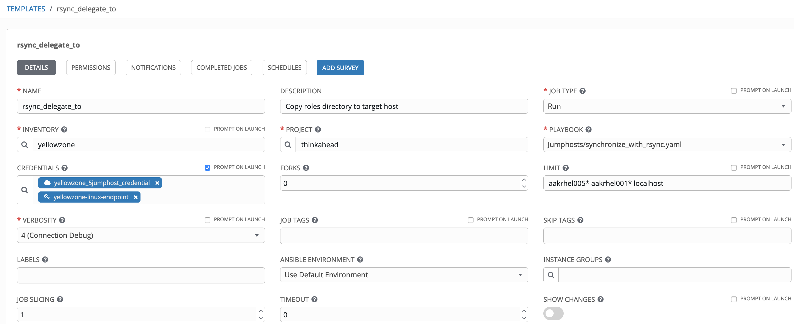
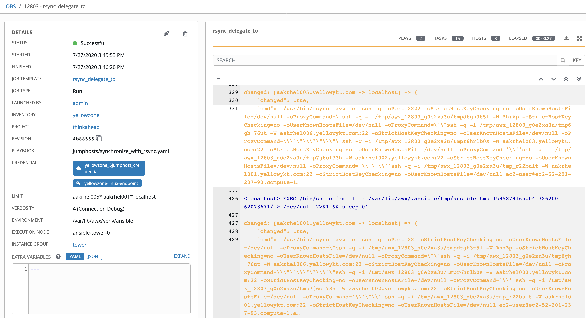
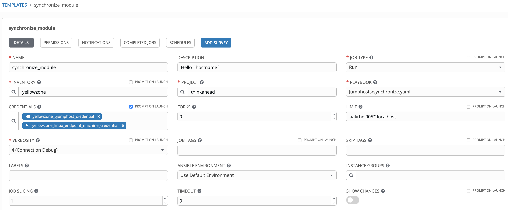
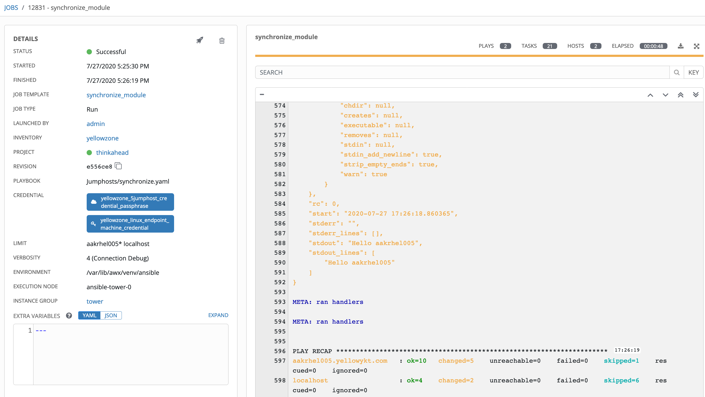
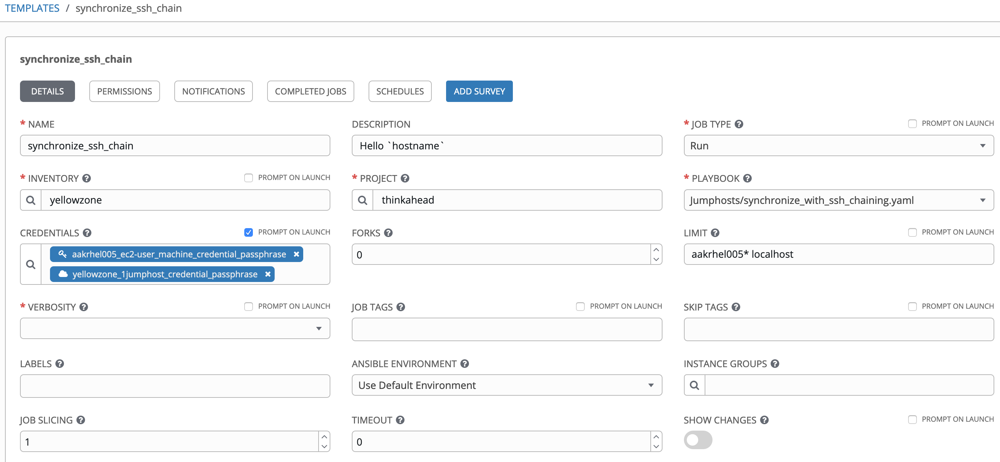
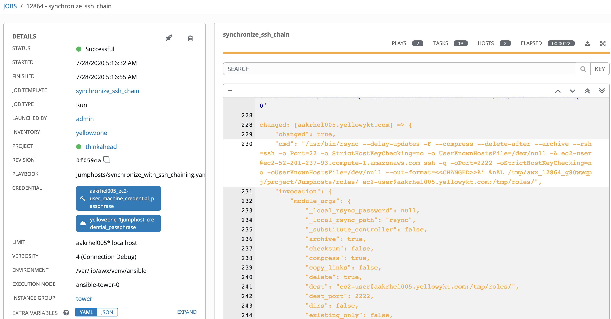

# Multiple Jumphosts in Ansible Tower - Part 8

## Transferring files using ansible synchronize module and rsync

[Alexei.Karve](https://developer.ibm.com/recipes/author/karve/)

Tags: Cloud computing, DevOps, Linux

Published on July 28, 2020 / Updated on April 21, 2021

### Overview

#### Skill Level: Intermediate

Hands on expertise with Ansible Tower/AWX, ssh, rsync

We often need to efficiently transfer files between Ansible Tower and target host endpoints. Part 8 provides options to use the rsync and the synchronize module over multiple jumphost hops.

### Ingredients

Ansible Tower/AWX, rsync

### Step-by-step

#### 1. Introduction

    Rsync (Remote Sync) is a program that mirrors the contents of a source directory to a destination directory. We can give it a source and target directory, along with a method of communication, and it will make the directories identical. Rsync uses compression to further reduce bandwidth when applicable. It runs a rolling checksum across a file, comparing checksums for small segments of the file, and then only causes the transfer of those blocks that do not match. We need to have the rsync preinstalled on both the client and the server.

    The Ansible "copy" module copies a file from the local or remote machine to a location on the remote machine. The "fetch" module is used to copy files from remote locations to the local machine. The "synchronize" module is a wrapper around the rsync command, meant to make common tasks with rsync easier. It is run and originates on the local host where Ansible is being run.

    We will be looking into details of using rsync and synchronize with Ansible Tower over multiple jumphost hops in this Part 8.

2.  #### Synchronize files between Ansible Tower and host endpoints

    The use_ssh_args argument to the synchronize module allows use of the ansible_ssh_common_args variable. However, the bash escaped value with the backslash for the double quote we have been using in previous parts does not work. There are three sources of problems with escaping quote characters when they are nested within ProxyCommands when used with rsync:

    1.  The synchronize module's python code invokes [module.run_command](https://github.com/ansible/ansible/blob/v2.9.11/lib/ansible/modules/files/synchronize.py#L592 "module.run_command") using [parsing rules of shlex](https://github.com/ansible/ansible/blob/07b2698c03ea7b76d55123cab390977b6d069092/lib/ansible/module_utils/basic.py#L2745https://docs.python.org/3.4/library/shlex.html#parsing-rules "parsing rules of shlex") that escapes the consecutive quotes
    2.  What rsync considers as escape characters -- The escape characters are different from the standard ansible_ssh_common_args used with ssh. Quote from rsync documentation:\
        `Note that doubling a single-quote inside a single-quoted string gives you a single-quote; likewise for double-quotes (though you need to pay attention to which quotes your shell is parsing and which quotes rsync is parsing)`
    3.  What ssh with bash considers as escape characters -- We need to escape double quotes with backslash. When we nest this within a ProxyCommand, each backslash needs an additional backslash and the doublequote character needs to be backslashed again. We don't escape single quotes, but we can always end them, add a literal and resume them. This is generally safer, as double quotes have far more possible expansions that also need to be quoted within.

    This different escaping makes it difficult to get the synchronize module to work on more than two jumphosts. We will look at three solutions:

    1.  Use the **command/shell module** to run the rsync directly on localhost with the correct escaping as required by rsync for the multiple jumphosts with the ----rsh (same as -e) parameter.
    2.  Use the **synchronize module with escaping** around all three of the above sources of problems. We need to work really hard on figuring out the escaping of characters.
    3.  Use the synchronize module with **ssh chaining** -- Use ssh-add to add the jumphost and target endpoint ssh keys and use the -A parameter for the chained ssh so that keys from source can be used (without the nested ProxyCommand for the ansible_ssh_common_args). This however requires that we add our jumphost keys to the ssh-agent.
3.  #### Use the command/shell module to run rsync

    This mechanism provides the most flexibility with respect to rsync invocation parameters. The playbook [synchronize_with_rsync.yaml](https://github.com/thinkahead/DeveloperRecipes/blob/master/Jumphosts/synchronize_with_rsync.yaml "synchronize_with_rsync.yaml") shows how to invoke rsync to copy files to the target host endpoint using the "delegate_to: localhost". The files will by synchronized from src: "roles/" on Source/Tower to dest: "/tmp/roles/" Target Host Endpoint.

    The job template "rsync_delegate_to" shows that the LIMIT is set to "aakrhel005* aakrhel001* localhost". It means the rsync will be executed twice, once for aakrhel005.yellowykt.com and second time for aakrhel001.yellowykt.com. The localhost is set for debugging so that we can see the keys added to the ssh-agent when the playbook is started. The ssh-agent is a program that runs in the background and keeps the ssh keys loaded into memory, so that you don't need to enter your passphrase every time you need to use the key. Depending on the credential(s) passed to the job template, the correct task in the synchronize_with_rsync.yaml will be selected for the [relevant number of hops](https://github.com/thinkahead/DeveloperRecipes/blob/master/Jumphosts/synchronize_with_rsync.yaml#L63-L119 "relevant number of hops").

    

    We selected the "yellowzone_5jumphost_credential" of the custom credential type that has 5 jumphost hops and the machine credential "yellowzone-linux-endpoint". The machine credential may have an optional passphrase, this is added by the Tower when it starts the playbook with the ssh-agent. The jumphosts may also have optional credentials. These ssh keys get added to the same ssh-agent by the ansible-role-ssh-add-jumphosts. The output of the job run shows that rsync was successfully executed on both the target host endpoints.

    

    The source code for the playbook synchronize_with_rsync.yaml is shown below. The [first play](https://github.com/thinkahead/DeveloperRecipes/blob/master/Jumphosts/synchronize_with_rsync.yaml#L2-L7 "ensures that any ssh keys with passphrase are added to the ssh-agent") ensures that any ssh keys with passphrase are added to the ssh-agent as introduced in [Part 4](https://developer.ibm.com/recipes/tutorials/multiple-jumphosts-in-ansible-tower-part-4/ "Multiple Jumphosts in Ansible Tower - Part 4"). The [second play](https://github.com/thinkahead/DeveloperRecipes/blob/master/Jumphosts/synchronize_with_rsync.yaml#L9-L27 "Check the ssh key added to ssh-agent") shows that the ssh key added by Ansible Tower for the Machine Credential (of the target host endpoint) to the ssh-agent with the "ssh-add -l command". The "ls -las {{ machine_credential_ssh_private_key_file }}" shows that the key that was added is not actually present on the file system.

    `---\
    - name: Role ensures that the ssh keys with passphrase are added\
      hosts: localhost\
      connection: local\
      gather_facts: false\
      roles:\
        - ansible-role-ssh-add-jumphosts

    - name: Check the settings on localhost\
      hosts: localhost\
      connection: local\
      gather_facts: false\
      tasks:\
        - shell: |\
            realpath ../../artifacts/{{ tower_job_id }}/ssh_key_data\
          register: keyout\
        - set_fact:\
            machine_credential_ssh_private_key_file: '{{ keyout.stdout }}'\
        - shell: |\
            echo '{"SSH_AUTH_SOCK":"'$SSH_AUTH_SOCK'","SSH_AGENT_PID":"'$SSH_AGENT_PID'"}'\
          register: env_vars_stdout\
        - set_fact:\
            env_vars: "{{ env_vars_stdout.stdout }}"\
        - shell: |\
            ssh-add -l # Private key is added to ssh-agent\
            ls -las {{ machine_credential_ssh_private_key_file }} # This private key file is not present\
            true

    - name: Use rsync to push files to target host\
      hosts: all\
      gather_facts: false\
      vars:\
         dest: "/tmp/roles/"\
         src: "roles/"\
      tasks:\
        - set_fact:\
            my_user: "{{ ansible_user }}"\
            my_host: "{{ ansible_host }}"\
            my_port: "{{ ansible_port | default(22) }}"\
        - debug:\
            msg:\
              - "my_user: {{ my_user }}"\
              - "my_host: {{ my_host }}"\
              - "my_port: {{ my_port }}"\
              #- "my_ssh_private_key_file: {{ hostvars['127.0.0.1']['machine_credential_ssh_private_key_file'] }}"\
        - name: Check the host where the rsync command runs\
          shell: |\
            echo Running on `hostname`\
            echo '{"SSH_AUTH_SOCK":"'$SSH_AUTH_SOCK'","SSH_AGENT_PID":"'$SSH_AGENT_PID'"}'\
            ssh-add -l # Shows that we have the machine credential added to ssh-agent\
            echo "Cannot use ansible_host: {{ ansible_host }}, but can use the my_host: {{ my_host }} for target hostname"\
            echo "Current directory `pwd`"\
            echo Show the jumphost keys\
            if [ ! -z "{{ lookup('env','JH5_SSH_PRIVATE_KEY') }}" ]; then ls "{{ lookup('env','JH5_SSH_PRIVATE_KEY') }}"; fi\
            if [ ! -z "{{ lookup('env','JH4_SSH_PRIVATE_KEY') }}" ]; then ls "{{ lookup('env','JH4_SSH_PRIVATE_KEY') }}"; fi\
            if [ ! -z "{{ lookup('env','JH3_SSH_PRIVATE_KEY') }}" ]; then ls "{{ lookup('env','JH3_SSH_PRIVATE_KEY') }}"; fi\
            if [ ! -z "{{ lookup('env','JH2_SSH_PRIVATE_KEY') }}" ]; then ls "{{ lookup('env','JH2_SSH_PRIVATE_KEY') }}"; fi\
            if [ ! -z "{{ lookup('env','JH1_SSH_PRIVATE_KEY') }}" ]; then ls "{{ lookup('env','JH1_SSH_PRIVATE_KEY') }}"; fi\
            true\
          delegate_to: localhost\
          #environment: "{{ hostvars['127.0.0.1']['env_vars'] }}"

        - name: 5 hops\
          shell: |\
            /usr/bin/rsync -avz -e 'ssh -q -oPort={{ my_port }} -oStrictHostKeyChecking=no -oUserKnownHostsFile=/dev/null -oProxyCommand="ssh -q -i {{ lookup('env','JH5_SSH_PRIVATE_KEY') }} -W %h:%p -oStrictHostKeyChecking=no -oUserKnownHostsFile=/dev/null -oProxyCommand=""ssh -q -i {{ lookup('env','JH4_SSH_PRIVATE_KEY') }} -W {{ jh5_ip }}:{{ jh5_ssh_port }} -oStrictHostKeyChecking=no -oUserKnownHostsFile=/dev/null -oProxyCommand=\""\""\""ssh -q -i {{ lookup('env','JH3_SSH_PRIVATE_KEY') }} -W {{ jh4_ip }}:{{ jh4_ssh_port }} -oStrictHostKeyChecking=no -oUserKnownHostsFile=/dev/null -oProxyCommand='\''ssh -q -i {{ lookup('env','JH2_SSH_PRIVATE_KEY') }} -W {{ jh3_ip }}:{{ jh3_ssh_port }} -oStrictHostKeyChecking=no -oUserKnownHostsFile=/dev/null -oProxyCommand='\'"\''ssh -q -i {{ lookup('env','JH1_SSH_PRIVATE_KEY') }} -W {{ jh2_ip }}:{{ jh2_ssh_port }} -oStrictHostKeyChecking=no -oUserKnownHostsFile=/dev/null {{ jh1_ssh_user }}@{{ jh1_ip }}'\'"\'' {{ jh2_ssh_user }}@{{ jh2_ip }}'\'' {{ jh3_ssh_user }}@{{ jh3_ip }}\""\""\"" {{ jh4_ssh_user }}@{{ jh4_ip }}"" {{ jh5_ssh_user }}@{{ jh5_ip }}" {{ my_user }}@{{ my_host }}' "{{ src }}" ":{{ dest }}"\
          when:\
            - jh6_ip is not defined or jh6_ip==""\
            - jh5_ip is defined and jh5_ip!=""\
          delegate_to: localhost

        - name: 4 hops\
          shell: |\
            /usr/bin/rsync -avz -e 'ssh -q -oPort={{ my_port }} -oStrictHostKeyChecking=no -oUserKnownHostsFile=/dev/null -oProxyCommand="ssh -q -i {{ lookup('env','JH4_SSH_PRIVATE_KEY') }} -W %h:%p -oStrictHostKeyChecking=no -oUserKnownHostsFile=/dev/null -oProxyCommand=""ssh -q -i {{ lookup('env','JH3_SSH_PRIVATE_KEY') }} -W {{ jh4_ip }}:{{ jh4_ssh_port }} -oStrictHostKeyChecking=no -oUserKnownHostsFile=/dev/null -oProxyCommand=\""\""\""ssh -q -i {{ lookup('env','JH2_SSH_PRIVATE_KEY') }} -W {{ jh3_ip }}:{{ jh3_ssh_port }} -oStrictHostKeyChecking=no -oUserKnownHostsFile=/dev/null -oProxyCommand='\''ssh -q -i {{ lookup('env','JH1_SSH_PRIVATE_KEY') }} -W {{ jh2_ip }}:{{ jh2_ssh_port }} -oStrictHostKeyChecking=no -oUserKnownHostsFile=/dev/null {{ jh1_ssh_user }}@{{ jh1_ip }}'\'' {{ jh2_ssh_user }}@{{ jh2_ip }}\""\""\"" {{ jh3_ssh_user }}@{{ jh3_ip }}"" {{ jh4_ssh_user }}@{{ jh4_ip }}" {{ my_user }}@{{ my_host }}' "{{ src }}" ":{{ dest }}"\
          when:\
            - jh5_ip is not defined or jh5_ip==""\
            - jh4_ip is defined and jh4_ip!=""\
          delegate_to: localhost

        - name: 3 hops\
          shell: |\
            /usr/bin/rsync -avz -e 'ssh -q -oPort={{ my_port }} -oStrictHostKeyChecking=no -oUserKnownHostsFile=/dev/null -o ProxyCommand="ssh -q -i {{ lookup('env','JH3_SSH_PRIVATE_KEY') }} -W %h:%p -oStrictHostKeyChecking=no -oUserKnownHostsFile=/dev/null -oProxyCommand=""ssh -q -i {{ lookup('env','JH2_SSH_PRIVATE_KEY') }} -W {{ jh3_ip }}:{{ jh3_ssh_port }} -oStrictHostKeyChecking=no -oUserKnownHostsFile=/dev/null -oProxyCommand=\""\""\""ssh -q -i {{ lookup('env','JH1_SSH_PRIVATE_KEY') }} -W {{ jh2_ip }}:{{ jh2_ssh_port }} -oStrictHostKeyChecking=no -oUserKnownHostsFile=/dev/null {{ jh1_ssh_user }}@{{ jh1_ip }}\""\""\"" {{ jh2_ssh_user }}@{{ jh2_ip }}"" {{ jh3_ssh_user }}@{{ jh3_ip }}" {{ my_user }}@{{ my_host }}' "{{ src }}" ":{{ dest }}"\
          when:\
            - jh4_ip is not defined or jh4_ip==""\
            - jh3_ip is defined and jh3_ip!=""\
          delegate_to: localhost

        - name: 2 hops\
          shell: |\
            /usr/bin/rsync -avz --rsh='ssh -q -oPort={{ my_port }} -oStrictHostKeyChecking=no -oUserKnownHostsFile=/dev/null -oProxyCommand="ssh -q -i {{ lookup('env','JH2_SSH_PRIVATE_KEY') }} -W %h:%p -oStrictHostKeyChecking=no -oUserKnownHostsFile=/dev/null -oProxyCommand=""ssh -q -i {{ lookup('env','JH1_SSH_PRIVATE_KEY') }} -W {{ jh2_ip }}:{{ jh2_ssh_port }} -oStrictHostKeyChecking=no -oUserKnownHostsFile=/dev/null {{ jh1_ssh_user }}@{{ jh1_ip }}"" {{ jh2_ssh_user }}@{{ jh2_ip }}" {{ my_user }}@{{ my_host }}' roles/ :/tmp/roles/\
          when:\
            - jh3_ip is not defined or jh3_ip==""\
            - jh2_ip is defined and jh2_ip!=""\
          delegate_to: localhost

        - name: 1 hop using jh1\
          shell: |\
            /usr/bin/rsync -avz --rsh='ssh -q -oPort={{ my_port }} -oStrictHostKeyChecking=no -oUserKnownHostsFile=/dev/null -oProxyCommand="ssh -q -i {{ lookup('env','JH1_SSH_PRIVATE_KEY') }} -W %h:%p -oStrictHostKeyChecking=no -oUserKnownHostsFile=/dev/null {{ jh1_ssh_user }}@{{ jh1_ip }}" {{ my_user }}@{{ my_host }}' roles/ :/tmp/roles/\
          when:\
            - jh2_ip is not defined or jh2_ip==""\
            - jh_ip is not defined or jh_ip==""\
            - jh1_ip is defined and jh1_ip!=""\
          delegate_to: localhost

        - name: 1 hop using jh\
          shell: |\
            /usr/bin/rsync -avz --rsh='ssh -q -oPort={{ my_port }} -oStrictHostKeyChecking=no -oUserKnownHostsFile=/dev/null -oProxyCommand="ssh -q -i {{ lookup('env','JH_SSH_PRIVATE_KEY') }} -W %h:%p -oStrictHostKeyChecking=no -oUserKnownHostsFile=/dev/null {{ jh_ssh_user }}@{{ jh_ip }}" {{ my_user }}@{{ my_host }}' roles/ :/tmp/roles/\
          when:\
            - jh2_ip is not defined or jh2_ip==""\
            - jh1_ip is not defined or jh1_ip==""\
            - jh_ip is defined and jh_ip!=""\
          delegate_to: localhost

        - name: 0 hops\
          shell: |\
            /usr/bin/rsync -avz --rsh='ssh -q -oPort={{ my_port }} -oStrictHostKeyChecking=no -oUserKnownHostsFile=/dev/null {{ my_user }}@{{ my_host }}' roles/ :/tmp/roles/\
          when:\
            - jh1_ip is not defined or jh1_ip==""\
            - jh_ip is not defined or jh_ip==""\
          delegate_to: localhost`

    The [third play](https://github.com/thinkahead/DeveloperRecipes/blob/master/Jumphosts/synchronize_with_rsync.yaml#L29-L119 "Run the rsync with multi level escapes for required hops") "Use rsync to push files to target host" sets the facts my_user, my_host and my_port for the endpoint we want to connect to that are used in the later in the rsync shell task that delegates_to: localhost for the desired number of hops. Notice that the escapes for the ----rsh are set to use the two double quotes or two single quotes as required by rsync. Instead of using the /usr/bin/rsync -avz ----rsh, you can change the rsync to use the parameters that the synchronize module uses "/usr/bin/rsync --delay-updates -F ----compress ----delete-after ----archive ----rsh" with the "----out-format='<<CHANGED>>%i %n%L'". A sample for 2 hops is shown below. You can switch to this format by adding the rules for the other hops if required.

    `    - name: 2 hops with synchronize module style\
          shell: |\
            /usr/bin/rsync --delay-updates -F --compress --delete-after --archive --rsh='ssh -q -oPort={{ my_port }} -oStrictHostKeyChecking=no -oUserKnownHostsFile=/dev/null -oProxyCommand="ssh -q -i {{ lookup('env','JH2_SSH_PRIVATE_KEY') }} -W %h:%p -oStrictHostKeyChecking=no -oUserKnownHostsFile=/dev/null -oProxyCommand=""ssh -q -i {{ lookup('env','JH1_SSH_PRIVATE_KEY') }} -W {{ jh2_ip }}:{{ jh2_ssh_port }} -oStrictHostKeyChecking=no -oUserKnownHostsFile=/dev/null {{ jh1_ssh_user }}@{{ jh1_ip }}"" {{ jh2_ssh_user }}@{{ jh2_ip }}" {{ my_user }}@{{ my_host }}' --out-format='<<CHANGED>>%i %n%L' roles/ :/tmp/roles/\
          when:\
            - jh3_ip is not defined\
            - jh2_ip is defined\
          delegate_to: localhost`

4.  #### Use the synchronize module

    The "synchronize_module" job template refers to the [synchronize.yaml](https://github.com/thinkahead/DeveloperRecipes/blob/master/Jumphosts/synchronize.yaml "synchronize.yaml") playbook. The LIMIT is set to "aakrhel005* localhost". We set the jumphost credential to "yellowzone_5jumphost_credential" and the machine credential to "yellowzone_linux_endpoint_machine_credential". Both these credentials may have optional passphrase. The role [ansible-role-ssh-add-jumphosts](https://github.com/thinkahead/DeveloperRecipes/tree/master/Jumphosts/roles/ansible-role-ssh-add-jumphosts "ansible-role-ssh-add-jumphosts") adds the ssh keys (if they have a passphrase) to the default ssh-agent started by Tower when it starts the playbook.

    

    The output from the job run shows that the playbook successfully executed against the aakrhel005.yellowykt.com target host endpoint.

    

    The log output successfully transfers the files from the roles directory to the target endpoint's /tmp/roles directly. The cmd executed by the synchronize module shows the use of alternating single and double quote characters for escaping. The escape sequence will be described in the next section.

    `TASK [Synchronization using rsync protocol (push)] *****************************\
    ...\
      "cmd": "/usr/bin/rsync --delay-updates -F --compress --delete-after --archive --rsh=/usr/bin/ssh -S none -o Port=2222 -o StrictHostKeyChecking=no -o UserKnownHostsFile=/dev/null -C -o ControlMaster=auto -o ControlPersist=60s -oStrictHostKeyChecking=no -oUserKnownHostsFile=/dev/null -oProxyCommand='ssh -q -i /tmp/awx_12831_8kzjruu_/tmpnrg4ngwu -W %h:%p -oStrictHostKeyChecking=no -oUserKnownHostsFile=/dev/null -oProxyCommand='\"'\"'ssh -q -i /tmp/awx_12831_8kzjruu_/tmp59ycacwd -W aakrhel006.yellowykt.com:22 -oStrictHostKeyChecking=no -oUserKnownHostsFile=/dev/null -oProxyCommand='\"'\"'\"'\"'\"'\"'\"'\"'ssh -q -i /tmp/awx_12831_8kzjruu_/tmpqbk5rwic -W aakrhel003.yellowykt.com:22 -oStrictHostKeyChecking=no -oUserKnownHostsFile=/dev/null -oProxyCommand='\"'\"'\"'\"'\"'\"'\"'\"'\"'\"'\"'\"'\"'\"'\"'\"'\"'\"'\"'\"'\"'\"'\"'\"'\"'\"'ssh -q -i /tmp/awx_12831_8kzjruu_/tmpf7ds3kpl -W aakrhel002.yellowykt.com:22 -oStrictHostKeyChecking=no -oUserKnownHostsFile=/dev/null -oProxyCommand='\"'\"'\"'\"'\"'\"'\"'\"'\"'\"'\"'\"'\"'\"'\"'\"'\"'\"'\"'\"'\"'\"'\"'\"'\"'\"'\"'\"'\"'\"'\"'\"'\"'\"'\"'\"'\"'\"'\"'\"'\"'\"'\"'\"'\"'\"'\"'\"'\"'\"'\"'\"'\"'\"'\"'\"'\"'\"'\"'\"'\"'\"'\"'\"'\"'\"'\"'\"'\"'\"'\"'\"'\"'\"'\"'\"'\"'\"'\"'\"'ssh -q -i /tmp/awx_12831_8kzjruu_/tmpol4lanzi -W aakrhel001.yellowykt.com:22 -oStrictHostKeyChecking=no -oUserKnownHostsFile=/dev/null ec2-user@ec2-52-201-237-93.compute-1.amazonaws.com'\"'\"'\"'\"'\"'\"'\"'\"'\"'\"'\"'\"'\"'\"'\"'\"'\"'\"'\"'\"'\"'\"'\"'\"'\"'\"'\"'\"'\"'\"'\"'\"'\"'\"'\"'\"'\"'\"'\"'\"'\"'\"'\"'\"'\"'\"'\"'\"'\"'\"'\"'\"'\"'\"'\"'\"'\"'\"'\"'\"'\"'\"'\"'\"'\"'\"'\"'\"'\"'\"'\"'\"'\"'\"'\"'\"'\"'\"'\"'\"' ec2-user@aakrhel001.yellowykt.com'\"'\"'\"'\"'\"'\"'\"'\"'\"'\"'\"'\"'\"'\"'\"'\"'\"'\"'\"'\"'\"'\"'\"'\"'\"'\"' ec2-user@aakrhel002.yellowykt.com'\"'\"'\"'\"'\"'\"'\"'\"' ec2-user@aakrhel003.yellowykt.com'\"'\"' ec2-user@aakrhel006.yellowykt.com' --out-format=<<CHANGED>>%i %n%L /tmp/awx_12831_8kzjruu_/project/Jumphosts/roles/ ec2-user@aakrhel005.yellowykt.com:/tmp/roles/",`

    In the playbook "synchronize.yaml", we can see the "hello `hostname`" [echoed 4 times](https://github.com/thinkahead/DeveloperRecipes/blob/master/Jumphosts/synchronize.yaml#L51-L69 "echo hello `hostname`").

    The first time, it is executed immediately after the rsync in the same block that used the same new escaped ansible_ssh_common_args that were suitable for rsync above. This runs successfully and sets the ControlPath=/tmp/awx_12831_8kzjruu_/cp/d827065ef7

    `TASK [Show hello `hostname` using the new ansible_ssh_common_args] *************\
    task path: /tmp/awx_12831_8kzjruu_/project/Jumphosts/synchronize.yaml:51

    <aakrhel005.yellowykt.com> SSH: EXEC ssh -vvv -C -o ControlMaster=auto -o ControlPersist=60s -o StrictHostKeyChecking=no -o Port=2222 -o KbdInteractiveAuthentication=no -o PreferredAuthentications=gssapi-with-mic,gssapi-keyex,hostbased,publickey -o PasswordAuthentication=no -o 'User="ec2-user"' -o ConnectTimeout=30 -oStrictHostKeyChecking=no -oUserKnownHostsFile=/dev/null '-oProxyCommand=ssh -q -i /tmp/awx_12831_8kzjruu_/tmpnrg4ngwu -W %h:%p -oStrictHostKeyChecking=no -oUserKnownHostsFile=/dev/null -oProxyCommand='"'"'ssh -q -i /tmp/awx_12831_8kzjruu_/tmp59ycacwd -W aakrhel006.yellowykt.com:22 -oStrictHostKeyChecking=no -oUserKnownHostsFile=/dev/null -oProxyCommand='"'"'"'"'"'"'"'"'ssh -q -i /tmp/awx_12831_8kzjruu_/tmpqbk5rwic -W aakrhel003.yellowykt.com:22 -oStrictHostKeyChecking=no -oUserKnownHostsFile=/dev/null -oProxyCommand='"'"'"'"'"'"'"'"'"'"'"'"'"'"'"'"'"'"'"'"'"'"'"'"'"'"'ssh -q -i /tmp/awx_12831_8kzjruu_/tmpf7ds3kpl -W aakrhel002.yellowykt.com:22 -oStrictHostKeyChecking=no -oUserKnownHostsFile=/dev/null -oProxyCommand='"'"'"'"'"'"'"'"'"'"'"'"'"'"'"'"'"'"'"'"'"'"'"'"'"'"'"'"'"'"'"'"'"'"'"'"'"'"'"'"'"'"'"'"'"'"'"'"'"'"'"'"'"'"'"'"'"'"'"'"'"'"'"'"'"'"'"'"'"'"'"'"'"'"'"'"'"'"'"'"'ssh -q -i /tmp/awx_12831_8kzjruu_/tmpol4lanzi -W aakrhel001.yellowykt.com:22 -oStrictHostKeyChecking=no -oUserKnownHostsFile=/dev/null ec2-user@ec2-52-201-237-93.compute-1.amazonaws.com'"'"'"'"'"'"'"'"'"'"'"'"'"'"'"'"'"'"'"'"'"'"'"'"'"'"'"'"'"'"'"'"'"'"'"'"'"'"'"'"'"'"'"'"'"'"'"'"'"'"'"'"'"'"'"'"'"'"'"'"'"'"'"'"'"'"'"'"'"'"'"'"'"'"'"'"'"'"'"'"' ec2-user@aakrhel001.yellowykt.com'"'"'"'"'"'"'"'"'"'"'"'"'"'"'"'"'"'"'"'"'"'"'"'"'"'"' ec2-user@aakrhel002.yellowykt.com'"'"'"'"'"'"'"'"' ec2-user@aakrhel003.yellowykt.com'"'"' ec2-user@aakrhel006.yellowykt.com' -o ControlPath=/tmp/awx_12831_8kzjruu_/cp/d827065ef7 aakrhel005.yellowykt.com '/bin/sh -c '"'"'echo ~ec2-user && sleep 0'"'"''`

    The second time, it is executed after the block that used the new escaped ansible_ssh_common_args that were suitable for rsync. We however do not pass any ansible_ssh_common_args this time. We can see that it uses the ControlPath=/tmp/awx_12831_8kzjruu_/cp/d827065ef7 that was set in the block and successfully connects to the target host endpoint.

    `TASK [Show hello `hostname` using the ControlPath set by the shell command executed in block above] ***\
    task path: /tmp/awx_12831_8kzjruu_/project/Jumphosts/synchronize.yaml:57

    <aakrhel005.yellowykt.com> SSH: EXEC ssh -vvv -C -o ControlMaster=auto -o ControlPersist=60s -o StrictHostKeyChecking=no -o Port=2222 -o KbdInteractiveAuthentication=no -o PreferredAuthentications=gssapi-with-mic,gssapi-keyex,hostbased,publickey -o PasswordAuthentication=no -o 'User="ec2-user"' -o ConnectTimeout=30 -o ControlPath=/tmp/awx_12831_8kzjruu_/cp/d827065ef7 aakrhel005.yellowykt.com '/bin/sh -c '"'"'echo ~ec2-user && sleep 0'"'"''`

    The third time, it is executed using the old escaped ansible_ssh_common_args that were set within the "ansible-role-ssh-add-jumphosts" role. This runs successfully and sets the ControlPath=/tmp/awx_12831_8kzjruu_/cp/d827065ef7 again.

    `TASK [Show hello `hostname` using the ansible_ssh_common_args set by the role] ***\
    task path: /tmp/awx_12831_8kzjruu_/project/Jumphosts/synchronize.yaml:61

    <aakrhel005.yellowykt.com> SSH: EXEC ssh -vvv -C -o ControlMaster=auto -o ControlPersist=60s -o StrictHostKeyChecking=no -o Port=2222 -o KbdInteractiveAuthentication=no -o PreferredAuthentications=gssapi-with-mic,gssapi-keyex,hostbased,publickey -o PasswordAuthentication=no -o 'User="ec2-user"' -o ConnectTimeout=30 -oStrictHostKeyChecking=no -oUserKnownHostsFile=/dev/null '-oProxyCommand=ssh -i /tmp/awx_12831_8kzjruu_/tmpnrg4ngwu -W %h:%p -oIdentityAgent=/tmp/ssh-W04jvatRs7pN/agent.3 -oStrictHostKeyChecking=no -oUserKnownHostsFile=/dev/null -oProxyCommand="ssh -i /tmp/awx_12831_8kzjruu_/tmp59ycacwd -W aakrhel006.yellowykt.com:22 -oIdentityAgent=/tmp/ssh-W04jvatRs7pN/agent.3 -oStrictHostKeyChecking=no -oUserKnownHostsFile=/dev/null -oProxyCommand=\"ssh -i /tmp/awx_12831_8kzjruu_/tmpqbk5rwic -W aakrhel003.yellowykt.com:22 -oIdentityAgent=/tmp/ssh-W04jvatRs7pN/agent.3 -oStrictHostKeyChecking=no -oUserKnownHostsFile=/dev/null -oProxyCommand=\\\"ssh -i /tmp/awx_12831_8kzjruu_/tmpf7ds3kpl -W aakrhel002.yellowykt.com:22 -oIdentityAgent=/tmp/ssh-W04jvatRs7pN/agent.3 -oStrictHostKeyChecking=no -oUserKnownHostsFile=/dev/null -oProxyCommand=\\\\\\\"ssh -i /tmp/awx_12831_8kzjruu_/tmpol4lanzi -W aakrhel001.yellowykt.com:22 -oIdentityAgent=/tmp/ssh-W04jvatRs7pN/agent.3 -oStrictHostKeyChecking=no -oUserKnownHostsFile=/dev/null ec2-user@ec2-52-201-237-93.compute-1.amazonaws.com\\\\\\\" ec2-user@aakrhel001.yellowykt.com\\\" ec2-user@aakrhel002.yellowykt.com\" ec2-user@aakrhel003.yellowykt.com" ec2-user@aakrhel006.yellowykt.com' -o ControlPath=/tmp/awx_12831_8kzjruu_/cp/d827065ef7 aakrhel005.yellowykt.com '/bin/sh -c '"'"'echo ~ec2-user && sleep 0'"'"''`

    The fourth time no ansible_ssh_copmmon_args are set, it still (similar to the second time) connects to the target host endpoint aakrhel005.yellowykt.com using the ControlPath=/tmp/awx_12831_8kzjruu_/cp/d827065ef7

    `TASK [Show hello `hostname` using the ControlPath set by the shell command executed in task above] ***\
    task path: /tmp/awx_12831_8kzjruu_/project/Jumphosts/synchronize.yaml:67`

    `<aakrhel005.yellowykt.com> SSH: EXEC ssh -vvv -C -o ControlMaster=auto -o ControlPersist=60s -o StrictHostKeyChecking=no -o Port=2222 -o KbdInteractiveAuthentication=no -o PreferredAuthentications=gssapi-with-mic,gssapi-keyex,hostbased,publickey -o PasswordAuthentication=no -o 'User="ec2-user"' -o ConnectTimeout=30 -o ControlPath=/tmp/awx_12831_8kzjruu_/cp/d827065ef7 aakrhel005.yellowykt.com '/bin/sh -c '"'"'echo ~ec2-user && sleep 0'"'"''`

    The synchronize.yaml sets the facts to enable creating the ansible_ssh_common_args variable. The facts are set based on the number of hops. The "5 hops"  fact "ansible_ssh_common_args_5hops" is shown below. Notice how the escape characters at each level of the ProxyCommand grow exponentially.

    `    - name: 5 hops\
          set_fact:\
            ansible_ssh_common_args_5hops: -oStrictHostKeyChecking=no -oUserKnownHostsFile=/dev/null -oProxyCommand='ssh -q -i {{ lookup('env','JH5_SSH_PRIVATE_KEY') }} -W %h:%p -oStrictHostKeyChecking=no -oUserKnownHostsFile=/dev/null -oProxyCommand='"'"'ssh -q -i {{ lookup('env','JH4_SSH_PRIVATE_KEY') }} -W {{ jh5_ip }}:{{ jh5_ssh_port }} -oStrictHostKeyChecking=no -oUserKnownHostsFile=/dev/null -oProxyCommand='"'"'"'"'"'"'"'"'ssh -q -i {{ lookup('env','JH3_SSH_PRIVATE_KEY') }} -W {{ jh4_ip }}:{{ jh4_ssh_port }} -oStrictHostKeyChecking=no -oUserKnownHostsFile=/dev/null -oProxyCommand='"'"'"'"'"'"'"'"'"'"'"'"'"'"'"'"'"'"'"'"'"'"'"'"'"'"'ssh -q -i {{ lookup('env','JH2_SSH_PRIVATE_KEY') }} -W {{ jh3_ip }}:{{ jh3_ssh_port }} -oStrictHostKeyChecking=no -oUserKnownHostsFile=/dev/null -oProxyCommand='"'"'"'"'"'"'"'"'"'"'"'"'"'"'"'"'"'"'"'"'"'"'"'"'"'"'"'"'"'"'"'"'"'"'"'"'"'"'"'"'"'"'"'"'"'"'"'"'"'"'"'"'"'"'"'"'"'"'"'"'"'"'"'"'"'"'"'"'"'"'"'"'"'"'"'"'"'"'"'"'ssh -q -i {{ lookup('env','JH1_SSH_PRIVATE_KEY') }} -W {{ jh2_ip }}:{{ jh2_ssh_port }} -oStrictHostKeyChecking=no -oUserKnownHostsFile=/dev/null {{ jh1_ssh_user }}@{{ jh1_ip }}'"'"'"'"'"'"'"'"'"'"'"'"'"'"'"'"'"'"'"'"'"'"'"'"'"'"'"'"'"'"'"'"'"'"'"'"'"'"'"'"'"'"'"'"'"'"'"'"'"'"'"'"'"'"'"'"'"'"'"'"'"'"'"'"'"'"'"'"'"'"'"'"'"'"'"'"'"'"'"'"' {{ jh2_ssh_user }}@{{ jh2_ip }}'"'"'"'"'"'"'"'"'"'"'"'"'"'"'"'"'"'"'"'"'"'"'"'"'"'"' {{ jh3_ssh_user }}@{{ jh3_ip }}'"'"'"'"'"'"'"'"' {{ jh4_ssh_user }}@{{ jh4_ip }}'"'"' {{ jh5_ssh_user }}@{{ jh5_ip }}'\
          when: jh5_ip is defined`

    Depending on your Tower install, you will find the synchronize module in your python directory. For example: /usr/lib/python2.7/site-packages/ansible/modules/files/synchronize.py. You can copy it over into the [library directory](https://github.com/thinkahead/DeveloperRecipes/tree/master/Jumphosts/library "local library directory") of your base folder where your playbooks are located if you want to test out any changes to the module.

5.  #### What is this long sequence of single and double quote characters?

    We need to replace the single quote ' with '"'"' and add ' around the outer string recursively for each hop level.

    The '...'"'"'...' means that we start and end the first single quote in the payload with the starting '...'. Then added a new single quote with the "'". The two double quotes effectively escape the single quote within it. The last single quotes start and end the rest of the payload '...'.

    The encoding of characters from levels 6 down to 1 are shown below. We use the level 5 and below in the synchronize.yaml.

    `echo 'a'"'"'"'"'"'"'"'"'"'"'"'"'"'"'"'"'"'"'"'"'"'"'"'"'"'"'"'"'"'"'"'"'"'"'"'"'"'"'"'"'"'"'"'"'"'"'"'"'"'"'"'"'"'"'"'"'"'"'"'"'"'"'"'"'"'"'"'"'"'"'"'"'"'"'"'"'"'"'"'"'"'"'"'"'"'"'"'"'"'"'"'"'"'"'"'"'"'"'"'"'"'"'"'"'"'"'"'"'"'"'"'"'"'"'"'"'"'"'"'"'"'"'"'"'"'"'"'"'"'"'"'"'"'"'"'"'"'"'"'"'"'"'"'"'"'"'"'"'"'"'"'"'"'"'"'"'"'"'"'"'"'"'"'"'"'"'"'"'"'"'"'"'"'"'"'"'"'"'"'"'"'"'"'"'"'"'"'"'"'"'"'"'"'"'"'"'"'"'"'"'"'"'"'"'"'"'"'"'"'"'"'"'"'"'"'"'"'"'"'"'"'"'"'"'"'"'"'"'"'"'"'"'"'"'"'"'"'"'"'"'"'"' b'\
    Output:\
    a'"'"'"'"'"'"'"'"'"'"'"'"'"'"'"'"'"'"'"'"'"'"'"'"'"'"'"'"'"'"'"'"'"'"'"'"'"'"'"'"'"'"'"'"'"'"'"'"'"'"'"'"'"'"'"'"'"'"'"'"'"'"'"'"'"'"'"'"'"'"'"'"'"'"'"'"'"'"'"'"' b

    echo 'a'"'"'"'"'"'"'"'"'"'"'"'"'"'"'"'"'"'"'"'"'"'"'"'"'"'"'"'"'"'"'"'"'"'"'"'"'"'"'"'"'"'"'"'"'"'"'"'"'"'"'"'"'"'"'"'"'"'"'"'"'"'"'"'"'"'"'"'"'"'"'"'"'"'"'"'"'"'"'"'"' b'\
    Output:\
    a'"'"'"'"'"'"'"'"'"'"'"'"'"'"'"'"'"'"'"'"'"'"'"'"'"'"' b

    echo 'a'"'"'"'"'"'"'"'"'"'"'"'"'"'"'"'"'"'"'"'"'"'"'"'"'"'"' b'\
    Output:\
    a'"'"'"'"'"'"'"'"' b

    echo 'a'"'"'"'"'"'"'"'"' b'\
    Output:\
    a'"'"' b

    echo 'a'"'"' b'\
    Output:\
    a' b`

    The number of double quotes in this sequence is as follows:

    `echo 'a'"'"'"'"'"'"'"'"'"'"'"'"'"'"'"'"'"'"'"'"'"'"'"'"'"'"'"'"'"'"'"'"'"'"'"'"'"'"'"'"'"'"'"'"'"'"'"'"'"'"'"'"'"'"'"'"'"'"'"'"'"'"'"'"'"'"'"'"'"'"'"'"'"'"'"'"'"'"'"'"'"'"'"'"'"'"'"'"'"'"'"'"'"'"'"'"'"'"'"'"'"'"'"'"'"'"'"'"'"'"'"'"'"'"'"'"'"'"'"'"'"'"'"'"'"'"'"'"'"'"'"'"'"'"'"'"'"'"'"'"'"'"'"'"'"'"'"'"'"'"'"'"'"'"'"'"'"'"'"'"'"'"'"'"'"'"'"'"'"'"'"'"'"'"'"'"'"'"'"'"'"'"'"'"'"'"'"'"'"'"'"'"'"'"'"'"'"'"'"'"'"'"'"'"'"'"'"'"'"'"'"'"'"'"'"'"'"'"'"'"'"'"'"'"'"'"'"'"'"'"'"'"'"'"'"'"'"'"'"'"'"'"' b' | grep -o '"' | wc -l\
    80

    echo 'a'"'"'"'"'"'"'"'"'"'"'"'"'"'"'"'"'"'"'"'"'"'"'"'"'"'"'"'"'"'"'"'"'"'"'"'"'"'"'"'"'"'"'"'"'"'"'"'"'"'"'"'"'"'"'"'"'"'"'"'"'"'"'"'"'"'"'"'"'"'"'"'"'"'"'"'"'"'"'"'"' b' | grep -o '"' | wc -l\
    26

    echo 'a'"'"'"'"'"'"'"'"'"'"'"'"'"'"'"'"'"'"'"'"'"'"'"'"'"'"' b' | grep -o '"' | wc -l\
    8

    echo 'a'"'"'"'"'"'"'"'"' b' | grep -o '"' | wc -l\
    2

    echo 'a'"'"' b' | grep -o '"' | wc -l\
    0`

    As it moves down each level, it reduces the escapes until finally there is a one single quote left. This is shown with the nested echo eval for 6 levels that converts it to on single quote. The a and b charactes indicate the start and end of the payload.

    `echo $(eval echo \'$(eval echo \'$(eval echo \'$(eval echo \'$(echo 'a'"'"'"'"'"'"'"'"'"'"'"'"'"'"'"'"'"'"'"'"'"'"'"'"'"'"'"'"'"'"'"'"'"'"'"'"'"'"'"'"'"'"'"'"'"'"'"'"'"'"'"'"'"'"'"'"'"'"'"'"'"'"'"'"'"'"'"'"'"'"'"'"'"'"'"'"'"'"'"'"'"'"'"'"'"'"'"'"'"'"'"'"'"'"'"'"'"'"'"'"'"'"'"'"'"'"'"'"'"'"'"'"'"'"'"'"'"'"'"'"'"'"'"'"'"'"'"'"'"'"'"'"'"'"'"'"'"'"'"'"'"'"'"'"'"'"'"'"'"'"'"'"'"'"'"'"'"'"'"'"'"'"'"'"'"'"'"'"'"'"'"'"'"'"'"'"'"'"'"'"'"'"'"'"'"'"'"'"'"'"'"'"'"'"'"'"'"'"'"'"'"'"'"'"'"'"'"'"'"'"'"'"'"'"'"'"'"'"'"'"'"'"'"'"'"'"'"'"'"'"'"'"'"'"'"'"'"'"'"'"'"'"' b')\')\')\')\')\
    a' b`

    The number of double quotes is based on the formula for the series a(n) = 3^n -- 1

    0, 2, 8, 26, 80, 242, 728, 2186, 6560, 19682, ...

    The number of single quotes is double that plus 1. We probably do not want to go more than 5 levels using this mechanism because the number of characters become unwieldy.

6.  #### Use the synchronize module with ssh chaining

    In our previous scenarios, we used the ProxyCommand that picked up the ssh private key paths from the credentials on Source/Tower. We did not require the ssh-agent if the jumphosts ssh keys did not have a passphrase. Accordingly, the role ansible-role-ssh-add-jumphosts did not add the ssh keys to the ssh-agent if it did not have a passphrase. Only keys with a passphrase were added to the ssh-agent.

    Now we will switch to ssh chaining that is a sequence of ssh commands from one hop to the next. Using ssh chaining however requires that the keys be added to the ssh-agent. Therefore, the ssh-agent is required for ssh keys with and without passphrase. The role [ansible-role-ssh-add-jumphosts-all](https://github.com/thinkahead/DeveloperRecipes/tree/master/Jumphosts/roles/ansible-role-ssh-add-jumphosts-all "Ansible role to add all ssh keys with and without passphrase") is a slightly modified version of ansible-role-ssh-add-jumphosts that adds all keys.  The ssh -A option enables forwarding of the authentication agent connection. It means that, it forwards your SSH auth schema to the remote host enabling ssh on the remote host as if you were on your local machine.

    An "ssh chain" for 5 hops is shown below:

    `ssh -o Port={{ jh1_ssh_port }} -o StrictHostKeyChecking=no -o UserKnownHostsFile=/dev/null -A {{ jh1_ssh_user }}@{{ jh1_ip }} ssh -o Port={{ jh2_ssh_port }} -o StrictHostKeyChecking=no -o UserKnownHostsFile=/dev/null -A {{ jh2_ssh_user }}@{{ jh2_ip }} ssh -o Port={{ jh3_ssh_port }} -o StrictHostKeyChecking=no -o UserKnownHostsFile=/dev/null -A {{ jh3_ssh_user }}@{{ jh3_ip }} ssh -o Port={{ jh4_ssh_port }} -o StrictHostKeyChecking=no -o UserKnownHostsFile=/dev/null -A {{ jh4_ssh_user }}@{{ jh4_ip }} ssh -o Port={{ jh5_ssh_port }} -o StrictHostKeyChecking=no -o UserKnownHostsFile=/dev/null -A {{ jh5_ssh_user }}@{{ jh5_ip }} ssh -q -oPort={{ my_port }} -oStrictHostKeyChecking=no -oUserKnownHostsFile=/dev/null {{ my_ssh_user }}@{{ my_ip }}`

    Notice the six ssh occurrences in the above command. Five are for the jumphost hops and the last one is for the target host endpoint "my_ip". When we pass this to the synchronize module in the rsync_opts parameter, we do not escape any characters. It is just a chain of ssh command, there is no nesting. Therefore, there is no complicated calculation of how many backslashes to add or how many additional double/single quotes to add.

    The last {{ my_ssh_user }}@{{ my_ip }} must be omitted when this command is passed in the rsync_ops with the ----rsh. When we have the ----rsh in the rsync_ops, some of the other [parameters used to construct rsh](https://github.com/ansible/ansible/blob/v2.9.11/lib/ansible/modules/files/synchronize.py#L514-L547 "parameters used to construct rsh") are ignored as seen in [synchronize.py](https://github.com/ansible/ansible/blob/v2.9.11/lib/ansible/modules/files/synchronize.py "synchronize.py").

    We may be tempted to add the above ssh chained command after ----rsh= in double quotes or single quotes. That [will not work](https://github.com/ansible/ansible/issues/23575#issuecomment-296570940 "Do not add quotes around the command provided to --rsh"). The command must look as follows. Note that there are no quotes after ----rsh= surrounding the command. The {{ my_ssh_user }}@{{ my_ip }} is omitted because the synchronize module prepends it to the dest parameter.

    `--rsh=ssh -o Port={{ jh1_ssh_port }} -o StrictHostKeyChecking=no -o UserKnownHostsFile=/dev/null -A {{ jh1_ssh_user }}@{{ jh1_ip }} ssh -o Port={{ jh2_ssh_port }} -o StrictHostKeyChecking=no -o UserKnownHostsFile=/dev/null -A {{ jh2_ssh_user }}@{{ jh2_ip }} ssh -o Port={{ jh3_ssh_port }} -o StrictHostKeyChecking=no -o UserKnownHostsFile=/dev/null -A {{ jh3_ssh_user }}@{{ jh3_ip }} ssh -o Port={{ jh4_ssh_port }} -o StrictHostKeyChecking=no -o UserKnownHostsFile=/dev/null -A {{ jh4_ssh_user }}@{{ jh4_ip }} ssh -o Port={{ jh5_ssh_port }} -o StrictHostKeyChecking=no -o UserKnownHostsFile=/dev/null -A {{ jh5_ssh_user }}@{{ jh5_ip }} ssh -q -oPort={{ my_port }} -oStrictHostKeyChecking=no -oUserKnownHostsFile=/dev/null`

    This is shown in [synchronize_with_ssh_chaining.yaml](https://github.com/thinkahead/DeveloperRecipes/blob/master/Jumphosts/synchronize_with_ssh_chaining.yaml "synchronize_with_ssh_chaining.yaml ") playbook where it first does an [rsync using the synchronize module with ssh chaining](https://github.com/thinkahead/DeveloperRecipes/blob/master/Jumphosts/synchronize_with_ssh_chaining.yaml#L20-L29 "rsync using the synchronize module with ssh chaining") and then invokes the [hello `hostname`](https://github.com/thinkahead/DeveloperRecipes/blob/master/Jumphosts/synchronize_with_ssh_chaining.yaml#L31-L35 "hello `hostname`") using the ansible_ssh_common_args computed in the role.

    The job template "synchronize_ssh_chain" shows the single jumphost credential yellowzone_1jumphost_credential_passphrase" and the machine credential "aakrhel005_ec2-user_machine_credential_passphrase" both with passphrases passed to the job template. This job uses the "synchronize_with_ssh_chaining.yaml".

    

    The source code for synchronize_with_ssh_chaining.yaml is shown below:

    `---\
    - name: Role ensures that the ssh keys are added\
      hosts: localhost\
      connection: local\
      gather_facts: false\
      roles:\
        - ansible-role-ssh-add-jumphosts-all

    - name: Use the synchronize module across multiple jumphosts\
      hosts: all\
      gather_facts: no\
      vars:\
         dest: ":/tmp/roles/"\
         src: "roles/"\
      tasks:\
        - set_fact:\
            my_user: "{{ ansible_user }}"\
            my_host: "{{ ansible_host }}"\
            my_port: "{{ ansible_port | default(22) }}"\
        - name: Synchronization using rsync protocol (push)\
          synchronize:\
            src: roles/\
            dest: /tmp/roles/\
            #use_ssh_args: yes\
            delete: yes\
            rsync_opts:\
              - --rsh={{ ("ssh -o Port="+jh1_ssh_port+params+jh1_ssh_user+"@"+jh1_ip if jh1_ip is defined and jh1_ip!="" else ("ssh -o Port="+jh_ssh_port+params+jh_ssh_user+"@"+jh_ip if jh_ip is defined and jh_ip!="" else ""))+(" ssh -o Port="+jh2_ssh_port+params+jh2_ssh_user+"@"+jh2_ip if jh2_ip is defined and jh2_ip!="" else "")+(" ssh -o Port="+jh3_ssh_port+params+jh3_ssh_user+"@"+jh3_ip if jh3_ip is defined and jh3_ip!="" else "")+(" ssh -o Port="+jh4_ssh_port+params+jh4_ssh_user+"@"+jh4_ip if jh4_ip is defined and jh4_ip!="" else "")+(" ssh -o Port="+jh5_ssh_port+params+jh5_ssh_user+"@"+jh5_ip if jh5_ip is defined and jh5_ip!="" else "")+" ssh -q -oPort="+my_port+" -oStrictHostKeyChecking=no -oUserKnownHostsFile=/dev/null" }}\
          vars:\
            params: " -o StrictHostKeyChecking=no -o UserKnownHostsFile=/dev/null -A "

        - name: Show hello `hostname` using the ansible_ssh_common_args set by the role\
          shell: |\
            echo Hello `hostname`\
          vars:\
            ansible_ssh_common_args: "{{ hostvars['127.0.0.1']['ansible_ssh_common_args'] }}"`

    Notice that the ssh chain is a single line with the ----rsh. The chain is generated for the ip addresses that are nonempty in the custom jumphost credential. So, we can skip any intermediate hops from the credentials if direct connectivity between previous hop and next hop is available.

    The output of the job run with the rsync command is shown in screenshot below:

    

    The ----rsh shows it using the single jumphost hop "ec2-user@ec2-52-201-237-93.compute-1.amazonaws.com". Although the output shows the full "rsync" command executed by the synchronize module with the generated ----rsh for the single hop, there is a problem with the printing in the logs. We cannot run the command directly because of [missing quotes](https://github.com/ansible/ansible/issues/46126 "missing quotes in output"). Internally the module however generates the parameters as a list and correctly executes via the exec() family of functions. The ----rsh and ----out-format quoting are handled transparently by subprocess.Popen when a list is passed to it instead of a string. If you were to execute this manually, it would look as follows:

    `bash-4.2$ eval `ssh-agent`\
    Agent pid 1734\
    bash-4.2$ ssh-add ~/amazontestkey.pem\
    Identity added: /var/lib/awx/amazontestkey.pem (/var/lib/awx/amazontestkey.pem)\
    bash-4.2$ /usr/bin/rsync --delay-updates -F --compress --delete-after --archive --rsh='ssh -o Port=22 -o StrictHostKeyChecking=no -o UserKnownHostsFile=/dev/null -A ec2-user@ec2-52-201-237-93.compute-1.amazonaws.com ssh -q -oPort=2222 -oStrictHostKeyChecking=no -oUserKnownHostsFile=/dev/null' --out-format='<<CHANGED>>%i %n%L' /tmp/roles/ ec2-user@aakrhel005.yellowykt.com:/tmp/roles/\
    Warning: Permanently added 'ec2-52-201-237-93.compute-1.amazonaws.com,52.201.237.93' (ECDSA) to the list of known hosts.\
    <<CHANGED>>.d..tp..... ./\
    <<CHANGED>><f+++++++++ a.a\
    <<CHANGED>><f+++++++++ b.b\
    <<CHANGED>><f+++++++++ c.c\
    <<CHANGED>><f+++++++++ d.d\
    <<CHANGED>><f+++++++++ e.e\
    <<CHANGED>><f+++++++++ f.f\
    <<CHANGED>><f+++++++++ j.j\
    <<CHANGED>><f+++++++++ x.x\
    <<CHANGED>><f+++++++++ y.y`

    The ssh-agent is started, the key is added to the ssh-agent and the rsync command is executed to send the files from local /tmp/roles/ directory to ec2-user@aakrhel005.yellowykt.com:/tmp/roles/. Note the single quotes in ----rsh='ssh...' and ----out-format='<<CHANGED>>%i %n%L'.

    We just switch the last two parameters in order to retrieve the files from host endpoint (aakrhel005.yellowykt.com) to the local server as follows:

    `/usr/bin/rsync --delay-updates -F --compress --delete-after --archive --rsh='ssh -o Port=22 -o StrictHostKeyChecking=no -o UserKnownHostsFile=/dev/null -A ec2-user@ec2-52-201-237-93.compute-1.amazonaws.com ssh -q -oPort=2222 -oStrictHostKeyChecking=no -oUserKnownHostsFile=/dev/null' --out-format='<<CHANGED>>%i %n%L' ec2-user@aakrhel005.yellowykt.com:/tmp/roles/ /tmp/ttt/\
    Warning: Permanently added 'ec2-52-201-237-93.compute-1.amazonaws.com,52.201.237.93' (ECDSA) to the list of known hosts.\
    <<CHANGED>>cd+++++++++ ./\
    <<CHANGED>>>f+++++++++ a.a\
    <<CHANGED>>>f+++++++++ b.b\
    <<CHANGED>>>f+++++++++ c.c\
    <<CHANGED>>>f+++++++++ d.d\
    <<CHANGED>>>f+++++++++ e.e\
    <<CHANGED>>>f+++++++++ f.f\
    <<CHANGED>>>f+++++++++ j.j\
    <<CHANGED>>>f+++++++++ x.x\
    <<CHANGED>>>f+++++++++ y.y\
    bash-4.2$ ls /tmp/ttt\
    a.a  b.b  c.c  d.d  e.e  f.f  j.j  x.x        y.y`

    **Keys already present on Jumphosts?**

    If you have the ssh keys on the Soure/Ansible Tower machine, then you start the ssh-agent and add the keys with ssh-add. Then use the ssh -A option for forwarding of the authentication agent connection. This is the mechanism we used earlier in this section. However, for completeness, if you don't have the keys on the Source, instead the keys are already present on each of the jumphosts, then you can run the ssh chain without the -A as shown below for the multiple hops. In the following, it is assumed that the ~/amazontestkey.pem is already present on the Source and ~/amazontestkey${i}.pem are present on the respective jumphosts at hop i for i=1 to 5. These are present with chmod permissions 600 the ec2-user home directory. Each of these requests will synchronize the /tmp/roles/ directory from local Source with the aakrhel005:/tmp/roles/ directory.

    **1 hop: Source -> ec2-52-201-237-93.compute-1.amazonaws.com:22 -> aakrhel005:2222**\
    `/usr/bin/rsync --delay-updates -F --compress --archive --delete-after --no-perms --no-owner --rsh='/usr/bin/ssh -i ~/amazontestkey.pem -S none -o Port=22 -o StrictHostKeyChecking=no -o UserKnownHostsFile=/dev/null -A ec2-user@ec2-52-201-237-93.compute-1.amazonaws.com ssh -i ~/amazontestkey1.pem -o StrictHostKeyChecking=no -o UserKnownHostsFile=/dev/null -A -o Port=2222' --rsync-path='sudo rsync' --out-format='<<CHANGED>>%i %n%L' /tmp/roles/ ec2-user@aakrhel005.yellowykt.com:/tmp/roles/`

    **2 hops: Source -> ec2-52-201-237-93.compute-1.amazonaws.com:22 -> aakrhel001:22 -> aakrhel005:2222**\
    `/usr/bin/rsync --delay-updates -F --compress --archive --delete-after --no-perms --no-owner --rsh='/usr/bin/ssh -i ~/amazontestkey.pem -S none -o Port=22 -o StrictHostKeyChecking=no -o UserKnownHostsFile=/dev/null -A ec2-user@ec2-52-201-237-93.compute-1.amazonaws.com ssh -i ~/amazontestkey1.pem -o StrictHostKeyChecking=no -o UserKnownHostsFile=/dev/null -A ec2-user@aakrhel001.yellowykt.com -o Port=22 ssh -i ~/amazontestkey2.pem -o StrictHostKeyChecking=no -o UserKnownHostsFile=/dev/null -A -o Port=2222' --rsync-path='sudo rsync' --out-format='<<CHANGED>>%i %n%L' /tmp/roles/ ec2-user@aakrhel005.yellowykt.com:/tmp/roles/`

    **3 hops: Source -> ec2-52-201-237-93.compute-1.amazonaws.com:22 -> aakrhel001:22 -> aakrhel002:22 -> aakrhel005:2222**\
    `/usr/bin/rsync --delay-updates -F --compress --archive --delete-after --no-perms --no-owner --rsh='/usr/bin/ssh -i ~/amazontestkey.pem -S none -o Port=22 -o StrictHostKeyChecking=no -o UserKnownHostsFile=/dev/null -A ec2-user@ec2-52-201-237-93.compute-1.amazonaws.com ssh -i ~/amazontestkey1.pem -o StrictHostKeyChecking=no -o UserKnownHostsFile=/dev/null -A ec2-user@aakrhel001.yellowykt.com -o Port=22 ssh -i ~/amazontestkey2.pem -o StrictHostKeyChecking=no -o UserKnownHostsFile=/dev/null -A ec2-user@aakrhel002.yellowykt.com -o Port=22 ssh -i ~/amazontestkey3.pem -o StrictHostKeyChecking=no -o UserKnownHostsFile=/dev/null -A -o Port=2222' --rsync-path='rsync' --out-format='<<CHANGED>>%i %n%L' /tmp/roles/ ec2-user@aakrhel005.yellowykt.com:/tmp/roles/`

    **4 hops: Source -> ec2-52-201-237-93.compute-1.amazonaws.com:22 -> aakrhel001:22 -> aakrhel002:22 -> aakrhel003:22 -> aakrhel005:2222**\
    `/usr/bin/rsync --delay-updates -F --compress --archive --delete-after --no-perms --no-owner --rsh='/usr/bin/ssh -i ~/amazontestkey.pem -S none -o Port=22 -o StrictHostKeyChecking=no -o UserKnownHostsFile=/dev/null -A ec2-user@ec2-52-201-237-93.compute-1.amazonaws.com ssh -i ~/amazontestkey1.pem -o StrictHostKeyChecking=no -o UserKnownHostsFile=/dev/null -A ec2-user@aakrhel001.yellowykt.com -o Port=22 ssh -i ~/amazontestkey2.pem -o StrictHostKeyChecking=no -o UserKnownHostsFile=/dev/null -A ec2-user@aakrhel002.yellowykt.com -o Port=22 ssh -i ~/amazontestkey3.pem -o StrictHostKeyChecking=no -o UserKnownHostsFile=/dev/null -A ec2-user@aakrhel003.yellowykt.com -o Port=22 ssh -i ~/amazontestkey4.pem -o StrictHostKeyChecking=no -o UserKnownHostsFile=/dev/null -A -o Port=2222' --rsync-path='rsync' --out-format='<<CHANGED>>%i %n%L' /tmp/roles/ ec2-user@aakrhel005.yellowykt.com:/tmp/roles/`

    **5 hops: Source -> ec2-52-201-237-93.compute-1.amazonaws.com:22 -> aakrhel001:22 -> aakrhel002:22 -> aakrhel003:22 -> aakrhel006:22 -> aakrhel005:2222**\
    `/usr/bin/rsync --delay-updates -F --compress --archive --delete-after --no-perms --no-owner --rsh='/usr/bin/ssh -i ~/amazontestkey.pem -S none -o Port=22 -o StrictHostKeyChecking=no -o UserKnownHostsFile=/dev/null -A ec2-user@ec2-52-201-237-93.compute-1.amazonaws.com ssh -i ~/amazontestkey1.pem -o StrictHostKeyChecking=no -o UserKnownHostsFile=/dev/null -A ec2-user@aakrhel001.yellowykt.com -o Port=22 ssh -i ~/amazontestkey2.pem -o StrictHostKeyChecking=no -o UserKnownHostsFile=/dev/null -A ec2-user@aakrhel002.yellowykt.com -o Port=22 ssh -i ~/amazontestkey3.pem -o StrictHostKeyChecking=no -o UserKnownHostsFile=/dev/null -A ec2-user@aakrhel003.yellowykt.com -o Port=22 ssh -i ~/amazontestkey4.pem -o StrictHostKeyChecking=no -o UserKnownHostsFile=/dev/null -A ec2-user@aakrhel006.yellowykt.com -o Port=22 ssh -i ~/amazontestkey5.pem -o StrictHostKeyChecking=no -o UserKnownHostsFile=/dev/null -A -o Port=2222' --rsync-path='rsync' --out-format='<<CHANGED>>%i %n%L' /tmp/roles/ ec2-user@aakrhel005.yellowykt.com:/tmp/roles/`

7.  #### Conclusion

    We saw how to synchronize files by directly calling rsync or using the synchronize module using three approaches. This Part 8 showed the advantages of each approach with respect to flexibility, nested escaping of characters and use of ssh agent forwarding with ssh chaining. In the next [Part 9](../multiple-jumphosts-in-ansible-tower-part-9/ "Multiple Jumphosts in Ansible Tower -- Part 9"), we will look into accessing a vault over multiple jumphost hops to retrieve endpoint credentials.

#### 8. References
- Issues using Ansible synchronize module to Transfer files from Local to Remote host  <https://github.com/ansible/ansible/issues/35717>
- Synchronize module doesn't respect ssh_common_args & ssh_extra_args <https://github.com/ansible/ansible/issues/16767>
- Synchronize fails --out-format not formatted properly <https://github.com/ansible/ansible/issues/46126>
- Simple lexical analysis shlex parsing rules <https://docs.python.org/3.4/library/shlex.html#parsing-rules>
- An Illustrated Guide to SSH Agent Forwarding <http://www.unixwiz.net/techtips/ssh-agent-forwarding.html>
- Using rsync over multi-hop ssh <http://mjbright.blogspot.com/2012/09/using-rsync-over-multi-hop-ssh.html>
- Multiple Jumphosts in Ansible Tower -- Part 1: Connecting to Linux hosts using ssh with nested ProxyCommand <https://developer.ibm.com/recipes/tutorials/multiple-jumphosts-in-ansible-tower-part-1>
- Multiple Jumphosts in Ansible Tower -- Part 2: Connecting to Windows/Linux hosts with ssh tunnel SOCKS5 proxy <https://developer.ibm.com/recipes/tutorials/multiple-jumphosts-in-ansible-tower-part-2>
- Multiple Jumphosts in Ansible Tower -- Part 3: Ssh tunnel SOCKS5 proxy with passphrase enabled for ssh keys <https://developer.ibm.com/recipes/tutorials/multiple-jumphosts-in-ansible-tower-part-3>
- Multiple Jumphosts in Ansible Tower -- Part 4: Multi jumphost connections to Linux hosts using ssh-add to add keys to ssh-agent <https://developer.ibm.com/recipes/tutorials/multiple-jumphosts-in-ansible-tower-part-4/>
- Multiple Jumphosts in Ansible Tower -- Part 5: Unix domain socket file instead of socks port <https://developer.ibm.com/recipes/tutorials/multiple-jumphosts-in-ansible-tower-part-5/>
- Multiple Jumphosts in Ansible Tower -- Part 6: Primary and Secondary/Backup Jumphosts and Reverse ssh Tunnel <https://developer.ibm.com/recipes/tutorials/multiple-jumphosts-in-ansible-tower-part-6/>
- Multiple Jumphosts in Ansible Tower -- Part 7: Failover using redundant jumphosts, tweaking ssh parameters and memory requirements for jumphosts <https://developer.ibm.com/recipes/tutorials/multiple-jumphosts-in-ansible-tower-part-7/>
- Multiple Jumphosts in Ansible Tower -- Part 9: Pull secrets from remote 3rd-party vaults over multiple jumphost hops <https://developer.ibm.com/recipes/tutorials/multiple-jumphosts-in-ansible-tower-part-9/>
- Multiple Jumphosts in Ansible Tower -- Part 10: Using Container Groups instead of bubblewrap for isolation of jobs <https://developer.ibm.com/recipes/tutorials/multiple-jumphosts-in-ansible-tower-part-10/>
- Multiple Jumphosts in Ansible Tower -- Part 11: Using Container Groups with sshuttle proxy <https://developer.ibm.com/recipes/tutorials/multiple-jumphosts-in-ansible-tower-part-11/>
