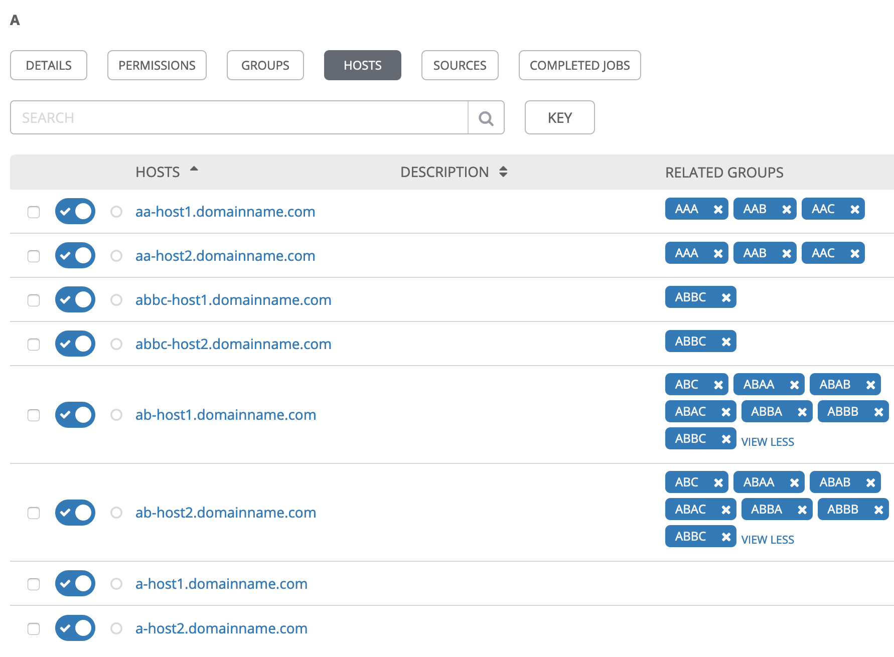
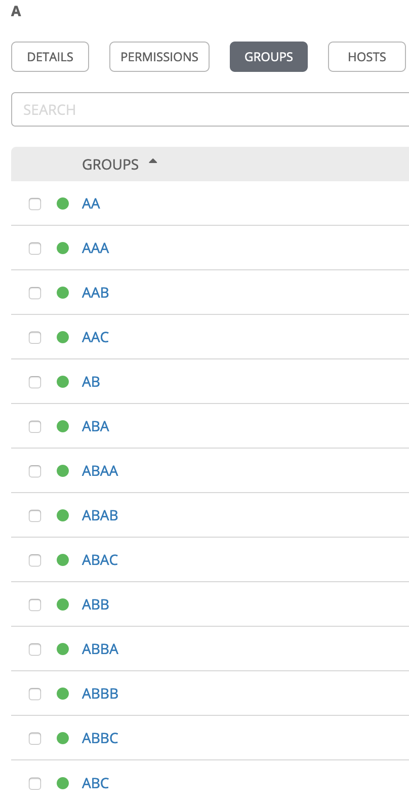
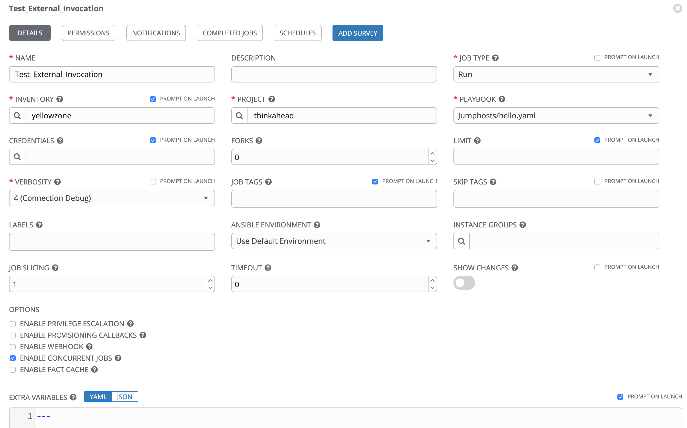
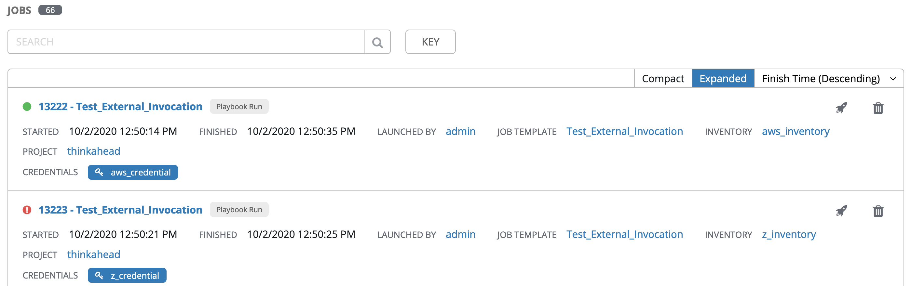

# Retrieving Inventory Variables for External Job Template Invocation from Ansible Tower/AWX
## Launching distinct subsets of jobs

Alexei.Karve

Published on October 2, 2020 / Updated on October 3, 2020

### Overview

Skill Level: Intermediate

Hands on experience with Ansible Tower/AWX

This article goes into details for searching hosts based on group names, retrieving inventory variables and launching distinct subsets of jobs from a Job Template with referenced inventory and credential variables

### Ingredients

Ansible Tower/AWX

### Step-by-step

#### 1. Abstract

Job Templates do not allow us to set multiple machine credentials and use them automatically for a subset of hosts in an inventory. We can however externally invoke the Tower REST API for the job template multiple times with different credentials passed as parameters. The inventory/group/host variables provide a convenient mechanism to store the credential ids/names that reference the Ansible Tower credentials. This article goes into details for searching hosts in the Tower Inventory based on group names, the nuances for retrieving variables, creating distinct subsets that the job requests can be combined into and running the job template multiple times with referenced inventory and credentials.

#### 2. Introduction

Job templates do not directly allow us to pass multiple credentials of same type. For example, we cannot pass multiple Machine Credentials if the different hosts in the inventory require different credentials for ssh connectivity. Similarly, if we have [custom credential types](https://github.com/thinkahead/DeveloperRecipes/blob/master/Jumphosts/Credentials.md "custom credential types"), we can only pass one credential of each type. For example, if we require different set of Jumphosts to reach a subset of hosts within an inventory, we cannot really associate credentials for each subset simultaneously within the job template. If we have hosts that require different credentials within the Inventory, we need to create multiple Job templates with a different inventory or set the LIMIT to select the hosts that work with relevant credential or use the lookup plugin to retrieve credentials from a 3rd party vault. Another way that we look at in this article is to create the single Job Template with Credentials and LIMIT, both set to PROMPT ON LAUNCH. The job template can then be invoked externally from a playbook that invokes the Tower REST API with required credentials for different hosts. This playbook that starts the multiple jobs can in turn be run in Ansible Tower either as a Workflow Template or a Job Template. We can pass a Tower Credential to allow calling the Tower REST APIs.

Inventories are divided into groups and these groups contain the actual hosts. Quite often we may want to store extra information in the Inventory variables. These variables can be set at the inventory, group, and/or host level. Our goal is to retrieve these variables with required precedence and further to use this information when starting a Job. When we call the REST API to start a job, Ansible Tower does not allow us to automatically attach the Tower Credentials to the Job Template based on the custom variables. So, we require a two-step process where we first query the variables to retrieve the credential ids and then invoke the Job template with the Credential Ids. We can also add a jumphost variables to indicate the [single](https://github.com/thinkahead/DeveloperRecipes/blob/master/Jumphosts/Credentials.md "Single credential for multiple jumphosts") or [separate](https://github.com/thinkahead/DeveloperRecipes/blob/master/Jumphosts/SeparateCredentials.md "Separate Jumphost Credentials for each hop") credential types to be used as the jumphost or any other credential type that we can pass dynamically.

Group variables are a convenient way to apply variables to multiple hosts at once. Before executing, however, Ansible always flattens variables, including inventory variables, to the host level. If a host is a member of multiple groups, Ansible reads variable values from all of those groups. If we assign different values to the same variable in different groups, Ansible chooses which value to use based on [internal rules for merging](https://docs.ansible.com/ansible/latest/user_guide/intro_inventory.html#how-we-merge "internal rules for merging"). By default, Ansible overwrites variables including the ones defined for a group and/or host (see DEFAULT\_HASH\_BEHAVIOUR). The order/precedence is (from lowest to highest):

1.  all group (because it is the ‘parent’ of all other groups)
2.  parent group
3.  child group
4.  host

By default, Ansible merges groups at the same parent/child level alphabetically, and the last group loaded overwrites the previous groups. Child groups properties to note are:

*   Any host that is member of a child group is automatically a member of the parent group.
*   A child group’s variables will have higher precedence (override) a parent group’s variables.
*   Groups can have multiple parents and children, but not circular relationships.
*   Hosts can also be in multiple groups, but there will only be one instance of a host, merging the data from the multiple groups.

When we retrieve the variables externally using Tower REST API, we need to follow similar precedence rules so that we can flatten the variables to be used for each job template invocation. Another goal is to minimize the number of invocations. i.e. if some of the hosts have common inventory and credentials, then we want to group them together into a single invocation with LIMIT set to multiple hosts.

#### 3. Searching for hosts in Inventories

The first step is to search for host names based on tags. The group names in the inventory can be used for searching in Ansible Tower as tags. This is a global search for all hosts in all inventories accessible to the user. The tags to search for may be specified as a dictionary or a list.

An example of a dictionary is policy\_tags\_dict: {"OS": "rhel7", "env": "dev"} for group names “OS:rhel7” and “env:dev”. Group names may be used for multivalued attributes such as “OS:rhel7”,“OS:rhel8” or “env:prod”,”env:staging”,“env:dev”,“env:test”. Note that there is no space after the colon in the group names. Also, since the colon character is not a valid character in group names, you need to set the Settings -> Job -> Environment Variable "ANSIBLE\_TRANSFORM\_INVALID\_GROUP\_CHARS": "ignore" to avoid a Warning message from being printed in the logs.

An example of a list is policy\_tags\_list: \["linux"\] for searching for hosts in a group with name “linux”.

The tags specified as policy\_tags\_dict is converted to a list. It is appended with the input var policy\_tags\_list if both the dict and list are specified as inputs in [variables\_test.yaml](https://github.com/thinkahead/DeveloperRecipes/blob/master/RetrieveVariablesFromTower/variables_test.yaml#L17-L19 "policy_tags_dict converted to list") as follows:

```
- set_fact:
    policy_tags_list: "{{ ((policy_tags_dict | to_json | regex_replace(': ',':') | regex_replace('[\\{}\"]','')).split(', ') + (policy_tags_list if policy_tags_list is defined else [])) | unique }}"
  when: "(policy_tags_dict|length) > 0"
```

The hosts are searched with the groups\_\_name\_\_iexact and multiple chain\_\_groups\_\_name\_\_iexact that result in searching for hosts that belong to all these group names. An url\_to\_invoke is generated that will be able to retrieve the list of hosts. A special group blacklist is created containing the list of hosts that are denied service. Any hosts in this group are excluded with the parameter chain\_\_not\_\_groups\_\_name\_\_iexact=blacklist. The [url\_to\_invoke](https://github.com/thinkahead/DeveloperRecipes/blob/master/RetrieveVariablesFromTower/variables_test.yaml#L24-L40 "Search for hosts in groups") is the REST API request that will be submitted to Ansible Tower to retrieve the hosts within multiple inventories.

```    
- set_fact:
    # Limit by tags and blacklist
    url_to_invoke: "{{ (tower_api_url+'/api/v2/hosts/?groups__name__iexact='+(policy_tags_list | list | join('&chain__groups__name__iexact='))+'&chain__not__groups__name__iexact=blacklist') if (policy_tags_list is defined and (policy_tags_list|list|length) > 0) else (tower_api_url+'/api/v2/hosts/') }}"

- name: Send request to tower to retrieve VMs with required tags (groups)
  uri:
    url: "{{ url_to_invoke }}"
    method: GET
    validate_certs: no
    status_code: 201, 200
    headers:
      Content-Type: application/json
      Authorization: "Bearer {{ tower_api_token }}"
  register: query_result
  ignore_errors: true
```

Then [retrieve the required inventory\_id\_hosts](https://github.com/thinkahead/DeveloperRecipes/blob/master/RetrieveVariablesFromTower/variables_test.yaml#L52-L66 "retrieve the required inventory_id_hosts") dict that has the inventory\_id with a list of corresponding selected hostnames.

```    
- name: Initialize inventory_ids_hosts fact
  set_fact:
    inventory_ids_hosts: {}
- name: Collect used inventory ids and host names
  set_fact:
    inventory_ids_hosts: "{{ inventory_ids_hosts | combine({vm_item.inventory:inventory_ids_hosts[vm_item.inventory]|default([])+[vm_item['name']]}) }}"
  loop: "{{ query_result.json.results | list }}"
  loop_control:
    loop_var: vm_item
    label: "{{ vm_item['name'] }}"
  no_log: true
  when: query_result is defined
- name: Show the Inventory ids and host names
  debug:
    msg: "{{ inventory_ids_hosts }}"
```

Searching for policy\_tags\_list: \["linux"\], i.e. a group “linux” in a sample Tower instance results in multiple inventory ids (2,3,5,6) with corresponding host names as shown below because each of these inventories has a group named “linux” containing those hosts.

```    
TASK [Show the Inventory ids and host names]

ok: [localhost] => {
    "msg": {
        "2": [
            "aaksles001.yellowykt.com",
            "aakubuntu001.yellowykt.com"
        ],
        "3": [
            "testaws-001",
            "testaws-002"
        ],
        "5": [
            "testz-001"
        ],
        "6": [
            "ep1-rhel.sl.cloud9.ibm.com"
        ]    }
}
```

Searching for policy\_tags\_dict: {"OS": "rhel7", "env": "prod2"} returns inventory ids (3,4,5) with corresponding host names as shown below because each of these inventories has a groups named “OS:rhel7” and “env:prod2” containing those hosts.

```
TASK [Show the Inventory ids and host names]

ok: [localhost] => {
    "msg": {
        "3": [
            "testaws-001",
            "testaws-002",
            "testaws-003"
        ],
        "4": [
            "testp-001"
        ],
        "5": [
            "testz-001"
        ]    }
}
```

Searching for policy\_tags\_dict: {"OS": "rhel7", "env": "prod2"} and policy\_tags\_list: \["linux"\] returns and intersection of the above two requests. This is equivalent to the single variable policy\_tags\_list: \["linux","OS:rhel7","env:prod2"\]

```
TASK [Show the Inventory ids and host names]

ok: [localhost] => {
    "msg": {
        "3": [
            "testaws-001",
            "testaws-002"
        ],
        "5": [
            "testz-001"
        ]    }
}
```

#### 4. Retrieve complete inventory, group and host variables

Now that we can retrieve the inventory id and corresponding hosts based on groups (tags we want to search for), the next step is to retrieve variables at host, group and inventory level for the selected hosts separately for each inventory. This is accomplished with the Tower REST API "{{ tower\_api\_url }}/api/v2/inventories/{{ inventory\_id }}/script/?hostvars=1" as shown in [variables\_test.yaml](https://github.com/thinkahead/DeveloperRecipes/blob/master/RetrieveVariablesFromTower/variables_test.yaml#L68-L80 "Retrieve Inventory") where the inventory\_id is the key from the inventory\_ids\_hosts retrieved earlier.
```
- name: Send request to tower to retrieve Inventory
  uri:
    url: "{{ tower_api_url }}/api/v2/inventories/{{ item.key }}/script/?hostvars=1"
    method: GET
    validate_certs: no
    status_code: 201, 200
    headers:
      Content-Type: application/json
      Authorization: "Bearer {{ tower_api_token }}"
  register: inventories_result
  ignore_errors: true
  with_dict: "{{ inventory_ids_hosts }}"
  no_log: true
```

#### 5. Flatten the variables to host level

Next these variables need to be flattened to the host level. The [flatten\_test.py](https://github.com/thinkahead/DeveloperRecipes/blob/master/RetrieveVariablesFromTower/flatten_test.py#L49-L238 "Inventory in flatten_test.py") shows a sample inventory “A” with variables at the inventory, group and host levels. It shows the invocation of the same functions as used in the [flatten\_variables module](https://github.com/thinkahead/DeveloperRecipes/blob/master/RetrieveVariablesFromTower/library/flatten_variables.py "flatten_variables module") later. The same sample inventory A in Ansible Tower is shown below with the HOSTS and GROUPS:





```
inventory={
    "AA": {
        "children": [
            "AAB","AAA","AAC"
        ],
        "vars": {
            "testvar": "aa",
            "testvar_aa_children": "from_aa"
        }
    },
    "AAA": {
        "hosts": [
            "aa-host1.domainname.com",
            "aa-host2.domainname.com"
        ],
        "vars": {
            "testvar": "aaa",
            "testvar_onlyaaa": "aaa_only",
            "testvar_aaa_aab": "from_aaa"
        }
    },
    "AAB": {
        "hosts": [
            "aa-host1.domainname.com"
        ],
        "vars": {
            "testvar": "aab",
            "testvar_onlyaab": "aab_only",
            "testvar_aab_aac": "from_aab",
            "testvar_aaa_aab": "from_aab"
        }
    },
    "AAC": {
        "hosts": [
            "aa-host2.domainname.com"
        ],
        "vars": {
            "testvar": "aac",
            "testvar_aab_aac": "from_aac"
        }
    },
    "AB": {
        "children": [
            "ABA","ABB","ABC"
        ],
        "vars": {
            "testvar": "ab",
            "testvar_ab_children": "from_ab"
        }
    },
    "ABA": {
        "children": [
            "ABAA","ABAB","ABAC"
        ],
        "vars": {
            "testvar": "aba"
        }
    },
    "ABAA": {
        "hosts": [
            "ab-host2.domainname.com",
            "ab-host1.domainname.com"
        ],
        "vars": {
            "testvar": "abaa"
        }
    },
    "ABAB": {
        "hosts": [
            "ab-host2.domainname.com",
            "ab-host1.domainname.com"
        ],
        "vars": {
            "testvar": "abab"
        }
    },
    "ABAC": {
        "hosts": [
            "ab-host2.domainname.com",
            "ab-host1.domainname.com"
        ],
        "vars": {
            "testvar": "abac"
        }
    },
    "ABB": {
        "children": [
            "ABBA","ABBB","ABBC"
        ],
        "vars": {
            "testvar": "abb"
        }
    },
    "ABBA": {
        "hosts": [
            "ab-host2.domainname.com",
            "ab-host1.domainname.com"
        ],
        "vars": {
            "testvar": "abba"
        }
    },
    "ABBB": {
        "hosts": [
            "ab-host2.domainname.com",
            "ab-host1.domainname.com"
        ],
        "vars": {
            "testvar": "abbb"
        }
    },
    "ABBC": {
        "hosts": [
            "ab-host2.domainname.com",
            "abbc-host2.domainname.com",
            "ab-host1.domainname.com",
            "abbc-host1.domainname.com"
        ],
        "vars": {
            "testvar": "abbc"
        }
    },
    "ABC": {
        "hosts": [
            "ab-host2.domainname.com",
            "ab-host1.domainname.com"
        ],
        "vars": {
            "testvar": "abc",
            "testvar_ab_children": "ab_override"
        }
    },
    "_meta": {
        "hostvars": {
            "a-host1.domainname.com": {
                "testvar": "a-host1"
            },
            "a-host2.domainname.com": {},
            "aa-host1.domainname.com": {
                "testvar": "aa-host1"
            },
            "aa-host2.domainname.com": {},
            "ab-host1.domainname.com": {
                "testvar": "ab-host1"
            },
            "ab-host2.domainname.com": {},
            "abbc-host1.domainname.com": {
                "testvar": "abbc-host1"
            },
            "abbc-host2.domainname.com": {}
        }
    },
    "all": {
        "children": [
            "AA","AAA","AAB","AAC","AB","ABA","ABAA","ABAB","ABAC","ABB","ABBA","ABBB","ABBC","ABC"
        ],
        "hosts": [
            "a-host1.domainname.com",
            "a-host2.domainname.com"
        ],
        "vars": {
            "testvar": "a",
            "testvar_all_children": "allvar",
        }
    }
}
```

The results on executing the flatten\_test.py on the sample inventory are shown below with an explanation of precedence that decides where the variables are retrieved from.

python flatten\_test.py

```
{'aa-host1.domainname.com': {'testvar': 'aa-host1', 'testvar_all_children': 'allvar', 'testvar_aa_children': 'from_aa', 'testvar_onlyaaa': 'aaa_only', 'testvar_aaa_aab': 'from_aab', 'testvar_onlyaab': 'aab_only', 'testvar_aab_aac': 'from_aab'},
'aa-host2.domainname.com': {'testvar': 'aac', 'testvar_all_children': 'allvar', 'testvar_aa_children': 'from_aa', 'testvar_onlyaaa': 'aaa_only', 'testvar_aaa_aab': 'from_aaa', 'testvar_aab_aac': 'from_aac'},
'abbc-host1.domainname.com': {'testvar': 'abbc-host1', 'testvar_all_children': 'allvar', 'testvar_ab_children': 'from_ab'},
'abbc-host2.domainname.com': {'testvar': 'abbc', 'testvar_all_children': 'allvar', 'testvar_ab_children': 'from_ab'},
'a-host1.domainname.com': {'testvar': 'a-host1', 'testvar_all_children': 'allvar'},
'a-host2.domainname.com': {'testvar': 'a', 'testvar_all_children': 'allvar'}}
```

The 'a-host2.domainname.com' gets both its variables 'testvar': 'a', 'testvar\_all\_children': 'allvar' from the inventory variables. The 'a-host1.domainname.com' gets the 'testvar\_all\_children': 'allvar' variable from the inventory variables and the 'testvar': "aa-host1" from the host variables. The 'abbc-host2.domainname.com' gets the 'testvar\_all\_children' from inventory variables, 'testvar': 'abbc' from the ABBC group and the 'testvar\_ab\_children': 'from\_ab' from the AB group. The 'abbc-host1.domainname.com' gets the 'testvar\_all\_children' from inventory variables, 'testvar': ' abbc-host1' from the host variable and the 'testvar\_ab\_children': 'from\_ab' from the AB group. The 'aa-host2.domainname.com' gets the 'testvar': 'aac' from AAC group variables, 'testvar\_all\_children': 'allvar' from inventory variables, 'testvar\_aa\_children': 'from\_aa' from the AA group, 'testvar\_onlyaaa': 'aaa\_only' from the AAA group, 'testvar\_aaa\_aab': 'from\_aaa' from the AAA group, 'testvar\_aab\_aac': 'from\_aac' from the AAC group. The 'aa-host1.domainname.com' gets the 'testvar': 'aa-host1' from "aa-host1.domainname.com" host variables, 'testvar\_all\_children': 'allvar' from inventory variables, 'testvar\_aa\_children': 'from\_aa' from the AA group, 'testvar\_onlyaaa': 'aaa\_only' from the AAA group, 'testvar\_aaa\_aab': 'from\_aaa' from the AAB group, 'testvar\_aab\_aac': 'from\_aac' from the AAB group.

The custom python module flatten\_variables achieves the same flattening of variables per host with required precedence and is invoked in [variables\_test.yaml](https://github.com/thinkahead/DeveloperRecipes/blob/master/RetrieveVariablesFromTower/variables_test.yaml#L85-L97 "Flatten variables in variables_test.yaml").

```
- name: Send request to module to retrieve variables
  flatten_variables:
    inventory: "{{ inventory_result.json }}"
    hosts: "{{ inventory_result.item.value }}"
    inventory_id: "{{ inventory_result.item.key }}"
  register: flattened
  ignore_errors: true
  loop: "{{ inventories_result.results }}"
  no_log: true
  loop_control:
    loop_var: inventory_result
    label: "{{ inventory_result.item.key }}"
```

The flatten\_variables modules generates vars containing the flattened variable list. It also generates a spec containing the multiple tower\_credentials for [all vars ending with credential](https://github.com/thinkahead/DeveloperRecipes/blob/master/RetrieveVariablesFromTower/library/flatten_variables.py#L85 "all vars ending with credential"), tower\_host and tower\_inventory. This is [combined to produce all\_vms](https://github.com/thinkahead/DeveloperRecipes/blob/master/RetrieveVariablesFromTower/variables_test.yaml#L99-L111 "combined to produce all_vms") in a format that we can use for grouping in next step. The rest of the fields in “vars” are retrieved but not used in this article.

```
- name: Initialize all_vms
  set_fact:
    all_vms: "{{ [] }}"
- name: Flattened variables for hosts
  set_fact:
    all_vms: "{{ all_vms + flattened_result.result }}"
  loop: "{{ flattened.results }}"
  loop_control:
    loop_var: flattened_result
  no_log: true
```

A sample output of flattened variables and spec for host name aakrhel002.yellowykt.com is shown below with tower\_credentials ("jumphost\_credential": "yellowzone\_group\_jumphost\_credential","os\_credential": "yellowzone-linux-endpoint"), the tower\_host name (aakrhel002.yellowykt.com) and the tower\_inventory id (2).

```
{  
  {
      "spec": {
          "tower_credentials": [
              "yellowzone_group_jumphost_credential",
              "yellowzone-linux-endpoint"
          ],
          "tower_host": "aakrhel002.yellowykt.com",
          "tower_inventory": "2"
      },
      "vars": {
          "ansible_port": 22,
          "ansible_ssh_common_args": "-o StrictHostKeyChecking=no -o UserKnownHostsFile=/dev/null -o ProxyCommand=\"ssh -W %h:%p {{ jh_ssh_user }}@{{ jh_ip }} -i $JH_SSH_PRIVATE_KEY -o StrictHostKeyChecking=no -o UserKnownHostsFile=/dev/null\"",
          "ansible_user": "ec2-user",
          "grouprhel7var1": "value1",
          "grouprhel7var2": "value2",
          "jumphost_credential": "yellowzone_group_jumphost_credential",
          "os_credential": "yellowzone-linux-endpoint",
          "rhel7cis_pass_minlen": 12
      }
  }
```

#### 6. Grouping the jobs into a minimum number of requests

The spec is used to group the requests into a minimum number of job invocations. This is done with the [group\_dict](https://github.com/thinkahead/DeveloperRecipes/blob/master/RetrieveVariablesFromTower/library/group_dict.py "group_dict module") module that groups by the keys that consist of the distinct set of 'tower\_credentials' and the 'tower\_inventory' in all\_vms.

```
        - name: Initialize job_request_locations to empty list for Virtual Machine Groups
          set_fact:
            job_request_locations: "{{ [] }}"

        - name: Group VMs by credentials and inventory for Virtual Machine Groups in all_vms.spec
          group_dict:
            items: "{{ all_vms }}"
            keys: "{{ ['tower_credentials', 'tower_inventory'] }}"
            subfield: "spec"
          register: all_vm_groups
```

Note that the group\_dict module ensures that even if the same set of credentials in the list are specified in a different order, they are [sorted](https://github.com/thinkahead/DeveloperRecipes/blob/master/RetrieveVariablesFromTower/library/group_dict.py#L33-L34 "sorted") and treated as equivalent.

#### 7. Launch Tower Jobs

A Job Template "Test\_External\_Invocation" is used for the launching the job that calls the playbook [hello.yaml](https://github.com/thinkahead/DeveloperRecipes/blob/master/Jumphosts/hello.yaml "hello.yaml"). The “Prompt on Launch” is enabled for Inventory, Credentials, Limit, Job Tags, and Extra Variables.



The included [tower\_invoke.yaml](https://github.com/thinkahead/DeveloperRecipes/blob/master/RetrieveVariablesFromTower/combine_test.yaml#L37-L41 "included tower_invoke.yaml") runs the grouped jobs where the multiple hosts passed to the LIMIT with tower\_host="{{ vm\_group\_item.tower\_host }}" and the job template [Test\_External\_Invocation](https://github.com/thinkahead/DeveloperRecipes/blob/master/RetrieveVariablesFromTower/combine_test.yaml#L22-L24 "Job Template Test_External_Invocation").

```
- name: Job Template Name to invoke
   set_fact:
     tower_job_template: Test_External_Invocation
 - name: Invoke job for VirtualMachine Groups
   include: tower_invoke.yaml tower_host="{{ vm_group_item.tower_host }}" tower_inventory="{{ vm_group_item.tower_inventory }}" tower_credentials="{{ vm_group_item.tower_credentials }}"
   with_items: "{{ all_vm_groups.grouped_items }}"
   loop_control:
     loop_var: vm_group_item
```

The [tower\_invoke.yaml](https://github.com/thinkahead/DeveloperRecipes/blob/master/RetrieveVariablesFromTower/tower_invoke.yaml#L98-L117 "Invoke Tower api to launch job template") invokes the uri module to launch the job.

```
- name: Invoke Tower api to launch job template
  uri:
    url: "{{ tower_api_url }}/api/v2/job_templates/{{ tower_job_template_request.json.results[0].id }}/launch/"
    method: POST
    body_format: json
    body:
      inventory: "{{ inventory_id }}"
      credentials: "{{ credential_ids }}"
      limit: "{{ tower_host if tower_host is string else (tower_host | join(' ')) }}"
      extra_vars: "{{ tower_extra_vars | to_json }}"
      job_tags: "{{ tags_to_pass if ((tags_to_pass | length)<1024) else '' }}"
    validate_certs: no
    status_code: 201, 200
    headers:
      Content-Type: application/json
      Authorization: "Bearer {{ tower_api_token }}"
  register: job_request
  no_log: true
  ignore_errors: true
```

There is a limit to the length of job\_tags allowed by Ansible Tower. Although not used in this article, it shows that job tags are passed only if the length is less than 1024. It also shows how to pass extra\_vars, extra\_vars is not used in the examples in this article.

The [job\_request\_locations](https://github.com/thinkahead/DeveloperRecipes/blob/master/RetrieveVariablesFromTower/tower_invoke.yaml#L126-L127 "job_request_locations") for all the launched jobs is collected as below:

```
- set_fact:
    job_request_locations: "{{ (job_request_locations | default([])) + [ {'tower_host':tower_host,'location':job_request['location']} ] }}"
```

This job\_request\_locations containing the URLs for the job ids can be used to check for completion. Example output for job\_request\_locations is shown below:

```
TASK [Returned from invoke job template for Virtual Machine Groups]

ok: [localhost] => {
    "msg": [
        {
            "location": "https://ansible-tower-web-svc-tower.example.com/api/v2/jobs/13222/",
            "tower_host": [
                "testaws-001",
                "testaws-002"
            ]        },
        {
            "location": "https://ansible-tower-web-svc-tower.example.com/api/v2/jobs/13223/",
            "tower_host": [
                "testz-001"
            ]        }
    ]}
```

#### 8. Wait for all launched jobs to complete

The request to check for completion is submitted multiple times while the status is running for each job that was submitted until it is successful, failed or cancelled.
```
- name: Check that tower job has finished for Virtual Machine Groups
  uri:
    url: "{{ job_request_location.location }}"
    method: GET
    validate_certs: no
    status_code: 201, 200
    headers:
      Content-Type: application/json
      Authorization: "Bearer {{ tower_api_token }}"
  register: job_result_list
  until: "(job_result_list['status']!=201 and job_result_list['status']!=200) or 'canceled' in job_result_list['json']['status'] or 'successful' in job_result_list['json']['status'] or 'failed' in job_result_list['json']['status']"
  retries: 120
  delay: 30
  no_log: true
  ignore_errors: true
  with_items: "{{ job_request_locations }}"
  loop_control:
    loop_var: job_request_location
```

The output of above play:

```
TASK [Check that tower job has finished for Virtual Machine Groups]

FAILED - RETRYING: Check that tower job has finished for Virtual Machine Groups (120 retries left).
ok: [localhost] => (item={'tower_host': ['testaws-001', 'testaws-002'], 'location': 'https://ansible-tower-web-svc-tower.example.com/api/v2/jobs/13222/'})
ok: [localhost] => (item={'tower_host': ['testz-001'], 'location': 'https://ansible-tower-web-svc-tower.example.com/api/v2/jobs/13223/'})
```

For the long running job, it will show "FAILED - RETRYING" multiple times every 30 seconds. The screenshot below shows the two job requests that were submitted and completed, 13222 was successful and the 13223 failed.



#### 9. Putting it all together

It is assumed they you have created a token in Ansible Tower to allow calling the REST API. The combine\_test.yaml brings all the above steps together and can be run as follows:

```
ansible-playbook combine_test.yaml -e 'tower_api_url=https://ansible-tower-web-svc-tower.example.com' -e 'tower_api_token= tower_api_token'
```

The [combine\_test.yaml](https://github.com/thinkahead/DeveloperRecipes/blob/master/RetrieveVariablesFromTower/combine_test.yaml "combine_test.yaml") invokes the tower\_get\_vms2.yaml (equivalent to the variables\_test.yaml discussed earlier) that flattens the variables into specs. Then it groups VMs by credentials and inventory for Virtual Machine Groups in all\_vms.spec using the custom group\_dict module. The grouped job requests are launched by including tower\_invoke.yaml with required parameters that returns the job\_request\_locations for the multiple job requests that were submitted. Finally, each of these job request locations is checked for completion.

The output from the jobs can be retrieved as was discussed in the article [Retrieving Playbook Results from Ansible Tower/AWX](https://github.com/IBM/IBMDeveloper-recipes/blob/main/retrieving-playbook-results-from-ansible-tower-awx/)

Section 4 to retrieve all variable has been tested with an inventory that did not require pagination. Instead of retrieving all the variables at inventory/group and host level in a single call, we can separately retrieve jumphost\_credential and os\_credentials variables for [inventory](https://github.com/thinkahead/DeveloperRecipes/blob/master/RetrieveVariablesFromTower/tower_get_vms.yaml#L97-L112 "Retrieve inventory variables"), [groups](https://github.com/thinkahead/DeveloperRecipes/blob/master/RetrieveVariablesFromTower/tower_get_vms.yaml#L65-L80 "Retrieve group variables"), [hosts](https://github.com/thinkahead/DeveloperRecipes/blob/master/RetrieveVariablesFromTower/tower_get_vms.yaml#L22-L33 "Retrieve host variables") with restrictions that only one group should have the credentials defined and [combining them](https://github.com/thinkahead/DeveloperRecipes/blob/master/RetrieveVariablesFromTower/tower_get_vms.yaml#L128-L138 "Combining the variables with precedence") with required precedence. This has been shown in [tower\_get\_vms.yaml](https://github.com/thinkahead/DeveloperRecipes/blob/master/RetrieveVariablesFromTower/tower_get_vms.yaml "tower_get_vms.yaml")

#### 10. Conclusion

This article provides a recipe for searching hosts based on group names, retrieving inventory variables and launching minimal distinct subsets of jobs from a Job Template with referenced inventory and credential variables.

Hope you have enjoyed the article. Share your thoughts in the comments or engage in the conversation with me on Twitter @aakarve. I look forward to hearing about how you work around Ansible Tower for hosts in a inventory that require different credentials in your automation and if you would like to see something covered in more detail.

#### 11. Links to other articles in this series

- [Retrieving Playbook Results from Ansible Tower/AWX](https://github.com/IBM/IBMDeveloper-recipes/blob/main/retrieving-playbook-results-from-ansible-tower-awx/)
- [Locking Simultaneous Access to Hosts in Ansible Playbooks](https://github.com/IBM/IBMDeveloper-recipes/blob/main/locking-simultaneous-access-to-hosts-in-ansible-playbooks/)
- [Multiple Jumphosts in Ansible Tower -- Part 1: Connecting to Linux hosts using ssh with nested ProxyCommand](https://github.com/IBM/IBMDeveloper-recipes/blob/main/multiple-jumphosts-in-ansible-tower-part-1/)
- [Multiple Jumphosts in Ansible Tower -- Part 2: Connecting to Windows/Linux hosts with ssh tunnel SOCKS5 proxy](https://github.com/IBM/IBMDeveloper-recipes/blob/main/multiple-jumphosts-in-ansible-tower-part-2)
- [Multiple Jumphosts in Ansible Tower -- Part 3: Ssh tunnel SOCKS5 proxy with passphrase enabled for ssh keys](https://github.com/IBM/IBMDeveloper-recipes/blob/main/multiple-jumphosts-in-ansible-tower-part-3)
- [Multiple Jumphosts in Ansible Tower -- Part 4: Multi jumphost connections to Linux hosts using ssh-add to add keys to ssh-agent](https://github.com/IBM/IBMDeveloper-recipes/blob/main/multiple-jumphosts-in-ansible-tower-part-4/)
- [Multiple Jumphosts in Ansible Tower -- Part 5: Unix domain socket file instead of socks port](https://github.com/IBM/IBMDeveloper-recipes/blob/main/multiple-jumphosts-in-ansible-tower-part-5/)
- [Multiple Jumphosts in Ansible Tower -- Part 6: Primary and Secondary/Backup Jumphosts and Reverse ssh Tunnel](https://github.com/IBM/IBMDeveloper-recipes/blob/main/multiple-jumphosts-in-ansible-tower-part-6/)
- [Multiple Jumphosts in Ansible Tower -- Part 7: Failover using redundant jumphosts, tweaking ssh parameters and memory requirements for jumphosts](https://github.com/IBM/IBMDeveloper-recipes/blob/main/multiple-jumphosts-in-ansible-tower-part-7/)
- [Multiple Jumphosts in Ansible Tower -- Part 8: Transferring files using ansible synchronize module and rsync](https://github.com/IBM/IBMDeveloper-recipes/blob/main/multiple-jumphosts-in-ansible-tower-part-8/)
- [Multiple Jumphosts in Ansible Tower -- Part 9: Pull secrets from remote 3rd-party vaults over multiple jumphost hops](https://github.com/IBM/IBMDeveloper-recipes/blob/main/multiple-jumphosts-in-ansible-tower-part-9/)
- [Multiple Jumphosts in Ansible Tower -- Part 10: Using Container Groups instead of bubblewrap for isolation of jobs](https://github.com/IBM/IBMDeveloper-recipes/blob/main/multiple-jumphosts-in-ansible-tower-part-10/)
- [Multiple Jumphosts in Ansible Tower -- Part 11: Using Container Groups with sshuttle proxy](https://github.com/IBM/IBMDeveloper-recipes/blob/main/multiple-jumphosts-in-ansible-tower-part-11/)
