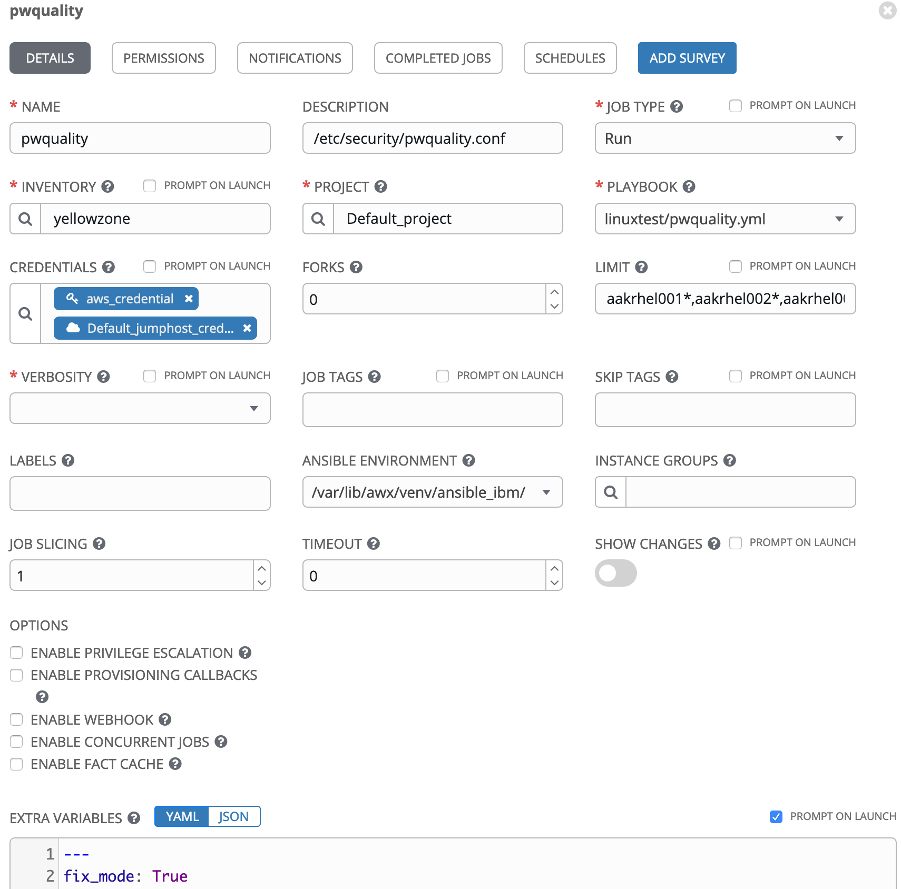
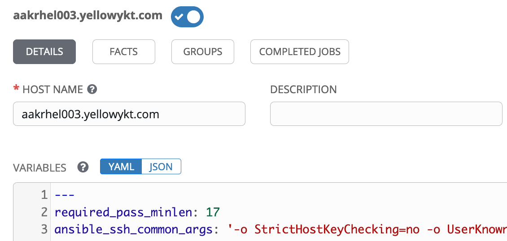
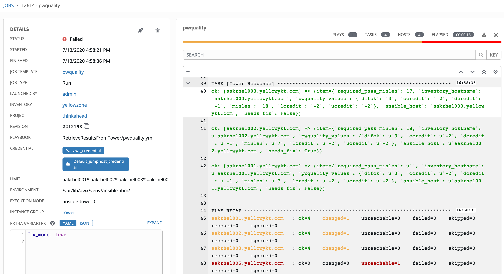

# Retrieving Playbook Results from Ansible Tower/AWX

## An elegant mechanism to retrieve required output results from playbooks for multiple hosts in the inventory

[Alexei.Karve](https://developer.ibm.com/recipes/author/karve/)

Tags: Cloud computing, DevOps, Linux

Published on June 23, 2020 / Updated on August 23, 2020

### Overview

Skill Level: Intermediate

Proficient in using Ansible Tower/AWX - create and run job templates

Ansible Tower does not provide an easy mechanism to retrieve output parameters when invoking job templates from an external script or tool using the REST API. This recipe shows how to send and retrieve specific parameters with help of sample playbooks.

### Ingredients

Ansible Tower or AWX

### Step-by-step

#### 1. Abstract

It is often necessary to retrieve output parameters from Ansible Tower Jobs when invoking the jobs from an external script or tool. Ansible Tower does not provide any easy mechanism to retrieve output parameters that can be set within a playbook run by a job. One way to retrieve results is by screen scraping the stdout txt logs from tower jobs, however that is unwieldy. This article shows an elegant mechanism to retrieve required output parameters or results from playbooks for multiple hosts in the inventory.

#### 2. Introduction

Ansible Tower is a hub for automation tasks that provides a web-based console and REST API for Ansible. Tower’s REST API and CLI make it easy to embed Tower into existing tools and processes. A job template is a definition and set of parameters for running ansible playbooks. Job templates are useful to execute the same job many times. Ansible Tower makes it simple to launch a job based on a Job Template with the REST API or by using the tower-cli command line tool.

A POST request can be submitted to launch a job template with required data.

```
https://your.tower.server/api/v2/job_templates/<your job template id>/launch/
```

 This data includes credentials, limit, inventory, tags and extra variables. Along with any extra variables set in the job template and survey, Tower automatically adds keywords and reserved/ special variables to the job environment such as magic variables with “tower_” and “awx_” prefix. The REST API allows monitoring and tracking the status of a job, whether it is running/success/failed/canceled and retrieving the job log/stdout with the job id after it is invoked.

Ansible Tower provides multiple mechanisms to identify input parameters and send structured arguments that are accessible by the playbook when invoking a job. However, retrieving structured output parameters from a job after the playbook has completed execution is not so easy. Ansible modules normally return a data structure that can be registered into a variable or seen directly when output by the playbook. This output goes to the job log. Ansible Tower can also be configured to send detailed logs to several kinds of 3rd party external log aggregation services.

This article will show an example of invoking a job template from an external program using Ansible Tower REST API with input parameters and a recipe to retrieve structured output parameters thereof.

#### 3. Input Parameters

Two common ways to send input parameters to a playbook invoked by a job are:

1. “Extra Variables” in Job Template with “Prompt on Launch” checked – Pass the “extra_vars” string that represents a JSON or YAML formatted dictionary to the REST API. These are passed as extra command line variables to the playbook with “-e” or “–extra-vars” command line parameter. These variables have maximum precedence and override other variables specified elsewhere. Surveys set extra variables for the playbook similar to “Prompt for Extra Variables”, but in a user-friendly way and allow for validation of user input.
1. Variables at the Host, Group or Inventory have least precedence – Use the REST API to set these variables before invoking the job template. Variables are merged/flattened to the specific host before a play is run. The order/precedence for variables is: “Inventory”, “Parent Group”, “Child Group”, “Host” (from lowest to highest). Groups at the same parent/child level are merged alphabetically, and the last group loaded overwrites the previous groups.

The extra variables approach is useful if each invocation of the job template uses the same values for all hosts within the job when a job is invoked. The host/group variables approach is required when each host may need different values.

#### 4. Output Parameters

The job output from the playbooks can be retrieved with /api/v2/jobs/{{ job_id }}/stdout/?format=txt and searched with regex_search. However, this log can get very large when jobs produce large output. With verbosity set to 0, we need a way to output the data in a form that can be parsed. One way to achieve this is by printing the title as follows and parsing the response between the “tower_response=>” and “<”
``` yaml
    # Print as title
    - name: "tower_response=>{{ tower_response | to_json }}<="
      debug:
        msg: "Dummy message"
```
This approach with response in the title works for single host. The problem with multiple hosts is that it only uses the first host in the inventory. If you run the job with multiple VMs in the inventory, then the output from the rest of the hosts is lost. A better way is to print using with_items as follows:
``` yaml
    # Print as loop item
    - name: Tower Response
      set_fact:
        dummy: value # Just to make some task without output
      with_items:
        - tower_response=>{{ tower_response | to_json }}<=
```
Searching Ansible Tower for specific named tasks using task__contains={{ responding_task }} allows retrieval of the output from the result json.results. The REST API for this purpose is
```
/api/v2/jobs/{{ job_id }}/job_events/?event__contains=runner_item_on_ok&task__contains={{ responding_task }
```
The responding_task is “Tower%20Response” as seen in name for the “Print as loop item” comment above. The “tower_response=>…<=” delimiter is no longer required because the job event directly outputs the json string. We do not need a regex_replace to search the json output with this additional delimiter. This regex_replace is removed (shown as commented) in the code later.

Another way is to use the set_stats module that also works with multiple hosts. This was mentioned in the comments to the article and has been added in Section 10.
``` yaml
    - name: Custom Response
      set_stats:
        data:
          tower_response: "{{ tower_response | to_json }}"
```
#### 5. Example with two playbooks

An example is provided with two playbooks: [pwquality.yml](https://github.com/thinkahead/DeveloperRecipes/blob/master/RetrieveResultsFromTower/pwquality.yml) that runs in Ansible Tower and the [parsetest.yml](https://github.com/thinkahead/DeveloperRecipes/blob/master/RetrieveResultsFromTower/parsetest.yaml) is the client that calls Ansible Tower. The first playbook pwquality.yml is setup as a job template shown in Figure 1 that retrieves the parameters from /etc/security/pwquality.conf from the endpoint hosts.  The second playbook parsetest.yml retrieves the output of the job by invoking Ansible Tower REST API. This second playbook takes the job_id as the parameter. In order to demonstrate both types of input parameters, a parameter called “fix_mode” is provided as extra vars as shown in Figure 1 and the parameter called “required_pass_minlen” as host variables as shown in Figure 2.

Figure 1: Job Template for playbook pwquality.yml



The playbook pwquality.yml reads the /etc/security/pwquality.conf and converts it to json as follows:
```
           "pwquality_values": {
                "dcredit": "-1",
                "difok": "3",
                "lcredit": "-2",
                "minlen": "7",
                "ocredit": "-2",
                "ucredit": "-2"
            }
```
The “inventory_hostname” and “ansible_host” are also combined with the above. If the “required_pass_minlen” is set as a variable in the inventory/group/host, it is combined with the above or set as empty if not defined. Finally the needs_fix is computed by checking if the (pwquality_values.minlen < required_pass_minlen) and fix_mode is true.

For testing, an inventory called yellowzone is created with multiple VMs four of which will be used: aakrhel001.yellowykt.com, aakrhel002.yellowykt.com, aakrhel003.yellowykt.com and aakrhel005.yellowykt.com. The aakrhel001.yellowykt.com does not have the variable required_pass_minlen, aakrhel002.yellowykt.com is set with the variable required_pass_minlen: 18 and aakrhel003.yellowykt.com is set with the variable required_pass_minlen: 17. This variable for aakrhel003.yellowykt.com is shown in Figure 2. You can set the required_pass_minlen at the inventory or group levels (if you create groups). The previously mentioned precedence will apply when the variable required_pass_minlen is referenced in the playbook pwquality.yml. Figure 2 also shows an additional variable that may be required if you do not have direct connectivity to the endpoints and may need to override the ansible_ssh_common_args to use jumphosts. Connecting to endpoints using multiple jumphosts is covered in the series [Multiple Jumphosts in Ansible Tower](https://developer.ibm.com/recipes/tutorials/multiple-jumphosts-in-ansible-tower-part-1/).

Figure 2: Host Variables



#### 6. Source code for playbook pwquality.yml

The source code for the pwquality.yml is shown below. The [first task](https://github.com/thinkahead/DeveloperRecipes/blob/master/RetrieveResultsFromTower/pwquality.yml#L10-L12) reads the configuration file. The [second task](https://github.com/thinkahead/DeveloperRecipes/blob/master/RetrieveResultsFromTower/pwquality.yml#L14-L18) sets the name value pairs in pwquality_values. The [third task](https://github.com/thinkahead/DeveloperRecipes/blob/master/RetrieveResultsFromTower/pwquality.yml#L20-L23) collects all the information json form. The final [fourth task](https://github.com/thinkahead/DeveloperRecipes/blob/master/RetrieveResultsFromTower/pwquality.yml#L26-L30) prints out the json in a format that can be parsed by the external client.
``` yaml
---
- hosts: all
  gather_facts: false
  #become: true

  vars:
     fix_mode: false # Set this to true in job template extra vars
     # Keep this commented if you want to use your host/group/inventory variables
     # This will have higher precedence that host/group/inventory variables but less than extra vars
     # required_pass_minlen: 16

  tasks:
    - name: Reading Configuration Settings
      shell: cat /etc/security/pwquality.conf | grep "=" | grep -v "^#";true
      register: pwquality_results

    - set_fact:
        pwquality_values: "{{ pwquality_values | default({}) | combine( dict([ item.partition('=')[::2]|map('trim') ]) ) }}"
      with_items: "{{ pwquality_results.stdout_lines }}"
      when: item.split('=')|length > 1
      no_log: true

    - name: Set fact for the dictionary that contains all the variables to be parsed
      set_fact:
        tower_response: '{{ tower_response | default({}) | combine( {"required_pass_minlen":(required_pass_minlen if required_pass_minlen is defined else ""),"inventory_hostname":inventory_hostname,"ansible_host":ansible_host,"pwquality_values":pwquality_values,"needs_fix":((pwquality_values.minlen|int)<(required_pass_minlen|int) and fix_mode|bool) if required_pass_minlen is defined else False} ) }}'
      no_log: true

    # Print as loop item
    - name: Tower Response
      set_fact:
        dummy: value # Just to make some task without output
      with_items:
        - "{{ tower_response | to_json }}"
```

The tasks in the playbook are executed with the default [linear strategy](https://docs.ansible.com/ansible/latest/plugins/strategy/linear.html#linear-strategy), where each task is run on up to serial hosts in parallel. Ansible waits for all hosts to complete the task before starting the next task on all the hosts. The [free strategy](https://docs.ansible.com/ansible/latest/plugins/strategy/free.html) lets each host run independently, starting its next task as soon as it finishes the previous one, regardless of how far other hosts have proceeded. The free strategy is used in the next article on [Locking Simultaneous Access to Hosts in Ansible Tower](https://developer.ibm.com/recipes/tutorials/locking-simultaneous-access-to-hosts-in-ansible-playbooks/).

#### 7. Executing the job

The job is run against an inventory with four VMs selected using `LIMIT=aakrhel001*,aakrhel002*,aakrhel003*,aakrhel005*` using the Tower UI. The `aakrhel005.yellowykt.com` is not accessible on port 22 and will therefore fail. Note the job id. The output as seen in Ansible Tower GUI is as follows:



```
TASK [Tower Response] **********************************************************
ok: [aakrhel002.yellowykt.com] => (item={'required_pass_minlen': 18, 'inventory_hostname': 'aakrhel002.yellowykt.com', 'pwquality_values': {'difok': '3', 'ocredit': '-2', 'dcredit': '-1', 'minlen': '7', 'lcredit': '-2', 'ucredit': '-2'}, 'ansible_host': 'aakrhel002.yellowykt.com', 'needs_fix': True})
ok: [aakrhel001.yellowykt.com] => (item={'required_pass_minlen': u'', 'inventory_hostname': u'aakrhel001.yellowykt.com', 'pwquality_values': {'difok': u'3', 'ocredit': u'-2', 'dcredit': u'-1', 'minlen': u'7', 'lcredit': u'-2', 'ucredit': u'-2'}, 'ansible_host': u'aakrhel001.yellowykt.com', 'needs_fix': False})
ok: [aakrhel003.yellowykt.com] => (item={'required_pass_minlen': 17, 'inventory_hostname': u'aakrhel003.yellowykt.com', 'pwquality_values': {'difok': u'3', 'ocredit': u'-2', 'dcredit': u'-1', 'minlen': u'18', 'lcredit': u'-2', 'ucredit': u'-2'}, 'ansible_host': u'aakrhel003.yellowykt.com', 'needs_fix': False})

PLAY RECAP *********************************************************************
aakrhel001.yellowykt.com : ok=4 changed=1 unreachable=0 failed=0 skipped=0 rescued=0 ignored=0
aakrhel002.yellowykt.com : ok=4 changed=1 unreachable=0 failed=0 skipped=0 rescued=0 ignored=0
aakrhel003.yellowykt.com : ok=4 changed=1 unreachable=0 failed=0 skipped=0 rescued=0 ignored=0
aakrhel005.yellowykt.com : ok=0 changed=0 unreachable=0 failed=1 skipped=0 rescued=0 ignored=0
```

Sample curl command is shown below that retrieves the output of the tasks containing name: “Tower Response”. Replace the tower_token, tower_api_url and job_id below to get the results from the Tower job. The job_event output shows results.event_data.res.item contains the json output of interest. This information is used in the client parsetest.yml playbook later.

`curl -k -H "Authorization: Bearer <<tower_token>>" "<< tower_api_url >>/api/v2/jobs/<<job_id>>/job_events/?event__contains=runner_item_on_ok&task__contains=Tower%20Response" | jq .`
```
{
  "count": 3,
  "next": null,
  "previous": null,
  "results": [
    {
      "id": 22042124,
      "type": "job_event",
      "url": "/api/v2/job_events/22042124/",
     ...

      "event_data": {
        "play_pattern": "all",
        "play": "all",
        "task": "Tower Response",
        "task_args": "",
        "uuid": "50672872-3c09-424b-8060-4c6a67a0c99b",
        "res": {
          "ansible_loop_var": "item",
          "_ansible_no_log": false,
          "item": "{\"inventory_hostname\": \"aakrhel002.yellowykt.com\", \"pwquality_values\": {\"minlen\": \"7\", \"lcredit\": \"-2\", \"ucredit\": \"-2\", \"difok\": \"3\", \"ocredit\": \"-2\", \"dcredit\": \"-1\"}, \"ansible_host\": \"aakrhel002.yellowykt.com\"}",
          "changed": false,
          "ansible_facts": {
            "dummy": "value"
          },
 ...
 ```

 The [parsetest.yml](https://github.com/thinkahead/DeveloperRecipes/blob/master/RetrieveResultsFromTower/parsetest.yaml) client code can retrieve this json output generated from the hosts and extract the json output we desire. Run the playbook with the correct tower_api_url, tower_token and job_id that you can pass as extra vars with “-e” argument. This playbook checks whether the job has finished. If not, it waits for upto 5 minutes. The output needs to be parsed even if job_result.json.status returns failed. We run the job against multiple hosts and few hosts that fail will cause the job to return failed, but other hosts that were successful will output their results that can be parsed. Note that the url needs to be encoded, therefore the responding_task is set to “Tower%20Response” (or “Tower+Response”).
```
ansible-playbook parsetest.yml -e "job_id=12614" # Replace 12614 with your job id
```

#### 8. Source Code for parsetest.yml
``` yaml
---
- hosts: localhost
  connection: local
  gather_facts: no
  vars:
    tower_api_url: "https://ansible-tower-web-svc-tower.example.com "
    tower_token: "tower_token"
    job_id: 1234
    responding_task: Tower%20Response
  tasks:
    - name: Check that tower job has finished
      uri:
        url: "{{ tower_api_url }}/api/v2/jobs/{{ job_id }}/"
        method: GET
        validate_certs: no
        status_code: 201, 200
        headers:
          Content-Type: application/json
          Authorization: "Bearer {{ tower_token }}"
      register: job_result
      ignore_errors: true

    - name: print job_result
      debug:
        msg: "{{ job_result['status'] }} {{ 'failed' if job_result['failed'] else job_result['json']['status'] }}"

    - name: Check that tower job has finished
      uri:
        url: "{{ tower_api_url }}/api/v2/jobs/{{ job_id }}/"
        method: GET
        validate_certs: no
        status_code: 201, 200
        headers:
          Content-Type: application/json
          Authorization: "Bearer {{ tower_token }}"
      register: job_result
      until: "'canceled' in job_result['json']['status'] or 'successful' in job_result['json']['status'] or 'failed' in job_result['json']['status']"
      retries: 10
      delay: 30
      no_log: true
      ignore_errors: true

    - name: Set job_result
      set_fact:
        job_status: "{{ 'failed' if job_result.failed else job_result['json']['status'] }}"

    - name: Print Job status
      debug:
        var: job_status

    - name: show job details for {{ job_id }}
      debug:
        msg: "status={{ job_result.status }} json.started {{ job_result.json.started }} json.finished: {{ job_result.json.finished }} json.status: {{ job_result.json.status }}"

    - name: Print extra_vars input to job {{ job_id }}
      debug:
        msg: "extra_vars={{ job_result.json.extra_vars }}"

    # Find the events with responding_task
    - name: Get job_events of job
      uri:
        url: "{{ tower_api_url }}/api/v2/jobs/{{ job_id }}/job_events/?event__contains=runner_item_on_ok&task__contains={{ responding_task }}"
        method: GET
        return_content: yes
        validate_certs: no
        status_code: 201, 200
        headers:
          Authorization: "Bearer {{ tower_token }}"
      register: result
      no_log: true

    - name: show length of the event list
      debug: var=result.json.count

    - name: trim events list
      set_fact:
        #values: "{{ values | default([]) + [(item.event_data.res.item | regex_replace('tower_response=>(.*)<=', '\\1')) | from_json] }}"
        values: "{{ values | default([]) + [item.event_data.res.item | from_json] }}"
      loop: "{{ result.json.results | list }}"
      no_log: true

    - name: show output parameters from the tower job
      debug: msg="{{ item.inventory_hostname }} {{ item.ansible_host }} {{ item.pwquality_values }}"
      loop: "{{ values }}"
```

#### 9. Sample output from the external playbook

Sample output from the external playbook [parsetest.yml](https://github.com/thinkahead/DeveloperRecipes/blob/master/RetrieveResultsFromTower/parsetest.yaml) shows the output parameters item.inventory_hostname, item.ansible_host, pwquality_values that were retrieved successfully for Tower job.
```
TASK [show output parameters from the tower job] ******************************************************************************
ok: [localhost] => (item={u'required_pass_minlen': 18, u'inventory_hostname': u'aakrhel002.yellowykt.com', u'pwquality_values': {u'difok': u'3', u'ocredit': u'-2', u'dcredit': u'-1', u'minlen': u'7', u'lcredit': u'-2', u'ucredit': u'-2'}, u'ansible_host': u'aakrhel002.yellowykt.com', u'needs_fix': True}) => {
    "msg": "aakrhel002.yellowykt.com aakrhel002.yellowykt.com {u'minlen': u'7', u'lcredit': u'-2', u'ucredit': u'-2', u'difok': u'3', u'ocredit': u'-2', u'dcredit': u'-1'}"
}
ok: [localhost] => (item={u'required_pass_minlen': 17, u'inventory_hostname': u'aakrhel003.yellowykt.com', u'pwquality_values': {u'difok': u'3', u'ocredit': u'-2', u'dcredit': u'-1', u'minlen': u'18', u'lcredit': u'-2', u'ucredit': u'-2'}, u'ansible_host': u'aakrhel003.yellowykt.com', u'needs_fix': False}) => {
    "msg": "aakrhel003.yellowykt.com aakrhel003.yellowykt.com {u'minlen': u'18', u'lcredit': u'-2', u'ucredit': u'-2', u'difok': u'3', u'ocredit': u'-2', u'dcredit': u'-1'}"
}
ok: [localhost] => (item={u'required_pass_minlen': u'', u'inventory_hostname': u'aakrhel001.yellowykt.com', u'pwquality_values': {u'difok': u'3', u'ocredit': u'-2', u'dcredit': u'-1', u'minlen': u'7', u'lcredit': u'-2', u'ucredit': u'-2'}, u'ansible_host': u'aakrhel001.yellowykt.com', u'needs_fix': False}) => {
    "msg": "aakrhel001.yellowykt.com aakrhel001.yellowykt.com {u'minlen': u'7', u'lcredit': u'-2', u'ucredit': u'-2', u'difok': u'3', u'ocredit': u'-2', u'dcredit': u'-1'}"
}
```

This sample parsetest.yml can be used to retrieve additional output parameter values using events with distinct responding_task names. Hosts resulting in Error or Unreachable hosts can be retrieved with the REST API that searches for runner_on_failed or runner_on_reachable with following REST API that provides the event_data.res.msg for results /api/v2/jobs/12282/job_events/?or__event__contains=runner_on_failed&or__event__contains=runner_on_unreachable”

#### 10. Using the set_stats module

The set_stats module produces output similar to “Print as loop item”. The sample [pwquality2.yml](https://github.com/thinkahead/DeveloperRecipes/blob/master/RetrieveResultsFromTower/pwquality2.yml) that is run as a job in Ansible Tower produces a “Custom Response” using the set_stats module (to keep it different from “Tower Response” produced using set_fact). The [parse_test2.yaml](https://github.com/thinkahead/DeveloperRecipes/blob/master/RetrieveResultsFromTower/parsetest2.yaml) shows the sample Ansible client code that retrieves the output variables produced by pwquality2.yml from item.event_data.res.ansible_stats.data.tower_response.

Using set_fact with_items that we had previously used, the curl command is as follows to retrieve output from Ansible Tower:

`curl -k -H "Authorization: Bearer <<tower_token>>" "<< tower_api_url >>/api/v2/jobs/<<job_id>>/job_events/?event__contains=runner_item_on_ok&task__contains=Tower%20Response" | jq .results[].event_data.res.results[0].item`

Now with set_stats, we can use a curl command as follows to retrieve output from Ansible Tower:

`curl -k -H "Authorization: Bearer <<tower_token>>" "<< tower_api_url >>/api/v2/jobs/<<job_id>>/job_events/?event__contains=runner_on_ok&task__contains=Custom%20Response" | jq .results[].event_data.res.ansible_stats.data.tower_response`

#### 11. Conclusion

This article provides a recipe to retrieve output parameters from a playbook for multiple hosts. A sample playbook checks the password “minlen” setting in Linux. It uses two types of input parameters: the extra variables and host variables. The playbook computes needs_fix whether the password “minlen” needs to be fixed for the hosts. A sample client playbook waits for the job to complete and finally retrieves the json output containing the fields from “/etc/security/pwquality.conf” for the multiple hosts by searching the Tower job events. The sample playbook pwquality.yml can be extended to fix the password length if needs_fix is true.

Hope you have enjoyed the article. Share your thoughts in the comments or engage in the conversation with me on Twitter @aakarve. I look forward to hearing about how you retrieve Ansible Tower job run results for external use in your automation and if you would like to see something covered in more detail.

#### 12. References
- Ansible Tower REST API https://docs.ansible.com/ansible-tower/latest/html/towerapi/api_ref.html
- Filtering a collection in Ansible Tower https://docs.ansible.com/ansible-tower/latest/html/towerapi/filtering.html
- Print to standard output without escaping https://ansibledaily.com/print-to-standard-output-without-escaping/
- Source code for above recipe https://github.com/thinkahead/DeveloperRecipes/tree/master/RetrieveResultsFromTower
- Multiple Jumphosts in Ansible Tower -- Part 1: Connecting to Linux hosts using ssh with nested ProxyCommand <https://developer.ibm.com/recipes/tutorials/multiple-jumphosts-in-ansible-tower-part-1>
- Multiple Jumphosts in Ansible Tower -- Part 2: Connecting to Windows/Linux hosts with ssh tunnel SOCKS5 proxy <https://developer.ibm.com/recipes/tutorials/multiple-jumphosts-in-ansible-tower-part-2>
- Multiple Jumphosts in Ansible Tower -- Part 3: Ssh tunnel SOCKS5 proxy with passphrase enabled for ssh keys <https://developer.ibm.com/recipes/tutorials/multiple-jumphosts-in-ansible-tower-part-3>
- Multiple Jumphosts in Ansible Tower -- Part 4: Multi jumphost connections to Linux hosts using ssh-add to add keys to ssh-agent <https://developer.ibm.com/recipes/tutorials/multiple-jumphosts-in-ansible-tower-part-4/>
- Multiple Jumphosts in Ansible Tower -- Part 5: Unix domain socket file instead of socks port <https://developer.ibm.com/recipes/tutorials/multiple-jumphosts-in-ansible-tower-part-5/>
- Multiple Jumphosts in Ansible Tower -- Part 6: Primary and Secondary/Backup Jumphosts and Reverse ssh Tunnel <https://developer.ibm.com/recipes/tutorials/multiple-jumphosts-in-ansible-tower-part-6/>
- Multiple Jumphosts in Ansible Tower -- Part 7: Failover using redundant jumphosts, tweaking ssh parameters and memory requirements for jumphosts <https://developer.ibm.com/recipes/tutorials/multiple-jumphosts-in-ansible-tower-part-7/>
- Multiple Jumphosts in Ansible Tower -- Part 8: Transferring files using ansible synchronize module and rsync <https://developer.ibm.com/recipes/tutorials/multiple-jumphosts-in-ansible-tower-part-8/>
- Multiple Jumphosts in Ansible Tower -- Part 9: Pull secrets from remote 3rd-party vaults over multiple jumphost hops <https://developer.ibm.com/recipes/tutorials/multiple-jumphosts-in-ansible-tower-part-9/>
- Multiple Jumphosts in Ansible Tower -- Part 10: Using Container Groups instead of bubblewrap for isolation of jobs <https://developer.ibm.com/recipes/tutorials/multiple-jumphosts-in-ansible-tower-part-10/>
- Multiple Jumphosts in Ansible Tower -- Part 11: Using Container Groups with sshuttle proxy <https://developer.ibm.com/recipes/tutorials/multiple-jumphosts-in-ansible-tower-part-11/>
