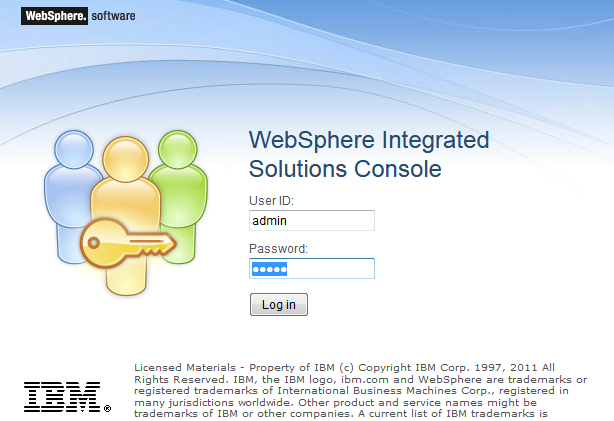
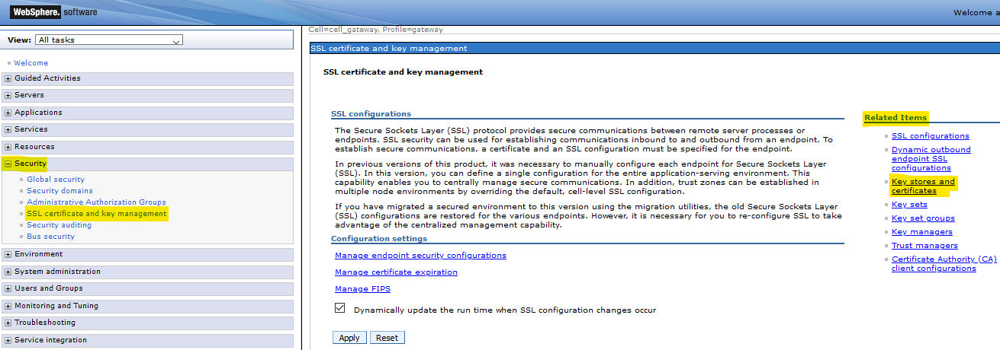
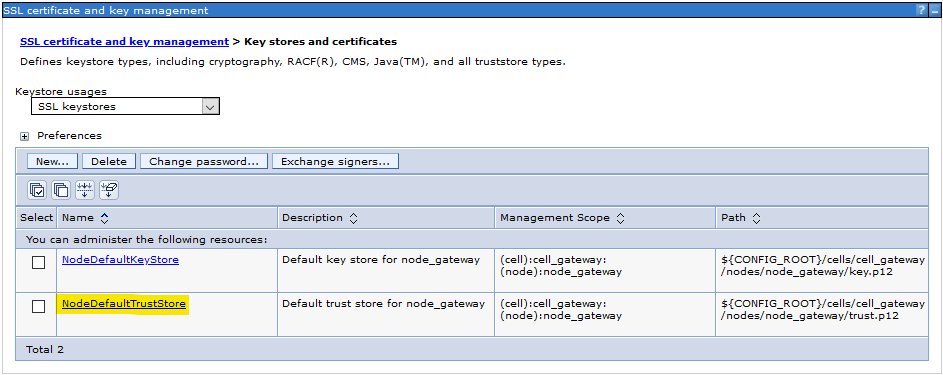
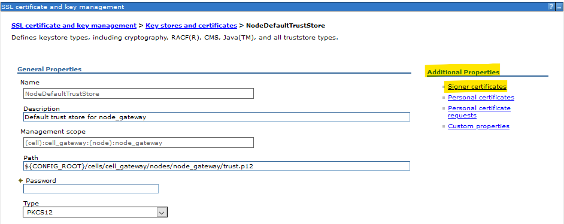
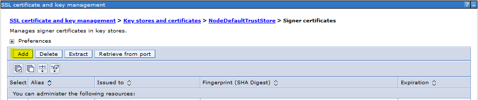
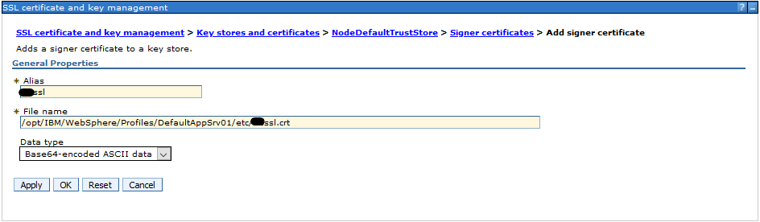
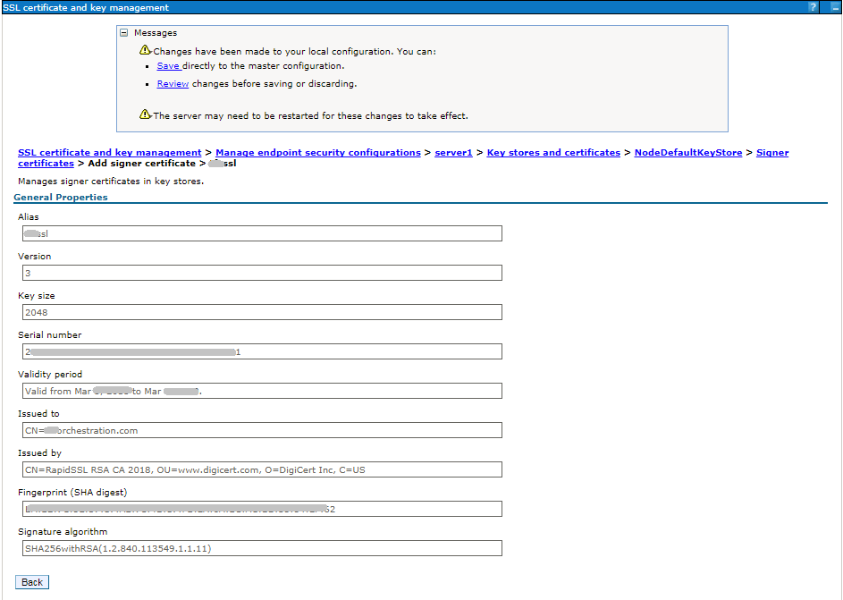
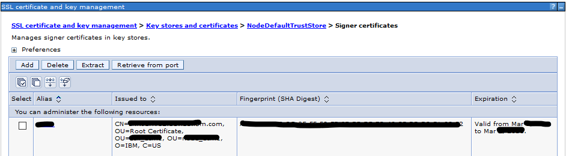

# Add SSL Certificate in WebSphere Application Server (WAS)
## Add a signer certificate from another server in WAS for successful SSL handshake

PramodSapare

Tags: Java development, Security, Web development

Published on March 28, 2019 / Updated on April 29, 2021

### Overview

Skill Level: Intermediate

Exercise caution when working on the WebSphere Admin Console

Step-by-step instructions to add a signer certificate from another server in WAS for successful SSL handshake. The screenshots included are from WAS 9.0.

### Ingredients

* WebSphere Application Server (the screenshots are from WAS v9.0).
* A signer certificate from another server that needs to be added to your WAS.

### Step-by-Step

#### 1. Login to WAS Admin Console

Login into WAS Admin Console: [https://<WAS\_ADMIN\_HOST>:<WAS\_ADMIN\_PORT>/ibm/console](https://<WAS_ADMIN_HOST><WAS_ADMIN_PORT>)

#### 2. Navigate to certificate configuration section

Go to **Security** (Left Nav) -> **SSL certificate and key management** and under **Related Items** section, click on **Key stores and certificates** link.

#### 3. Select TrustStore

Click on **NodeDefaultTrustStore**

**  
**

#### 4. Start addition of certificate

Under **Additional Properties**, Click on **Signer Certificates**

**  
**

#### 5. Add new signer certificate

Click on **Add** button

**  
**

#### 6. Provide certificate details

Provide details for the certificate to be added. Then click on **Apply**.

Make sure the .crt file is already copied to WAS machine, for e.g. /opt/IBM/WebSphere/Profiles/DefaultAppSrv01/etc/xxxssl.crt

#### 7. Check the certificate details

The certificate details can be seen as below. Click on **Save**.

#### 8. SSL certificate is successfully added

**! Note that a server restart is not required for these changes to take effect.**
