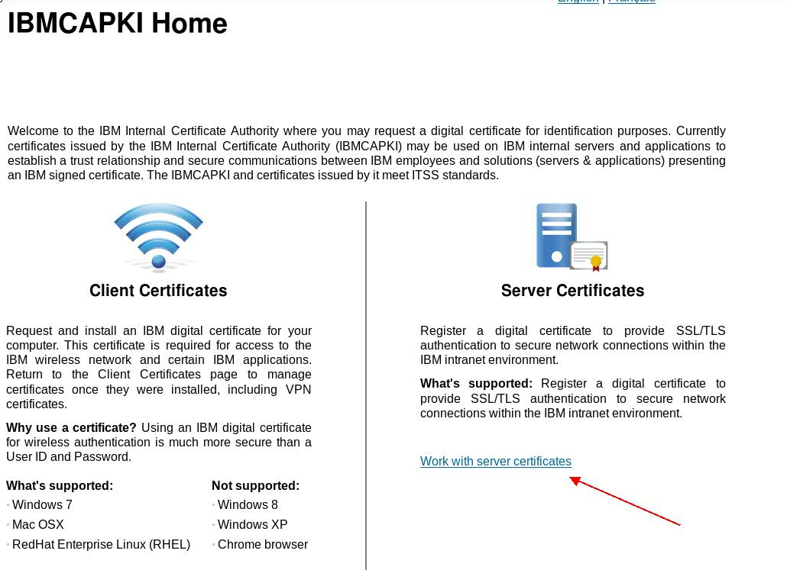

# SSL - How to configure it on DB2
## Setting up SSL on DB2 Server & Client

ferborges

Tags: AIX and UNIX, Linux, Security

Published on July 27, 2018 / Updated on December 12, 2019

### Overview

Skill Level: Intermediate

In this document, you will find a full step-by-step recipe teaching you How To Setting up Encrypted Connections in DB2 CLI needed by GDPR. The Encrypted Connection learned here is the Secure Sockets Layer (SSL).

### Ingredients

1\. You should have IBM gskit installed on your system where you intend to install the certificate. By default, DB2 has a gskit installed in db2 installation path.

To verify, you can run the following

Login to db2 server using putty.

Switch to db2 instance and run db2profile

Run “which gsk8capicmd\_64”

It will show you the path from where system is using the gskit.

In case you it returns something like. Then you need to adjust the db2profile

which: no gsk8capicmd\_64 in (/usr/local/bin:/usr/bin:/bin:/usr/bin/X11:/usr/X11R6/bin:/usr/games:/usr/lib64/jvm/jre/bin:/usr/lib/mit/bin:/usr/lib/mit/sbin:/opt/gnome/bin)

### Step-by-step

#### 1. Before you begin

There are some of the environment variables that you need to change in commands according to your environment.

Eg:

_db2instance_ - Replace this with environment DB2 instance.

CN=<_Server Host_\> – Replace it with your server host name.

OU=<_Organization Unit_\> – Replace it with your Organization.

L=<_Server Location_\> – Replace it with Server physical Location.

ST=<_Server State_\> – Replace it with Server state.

C=<_Server Country_\> – Replace it with Server Country.

_label_ – Replace it with label of your choice.

_Password_ – Password of your choice.

#### 2. Adjusting the db2profile

1\. First verify that you have gskit available in your db2 installation path. (Note you may have standalone gskit installed on your system as well)

2\. Go to db2 installation path

cd /home/<db2instance>/sqllib/gskit/bin

ls -l

if you have above path you will see gskit commands available there.

3\. If you find gskit from step 2, Modify the db2profile to add the following.

\### Added to set the GSKIT PATH

PATH=/home/<db2instance>/sqllib/gskit/bin:$PATH; export PATH

4\. Run db2profile after the changes.

5\. Go through step 1 to make sure which gsk8capicmd\_64 returns the path.

Note – If you do not find gskit installed on your system you need to install it from IBM Fixed Central [here](http://www-01.ibm.com/support/docview.wss?uid=swg21631462).

#### 3. Creating Certificate KeyStores

Step 1. Login to DB2 Server using putty

Step 2. Create a separate folder structure to protect Signer Certificate, KeyStore and Stash file.

mkdir /home/_db2instance_/db2\_ssl

cd /home/_db2instance_/db2\_ssl

Step 3. Use the gsk8capicmd\_64 command to create key database.

gsk8capicmd\_64 -keydb -create -db "db2\_ssl\_keydb.kdb" -pw "_<password>_" -type cms -stash

Note – You should have 4 new files created in /home/<db2instance>/db2\_ssl path.

Step 4. Create a Certificate Signing Request (CSR) File

gsk8capicmd\_64 -certreq -create -db "db2\_ssl\_keydb.kdb" -pw "_<password>_" -label "_IBM\_CA\_signed_" -dn "CN=_<Server Host>_, O=_IBM_, OU=_<Org Unit>_, L=_<Server Location>_, ST= _<Server State>_, C= _<Server Country>_" -file db2\_ssl\_ibmca\_certreq.csr -size 2048 -sigalg SHA512WithRSA

You will receive a new file with extension .csr

Step 5. Run command

cat db2\_ssl\_ibmca\_certreq.csr

You will see the request key.

#### 4. Requesting Certificate on IBM CA website

1\. Go to [IBM CA website](https://daymvs1.pok.ibm.com/ibmca/welcome.do?id=1685630)

2\. Select Server Certificates

3\. Select Create Profile

Note – You can use your existing profile if you already have one.

4\. Fill in the details – Profile Information

\* Label is basically for you to identify your server

5\. Fill in the details – Certificate Fields

CN - Your server host name

OU – Fill in your organizational Unit

C - Country where the server is located

L, S – Server Location

Note – You can fill-in the same info that you have used in generating the request file in previous step.

6\. Fill in the details – Description

7\. Fill in the details – Owner and MAD Address.

dd owner to the certificate, you can add your team member who can backup you and/or project manager. You may have multiple people added as owner.

MAD reference is you server host name or alias. You can search your server in MAD DB site. There is a link beside the input box.

8\. Click on Submit. It will create your profile

9\. On next screen you will see a button “Request Certificate” click on it.

10\. Select copy and paste option. And Paste the whole contents of your CSR file (generated from step Create Certificate KeyStores - Step 5):

11\. Select your approving manager.

12\. Submit the request.

13\. Once you have your approval. Follow the next steps.

#### 5. Downloading Certificates from IBM CA

Step 1. Once the approval is in place, you will receive an email from service machine.

It will have download links for the IBMRoot and IBMIntermediate certificates.

Download both the certificates (IBMRoot and IBMIntermediate)

Alternately you can download them from IBMCA website -> Certificate tab -> at the bottom of the page.

Step 2. Goto IBM CA website

Select Certificates tab → select Server label from the list.

On the next screen select “CRT File” from Action dropdown and click on arrow “>” to download it.

Now you will have the 3rd file.

Step 3. Now you got the total of 3 files (2 .der files and 1 .crt file)

IBMRoot (carootcert.der), IBMIntermediate (caintermediatecert.der) and cert.crt file

Ftp all 3 files to DB2 server. You need to place them under the folder you have created. As per our eg db2\_ssl.

#### 6. Installing Certificates

Now you need to install the certificates.

Run the following commands

Step 1. Add the root certificate to KeyStore

gsk8capicmd\_64 -cert -add -db "db2\_ssl\_keydb.kdb" -pw "_<password>_" -label "_IBMCA\_Root_" -file carootcert.der -format binary -fips

Step 2. Add the Intermediate certificate to KeyStore

gsk8capicmd\_64 -cert -add -db "db2\_ssl\_keydb.kdb" -pw "_<password>_" -label "_IBMCA\_Intermediate_" -file caintermediatecert.der -format binary -fips

Step 3. Receive the signer certificate to KeyStore

gsk8capicmd\_64 -cert -receive -file cert.crt -db db2\_ssl\_keydb.kdb -pw "_<password>_" -format binary -default\_cert yes

Step 4. Validate

Run the following command to list the certificates.

gsk8capicmd\_64 -cert -list -db db2\_ssl\_keydb.kdb -stashed

You should see 3 certificates in your keystore.

#### 7. Configuring DBM CFG - Server side

Step 1. Configure the DBM configuration. (for DB2 Server)

db2 update dbm cfg using SSL\_SVR\_KEYDB /home/_<db2instance>_/db2\_ssl/db2\_ssl\_keydb.kdb

db2 update dbm cfg using SSL\_SVR\_STASH /home/_<db2instance>_/db2\_ssl/db2\_ssl\_keydb.sth

db2 update dbm cfg using SSL\_SVR\_LABEL _<Default Certificate Label>_

Note - Only set the Default Certificate Label. System will atomically use the reset of the certificate chain.

Step 2. Recycle the DB Instance.

db2stop

db2start

#### 8. Configuring SSL on Client side

Here are the steps to configure SSL on Client side:

Step 1. Download the IBM CA Root Certificate (carootcert.der). This is a binary-encoded DER-format certificate. Save it somewhere convenient.

Step2. Create a new folder where you will store all Client SSl files:

cd /home/_<db2instance>_

mkdir SSL\_CLIENT

Step 3. FTP carootcert.der to /home/_<db2instance>_/SSL\_CLIENT

Step 4. Use GSKit to create a key database by running the following command:

/home/_<db2instance>_/sqllib/gskit/bin/gsk8capicmd\_64 -keydb -create -db "/home/_<db2instance>_/SSL\_CLIENT/ibmca.kdb" -pw "_<password>_" -stash

Step 5. For Linux and Mac users, run the following commands to ensure that all users on the system (including both your own main userid and the DB2 instance id) can read the key database files:

chmod 775 /home/_<db2instance>_/SSL\_CLIENT/ibmca.kdb

chmod 775 /home/_<db2instance>_/SSL\_CLIENT/ibmca.sth

Step 6. Update your DB2 client environment to look for this key database:

db2 update dbm cfg using SSL\_CLNT\_KEYDB /home/<db2instance>/SSL\_CLIENT/ibmca.kdb

db2 update dbm cfg using SSL\_CLNT\_STASH /home/<db2instance>/SSL\_CLIENT/ibmca.sth

db2 force application all

db2stop

db2start

Step 7. Import the IBM CA root certificate (as downloaded in step 1) into the GSKit key database:

/home//<db2instance>/sqllib/gskit/bin/gsk8capicmd\_64 -cert -add -db "/home/_<db2instance>_/SSL\_CLIENT/ibmca.kdb" -pw "_<password>_" -label "_IBMRoot_" -file "/home/_<db2instance>_/SSL\_CLIENT/carootcert.der -format binary

Step 8. Finally, catalog the DB2 connection using SSL. Note that you need to know the secure port number for the database systems you want to connect to securely.

db2 catalog tcpip node _<node\_name>_ remote _<hostname>_ server _<sslport>_ security ssl

db2 catalog db _<db\_name>_ as _<db\_alias>_ at node _<node\_name>_ authentication SERVER\_ENCRYPT

db2 terminate

Step 9. Test the connection as normal:

db2 connect to _<db\_alias>_ user _<user\_id>_
