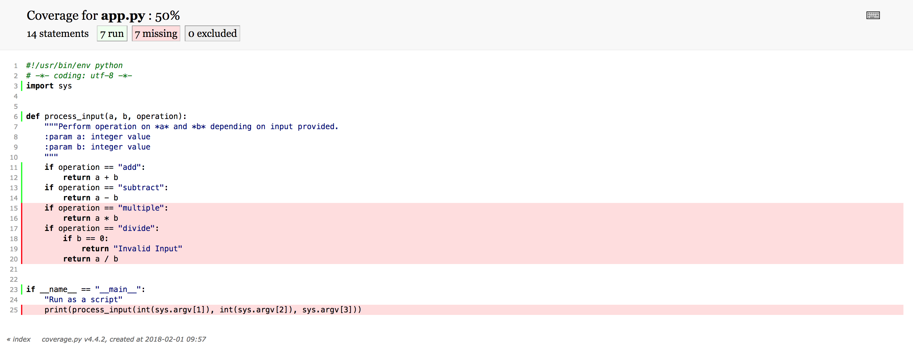

# Testing and Code coverage with Python

## Learn how to write test cases in Python and measure code coverage

[Shalabh Aggarwal](https://developer.ibm.com/recipes/author/shalabh7777/)

Tags: none

Published on February 9, 2018 / Updated on November 10, 2020

### Overview

Skill Level: Beginner

The purpose of this recipe is to get started with unit testing of Python code and learn how to determine code coverage. The recipe also covers how code coverage can be increased with exhaustive unit tests.

### Ingredients

*   Python
*   Coverage Python Package ([read the docs](\"https://coverage.readthedocs.io/en/coverage-4.4.2/\"))
*   Code coverage metrics and terminology in general (see step 6 below)

This recipe assumes a basic working knowledge of Python as a language.

#### 1. Create a small Python script

Below is a small Python script which will perform basic mathematical operations. The method `**process\_input()**` takes the two parameters (which are operands) and the operation name as a string value. The various operations supported here are addition, subtraction, multiplication and division.
```
**app.py**
#!/usr/bin/env python
\# -\*- coding: utf-8 -\*-
import sys

def process\_input(a, b, operation):
"""Perform operation on \*a\* and \*b\* depending on input provided.
:param a: integer value
:param b: integer value
"""
if operation == "add":
return a + b
if operation == "subtract":
return a - b
if operation == "multiple":
return a \* b
if operation == "divide":
if b == 0:
return "Invalid Input"
return a / b

if \_\_name\_\_ == "\_\_main\_\_":
"Run as a script"
print(process\_input(int(sys.argv\[1\]), int(sys.argv\[2\]), sys.argv\[3\]))
```

To run this script, run the following on your shell.

```
$ python app.py 10 5 add
15
$ python app.py 10 5 subtract
5
```

#### 2. Write first test case

To create a [test suite](https://docs.python.org/3/library/unittest.html) for the above script, use the small test file below. Here, the "**setUp()**" method is called before every test case runs. Then there is a test case which checks the addition of two numbers.
```
test.py

#!/usr/bin/env python
# -*- coding: utf-8 -*-
import unittest
from app import process_input

class TestApp(unittest.TestCase):
  “””Test the mathematical operations app
  “””
  def setUp(self):
      “This runs before the test cases are executed”
      self.a = 10
      self.b = 5
  def test_0010_add(self):
      “Test add operation”
      result = process_input(self.a, self.b, “add”)
      self.assertEqual(result, 15)


def suite():
  “Test suite”
  suite = unittest.TestSuite()
  suite.addTests(
      unittest.TestLoader().loadTestsFromTestCase(TestApp)
  )
  return suite

if __name__ == ‘__main__’:
  unittest.TextTestRunner(verbosity=2).run(suite())
```

#### 3. Run the test case

Running a test case is pretty straightforward. To do so, run the following command from shell:

```
$ python test.py

test_0010_add (__main__.TestApp)

Test add operation … ok

———————————————————————-

Ran 1 test in 0.000s

OK
```

#### 4. Calculate the code coverage

To calculate the code coverage, a new package needs to be installed. To install the package, run the following command on shell:
```
$ pip install coverage
```
Then run the following to see coverage report:
```
$ coverage run test.py
test_0010_add (__main__.TestApp)
Test add operation … ok

———————————————————————-

Ran 1 test in 0.000s
OK
$ coverage report

Name      Stmts   Miss  Cover
—————————–
app.py       14      9    36%
test.py      15      0   100%
—————————–
TOTAL        29      9    69%
```

#### 5. Increase coverage by adding more tests

The code coverage here is 69% overall and 36% for app.py. This is not good. The code coverage can be increased by writing more test cases, as follows:
```
test.py
def test_0020_subtract(self):
       “Test subtract operation”
       result = process_input(self.a, self.b, “subtract”)
       self.assertEqual(result, 5)
```

After adding the above method, calculate the code coverage again after adding above method:

```
$ coverage run test.py
test_0010_add (__main__.TestApp)
Test add operation … ok
test_0020_subtract (__main__.TestApp)
Test subtract operation … ok
———————————————————————-
Ran 2 tests in 0.000s
OK
$ coverage report

Name      Stmts   Miss  Cover
—————————–
app.py       14      7    50%
test.py      18      0   100%
—————————–
TOTAL        32      7    78%
```

The code coverage has increased to 78% on adding another test case. It can be increased further to 100% in a similar fashion.

#### 6. Understanding code coverage metrics

Code coverage is basically a percentage of count of lines that the test cases traversed to the overall lines in the code. This would be called Path Coverage. For more information on code coverage, [see this article](https://www.sealights.io/test-metrics/code-coverage-metrics/).

In this program, we have multiple conditions for each mathematical operation, which means that testing would be done for multiple conditions inside code. This can be referred to as Condition Coverage.

When the tests would be written for division, a boolean operation would be checked that would be Branch Coverage.

There are multiple other metrics and types of coverage for more [complex programs](https://github.com/Flask-Framework-Cookbook/Chapter-10/blob/master/app_tests.py).

To have a visual look at how much of the code is actually traversed, generate a HTML report.

```
$ coverage html
```

This will create a folder at the current working directory with the name “**htmlcov**”. Inside this folder there would be a file named “**app\_py.html**”. Open this file in any browser to have a visual overview of the coverage.


