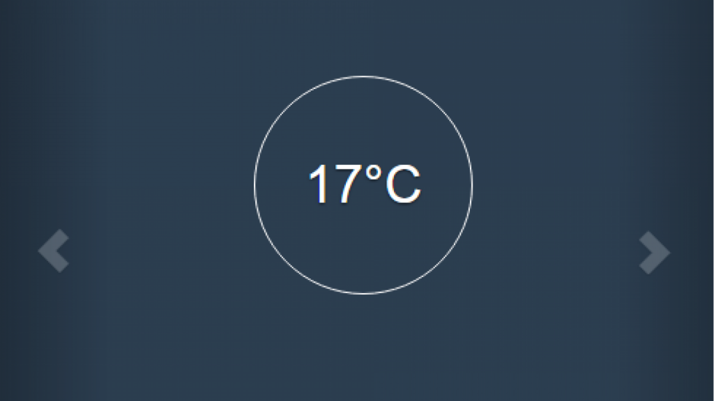

# Use the simulated device to experience the IBM Watson IoT Platform
## If you don't have a physical device but still want to sample the IBM Internet of Things Platform, you can use simulated data.

EdProsser

Tags: Internet of Things (IoT)

Published on July 21, 2015

### Overview

Skill Level: Beginner

ConnectingUsing two devices, one acts as the device simulator, and the second is used to visualize data from the simulator. (You can run both in a single browser instance, but then you are dependent on the browser&#8217;s capabilities).On your first smartphone/tablet/computer, start the simulator by browsing to http://quickstart.internetofthings.ibmcloud.com/iotsensor. The simulator connects automatically and starts publishing [&hellip;]

### Ingredients

For best results, use two separate smartphones/tablets/computers, each with a websockets-enabled browser.

### Step-by-step

#### 1. Connecting

This recipe works best by using one device to control the simulated sensor and another device to view the data visualization.

1.  To view the simulated sensor, go to [http://quickstart.internetofthings.ibmcloud.com/iotsensor](http://quickstart.internetofthings.ibmcloud.com/iotsensor "http://quickstart.internetofthings.ibmcloud.com/iotsensor"). The simulator connects automatically and starts publishing data. The simulator must remain connected to visualize the data.
2.  Use the simulator buttons to change the simulated sensor readings. Data is published periodically.

There are three simulated sensors:

*   Object temperature.
*   Temperature.
*   Humidity.

#### 2. Visualizing your data

1.  Note the device ID of the simulated device (it's a mix of numbers and letters displayed in the top right corner).
2.  Enter the device ID into the box [here](https://quickstart.internetofthings.ibmcloud.com/?deviceId=#/).
