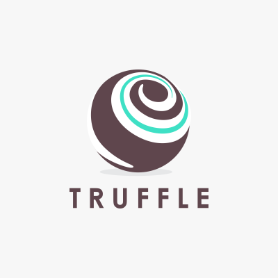

# Work with Ethereum, Solidity and Truffle Unit Testing in Tontine DApp Game
## Build Blockchain and DApps Using Ethereum, Solidity and Truffle

mattumd

Tags: Cloud computing, Continuous engineering, Internet of Things (IoT), Linux, Web development

Published on July 8, 2019 / Updated on March 7, 2021



### Overview

Skill Level: Beginner

In this recipe, you learn how a tool such as Truffle can be your aid in building, testing, debugging, and deploying blockchain decentralized Applications. Along the way, you learn more advance topics for Ethereum development using Solidity language.

### Ingredients

To follow and complete this recipe, you need to have good knowledge of blockchain, Ethereum transactions, Solidity as well as basic knowledge of HTML, CSS and Linux.

### Step-by-step

#### 1. Overview of Blockchain Development with Ethereum

Ethereum is a general-purpose blockchain that is more suited to describing business logic, through advanced scripts, also known as smart contracts. Ethereum was designed with a broader vision, as a decentralized or world computer that attempts to marry the power of the blockchain, as a trust machine, with a Turing-complete contract engine. Although Ethereum borrows many ideas that were initially introduced by bitcoin, there are many divergences between the two.  

The Ethereum virtual machine and smart contracts are key elements of Ethereum, and constitute its main attraction. In Ethereum, smart contracts represent a piece of code written in a high-level language (Solidity, LLL, Viper) and stored as bytecode in the blockchain, in order to run reliably in a stack-based virtual machine (Ethereum Virtual Machine), in each node, once invoked. The interactions with smart contract functions happen through transactions on the blockchain network, with their payloads being executed in the Ethereum virtual machine, and the shared blockchain state being updated accordingly.  

For those who are not familiar with blockchain technology reading [History and Evolution of Blockchain Technology from Bitcoin](https://myhsts.org/tutorial-history-and-evolution-of-blockchain-technology-from-bitcoin.php) article is strongly recommended. Also, if you wish to learn and practice Hyperledger blockchain development, visit [Comprehensive Hyperledger Training Tutorials](https://myhsts.org/tutorial-comprehensive-blockchain-hyperledger-developer-guide-for-all-professional-programmers.php) page to get the outline of our Hyperledger tutorial articles.

#### 2. Recipe Outline

We have written two sets of tutorials to explore Ethereum and Solidity programming in depth. First set covered the following nine recipes:

*   [Introduction to Ethereum Blockchain Development with DApps and Ethereum VM](https://myhsts.org/tutorial-learn-about-ethereum-blockchain-development-with-dapps-and-ethereum-vm.php)
*   [Building Auction DApp With Ethereum and Solidity Programming Language](https://myhsts.org/tutorial-learn-how-to-build-auction-dapp-with-ethereum-and-solidity-programming-language.php)
*   [Working with Ethereum Blockchain Applications through Remix IDE](https://myhsts.org/tutorial-learn-how-to-work-with-ethereum-blockchain-applications-through-remix-ide.php)
*   [Building Bidding Form in Web3js for Ethereum Auction DApp](https://myhsts.org/tutorial-learn-how-to-build-bidding-form-in-web3js-for-ethereum-auction-dapp.php)
*   [Working with web3js API and JSON to Build Ethereum Blockchain Applications](https://github.com/IBM/IBMDeveloper-recipes/blob/main/working-with-web3js-api-and-json-to-build-ethereum-blockchain-applications/index.md)
*   [Deployment Environments for Managing Ethereum Smart Contracts](https://dev.to/weg2g/deployment-environments-for-managing-ethereum-smart-contracts-16ha)
*   [Work with Ethereum Private Network with Golang with Geth](https://myhsts.org/tutorial-learn-how-to-work-with-ethereum-private-network-with-golang-with-geth.php)
*   [Compiling and Deploying Ethereum Contracts Using Solidity Compiler](https://myhsts.org/tutorial-learn-how-to-compile-and-deploy-ethereum-contracts-using-solidity-compiler.php)
*   [Running Ethereum Auction DApp and Solidity Tips](https://myhsts.org/tutorial-learn-how-to-run-ethereum-auction-dapp-with-some-solidity-tips.php)

In short, you learned about how to set up and configure Ethereum and develop blockchain applications using Solidity programming language. We explored its key components, including smart contracts and Web3.JS API via an Auction Decentralized Application (DApp) step-by-step.

In second set, we discuss more advance topics in Ethereum blockchain development and solidity while building a Tontine DApp game step-by-step. Specifically, we cover Truffle and Drizzle. For instance, we show you how a tool such as Truffle can be an assistant in building, testing, debugging, and deploying DApps. In summary, we are going to cover four main topics:

*   Exploring the Truffle suite
*   Learning Solidity's advanced features
*   Contract testing and debugging
*   Building a user interface using Drizzle

The 2nd set consists of 8 recipes as follows:

*   [Install Truffle and Setup Ganache for Compiling Ethereum Smart Contracts for Tontine DApp Game](https://myhsts.org/tutorial-learn-how-to-install-truffle-and-setup-ganache-for-compiling-ethereum-smart-contracts-for-tontine-dapp-game.php)
*   [Run Tontine Ethereum DApp Game Contract](https://myhsts.org/tutorial-learn-how-to-run-tontine-ethereum-dapp-game-contract.php)
*   [Design Tontine Ethereum DApp Game Interfaces](https://myhsts.org/tutorial-learn-how-to-design-tontine-ethereum-dapp-game-interfaces.php)
*   [Contract Interactions between Ethereum and Solidity via Tontine DApp Game](https://myhsts.org/tutorial-learn-about-blockchain-contract-interactions-between-ethereum-and-solidity-via-tontine-dapp-game.php)
*   Work with Truffle Unit Testing in Tontine DApp Game
*   [Debugging with Truffle and Ethereum Remix in Tontine DApp Game](https://dev.to/weg2g/debugging-with-truffle-and-ethereum-remix-in-tontine-dapp-game-20mi)
*   [Building Frontend Application for Tontine DApp Game with Drizzle](https://myhsts.org/tutorial-learn-how-to-build-frontend-blockchain-application-for-Ethereum-dapp-game-with-drizzle.php)
*   [Running and Playing Tontine Ethereum DApp Game](https://myhsts.org/tutorial-learn-how-to-run-and-play-tontine-ethereum-dapp-game.php)

**_IMPORTANT: Understanding and completing the first set of recipes are required prior to working on second set of recipes._**  

In our first round of recipes, we learned a lot about the Ethereum ecosystem, but we are yet to realize the full potential of its different components. More precisely, we explored how Ethereum works, what a **decentralized application** (**DApp**) is and how to build one, and also covered the key concepts of Solidity and web3.js. We then introduced some of the most common smart contract design patterns (withdrawal from a contract, restricting access, state machines), before ending with a discussion of a contract’s cost optimization.  

To brush up your knowledge and skills, on second round of recipes, we are going to build a Tontine DApp game. We will exploit this example to explore new tools that are going to change the way you build DApps, and introduce new Solidity features.

In this walkthrough, we will discover how a tool such as Truffle can aid in building, testing, debugging, and deploying our DApp.

Under the hood, Truffle leverages an adapted version of the famous Mochajs unit-testing framework to test Solidity contracts. Consequently, you can write your tests in JavaScript and take advantage of all the patterns Mocha provides. In addition, Truffle enables you to write tests using Solidity directly. In this section, I will opt for starting with JavaScript to implement all of the Tontine test cases, then we will explore how to use Solidity as a testing framework.

#### 3. Preparing Testing Environment

To test our contracts, we need first to check whether they compile properly without any errors. As we did in our previous recipes, open your Terminal and place yourself in the tontine/ folder we created earlier, then compile the contracts using either truffle compile or truffle compile-all.  

The second of these will compile all contracts instead of intelligently choosing which contracts need to be compiled. Now, have a look at the console output:


We will get a single, irrelevant warning that we can ignore and advance toward migrating the contract.

#### Migrating the contracts

In this second step, we need to write a migration file to let Truffle know how to deploy your contract to the blockchain. Go to the migrations/ folder and create a new file called 3\_initial\_migration.js. Notice the incremented numerical suffix:  `var Ctontine = artifacts.require("Ctontine"); var Cplayer = artifacts.require("Cplayer");``

```
module.exports = function(deployer) { deployer.deploy(Cplayer).then(function() {
return deployer.deploy(Ctontine, Cplayer.address);
}).then(function() { })
};
```

In the migration file, the first thing we need to do is get the reference to our contract in JavaScript. This migration script will first deploy the Cplayer contract, then it will pass its address to the constructor of Ctontine to deploy it.

#### Running Ganache

Before migrating your contract, don't forget to make sure that Ganache is running. If not, keep the same configuration file, truffle.js, as in the earlier example, and run Ganache as we did before: ganache-cli -p 7545.

#### Preparing the tests

Everything is ready to build our Truffle test.

First off, create a test.js file within Truffle's test/ folder, then paste in the following code:

```
var Cplayer = artifacts.require(“Cplayer”); var Ctontine = artifacts.require(“Ctontine”); contract(‘Cplayer’, function(accounts) {
});
contract(‘Ctontine’, function(accounts) {
});
```

As you guessed, artifacts.require references the contract to use in the test script. Then, for each contract we need to test, we define a contract() function to create a test suite, as follows:

```
contract(Cplayer, function(accounts) { });
```

Here, the contract() function is similar to the describe() function in Mocha, which holds a collection of tests. Its first parameter is an array with the accounts coming from Ganache.

Note that every call or transaction you execute from web3.js or Truffle is asynchronous, with the difference being that the first uses promises and web3.js uses callbacks. Either way, while testing, you’re going to be writing plenty of asynchronous code.

#### Testing addPlayer()

Moving on, it’s time to define our first test. We will check whether the addPlayer() function operates properly. Put the following code inside the first contract function in your test file:

```
it(“..should ADD players”, async () => { let Cp = await Cplayer.new();
for (let i = 0; i < 3; i++) {
await Cp.addPlayer(“player” + i, 123, { from: accounts[i] }); const P = await Cp.players.call(accounts[i]); assert.equal(P[2], accounts[i], “player not added”);
}
});
```

If you’re not familiar with the Mocha framework, know that it is a function that is actually a test itself, which takes two arguments. The first is a message using natural language to describe our expectation for the test, and the second is a function that holds the body of the test.

In the preceding test, we create a new Cplayer contract and then add three players using the addPlayer() method. As you can see, we use await as we are dealing with an asynchronous call.

The test ends with an assertion test using assert.equal(<current>, <expected>,  
<message>);.  

Obviously, as its name indicates, this function tests whether two values are equal. If this wasn't the case, it would cause an assertion failure and communicate the message you defined (optionally) as the third argument.  

Now, run this first test using truffle test --network my\_ganache. Alternatively, you can specify a path to a specific file you want to run, for example,  

```
truffle test ./path/fileName.js –network my_ganache.
```

Each time you run the test, Truffle will automatically compile and migrate your contract for you. The test script should compile without any errors. Henceforth, you can continue using Truffle for testing each it block we define, or leave it until the end.

#### Testing findPlayer()

In a single-testing contract function, it is common to have multiple it blocks instead of combining multiple tests in a single it block. This time, we would like to test the findPlayer() function:

```
it(“..should FIND a player”, async () => { let Cp = await Cplayer.new();
for (let i = 0; i < 3; i++) {
await Cp.addPlayer(“player” + i, 123, { from: accounts[i] }); const P = await Cp.findplayer(accounts[i]); assert.equal(P[0], “player” + i, “player not found”);
}
});
```

This is pretty similar to what we did in the previous test. We only changed the test message and the function we tested.

You may have noticed the redundancy (contract creation) between the two previous it blocks. To remove this inconvenience, we can put this redundant code function into the special beforeEach() function in the contract function:  
const \[firstAccount, secondAccount, thirdAccount\] = accounts;

```
let Cp;
beforeEach(async function() { Cp = await Cplayer.new();
});
```

Consequently, before each test, we instantiate the Cplayer contract, so each test is executed with a clean contract state. We also named three first accounts to avoid using accounts\[index\]. That way, the test looks cleaner and more elegant.

#### Testing removePlayer()

Here, we will experiment with something interesting. As you know, in the Cplayer contract, the ability to remove players is restricted to an administrator, which is the deployer's account. The following test will check whether an exception will be raised if a different account tries to call removePlayer() :  

```
it(“..Only admin can REMOVE players”, async function() { let error;
await Cp.addPlayer(“player1”, 123, { from: secondAccount }); try {
await Cp.removePlayer(secondAccount, { from: thirdAccount }); assert.fail();
} catch (error) {
const msgexist = error.message.search(‘revert’) >= 0; assert.ok(msgexist);
}
}
```

As we are expecting an error, we can just use try {...} catch{} blocks to handle the exception.

The test will be successful if the contract returns an error with the 'VM Exception while processing transaction: revert' message. This is because the contract will be deployed with the default account (accounts\[0\] is the admin), and we then try to remove the player using a different account, accounts\[2\] (who is not admin).  
Within the try block, we use assert.fail() to throw a failure with the error message, and in the catch block, we use assert.ok() to test whether the specific revert keyword exists in the error message.

At this level, we've tested almost all the main functions and behaviors in the Cplayer  
contract. Now, it's time to test Ctontine.

#### Testing Ctontine

We start by removing the redundancy in the test block as we did previously for the Cplayer tests. We will create a beforeEach hook, which takes care of the contract's creation and adds three players to the Cplayer instance. All these elements will help us to perform unit tests for the Ctontine contract. Keep in mind that all the Ctontine tests should be defined within the second contract function in the test file. As a result, we add the following code to the Ctontine test suite:  

```
contract(‘Ctontine’, function(accounts) {
const [firstAccount, secondAccount, thirdAccount] = accounts; let Cp;
let Ct;
beforeEach(async function() { Cp = await Cplayer.new();
Ct = await Ctontine.new(Cp.address); for (let i = 0; i < 3; i++) {
await Cp.AddPlayer(“player” + i, 123, { from: accounts[i] });
}
});
});
```

### Testing a payable function

The first function to test in Ctontine will be join(), which is payable. We therefore need to check whether a player registered in Cplayer is able to deposit ether and join the active players list:

```
it(“.. should enable players to join the game”, async () => { await Ct.join({ from: firstAccount, value: 1 * Ether }); let P1 = await Ct.active_players(0);
assert.equal(P1[0], “player0”, “Player hasn’t joined the game”);
let CtBalance = await getBalance(Ct.address); assert.equal(CtBalance, 1 * Ether, “Contract hasn’t received the
deposit”);
});
```

As you know, by default, the amount sent in a transaction is specified in wei, so if you only put 1 in the value field, it will be considered as 1 wei, which doesn't fulfill the requirement. In addition to this, Truffle doesn't recognise ether as a unit, therefore as a solution, we need to define a global constant at the top of our test file: const Ether = 10 \* 18. By using this constant, we will be able to express values directly in ether.

After calling the join() method, we assert whether the player has been added to the active player list by comparing the player’s name stored in the active player list with the name used in the test: assert.equal(P1\[0\], "player0", "Player hasn’t joined the game");.  
We also assert that funds have been successfully deposited by comparing the deposited amount to the contract balance. If the player has successfully joined the game, the contract balance should be 1 ether.

In Truffle’s tests, to get the contract’s balance, we had to use the web3.js method, getBalance(address). In this example, I have encapsulated the getBalance() method in a separate module, defined in a new getBalance.js file:  

```
module.exports.getBalance = function getBalance(address) { return web3.eth.getBalance(address);
};
```

This is then imported into the test file using const { getBalance } = require("./getBalance");.

#### Testing events

As you know, events are very useful for the functioning of DApps. Thus, we need to test whether our contract emits them properly. Here's an example of testing the NewActivePlayerEv event:  
```
it(“.. should emit ‘NewActivePlayerEv’ event        when a player joins the game”, async function() {
let NewActivePlayerEvtListener = Ct.NewActivePlayerEv(); await Ct.join({ from: firstAccount, value:1 * Ether });
let proposalAddedLog = await new Promise((resolve, reject) => NewActivePlayerEvtListener.get((error, log) => error ? reject(error) :
resolve(log)));
assert.equal(proposalAddedLog.length, 1, ” event not emitted”); let eventArgs = proposalAddedLog[0].args; assert.equal(eventArgs._address, firstAccount);
let time = await Ct.ping_time.call(firstAccount); assert.equal(eventArgs.time, time.toNumber(), “ping time”);
});
```

The important part in the preceding code snippet is the following line:

```
let proposalAddedLog = await new Promise( (resolve, reject) => NewActivePlayerEvtListener.get((error, log) => error ? reject(error) :
resolve(log)));
```

Here, we create a new Promise to check whether the event was stored in the contract log. The proposalAddedLog object is expected to be an array containing one entry per event, representing the result of get(), which reads all the log entries.

Then we use assert.equal(proposalAddedLog.length, 1); to check whether a new event was stored (log array isn’t empty).  
Once we have ensured that an event has been emitted, we assert that the address and timestamp returned by the event match the player's address and pinging time.  

If you’re wondering why we use a toNumber() method, it ensures the result, which is a BigNumber, is converted into an integer.

#### Testing claimReward()

Good news! This will be the last test we perform, but also the longest one. Here, we would like to test the procedure for claiming a reward. As we did before, it’s easy to simulate players joining the game, but to eliminate the opponents, we need to wait a day (the game’s rule) without a ping!  
It’s silly to wait a day to perform a test, isn't it?  
Don’t worry, there's a workaround for this issue. Let’s look at the test:  

```
it(“.. should send the reward to the last active player”, async () => { await Ct.join({ from: firstAccount, value: 1 * Ether });
await Ct.join({ from: secondAccount, value: 1 * Ether }); await Ct.join({ from: thirdAccount, value: 1 * Ether }); await increaseTime(DAY + 1);
await Ct.eliminate(secondAccount, { from: firstAccount }); await Ct.eliminate(thirdAccount, { from: firstAccount }); let initialBalance = getBalance(firstAccount).toNumber(); let Nactive = await Ct.remaining_players.call(); assert.equal(Nactive, 1, “players not eliminated”);
let finalBalance=getBalance(firstAccount).toNumber(); await Ct.claimReward({ from: firstAccount }); assert.equal(finalBalance, initialBalance + 3);
});
```

I think you're now able to decipher the preceding test code, except the following line of code: await increaseTime(DAY + 1);.  

As its name indicates, this function is used to move Ganache’s clock forward. If you run this test, you’ll get an error as increaseTime() is not yet defined.

####  Time manipulation

In a separate file, called increaseTime.js, within the test/ directory, define the following module to move time forward for a given duration:

```
module.exports.increaseTime = function increaseTime(duration) { const id = Date.now();
return new Promise((resolve, reject) => { web3.currentProvider.sendAsync({
jsonrpc: “2.0”,
method: “evm_increaseTime”, params: [duration],
id: id
}, err1 => {
if (err1) {
return reject(err1);
}
web3.currentProvider.sendAsync({ jsonrpc: “2.0”,
method: “evm_mine”, id: id + 1
}, (err2, res) => {
return err2 ? reject(err2) : resolve(res);
});
});
});
};
```

Don’t let this strange chunk of code fool you. It is actually very easy to read and understand, so have a second look.  
To understand what's going on, you should know that Ganache provides two nonstandard RPC calls: evm\_mine and evm\_increaseTime. The former simply forces a block to be mined instantly, whereas the latter jumps forward in time. As you can see, in the earlier code, evm\_increaseTime takes one parameter, which is the amount of time to increase in seconds. It will use this literally to instruct Ganache to push the clock forward and help us to perform the claimReward test instantaneously instead of waiting for a whole day.  
Once the module is defined, you have to import it into your test file using const { increaseTime } = require("./increaseTime");.  
Finally, we also define constant DAY = 3600 \* 24; to increase the duration in days easily instead of dealing with seconds.

#### 4. Running The Tests

After writing the game contracts and the tests, let's run our test suite to ensure that we have the expected behavior. For that, we run truffle test --network my\_ganache.

The outcome will be a detailed output similar to the following:  


If the tests were successful, you’ll see green checkmarks along with a short description (the it block's description) for each unit test. Otherwise, you’ll get a red failure message indicating the faulty test.  

Under the hood, in one shot, Truffle compiles your contracts and runs migrations to deploy the contracts to the network, then runs the tests against the deployed instances.

#### 5. Testing with Solidity

As we mentioned before, Truffle enables us to run unit tests using Solidity as well as JavaScript. In order to start testing with Solidity, create a file called TontineTest.sol (.sol extension not .js) in Truffle’s test/ folder with the following code:

```
import “truffle/Assert.sol”; import “../contracts/tontine.sol”;
import “truffle/DeployedAddresses.sol”; contract TontineTest { }
```

This is an empty test contract, so we start by importing the needed testing libraries, DeployedAddresses.sol and Assert.sol (created dynamically at the time of deployment), along with the contract being tested (tontine.sol).

Let’s go over how to write a Solidity unit test. In the TontineTest contract, define the following testing methods:

```
contract TontineTest {
uint public initialBalance = 10 ether; Cplayer cplayer_;
Ctontine tontine;

function beforeEach() public {
cplayer_ = Cplayer(DeployedAddresses.Cplayer()); tontine = Ctontine(DeployedAddresses.Ctontine());
}

function testplayer() public { cplayer_.AddPlayer(“Player1”, 1234); bool expected = cplayer_.exist(this);
Assert.isTrue(expected, “Player doesn’t exist”);
}

function testjoingame() public { cplayer_.AddPlayer(“Player1”, 1234); uint expectedBalance = 2 ether; tontine.join.value(2 ether)();
Assert.equal(expectedBalance, address(tontine).balance, “Contract balance should be 2 ether”);
}
}
```

It's a bit of a long test, but let's look at it after disassembling.

First off, the initialBalance variable indicates to Truffle how much ether to allocate to this test contract on deployment (10 ethers, in our case).

In just the same way as we did in the JavaScript tests, we can define a beforeEach hook as well as beforeAll, afterAll, and afterEach to perform setup and teardown actions before and after each test is run. We also use DeployedAddresses objects to manage the address of the contracts deployed at test time.

In this example, we are performing two unit tests:

*   testplayer(): Checks whether a player added using addPlayer() has been successfully added
*   testjoingame(): Checks whether the Ctontine contract has accepted funds deposited through the join() method

Similarly to the JavaScript tests, we rely on assertions (ChaiJS) to perform our unit tests. Various testing functions, such as equals(), greaterThan(), isFalse(), and isEqual(), are defined in Truffle’s Assert library.  

In the first test, we use the this variable, which represents the address of the current contract. Why? Because when we call the addPlayer() method, the Cplayer contract will see the test contract as the sender. Thus, we add the contract as a player, and then we check whether a player has been created with the same address.

In the second test, we add a player and then call the join() method while also depositing two ethers into the game. Afterward, we check whether the contract balance is equal to the deposited amount.

Run the tests again in the same way we did before: truffle test test/TontineTest.sol --network my\_ganache.

In the test output, you should see the tests successfully passed, as follows:  


Building a test suite while developing new smart contracts is an absolute necessity. I would suggest looking at the tests provided by the OpenZeppelin framework. You will find their cleanly written and reusable test patterns.

Compared to JavaScript, Solidity presents limited testing features. For example, unlike JavaScript tests, Solidity tests provide us with a single account (contract account), which can be used as the transaction sender.

Hopefully, this recipe helps you get started with your tests. Alright, after validating execution correctness with our tests, let's move on to spot potential bugs with debugging in our next recipe.

This recipe is written in collaboration with Brian Wu who is a senior blockchain developer at [DC Web Makers](https://dcwebmakers.com/) school in Washington DC.
