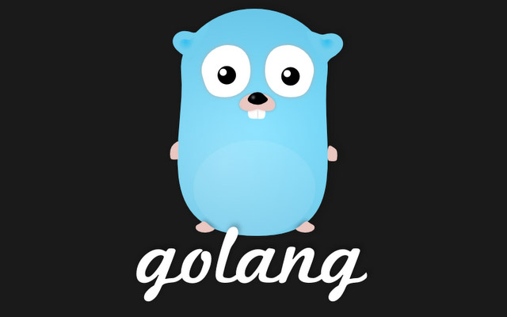

# Writing Hyperledger Fabric Chaincode Using Go Programming Language
## Build smart contracts for blockchain applications in Hyperledger Fabric

mattumd

Tags: Cloud computing, Continuous engineering, Linux, Web Development

Published on June 28, 2019 / Updated on May 17, 2021

### Overview

Skill Level: Intermediate

In this recipe,we show you how to build chaincode or smart contracts step-by-step in Hyperledger Fabric using Golang.

### Ingredients

To follow and complete this recipe, you need to have good knowledge of blockchain, Hyperledger transactions, Golang, JavaScript as well as basic knowledge of Linux.

### Step-by-step

#### 1. Hyperledger Fabric Overview and Recipe Outline

Hyperledger Fabric is an open source enterprise-grade platform that leverages a highly-modular and configurable architecture. Hyperledger Fabric is optimized for a broad range of industry use cases, including the finance, banking, healthcare, insurance, and public sectors, as well as supply chains and digital asset management.  

For those who are not familiar with Hyperledger project [Intro to Hyperledger Family and Hyperledger Blockchain Ecosystem](https://weg2g.com/application/touchstonewords/article-intro-to-hyperledger-family-and-hyperledger-blockchain-ecosystem.php), [Hyperledger Design Philosophy and Framework Architecture](https://weg2g.com/application/touchstonewords/article-overview-of-hyperledger-design-philosophy-and-framework-architecture.php), [The Survey of Hyperledger Fabric Architecture and Components for Blockchain Developers](https://weg2g.com/application/touchstonewords/article-the-survey-of-hyperledger-fabric-architecture-and-components-for-blockchain-developers.php) and [Overview of Building Blockchain Smart Contracts in Hyperledger](https://weg2g.com/application/touchstonewords/article-overview-of-building-blockchain-smart-contracts-in-hyperledger.php) articles are strongly recommended.  

Hyperledger Fabric supports Smart Contact development in general-purpose programming languages, such as JavaScript, Java, Go, and Node.js. Hyperledger Fabric is also operating under a governance model to build trust between participants on a shared network.  

We have written two sets of tutorials to explore Hyperledger Fabric in depth. First set covered the following six recipes:  

It started with [installing Hyperledger Fabric on an AWS EC2 virtual machine](https://myhsts.org/tutorial-learn-how-to-install-blockchain-hyperledger-fabric-on-amazon-web-services.php), setting up the first Hyperledger Fabric network and [working with Hyperledger Fabric Command Line Interface or CLI](https://myhsts.org/tutorial-learn-how-to-work-with-hyperledger-fabric-cli-to-setup-network-and-manage-chaincode.php). We learned the following:

*   Generating the crypto/certificate using cryptogen
*   Generating the configuration transaction using configtxgen
*   Bring up the nodes based on what is defined in the docker-compose file
*   Using the CLI to set up the first network
*   Using the CLI to install and instantiate the chaincode
*   Using the CLI to invoke and query the chaincode

We moved on to show you how to [Add New Network to a Channel](https://myhsts.org/tutorial-learn-how-to-add-organization-to-channel-in-hyperledger-fabric.php), Use CouchDB as a State Database for Hyperledger Fabric, and [Create a Smart Contract and then Deploy it into the Blockchain](https://myhsts.org/tutorial-learn-how-to-write-first-blockchain-application-in-hyperledger-fabric.php).  

In short, in the previous recipes, we learned about how to set up and configure Hyperledger Fabric. We explored its key components, including channels, **Membership Service Providers** (**MSPs**), the ordering service, and Fabric **Certificate Authority** (**CA**).  

The second set, we will show you how to build a simple device asset management DApp. It consists of 6 recipes as follows:

*   [Reviewing of inventory asset management and chaincode](https://myhsts.org/tutorial-learn-how-to-implement-hyperledger-fabric-via-inventory-asset-management-application.php)
*   Writing chaincode as a smart contract using Go
*   [Compiling and deploying Fabric chaincode](https://myhsts.org/tutorial-learn-how-to-compile-and-deploy-hyperledger-fabric-chaincode-and-smart-contracts.php)
*   Running and testing the smart contract
*   [Designing front-end of an application with Hyperledger Fabric through the SDK](https://myhsts.org/tutorial-learn-how-to-design-front-end-application-with-hyperledger-fabric-through-sdk.php)
*   Developing back-end of an application with Hyperledger Fabric through the SDK

In summary, in the second set of recipes, we are going to build a simple device asset management DApp. We will exploit this example by writing chaincode implemented by various programming languages and we'll also build, test, and deploy our DApp.  

**_IMPORTANT: Understanding and completing the first set of recipes are required prior to working on second set of recipes._**

#### 2. Writing Chaincode as a Smart Contract

Chaincode in Hyperledger Fabric is similar to smart contracts. It is a program that implements the business logic and is run on top of blockchain. The application can interact with the blockchain by invoking chaincode to manage the ledger state and keep the transaction record in the ledger. This chaincode needs to be installed on each endorsing peer node that runs in a secured Docker container. The Hyperledger Fabric chaincode can be programmed in Go, Node.js, and Java.  

Every chaincode program must implement the Chaincode interface. In this recipe, we will explore chaincode implementation using Go.

#### 3. Writing Chaincode Using Go

Every chaincode needs to implement a Chaincode interface. There are two methods defined in the interface:

type Chaincode interface {

Init (stub ChaincodeStubInterface) pb.Response Invoke (stub ChaincodeStubInterface) pb.Response

}

Here, the Init method is called to allow the chaincode to create an initial state and the data initialization after the chaincode container has been established for the first time. The Invoke method is called to interact with the ledger (to query or update the asset) in the proposed transaction.  

ChaincodeStubInterface provides the API for apps to access and modify their ledgers. Here are some important APIs:

type ChaincodeStubInterface interface {

InvokeChaincode(chaincodeName string, args \[\]\[\]byte, channel string)

pb.Response

GetState(key string) (\[\]byte, error)

PutState(key string, value \[\]byte) error

DelState(key string) error

GetQueryResult(query string) (StateQueryIteratorInterface, error)

GetTxTimestamp() (\*timestamp.Timestamp, error)

GetTxID() string

GetChannelID() string

}

Examples of important APIs include the following:

*   InvokeChaincode: Calls the chaincode function
*   GetState: Returns the value of the specified key from the ledger
*   PutState: Adds the key and the value to the ledger

Now that we understand some basic chaincode APIs, let's start to write our chaincode for IT asset management.

#### 4. IT Asset Management Chaincode

We will implement our school IT-asset management system using chaincode, and define the Asset object, and the Init, Invoke, and query functions. To do this, follow these steps:

1\. Since we will use Go to write chaincode, install it in Unix (Ubuntu). Make sure Go version 1.10.x is installed. If you haven't yet installed Go, run the following command:

**wget https://dl.google.com/go/go1.11.4.linux-amd64.tar.gz sudo tar -zxvf go1.11.4.linux-amd64.tar.gz -C /usr/local/**

2\. Create a local folder called itasset and navigate to that folder:  
**mkdir ~/itasset && cd ~/itasset**

3\. To set up the PATH variable for Go, enter the following command:  
**ubuntu@ip-172-31-0-111:~$ export GOPATH=/home/ubuntu/itasset/ ubuntu@ip-172-31-0-111:~$ export PATH=/usr/local/go/bin:$GOPATH/bin/:$PATH ubuntu@ip-172-31-0-111:~$ cd /home/ubuntu/itasset/ ubuntu@ip-172-31-0-111:~/itasset$ mkdir -p $GOPATH/src/assetmgr ubuntu@ip-172-31-0-111:~/itasset$ cd $GOPATH/src/assetmgr**

4\. Create the chaincode source file, assetmgr.go, for writing IT asset management:  
**touch assetmgr.go**

5\. Our assetmgr chaincode needs to implement the Chaincode interface and the business functions for IT asset management. As we discussed in the previous section, we will implement three chaincode functions in blockchain, shown as follows:

**Order: function called by school administer to order a device from**

**OEM**

**Ship: function called by OEM to transport the device to school Distribute: function called by School to distribute the device to students.**

Once the student receives the device, the asset management process is completed. We will keep track of the device's asset information, so we also need to define the device with related tracking information in the chaincode.

6\. Based on our chaincode implementation analysis, let's define the skeleton of the AssetMgr chaincode. Define the import section:

package main

import (

"encoding/json"

"fmt"

"github.com/hyperledger/fabric/core/chaincode/shim"

pb "github.com/hyperledger/fabric/protos/peer"

)

type AssetMgr struct {

}

7\. Define the asset:

//define organization asset information, the record can be trace in bloackchain

type OrgAsset struct {

}

8\. Define the Init and Invoke methods:

func (c \*AssetMgr) Init(stub shim.ChaincodeStubInterface)

pb.Response {

return shim.Success(nil)

}

func (c \*AssetMgr) Invoke(stub shim.ChaincodeStubInterface)

pb.Response {

return shim.Error("Invalid function name")

}

func (c \*AssetMgr) Order(stub shim.ChaincodeStubInterface, args

\[\]string) pb.Response {

}

func (c \*AssetMgr) Ship(stub shim.ChaincodeStubInterface, args

\[\]string) pb.Response {

}

func (c \*AssetMgr) Distribute(stub shim.ChaincodeStubInterface,

args \[\]string) pb.Response {

}

9\. Define the chaincode's main function:

func main() {

err := shim.Start(new(AssetMgr))

if err != nil {

fmt.Printf("Error creating new

AssetMgr Contract: %s", err)

}

}

We have now defined our AssetMgr skeleton. Next, we need to implement all of these unimplemented functions in our chaincode. We will start by defining the OrgAsset entity.

**Set OrgAsset Entity**  

All assets should have an Id field to identify them. Each device also has a physical device ID (DeviceId) that indicates the type of device, such as iPhone, iPad, or macOS. During the IT asset management flow process, the device is transferred from one entity to another, and the Location of the device keeps changing. Each processor may want to enter Comment to provide additional information at each step. Based on this, we can define the OrgAsset entity as follows:

type OrgAsset struct {  
Id string \`json:"id"\` //the assetId  
AssetType string \`json:"assetType"\` //type of device  
Status string \`json:"status"\` //status of asset  
Location string \`json:"location"\` //device location  
DeviceId string \`json:"deviceId"\` //DeviceId  
Comment string \`json:"comment"\` //comment  
From string \`json:"from"\` //from  
To string \`json:"to"\` //to  
}

After we have defined the OrgAsset entity, we will take a look at the implementation of the Init function.

**Set Init Function**  

The implementation of our Init function is as follows:

func (c \*AssetMgr) Init(stub shim.ChaincodeStubInterface) pb.Response { args := stub.GetStringArgs()

if len(args) != 3 {

return shim.Error("Incorrect arguments. Expecting a key and a value")}

assetId := args\[0\]

assetType := args\[1\]

deviceId := args\[2\]

//create asset

assetData := OrgAsset{

Id: assetId,

AssetType: assetType,

Status: "START",

Location: "N/A",

DeviceId: deviceId,

Comment: "Initialized asset",

From: "N/A",

To: "N/A"}

assetBytes, \_ := json.Marshal(assetData) assetErr := stub.PutState(assetId, assetBytes) if assetErr != nil {

return shim.Error(fmt.Sprintf("Failed to create asset: %s", args\[0\]))

}

return shim.Success(nil)

}

func (c \*AssetMgr) Init(stub shim.ChaincodeStubInterface) pb.Response { args := stub.GetStringArgs()

assetId := args\[0\] assetType := args\[1\]

deviceId := args\[2\]

//create asset

assetData := OrgAsset{Id: assetId,AssetType:

assetType, Status: "START",Location:

"N/A",DeviceId:

deviceId,Comment: "Initialized asset",From: "N/A", To:

"N/A"}

assetBytes, \_ := json.Marshal(assetData)

assetErr := stub.PutState(assetId, assetBytes)

…

return shim.Success(nil)

}

**Set Invoke Function**  

The implementation of the Invoke function is as follows:  

func (c \*AssetMgr) Invoke(stub shim.ChaincodeStubInterface) pb.Response { function, args := stub.GetFunctionAndParameters()  
if function == "Order" {  
return c.Order(stub, args)  
} else if function == "Ship" {  
return c.Ship(stub, args)  
} else if function == "Distribute" {  
return c.Distribute(stub, args)  
} else if function == "query" {  
return c.query(stub, args)  
} else if function == "getHistory" {  
return c.getHistory(stub, args)  
}  
return shim.Error("Invalid function name")  
}  

The Order, Ship, and Distribute functions will be quite similar. These will update the ledger state. We will use order() as an example to show how we implement the chaincode function:

func (c \*AssetMgr) Order(stub shim.ChaincodeStubInterface, args \[\]string) pb.Response {

return c.UpdateAsset(stub, args, "ORDER", "SCHOOL", "OEM")

}

Here is the UpdateAsset function:

func (c \*AssetMgr) UpdateAsset(stub shim.ChaincodeStubInterface, args \[\]string, currentStatus string, from string, to string) pb.Response { assetId := args\[0\] comment := args\[1\]

location := args\[2\]

assetBytes, err := stub.GetState(assetId)

orgAsset := OrgAsset{}

…

if currentStatus == "ORDER" && orgAsset.Status != "START" { return shim.Error(err.Error())

} else if currentStatus == "SHIP" && orgAsset.Status !=

"ORDER" {.}

else if currentStatus == "DISTRIBUTE" && orgAsset.Status != "SHIP" {.} orgAsset.Comment = comment

orgAsset.Status = currentStatus

….  
orgAsset0, \_ := json.Marshal(orgAsset)

err = stub.PutState(assetId, orgAsset0)

…

return shim.Success(orgAsset0)

}

**Set Query and GetHistory Functions**  

ChaincodeStubInterface provides GetState, query functions. We can call these functions by passing assetId. This will trigger chaincode to get the corresponding result.  

The getHistory function is used to view the records returned from the transaction history; all records are associated with assetId. Each record contains a related transaction ID and timestamp. With the timestamp, we know when the asset status was updated in the past.

Once the data is saved to blockchain, the application needs to query the chaincode data to check the OrgAsset information, shown as follows:  

func (c \*AssetMgr) getHistory(stub shim.ChaincodeStubInterface,args \[\]string) pb.Response {

type AuditHistory struct {

TxId string \`json:"txId"\`

Value OrgAsset \`json:"value"\`

}

var history \[\]AuditHistory

var orgAsset OrgAsset

assetId := args\[0\]

// Get History

resultsIterator, err := stub.GetHistoryForKey(assetId)

defer resultsIterator.Close()

for resultsIterator.HasNext() {

historyData, err := resultsIterator.Next()

var tx AuditHistory

tx.TxId = historyData.TxId json.Unmarshal(historyData.Value, &orgAsset)

tx.Value = orgAsset //copy

orgAsset over

history = append(history, tx) //add this tx

to the list

}

..

}

#### 5. Put Things Together

Let's now take a closer look at what happens in each function in detail.

**The Init Function**  
The Init function is called when the chaincode is instantiated by the blockchain network and the function initializes the asset management data. In this function, we need to set up the OrgAsset initialization information. The three parameters we pass to call the Init function are assetId, assetType, and deviceId. This will set our device asset information, then we call the PutState(key, value) method to store the key and the value on the ledger.

**The Invoke Function**

The Invoke function is called when the client invokes a specific function to process the transaction proposal. The ChaincodeStubInterface interface has the GetFunctionAndParameters method. This method extracts the function name and arguments and dispatches code to different functions based on the first argument. In our assetmgr, we need to call the Order, Ship, and Distribute functions, and then update the status for each step and the orgAsset information in the ledger. We can also define the query and query history functions, to get orgAsset information from the ledger.  
You will notice that the Order method passes parameters from the command-line input. We use stub.GetState(assetId) to query the asset data from the blockchain, then we verify to make sure the current asset status is correct. We update the orgAsset info and then convert the asset data to byte data by calling json.Marshal(orgAsset). Finally, we save the data into the blockchain via stub.PutState. If there are no errors, the function will return a successful response to the client.

**The query function**  
ChaincodeStubInterface defines the GetState method. The query function simply calls this function by passing assetId. This will trigger the chaincode to get the corresponding result.  
All records returned from the transaction history are associated with assetId. Each record contains a related transaction ID and a timestamp. The timestamp tells us when the asset status was updated.

So far we learned how to write chaincode as a smart contract for inventory asset management application using Go. In the next recipe, we will compile and deploy our Fabric chaincode.  
This recipe is written by Matt Zand (the CEO of Hash Flow- offering [blockchain consulting and development services](https://www.hashflow.us "Hash Flow")) in collaboration with Brian Wu who is a senior Hyperledger instructor at [Coding Bootcamps](https://coding-bootcamps.com/) school in Washington DC.
